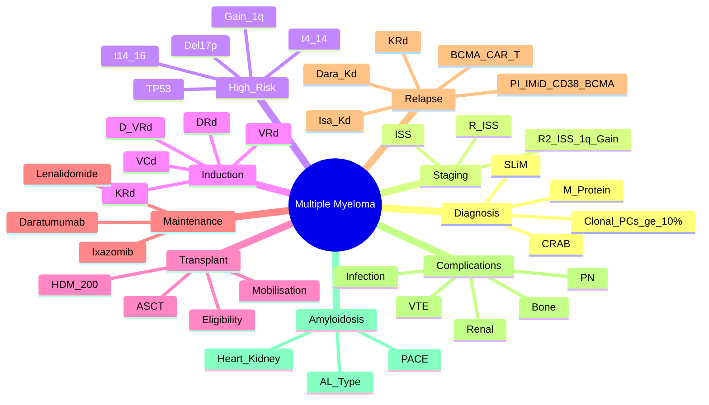

> [!tip] **FCPS/MRCP Priority: CRITICAL**
> MM = **Clonal plasma cell disorder** — **CRAB criteria** (Hypercalcaemia, Renal failure, Anaemia, Bone lesions). **SLiM criteria** for asymptomatic. **Proteasome Inhibitors (Bortezomib), IMiDs (Lenalidomide), Anti-CD38 (Daratumumab), Anti-BCMA (Teclistamab, CAR-T)** revolutionised treatment. **ASCT eligible vs ineligible** pathways.

---

## 1. 1. Learning Objectives
By the end of this note you should be able to:
- [ ] Apply **CRAB / SLiM criteria** for diagnosis
- [ ] Stage using **ISS / R-ISS / R2-ISS**
- [ ] Risk-stratify by **cytogenetics (del17p, t(4;14), t(14;16), gain 1q, TP53)**
- [ ] Select **induction (VRd, DVR, KRd, D-VRd)** → **ASCT eligibility** → **Maintenance**
- [ ] Manage **relapse** (PI, IMiD, Anti-CD38, Anti-BCMA, CAR-T sequencimg)
- [ ] Manage **complications**: Bone disease, Renal failure, Infection, Neuropathy

---

## 2. 2. Definition & Diagnostic Criteria — **CRAB / SLiM**

| Criteria | Definition |
|----------|------------|
| **Clonal Plasma Cells** | **≥10%** in BM or **biopsy-proven plasmacytoma** |
| **Monoclonal Protein (M-protein)** | **Serum/Urinary M-spike** (IgG > IgA > Light chain only) |
| **CRAB Criteria (Symptomatic MM)** | **C**alcium ↑ (>2.75 mmol/L), **R**enal failure (Cr >177), **A**naemia (Hb <10 or ↓2g), **B**one lesions (lytic on imaging) |
| **SLiM Criteria (Biomarkers of Malignancy)** | **S**iM: **≥60% clonal plasma cells** in BM; **L**ight chain ratio **≥100**; **M**RI **>1 focal lesion** |

> [!critical] **Diagnosis = Clonal PCs ≥10% + ≥1 CRAB or SLiM criterion**

---

## 3. 3. Staging — **ISS / R-ISS / R2-ISS**

| Stage | ISS | R-ISS | R2-ISS |
|-------|-----|-------|--------|
| **I** | β2M <3.5, Alb ≥35 | Stage I + **No high-risk cytogenetics, LDH normal** | R-ISS I + **No 1q gain** |
| **II** | Not I or III | Not I or III | Not I or III |
| **III** | **β2M >5.5** | Stage II + **High-risk cytogenetics (del17p, t(4;14), t(14;16)) or LDH >ULN** | Stage II + **1q gain** |

| Stage | Median OS (R-ISS) |
|-------|-------------------|
| **I** | Not reached (>10 yr) |
| **II** | ~8 years |
| **III** | ~3-4 years |

> [!critical] **High-Risk Cytogenetics (R-ISS)**: **del17p, t(4;14), t(14;16)** — **Adverse**; **gain 1q** adds risk in R2-ISS

---

## 4. 4. Prognostic Markers — **High-Yield**

| Marker | Standard Risk | High Risk | Clinical Action |
|--------|---------------|-----------|-----------------|
| **FISH Cytogenetics** | **t(11;14), Hyperdiploidy** | **del17p, t(4;14), t(14;16), gain 1q, TP53mut** | **High-risk = Intensified therapy, early ASCT, early novel agents** |
| **ISS / R-ISS** | Stage I/II | Stage III | Risk-adapted therapy |
| **Circulating PCs** | <5% | **>5%** | Poor prognosis |
| **LDH** | Normal | **Elevated** | Poor prognosis |
| **Extramedullary Disease** | Absent | **Present** | Poor prognosis |

> [!critical] **High-Risk Cytogenetics = "Double-Hit" = del17p + t(4;14) = Ultra-high risk**

---

## 5. 5. Treatment Algorithm — **Transplant Eligible vs Ineligible**

```mermaid
flowchart TD
    A[Newly Diagnosed MM] --> B{Transplant Eligible?}
    B -->|Yes (Age <70-75, Fit, Adequate Organs)| C[**Induction: 3-4 Cycles**\n**VRd** (Bortezomib + Lenalidomide + Dex) **Standard**\n**D-VRd** (Daratumumab + VRd) **PERSEUS: Superior PFS**\n**KRd** (Carfilzomib + Len + Dex) **ENDEAVOR**]
    B -->|Ineligible (Age >75, Frail, Comorbid)| D[**Non-Transplant**\n**DRd** (Dara + Len + Dex) **MAIA: Superior PFS**\n**VRd-lite** / **VRd** (fit) / **Rd** (Frail)]
    C --> E[**Stem Cell Collection**\nG-CSF ± Plerixafor → **2-4×10⁶ CD34+/kg**\nTarget >2×10⁶/kg]
    E --> F[**High-Dose Melphalan 200mg/m² (HDM)**\nASCT → Engraftment → Recovery]
    F --> G{**Post-ASCT Consolidation**}
    G -->|High Risk / No MRD-neg| H[**Consolidation: 2-4 cycles VRd/KRd/D-VRd**]
    G -->|Standard Risk / MRD-neg| I[**Maintenance**]
    I --> J[**Maintenance Lenalidomide**\n10-15mg daily until progression\n**IFM: Until progression**\n**CALGB: 1yr then stop**]
    D --> J
```

---

## 6. 6. Induction Regimens — **High-Yield**

| Regimen | Components | Key Trials | Indication |
|---------|------------|------------|------------|
| **VRd** | **Bortezomib 1.3mg/m² D1,4,8,11 + Lenalidomide 25mg D1-21 + Dex 20mg/40mg** | SWOG S0777 | **Standard 1L fit** |
| **D-VRd** | **Daratumumab 16mg/kg + VRd** | **PERSEUS** (D-VRd → ASCT → Dara maintenance) | **New Standard 1L Fit** |
| **KRd** | **Carfilzomib 20/56mg/m² + Lenalidomide + Dex** | **ENDEAVOR** (KRd > Vd) | High-risk, Renal impairment |
| **DRd** | **Daratumumab + Lenalidomide + Dex** | **MAIA** (Ineligible) | **1L Ineligible** |
| **VCd / VCd-D** | Bortezomib + Cyclophosphamide + Dex ± Dara | **ANDROMEDA** (AL Amyloidosis); **CYCLONE** (Relapse) | Alternative |

> [!critical] **D-VRd + ASCT → Dara Maintenance = New Standard of Care (PERSEUS)**

---

## 7. 7. Autologous Stem Cell Transplant (ASCT)

| Step | Detail |
|------|--------|
| **Mobilisation** | **G-CSF 10µg/kg/day ×4-5d** ± **Plerixafor 240mcg/kg** (if poor mobiliser) |
| **Target CD34+** | **≥2×10⁶/kg** (minimum), **4-6×10⁶/kg ideal** |
| **Conditioning** | **Melphalan 200mg/m²** (HDM) — **Single** (Standard); **Tandem** (historical) |
| **Engraftment** | **Neutrophils >0.5×10⁹/L by D10-14**; Platelets >20k by D14-21 |
| **Peri-transplant** | **PJP Prophylaxis (Cotrimoxazole), Aciclovir, Fluconazole, G-CSF support** |

> [!critical] **ASCT = Standard of Care for Transplant-Eligible** — **Improves PFS/OS** (IFM, MRC, EMN trials)

---

## 8. 8. Maintenance Therapy — **Post-ASCT & Non-Transplant**

| Agent | Dose | Duration | Key Trials |
|-------|------|----------|------------|
| **Lenalidomide** | **10-15mg daily** (adjust for renal) | **Until Progression** (IFM: until progression; CALGB: 1yr then stop) | **CALGB 100104, IFM 2005-02, Myeloma XI** |
| **Daratumumab Maintenance** | **16mg/kg q4wk** | **Until Progression** | **PERSEUS** (DRd → ASCT → Dara Maint) |
| **Ixazomib Maintenance** | **4mg D1,8,15 q28d** | Until Progression | **TOURMALINE-MM3** |

> [!critical] **Lenalidomide Maintenance = Standard** — **PFS/OS benefit**; **SPM risk (AML/MDS) ~3-5%**

---

## 9. 9. Relapsed/Refractory MM — **Sequencing is Key**

```mermaid
flowchart TD
    A[Relapsed MM] --> B{Number of Prior Lines}
    B -->|1st Relapse| C[**PI + IMiD + Anti-CD38**\n**Dara-Kd** (CANDOR) **OR DVRd** (CASSIOPEIA-R)\n**KRd** (ASPIRE) **OR Isa-Kd** (ICARIA)]
    B -->|2nd+ Relapse| D{Exposed to PI/IMiD/CD38}
    D -->|PI + IMiD Naive| E[**Dara-Kd / DVRd / KRd**]
    D -->|PI + IMiD Exposed| F{Anti-CD38 Exposed?}
    F -->|No| G[**Anti-CD38 + PI/IMiD**\n**Isa-Kd, Dara-Kd**]
    F -->|Yes (Triple-Class Exposed)| H[**Anti-BCMA**\n**Teclistamab (MajesTEC-1)**\n**Elranatamab (MagnetisMM-3)**\nCAR-T: **Ide-cel, Cilta-cel**\n**Selinexor + Dex** (STORM)]
```

### 1. Key Relapsed Regimens
| Line | Regimen | Key Trial |
|------|---------|-----------|
| **1st Relapse** | **Dara-Kd, DVRd, KRd, Isa-Kd** | CANDOR, CASSIOPEIA-R, ASPIRE, ICARIA |
| **2nd Relapse** | **Isa-Kd, Elo-D, Selinexor+Dex, Panobinostat** | ICARIA, ELOQUENT, STORM, PANORAMA |
| **Triple-Class Exposed** | **Teclistamab (BiTE), Elranatamab (BiTE), CAR-T (Ide-cel, Cilta-cel), Selinexor** | MajesTEC-1, MagnetisMM-3, CARTITUDE, STORM |

> [!critical] **Sequencing Principle**: **PI → IMiD → Anti-CD38 → Anti-BCMA/CAR-T** — **Sequence by mechanism, avoid re-challenge**

---

## 10. 10. Complications — **High-Yield**

| Complication | Management |
|--------------|------------|
| **Bone Disease** | **Bisphosphonate (Zoledronate 4mg q3-4mo) or Denosumab 120mg q4wk** — **Ca/Vit D essential** |
| **Renal Failure** | **Hydration, Avoid NSAIDs, Bortezomib (safe), Dose-adjust IMID / Dara**, **Plasma Exchange if Cast Nephropathy** |
| **Peripheral Neuropathy** | **Bortezomib (Grade 2+ → hold/reduce/subcutaneous)**, **Ixazomib (less PN)** |
| **Infection** | **IVIG if IgG<4 + recurrent**, **PJP/Herpes Prophylaxis**, **Vaccines (Inactivated only)** |
| **VTE** | **Lenalidomide/Carfilzomib/Dara → LMWH Prophylaxis** (esp. IMWG risk factors) |

---

## 11. 11. High-Risk Features & R-ISS

| High-Risk Feature | Definition |
|-------------------|------------|
| **del17p** | **FISH** — **Most adverse** |
| **t(4;14)** | **FISH** — **Adverse** |
| **t(14;16)** | **FISH** — **Adverse** |
| **gain 1q** | **FISH** — **Adverse (R2-ISS)** |
| **TP53 mut** | **NGS** — **Very adverse** |
| **High LDH** | **>ULN** — Poor prognosis |
| **Circulating PCs >5%** | **Flow** — Poor prognosis |

---

## 12. 12. FCPS/MRCP High-Yield Summary

| Topic | Key Points |
|-------|------------|
| **Diagnosis** | **CRAB / SLiM** + **≥10% clonal PCs + M-protein** |
| **Staging** | **R-ISS**: β2M, Alb, High-risk cytogenetics (del17p, t(4;14), t(14;16), LDH) |
| **High-Risk Cytogenetics** | **del17p, t(4;14), t(14;16), gain 1q, TP53mut** — **Adverse** |
| **Transplant Eligible** | **D-VRd (PERSEUS)** → **ASCT** → **Dara Maintenance (PERSEUS)** |
| **Transplant Ineligible** | **DRd (MAIA)** or **VRd-lite** |
| **Maintenance** | **Lenalidomide until progression** (preferred); **Dara Maint (PERSEUS)** |
| **Relapse Sequencing** | **PI → IMiD → Anti-CD38 → Anti-BCMA/CAR-T** |
| **1st Relapse** | **Dara-Kd, DVRd, KRd, Isa-Kd** |
| **Triple-Class Exposed** | **Anti-BCMA: Teclistamab, Elranatamab; CAR-T (Ide-cel, Cilta-cel); Selinexor** |
| **Bone Disease** | **Zoledronate/Denosumab + Ca/Vit D** |
| **Renal Impairment** | **Bortezomib safe; Dose-adjust Len/Dara; PLEX for cast nephropathy** |
| **VTE Prophylaxis** | **LMWH for Len/Carfilzomib/Dara + Risk factors** |

---

## 13. 13. Viva Questions (MRCP PACES / FCPS)

| Question | Expected Answer |
|----------|----------------|
| "What are the CRAB criteria for multiple myeloma?" | **C**alcium >2.75, **R**enal (Cr>177), **A**naemia (Hb<10), **B**one lesions (lytic) |
| "What are the SLiM criteria?" | **S**: ≥60% clonal PCs; **L**: Light chain ratio ≥100; **M**: MRI >1 focal lesion |
| "What is R-ISS staging?" | **ISS + High-risk cytogenetics (del17p, t(4;14), t(14;16)) + LDH** → Stage I/II/III |
| "What are high-risk cytogenetics in myeloma?" | **del17p, t(4;14), t(14;16), gain 1q, TP53mut** |
| "What is the standard induction for transplant-eligible myeloma?" | **VRd (Bortezomib + Lenalidomide + Dex) — D-VRd (Daratumumab + VRd) is new standard (PERSEUS)** |
| "What is the standard maintenance after ASCT?" | **Lenalidomide 10-15mg daily until progression** (IFM: indefinite; CALGB: 1yr) |
| "What is the PERSEUS trial regimen?" | **D-VRd induction → ASCT → Dara maintenance** — improved PFS vs VRd |
| "How do you manage relapsed myeloma?" | **Sequence: PI → IMiD → Anti-CD38 → Anti-BCMA/CAR-T**; avoid re-challenge same class |
| "What is the role of daratumumab in myeloma?" | **Anti-CD38 mAb** — **1L (D-VRd, DRd), Maintenance (PERSEUS/CASSIOPEIA), Relapse (Dara-Kd, DVRd)** |
| "How do you manage renal failure in myeloma?" | **Hydration, Bortezomib (safe), Dose-adjust Len/Dara, Avoid NSAIDs, Plasmapheresis for cast nephropathy** |
| "What is the role of bisphosphonates in myeloma?" | **Zoledronate 4mg q3-4mo or Denosumab 120mg q4wk** — prevent SREs; Ca/Vit D essential |

---

## 14. 14. Confusions & Mnemonics

| Confusion | Clarification |
|-----------|---------------|
| **ISS vs R-ISS** | **ISS**: β2M, Alb; **R-ISS = ISS + High-risk cytogenetics + LDH** |
| **Transplant Eligible vs Ineligible** | **<70-75y, Fit, Adequate Organs** = Eligible; **>75, Frail, Major Comorbidity** = Ineligible |
| **D-VRd vs VRd** | **D-VRd = VRd + Daratumumab** — **PERSEUS: Superior PFS/OS** |
| **VRd vs KRd vs DRd** | **VRd**: Standard; **KRd**: High-risk, Renal; **DRd**: Ineligible, Frail |
| **Maintenance Duration** | **IFM: Until progression**; **CALGB: 1yr then stop** — **Until Progression preferred** |
| **Triple-Class Refractory** | **Exposed to PI + IMiD + Anti-CD38** → **Anti-BCMA (Teclistamab/Tecvayli, Elranatamab/Elrexfio, CAR-T)** |
| **BCMA Targets** | **Teclistamab (BiTE), Elranatamab (BiTE), Cilta-cel/Ide-cel (CAR-T), Selinexor** |
| **AL Amyloidosis vs Myeloma** | **AL = Light chain amyloid, Organ involvement (Heart, Kidney, Liver), No CRAB** |

**Mnemonic: CRAB = "C-R-A-B"**
- **C**alcium
- **R**enal
- **A**naemia
- **B**one

**Mnemonic: SLiM = "S-L-I-M"**
- **S**ixty percent PCs
- **L**ight chain ratio ≥100
- **I**maging (MRI >1 lesion)
- **M** = **M**arker of malignancy

**Mnemonic: R-ISS = "ISS + CYTOGENETICS + LDH"**
- **I**SS
- **S**tage
- **S** = **Cytogenetics (del17p, t(4;14), t(14;16)) + LDH**

**Mnemonic: High-Risk Cytogenetics = "DEL17 T414 T1416 1Q TP53"**
- **DEL17**p
- **T**(4;14)
- **T**(14;16)
- **1Q** gain
- **TP53** mut

**Mnemonic: Treatment = "VRd → ASCT → MAINT"**
- **V**Rd induction
- **A**SCT
- **M**aintenance (Len)

**Mnemonic: Relapse Sequence = "PI → IMiD → CD38 → BCMA"**
- **P**roteasome Inhibitor (Bortezomib, Carfilzomib)
- **I**MiD (Lenalidomide, Pomalidomide)
- **C**D38 (Daratumumab, Isatuximab)
- **B**CMA (Teclistamab, CAR-T, Selinexor)

---

## 15. 15. Mind Map



---

## 16. 16. One-Page Revision Card

| Domain | Key Points |
|--------|------------|
| **Diagnosis** | **CRAB + SLiM** + **≥10% clonal PCs + M-protein** |
| **Staging** | **R-ISS**: ISS + **High-risk cytogenetics (del17p, t(4;14), t(14;16)) + LDH** |
| **High-Risk** | **del17p, t(4;14), t(14;16), gain 1q, TP53mut** |
| **Induction** | **VRd Standard**; **D-VRd (PERSEUS) = New Standard**; **DRd (Ineligible)** |
| **ASCT** | **HDM 200 → ASCT** → **Maintenance** |
| **Maintenance** | **Lenalidomide until progression** (preferred); **Dara Maint (PERSEUS)** |
| **Relapse Sequencing** | **PI → IMiD → Anti-CD38 → Anti-BCMA/CAR-T** |
| **Triple-Class Refractory** | **Anti-BCMA (Teclistamab, Elranatamab, CAR-T) / Selinexor** |
| **Bone Disease** | **Zoledronate/Denosumab + Ca/Vit D** |
| **Renal** | **Bortezomib safe; Adjust IMIDs; PLEX for cast nephropathy** |

---

## 17. 17. Spaced Repetition Trackers

| Review Interval | Date Completed | Confidence (1-5) | Notes |
|-----------------|----------------|------------------|-------|
| 24 hours | | | |
| 7 days | | | |
| 15 days | | | |
| 30 days | | | |
| 90 days | | | |

---

## 18. 18. Self-Test Scorecard

| Section | Score /5 | Last Attempt |
|---------|----------|--------------|
| CRAB/SLiM Diagnosis | | |
| R-ISS Staging | | |
| High-Risk Cytogenetics | | |
| Induction Regimen Selection | | |
| Transplant Eligibility & Process | | |
| Maintenance Strategy | | |
| Relapse Sequencing | | |
| Complication Management | | |
| Viva Questions | | |

---

## 19. 19. Local Navigation
- **Parent Heading**: [[../Haematological Malignancies|Haematological Malignancies]]
- **Parent Topic Group**: [[Plasma Cell Disorders]]
- **Chapter Map**: [[../Davidson Chapter 7 - Oncology Hierarchy|Oncology Hierarchy]]
- **Chapter MOC**: [[../Oncology MOC|Oncology MOC]]
- **Drug Reference**: [[../../Clinical Therapeutics and Good Prescribing|Drugs]]
- **Related**: [[MGUS]] · [[Amyloidosis]] · [[POEMS Syndrome]] · [[Bone Disease in Myeloma]]

---

# FCPS/MRCP Exam Extras

## 20. 20. MCQs (10)


**1.** Regarding Multiple Myeloma (Diagnosis), which statement is correct?
   A. **CRAB / SLiM** + **≥10% clonal PCs + M-protein**
   B. **CRAB - alternative approach
   C. Empirical management only
   D. Watch and wait
   - **Answer: A** — **CRAB / SLiM** + **≥10% clonal PCs + M-protein**


**2.** Regarding Multiple Myeloma (Staging), which statement is correct?
   A. **R-ISS**: β2M, Alb, High-risk cytogenetics (del17p, t(4
   B. **R-ISS**: - alternative approach
   C. Empirical management only
   D. Watch and wait
   - **Answer: A** — **R-ISS**: β2M, Alb, High-risk cytogenetics (del17p, t(4;14), t(14;16), LDH)


**3.** Regarding Multiple Myeloma (High-Risk Cytogenetics), which statement is correct?
   A. **del17p, t(4
   B. **del17p, - alternative approach
   C. Empirical management only
   D. Watch and wait
   - **Answer: A** — **del17p, t(4;14), t(14;16), gain 1q, TP53mut** — **Adverse**


**4.** Regarding Multiple Myeloma (Transplant Eligible), which statement is correct?
   A. **D-VRd (PERSEUS)** → **ASCT** → **Dara Maintenance (PERSEUS)**
   B. **D-VRd - alternative approach
   C. Empirical management only
   D. Watch and wait
   - **Answer: A** — **D-VRd (PERSEUS)** → **ASCT** → **Dara Maintenance (PERSEUS)**


**5.** Regarding Multiple Myeloma (Transplant Ineligible), which statement is correct?
   A. **DRd (MAIA)** or **VRd-lite**
   B. **DRd - alternative approach
   C. Empirical management only
   D. Watch and wait
   - **Answer: A** — **DRd (MAIA)** or **VRd-lite**


**6.** Regarding Multiple Myeloma (Maintenance), which statement is correct?
   A. **Lenalidomide until progression** (preferred)
   B. **Lenalidomide - alternative approach
   C. Empirical management only
   D. Watch and wait
   - **Answer: A** — **Lenalidomide until progression** (preferred); **Dara Maint (PERSEUS)**


**7.** Regarding Multiple Myeloma (Relapse Sequencing), which statement is correct?
   A. **PI → IMiD → Anti-CD38 → Anti-BCMA/CAR-T**
   B. **PI - alternative approach
   C. Empirical management only
   D. Watch and wait
   - **Answer: A** — **PI → IMiD → Anti-CD38 → Anti-BCMA/CAR-T**


**8.** Regarding Multiple Myeloma (1st Relapse), which statement is correct?
   A. **Dara-Kd, DVRd, KRd, Isa-Kd**
   B. **Dara-Kd, - alternative approach
   C. Empirical management only
   D. Watch and wait
   - **Answer: A** — **Dara-Kd, DVRd, KRd, Isa-Kd**


**9.** Regarding Multiple Myeloma (Triple-Class Exposed), which statement is correct?
   A. **Anti-BCMA: Teclistamab, Elranatamab
   B. **Anti-BCMA: - alternative approach
   C. Empirical management only
   D. Watch and wait
   - **Answer: A** — **Anti-BCMA: Teclistamab, Elranatamab; CAR-T (Ide-cel, Cilta-cel); Selinexor**


**10.** Regarding Multiple Myeloma (Bone Disease), which statement is correct?
   A. **Zoledronate/Denosumab + Ca/Vit D**
   B. **Zoledronate/Denosumab - alternative approach
   C. Empirical management only
   D. Watch and wait
   - **Answer: A** — **Zoledronate/Denosumab + Ca/Vit D**


## 21. 21. SBA Questions (10)


**1.** A 55-year-old presents with classic features. MDT discussion recommends:
   - A. **CRAB / SLiM** + **≥10% clonal PCs + M-protein**
   - B. **CRAB (less specific)
   - C. Empirical broad approach
   - D. No intervention required
   - **Answer: A** — first-line: **CRAB / SLiM** + **≥10% clonal PCs + M-protein**


**2.** On staging workup, the patient is found to be [Stage X]. Best management is:
   - A. **R-ISS**: β2M, Alb, High-risk cytogenetics (del17p, t(4
   - B. **R-ISS**: (less specific)
   - C. Empirical broad approach
   - D. No intervention required
   - **Answer: A** — stage-specific: **R-ISS**: β2M, Alb, High-risk cytogenetics (del17p, t(4;14), t(14;16), LDH)


**3.** Following first-line treatment, the patient develops [complication]. Best next step:
   - A. **del17p, t(4
   - B. **del17p, (less specific)
   - C. Empirical broad approach
   - D. No intervention required
   - **Answer: A** — complication: **del17p, t(4;14), t(14;16), gain 1q, TP53mut** — **Adverse**


**4.** The patient asks about prognosis. Most appropriate response based on:
   - A. **D-VRd (PERSEUS)** → **ASCT** → **Dara Maintenance (PERSEUS)**
   - B. **D-VRd (less specific)
   - C. Empirical broad approach
   - D. No intervention required
   - **Answer: A** — prognosis: **D-VRd (PERSEUS)** → **ASCT** → **Dara Maintenance (PERSEUS)**


**5.** A 65-year-old with relevant risk factors should be screened with:
   - A. **DRd (MAIA)** or **VRd-lite**
   - B. **DRd (less specific)
   - C. Empirical broad approach
   - D. No intervention required
   - **Answer: A** — screening: **DRd (MAIA)** or **VRd-lite**


**6.** The most clinically important biomarker/molecular test is:
   - A. **Lenalidomide until progression** (preferred)
   - B. **Lenalidomide (less specific)
   - C. Empirical broad approach
   - D. No intervention required
   - **Answer: A** — biomarker: **Lenalidomide until progression** (preferred); **Dara Maint (PERSEUS)**


**7.** The standard chemotherapy/regimen of choice is:
   - A. **PI → IMiD → Anti-CD38 → Anti-BCMA/CAR-T**
   - B. **PI (less specific)
   - C. Empirical broad approach
   - D. No intervention required
   - **Answer: A** — chemo: **PI → IMiD → Anti-CD38 → Anti-BCMA/CAR-T**


**8.** The role of surgery in this case is:
   - A. **Dara-Kd, DVRd, KRd, Isa-Kd**
   - B. **Dara-Kd, (less specific)
   - C. Empirical broad approach
   - D. No intervention required
   - **Answer: A** — surgery: **Dara-Kd, DVRd, KRd, Isa-Kd**


**9.** The recommended surveillance/follow-up protocol is:
   - A. **Anti-BCMA: Teclistamab, Elranatamab
   - B. **Anti-BCMA: (less specific)
   - C. Empirical broad approach
   - D. No intervention required
   - **Answer: A** — follow-up: **Anti-BCMA: Teclistamab, Elranatamab; CAR-T (Ide-cel, Cilta-cel); Selinexor**


**10.** Palliative care referral is most appropriate when:
   - A. **Zoledronate/Denosumab + Ca/Vit D**
   - B. **Zoledronate/Denosumab (less specific)
   - C. Empirical broad approach
   - D. No intervention required
   - **Answer: A** — palliative: **Zoledronate/Denosumab + Ca/Vit D**


## 22. 22. Flashcards

**Q1:** Diagnosis?
**A1:** CRAB / SLiM + ≥10% clonal PCs + M-protein

**Q2:** Staging?
**A2:** R-ISS: β2M, Alb, High-risk cytogenetics (del17p, t(4;14), t(14;16), LDH)

**Q3:** High-Risk Cytogenetics?
**A3:** del17p, t(4;14), t(14;16), gain 1q, TP53mut — Adverse

**Q4:** Transplant Eligible?
**A4:** D-VRd (PERSEUS) → ASCT → Dara Maintenance (PERSEUS)

**Q5:** Transplant Ineligible?
**A5:** DRd (MAIA) or VRd-lite

**Q6:** Maintenance?
**A6:** Lenalidomide until progression (preferred); Dara Maint (PERSEUS)

**Q7:** Relapse Sequencing?
**A7:** PI → IMiD → Anti-CD38 → Anti-BCMA/CAR-T

**Q8:** 1st Relapse?
**A8:** Dara-Kd, DVRd, KRd, Isa-Kd

## 23. 23. Answer Key with Explanations

| # | MCQ | Topic | Explanation |
|---|-----|-------|-------------|
| 1 | A | Diagnosis | CRAB / SLiM + ≥10% clonal PCs + M-protein |
| 2 | A | Staging | R-ISS: β2M, Alb, High-risk cytogenetics (del17p, t(4;14), t(14;16), LDH) |
| 3 | A | High-Risk Cytogenetics | del17p, t(4;14), t(14;16), gain 1q, TP53mut — Adverse |
| 4 | A | Transplant Eligible | D-VRd (PERSEUS) → ASCT → Dara Maintenance (PERSEUS) |
| 5 | A | Transplant Ineligible | DRd (MAIA) or VRd-lite |
| 6 | A | Maintenance | Lenalidomide until progression (preferred); Dara Maint (PERSEUS) |
| 7 | A | Relapse Sequencing | PI → IMiD → Anti-CD38 → Anti-BCMA/CAR-T |
| 8 | A | 1st Relapse | Dara-Kd, DVRd, KRd, Isa-Kd |
| 9 | A | Triple-Class Exposed | Anti-BCMA: Teclistamab, Elranatamab; CAR-T (Ide-cel, Cilta-cel); Selinexor |
| 10 | A | Bone Disease | Zoledronate/Denosumab + Ca/Vit D |

| # | SBA | Topic | Explanation |
|---|-----|-------|-------------|
| 1 | A | Diagnosis | CRAB / SLiM + ≥10% clonal PCs + M-protein |
| 2 | A | Staging | R-ISS: β2M, Alb, High-risk cytogenetics (del17p, t(4;14), t(14;16), LDH) |
| 3 | A | High-Risk Cytogenetics | del17p, t(4;14), t(14;16), gain 1q, TP53mut — Adverse |
| 4 | A | Transplant Eligible | D-VRd (PERSEUS) → ASCT → Dara Maintenance (PERSEUS) |
| 5 | A | Transplant Ineligible | DRd (MAIA) or VRd-lite |
| 6 | A | Maintenance | Lenalidomide until progression (preferred); Dara Maint (PERSEUS) |
| 7 | A | Relapse Sequencing | PI → IMiD → Anti-CD38 → Anti-BCMA/CAR-T |
| 8 | A | 1st Relapse | Dara-Kd, DVRd, KRd, Isa-Kd |
| 9 | A | Triple-Class Exposed | Anti-BCMA: Teclistamab, Elranatamab; CAR-T (Ide-cel, Cilta-cel); Selinexor |
| 10 | A | Bone Disease | Zoledronate/Denosumab + Ca/Vit D |

## 24. 24. Local Navigation


- **Parent Heading Hub**: [[../../Haematological Malignancies|Haematological Malignancies]]
- **Chapter Map**: [[../../Davidson Chapter 7 - Oncology Hierarchy|Oncology Hierarchy]]
- **Chapter MOC**: [[../../Oncology MOC|Oncology MOC]]
- **Drug Reference**: [[../../../Clinical Therapeutics and Good Prescribing|Drugs]]
---

> Auto-generated study sections for "Haematological Malignancies" — Ch 8: Oncology.

## Flashcards (37 generated)

- Q: What is the definition of Haematological Malignancies?
  A: MM = Clonal plasma cell disorder — CRAB criteria (Hypercalcaemia, Renal failure, Anaemia, Bone lesions).
- Q: What is Bone Disease of Haematological Malignancies?
  A: Bisphosphonate (Zoledronate 4mg q3-4mo) or Denosumab 120mg q4wk — Ca/Vit D essential
- Q: What is Renal Failure of Haematological Malignancies?
  A: Hydration, Avoid NSAIDs, Bortezomib (safe), Dose-adjust IMID / Dara, Plasma Exchange if Cast Nephropathy
- Q: What is Peripheral Neuropathy of Haematological Malignancies?
  A: Bortezomib (Grade 2+ → hold/reduce/subcutaneous), Ixazomib (less PN)
- Q: What is Infection of Haematological Malignancies?
  A: IVIG if IgG<4 + recurrent, PJP/Herpes Prophylaxis, Vaccines (Inactivated only)
- Q: What is VTE of Haematological Malignancies?
  A: Lenalidomide/Carfilzomib/Dara → LMWH Prophylaxis (esp. IMWG risk factors)
- Q: What is del17p of Haematological Malignancies?
  A: FISH — Most adverse
- Q: What is t(4;14) of Haematological Malignancies?
  A: FISH — Adverse
- Q: What is t(14;16) of Haematological Malignancies?
  A: FISH — Adverse
- Q: What is gain 1q of Haematological Malignancies?
  A: FISH — Adverse (R2-ISS)
- Q: What is TP53 mut of Haematological Malignancies?
  A: NGS — Very adverse
- Q: What is High LDH of Haematological Malignancies?
  A: >ULN — Poor prognosis
- Q: What is Circulating PCs >5% of Haematological Malignancies?
  A: Flow — Poor prognosis
- Q: What is Bone Disease of Haematological Malignancies?
  A: Bisphosphonate (Zoledronate 4mg q3-4mo) or Denosumab 120mg q4wk — Ca/Vit D essential
- Q: What is Renal Failure of Haematological Malignancies?
  A: Hydration, Avoid NSAIDs, Bortezomib (safe), Dose-adjust IMID / Dara, Plasma Exchange if Cast Nephropathy
- Q: What is Peripheral Neuropathy of Haematological Malignancies?
  A: Bortezomib (Grade 2+ → hold/reduce/subcutaneous), Ixazomib (less PN)
- Q: What is Infection of Haematological Malignancies?
  A: IVIG if IgG<4 + recurrent, PJP/Herpes Prophylaxis, Vaccines (Inactivated only)
- Q: What is VTE of Haematological Malignancies?
  A: Lenalidomide/Carfilzomib/Dara → LMWH Prophylaxis (esp. IMWG risk factors)
- Q: What is del17p of Haematological Malignancies?
  A: FISH — Most adverse
- Q: What is t(4;14) of Haematological Malignancies?
  A: FISH — Adverse
- Q: What is t(14;16) of Haematological Malignancies?
  A: FISH — Adverse
- Q: What is gain 1q of Haematological Malignancies?
  A: FISH — Adverse (R2-ISS)
- Q: What is TP53 mut of Haematological Malignancies?
  A: NGS — Very adverse
- Q: What is High LDH of Haematological Malignancies?
  A: >ULN — Poor prognosis
- Q: What is Circulating PCs >5% of Haematological Malignancies?
  A: Flow — Poor prognosis
- Q: What is the investigation of choice for Haematological Malignancies?
  A: CRAB / SLiM + ≥10% clonal PCs + M-protein
- Q: What is Staging of Haematological Malignancies?
  A: R-ISS: β2M, Alb, High-risk cytogenetics (del17p, t(4;14), t(14;16), LDH)
- Q: What is High-Risk Cytogenetics of Haematological Malignancies?
  A: del17p, t(4;14), t(14;16), gain 1q, TP53mut — Adverse
- Q: What is Transplant Eligible of Haematological Malignancies?
  A: D-VRd (PERSEUS) → ASCT → Dara Maintenance (PERSEUS)
- Q: What is Transplant Ineligible of Haematological Malignancies?
  A: DRd (MAIA) or VRd-lite
- Q: What is Maintenance of Haematological Malignancies?
  A: Lenalidomide until progression (preferred); Dara Maint (PERSEUS)
- Q: What is Relapse Sequencing of Haematological Malignancies?
  A: PI → IMiD → Anti-CD38 → Anti-BCMA/CAR-T
- Q: What is 1st Relapse of Haematological Malignancies?
  A: Dara-Kd, DVRd, KRd, Isa-Kd
- Q: What is Triple-Class Exposed of Haematological Malignancies?
  A: Anti-BCMA: Teclistamab, Elranatamab; CAR-T (Ide-cel, Cilta-cel); Selinexor
- Q: What is Bone Disease of Haematological Malignancies?
  A: Zoledronate/Denosumab + Ca/Vit D
- Q: What is Renal Impairment of Haematological Malignancies?
  A: Bortezomib safe; Dose-adjust Len/Dara; PLEX for cast nephropathy
- Q: What is VTE Prophylaxis of Haematological Malignancies?
  A: LMWH for Len/Carfilzomib/Dara + Risk factors

## MCQs (1 generated)

1. **Which of the following best describes Haematological Malignancies?**
   A. **MM = Clonal plasma cell disorder — CRAB criteria (Hypercalcaemia, Renal failure, Anaemia, Bone lesions).**
   B. An unrelated condition not matching the clinical picture of Haematological Malignancies
   C. A complication seen late in the disease course of Haematological Malignancies
   D. A condition that mimics Haematological Malignancies but has a different underlying cause

## SBA Questions (1 generated)

1. A patient with suspected Haematological Malignancies presents with: Clonal Plasma Cells — ≥10% in BM or biopsy-proven plasmacytoma; Monoclonal Protein (M-protein) — Serum/Urinary M-spike (IgG > IgA > Light chain only); CRAB Criteria (Symptomatic MM) — Calcium ↑ (>2.75 mmol/L), Renal failure (Cr >177), Anaemia (Hb <10 or ↓2g), Bone lesions (lytic on imaging). What is the most likely diagnosis?
   A. **Haematological Malignancies**
   B. A condition that mimics Haematological Malignancies but is not the same entity
   C. A complication of Haematological Malignancies rather than the primary diagnosis
   D. An unrelated condition in the same clinical category as Haematological Malignancies

