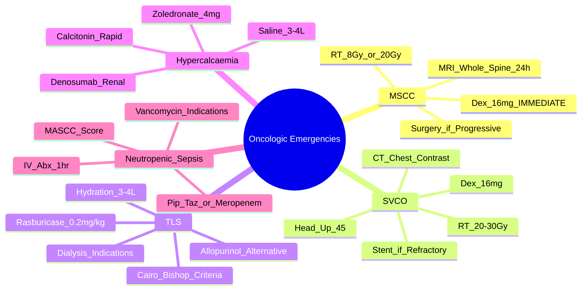

> [!tip] **FCPS/MRCP Priority: CRITICAL**
> Oncologic emergencies = **life-threatening complications requiring immediate recognition and treatment**. **MSCC, SVCO, TLS, Hypercalcaemia, Neutropenic Sepsis** = **top 5 for exams**. Time-sensitive: **MSCC/SVCO = hours**, TLS/Neutropenic sepsis = **hours**, Hypercalcaemia = **hours-days**.

---

## 1. 1. Learning Objectives
By the end of this note you should be able to:
- [ ] Recognise the **5 major oncologic emergencies**: MSCC, SVCO, TLS, Hypercalcaemia, Neutropenic Sepsis
- [ ] Apply **immediate management algorithms** for each emergency
- [ ] Recognise **clinical presentation** and **investigation findings** for each
- [ ] Apply **treatment algorithms** with correct drug doses and timing
- [ ] Understand **prognostic implications** and **follow-up**

---

## 2. 2. Quick Reference: Top 5 Oncologic Emergencies

| Emergency | Key Presentation | Immediate Action | Time Criticality |
|-----------|------------------|------------------|------------------|
| **MSCC** | Back pain + neurological deficit | **High-dose Dex + urgent RT** (within 24h) | **Hours** |
| **SVCO** | Facial/arm swelling, dyspnoea, distended neck veins | **Head elevation, Dex, urgent RT/stent** | **Hours** |
| **TLS** | AKI, hyperK, hyperP, hypoCa, hyperUric | **Hydration, Rasburicase, Allopurinol** | **Hours** |
| **Hypercalcaemia** | Polyuria, confusion, constipation, ECG changes | **Hydration, Bisphosphonate, Denosumab** | **Hours-Days** |
| **Neutropenic Sepsis** | Fever + ANC <0.5 or <1.0 | **IV antibiotics within 1 hour** | **Hour** |

> [!critical] **FCPS/MRCP Golden Rule**: **"MSCC and SVCO = Dexamethasone immediately, then urgent imaging/RT"**

---

## 3. 3. Malignant Spinal Cord Compression (MSCC)

### 1. Definition & Epidemiology
| Feature | Detail |
|---------|--------|
| **Definition** | **Compression of spinal cord/cauda equina** by metastatic tumour → neurological deficit |
| **Incidence** | **5-10%** of cancer patients; **Commonest: Breast, Lung, Prostate, Myeloma, RCC** |
| **Commonest Site** | **Thoracic (70%) > Lumbar (20%) > Cervical (10%)** |

### 2. Clinical Features
| Feature | Presentation |
|---------|-------------|
| **Back Pain** | **95%** — **worse lying flat, nocturnal, progressive**, may precede neuro deficit by weeks |
| **Motor Weakness** | **75%** — pyramidal pattern, asymmetric |
| **Sensory Loss** | **50-70%** — sensory level, dissociation |
| **Autonomic** | **Urinary retention/constipation** — late, poor prognostic sign |
| **Reflexes** | **Upper motor neurone signs** (hyperreflexia, spasticity, Babinski) |

> [!critical] **Red Flags for MSCC**
> - **New back pain + cancer history**
> - **Progressive neurological deficit**
> - **Urinary retention/saddle anaesthesia**

### 3. Investigations
| Test | Role |
|------|------|
| **MRI Whole Spine (Gold Standard)** | **Level, extent, cord compression, thecal sac compression** — **Do within 24h** |
| **CT Spine** | If MRI contraindicated; bony detail |
| **Plain X-ray** | Lytic lesions, collapse — **insensitive** (false negative 30-40%) |
| **Bloods** | FBC, U&E, Ca, LFT, Alk Phos, PSA, Myeloma screen |

> [!critical] **MRI Whole Spine = Gold Standard** — **Do NOT delay for plain X-ray**

### 4. Management Algorithm

```mermaid
flowchart TD
    A[Suspected MSCC] --> B[**Immediate Dexamethasone 16mg PO/IV**\n(8mg q6h or 16mg daily)]
    B --> C[**Urgent MRI Whole Spine**\nWithin 24h]
    C --> D{Extent of Compression}
    D -->|Localised| E[**Urgent Radiotherapy**\nWithin 24h of diagnosis\n8Gy/1fr or 20Gy/5fr]
    D -->|Extensive/Collapse| F[**Neurosurgical Decompression**\n+ Stabilisation\nThen RT]
    E --> G[**Dexamethasone Taper**\nOver 2-4 weeks\nMonitor for GI bleed, hyperglycaemia]
    F --> G
    G --> H[**Rehab, DVT Prophylaxis, Bladder/Bowel Care**]
```

### 5. Key Management Points
| Intervention | Detail |
|--------------|--------|
| **Dexamethasone** | **16mg stat (8mg q6h or 16mg daily)** — **start IMMEDIATELY on suspicion** |
| **Radiotherapy** | **8Gy/1fr (good PS, limited life expectancy)** or **20Gy/5fr (better PS, longer survival)** |
| **Surgery** | **Laminectomy + fixation** if: hw compromise, progressive deficit on steroids, instability, radio-resistant tumour |
| **Prognosis** | **Ambulatory at diagnosis → 80% remain ambulant**; Non-ambulant → poor recovery |

> [!critical] **MSCC Prognosis = Ambulation at diagnosis** — **Ambulatory → 80% remain ambulant**

---

## 4. 4. Superior Vena Cava Obstruction (SVCO)

### 1. Definition & Aetiology
| Feature | Detail |
|---------|--------|
| **Definition** | **Obstruction of SVC flow** → impaired venous return from head/neck/upper limbs |
| **Commonest Causes** | **Lung Cancer (60-80%) — SCLC > NSCLC**, Lymphoma, Mediastinal Mets, Thrombosis (catheter/pacemaker) |

### 2. Clinical Features
| Feature | Presentation |
|---------|-------------|
| **Facial/Periorbital Oedema** | **Early, worse on waking** |
| **Distended Neck Veins** | **Non-pulsatile, worse on bending/valsalva** |
| **Dyspnoea/Orthopnoea** | Due to upper airway oedema |
| **Headache/Confusion** | Cerebral oedema |
| **Collateral Veins** | Chest wall, upper abdomen ("caput medusae") |

### 3. Investigations
| Test | Role |
|------|------|
| **CT Chest with Contrast (Gold Standard)** | **Site, extent, cause, collateral vessels** |
| **Venography** | If CT equivocal |
| **Bronchoscopy** | If lung cancer suspected |
| **Bloods** | FBC, U&E, Ca, LFT, Coagulation, D-dimer |

### 4. Management Algorithm

```mermaid
flowchart TD
    A[Suspected SVCO] --> B[**Head Up 45°**\nOxygen if hypoxic]
    B --> C[**Dexamethasone 16mg stat**\n(8mg q6h)]
    C --> D[**Urgent CT Chest with Contrast**]
    D --> E[**Urgent Radiotherapy**\n30Gy/10fr or 20Gy/5fr\nStart within 24-48h]
    E --> F{Symptoms Resolve?}
    F -->|Yes| G[Dexamethasone Taper\nOver 2-4 weeks]
    F -->|No (Severe/Refractory)| H[**Venous Stenting**\nImmediate relief\nThen RT]
    H --> I[**Anticoagulation**\nIf thrombotic component]
```

### 5. Key Management Points
| Intervention | Detail |
|--------------|--------|
| **Dexamethasone** | **16mg stat** — **do not delay** |
| **Radiotherapy** | **30Gy/10fr (2-3 weeks)** or **20Gy/5fr (1 week)** — **start within 24-48h** |
| **Stenting** | **Immediate relief** for life-threatening/failed RT |
| **Anticoagulation** | If thrombus component (catheter/pacemaker) |
| **Prognosis** | **Median survival 2-6 months** (depends on primary) |

---

## 5. 5. Tumour Lysis Syndrome (TLS)

### 1. Definition & Risk Stratification
| Feature | Detail |
|---------|--------|
| **Definition** | **Metabolic emergency** from massive tumour cell lysis → **Hyperkalaemia, Hyperphosphataemia, Hypocalcaemia, Hyperuricaemia** → **AKI, arrhythmias, seizures** |
| **Cairo-Bishop Definition** | **Laboratory TLS**: 2+ abnormalities (K, P, Ca, Urate) within 3d before/7d after chemo; **Clinical TLS** = Lab TLS + AKI/seizure/arrhythmia |
| **Risk Stratification** | **High**: Burkitt, ALL (high WBC), high-grade NHL, bulky disease; **Intermediate**: AML, DLBCL, bulky; **Low**: Solid tumours, indolent NHL |

### 2. Laboratory TLS Criteria (Cairo-Bishop)
| Parameter | Threshold |
|-----------|-----------|
| **Uric Acid** | **>476 μmol/L (8 mg/dL)** or 25% increase |
| **Potassium** | **>6 mmol/L** or 25% increase |
| **Phosphate** | **>2.1 mmol/L (6.5 mg/dL)** or 25% increase |
| **Calcium** | **<1.75 mmol/L (7 mg/dL)** or 25% decrease |

### 3. Management Algorithm

```mermaid
flowchart TD
    A[Risk Stratification] --> B{High Risk}
    B -->|Yes| C[**Prophylaxis**\nHydration 3-4L/day\n**Rasburicase 0.2mg/kg IV**\n(If contraindicated: Allopurinol 300mg)\nMonitor Q4-6h]
    B -->|Intermediate| D[**Hydration 2-3L/day**\n**Allopurinol 300mg**\nMonitor Q8-12h]
    B -->|Low| E[Hydration\nAllopurinol if needed\nMonitor Daily]
    C --> F[TLS Develops?]
    D --> F
    E --> F
    F -->|Yes| G[**Aggressive Hydration**\n**Rasburicase 0.2mg/kg IV**\nCorrect K, Ca, Phosphate\n**Dialysis if**: K>6, pH<7.2, Oliguria, Ca<1.5, Phos>8]
    F -->|No| H[Continue Prophylaxis\nThrough Chemotherapy Cycle]
```

### 4. Key Management Points
| Intervention | Detail |
|--------------|--------|
| **Hydration** | **3-4 L/day (High risk), 2-3L (Intermediate)** — target urine output >2 L/day |
| **Rasburicase** | **0.2 mg/kg IV single dose** — **recombinant urate oxidase**; **contraindicated in G6PD deficiency** |
| **Allopurinol** | **300mg daily (300mg/m²)** — start 24-48h pre-chemo; **avoid in high-risk (use rasburicase)** |
| **Electrolyte Correction** | **K>6**: Insulin+Glucose, Calcium gluconate, Salbutamol, Dialysis; **Phos>8**: Calcium gluconate, sevelamer, dialysis |
| **Dialysis Indications** | **K>6 refractory, pH<7.2, Oliguria/anuria, Ca<1.5, Phos>8, Seizures** |

> [!critical] **Rasburicase Contraindicated in G6PD Deficiency** — risk of haemolysis; check G6PD before giving

---

## 6. 6. Hypercalcaemia of Malignancy

### 1. Aetiology & Risk
| Mechanism | Cancers |
|-----------|---------|
| **PTHrP (Humoral)** — **80%** | **SCC Lung, Breast, RCC, SCC H&N, Bladder** |
| **Bone Metastasis (Osteolytic)** — 20% | **Breast, Myeloma, Prostate, Lung** |
| **Calcitriol (1,25-Vit D)** | **Lymphoma (esp. Hodgkin), **Sarcoidosis** |

### 2. Clinical Features
| Feature | Presentation |
|---------|-------------|
| **Polyuria/Polydipsia** | Early, renal concentrating defect |
| **Nausea/Vomiting/Constipation** | GI ileus |
| **Confusion/Lethargy/Coma** | CNS depression |
| **Polyuria → Dehydration** | Pre-renal AKI |
| **ECG** | **Shortened QT, widened QRS, bradycardia (severe)** |

### 3. Diagnostic Criteria
| Parameter | Threshold |
|-----------|-----------|
| **Corrected Calcium** | **>2.6 mmol/L (10.4 mg/dL)** |
| **PTH** | **Suppressed** (if PTHrP-mediated) |
| **PTHrP** | **Elevated** (humoral) |
| **1,25-Vit D** | **Elevated** (lymphoma, granulomatous) |

### 4. Management Algorithm

```mermaid
flowchart TD
    A[Hypercalcaemia Confirmed] --> B[**IV Hydration: 0.9% Saline 3-4L/day**\nTarget urine >2L/day\n**Avoid Thiazides**]
    B --> C{Calcium Level / Severity}
    C -->|Mild (2.6-3.0)| D[Hydration + Oral Bisphosphonate\n**Zoledronate 4mg IV** OR **Pamidronate 90mg IV**\nMonitor Ca q2d]
    C -->|Moderate (3.0-3.5)| E[**IV Zoledronate 4mg**\nHydration + Monitor Ca daily]
    C -->|Severe (>3.5) or Symptomatic| F[**IV Zoledronate 4mg**\n**Calcitonin 4-8 U/kg SC q6-12h** (rapid, tachyphylaxis)\n**Denosumab 120mg SC** (if renal impairment)\n**Dialysis** if severe/refractory + renal failure]
```

### 5. Key Drugs
| Drug | Dose | Onset | Duration | Notes |
|------|------|-------|----------|-------|
| **IV Hydration** | 0.9% Saline 3-4L/day | Immediate | Ongoing | **Cornerstone** |
| **Zoledronate** | **4mg IV over 15 min** | 24-48h | 2-4 weeks | **1st line**; adjust for renal |
| **Pamidronate** | 90mg IV over 2-4h | 24-48h | 1-2 weeks | Alternative |
| **Calcitonin** | 4-8U/kg SC q6-12h | **2-4h** | 2-3 days | **Rapid but tachyphylaxis** |
| **Denosumab** | 120mg SC | Days | Weeks | **Renal impairment** (no renal clearance) |
| **Calcimimetics (Cinacalcet)** | 30-90mg daily | Days | Chronic | PTH-mediated (rare) |

---

## 7. 7. Neutropenic Sepsis

### 1. Definition & Risk
| Criteria | Definition |
|----------|------------|
| **Fever** | **Single temp >38.3°C OR sustained >38.0°C >1h** |
| **Neutropenia** | **ANC <0.5 ×10⁹/L** or **<1.0 ×10⁹/L with predicted decline** |
| **Risk Stratification (MASCC Score)** | **Low risk (≥21)**: Outpatient oral abx possible; **High risk (<21)**: **IV antibiotics + admission** |

### 2. MASCC Score
| Factor | Points |
|--------|--------|
| Burden of illness (no/mild/mod/severe) | 0/3/4 |
| No/hypotension | 5/0 |
| No/COPD | 4/0 |
| Solid tumour/haematological | 4/0 |
| No/dehydration | 3/0 |
| No/mucositis | 4/0 |
| Age <60 / ≥60 | 2/0 |

**Score ≥21 = Low risk (outpatient candidate)**

### 3. Management Algorithm

```mermaid
flowchart TD
    A[Febrile Neutropenia] --> B[**Immediate IV Antibiotics**\n**Within 1 HOUR** (Door-to-needle)]
    B --> C[**Piperacillin-Tazobactam 4.5g IV q6h**\nOR **Meropenem 1g q8h**\nOR **Cefepime 2g q8h**\n+ **Vancomycin** if: catheter, hemodynamic instability, MRSA risk, severe mucositis]
    C --> D[**MASCC Score**]
    D -->|≥21 (Low Risk)| E[**Oral Step-down**\nCiprofloxacin + Amoxicillin/Clavulanate\nOutpatient if stable]
    D -->|<21 (High Risk)| F[**Continue IV**\n48-72h afebrile → Oral step-down\nDuration: 5-7 days total (minimum)]
    F --> G[**G-CSF** if: prolonged neutropenia, high risk, septic shock]
    F --> H[**Source Control**\nLine removal if infected\nSurgical if abscess]
```

### 4. Empiric Antibiotic Regimens
| Regimen | Indication |
|---------|------------|
| **Piperacillin-Tazobactam 4.5g IV q6h** | **1st line** (broad spectrum, anti-pseudomonal) |
| **Meropenem 1g IV q8h** | Allergy to penicillin, ESBL risk |
| **Cefepime 2g IV q8h** | Alternative |
| **+ Vancomycin** | Line infection, MRSA risk, hypotension, severe mucositis |

---

## 8. 8. FCPS/MRCP High-Yield Summary

| Emergency | Key Presentation | Immediate Action | Definitive Treatment |
|-----------|------------------|------------------|---------------------|
| **MSCC** | Back pain + neuro deficit | **Dex 16mg stat + MRI spine** | **RT 8Gy/1fr or 20Gy/5fr** ± Surgery |
| **SVCO** | Facial/arm swelling, distended neck veins | **Head up + Dex 16mg + CT chest** | **RT 20Gy/5fr or 30Gy/10fr** ± Stent |
| **TLS** | AKI, HyperK, HyperP, HypoCa, HyperUric | **Hydration + Rasburicase/Allopurinol** | **Rasburicase 0.2mg/kg IV** ± Dialysis |
| **Hypercalcaemia** | Polyuria, confusion, constipation, ECG | **Saline 3-4L/day + Zoledronate 4mg IV** | **Bisphosphonate ± Denosumab ± Calcitonin** |
| **Neutropenic Sepsis** | Fever + ANC <0.5 | **IV abx within 1h** (Pip-Taz/Meropenem) | **MASCC Score → Outpt vs Inpt** |

---

## 9. 9. Viva Questions (MRCP PACES / FCPS)

| Question | Expected Answer |
|----------|----------------|
| "What are the 5 major oncologic emergencies?" | **MSCC, SVCO, TLS, Hypercalcaemia, Neutropenic Sepsis** |
| "What is the immediate management of suspected MSCC?" | **Dexamethasone 16mg stat + Urgent MRI whole spine within 24h** |
| "A patient on chemotherapy presents with fever 39°C and ANC 0.3. What do you do?" | **Neutropenic sepsis** — **IV antibiotics within 1 hour** (Pip-Taz or Meropenem), assess MASCC score |
| "What is the Cairo-Bishop definition of TLS?" | **Lab TLS**: 2+ of (K>6, Phos>2.1, Ca<1.75, Urate>476) within 3d before/7d after chemo. **Clinical TLS** = Lab TLS + AKI/seizure/arrhythmia |
| "What is the first-line treatment for hypercalcaemia of malignancy?" | **IV 0.9% Saline 3-4L/day + Zoledronate 4mg IV** (Calcitonin if severe) |
| "What is the immediate management of SVCO?" | **Head up 45°, Oxygen, Dex 16mg stat, CT chest, RT within 24-48h** |
| "When do you use Rasburicase vs Allopurinol in TLS prophylaxis?" | **High risk (Burkitt, high-grade NHL, bulky)**: Rasburicase. **Intermediate/Low**: Allopurinol. **G6PD deficiency → avoid Rasburicase** |
| "What is the Cairo-Bishop criteria for Laboratory TLS?" | **2+ of**: Uric acid >476 μmol/L, K >6 mmol/L, Phosphate >2.1 mmol/L, Calcium <1.75 mmol/L — within 3d before/7d after chemo |
| "When do you give calcitonin for hypercalcaemia?" | **Severe hypercalcaemia (>3.5 mmol/L) or symptomatic** — rapid onset (2-4h) but tachyphylaxis (2-3 days), use with bisphosphonate |
| "What is the MASCC score and how does it change neutropenic sepsis management?" | **Score ≥21 = Low risk** → can consider outpatient oral antibiotics; **<21 = High risk** → inpatient IV antibiotics |

---

## 10. 10. Confusions & Mnemonics

| Confusion | Clarification |
|-----------|---------------|
| **MSCC vs Cauda Equina** | MSCC = **UMN signs** (hyperreflexia, Babinski); Cauda = **LMN** (areflexia, saddle anaesthesia) |
| **SVCO vs SVC Thrombosis** | SVCO = **external compression** (tumour); SVC thrombosis = **intraluminal thrombus** (catheter/pacemaker) — both need anticoagulation if thrombotic |
| **TLS vs Hyperkalaemia** | TLS = **multi-electrolyte** (K, Phos, Ca, Uric); isolated hyperK = not TLS |
| **Calcitonin vs Bisphosphonate** | **Calcitonin = rapid (2-4h) but tachyphylaxis (2-3d)**; **Bisphosphonate = slower (24-48h) but sustained (2-4w)** |
| **Neutropenic Sepsis vs Febrile Neutropenia** | **FN = Fever + ANC<1.0**; **Neutropenic Sepsis = FN + sepsis criteria (hypotension, organ dysfunction)** — treat both with IV abx |

**Mnemonic: Top 5 Emergencies = "M-S-T-H-N"**
- **M**SCC
- **S**VCO
- **T**LS
- **H**ypercalcaemia
- **N**eutropenic Sepsis

**Mnemonic: MSCC = "DEX-MRI-RT"**
- **DEX**amethasone 16mg stat
- **MRI** whole spine
- **RT** within 24h

**Mnemonic: SVCO = "HEAD-DEX-CT-RT"**
- **HEAD** up 45°
- **DEX**amethasone 16mg
- **CT** chest with contrast
- **RT** within 24-48h

**Mnemonic: TLS = "HYDRA-RAS"**
- **HYDRA**tion 3-4L/day
- **RAS**buricase (0.2mg/kg)

**Mnemonic: Hypercalcaemia = "SALINE-ZOL"**
- **SALINE** 3-4L/day
- **ZOL**edronate 4mg IV

**Mnemonic: Neutropenic Sepsis = "FEVER-ANC-ABX1HR"**
- **FEVER** >38.3°C
- **ANC** <0.5 (or <1.0 predicted)
- **ABX** within **1 HOUR**

**Mnemonic: MASCC = "B-H-C-S-M-A"**
- **B**urden of illness
- **H**ypotension
- **C**OPD
- **S**olid tumour
- **M**ucositis
- **A**ge <60

---

## 11. 11. Mind Map



---

## 12. 12. One-Page Revision Card

| Emergency | Immediate Action | Definitive Treatment | Key Timeframe |
|-----------|------------------|----------------------|---------------|
| **MSCC** | **Dex 16mg stat + MRI spine** | RT 8Gy/1fr or 20Gy/5fr; Surgery if progressive | **Hours** |
| **SVCO** | **Head up + Dex 16mg + CT chest** | RT 20Gy/5fr (or 30Gy/10fr); Stent if refractory | **Hours** |
| **TLS** | **Hydration 3-4L + Rasburicase 0.2mg/kg** | Rasburicase/Allopurinol; Dialysis if indicated | **Hours** |
| **Hypercalcaemia** | **Saline 3-4L + Zoledronate 4mg IV** | Bisphosphonate ± Denosumab; Calcitonin if severe | **Hours-Days** |
| **Neutropenic Sepsis** | **IV Abx within 1hr (Pip-Taz/Meropenem ± Vancomycin)** | MASCC Score; 5-7d total; G-CSF if prolonged | **<1 Hour** |

---

## 13. 13. Spaced Repetition Trackers

| Review Interval | Date Completed | Confidence (1-5) | Notes |
|-----------------|----------------|------------------|-------|
| 24 hours | | | |
| 7 days | | | |
| 15 days | | | |
| 30 days | | | |
| 90 days | | | |

---

## 14. 14. Self-Test Scorecard

| Section | Score /5 | Last Attempt |
|---------|----------|--------------|
| MSCC Recognition & Management | | |
| SVCO Recognition & Management | | |
| TLS Criteria & Management | | |
| Hypercalcaemia Management | | |
| Neutropenic Sepsis MASCC & Abx | | |
| Viva Questions | | |

---

## 15. 15. Local Navigation
- **Parent Heading**: [[../Oncologic Emergencies|Oncologic Emergencies]]
- **Parent Topic Group**: [[Metabolic Emergencies]]
- **Chapter Map**: [[../Davidson Chapter 7 - Oncology Hierarchy|Oncology Hierarchy]]
- **Chapter MOC**: [[../Oncology MOC|Oncology MOC]]
- **Drug Reference**: [[../../Clinical Therapeutics and Good Prescribing|Drugs]]

---

# FCPS/MRCP Exam Extras

## 16. 16. MCQs (10)


**1.** Regarding Oncologic Emergencies Overview (MSCC), which statement is correct?
   A. Back pain + neuro deficit
   B. Back - alternative approach
   C. Empirical management only
   D. Watch and wait
   - **Answer: A** — Back pain + neuro deficit


**2.** Regarding Oncologic Emergencies Overview (SVCO), which statement is correct?
   A. Facial/arm swelling, distended neck veins
   B. Facial/arm - alternative approach
   C. Empirical management only
   D. Watch and wait
   - **Answer: A** — Facial/arm swelling, distended neck veins


**3.** Regarding Oncologic Emergencies Overview (TLS), which statement is correct?
   A. AKI, HyperK, HyperP, HypoCa, HyperUric
   B. AKI, - alternative approach
   C. Empirical management only
   D. Watch and wait
   - **Answer: A** — AKI, HyperK, HyperP, HypoCa, HyperUric


**4.** Regarding Oncologic Emergencies Overview (Hypercalcaemia), which statement is correct?
   A. Polyuria, confusion, constipation, ECG
   B. Polyuria, - alternative approach
   C. Empirical management only
   D. Watch and wait
   - **Answer: A** — Polyuria, confusion, constipation, ECG


**5.** Regarding Oncologic Emergencies Overview (Neutropenic Sepsis), which statement is correct?
   A. Fever + ANC <0.5
   B. Fever - alternative approach
   C. Empirical management only
   D. Watch and wait
   - **Answer: A** — Fever + ANC <0.5


**6.** Regarding Oncologic Emergencies Overview ([FCPS, MRCP Part 1, MRCP Part ), which statement is correct?
   - A. [FCPS, MRCP Part 1, MRCP Part 2, PACES]
   - B. None of the above
   - C. Not applicable in clinical practice
   - D. Used only in research settings
   - **Answer: A** — [FCPS, MRCP Part 1, MRCP Part 2, PACES]


**7.** Regarding Oncologic Emergencies Overview (MSCC), which statement is correct?
   - A. MSCC: Back pain + neurological deficit
   - B. None of the above
   - C. Not applicable in clinical practice
   - D. Used only in research settings
   - **Answer: A** — MSCC: Back pain + neurological deficit


**8.** Regarding Oncologic Emergencies Overview (SVCO), which statement is correct?
   - A. SVCO: Facial/arm swelling, dyspnoea, distended neck veins
   - B. None of the above
   - C. Not applicable in clinical practice
   - D. Used only in research settings
   - **Answer: A** — SVCO: Facial/arm swelling, dyspnoea, distended neck veins


**9.** Regarding Oncologic Emergencies Overview (TLS), which statement is correct?
   - A. TLS: AKI, hyperK, hyperP, hypoCa, hyperUric
   - B. None of the above
   - C. Not applicable in clinical practice
   - D. Used only in research settings
   - **Answer: A** — TLS: AKI, hyperK, hyperP, hypoCa, hyperUric


**10.** Regarding Oncologic Emergencies Overview (Hypercalcaemia), which statement is correct?
   - A. Hypercalcaemia: Polyuria, confusion, constipation, ECG changes
   - B. None of the above
   - C. Not applicable in clinical practice
   - D. Used only in research settings
   - **Answer: A** — Hypercalcaemia: Polyuria, confusion, constipation, ECG changes


## 17. 17. SBA Questions (10)


**1.** A 55-year-old presents with classic features. MDT discussion recommends:
   - A. Back pain + neuro deficit
   - B. Back (less specific)
   - C. Empirical broad approach
   - D. No intervention required
   - **Answer: A** — first-line: Back pain + neuro deficit


**2.** On staging workup, the patient is found to be [Stage X]. Best management is:
   - A. Facial/arm swelling, distended neck veins
   - B. Facial/arm (less specific)
   - C. Empirical broad approach
   - D. No intervention required
   - **Answer: A** — stage-specific: Facial/arm swelling, distended neck veins


**3.** Following first-line treatment, the patient develops [complication]. Best next step:
   - A. AKI, HyperK, HyperP, HypoCa, HyperUric
   - B. AKI, (less specific)
   - C. Empirical broad approach
   - D. No intervention required
   - **Answer: A** — complication: AKI, HyperK, HyperP, HypoCa, HyperUric


**4.** The patient asks about prognosis. Most appropriate response based on:
   - A. Polyuria, confusion, constipation, ECG
   - B. Polyuria, (less specific)
   - C. Empirical broad approach
   - D. No intervention required
   - **Answer: A** — prognosis: Polyuria, confusion, constipation, ECG


**5.** A 65-year-old with relevant risk factors should be screened with:
   - A. Fever + ANC <0.5
   - B. Fever (less specific)
   - C. Empirical broad approach
   - D. No intervention required
   - **Answer: A** — screening: Fever + ANC <0.5


**6.** A clinician encounters a patient with this presentation. Best approach:
   - A. [FCPS, MRCP Part 1, MRCP Part 2, PACES]
   - B. Watch and wait approach
   - C. Empirical broad treatment
   - D. No intervention
   - **Answer: A** — [FCPS, MRCP Part 1, MRCP Part 2, PACES]


**7.** On further evaluation, the finding is confirmed. Most appropriate next step:
   - A. MSCC: Back pain + neurological deficit
   - B. Watch and wait approach
   - C. Empirical broad treatment
   - D. No intervention
   - **Answer: A** — MSCC: Back pain + neurological deficit


**8.** The patient asks about management options. Best evidence-based response:
   - A. SVCO: Facial/arm swelling, dyspnoea, distended neck veins
   - B. Watch and wait approach
   - C. Empirical broad treatment
   - D. No intervention
   - **Answer: A** — SVCO: Facial/arm swelling, dyspnoea, distended neck veins


**9.** Treatment is initiated. Most important monitoring parameter:
   - A. TLS: AKI, hyperK, hyperP, hypoCa, hyperUric
   - B. Watch and wait approach
   - C. Empirical broad treatment
   - D. No intervention
   - **Answer: A** — TLS: AKI, hyperK, hyperP, hypoCa, hyperUric


**10.** Follow-up assessment reveals the following. Best next step:
   - A. Hypercalcaemia: Polyuria, confusion, constipation, ECG changes
   - B. Watch and wait approach
   - C. Empirical broad treatment
   - D. No intervention
   - **Answer: A** — Hypercalcaemia: Polyuria, confusion, constipation, ECG changes


## 18. 18. Flashcards

**Q1:** MSCC?
**A1:** Back pain + neuro deficit

**Q2:** SVCO?
**A2:** Facial/arm swelling, distended neck veins

**Q3:** TLS?
**A3:** AKI, HyperK, HyperP, HypoCa, HyperUric

**Q4:** Hypercalcaemia?
**A4:** Polyuria, confusion, constipation, ECG

**Q5:** Neutropenic Sepsis?
**A5:** Fever + ANC <0.5


| # | MCQ | Topic | Explanation |
|---|-----|-------|-------------|
| 6 | A | [FCPS, MRCP Part 1, MRCP Part 2, PACES] | [FCPS, MRCP Part 1, MRCP Part 2, PACES] |
| 7 | A | MSCC | MSCC: Back pain + neurological deficit |
| 8 | A | SVCO | SVCO: Facial/arm swelling, dyspnoea, distended neck veins |
| 9 | A | TLS | TLS: AKI, hyperK, hyperP, hypoCa, hyperUric |
| 10 | A | Hypercalcaemia | Hypercalcaemia: Polyuria, confusion, constipation, ECG changes |
| 11 | A | Neutropenic Sepsis | Neutropenic Sepsis: Fever + ANC <0.5 or <1.0 |
| 12 | A | Definition | Definition: Compression of spinal cord/cauda equina by metastatic tumour → neurological deficit |
| 13 | A | Incidence | Incidence: 5-10% of cancer patients; Commonest: Breast, Lung, Prostate, Myeloma, RCC |
| 14 | A | Commonest Site | Commonest Site: Thoracic (70%) > Lumbar (20%) > Cervical (10%) |
| 15 | A | Back Pain | Back Pain: 95% — worse lying flat, nocturnal, progressive, may precede neuro deficit by weeks |
| 16 | A | Motor Weakness | Motor Weakness: 75% — pyramidal pattern, asymmetric |
| 17 | A | Sensory Loss | Sensory Loss: 50-70% — sensory level, dissociation |
| 18 | A | Autonomic | Autonomic: Urinary retention/constipation — late, poor prognostic sign |
| 19 | A | Reflexes | Reflexes: Upper motor neurone signs (hyperreflexia, spasticity, Babinski) |
| 20 | A | MRI Whole Spine (Gold Standard) | MRI Whole Spine (Gold Standard): Level, extent, cord compression, thecal sac compression — Do within 24h |

| # | SBA | Topic | Explanation |
|---|-----|-------|-------------|
| 6 | A | [FCPS, MRCP Part 1, MRCP Part 2, PACES] | [FCPS, MRCP Part 1, MRCP Part 2, PACES] |
| 7 | A | MSCC | MSCC: Back pain + neurological deficit |
| 8 | A | SVCO | SVCO: Facial/arm swelling, dyspnoea, distended neck veins |
| 9 | A | TLS | TLS: AKI, hyperK, hyperP, hypoCa, hyperUric |
| 10 | A | Hypercalcaemia | Hypercalcaemia: Polyuria, confusion, constipation, ECG changes |
| 11 | A | Neutropenic Sepsis | Neutropenic Sepsis: Fever + ANC <0.5 or <1.0 |
| 12 | A | Definition | Definition: Compression of spinal cord/cauda equina by metastatic tumour → neurological deficit |
| 13 | A | Incidence | Incidence: 5-10% of cancer patients; Commonest: Breast, Lung, Prostate, Myeloma, RCC |
| 14 | A | Commonest Site | Commonest Site: Thoracic (70%) > Lumbar (20%) > Cervical (10%) |
| 15 | A | Back Pain | Back Pain: 95% — worse lying flat, nocturnal, progressive, may precede neuro deficit by weeks |
| 16 | A | Motor Weakness | Motor Weakness: 75% — pyramidal pattern, asymmetric |
| 17 | A | Sensory Loss | Sensory Loss: 50-70% — sensory level, dissociation |
| 18 | A | Autonomic | Autonomic: Urinary retention/constipation — late, poor prognostic sign |
| 19 | A | Reflexes | Reflexes: Upper motor neurone signs (hyperreflexia, spasticity, Babinski) |
| 20 | A | MRI Whole Spine (Gold Standard) | MRI Whole Spine (Gold Standard): Level, extent, cord compression, thecal sac compression — Do within 24h |## Answer Key with Explanations

| # | MCQ | Topic | Explanation |
|---|-----|-------|-------------|
| 1 | A | MSCC | Back pain + neuro deficit |
| 2 | A | SVCO | Facial/arm swelling, distended neck veins |
| 3 | A | TLS | AKI, HyperK, HyperP, HypoCa, HyperUric |
| 4 | A | Hypercalcaemia | Polyuria, confusion, constipation, ECG |
| 5 | A | Neutropenic Sepsis | Fever + ANC <0.5 |

| # | SBA | Topic | Explanation |
|---|-----|-------|-------------|
| 1 | A | MSCC | Back pain + neuro deficit |
| 2 | A | SVCO | Facial/arm swelling, distended neck veins |
| 3 | A | TLS | AKI, HyperK, HyperP, HypoCa, HyperUric |
| 4 | A | Hypercalcaemia | Polyuria, confusion, constipation, ECG |
| 5 | A | Neutropenic Sepsis | Fever + ANC <0.5 |


**Q6:** Key Point?
**A6:** [FCPS, MRCP Part 1, MRCP Part 2, PACES]

**Q7:** MSCC?
**A7:** MSCC: Back pain + neurological deficit

**Q8:** SVCO?
**A8:** SVCO: Facial/arm swelling, dyspnoea, distended neck veins
## 19. 19. Local Navigation


- **Parent Heading Hub**: [[../../Oncologic Emergencies|Oncologic Emergencies]]
- **Chapter Map**: [[../../Davidson Chapter 7 - Oncology Hierarchy|Oncology Hierarchy]]
- **Chapter MOC**: [[../../Oncology MOC|Oncology MOC]]
- **Drug Reference**: [[../../../Clinical Therapeutics and Good Prescribing|Drugs]]

