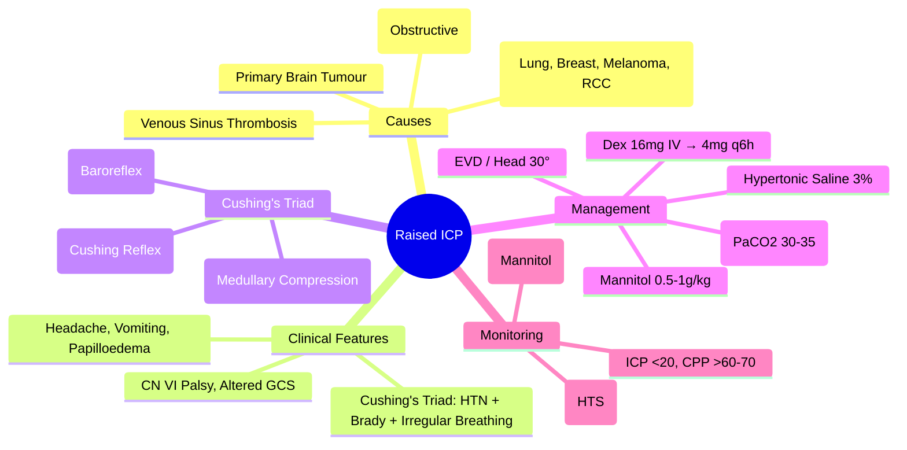

> [!tip] **FCPS/MRCP Priority: HIGH**
> **Raised ICP = Oncologic Emergency**; **Causes**: Brain Mets, Primary Tumour, Obstructive Hydrocephalus, Venous Sinus Thrombosis; **Signs**: Headache, Vomiting, Papilloedema, CN VI Palsy, Cushing's Triad (Hypertension, Bradycardia, Irregular Breathing); **Management**: Dexamethasone 16mg, Mannitol 20%, Hypertonic Saline 3%, Hyperventilation (Temporary), EVD, Neurosurgical Referral; **Cushing's Triad** = Hypertension, Bradycardia, Irregular Breathing.

---

## 1. 1. Learning Objectives
By the end of this note you should be able to:
- [ ] Identify **causes** of raised ICP in cancer patients
- [ ] Recognise **clinical signs** of raised ICP including **Cushing's Triad**
- [ ] Initiate **immediate medical management** (Dexamethasone, Mannitol, Hypertonic Saline)
- [ ] Apply **adjunctive measures** (Hyperventilation, Head Elevation, EVD)
- [ ] Recognise **Cushing's Triad** and its significance

---

## 2. 2. Causes of Raised ICP in Malignancy

| Cause | Mechanism |
|-------|-----------|
| **Brain Metastases** | **Most Common** (Lung, Breast, Melanoma, RCC) → Mass Effect, Oedema |
| **Primary Brain Tumour** | Glioblastoma, Meningioma, Medulloblastoma → Mass Effect, Oedema |
| **Obstructive Hydrocephalus** | **Foraminal Obstruction** (Posterior Fossa Mets, Pineal Region) → CSF Flow Block |
| **Venous Sinus Thrombosis** | Hypercoagulability → Sagittal/Transverse Sinus Thrombosis → Impaired Venous Drainage |
| **Leptomeningeal Disease** | CSF Flow Obstruction, Communicating Hydrocephalus |
| **Paraneoplastic** | SIADH → Hyponatraemia → Cerebral Oedema |

---

## 3. 3. Clinical Features

| Feature | Significance |
|-------|--------------|
| **Headache** | **Most Common**, Worse Morning/ValSalva, Progressive |
| **Vomiting** | **Projectile**, Often Morning, No Nausea (Raised ICP) |
| **Papilloedema** | **Fundoscopy**: Blurred Disc Margins, Venous Engorgement, Loss of Spontaneous Venous Pulsations |
| **CN VI Palsy** | **False Localising Sign** (Stretch of CN VI) → Diplopia |
| **Altered Consciousness** | Drowsiness → Confusion → Coma (Late) |
| **Seizures** | Focal or Generalised (Cortical Irritation) |
| **Cushing's Triad** | **Hypertension, Bradycardia, Irregular Breathing** = **Impending Herniation** |

---

## 4. 4. Cushing's Triad

| Component | Pathophysiology | Clinical Significance |
|----------|----------------|------------------------|
| **Hypertension** | **Cushing Reflex** (Medullary Ischaemia → Sympathetic Surge) | **Systolic BP ↑↑**, Diastolic ↑ |
| **Bradycardia** | **Baroreceptor Reflex** (Response to Hypertension) | **HR <60 bpm** (Relative) |
| **Irregular Breathing** | **Medullary Respiratory Centre Compression** | **Cheyne-Stokes, Ataxic, Apnoea** |

> **Cushing's Triad = Late Sign of Impending Herniation** → **Emergency Neurosurgical Referral**

---

## 5. 5. Management Algorithm

```mermaid
flowchart TD
    A[Suspected Raised ICP] --> B[**Immediate: Dexamethasone 16mg IV Stat → 4mg q6h**]
    B --> C[**Urgent CT/MRI Head** — Confirm Diagnosis, Localise Cause]
    C --> D{Severity}
    D -->|**Severe / Cushing's Triad / Herniation Signs**| E[**Mannitol 20% 0.5-1g/kg IV** over 30min
**Hypertonic Saline 3% 2-5mL/kg/h**
**Hyperventilation** (PaCO2 30-35 mmHg, <24h)
**EVD** (If Hydrocephalus)
**Neurosurgical Referral**]
    D -->|**Moderate / No Herniation Signs**| F[**Mannitol 20% 0.5-1g/kg IV**
**Hypertonic Saline 3% 2-5mL/kg/h**
**Dexamethasone 16mg IV → 4mg q6h**
**Head Elevation 30°**
**Avoid Hypotension/Hypoxia**]
    E --> G[**Neurosurgical Intervention** (EVD, Craniotomy, Tumour Resection)]
    F --> G[**Neurosurgical Referral**]
    G --> H[**Treat Underlying Cause** (Surgery, RT, Chemo, Anticoagulation for SST)]
```

---

## 6. 6. Medical Management

| Agent | Dose | Mechanism | Key Points |
|-------|------|-----------|------------|
| **Dexamethasone** | **16mg IV Stat → 4mg q6h** | Reduces Vasogenic Oedema (Inhibits Phospholipase A2) | **First-Line**, Onset 6-12h, Taper Over Days |
| **Mannitol 20%** | **0.5-1g/kg IV over 30min** (q4-6h) | Osmotic Diuresis → **Reduces Intracranial Volume** | **Rapid Onset**, Monitor Osmolality (<320), Electrolytes |
| **Hypertonic Saline 3%** | **2-5mL/kg/h** (Continuous Infusion) | **Osmotic Gradient**, Less Hypovolaemia than Mannitol | **Preferred if Hypovolaemic**, Monitor Na/Osma |
| **Hyperventilation** | **PaCO2 30-35 mmHg** (Mechanical Ventilation) | **Cerebral Vasoconstriction** → ↓CBF, ↓ICP | **Temporary (<24h)**, Risk of Ischaemia, **Bridge to Definitive Rx** |
| **EVD** | **External Ventricular Drain** | **CSF Diversion** → ↓ICP | **Hydrocephalus**, **Refractory ICP** |
| **Head Elevation** | **30° Head Up** | **Promotes Venous Drainage** | **Simple, Effective**, Avoid Hip Flexion >30° |
| **Seizure Prophylaxis** | **Levetiracetam 500mg BD** | Prevent Seizure-Induced ICP Spikes | **If Seizure Risk / Post-Craniotomy** |

---

## 7. 7. Cushing's Triad — Recognition & Action

| Component | Value | Action |
|-----------|-------|--------|
| **Hypertension** | **SBP >160** (or ↑↑ from baseline) | **Immediate Mannitol/Hypertonic Saline** |
| **Bradycardia** | **HR <60** (Relative) | **Prepare for Herniation**, **Neurosurgical Alert** |
| **Irregular Breathing** | **Cheyne-Stokes / Ataxic / Apnoea** | **Intubate, Hyperventilate, Neurosurgical Emergency** |

> **Cushing's Triad = Neurosurgical Emergency** → **Immediate Mannitol/Hypertonic Saline + Hyperventilation + EVD + Neurosurgery**

---

## 8. 8. Monitoring & Supportive Care

| Parameter | Target | Frequency |
|-----------|--------|-----------|
| **ICP (if monitored)** | **<20 mmHg** (Normal <15) | Continuous |
| **CPP (Cerebral Perfusion Pressure)** | **>60-70 mmHg** (CPP = MAP - ICP) | Continuous |
| **Serum Osmolality** | **<320 mOsm/kg** (Mannitol) | q4-6h |
| **Sodium** | **145-155 mmol/L** (Hypertonic Saline) | q4-6h |
| **Electrolytes** | **K, Mg, Ca, Glucose** | q6h |
| **Neuro Checks** | **GCS, Pupils, Motor/Sensory** | q1h (Unstable), q4h (Stable) |
| **Head Position** | **30° Elevation**, Neutral Midline | Continuous |

---

## 9. 9. FCPS/MRCP High-Yield Summary

| Topic | Key Points |
|-------|------------|
| **Causes** | Brain Mets (Lung, Breast, Melanoma, RCC), Primary Tumour, Hydrocephalus, SST |
| **Signs** | Headache, Vomiting, Papilloedema, CN VI Palsy, Altered GCS, Seizures |
| **Cushing's Triad** | **Hypertension + Bradycardia + Irregular Breathing** = **Impending Herniation** |
| **First-Line** | **Dexamethasone 16mg IV → 4mg q6h** (Reduce Vasogenic Oedema) |
| **Osmotic Therapy** | **Mannitol 0.5-1g/kg** OR **Hypertonic Saline 3% 2-5mL/kg/h** |
| **Hyperventilation** | **PaCO2 30-35 mmHg** (Temporary <24h) — Bridge to Definitive Rx |
| **EVD** | Hydrocephalus, Refractory ICP |
| **Cushing's Triad** | **Hypertension, Bradycardia, Irregular Breathing** = **Impending Herniation** |
| **Definitive** | **Neurosurgery** (EVD, Craniotomy, Tumour Resection, Stenting SST) |

---

## 10. 10. Viva Questions (MRCP PACES / FCPS)

| Question | Expected Answer |
|----------|-----------------|
| **Raised ICP — Common Causes in Cancer?** | **Brain Mets (Lung, Breast, Melanoma, RCC), Primary Tumour, Obstructive Hydrocephalus, SST**. |
| **Cushing's Triad — Three Components?** | **Hypertension, Bradycardia, Irregular Breathing** (Cheyne-Stokes/Ataxic). |
| **Cushing's Triad — Pathophysiology?** | **Medullary Ischaemia → Sympathetic Surge (HTN) → Baroreceptor Reflex (Bradycardia) → Respiratory Centre Compression (Irregular Breathing)**. |
| **Raised ICP — First-Line Medical Management?** | **Dexamethasone 16mg IV Stat → 4mg q6h** (Reduce Vasogenic Oedema). |
| **Mannitol vs Hypertonic Saline — Differences?** | **Mannitol**: Osmotic Diuresis, Monitor Osmolality (<320), Risk AKI; **HTS**: Less Diuresis, Better Volume Status, No Osmolality Limit. |
| **Hyperventilation — When, Target, Duration?** | **Bridge to Definitive Rx**, **PaCO2 30-35 mmHg**, **<24h** (Ischaemic Risk). |
| **Cushing's Triad — Action?** | **Mannitol/Hypertonic Saline + Hyperventilation + EVD + Urgent Neurosurgery**. |
| **EVD Indications?** | **Hydrocephalus**, **Refractory ICP**, **CSF Diversion**, **ICP Monitoring**. |
| **Raised ICP Monitoring — CPP Target?** | **CPP = MAP - ICP >60-70 mmHg**; **MAP Target >80 mmHg**. |
| **Head Elevation — Angle, Effect?** | **30°**, Promotes Venous Drainage, Reduces ICP. |

---

## 11. 11. Confusions & Mnemonics

| Confusion | Clarification |
|-----------|---------------|
| **Mannitol vs Hypertonic Saline** | **Mannitol**: Osmotic Diuresis, Monitor Osmolality (<320), Risk AKI; **HTS**: Better Volume Status, Less Diuresis, No Osmolality Limit |
| **Hyperventilation Duration** | **<24h Only** (Transient Benefit, Cerebral Ischaemia Risk if Prolonged) |
| **Cushing's Triad vs Cushing's Syndrome** | **Triad**: Acute ICP Rise (HTN, Bradycardia, Irregular Breathing); **Syndrome**: Chronic Cortisol Excess |
| **Dexamethasone Timing** | **Stat 16mg IV**, **Then 4mg q6h** — **Not 8mg q6h**, **Not Oral Initially** |
| **EVD vs VP Shunt** | **EVD**: Acute, External, ICP Monitoring; **VP Shunt**: Chronic, Internal, Long-Term |
| **Cushing's Triad — Order of Appearance** | **Hypertension → Bradycardia → Irregular Breathing** (Progressive Compression) |

**Mnemonic: RAISED-ICP**
- **R**aised ICP: **Brain Mets, Primary Tumour, Hydrocephalus, SST**
- **A**ltered Consciousness: **GCS Drop, Drowsiness → Coma**
- **I**CTUS/Seizures: **Focal/Generalised**
- **S**igns: **Headache, Vomiting, Papilloedema, CN VI Palsy**
- **E**mergency Signs: **Cushing's Triad (HTN, Brady, Irregular Breathing)**
- **D**examethasone: **16mg IV Stat → 4mg q6h**
- **I**ntracranial Pressure: **Mannitol 0.5-1g/kg OR Hypertonic Saline 3%**
- **C**ushing's Triad: **HTN, Bradycardia, Irregular Breathing = Herniation Imminent**
- **P**erioperative: **Head 30° Elevation, Avoid Hypotension/Hypoxia**

---

## 12. 12. Mind Map



---

## 13. 13. One-Page Revision Card

| Domain | Key Points |
|--------|------------|
| **Causes** | Brain Mets, Primary Tumour, Hydrocephalus, SST |
| **Signs** | Headache, Vomiting, Papilloedema, CN VI Palsy, Cushing's Triad |
| **Cushing's Triad** | HTN + Bradycardia + Irregular Breathing = Herniation Imminent |
| **First-Line** | Dexamethasone 16mg IV → 4mg q6h |
| **Osmotic** | Mannitol 0.5-1g/kg OR HTS 3% 2-5mL/kg/h |
| **Hyperventilation** | PaCO2 30-35 mmHg, <24h |
| **EVD** | Hydrocephalus, Refractory ICP |
| **Cushing's** = Neurosurgical Emergency |
| **Monitoring** | ICP <20, CPP >60, Osm <320, Na 145-155 |

---

## 14. 14. Spaced Repetition Trackers

| Review Interval | Date Completed | Confidence (1-5) | Notes |
|-----------------|----------------|------------------|-------|
| 24 hours | | | |
| 7 days | | | |
| 15 days | | | |
| 30 days | | | |
| 90 days | | | |

---

## 15. 15. Self-Test Scorecard

| Section | Score /5 | Last Attempt |
|---------|----------|--------------|
| Causes of Raised ICP | | |
| Cushing's Triad Components | | |
| Cushing's Pathophysiology | | |
| Dexamethasone Dosing | | |
| Mannitol vs HTS | | |
| Hyperventilation Indications | | |
| Monitoring Parameters | | |
| Cushing's Triad Action | | |

---

## 16. 16. Local Navigation
- **Parent Heading**: [[../Oncology|Oncology]]
- **Chapter Map": [[../Davidson Chapter 7 - Oncology Hierarchy|Oncology Hierarchy]]
- **Chapter MOC**: [[../Oncology MOC|Oncology MOC]]
- **Drug Reference": [[../../Clinical Therapeutics and Good Prescribing|Drugs]]
- **Related**: [[Brain Metastases]], [[Cerebral Herniation]], [[Meningioma]], [[Glioblastoma]], [[SVCO]], [[MSCC]], [[Dexamethasone]], [[Mannitol]], [[EVD]], [[Cushing's Triad]]

---

# FCPS/MRCP Exam Extras

## 17. 17. MCQs (10)


**1.** Regarding Raised Intracranial Pressure (ICP) (Causes), which statement is correct?
   A. Brain Mets (Lung, Breast, Melanoma, RCC), Primary Tumour, Hydrocephalus, SST
   B. Brain - alternative approach
   C. Empirical management only
   D. Watch and wait
   - **Answer: A** — Brain Mets (Lung, Breast, Melanoma, RCC), Primary Tumour, Hydrocephalus, SST


**2.** Regarding Raised Intracranial Pressure (ICP) (Signs), which statement is correct?
   A. Headache, Vomiting, Papilloedema, CN VI Palsy, Altered GCS, Seizures
   B. Headache, - alternative approach
   C. Empirical management only
   D. Watch and wait
   - **Answer: A** — Headache, Vomiting, Papilloedema, CN VI Palsy, Altered GCS, Seizures


**3.** Regarding Raised Intracranial Pressure (ICP) (Cushing's Triad), which statement is correct?
   A. **Hypertension + Bradycardia + Irregular Breathing** = **Impending Herniation**
   B. **Hypertension - alternative approach
   C. Empirical management only
   D. Watch and wait
   - **Answer: A** — **Hypertension + Bradycardia + Irregular Breathing** = **Impending Herniation**


**4.** Regarding Raised Intracranial Pressure (ICP) (First-Line), which statement is correct?
   A. **Dexamethasone 16mg IV → 4mg q6h** (Reduce Vasogenic Oedema)
   B. **Dexamethasone - alternative approach
   C. Empirical management only
   D. Watch and wait
   - **Answer: A** — **Dexamethasone 16mg IV → 4mg q6h** (Reduce Vasogenic Oedema)


**5.** Regarding Raised Intracranial Pressure (ICP) (Osmotic Therapy), which statement is correct?
   A. **Mannitol 0.5-1g/kg** OR **Hypertonic Saline 3% 2-5mL/kg/h**
   B. **Mannitol - alternative approach
   C. Empirical management only
   D. Watch and wait
   - **Answer: A** — **Mannitol 0.5-1g/kg** OR **Hypertonic Saline 3% 2-5mL/kg/h**


**6.** Regarding Raised Intracranial Pressure (ICP) (Hyperventilation), which statement is correct?
   A. **PaCO2 30-35 mmHg** (Temporary <24h)
   B. **PaCO2 - alternative approach
   C. Empirical management only
   D. Watch and wait
   - **Answer: A** — **PaCO2 30-35 mmHg** (Temporary <24h) — Bridge to Definitive Rx


**7.** Regarding Raised Intracranial Pressure (ICP) (EVD), which statement is correct?
   A. Hydrocephalus, Refractory ICP
   B. Hydrocephalus, - alternative approach
   C. Empirical management only
   D. Watch and wait
   - **Answer: A** — Hydrocephalus, Refractory ICP


**8.** Regarding Raised Intracranial Pressure (ICP) (Cushing's Triad), which statement is correct?
   A. **Hypertension, Bradycardia, Irregular Breathing** = **Impending Herniation**
   B. **Hypertension, - alternative approach
   C. Empirical management only
   D. Watch and wait
   - **Answer: A** — **Hypertension, Bradycardia, Irregular Breathing** = **Impending Herniation**


**9.** Regarding Raised Intracranial Pressure (ICP) (Definitive), which statement is correct?
   A. **Neurosurgery** (EVD, Craniotomy, Tumour Resection, Stenting SST)
   B. **Neurosurgery** - alternative approach
   C. Empirical management only
   D. Watch and wait
   - **Answer: A** — **Neurosurgery** (EVD, Craniotomy, Tumour Resection, Stenting SST)


**10.** Regarding Raised Intracranial Pressure (ICP) (FCPS/MRCP High Yield - Raised ICP), which statement is correct?
   - A. FCPS/MRCP High Yield - Raised ICP: Causes (Brain Mets, Primary Tumour, Obstructive Hydrocephalus, Venous Sinus Thrombosi
   - B. Empirical approach without specific indication
   - C. Used only in research protocols
   - D. Not relevant in current practice
   - **Answer: A** — FCPS/MRCP High Yield - Raised ICP: Causes (Brain Mets, Primary Tumour, Obstructive Hydrocephalus, Venous Sinus Thrombosis)

## 18. 18. SBA Questions (10)


**1.** A 55-year-old presents with classic features. MDT discussion recommends:
   - A. Brain Mets (Lung, Breast, Melanoma, RCC), Primary Tumour, Hydrocephalus, SST
   - B. Brain (less specific)
   - C. Empirical broad approach
   - D. No intervention required
   - **Answer: A** — first-line: Brain Mets (Lung, Breast, Melanoma, RCC), Primary Tumour, Hydrocephalus, SST


**2.** On staging workup, the patient is found to be [Stage X]. Best management is:
   - A. Headache, Vomiting, Papilloedema, CN VI Palsy, Altered GCS, Seizures
   - B. Headache, (less specific)
   - C. Empirical broad approach
   - D. No intervention required
   - **Answer: A** — stage-specific: Headache, Vomiting, Papilloedema, CN VI Palsy, Altered GCS, Seizures


**3.** Following first-line treatment, the patient develops [complication]. Best next step:
   - A. **Hypertension + Bradycardia + Irregular Breathing** = **Impending Herniation**
   - B. **Hypertension (less specific)
   - C. Empirical broad approach
   - D. No intervention required
   - **Answer: A** — complication: **Hypertension + Bradycardia + Irregular Breathing** = **Impending Herniation**


**4.** The patient asks about prognosis. Most appropriate response based on:
   - A. **Dexamethasone 16mg IV → 4mg q6h** (Reduce Vasogenic Oedema)
   - B. **Dexamethasone (less specific)
   - C. Empirical broad approach
   - D. No intervention required
   - **Answer: A** — prognosis: **Dexamethasone 16mg IV → 4mg q6h** (Reduce Vasogenic Oedema)


**5.** A 65-year-old with relevant risk factors should be screened with:
   - A. **Mannitol 0.5-1g/kg** OR **Hypertonic Saline 3% 2-5mL/kg/h**
   - B. **Mannitol (less specific)
   - C. Empirical broad approach
   - D. No intervention required
   - **Answer: A** — screening: **Mannitol 0.5-1g/kg** OR **Hypertonic Saline 3% 2-5mL/kg/h**


**6.** The most clinically important biomarker/molecular test is:
   - A. **PaCO2 30-35 mmHg** (Temporary <24h)
   - B. **PaCO2 (less specific)
   - C. Empirical broad approach
   - D. No intervention required
   - **Answer: A** — biomarker: **PaCO2 30-35 mmHg** (Temporary <24h) — Bridge to Definitive Rx


**7.** The standard chemotherapy/regimen of choice is:
   - A. Hydrocephalus, Refractory ICP
   - B. Hydrocephalus, (less specific)
   - C. Empirical broad approach
   - D. No intervention required
   - **Answer: A** — chemo: Hydrocephalus, Refractory ICP


**8.** The role of surgery in this case is:
   - A. **Hypertension, Bradycardia, Irregular Breathing** = **Impending Herniation**
   - B. **Hypertension, (less specific)
   - C. Empirical broad approach
   - D. No intervention required
   - **Answer: A** — surgery: **Hypertension, Bradycardia, Irregular Breathing** = **Impending Herniation**


**9.** The recommended surveillance/follow-up protocol is:
   - A. **Neurosurgery** (EVD, Craniotomy, Tumour Resection, Stenting SST)
   - B. **Neurosurgery** (less specific)
   - C. Empirical broad approach
   - D. No intervention required
   - **Answer: A** — follow-up: **Neurosurgery** (EVD, Craniotomy, Tumour Resection, Stenting SST)


**10.** A clinician encounters this presentation. Best approach:
   - A. FCPS/MRCP High Yield - Raised ICP: Causes (Brain Mets, Primary Tumour, Obstructive Hydrocephalus, Venous Sinus Thrombosi
   - B. Watch and wait approach
   - C. Empirical broad treatment
   - D. No intervention required
   - **Answer: A** — FCPS/MRCP High Yield - Raised ICP: Causes (Brain Mets, Primary Tumour, Obstructive Hydrocephalus, Venous Sinus Thrombosis)

## 19. 19. Flashcards

**Q1:** Causes?
**A1:** Brain Mets (Lung, Breast, Melanoma, RCC), Primary Tumour, Hydrocephalus, SST

**Q2:** Signs?
**A2:** Headache, Vomiting, Papilloedema, CN VI Palsy, Altered GCS, Seizures

**Q3:** Cushing's Triad?
**A3:** Hypertension + Bradycardia + Irregular Breathing = Impending Herniation

**Q4:** First-Line?
**A4:** Dexamethasone 16mg IV → 4mg q6h (Reduce Vasogenic Oedema)

**Q5:** Osmotic Therapy?
**A5:** Mannitol 0.5-1g/kg OR Hypertonic Saline 3% 2-5mL/kg/h

**Q6:** Hyperventilation?
**A6:** PaCO2 30-35 mmHg (Temporary <24h) — Bridge to Definitive Rx

**Q7:** EVD?
**A7:** Hydrocephalus, Refractory ICP

**Q8:** Cushing's Triad?
**A8:** Hypertension, Bradycardia, Irregular Breathing = Impending Herniation

## 20. 20. Answer Key with Explanations

| # | MCQ | Topic | Explanation |
|---|-----|-------|-------------|
| 1 | A | Causes | Brain Mets (Lung, Breast, Melanoma, RCC), Primary Tumour, Hydrocephalus, SST |
| 2 | A | Signs | Headache, Vomiting, Papilloedema, CN VI Palsy, Altered GCS, Seizures |
| 3 | A | Cushing's Triad | Hypertension + Bradycardia + Irregular Breathing = Impending Herniation |
| 4 | A | First-Line | Dexamethasone 16mg IV → 4mg q6h (Reduce Vasogenic Oedema) |
| 5 | A | Osmotic Therapy | Mannitol 0.5-1g/kg OR Hypertonic Saline 3% 2-5mL/kg/h |
| 6 | A | Hyperventilation | PaCO2 30-35 mmHg (Temporary <24h) — Bridge to Definitive Rx |
| 7 | A | EVD | Hydrocephalus, Refractory ICP |
| 8 | A | Cushing's Triad | Hypertension, Bradycardia, Irregular Breathing = Impending Herniation |
| 9 | A | Definitive | Neurosurgery (EVD, Craniotomy, Tumour Resection, Stenting SST) |
| 10 | A | FCPS/MRCP High Yield - Raised ICP | FCPS/MRCP High Yield - Raised ICP: Causes (Brain Mets, Primary Tumour, Obstructive Hydrocephalus, Venous Sinus Thrombosi |

| # | SBA | Topic | Explanation |
|---|-----|-------|-------------|
| 1 | A | Causes | Brain Mets (Lung, Breast, Melanoma, RCC), Primary Tumour, Hydrocephalus, SST |
| 2 | A | Signs | Headache, Vomiting, Papilloedema, CN VI Palsy, Altered GCS, Seizures |
| 3 | A | Cushing's Triad | Hypertension + Bradycardia + Irregular Breathing = Impending Herniation |
| 4 | A | First-Line | Dexamethasone 16mg IV → 4mg q6h (Reduce Vasogenic Oedema) |
| 5 | A | Osmotic Therapy | Mannitol 0.5-1g/kg OR Hypertonic Saline 3% 2-5mL/kg/h |
| 6 | A | Hyperventilation | PaCO2 30-35 mmHg (Temporary <24h) — Bridge to Definitive Rx |
| 7 | A | EVD | Hydrocephalus, Refractory ICP |
| 8 | A | Cushing's Triad | Hypertension, Bradycardia, Irregular Breathing = Impending Herniation |
| 9 | A | Definitive | Neurosurgery (EVD, Craniotomy, Tumour Resection, Stenting SST) |

| 11 | A | FCPS/MRCP High Yield - Raised ICP | FCPS/MRCP High Yield - Raised ICP: Causes (Brain Mets, Primary Tumour, Obstructive Hydrocephalus, Venous Sinus Thrombosi |
## 21. 21. Local Navigation


- **Parent Heading Hub**: [[../../Oncologic Emergencies|Oncologic Emergencies]]
- **Chapter Map**: [[../../Davidson Chapter 7 - Oncology Hierarchy|Oncology Hierarchy]]
- **Chapter MOC**: [[../../Oncology MOC|Oncology MOC]]
- **Drug Reference**: [[../../../Clinical Therapeutics and Good Prescribing|Drugs]]

