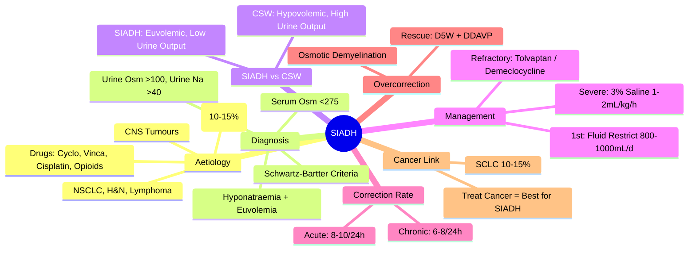

> [!tip] **FCPS/MRCP Priority: HIGH**
> **SIADH = Ectopic ADH Secretion**; **SCLC Most Common (10-15%)**, Also NSCLC, H&N, Lymphoma, CNS Tumours, Drugs (Cyclophosphamide, Vincristine, Cisplatin, Opioids); **Schwartz-Bartter Criteria**: Hyponatraemia (<135), Low Serum Osm (<275), High Urine Osm (>100), High Urine Na (>40), Euvolemia; **Management**: Fluid Restriction 800-1000mL/d (First-Line), Severe (<120/Seizure): Hypertonic Saline 3% 1-2mL/kg/h, Tolvaptan 15-30mg OD, Demeclocycline 600-1200mg/d; **Correct ≤8-10 mmol/L/24h (Acute) / 6-8 mmol/L/24h (Chronic)**.

---

## 1. 1. Learning Objectives
By the end of this note you should be able to:
- [ ] Apply **Schwartz-Bartter Criteria** for SIADH diagnosis
- [ ] Distinguish **SIADH from Cerebral Salt Wasting (CSW)**
- [ ] Risk-stratify **Hyponatraemia Severity** and choose appropriate therapy
- [ ] Implement **Fluid Restriction** as first-line for mild/moderate cases
- [ ] Use **Hypertonic Saline** for severe symptomatic hyponatraemia
- [ ] Prescribe **Tolvaptan/Demeclocycline** for refractory cases
- [ ] Apply **Safe Correction Rates** to avoid Osmotic Demyelination

---

## 2. 2. Aetiology in Malignancy

| Cancer / Cause | Mechanism |
|----------------|-----------|
| **SCLC** | **Most Common (10-15%)** — Ectopic ADH (AVP) Production |
| **NSCLC** | Adenocarcinoma, Squamous — Ectopic ADH |
| **Head & Neck** | SCC, Lymphoma — Ectopic ADH |
| **Lymphoma** | HL, NHL — Ectopic ADH, Cytokines (IL-6) |
| **CNS Tumours** | Direct Hypothalamic/Pituitary Effect |
| **Drugs** | **Cyclophosphamide, Vincristine, Cisplatin, Ifosfamide, Opioids, SSRIs, Carbamazepine** |
| **Other** | **MELAS**, **Porencephaly**, **Stroke**, **Infections** (TB, Pneumonia), **Pain, Nausea, Stress** |

---

## 3. 3. Pathophysiology

```mermaid
flowchart LR
    A[Ectopic ADH / Inappropriate Release] --> B[V2 Receptor Activation (Collecting Duct)]
    B --> C[Aquaporin-2 Insertion → Water Reabsorption]
    C --> D[**Concentrated Urine** (Urine Osm > Serum Osm)]
    D --> E[**Water Retention** → Dilutional Hyponatraemia]
    E --> F[**Euvolemia** (No Oedema, Normal Skin Turgor)]
    F --> G[**Low Serum Osm** (<275 mOsm/kg)]
    G --> H[**Inappropriately High Urine Osm** (>100 mOsm/kg)]
    H --> I[**High Urine Na** (>40 mmol/L)]
```

---

## 4. 4. Diagnostic Criteria (Schwartz-Bartter)

| Criterion | Required |
|-----------|----------|
| **1. Hyponatraemia** | **Serum Na <135 mmol/L** |
| **2. Low Serum Osmolality** | **<275 mOsm/kg** |
| **3. Inappropriately High Urine Osmolality** | **>100 mOsm/kg** (Inappropriately Concentrated) |
| **4. High Urine Sodium** | **>40 mmol/L** (With Normal Salt Intake) |
| **5. Clinical Euvolemia** | **No Oedema, No Dehydration**, Normal Skin Turgor, Normal BP/JVP |
| **6. Normal Thyroid/Adrenal/Renal Function** | **Exclude Hypothyroidism, Adrenal Insufficiency, Renal Failure** |
| **7. No Diuretic Use** | **Recent** |

---

## 5. 5. SIADH vs Cerebral Salt Wasting (CSW)

| Feature | **SIADH** | **Cerebral Salt Wasting (CSW)** |
|---------|-----------|--------------------------------|
| **Volume Status** | **Euvolemic** | **Hypovolemic** |
| **Urine Sodium** | **>40 mmol/L** | **>40 mmol/L** |
| **Urine Output** | **Normal/Low** | **High** |
| **Urine Osmolality** | **>100** (Inappropriately High) | **Variable** |
| **Haemodynamics** | **Normal BP, No Postural Drop** | **Hypotension, Tachycardia** |
| **JVP** | **Normal** | **Low/Flat** |
| **Skin Turgor** | **Normal** | **Reduced** |
| **BUN/Creatinine** | **Normal/Low** | **Elevated (Prerenal)** |
| **Cause** | **Ectopic ADH** | **Brain Natriuretic Peptide (BNP)** |
| **Associated** | **SCLC, Drugs, CNS** | **SAH, TBI, Neurosurgery, Meningitis** |

---

## 6. 6. Management Algorithm

```mermaid
flowchart TD
    A[Hyponatraemia <130 mmol/L or Symptomatic] --> B{Severity}
    B -->|**Severe (<120 / Seizures / Coma)**| C[**Hypertonic Saline 3% 1-2mL/kg/h** (Target Na Rise 4-6 mmol/L in 24h, Max 8-10 mmol/L/24h)]
    B -->|**Moderate (120-129) / Asymptomatic**| D[**Fluid Restriction 800-1000mL/d** (First-Line)]
    D --> E{Response}
    E -->|**Na Not Rising**| F[**Demeclocycline 600-1200mg/d** (V2 Antagonist, Onset 2-4d, Photosensitivity)]
    E -->|**Still Not Rising**| G[**Tolvaptan 15-30mg OD** (V2 Antagonist, Aquaretic, Avoid >24h Continuous, Monitor Liver)]
    F --> H[**Monitor Na q6-12h, Urine Output, Osmolality**]
    G --> H
    C --> H
    H --> I[**Treat Underlying Cause (Chemo for SCLC, etc.)**]
```

---

## 7. 7. Correction Rate Limits

| Scenario | Max Safe Correction Rate |
|----------|--------------------------|
| **Acute Hyponatraemia (<48h)** | **8-10 mmol/L in 24h** |
| **Chronic Hyponatraemia (>48h)** | **6-8 mmol/L in 24h** (Max 12-14 mmol/L in 48h) |
| **Risk of Overcorrection** | **Osmotic Demyelination Syndrome (Central Pontine Myelinolysis)** — **Irreversible Neurological Damage** |

> **If Overcorrection Occurs**: **Re-lower Na** with **D5W + Desmopressin** (DDAVP)

---

## 8. 8. Pharmacological Options (Refractory to Fluid Restriction)

| Agent | Mechanism | Dose | Key Points |
|-------|-----------|------|------------|
| **Tolvaptan** | **V2 Receptor Antagonist** (Oral, Aquaretic) | **15-30mg OD** (Max 60mg) | **Avoid >24h Continuous** (Liver Toxicity); Monitor Liver; **Contraindicated: Anuria, Hypovolaemia, Concomitant Strong CYP3A4 Inhibitors** |
| **Demeclocycline** | **Tetracycline Derivative** → **V2 Antagonist** (Nephrogenic DI) | **600-1200mg/d (Divided)** | **Onset 2-4d**; **Photosensitivity**, **Nephrotoxicity**, **Hepatotoxicity**; **Historic "ADH Antagonist"** |
| **Urea** | **Osmotic Diuresis** | **15-30g BD** | **Unpalatable**, **GI Intolerance**, **Effective Aquaretic** |
| **Lithium** | **GSK-3 Inhibition** → V2 Downregulation | **Not Recommended** | **Narrow TI**, **Nephrotoxicity**, **Thyroid Toxicity** |

---

## 9. 9. Fluid Restriction Protocol

| Step | Action |
|------|--------|
| **1. Calculate Maintenance** | **~25-30 mL/kg/day** |
| **2. Restrict to** | **800-1000 mL/day** (All Fluids Including IV Medications) |
| **3. Monitor** | **Daily Weight, Serum Na q6-12h, Urine Output/Osmolality** |
| **4. Adjust** | **If Na Rising → Continue**; **If Static → Add Demeclocycline/Tolvaptan** |
| **4. Diet** | **Avoid High Sodium Foods**, **Normal Salt Intake** (Not Salt Restriction) |

---

## 10. 10. Hypertonic Saline (Severe Symptomatic Hyponatraemia)

| Parameter | Detail |
|-----------|--------|
| **Indication** | **Na <120 mmol/L** OR **Seizures/Coma/Severe Neuro Symptoms** |
| **Solution** | **3% NaCl (513 mmol/L Na)** |
| **Rate** | **1-2 mL/kg/h** (e.g., 100-150 mL/h for 70kg) |
| **Target Rise** | **4-6 mmol/L in First 24h** (Max 8-10 mmol/L/24h Acute) |
| **Monitoring** | **Na q1-2h**, **Neuro Checks**, **Fluid Balance**, **ECG** |
| **Stop When** | **Target Na Reached** OR **Symptoms Resolve** |

---

## 11. 11. FCPS/MRCP High-Yield Summary

| Topic | Key Points |
|-------|------------|
| **SIADH Aetiology** | **SCLC (10-15%)**, NSCLC, H&N, Lymphoma, CNS, Drugs (Cyclo, Vinca, Cisplatin, Opioids) |
| **Diagnosis** | **Schwartz-Bartter**: Hyponatraemia + Low Serum Osm + High Urine Osm + High Urine Na + Euvolemia |
| **SIADH vs CSW** | **SIADH = Euvolemic**; **CSW = Hypovolaemic** (High Urine Output, Hypotension) |
| **First-Line** | **Fluid Restriction 800-1000 mL/day** |
| **Severe/Refractory** | **Tolvaptan 15-30mg OD** (V2 Antagonist) OR **Demeclocycline 600-1200mg/d** |
| **Severe (<120/Seizure)** | **3% Hypertonic Saline 1-2mL/kg/h** → **Na Rise 4-6 mmol/L/24h** (Max 8-10/24h Acute) |
| **Correction Rate** | **Acute (<48h): 8-10 mmol/L/24h**; **Chronic (>48h): 6-8 mmol/L/24h** |
| **Overcorrection** | **Osmotic Demyelination (Central Pontine Myelinolysis)** — **D5W + Desmopressin** to Re-lower |
| **SCLC** | **10-15% SIADH** — **Most Common Cancer Cause** |

---

## 12. 12. Viva Questions (MRCP PACES / FCPS)

| Question | Expected Answer |
|----------|-----------------|
| **Schwartz-Bartter Criteria for SIADH?** | **Hyponatraemia, Serum Osm<275, Urine Osm>100, Urine Na>40, Euvolemia, Normal Thyroid/Adrenal/Renal, No Diuretics**. |
| **SIADH vs CSW — Key Difference?** | **Volume Status**: **SIADH = Euvolemic**; **CSW = Hypovolemic** (High Urine Output, Hypotension). |
| **SCLC Patient, Na 118, Confused. Immediate Management?** | **Hypertonic Saline 3% 1-2mL/kg/h** → Target Na Rise 4-6 mmol/L in 24h; **Monitor q1-2h**. |
| **Fluid Restriction Volume for SIADH?** | **800-1000 mL/day** (All Fluids Including IV Meds). |
| **Tolvaptan — Dose, Monitoring, Contraindications?** | **15-30mg OD**, **Max 60mg**, **Avoid >24h Continuous**, **Monitor LFTs**, **Contra: Anuria, Hypovolaemia, CYP3A4 Inhibitors**. |
| **Demeclocycline — Mechanism, Onset, Side Effects?** | **V2 Antagonist (Tetracycline)**, **Onset 2-4d**, **Photosensitivity, Nephrotoxicity, Hepatotoxicity**. |
| **Correction Rate — Acute vs Chronic?** | **Acute (<48h): 8-10 mmol/L/24h**; **Chronic (>48h): 6-8 mmol/L/24h** (Max 12-14/48h). |
| **Overcorrection Complication?** | **Osmotic Demyelination (Central Pontine Myelinolysis)** — **D5W + Desmopressin to Re-lower**. |
| **SCLC SIADH — Prevalence, Management?** | **10-15%**, **Fluid Restrict → Tolvaptan/Demeclocycline → Treat SCLC**. |
| **Urea for SIADH — Role?** | **Osmotic Diuresis/Aquaretic** (15-30g BD) — **Unpalatable, GI Intolerance**. |

---

## 13. 13. Confusions & Mnemonics

| Confusion | Clarification |
|-----------|---------------|
| **SIADH vs CSW** | **SIADH**: Euvolemic, Urine Na>40, Low Urine Output; **CSW**: Hypovolemic, High Urine Output, Hypotension |
| **Acute vs Chronic Correction Rate** | **Acute (<48h): 8-10 mmol/L/24h**; **Chronic (>48h): 6-8 mmol/L/24h** (Max 12-14/48h) |
| **Tolvaptan Duration** | **Max 24h Continuous** (Liver Toxicity Risk); **Not for Chronic Use** |
| **Demeclocycline vs Tolvaptan** | **Demeclocycline**: Slower Onset (2-4d), Photosensitivity; **Tolvaptan**: Rapid (Hours), Liver Monitoring |
| **Overcorrection → Osmotic Demyelination** | **Central Pontine Myelinolysis** → **Rescue: D5W + Desmopressin (DDAVP)** |
| **SIADH vs Hypovolaemic Hyponatraemia** | **SIADH: Euvolemic, Urine Osm>100**; **Hypovolaemic: Hypovolaemic, Urine Na<20 (If Renal Conserving)** |
| **SCLC + SIADH** | **10-15% Incidence**, **Ectopic ADH**, **Treat Cancer + Fluid Restrict/Tolvaptan** |

**Mnemonic: SIADH-SCHWARTZ**
- **S**IADH: **Ectopic ADH** (SCLC 10-15%)
- **I**NVOLVED Cancers: **SCLC, NSCLC, H&N, Lymphoma, CNS, Drugs**
- **A**DHS: **Schwartz-Bartter Criteria** (Na↓, Serum Osm↓, Urine Osm↑, Urine Na↑, Euvolemic)
- **D**iagnosis: **Hyponatraemia + Euvolemia + Inappropriately Concentrated Urine**
- **H**ypo Natraemia: **<135 mmol/L**
- **S**evere: **<120** → **3% Saline 1-2mL/kg/h**
- **C**orrection: **Acute 8-10/24h**, **Chronic 6-8/24h**
- **H**ypertonic Saline: **3% 1-2mL/kg/h** (Target 4-6/24h)
- **W**ater Restriction: **800-1000mL/d** (First-Line)
- **A**quaretic: **Tolvaptan (V2 Ant), Demeclocycline (Tetracycline)**
- **R**efractory: **Tolvaptan 15-30mg OD / Demeclocycline 600-1200mg**
- **T**olvaptan: **V2 Antag, 15-30mg OD, <24h Cont, Liver Mon**
- **Z**: **Osmotic Demyelination if Overcorrect** → **D5W + DDAVP**
- **A**DH: **Ectopic in SCLC** (VGCC? No, ADH/V2)
- **R**esponse: **Treat Underlying Cancer (SCLC Chemo)**
- **T**est: **Serum Osm, Urine Osm, Urine Na, Volume Status**
- **Z**: **Zero Diuretics** (Before Diagnosis)

---

## 14. 14. Mind Map



---

## 15. 15. One-Page Revision Card

| Domain | Key Points |
|--------|------------|
| **Aetiology** | SCLC 10-15%, NSCLC, H&N, Lymphoma, Drugs (Cyclo, Vinca, Cisplatin, Opioids) |
| **Diagnosis** | Schwartz-Bartter: Na↓, Serum Osm↓, Urine Osm>100, Urine Na>40, Euvolemia |
| **SIADH vs CSW** | SIADH: Euvolemic, Low Urine Output; CSW: Hypovolemic, High Urine Output, Hypotension |
| **1st Line** | Fluid Restrict 800-1000mL/d |
| **Severe (<120/Seizure)** | 3% Saline 1-2mL/kg/h → Na Rise 4-6/24h |
| **Refractory** | Tolvaptan 15-30mg OD (V2 Antag) / Demeclocycline 600-1200mg/d |
| **Correction** | Acute 8-10/24h; Chronic 6-8/24h; Max 12-14/48h |
| **Overcorrection** | Osmotic Demyelination → D5W + DDAVP |
| **SCLC** | 10-15% SIADH, Treat Cancer + Fluid Restrict |

---

## 16. 16. Spaced Repetition Trackers

| Review Interval | Date Completed | Confidence (1-5) | Notes |
|-----------------|----------------|------------------|-------|
| 24 hours | | | |
| 7 days | | | |
| 15 days | | | |
| 30 days | | | |
| 90 days | | | |

---

## 17. 17. Self-Test Scorecard

| Section | Score /5 | Last Attempt |
|---------|----------|--------------|
| Schwartz-Bartter Criteria | | |
| SIADH vs CSW | | |
| Fluid Restriction | | |
| Hypertonic Saline Protocol | | |
| Tolvaptan/Demeclocycline | | |
| Correction Rate Limits | | |
| Overcorrection Management | | |
| SCLC Association | | |

---

## 18. 18. Local Navigation
- **Parent Heading**: [[../Oncology|Oncology]]
- **Chapter Map": [[../Davidson Chapter 7 - Oncology Hierarchy|Oncology Hierarchy]]
- **Chapter MOC": [[../Oncology MOC|Oncology MOC]]
- **Drug Reference": [[../../Clinical Therapeutics and Good Prescribing|Drugs]]
- **Related": [[Hypercalcaemia]], [[Tumour Lysis Syndrome]], [[Cerebral Salt Wasting]], [[Tolvaptan]], [[Demeclocycline]], [[Hyponatraemia]], [[Oncologic Emergencies]], [[SCLC]]

---

# FCPS/MRCP Exam Extras

## 19. 19. MCQs (10)


**1.** Regarding SIADH (Syndrome of Inappropriate ADH Secretion) (SIADH Aetiology), which statement is correct?
   A. **SCLC (10-15%)**, NSCLC, H&N, Lymphoma, CNS, Drugs (Cyclo, Vinca, Cisplatin, Opioids)
   B. **SCLC - alternative approach
   C. Empirical management only
   D. Watch and wait
   - **Answer: A** — **SCLC (10-15%)**, NSCLC, H&N, Lymphoma, CNS, Drugs (Cyclo, Vinca, Cisplatin, Opioids)


**2.** Regarding SIADH (Syndrome of Inappropriate ADH Secretion) (Diagnosis), which statement is correct?
   A. **Schwartz-Bartter**: Hyponatraemia + Low Serum Osm + High Urine Osm + High Urine Na + Euvolemia
   B. **Schwartz-Bartter**: - alternative approach
   C. Empirical management only
   D. Watch and wait
   - **Answer: A** — **Schwartz-Bartter**: Hyponatraemia + Low Serum Osm + High Urine Osm + High Urine Na + Euvolemia


**3.** Regarding SIADH (Syndrome of Inappropriate ADH Secretion) (SIADH vs CSW), which statement is correct?
   A. **SIADH = Euvolemic**
   B. **SIADH - alternative approach
   C. Empirical management only
   D. Watch and wait
   - **Answer: A** — **SIADH = Euvolemic**; **CSW = Hypovolaemic** (High Urine Output, Hypotension)


**4.** Regarding SIADH (Syndrome of Inappropriate ADH Secretion) (First-Line), which statement is correct?
   A. **Fluid Restriction 800-1000 mL/day**
   B. **Fluid - alternative approach
   C. Empirical management only
   D. Watch and wait
   - **Answer: A** — **Fluid Restriction 800-1000 mL/day**


**5.** Regarding SIADH (Syndrome of Inappropriate ADH Secretion) (Severe/Refractory), which statement is correct?
   A. **Tolvaptan 15-30mg OD** (V2 Antagonist) OR **Demeclocycline 600-1200mg/d**
   B. **Tolvaptan - alternative approach
   C. Empirical management only
   D. Watch and wait
   - **Answer: A** — **Tolvaptan 15-30mg OD** (V2 Antagonist) OR **Demeclocycline 600-1200mg/d**


**6.** Regarding SIADH (Syndrome of Inappropriate ADH Secretion) (Severe (<120/Seizure)), which statement is correct?
   A. **3% Hypertonic Saline 1-2mL/kg/h** → **Na Rise 4-6 mmol/L/24h** (Max 8-10/24h Acute)
   B. **3% - alternative approach
   C. Empirical management only
   D. Watch and wait
   - **Answer: A** — **3% Hypertonic Saline 1-2mL/kg/h** → **Na Rise 4-6 mmol/L/24h** (Max 8-10/24h Acute)


**7.** Regarding SIADH (Syndrome of Inappropriate ADH Secretion) (Correction Rate), which statement is correct?
   A. **Acute (<48h): 8-10 mmol/L/24h**
   B. **Acute - alternative approach
   C. Empirical management only
   D. Watch and wait
   - **Answer: A** — **Acute (<48h): 8-10 mmol/L/24h**; **Chronic (>48h): 6-8 mmol/L/24h**


**8.** Regarding SIADH (Syndrome of Inappropriate ADH Secretion) (Overcorrection), which statement is correct?
   A. **Osmotic Demyelination (Central Pontine Myelinolysis)**
   B. **Osmotic - alternative approach
   C. Empirical management only
   D. Watch and wait
   - **Answer: A** — **Osmotic Demyelination (Central Pontine Myelinolysis)** — **D5W + Desmopressin** to Re-lower


**9.** Regarding SIADH (Syndrome of Inappropriate ADH Secretion) (SCLC), which statement is correct?
   A. **10-15% SIADH**
   B. **10-15% - alternative approach
   C. Empirical management only
   D. Watch and wait
   - **Answer: A** — **10-15% SIADH** — **Most Common Cancer Cause**


**10.** Regarding SIADH (Syndrome of Inappropriate ADH Secretion) (FCPS/MRCP High Yield - SIADH), which statement is correct?
   - A. FCPS/MRCP High Yield - SIADH: SCLC (Most Common), NSCLC, H&N, Lymphoma, CNS tumours, Drugs (Cyclo, Vincristine, Cisplati
   - B. Empirical approach without specific indication
   - C. Used only in research protocols
   - D. Not relevant in current practice
   - **Answer: A** — FCPS/MRCP High Yield - SIADH: SCLC (Most Common), NSCLC, H&N, Lymphoma, CNS tumours, Drugs (Cyclo, Vincristine, Cisplatin, Opioids...

## 20. 20. SBA Questions (10)


**1.** A 55-year-old presents with classic features. MDT discussion recommends:
   - A. **SCLC (10-15%)**, NSCLC, H&N, Lymphoma, CNS, Drugs (Cyclo, Vinca, Cisplatin, Opioids)
   - B. **SCLC (less specific)
   - C. Empirical broad approach
   - D. No intervention required
   - **Answer: A** — first-line: **SCLC (10-15%)**, NSCLC, H&N, Lymphoma, CNS, Drugs (Cyclo, Vinca, Cisplatin, Opioids)


**2.** On staging workup, the patient is found to be [Stage X]. Best management is:
   - A. **Schwartz-Bartter**: Hyponatraemia + Low Serum Osm + High Urine Osm + High Urine Na + Euvolemia
   - B. **Schwartz-Bartter**: (less specific)
   - C. Empirical broad approach
   - D. No intervention required
   - **Answer: A** — stage-specific: **Schwartz-Bartter**: Hyponatraemia + Low Serum Osm + High Urine Osm + High Urine Na + Euvolemia


**3.** Following first-line treatment, the patient develops [complication]. Best next step:
   - A. **SIADH = Euvolemic**
   - B. **SIADH (less specific)
   - C. Empirical broad approach
   - D. No intervention required
   - **Answer: A** — complication: **SIADH = Euvolemic**; **CSW = Hypovolaemic** (High Urine Output, Hypotension)


**4.** The patient asks about prognosis. Most appropriate response based on:
   - A. **Fluid Restriction 800-1000 mL/day**
   - B. **Fluid (less specific)
   - C. Empirical broad approach
   - D. No intervention required
   - **Answer: A** — prognosis: **Fluid Restriction 800-1000 mL/day**


**5.** A 65-year-old with relevant risk factors should be screened with:
   - A. **Tolvaptan 15-30mg OD** (V2 Antagonist) OR **Demeclocycline 600-1200mg/d**
   - B. **Tolvaptan (less specific)
   - C. Empirical broad approach
   - D. No intervention required
   - **Answer: A** — screening: **Tolvaptan 15-30mg OD** (V2 Antagonist) OR **Demeclocycline 600-1200mg/d**


**6.** The most clinically important biomarker/molecular test is:
   - A. **3% Hypertonic Saline 1-2mL/kg/h** → **Na Rise 4-6 mmol/L/24h** (Max 8-10/24h Acute)
   - B. **3% (less specific)
   - C. Empirical broad approach
   - D. No intervention required
   - **Answer: A** — biomarker: **3% Hypertonic Saline 1-2mL/kg/h** → **Na Rise 4-6 mmol/L/24h** (Max 8-10/24h Acute)


**7.** The standard chemotherapy/regimen of choice is:
   - A. **Acute (<48h): 8-10 mmol/L/24h**
   - B. **Acute (less specific)
   - C. Empirical broad approach
   - D. No intervention required
   - **Answer: A** — chemo: **Acute (<48h): 8-10 mmol/L/24h**; **Chronic (>48h): 6-8 mmol/L/24h**


**8.** The role of surgery in this case is:
   - A. **Osmotic Demyelination (Central Pontine Myelinolysis)**
   - B. **Osmotic (less specific)
   - C. Empirical broad approach
   - D. No intervention required
   - **Answer: A** — surgery: **Osmotic Demyelination (Central Pontine Myelinolysis)** — **D5W + Desmopressin** to Re-lower


**9.** The recommended surveillance/follow-up protocol is:
   - A. **10-15% SIADH**
   - B. **10-15% (less specific)
   - C. Empirical broad approach
   - D. No intervention required
   - **Answer: A** — follow-up: **10-15% SIADH** — **Most Common Cancer Cause**


**10.** A clinician encounters this presentation. Best approach:
   - A. FCPS/MRCP High Yield - SIADH: SCLC (Most Common), NSCLC, H&N, Lymphoma, CNS tumours, Drugs (Cyclo, Vincristine, Cisplati
   - B. Watch and wait approach
   - C. Empirical broad treatment
   - D. No intervention required
   - **Answer: A** — FCPS/MRCP High Yield - SIADH: SCLC (Most Common), NSCLC, H&N, Lymphoma, CNS tumours, Drugs (Cyclo, Vincristine, Cisplatin, Opioids...

## 21. 21. Flashcards

**Q1:** SIADH Aetiology?
**A1:** SCLC (10-15%), NSCLC, H&N, Lymphoma, CNS, Drugs (Cyclo, Vinca, Cisplatin, Opioids)

**Q2:** Diagnosis?
**A2:** Schwartz-Bartter: Hyponatraemia + Low Serum Osm + High Urine Osm + High Urine Na + Euvolemia

**Q3:** SIADH vs CSW?
**A3:** SIADH = Euvolemic; CSW = Hypovolaemic (High Urine Output, Hypotension)

**Q4:** First-Line?
**A4:** Fluid Restriction 800-1000 mL/day

**Q5:** Severe/Refractory?
**A5:** Tolvaptan 15-30mg OD (V2 Antagonist) OR Demeclocycline 600-1200mg/d

**Q6:** Severe (<120/Seizure)?
**A6:** 3% Hypertonic Saline 1-2mL/kg/h → Na Rise 4-6 mmol/L/24h (Max 8-10/24h Acute)

**Q7:** Correction Rate?
**A7:** Acute (<48h): 8-10 mmol/L/24h; Chronic (>48h): 6-8 mmol/L/24h

**Q8:** Overcorrection?
**A8:** Osmotic Demyelination (Central Pontine Myelinolysis) — D5W + Desmopressin to Re-lower

## 22. 22. Answer Key with Explanations

| # | MCQ | Topic | Explanation |
|---|-----|-------|-------------|
| 1 | A | SIADH Aetiology | SCLC (10-15%), NSCLC, H&N, Lymphoma, CNS, Drugs (Cyclo, Vinca, Cisplatin, Opioids) |
| 2 | A | Diagnosis | Schwartz-Bartter: Hyponatraemia + Low Serum Osm + High Urine Osm + High Urine Na + Euvolemia |
| 3 | A | SIADH vs CSW | SIADH = Euvolemic; CSW = Hypovolaemic (High Urine Output, Hypotension) |
| 4 | A | First-Line | Fluid Restriction 800-1000 mL/day |
| 5 | A | Severe/Refractory | Tolvaptan 15-30mg OD (V2 Antagonist) OR Demeclocycline 600-1200mg/d |
| 6 | A | Severe (<120/Seizure) | 3% Hypertonic Saline 1-2mL/kg/h → Na Rise 4-6 mmol/L/24h (Max 8-10/24h Acute) |
| 7 | A | Correction Rate | Acute (<48h): 8-10 mmol/L/24h; Chronic (>48h): 6-8 mmol/L/24h |
| 8 | A | Overcorrection | Osmotic Demyelination (Central Pontine Myelinolysis) — D5W + Desmopressin to Re-lower |
| 9 | A | SCLC | 10-15% SIADH — Most Common Cancer Cause |
| 10 | A | FCPS/MRCP High Yield - SIADH | FCPS/MRCP High Yield - SIADH: SCLC (Most Common), NSCLC, H&N, Lymphoma, CNS tumours, Drugs (Cyclo, Vincristine, Cisplati |

| # | SBA | Topic | Explanation |
|---|-----|-------|-------------|
| 1 | A | SIADH Aetiology | SCLC (10-15%), NSCLC, H&N, Lymphoma, CNS, Drugs (Cyclo, Vinca, Cisplatin, Opioids) |
| 2 | A | Diagnosis | Schwartz-Bartter: Hyponatraemia + Low Serum Osm + High Urine Osm + High Urine Na + Euvolemia |
| 3 | A | SIADH vs CSW | SIADH = Euvolemic; CSW = Hypovolaemic (High Urine Output, Hypotension) |
| 4 | A | First-Line | Fluid Restriction 800-1000 mL/day |
| 5 | A | Severe/Refractory | Tolvaptan 15-30mg OD (V2 Antagonist) OR Demeclocycline 600-1200mg/d |
| 6 | A | Severe (<120/Seizure) | 3% Hypertonic Saline 1-2mL/kg/h → Na Rise 4-6 mmol/L/24h (Max 8-10/24h Acute) |
| 7 | A | Correction Rate | Acute (<48h): 8-10 mmol/L/24h; Chronic (>48h): 6-8 mmol/L/24h |
| 8 | A | Overcorrection | Osmotic Demyelination (Central Pontine Myelinolysis) — D5W + Desmopressin to Re-lower |
| 9 | A | SCLC | 10-15% SIADH — Most Common Cancer Cause |

| 11 | A | FCPS/MRCP High Yield - SIADH | FCPS/MRCP High Yield - SIADH: SCLC (Most Common), NSCLC, H&N, Lymphoma, CNS tumours, Drugs (Cyclo, Vincristine, Cisplati |
## 23. 23. Local Navigation


- **Parent Heading Hub**: [[../../Oncologic Emergencies|Oncologic Emergencies]]
- **Chapter Map**: [[../../Davidson Chapter 7 - Oncology Hierarchy|Oncology Hierarchy]]
- **Chapter MOC**: [[../../Oncology MOC|Oncology MOC]]
- **Drug Reference**: [[../../../Clinical Therapeutics and Good Prescribing|Drugs]]

