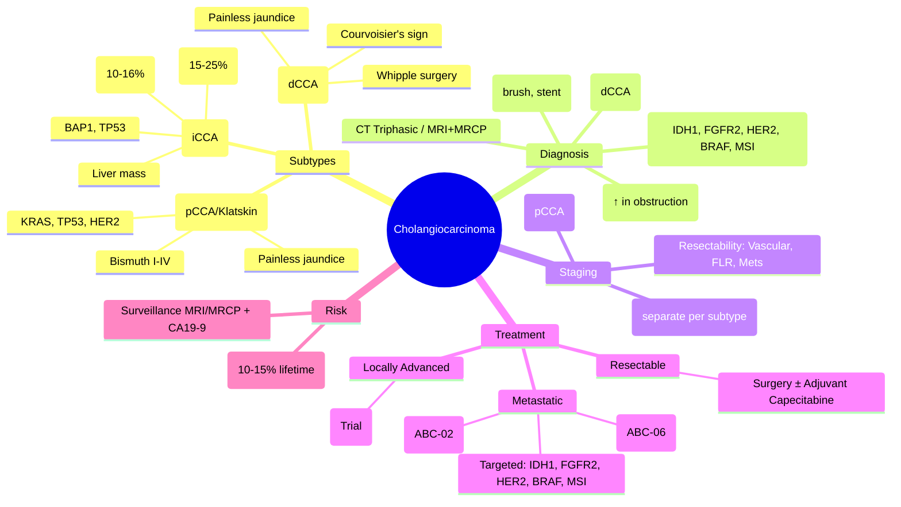

> [!tip] **FCPS/MRCP Priority: HIGH**
> **Cholangiocarcinoma = biliary tract adenocarcinoma**; classified by anatomy: **Intrahepatic (iCCA)**, **Perihilar (pCCA/Klatskin)**, **Distal (dCCA)**. **CA19-9** = marker. **Surgery** = only cure (R0 resection). **1L Systemic: Gemcitabine + Cisplatin** (ABC-02). **Targeted**: **IDH1 inhibitors (Ivosidenib)** for iCCA, **FGFR2 inhibitors (Pemigatinib, Futibatinib)** for FGFR2 fusions. **PSC** = major risk factor (lifetime risk 10-15%).

---

## 1. 1. Learning Objectives
By the end of this note you should be able to:
- [ ] Classify by anatomy: Intrahepatic, Perihilar (Klatskin), Distal
- [ ] Apply Bismuth-Corlette classification for perihilar tumours
- [ ] Define resectability criteria and surgical approaches per subtype
- [ ] Sequence systemic therapy: 1L Gem/Cis → 2L FOLFOX → Targeted (IDH1, FGFR2)
- [ ] Identify actionable mutations: **IDH1** (iCCA), **FGFR2 fusions** (iCCA), **HER2**, **BRAF**, **MSI-H**
- [ ] Recognise PSC as high-risk condition requiring surveillance

---

## 2. 2. Definition & Epidemiology

| Feature | Detail |
|---------|--------|
| **Definition** | Malignant epithelial tumour of biliary tract with cholangiocyte differentiation; **Adenocarcinoma >95%** |
| **Incidence** | Rare: 1-2/100,000 (West); High in Thailand (liver fluke); Rising globally (iCCA ↑) |
| **Prevalence** | 2nd most common primary liver cancer (after HCC); 15-20% of hepatobiliary cancers |
| **Peak Age** | 60-70 years; PSC: younger (30-40) |
| **Sex Ratio** | Slight male predominance (1.3:1) |
| **Risk Factors** | **Primary Sclerosing Cholangitis (PSC)** (lifetime risk 10-15%), **Liver flukes** (Opisthorchis, Clonorchis), Choledochal cysts, Caroli disease, Hepatolithiasis, **Thorotrast** (historical), HBV/HCV, Cirrhosis, Diabetes, Obesity, Smoking, **Chemical exposure** (dioxins, nitrosamines) |

---

## 3. 3. Aetiology & Pathophysiology

```mermaid
flowchart LR
    A[Risk Factors] --> B[Chronic Biliary Inflammation]
    B --> C[Cholangiocyte Injury → Proliferation]
    C --> D[Mutational Landscape by Subtype]
    D --> E1[iCCA: IDH1/2 (20%), FGFR2 fusions (15%), BAP1, TP53, KRAS]
    D --> E2[pCCA/dCCA: KRAS (30-50%), TP53 (30%), SMAD4, CDKN2A, HER2 (5-15%)]
    E1 --> F[Desmoplastic Stroma → Invasion]
    E2 --> F
    F --> G[Local Spread → Lymphatic → Haematogenous]
    G --> H[Clinical Presentation]
```

### 1. Molecular Profile by Subtype

| Alteration | **iCCA** | **pCCA / dCCA** | Targeted Therapy |
|------------|----------|-----------------|------------------|
| **IDH1/2 mut** | **15-25%** | <5% | **Ivosidenib** (IDH1), Olutasidenib |
| **FGFR2 fusions** | **10-16%** | Rare | **Pemigatinib, Futibatinib, Infigratinib** |
| **KRAS mut** | 10-20% | **30-50%** | — |
| **TP53 mut** | 20-30% | **30-40%** | — |
| **HER2 amp/mut** | 2-5% | **5-15%** | Trastuzumab + Chemo |
| **BRAF V600E** | 1-3% | 1-3% | Dabrafenib + Trametinib |
| **MSI-H/dMMR** | 1-2% | 1-2% | **Pembrolizumab** |
| **NTRK fusions** | <1% | <1% | Larotrectinib, Entrectinib |
| **BAP1 mut** | 10-15% | Rare | — |

---

## 4. 4. Clinical Features

| Subtype | Presentation |
|---------|--------------|
| **Intrahepatic (iCCA)** | Often **asymptomatic**; RUQ mass/pain, weight loss, malaise; Mimics HCC on imaging |
| **Perihilar / Klatskin (pCCA)** | **Painless jaundice** (most common), pruritus, dark urine, pale stools; Cholangitis (fever, RUQ pain) |
| **Distal (dCCA)** | **Painless jaundice**, weight loss, steatorrhea; Courvoisier's sign (palpable GB) |
| **All Subtypes** | CA19-9 elevated (sensitivity 70-80%, specificity 80-90%); **False +ve in cholangitis/obstruction** |

---

## 5. 5. Staging & Classification

### 1. Anatomic Classification

| Type | Location | Frequency |
|------|----------|-----------|
| **Intrahepatic (iCCA)** | Proximal to 2nd order bile ducts | 10-20% |
| **Perihilar (pCCA / Klatskin)** | Between 2nd order ducts and cystic duct insertion | **50-60%** (most common) |
| **Distal (dCCA)** | Distal to cystic duct insertion | 20-30% |

### 2. Bismuth-Corlette Classification (Perihilar CCA)

| Type | Description |
|------|-------------|
| **Type I** | Tumour below confluence (common hepatic duct) |
| **Type II** | Tumour reaching confluence |
| **Type IIIa** | Tumour occluding confluence + **right** hepatic duct |
| **Type IIIb** | Tumour occluding confluence + **left** hepatic duct |
| **Type IV** | Tumour involving **both** right and left hepatic ducts (bilateral) |

### 3. TNM 8th Edition / AJCC (Separate for each subtype)

| Stage | iCCA | pCCA | dCCA |
|-------|------|------|------|
| **T1** | Single, no vascular invasion | Confined to bile duct | Confined to bile duct |
| **T2** | Single + vascular invasion OR multiple | Beyond bile duct wall | Invades pancreas/duodenum |
| **T3** | Perforates visceral peritoneum | Invades hepatic artery/portal vein | Invades celiac axis/SMA/SMV |
| **T4** | Direct invasion adjacent organs | Bilateral hepatic duct + vascular | — |
| **N1** | Regional nodes | Regional nodes (pericholedochal, hilar, peripancreatic) | Regional nodes |

---

## 6. 6. Diagnosis & Investigations

| Investigation | Role | Key Findings |
|---------------|------|--------------|
| **CA19-9** | Tumour marker (not diagnostic alone) | ↑ in 70-80%; **False +ve in obstruction/cholangitis**; Prognostic; Monitor response |
| **CEA** | Supportive | Often elevated with CA19-9 |
| **CT Abdomen/Pelvis (Triphasic)** | **Primary staging** — Resectability, vascular involvement, mets | **iCCA**: Mass with peripheral enhancement + delayed central enhancement
**pCCA/dCCA**: ductal dilatation, stricture, vascular encasement |
| **MRI/MRCP** | **Best for biliary anatomy** (Bismuth typing), vascular invasion | **Gold standard for perihilar**; T2 hyperintense tumour |
| **ERCP / PTC** | **Tissue diagnosis** (brush cytology, biopsy), **Drainage** (stent) | Brush cytology sensitivity 30-50%; FISH/Polysomy ↑ yield |
| **EUS-FNA** | Tissue diagnosis (dCCA, pCCA) | Higher yield than ERCP brush; Risk of seeding (controversial) |
| **PET-CT** | Occult mets, nodal staging | Not routine; False +ve in inflammation |
| **Biomarkers (NGS)** | **Mandatory in advanced**: IDH1, FGFR2, HER2, BRAF, MSI, NTRK | Guide targeted therapy |

---

## 7. 7. Differential Diagnosis

| Condition | Distinguishing Features |
|-----------|-------------------------|
| **HCC** | Arterial hyperenhancement + washout; AFP↑; Cirrhosis background; LI-RADS LR-5 |
| **Metastatic Liver Disease** | Multiple lesions, known primary, rim enhancement |
| **Primary Sclerosing Cholangitis (PSC)** | Beading/strictures on MRCP/ERCP; IBD association; **Dominant stricture** = worrisome for CCA |
| **Choledocholithiasis** | Stones on CT/MRCP; Acute pain, fever; CA19-9 mildly ↑ |
| **Mirizzi Syndrome** | Stone impacted in cystic duct → common hepatic duct compression |
| **Benign Biliary Stricture** | Post-surgical, ischemic; Long history; CA19-9 normal |
| **IgG4-related Sclerosing Cholangitis** | IgG4↑, responds to steroids; Pancreatic involvement (AIP) |

---

## 8. 8. Management

```mermaid
flowchart TD
    A[Diagnosis + Staging] --> B{Resectable?}
    B -->|Resectable| C[Surgery ± Adjuvant]
    B -->|Locally Advanced
(Borderline)| D[Neoadjuvant: Gem/Cis ± RT
Clinical Trial]
    B -->|Metastatic / Unresectable| E[Palliative Systemic]
    C --> C1[iCCA: Hepatectomy ± Portal Embolisation]
    C --> C2[pCCA: Major Hepatectomy +
Caudate lobe + Bile Duct Resection +
Hepaticojejunostomy (Roux-en-Y)]
    C --> C3[dCCA: **Pancreaticoduodenectomy (Whipple)**
or Pylorus-preserving PD]
    C1 --> F[Adjuvant: **Capecitabine** (BILCAP)
or Gem/Cis (PRODIGE/ASCOT)]
    C2 --> F
    C3 --> F
    F --> G[Surveillance: CA19-9 q3-6mo
CT q6mo ×2yr then annually]
    D --> G
    E --> H1[**1L: Gemcitabine + Cisplatin**
(ABC-02) — **Standard**]
    E --> H2[**2L: FOLFOX** (ABC-06)
mFOLFOX + ASC]
    E --> H3[**Targeted (if actionable)**]
    H3 --> H3a[**iCCA IDH1 mut: Ivosidenib** (ClarIDHy)]
    H3 --> H3b[**iCCA FGFR2 fusion: Pemigatinib** (FIGHT-202) / **Futibatinib** (FOENIX-CCA2)]
    H3 --> H3c[**HER2+: Trastuzumab + Chemo** / T-DXd]
    H3 --> H3d[**BRAF V600E: Dabrafenib + Trametinib**]
    H3 --> H3e[**MSI-H/dMMR: Pembrolizumab**]
    H3 --> H3f[**NTRK fusion: Larotrectinib/Entrectinib**]
    E --> I[Biliary Drainage: ERCP stent (metal preferred)
PTC if ERCP failed]
    G --> J[Palliative: Pain, Cholangitis, Nutrition]
```

### 1. Surgical Resectability Criteria

| Subtype | Resectability Requirements |
|---------|----------------------------|
| **iCCA** | R0 feasible; Adequate FLR (>30-40%); No main PVT; No extrahepatic mets; Portal vein embolisation if FLR insufficient |
| **pCCA** | **Bismuth I-IIIa/IIIb**: Unilateral hepatectomy + caudate + bile duct resection
**Bismuth IV**: Usually unresectable (bilateral hepatic duct involvement)
**Vascular**: No main portal vein/bilateral hepatic artery encasement |
| **dCCA** | Standard Whipple criteria: No SMA/SMV/celiac encasement; No mets |

### 2. Adjuvant Therapy Evidence

| Trial | Regimen | Population | Outcome |
|-------|---------|------------|---------|
| **BILCAP** | Capecitabine 1250mg/m² BID d1-14 q3w ×8 cycles | Resected BTC (all subtypes) | ↑ OS (HR 0.75) — **Standard UK/Asia** |
| **PRODIGE-12 / ACCORD-18** | Gem/Cis ×6 cycles | Resected BTC | ↑ RFS, OS trend |
| **SWOG S0809** | Gem/Cis → Capecitabine + RT | Resected pCCA/dCCA | Feasible, RFS benefit |

---

## 9. 9. FCPS/MRCP High-Yield Summary

| Topic | Key Points |
|-------|------------|
| **Three Subtypes** | **iCCA** (liver mass, IDH1/FGFR2 targets), **pCCA/Klatskin** (painless jaundice, Bismuth), **dCCA** (painless jaundice, Whipple) |
| **CA19-9** | Marker (not diagnostic); ↑ in obstruction/cholangitis (false +ve); Prognostic; Monitor response |
| **Bismuth-Corlette** | Type I-IV for pCCA; Determines resectability (IV = usually unresectable) |
| **Surgery = Only Cure** | iCCA: Hepatectomy; pCCA: Hepatectomy + caudate + hepaticojejunostomy; dCCA: **Whipple** |
| **Adjuvant** | **Capecitabine** (BILCAP) — standard; Gem/Cis alternative |
| **1L Systemic** | **Gemcitabine + Cisplatin** (ABC-02) — Standard since 2010 |
| **2L Systemic** | **FOLFOX** (ABC-06) — mFOLFOX + ASC |
| **IDH1 mut (iCCA)** | **Ivosidenib** (ClarIDHy) — 1st targeted approval in CCA |
| **FGFR2 fusion (iCCA)** | **Pemigatinib** (FIGHT-202), **Futibatinib** (FOENIX-CCA2) — 2nd/3rd line |
| **HER2+** | Trastuzumab + Chemo / T-DXd (DESTINY-PanTumor02) |
| **BRAF V600E** | Dabrafenib + Trametinib (ROAR) |
| **MSI-H/dMMR** | Pembrolizumab (tumour-agnostic) |
| **PSC Surveillance** | Annual MRI/MRCP + CA19-9; **Dominant stricture** → ERCP brush/FISH |

---

## 10. 10. Viva Questions (MRCP PACES / FCPS)

| Question | Expected Answer |
|----------|-----------------|
| **60M with PSC, new stricture on MRCP, CA19-9 250. Next step?** | **ERCP with brush cytology + FISH (polysomy)** for dominant stricture. If suspicious → staging CT/PET. PSC = 10-15% lifetime CCA risk. |
| **Klatskin tumour — what is it? Classification?** | **Perihilar cholangiocarcinoma** at biliary confluence. **Bismuth-Corlette Type I-IV** based on ductal extension. |
| **GemCis regimen — drugs, schedule, trial?** | **Gemcitabine 1000mg/m² + Cisplatin 25mg/m² d1,8 q3weeks** (ABC-02). ↑OS vs Gem alone (11.7 vs 8.1 mo). |
| **ABC-06 — 2L regimen?** | **mFOLFOX6 + Active Symptom Control** vs ASC alone. ↑OS (6.2 vs 5.3 mo). Standard 2L. |
| **iCCA with IDH1 mutation — targeted therapy?** | **Ivosidenib** 500mg daily (ClarIDHy). ↓ risk progression by 63% vs placebo. |
| **FGFR2 fusion in iCCA — options?** | **Pemigatinib** (FIGHT-202) or **Futibatinib** (FOENIX-CCA2). ORR ~35-40%. |
| **pCCA Bismuth IIIa — surgical approach?** | **Right hepatectomy + caudate lobe resection + extrahepatic bile duct resection + Roux-en-Y hepaticojejunostomy**. Portal vein embolisation if FLR <30-40%. |
| **CA19-9 false positive causes?** | **Cholangitis, biliary obstruction, pancreatitis, cirrhosis, renal failure, other GI cancers**. |
| **Distal CCA — surgery of choice?** | **Pancreaticoduodenectomy (Whipple)** or **Pylorus-preserving PD**. |
| **ERCP vs PTC for drainage — when which?** | **ERCP first** (less invasive, internal drainage); **PTC** if ERCP failed, altered anatomy, proximal obstruction (pCCA/iCCA). |

---

## 11. 11. Confusions & Mnemonics

| Confusion | Clarification |
|-----------|---------------|
| **iCCA vs HCC on imaging** | iCCA: Peripheral enhancement + **progressive centripetal/delayed central enhancement** (fibrotic stroma); HCC: Arterial hyperenhancement + **washout** |
| **Bismuth IV — resectable?** | Usually **unresectable** (bilateral hepatic duct involvement); Consider transplant (highly selected) or palliative |
| **IDH1 vs IDH2** | **IDH1** = cytosolic (mutated in iCCA); **IDH2** = mitochondrial; **Ivosidenib targets IDH1** |
| **GemCis vs FOLFOX sequencing** | **1L = GemCis** (ABC-02); **2L = FOLFOX** (ABC-06); Reverse not standard |
| **Adjuvant Capecitabine vs GemCis** | **BILCAP (Capecitabine)** = OS benefit; **PRODIGE (GemCis)** = RFS benefit; Capecitabine preferred for tolerability |
| **BRCA in CCA** | Rare; PARP inhibitors not approved; HRD testing not routine |

**Mnemonic: CHOLANGIO**
- **C**A19-9 (marker, false +ve in obstruction)
- **H**ilar = **pCCA/Klatskin** (Bismuth I-IV)
- **O**utside liver = iCCA / dCCA
- **L**iver fluke (Opisthorchis) = risk
- **A**BC-02: **GemCis 1L**
- **N**GS mandatory: **IDH1, FGFR2, HER2, BRAF, MSI**
- **G**emCis → **FOLFOX** 2L (ABC-06)
- **I**vosidenib for **IDH1** (iCCA)
- **O**lutasidenib / **P**emigatinib / **F**utibatinib for **FGFR2**

---

## 12. 12. Mind Map



---

## 13. 13. One-Page Revision Card

| Domain | Key Points |
|--------|------------|
| **Definition** | Biliary adenocarcinoma; 3 subtypes: iCCA (10-20%), pCCA (50-60%), dCCA (20-30%) |
| **Risk** | **PSC** (10-15% lifetime), Liver flukes, Choledochal cysts |
| **Marker** | **CA19-9** (↑ in obstruction/cholangitis = false +ve); CEA supportive |
| **pCCA Classification** | **Bismuth-Corlette I-IV** (I=below confluence, IV=bilateral ducts) |
| **Imaging** | MRI/MRCP best for biliary anatomy; CT for staging |
| **Resectable Surgery** | iCCA: Hepatectomy; pCCA: Hepatectomy+caudate+duct+HJ; dCCA: **Whipple** |
| **Adjuvant** | **Capecitabine** (BILCAP) ×8 cycles — OS benefit |
| **1L Systemic** | **Gemcitabine + Cisplatin** (ABC-02) q3w |
| **2L Systemic** | **mFOLFOX + ASC** (ABC-06) |
| **Targeted (iCCA)** | **IDH1 mut: Ivosidenib**; **FGFR2 fusion: Pemigatinib/Futibatinib** |
| **Other Targets** | HER2+: Tras/T-DXd; BRAF V600E: Dabra+Tram; MSI-H: Pembro; NTRK: Larotrectinib |
| **PSC Surveillance** | Annual MRI/MRCP + CA19-9; Dominant stricture → ERCP+FISH |

---

## 14. 14. Spaced Repetition Trackers

| Review Interval | Date Completed | Confidence (1-5) | Notes |
|-----------------|----------------|------------------|-------|
| 24 hours | | | |
| 7 days | | | |
| 15 days | | | |
| 30 days | | | |
| 90 days | | | |

---

## 15. 15. Self-Test Scorecard

| Section | Score /5 | Last Attempt |
|---------|----------|--------------|
| Subtypes & anatomy | | |
| Bismuth-Corlette | | |
| CA19-9 pitfalls | | |
| Surgical approaches | | |
| ABC-02 / ABC-06 | | |
| IDH1 / FGFR2 targets | | |
| PSC surveillance | | |
| Differential diagnosis | | |

---

## 16. 16. Local Navigation
- **Parent Heading**: [[../Oncology|Oncology]]
- **Chapter Map**: [[../Davidson Chapter 7 - Oncology Hierarchy|Oncology Hierarchy]]
- **Chapter MOC**: [[../Oncology MOC|Oncology MOC]]
- **Drug Reference**: [[../../Clinical Therapeutics and Good Prescribing|Drugs]]
- **Related**: [[Hepatocellular Carcinoma (HCC)]], [[Pancreatic Cancer]], [[Gallbladder Cancer]], [[IDH1 Inhibitors]], [[FGFR2 Inhibitors]]

---

# FCPS/MRCP Exam Extras

## 17. 17. MCQs (10)


**1.** Regarding Cholangiocarcinoma (Three Subtypes), which statement is correct?
   A. **iCCA** (liver mass, IDH1/FGFR2 targets), **pCCA/Klatskin** (painless jaundice, Bismuth), **dCCA** 
   B. **iCCA** - alternative approach
   C. Empirical management only
   D. Watch and wait
   - **Answer: A** — **iCCA** (liver mass, IDH1/FGFR2 targets), **pCCA/Klatskin** (painless jaundice, Bismuth), **dCCA** (painless jaundice, ...


**2.** Regarding Cholangiocarcinoma (CA19-9), which statement is correct?
   A. Marker (not diagnostic)
   B. Marker - alternative approach
   C. Empirical management only
   D. Watch and wait
   - **Answer: A** — Marker (not diagnostic); ↑ in obstruction/cholangitis (false +ve); Prognostic; Monitor response


**3.** Regarding Cholangiocarcinoma (Bismuth-Corlette), which statement is correct?
   A. Type I-IV for pCCA
   B. Type - alternative approach
   C. Empirical management only
   D. Watch and wait
   - **Answer: A** — Type I-IV for pCCA; Determines resectability (IV = usually unresectable)


**4.** Regarding Cholangiocarcinoma (Surgery = Only Cure), which statement is correct?
   A. iCCA: Hepatectomy
   B. iCCA: - alternative approach
   C. Empirical management only
   D. Watch and wait
   - **Answer: A** — iCCA: Hepatectomy; pCCA: Hepatectomy + caudate + hepaticojejunostomy; dCCA: **Whipple**


**5.** Regarding Cholangiocarcinoma (Adjuvant), which statement is correct?
   A. **Capecitabine** (BILCAP)
   B. **Capecitabine** - alternative approach
   C. Empirical management only
   D. Watch and wait
   - **Answer: A** — **Capecitabine** (BILCAP) — standard; Gem/Cis alternative


**6.** Regarding Cholangiocarcinoma (1L Systemic), which statement is correct?
   A. **Gemcitabine + Cisplatin** (ABC-02)
   B. **Gemcitabine - alternative approach
   C. Empirical management only
   D. Watch and wait
   - **Answer: A** — **Gemcitabine + Cisplatin** (ABC-02) — Standard since 2010


**7.** Regarding Cholangiocarcinoma (2L Systemic), which statement is correct?
   A. **FOLFOX** (ABC-06)
   B. **FOLFOX** - alternative approach
   C. Empirical management only
   D. Watch and wait
   - **Answer: A** — **FOLFOX** (ABC-06) — mFOLFOX + ASC


**8.** Regarding Cholangiocarcinoma (IDH1 mut (iCCA)), which statement is correct?
   A. **Ivosidenib** (ClarIDHy)
   B. **Ivosidenib** - alternative approach
   C. Empirical management only
   D. Watch and wait
   - **Answer: A** — **Ivosidenib** (ClarIDHy) — 1st targeted approval in CCA


**9.** Regarding Cholangiocarcinoma (FGFR2 fusion (iCCA)), which statement is correct?
   A. **Pemigatinib** (FIGHT-202), **Futibatinib** (FOENIX-CCA2)
   B. **Pemigatinib** - alternative approach
   C. Empirical management only
   D. Watch and wait
   - **Answer: A** — **Pemigatinib** (FIGHT-202), **Futibatinib** (FOENIX-CCA2) — 2nd/3rd line


**10.** Regarding Cholangiocarcinoma (HER2+), which statement is correct?
   A. Trastuzumab + Chemo / T-DXd (DESTINY-PanTumor02)
   B. Trastuzumab - alternative approach
   C. Empirical management only
   D. Watch and wait
   - **Answer: A** — Trastuzumab + Chemo / T-DXd (DESTINY-PanTumor02)


## 18. 18. SBA Questions (10)


**1.** A 55-year-old presents with classic features. MDT discussion recommends:
   - A. **iCCA** (liver mass, IDH1/FGFR2 targets), **pCCA/Klatskin** (painless jaundice, Bismuth), **dCCA** 
   - B. **iCCA** (less specific)
   - C. Empirical broad approach
   - D. No intervention required
   - **Answer: A** — first-line: **iCCA** (liver mass, IDH1/FGFR2 targets), **pCCA/Klatskin** (painless jaundice, Bismuth), **dCCA** (painless jaundice, ...


**2.** On staging workup, the patient is found to be [Stage X]. Best management is:
   - A. Marker (not diagnostic)
   - B. Marker (less specific)
   - C. Empirical broad approach
   - D. No intervention required
   - **Answer: A** — stage-specific: Marker (not diagnostic); ↑ in obstruction/cholangitis (false +ve); Prognostic; Monitor response


**3.** Following first-line treatment, the patient develops [complication]. Best next step:
   - A. Type I-IV for pCCA
   - B. Type (less specific)
   - C. Empirical broad approach
   - D. No intervention required
   - **Answer: A** — complication: Type I-IV for pCCA; Determines resectability (IV = usually unresectable)


**4.** The patient asks about prognosis. Most appropriate response based on:
   - A. iCCA: Hepatectomy
   - B. iCCA: (less specific)
   - C. Empirical broad approach
   - D. No intervention required
   - **Answer: A** — prognosis: iCCA: Hepatectomy; pCCA: Hepatectomy + caudate + hepaticojejunostomy; dCCA: **Whipple**


**5.** A 65-year-old with relevant risk factors should be screened with:
   - A. **Capecitabine** (BILCAP)
   - B. **Capecitabine** (less specific)
   - C. Empirical broad approach
   - D. No intervention required
   - **Answer: A** — screening: **Capecitabine** (BILCAP) — standard; Gem/Cis alternative


**6.** The most clinically important biomarker/molecular test is:
   - A. **Gemcitabine + Cisplatin** (ABC-02)
   - B. **Gemcitabine (less specific)
   - C. Empirical broad approach
   - D. No intervention required
   - **Answer: A** — biomarker: **Gemcitabine + Cisplatin** (ABC-02) — Standard since 2010


**7.** The standard chemotherapy/regimen of choice is:
   - A. **FOLFOX** (ABC-06)
   - B. **FOLFOX** (less specific)
   - C. Empirical broad approach
   - D. No intervention required
   - **Answer: A** — chemo: **FOLFOX** (ABC-06) — mFOLFOX + ASC


**8.** The role of surgery in this case is:
   - A. **Ivosidenib** (ClarIDHy)
   - B. **Ivosidenib** (less specific)
   - C. Empirical broad approach
   - D. No intervention required
   - **Answer: A** — surgery: **Ivosidenib** (ClarIDHy) — 1st targeted approval in CCA


**9.** The recommended surveillance/follow-up protocol is:
   - A. **Pemigatinib** (FIGHT-202), **Futibatinib** (FOENIX-CCA2)
   - B. **Pemigatinib** (less specific)
   - C. Empirical broad approach
   - D. No intervention required
   - **Answer: A** — follow-up: **Pemigatinib** (FIGHT-202), **Futibatinib** (FOENIX-CCA2) — 2nd/3rd line


**10.** Palliative care referral is most appropriate when:
   - A. Trastuzumab + Chemo / T-DXd (DESTINY-PanTumor02)
   - B. Trastuzumab (less specific)
   - C. Empirical broad approach
   - D. No intervention required
   - **Answer: A** — palliative: Trastuzumab + Chemo / T-DXd (DESTINY-PanTumor02)


## 19. 19. Flashcards

**Q1:** Three Subtypes?
**A1:** iCCA (liver mass, IDH1/FGFR2 targets), pCCA/Klatskin (painless jaundice, Bismuth), dCCA (painless jaundice, Whipple)

**Q2:** CA19-9?
**A2:** Marker (not diagnostic); ↑ in obstruction/cholangitis (false +ve); Prognostic; Monitor response

**Q3:** Bismuth-Corlette?
**A3:** Type I-IV for pCCA; Determines resectability (IV = usually unresectable)

**Q4:** Surgery = Only Cure?
**A4:** iCCA: Hepatectomy; pCCA: Hepatectomy + caudate + hepaticojejunostomy; dCCA: Whipple

**Q5:** Adjuvant?
**A5:** Capecitabine (BILCAP) — standard; Gem/Cis alternative

**Q6:** 1L Systemic?
**A6:** Gemcitabine + Cisplatin (ABC-02) — Standard since 2010

**Q7:** 2L Systemic?
**A7:** FOLFOX (ABC-06) — mFOLFOX + ASC

**Q8:** IDH1 mut (iCCA)?
**A8:** Ivosidenib (ClarIDHy) — 1st targeted approval in CCA

## 20. 20. Answer Key with Explanations

| # | MCQ | Topic | Explanation |
|---|-----|-------|-------------|
| 1 | A | Three Subtypes | iCCA (liver mass, IDH1/FGFR2 targets), pCCA/Klatskin (painless jaundice, Bismuth), dCCA (painless jaundice, Whipple) |
| 2 | A | CA19-9 | Marker (not diagnostic); ↑ in obstruction/cholangitis (false +ve); Prognostic; Monitor response |
| 3 | A | Bismuth-Corlette | Type I-IV for pCCA; Determines resectability (IV = usually unresectable) |
| 4 | A | Surgery = Only Cure | iCCA: Hepatectomy; pCCA: Hepatectomy + caudate + hepaticojejunostomy; dCCA: Whipple |
| 5 | A | Adjuvant | Capecitabine (BILCAP) — standard; Gem/Cis alternative |
| 6 | A | 1L Systemic | Gemcitabine + Cisplatin (ABC-02) — Standard since 2010 |
| 7 | A | 2L Systemic | FOLFOX (ABC-06) — mFOLFOX + ASC |
| 8 | A | IDH1 mut (iCCA) | Ivosidenib (ClarIDHy) — 1st targeted approval in CCA |
| 9 | A | FGFR2 fusion (iCCA) | Pemigatinib (FIGHT-202), Futibatinib (FOENIX-CCA2) — 2nd/3rd line |
| 10 | A | HER2+ | Trastuzumab + Chemo / T-DXd (DESTINY-PanTumor02) |

| # | SBA | Topic | Explanation |
|---|-----|-------|-------------|
| 1 | A | Three Subtypes | iCCA (liver mass, IDH1/FGFR2 targets), pCCA/Klatskin (painless jaundice, Bismuth), dCCA (painless jaundice, Whipple) |
| 2 | A | CA19-9 | Marker (not diagnostic); ↑ in obstruction/cholangitis (false +ve); Prognostic; Monitor response |
| 3 | A | Bismuth-Corlette | Type I-IV for pCCA; Determines resectability (IV = usually unresectable) |
| 4 | A | Surgery = Only Cure | iCCA: Hepatectomy; pCCA: Hepatectomy + caudate + hepaticojejunostomy; dCCA: Whipple |
| 5 | A | Adjuvant | Capecitabine (BILCAP) — standard; Gem/Cis alternative |
| 6 | A | 1L Systemic | Gemcitabine + Cisplatin (ABC-02) — Standard since 2010 |
| 7 | A | 2L Systemic | FOLFOX (ABC-06) — mFOLFOX + ASC |
| 8 | A | IDH1 mut (iCCA) | Ivosidenib (ClarIDHy) — 1st targeted approval in CCA |
| 9 | A | FGFR2 fusion (iCCA) | Pemigatinib (FIGHT-202), Futibatinib (FOENIX-CCA2) — 2nd/3rd line |
| 10 | A | HER2+ | Trastuzumab + Chemo / T-DXd (DESTINY-PanTumor02) |

## 21. 21. Local Navigation


- **Parent Heading Hub**: [[../../Hepatobiliary & Pancreatic|Hepatobiliary & Pancreatic]]
- **Chapter Map**: [[../../Davidson Chapter 7 - Oncology Hierarchy|Oncology Hierarchy]]
- **Chapter MOC**: [[../../Oncology MOC|Oncology MOC]]
- **Drug Reference**: [[../../../Clinical Therapeutics and Good Prescribing|Drugs]]

