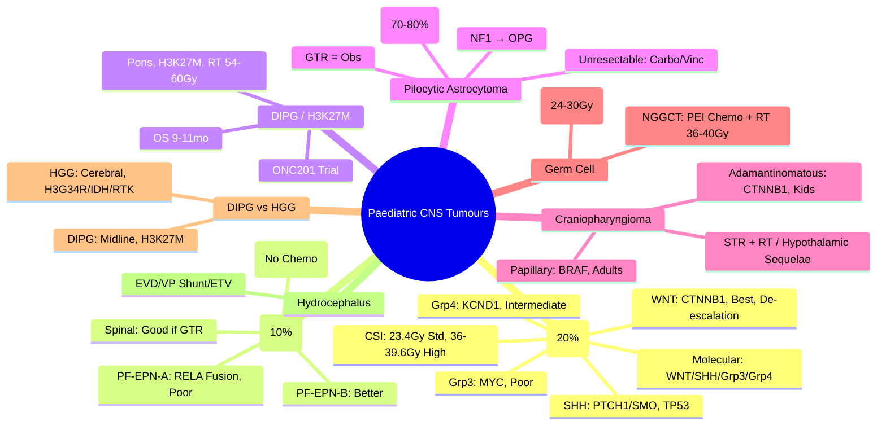

> [!tip] **FCPS/MRCP Priority: HIGH**
> **Paediatric CNS Tumours = Most Common Solid Tumour in Children (20-25%)**; **Medulloblastoma (MB) 20%**, **Pilocytic Astrocytoma 15%**, **Ependymoma 10%**, **HGG/DIPG 10-15%**, **Craniopharyngioma 5-10%**, **Germ Cell 3-5%**; **Medulloblastoma**: **Molecular Subgroups (WNT, SHH, Group 3, Group 4)** → **Risk-Adapted Therapy**; **Surgery → CSI + Chemo (SJMB12/PNOC/COG)**; **Ependymoma**: **PF-EPN-A (C11orf95-RELA), PF-EPN-B**, **Surgery → RT**; **DIPG/H3K27M**: **H3K27M Mut**, **RT Standard**, **ONC201 Trials**; **Low-Grade Glioma**: **Pilocytic (KIAA1549-BRAF)**, **Surgery ± Chemo (Carbo/Vinc)**; **Germ Cell**: **Germinoma (RT Sensitive)**, **NGGCT (Chemo + RT)**.

---

## 1. 1. Learning Objectives
By the end of this note you should be able to:
- [ ] Classify **Medulloblastoma Molecular Subgroups** (WNT, SHH, Group 3, Group 4) and Apply **Risk-Adapted Therapy**
- [ ] Deliver **Craniospinal Irradiation (CSI)** + **Chemo** for Standard/High Risk MB
- [ ] Distinguish **Ependymoma Subgroups** (PF-EPN-A RELA, PF-EPN-B) and Apply **Surgery + RT**
- [ ] Manage **DIPG (H3K27M)** with **RT + Clinical Trials (ONC201)**
- [ ] Manage **Paediatric Low-Grade Glioma (Pilocytic Astrocytoma KIAA1549-BRAF)** with **Surgery ± Carbo/Vinc**
- [ ] Manage **Craniopharyngioma** (Adamantinomatous vs Papillary) with **Surgery ± RT**
- [ ] Treat **Intracranial Germ Cell Tumours** (Germinoma RT Sensitive vs NGGCT Chemo+RT)
- [ ] Recognise **Hydrocephalus** as Common Presenting Feature (Shunt/EVD/ETV)

---

## 2. 2. Medulloblastoma (MB) — Most Common Paediatric Malignant CNS Tumour

### 1. Molecular Subgroups (WHO CNS5 / Consensus)

| Subgroup | Frequency | Genetics | Prognosis | Therapy |
|----------|-----------|----------|-----------|---------|
| **WNT** | **10%** | **CTNNB1 Mut, TP53 WT**, **Chromosome 6 Loss** | **Excellent (>95% OS)** | **De-escalation Trials (SJMB12, PNOC): Reduced CSI/No CSI** |
| **SHH** | **30%** | **PTCH1/SMO/SUFU Mut**, **TP53 Mut (Poor if Mut)** | **Intermediate (Good if TP53 WT)** | **Standard CSI + Chemo**; **SMO Inhibitors (Vismodegib) Trials** |
| **Group 3** | **25%** | **MYC Amp, OTX2, GFI1/GFI1B**, **i17q, MYC Amp** | **Poor (Aggressive, Metastatic)** | **Intensive: High-Dose CSI + HD-Chemo + ASCT** |
| **Group 4** | **35%** | **KCND1, SNCAIP, KDM6A**, **Chromosome 11q Loss** | **Intermediate** | **Standard CSI + Chemo** |

> **Molecular Testing Mandatory at Diagnosis** (RNA-Seq / Methylation Array / NGS Panel)

### 2. Chang Staging (Clinical) + Molecular Risk

| Chang Stage | Definition |
|-------------|------------|
| **M0** | No Mets |
| **M1** | CSF Mets (Cytology+) |
| **M2** | Intracranial Mets |
| **M3** | Spinal Mets |
| **M4** | Systemic Mets |

**Risk Stratification (COG / SJMB12 / PNOC):**

| Risk Group | Criteria | CSI Dose | Chemo |
|------------|----------|----------|-------|
| **Low (WNT, Non-Metastatic)** | **WNT, M0, GTR** | **De-escalation: 18-23.4Gy CSI** (Trials) / **Standard 23.4Gy** | **Reduced Cycles** |
| **Standard (SHH TP53 WT, Group 4, M0)** | **M0, Non-WNT, Non-Group 3** | **23.4Gy CSI + 36Gy Tumour Bed Boost** | **Cisplatin, Vincristine, Lomustine, Cyclophosphamide (SJMB12/Packers)** |
| **High (Group 3, MYC Amp, M+, Subtotal Resection)** | **Group 3, MYC Amp, M1-4, STR** | **36-39.6Gy CSI + Boost** | **Intensive: HD-Chemo + ASCT (SJMB12/PNOC/COG ACNS0332)** |

### 3. Treatment Principles

```mermaid
flowchart TD
    A[Medulloblastoma Diagnosis] --> B[**Molecular Subgrouping (Mandatory)**]
    B --> B1[**WNT** → **De-escalation (CSI 18-23.4Gy, Reduced Chemo)**]
    B --> B2[**SHH TP53 WT** → **Standard Risk**]
    B --> B3[**Group 4** → **Standard Risk**]
    B --> B4[**SHH TP53 Mut / Group 3 / MYC Amp / M+** → **High Risk**]
    B2 --> C[**Surgery: Maximal Safe Resection (GTR Goal)**]
    B3 --> C
    B4 --> C
    C --> D[**CSI + Tumour Bed Boost**]
    D --> D1[**Standard Risk: 23.4Gy CSI + 36Gy Boost**]
    D --> D2[**High Risk: 36-39.6Gy CSI + 54-55.8Gy Boost**]
    D1 --> E[**Adjuvant Chemo (Packer/SJMB12): Cisplatin, Vincristine, Lomustine, Cyclophosphamide, High-Dose Cisplatin + Stem Cell Rescue (High Risk)**]
    D2 --> E
```

---

## 3. 3. Ependymoma

### 1. Molecular Subgroups (WHO CNS5)

| Subgroup | Location | Genetics | Age | Prognosis |
|----------|----------|----------|-----|-----------|
| **PF-EPN-A** | **Posterior Fossa** | **C11orf95-RELA Fusion** (70%) | **Infants/Young Children** | **Poor (Recurrence High)** |
| **PF-EPN-B** | **Posterior Fossa** | **Intact RELA, CpG Island Hypermethylation** | **Older Children/Adults** | **Better** |
| **SP-EPN** | **Spinal** | **MYCN Amp (Rare), NF2** | **Adults/Older Children** | **Good (If GTR)** |
| **Supratentorial** | **Cerebral** | **ZFTA-RELA (C11orf95-RELA), YAP1** | **Variable** | **Variable** |

### 2. Treatment

```mermaid
flowchart TD
    A[Ependymoma] --> B[**Surgery: Maximal Safe Resection (GTR Goal)**]
    B --> C{Extent of Resection}
    C -->|**GTR**| D[**RT: 54-59.4Gy (Focal)**]
    C -->|**STR**| E[**RT: 54-59.4Gy (Focal) + Boost to Residual**]
    D --> F[**No Routine Chemo (Chemo Not Standard Adjuvant)**]
    E --> F
    F --> G[**Surveillance: MRI q3mo×2yr, q6mo×3yr**]
```

> **Key: RT Mandatory for All** (Even GTR) — **Chemo Not Standard** (Except Recurrent/Infant Trials)

### 3. Molecular Prognostic Markers

| Marker | Significance |
|--------|--------------|
| **PF-EPN-A (RELA Fusion)** | **Worse Prognosis**, **Younger Age**, **Higher Recurrence** |
| **1q Gain** | **Adverse** (Across Subgroups) |
| **H3K27me3 Loss** | **Adverse** (PF-EPN-A) |
| **chr 1q Gain + RELA** | **Highest Risk** |

---

## 4. 4. Diffuse Midline Glioma / DIPG (H3K27M-Mutant)

### 1. Definition & Features

| Feature | Detail |
|---------|--------|
| **Definition** | **Diffuse Midline Glioma, H3K27M-Mutant** (WHO CNS5 Grade 4) |
| **Location** | **Pons (DIPG) 70%**, Thalamus, Spinal Cord |
| **Age** | **5-10 years** (Peak 6-7yr) |
| **Genetics** | **H3K27M (H3F3A/HIST1H3B) 80%**, **ACVR1 Mut (20%)**, **TP53, PIK3R1, PPM1D** |
| **Clinical** | **Cranial Nerve Palsies (VI, VII), Ataxia, Long Tract Signs, Hydrocephalus** |

### 2. Treatment

| Modality | Standard |
|----------|----------|
| **Surgery** | **Biopsy Only (Stereotactic)** — **No Resection (Pons)** |
| **Radiotherapy** | **54-60Gy/30-33 Fx (Standard)** — **Palliative, Median OS 9-11mo** |
| **Chemo** | **No Proven Benefit** (Concurrent/Adjuvant Trials Negative) |
| **Targeted Trials** | **ONC201 (Dopamine Receptor D2 Antagonist / ClpP Agonist) — Phase 2: OS Benefit Subset** |
| | **Panobinostat (HDACi)**, **CDK4/6 Inhibitors**, **SMO Inhibitors (SHH)** |

### 3. Prognosis

| Factor | Outcome |
|--------|---------|
| **Median OS** | **9-11 months** |
| **2-Year OS** | **<10%** |
| **H3K27M + ACVR1** | **Slightly Better** |
| **H3K27M + TP53** | **Worse** |

---

## 5. 5. Paediatric Low-Grade Glioma (PLGG) — Pilocytic Astrocytoma

### 1. Epidemiology & Genetics

| Feature | Detail |
|---------|--------|
| **Most Common PLGG** | **Pilocytic Astrocytoma (WHO Grade 1)** |
| **Genetics** | **KIAA1549-BRAF Fusion (70-80%)**, **BRAF V600E (10-15%)**, **FGFR1, NTRK Fusions** |
| **Location** | **Cerebellum (40%)**, Optic Pathway/Hypothalamus (20%), Brainstem, Cerebral |
| **NF1 Association** | **Optic Pathway Glioma (OPG) in NF1 (15-20%)** |

### 2. Treatment

| Scenario | Treatment |
|----------|-----------|
| **Resectable (GTR)** | **Surgery Alone (Observation)** — **Excellent Outcome (>95% OS)** |
| **Unresectable / STR / Progressive** | **Chemotherapy: Carboplatin + Vincristine (Standard)** |
| | **Alternative: TPCV (Thiotepa, Procarbazine, Lomustine, Vincristine)** |
| **BRAF V600E** | **BRAF/MEK Inhibitors (Dabrafenib + Trametinib) — Trials/Compassionate** |
| **Optic Pathway (NF1)** | **Chemo First (Carbo/Vinc)**; **RT Delayed (Neurocognitive Toxicity)** |

> **Key: RT Avoided in Young Children** (Neurocognitive, Endocrine, Vascular Toxicity)

---

## 6. 6. Paediatric High-Grade Glioma (HGG) — Non-DIPG

| Feature | Detail |
|---------|--------|
| **H3K27M-Mutant (Midline)** | **See DIPG Section** |
| **H3G34R/V-Mutant** | **Cerebral Hemispheres, Adolescents**, **Better than H3K27M** |
| **IDH-Mutant** | **Rare in Children**, **Adult-Type, Better Prognosis** |
| **RTK-Driven (PDGFRA, EGFR, MET)** | **Targetable (Trials)** |
| **Treatment** | **Max Safe Resection → RT 59.4Gy + TMZ (Concurrent/Adjuvant)** |

---

## 7. 7. Craniopharyngioma

### 1. Histology & Genetics

| Subtype | Age | Genetics | Features |
|---------|-----|----------|----------|
| **Adamantinomatous (CP-ADAM)** | **Children (Peak 5-14)** | **CTNNB1 Mut (Beta-Catenin)** | **Calcifications, Cystic, Locally Aggressive** |
| **Papillary (CP-PAP)** | **Adults** | **BRAF V600E** | **Solid, Less Calcific** |

### 2. Treatment

| Scenario | Treatment |
|----------|-----------|
| **GTR Possible** | **Surgery Alone** (If No Hypothalamic Injury) |
| **STR / High Risk of Hypothalamic Injury** | **STR + RT (54Gy)** |
| **Recurrent** | **RT (If Not Previously Irradiated)**, **Intracystic Bleomycin/IFN-α**, **BRAF Inhibitor (Papillary)** |

### 3. Late Sequelae (Major)

| Complication | Frequency |
|--------------|-----------|
| **Hypothalamic Obesity / Hyperphagia** | **>50%** |
| **Endocrine Deficiencies (GH, Gonadotropin, TSH, ACTH, ADH)** | **>80%** |
| **Neurocognitive Impairment** | **Common** |
| **Visual Impairment** | **Variable** |

---

## 8. 8. Intracranial Germ Cell Tumours (GCT)

### 1. Classification & Features

| Type | Frequency | Markers | RT Sensitivity | Treatment |
|------|-----------|---------|----------------|-----------|
| **Germinoma** | **60-70%** | **PLAP+, OCT3/4+, CD117+**, **AFP-, hCG-** | **Very High (RT Alone Curative)** | **RT 24-30Gy (CSI/Whole Ventricle) ± Chemo (Reduced)** |
| **NGGCT** | **30-40%** | **Teratoma, Yolk Sac (AFP+), Choriocarcinoma (hCG+), Embryonal Carcinoma** | **Lower** | **Chemo (PEI: Cisplatin, Etoposide, Ifosfamide) → RT 36-40Gy** |
| **Mixed** | **10-15%** | **Both Components** | **Intermediate** | **Chemo + RT** |

### 2. Location & Presentation

| Location | Frequency |
|----------|-----------|
| **Pineal Region** | **50%** |
| **Suprasellar/Third Ventricle** | **30-40%** |
| **Both (Bifocal)** | **10-15%** |

**Usual Presentation:** **Hydrocephalus, Endocrine Deficits (DI, Hypopituitarism), Visual Disturbance (Suprasellar)**

### 3. Treatment by Type

| Type | Chemo | RT |
|------|-------|----|
| **Germinoma (Localized)** | **Reduced Cycles (PEI ×2-4)** | **Whole Ventricle 24Gy + Boost 30Gy** OR **CSI 24Gy** |
| **Germinoma (Metastatic)** | **PEI ×4-6** | **CSI 24-30Gy + Boost** |
| **NGGCT** | **PEI ×4-6 (Cisplatin, Etoposide, Ifosfamide)** | **CSI 24Gy + Boost 36-40Gy** |
| **Mature Teratoma** | **Surgery Alone** | **No RT** |
| **Immature Teratoma** | **Chemo (PEI) + RT** | **Focal RT** |

---

## 9. 9. Hydrocephalus Management (Common Across Paediatric CNS Tumours)

| Approach | Indication |
|----------|------------|
| **External Ventricular Drain (EVD)** | **Acute, Pre-Op, Infected CSF** |
| **Ventriculoperitoneal Shunt (VP Shunt)** | **Chronic, Post-Op, Long-Term** |
| **Endoscopic Third Ventriculostomy (ETV)** | **Obstructive (Aqueduct Stenosis, Posterior Fossa Tumours)** |
| **ETV + Choroid Plexus Cauterisation (CPC)** | **Infants, High CSF Production** |

---

## 10. 10. FCPS/MRCP High-Yield Summary

| Tumour | Key Points |
|--------|------------|
| **Medulloblastoma** | **WNT (Excellent, De-escalation), SHH (Intermediate), Group 3 (Poor, MYC), Group 4 (Intermediate)**; **CSI 23.4Gy (Std) / 36-39.6Gy (High)** |
| **Ependymoma** | **PF-EPN-A (RELA Fusion, Poor)**, **PF-EPN-B (Better)**, **Surgery GTR → RT 54-59.4Gy**, **No Routine Chemo** |
| **DIPG** | **H3K27M Mutant**, **Pons**, **RT 54-60Gy**, **ONC201 Trials**, **Median OS 9-11mo** |
| **Pilocytic Astrocytoma** | **KIAA1549-BRAF Fusion**, **GTR = Obs**, **Unresectable = Carbo/Vinc**, **Avoid RT** |
| **DIPG vs HGG** | **DIPG = H3K27M Midline (Pons)**, **HGG = H3G34R/IDH/RTK Cerebral** |
| **Craniopharyngioma** | **Adamantinous (CTNNB1, Kids)**, **Papillary (BRAF, Adults)**, **STR + RT**, **Hypothalamic Sequelae** |
| **Germ Cell** | **Germinoma = RT Sensitive (24-30Gy)**, **NGGCT = Chemo (PEI) + RT (36-40Gy)** |
| **Hydrocephalus** | **EVD (Acute), VP Shunt (Chronic), ETV (Obstructive)** |

---

## 11. 11. Viva Questions (MRCP PACES / FCPS)

| Question | Expected Answer |
|----------|-----------------|
| **8yr, Posterior Fossa Mass, Molecular: WNT Subgroup, M0, GTR. Treatment?** | **WNT Medulloblastoma, Low Risk** → **De-escalation Trial (SJMB12/PNOC): CSI 18-23.4Gy + Reduced Chemo** OR **Standard 23.4Gy CSI + Chemo**. |
| **Medulloblastoma Group 3, MYC Amplified, M+. Risk, CSI Dose?** | **High Risk** → **CSI 36-39.6Gy + Boost 54-55.8Gy** + **Intensive Chemo + ASCT (SJMB12/PNOC)**. |
| **Ependymoma PF-EPN-A vs PF-EPN-B — Difference?** | **PF-EPN-A: C11orf95-RELA Fusion, Infants, Poor Prognosis**; **PF-EPN-B: No RELA, Older, Better Prognosis**. |
| **DIPG — H3K27M, Standard Treatment, Median OS?** | **RT 54-60Gy** (Palliative), **Median OS 9-11 months**; **ONC201 Trials**. |
| **Pilocytic Astrocytoma — BRAF Fusion, Unresectable Optic Pathway. Treatment?** | **Chemotherapy: Carboplatin + Vincristine (Standard)**; **Avoid RT (Neurocognitive Toxicity)**; **BRAF V600E → Dabrafenib + Trametinib (Trials)**. |
| **Craniopharyngioma Adamantinomatous vs Papillary — Genetics, Age?** | **Adamantinomatous: CTNNB1 Mut, Children, Calcifications**; **Papillary: BRAF V600E, Adults, Solid**. |
| **Germinoma vs NGGCT — RT Sensitivity, Treatment?** | **Germinoma: RT Sensitive (24-30Gy CSI/Whole Ventricle), Reduced Chemo**; **NGGCT: Chemo (PEI) + RT 36-40Gy**. |
| **Hydrocephalus in Paediatric CNS Tumours — ETV vs VP Shunt?** | **ETV: Obstructive (Aqueduct Stenosis, Posterior Fossa Tumours), Preferred if Anatomy Permits**; **VP Shunt: Chronic, Communicating, Post-Infectious, ETV Failure**. |
| **Medulloblastoma Molecular Subgroups — 4 Types?** | **WNT (CTNNB1, Excellent), SHH (PTCH1/SMO, Intermediate), Group 3 (MYC, Poor), Group 4 (KCND1, Intermediate)**. |
| **Ependymoma — GTR vs STR Adjuvant?** | **GTR: RT 54-59.4Gy Focal**; **STR: RT 54-59.4Gy + Boost to Residual**; **No Routine Adjuvant Chemo**. |

---

## 12. 12. Confusions & Mnemonics

| Confusion | Clarification |
|-----------|---------------|
| **Medulloblastoma Molecular vs Chang Staging** | **Molecular (WNT/SHH/Grp3/4) = Biology/Prognosis/Therapy**; **Chang (M0-M4) = Clinical Metastatic Stage** |
| **WNT vs SHH De-escalation** | **WNT: Best Prognosis, Trials Omitting CSI**; **SHH: TP53 WT = Standard, TP53 Mut = High Risk** |
| **DIPG vs Non-DIPG H3K27M** | **DIPG = Pons**; **Non-DIPG = Thalamus/Spinal Cord**; **Both H3K27M Mutant, Similar Poor Prognosis** |
| **Pilocytic vs Pilomyxoid** | **Pilocytic: Grade 1, KIAA1549-BRAF, Biphasic, Rosenthal Fibres**; **Pilomyxoid: Grade 2, Monophasic, Myxoid, More Aggressive** |
| **Germinoma RT Volume** | **Localized: Whole Ventricle 24Gy + Boost 30Gy**; **Metastatic: CSI 24-30Gy**; **Bifocal: CSI 24Gy** |
| **Ependymoma RT Volume** | **Focal RT Only (Tumour Bed + Margin)** — **No CSI** (Unless Metastatic) |
| **Craniopharyngioma Sequelae** | **Hypothalamic Obesity, Panhypopituitarism, Visual Loss, Neurocognitive** — **Major Cause of Morbidity** |

**Mnemonic: PAED-CNS**
- **P**aediatric CNS: **Most Common Solid Tumour (20-25%)**
- **A**strocytoma Pilocytic: **KIAA1549-BRAF**, **GTR = Obs**, **Carbo/Vinc if Unresectable**
- **E**pendymoma: **PF-EPN-A (RELA, Poor), PF-EPN-B (Better)**, **GTR + RT, No Chemo**
- **D**IPG: **H3K27M, Pons**, **RT 54-60Gy**, **Onc201 Trial**, **OS 9-11mo**
- **I**ntracranial GCT: **Germinoma (RT Sensitive 24-30Gy)**, **NGGCT (Chemo+RT)**
- **A**typical Teratoid/Rhabdoid (ATRT): **SMARCB1/INI1 Loss**, **Intensive Chemo+RT**
- **P**lexiform Neurofibroma/OPG: **NF1**, **Carbo/Vinc**, **RT Avoidance**
- **C**raniopharyngioma: **Adamantinomatous (CTNNB1, Kids)**, **Papillary (BRAF, Adults)**, **Hypothalamic Sequelae**
- **H**ydrocephalus: **EVD (Acute), VP Shunt (Chronic), ETV (Obstructive)**
- **M**edulloblastoma: **WNT/SHH/Grp3/Grp4**, **CSI 23.4Gy (Std), 36-39.6Gy (High)**
- **L**ow-Grade Glioma: **Pilocytic (KIAA1549-BRAF)**, **GTR = Obs**, **RT Avoidance**

---

## 13. 13. Mind Map



---

## 14. 14. One-Page Revision Card

| Tumour | Key Points |
|--------|------------|
| **Medulloblastoma** | WNT/SHH/Grp3/Grp4; CSI 23.4Gy Std, 36-39.6Gy High; WNT De-escalation |
| **Ependymoma** | PF-EPN-A (RELA) Poor; PF-EPN-B Better; GTR → RT 54-59.4Gy; No Chemo |
| **DIPG** | H3K27M, Pons, RT 54-60Gy, ONC201, OS 9-11mo |
| **Pilocytic Astrocytoma** | KIAA1549-BRAF; GTR = Obs; Carbo/Vinc; No RT |
| **Craniopharyngioma** | Adamantinomatous (CTNNB1) vs Papillary (BRAF); STR+RT; Hypothalamic Sequelae |
| **Germ Cell** | Germinoma RT 24-30Gy; NGGCT PEI+RT 36-40Gy |
| **Hydrocephalus** | EVD (Acute), VP Shunt (Chronic), ETV (Obstructive) |

---

## 15. 15. Spaced Repetition Trackers

| Review Interval | Date Completed | Confidence (1-5) | Notes |
|-----------------|----------------|------------------|-------|
| 24 hours | | | |
| 7 days | | | |
| 15 days | | | |
| 30 days | | | |
| 90 days | | | |

---

## 16. 16. Self-Test Scorecard

| Section | Score /5 | Last Attempt |
|---------|----------|--------------|
| MB Molecular Subgroups | | |
| MB Risk/CSI Doses | | |
| Ependymoma Subgroups | | |
| DIPG Management | | |
| Pilocytic Astrocytoma BRAF | | |
| Craniopharyngioma Types | | |
| Germ Cell Tumours | | |
| Hydrocephalus Management | | |

---

## 17. 17. Local Navigation
- **Parent Heading**: [[../Oncology|Oncology]]
- **Chapter Map": [[../Davidson Chapter 7 - Oncology Hierarchy|Oncology Hierarchy]]
- **Chapter MOC": [[../Oncology MOC|Oncology MOC]]
- **Drug Reference": [[../../Clinical Therapeutics and Good Prescribing|Drugs]]
- **Related": [[Paediatric ALL]], [[Paediatric AML]], [[Paediatric Lymphomas]], [[Paediatric Solid Tumours]], [[Adult Glioblastoma]], [[Adult Ependymoma]], [[Adult Meningioma]], [[WNT/SHH/Group 3/4]], [[H3K27M]], [[ONC201]], [[KIAA1549-BRAF]], [[Craniopharyngioma]], [[Intracranial GCT]]

---

# FCPS/MRCP Exam Extras

## 18. 18. MCQs (10)


**1.** Regarding Paediatric CNS Tumours (Medulloblastoma), which statement is correct?
   A. **WNT (Excellent, De-escalation), SHH (Intermediate), Group 3 (Poor, MYC), Group 4 (Intermediate)**
   B. **WNT - alternative approach
   C. Empirical management only
   D. Watch and wait
   - **Answer: A** — **WNT (Excellent, De-escalation), SHH (Intermediate), Group 3 (Poor, MYC), Group 4 (Intermediate)**; **CSI 23.4Gy (Std) ...


**2.** Regarding Paediatric CNS Tumours (Ependymoma), which statement is correct?
   A. **PF-EPN-A (RELA Fusion, Poor)**, **PF-EPN-B (Better)**, **Surgery GTR → RT 54-59.4Gy**, **No Routin
   B. **PF-EPN-A - alternative approach
   C. Empirical management only
   D. Watch and wait
   - **Answer: A** — **PF-EPN-A (RELA Fusion, Poor)**, **PF-EPN-B (Better)**, **Surgery GTR → RT 54-59.4Gy**, **No Routine Chemo**


**3.** Regarding Paediatric CNS Tumours (DIPG), which statement is correct?
   A. **H3K27M Mutant**, **Pons**, **RT 54-60Gy**, **ONC201 Trials**, **Median OS 9-11mo**
   B. **H3K27M - alternative approach
   C. Empirical management only
   D. Watch and wait
   - **Answer: A** — **H3K27M Mutant**, **Pons**, **RT 54-60Gy**, **ONC201 Trials**, **Median OS 9-11mo**


**4.** Regarding Paediatric CNS Tumours (Pilocytic Astrocytoma), which statement is correct?
   A. **KIAA1549-BRAF Fusion**, **GTR = Obs**, **Unresectable = Carbo/Vinc**, **Avoid RT**
   B. **KIAA1549-BRAF - alternative approach
   C. Empirical management only
   D. Watch and wait
   - **Answer: A** — **KIAA1549-BRAF Fusion**, **GTR = Obs**, **Unresectable = Carbo/Vinc**, **Avoid RT**


**5.** Regarding Paediatric CNS Tumours (DIPG vs HGG), which statement is correct?
   A. **DIPG = H3K27M Midline (Pons)**, **HGG = H3G34R/IDH/RTK Cerebral**
   B. **DIPG - alternative approach
   C. Empirical management only
   D. Watch and wait
   - **Answer: A** — **DIPG = H3K27M Midline (Pons)**, **HGG = H3G34R/IDH/RTK Cerebral**


**6.** Regarding Paediatric CNS Tumours (Craniopharyngioma), which statement is correct?
   A. **Adamantinous (CTNNB1, Kids)**, **Papillary (BRAF, Adults)**, **STR + RT**, **Hypothalamic Sequelae
   B. **Adamantinous - alternative approach
   C. Empirical management only
   D. Watch and wait
   - **Answer: A** — **Adamantinous (CTNNB1, Kids)**, **Papillary (BRAF, Adults)**, **STR + RT**, **Hypothalamic Sequelae**


**7.** Regarding Paediatric CNS Tumours (Germ Cell), which statement is correct?
   A. **Germinoma = RT Sensitive (24-30Gy)**, **NGGCT = Chemo (PEI) + RT (36-40Gy)**
   B. **Germinoma - alternative approach
   C. Empirical management only
   D. Watch and wait
   - **Answer: A** — **Germinoma = RT Sensitive (24-30Gy)**, **NGGCT = Chemo (PEI) + RT (36-40Gy)**


**8.** Regarding Paediatric CNS Tumours (Hydrocephalus), which statement is correct?
   A. **EVD (Acute), VP Shunt (Chronic), ETV (Obstructive)**
   B. **EVD - alternative approach
   C. Empirical management only
   D. Watch and wait
   - **Answer: A** — **EVD (Acute), VP Shunt (Chronic), ETV (Obstructive)**


**9.** Regarding Paediatric CNS Tumours (FCPS/MRCP High Yield - Paediatric CNS Tu), which statement is correct?
   - A. FCPS/MRCP High Yield - Paediatric CNS Tumours: Medulloblastoma (MB) WNT/SHH/Group3/4, Molecular Risk, Surgery → RT/CSI +
   - B. Empirical approach without specific indication
   - C. Used only in research protocols
   - D. Not relevant in current practice
   - **Answer: A** — FCPS/MRCP High Yield - Paediatric CNS Tumours: Medulloblastoma (MB) WNT/SHH/Group3/4, Molecular Risk, Surgery → RT/CSI + Chemo (SJ...

**10.** Regarding Paediatric CNS Tumours (Ependymoma), which statement is correct?
   - A. Ependymoma: PF-EPN-A (C11orf95-RELA), PF-EPN-B, Spinal, Surgery → RT
   - B. Empirical approach without specific indication
   - C. Used only in research protocols
   - D. Not relevant in current practice
   - **Answer: A** — Ependymoma: PF-EPN-A (C11orf95-RELA), PF-EPN-B, Spinal, Surgery → RT

## 19. 19. SBA Questions (10)


**1.** A 55-year-old presents with classic features. MDT discussion recommends:
   - A. **WNT (Excellent, De-escalation), SHH (Intermediate), Group 3 (Poor, MYC), Group 4 (Intermediate)**
   - B. **WNT (less specific)
   - C. Empirical broad approach
   - D. No intervention required
   - **Answer: A** — first-line: **WNT (Excellent, De-escalation), SHH (Intermediate), Group 3 (Poor, MYC), Group 4 (Intermediate)**; **CSI 23.4Gy (Std) ...


**2.** On staging workup, the patient is found to be [Stage X]. Best management is:
   - A. **PF-EPN-A (RELA Fusion, Poor)**, **PF-EPN-B (Better)**, **Surgery GTR → RT 54-59.4Gy**, **No Routin
   - B. **PF-EPN-A (less specific)
   - C. Empirical broad approach
   - D. No intervention required
   - **Answer: A** — stage-specific: **PF-EPN-A (RELA Fusion, Poor)**, **PF-EPN-B (Better)**, **Surgery GTR → RT 54-59.4Gy**, **No Routine Chemo**


**3.** Following first-line treatment, the patient develops [complication]. Best next step:
   - A. **H3K27M Mutant**, **Pons**, **RT 54-60Gy**, **ONC201 Trials**, **Median OS 9-11mo**
   - B. **H3K27M (less specific)
   - C. Empirical broad approach
   - D. No intervention required
   - **Answer: A** — complication: **H3K27M Mutant**, **Pons**, **RT 54-60Gy**, **ONC201 Trials**, **Median OS 9-11mo**


**4.** The patient asks about prognosis. Most appropriate response based on:
   - A. **KIAA1549-BRAF Fusion**, **GTR = Obs**, **Unresectable = Carbo/Vinc**, **Avoid RT**
   - B. **KIAA1549-BRAF (less specific)
   - C. Empirical broad approach
   - D. No intervention required
   - **Answer: A** — prognosis: **KIAA1549-BRAF Fusion**, **GTR = Obs**, **Unresectable = Carbo/Vinc**, **Avoid RT**


**5.** A 65-year-old with relevant risk factors should be screened with:
   - A. **DIPG = H3K27M Midline (Pons)**, **HGG = H3G34R/IDH/RTK Cerebral**
   - B. **DIPG (less specific)
   - C. Empirical broad approach
   - D. No intervention required
   - **Answer: A** — screening: **DIPG = H3K27M Midline (Pons)**, **HGG = H3G34R/IDH/RTK Cerebral**


**6.** The most clinically important biomarker/molecular test is:
   - A. **Adamantinous (CTNNB1, Kids)**, **Papillary (BRAF, Adults)**, **STR + RT**, **Hypothalamic Sequelae
   - B. **Adamantinous (less specific)
   - C. Empirical broad approach
   - D. No intervention required
   - **Answer: A** — biomarker: **Adamantinous (CTNNB1, Kids)**, **Papillary (BRAF, Adults)**, **STR + RT**, **Hypothalamic Sequelae**


**7.** The standard chemotherapy/regimen of choice is:
   - A. **Germinoma = RT Sensitive (24-30Gy)**, **NGGCT = Chemo (PEI) + RT (36-40Gy)**
   - B. **Germinoma (less specific)
   - C. Empirical broad approach
   - D. No intervention required
   - **Answer: A** — chemo: **Germinoma = RT Sensitive (24-30Gy)**, **NGGCT = Chemo (PEI) + RT (36-40Gy)**


**8.** The role of surgery in this case is:
   - A. **EVD (Acute), VP Shunt (Chronic), ETV (Obstructive)**
   - B. **EVD (less specific)
   - C. Empirical broad approach
   - D. No intervention required
   - **Answer: A** — surgery: **EVD (Acute), VP Shunt (Chronic), ETV (Obstructive)**


**9.** A clinician encounters this presentation. Best approach:
   - A. FCPS/MRCP High Yield - Paediatric CNS Tumours: Medulloblastoma (MB) WNT/SHH/Group3/4, Molecular Risk, Surgery → RT/CSI +
   - B. Watch and wait approach
   - C. Empirical broad treatment
   - D. No intervention required
   - **Answer: A** — FCPS/MRCP High Yield - Paediatric CNS Tumours: Medulloblastoma (MB) WNT/SHH/Group3/4, Molecular Risk, Surgery → RT/CSI + Chemo (SJ...

**10.** On evaluation, the finding is confirmed. Most appropriate next step:
   - A. Ependymoma: PF-EPN-A (C11orf95-RELA), PF-EPN-B, Spinal, Surgery → RT
   - B. Watch and wait approach
   - C. Empirical broad treatment
   - D. No intervention required
   - **Answer: A** — Ependymoma: PF-EPN-A (C11orf95-RELA), PF-EPN-B, Spinal, Surgery → RT

## 20. 20. Flashcards

**Q1:** Medulloblastoma?
**A1:** WNT (Excellent, De-escalation), SHH (Intermediate), Group 3 (Poor, MYC), Group 4 (Intermediate); CSI 23.4Gy (Std) / 36-39.6Gy (High)

**Q2:** Ependymoma?
**A2:** PF-EPN-A (RELA Fusion, Poor), PF-EPN-B (Better), Surgery GTR → RT 54-59.4Gy, No Routine Chemo

**Q3:** DIPG?
**A3:** H3K27M Mutant, Pons, RT 54-60Gy, ONC201 Trials, Median OS 9-11mo

**Q4:** Pilocytic Astrocytoma?
**A4:** KIAA1549-BRAF Fusion, GTR = Obs, Unresectable = Carbo/Vinc, Avoid RT

**Q5:** DIPG vs HGG?
**A5:** DIPG = H3K27M Midline (Pons), HGG = H3G34R/IDH/RTK Cerebral

**Q6:** Craniopharyngioma?
**A6:** Adamantinous (CTNNB1, Kids), Papillary (BRAF, Adults), STR + RT, Hypothalamic Sequelae

**Q7:** Germ Cell?
**A7:** Germinoma = RT Sensitive (24-30Gy), NGGCT = Chemo (PEI) + RT (36-40Gy)

**Q8:** Hydrocephalus?
**A8:** EVD (Acute), VP Shunt (Chronic), ETV (Obstructive)

## 21. 21. Answer Key with Explanations

| # | MCQ | Topic | Explanation |
|---|-----|-------|-------------|
| 1 | A | Medulloblastoma | WNT (Excellent, De-escalation), SHH (Intermediate), Group 3 (Poor, MYC), Group 4 (Intermediate); CSI 23.4Gy (Std) / 36-3 |
| 2 | A | Ependymoma | PF-EPN-A (RELA Fusion, Poor), PF-EPN-B (Better), Surgery GTR → RT 54-59.4Gy, No Routine Chemo |
| 3 | A | DIPG | H3K27M Mutant, Pons, RT 54-60Gy, ONC201 Trials, Median OS 9-11mo |
| 4 | A | Pilocytic Astrocytoma | KIAA1549-BRAF Fusion, GTR = Obs, Unresectable = Carbo/Vinc, Avoid RT |
| 5 | A | DIPG vs HGG | DIPG = H3K27M Midline (Pons), HGG = H3G34R/IDH/RTK Cerebral |
| 6 | A | Craniopharyngioma | Adamantinous (CTNNB1, Kids), Papillary (BRAF, Adults), STR + RT, Hypothalamic Sequelae |
| 7 | A | Germ Cell | Germinoma = RT Sensitive (24-30Gy), NGGCT = Chemo (PEI) + RT (36-40Gy) |
| 8 | A | Hydrocephalus | EVD (Acute), VP Shunt (Chronic), ETV (Obstructive) |
| 9 | A | FCPS/MRCP High Yield - Paediatric CNS Tumours | FCPS/MRCP High Yield - Paediatric CNS Tumours: Medulloblastoma (MB) WNT/SHH/Group3/4, Molecular Risk, Surgery → RT/CSI + |
| 10 | A | Ependymoma | Ependymoma: PF-EPN-A (C11orf95-RELA), PF-EPN-B, Spinal, Surgery → RT |

| # | SBA | Topic | Explanation |
|---|-----|-------|-------------|
| 1 | A | Medulloblastoma | WNT (Excellent, De-escalation), SHH (Intermediate), Group 3 (Poor, MYC), Group 4 (Intermediate); CSI 23.4Gy (Std) / 36-3 |
| 2 | A | Ependymoma | PF-EPN-A (RELA Fusion, Poor), PF-EPN-B (Better), Surgery GTR → RT 54-59.4Gy, No Routine Chemo |
| 3 | A | DIPG | H3K27M Mutant, Pons, RT 54-60Gy, ONC201 Trials, Median OS 9-11mo |
| 4 | A | Pilocytic Astrocytoma | KIAA1549-BRAF Fusion, GTR = Obs, Unresectable = Carbo/Vinc, Avoid RT |
| 5 | A | DIPG vs HGG | DIPG = H3K27M Midline (Pons), HGG = H3G34R/IDH/RTK Cerebral |
| 6 | A | Craniopharyngioma | Adamantinous (CTNNB1, Kids), Papillary (BRAF, Adults), STR + RT, Hypothalamic Sequelae |
| 7 | A | Germ Cell | Germinoma = RT Sensitive (24-30Gy), NGGCT = Chemo (PEI) + RT (36-40Gy) |
| 8 | A | Hydrocephalus | EVD (Acute), VP Shunt (Chronic), ETV (Obstructive) |

| 11 | A | FCPS/MRCP High Yield - Paediatric CNS Tumours | FCPS/MRCP High Yield - Paediatric CNS Tumours: Medulloblastoma (MB) WNT/SHH/Group3/4, Molecular Risk, Surgery → RT/CSI + |
| 12 | A | Ependymoma | Ependymoma: PF-EPN-A (C11orf95-RELA), PF-EPN-B, Spinal, Surgery → RT |
## 22. 22. Local Navigation


- **Parent Heading Hub**: [[../../Paediatric Cancers|Paediatric Cancers]]
- **Chapter Map**: [[../../Davidson Chapter 7 - Oncology Hierarchy|Oncology Hierarchy]]
- **Chapter MOC**: [[../../Oncology MOC|Oncology MOC]]
- **Drug Reference**: [[../../../Clinical Therapeutics and Good Prescribing|Drugs]]
---

> Auto-generated study sections for "Paediatric Cancers" — Ch 8: Oncology.

## Flashcards (16 generated)

- Q: What is the definition of Paediatric Cancers?
  A: Diffuse Midline Glioma, H3K27M-Mutant (WHO CNS5 Grade 4)
- Q: What is Location of Paediatric Cancers?
  A: Pons (DIPG) 70%, Thalamus, Spinal Cord
- Q: What is Age of Paediatric Cancers?
  A: 5-10 years (Peak 6-7yr)
- Q: What is Genetics of Paediatric Cancers?
  A: H3K27M (H3F3A/HIST1H3B) 80%, ACVR1 Mut (20%), TP53, PIK3R1, PPM1D
- Q: What is Clinical of Paediatric Cancers?
  A: Cranial Nerve Palsies (VI, VII), Ataxia, Long Tract Signs, Hydrocephalus
- Q: What is Most Common PLGG of Paediatric Cancers?
  A: Pilocytic Astrocytoma (WHO Grade 1)
- Q: What is Genetics of Paediatric Cancers?
  A: KIAA1549-BRAF Fusion (70-80%), BRAF V600E (10-15%), FGFR1, NTRK Fusions
- Q: What is Location of Paediatric Cancers?
  A: Cerebellum (40%), Optic Pathway/Hypothalamus (20%), Brainstem, Cerebral
- Q: What is NF1 Association of Paediatric Cancers?
  A: Optic Pathway Glioma (OPG) in NF1 (15-20%)
- Q: What is the definition of Paediatric Cancers?
  A: Diffuse Midline Glioma, H3K27M-Mutant (WHO CNS5 Grade 4)
- Q: What is Location of Paediatric Cancers?
  A: Pons (DIPG) 70%, Thalamus, Spinal Cord
- Q: What is Age of Paediatric Cancers?
  A: 5-10 years (Peak 6-7yr)
- Q: What is Genetics of Paediatric Cancers?
  A: H3K27M (H3F3A/HIST1H3B) 80%, ACVR1 Mut (20%), TP53, PIK3R1, PPM1D
- Q: What is Most Common PLGG of Paediatric Cancers?
  A: Pilocytic Astrocytoma (WHO Grade 1)
- Q: What is Genetics of Paediatric Cancers?
  A: KIAA1549-BRAF Fusion (70-80%), BRAF V600E (10-15%), FGFR1, NTRK Fusions
- Q: What is Location of Paediatric Cancers?
  A: Cerebellum (40%), Optic Pathway/Hypothalamus (20%), Brainstem, Cerebral

## MCQs (1 generated)

1. **Which of the following best describes Paediatric Cancers?**
   A. **Paediatric CNS Tumours = Most Common Solid Tumour in Children (20-25%); Medulloblastoma (MB) 20%, Pilocytic Astrocytoma 15%, Ependymoma 10%, HGG/DIPG 10-15%, Craniopharyngioma 5-10%, Germ Cell 3-5%; M**
   B. An unrelated condition not matching the clinical picture of Paediatric Cancers
   C. A complication seen late in the disease course of Paediatric Cancers
   D. A condition that mimics Paediatric Cancers but has a different underlying cause

## SBA Questions (1 generated)

1. A patient with suspected Paediatric Cancers presents with: Chang Stage — Definition; M0 — No Mets; M1 — CSF Mets (Cytology+). What is the most likely diagnosis?
   A. **Paediatric Cancers**
   B. A condition that mimics Paediatric Cancers but is not the same entity
   C. A complication of Paediatric Cancers rather than the primary diagnosis
   D. An unrelated condition in the same clinical category as Paediatric Cancers

