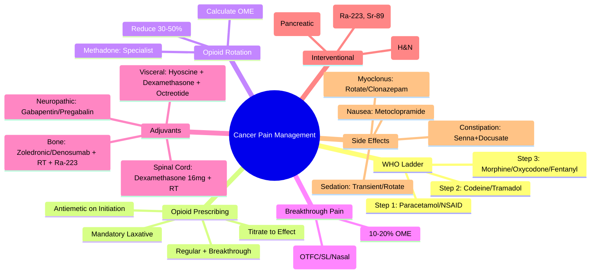

> [!tip] **FCPS/MRCP Priority: HIGH**
> **Cancer Pain: WHO Analgesic Ladder (Step 1: Paracetamol/NSAID ± Adjuvant; Step 2: Weak Opioid (Codeine/Tramadol) ± Step 1; Step 3: Strong Opioid (Morphine/Oxycodone/Fentanyl) ± Step 1)**; **Opioid Rotation** (Equianalgesic Dosing, Reduce 30-50% for Incomplete Cross-Tolerance); **Breakthrough Pain**: **IR Oral Transmucosal Fentanyl**; **Adjuvants**: Gabapentin/Pregabalin (Neuropathic), Duloxetine/Amitriptyline, Corticosteroids (Dexamethasone), Bisphosphonates/Denosumab (Bone), Radiopharmaceuticals (Ra-223, Sr-89); **Neuropathic Pain**: Gabapentin/Pregabalin, TCAs, SNRIs; **Bone Pain**: RT, Bisphosphonates, Denosumab, Ra-223; **Celiac Plexus Block** (Pancreatic Cancer).

---

## 1. 1. Learning Objectives
By the end of this note you should be able to:
- [ ] Apply **WHO Analgesic Ladder** (3-Step) for Cancer Pain
- [ ] Calculate **Equianalgesic Doses** for **Opioid Rotation**
- [ ] Manage **Breakthrough Pain** with **Rapid-Onset Fentanyl**
- [ ] Select **Adjuvant Analgesics** by Pain Type (Neuropathic, Bone, Visceral)
- [ ] Prescribe **Opioids Safely** (Titration, Monitoring, Constipation Prophylaxis)
- [ ] Perform **Celiac Plexus Block** Indications (Pancreatic Cancer)
- [ ] Use **Radiopharmaceuticals** for Diffuse Bone Pain (Ra-223, Sr-89)

---

## 2. 2. WHO Analgesic Ladder (3-Step)

| Step | Pain Severity | Analgesic | Examples | Adjuvants |
|------|---------------|-----------|----------|-----------|
| **Step 1** | **Mild (1-3/10)** | **Non-Opioid ± Adjuvant** | **Paracetamol 1g QDS**, **NSAIDs (Ibuprofen 400mg TDS, Naproxen 250mg BD, Diclofenac 50mg TDS)** | **Gabapentin/Pregabalin** (Neuropathic), **Dexamethasone** (Inflammatory/Spinal Cord), **Bisphosphonates** (Bone) |
| **Step 2** | **Moderate (4-6/10)** | **Weak Opioid + Non-Opioid ± Adjuvant** | **Codeine 30-60mg QDS**, **Tramadol 50-100mg QDS**, **Dihydrocodeine 30mg QDS** | **Same as Step 1** |
| **Step 3** | **Severe (7-10/10)** | **Strong Opioid + Non-Opioid ± Adjuvant** | **Morphine (IR 5-10mg 4h / SR 10-30mg BD)**, **Oxycodone (IR 5-10mg 4h / SR 10-20mg BD)**, **Fentanyl Patch (25-100mcg/h q72h)**, **Hydromorphone, Buprenorphine** | **Same as Step 1** |

> **Key Principles:** **By Mouth, By Clock, By Ladder, For Individual, Attention to Detail**; **Regular + Breakthrough Dosing**

---

## 3. 3. Opioid Equianalgesic Table (Oral/Parenteral)

| Opioid | Oral Dose (mg) | Parenteral Dose (mg) | Relative Potency |
|--------|----------------|----------------------|------------------|
| **Morphine** | **30** (Reference) | **10** | 1 |
| **Oxycodone** | **20** | **10** | **1.5x Morphine** |
| **Hydromorphone** | **7.5** | **1.5** | **4x Morphine** |
| **Fentanyl** | — | **0.1 (100mcg)** | **100x Morphine** |
| **Codeine** | **200** | **100** | **0.15x Morphine** |
| **Tramadol** | **300** | **100** | **0.1x Morphine** |
| **Methadone** | **Variable (4-20mg = 30mg Morphine)** | — | **Complex (Long Half-Life, NMDA Antagonist)** |
| **Buprenorphine** | **0.4mg SL** | **0.3mg IV** | **~40x Morphine (Partial Agonist)** |

### 1. Opioid Rotation Protocol

```mermaid
flowchart TD
    A[Inadequate Analgesia / Intolerable Side Effects] --> B[**Calculate Current 24h Oral Morphine Equivalent (OME)**]
    B --> C[**Select New Opioid**]
    C --> D[**Reduce Calculated Dose by 30-50%** (Incomplete Cross-Tolerance)]
    D --> E[**Start New Opioid at Reduced Dose**]
    E --> F[**Titrate to Effect** (IR for Breakthrough)]
    F --> G[**Monitor: Pain Scores, Sedation, Respiratory Rate, Constipation, Nausea**]
```

---

## 4. 4. Breakthrough Pain (BTP)

| Feature | Management |
|---------|------------|
| **Definition** | **Transient Flare (Peak 3-5min, Duration 30-60min)** on Background Controlled Pain |
| **Incidence** | **40-80% on Opioids** |
| **First-Line** | **Rapid-Onset Fentanyl (ROF)** |
| **ROF Options** | **Oral Transmucosal (OTFC 200-800mcg)**, **Sublingual (SL 100-400mcg)**, **Buccal (BTP 100-800mcg)**, **Nasal Spray (50-400mcg)**, **Sublingual Spray (100-400mcg)** |
| **Dosing** | **Start Lowest Dose, Titrate Independently of Background Opioid** |
| **Rescue Dose** | **10-20% of 24h OME** (Traditional IR Oral Morphine/Oxycodone) |
| **Max Frequency** | **Q1-2h PRN** (Max 4-6 doses/day) |

---

## 5. 5. Adjuvant Analgesics by Pain Type

| Pain Type | First-Line Adjuvant | Second-Line / Alternatives |
|-----------|---------------------|----------------------------|
| **Neuropathic** | **Gabapentin (300-3600mg/d TDS)** OR **Pregabalin (75-600mg/d BD)** | **Duloxetine 60mg OD**, **Amitriptyline 10-75mg ON**, **Topical Lidocaine 5% / Capsaicin 0.075%** |
| **Bone Metastases** | **Bisphosphonate (Zoledronic Acid 4mg IV q4wk)** OR **Denosumab 120mg SC q4wk** | **Radiopharmaceuticals (Ra-223, Sr-89)**, **Local RT (8Gy×1 / 20Gy/5fx)**, **Dexamethasone 8-16mg (Spinal Cord Compression)** |
| **Visceral (Colic/Obstruction)** | **Antispasmodic (Hyoscine Butylbromide 20mg q4-6h)** | **Corticosteroids (Dexamethasone 8-16mg)**, **Octreotide (High Output Fistula/Obstruction)** |
| **Spinal Cord Compression** | **Dexamethasone 16mg Stat → 4mg q6h** | **Urgent RT (20Gy/5fx / 8Gy×1)** |
| **Nerve Plexus Infiltration** | **Gabapentin/Pregabalin** | **Celiac Plexus Block (Pancreatic)**, **Stellate Ganglion Block (H&N)** |
| **Inflammatory / Liver Capsule Stretch** | **Corticosteroids (Dexamethasone 4-8mg BD)** | **NSAIDs (if no contraindication)** |

---

## 6. 6. Opioid Side Effect Management

| Side Effect | Prophylaxis / Management |
|-------------|--------------------------|
| **Constipation** | **MANDATORY: Laxative (Senna 15mg ON + Docusate 100mg BD) OR (Movicol 1-2 sachets BD)** |
| **Nausea/Vomiting** | **Antiemetic (Metoclopramide 10mg TDS / Ondansetron 4mg BD) ×5-7d on Initiation** |
| **Sedation** | **Usually Transient (3-5d)**; **If Persistent → Dose Reduce / Rotate** |
| **Respiratory Depression** | **Rare if Titrated**; **Naloxone 0.4mg IV (Dilute 1:10)** for Reversal |
| **Dry Mouth** | **Sips Water, Saliva Substitutes, Pilocarpine** |
| **Pruritus** | **Antihistamine (Chlorphenamine 4mg), Opioid Rotate** |
| **Urinary Retention** | **Monitor, Catheter if Needed, Dose Reduce** |
| **Myoclonus** | **Dose Reduce, Rotate, Clonazepam 0.5-1mg ON** |

---

## 7. 7. Specialised Interventions

### 1. Celiac Plexus Block (CPB)

| Indication | **Pancreatic Cancer (Upper Abdominal Visceral Pain)** |
|------------|-------------------------------------------------------|
| **Technique** | **Percutaneous (CT-Guided) / Endoscopic (EUS-Guided)** |
| **Agents** | **Neurolytic (Absolute Alcohol 50% 20-30mL) / Phenol 6-10%** |
| **Efficacy** | **70-90% Pain Relief**, **Reduces Opioid Requirement 30-50%** |
| **Complications** | **Diarrhoea, Hypotension, Paraplegia (Rare <1%), Retroperitoneal Bleeding** |

### 2. Radiopharmaceuticals for Bone Pain

| Agent | Indication | Dose |
|-------|------------|------|
| **Radium-223 (Ra-223)** | **CRPC, Bone Mets, Symptomatic** | **55 kBq/kg IV q4wk ×6** |
| **Strontium-89 (Sr-89)** | **Diffuse Bone Mets (Breast, Prostate, Lung)** | **150 MBq (4 mCi) IV** |
| **Samarium-153 (Sm-153)** | **Painful Bone Mets** | **37 MBq/kg (1 mCi/kg) IV** |

---

## 8. 8. Neuropathic Pain Algorithm

```mermaid
flowchart TD
    A[Neuropathic Pain Confirmed] --> B[**First-Line: Gabapentin OR Pregabalin**]
    B --> B1[**Gabapentin: 300mg TDS → Titrate to 1800-3600mg/d**]
    B --> B2[**Pregabalin: 75mg BD → Titrate to 300-600mg/d**]
    B1 --> C{Response}
    B2 --> C
    C -->|**Partial / Intolerant**| D[**Switch to Other (Gabapentin ↔ Pregabalin)**]
    C -->|**Inadequate**| E[**Add Duloxetine 60mg OD** OR **Amitriptyline 10-75mg ON**]
    E --> F{Response}
    F -->|**Inadequate**| G[**Topical Lidocaine 5% / Capsaicin 8% Patch**]
    G --> H[**Specialist Referral: Celiac Plexus Block, Spinal Cord Stimulation, Intrathecal Therapy**]
```

---

## 9. 9. FCPS/MRCP High-Yield Summary

| Topic | Key Points |
|-------|------------|
| **WHO Ladder** | **Step 1: Paracetamol/NSAID**, **Step 2: Codeine/Tramadol**, **Step 3: Morphine/Oxycodone/Fentanyl** |
| **Opioid Rotation** | **Reduce 30-50%** for Incomplete Cross-Tolerance |
| **Breakthrough Pain** | **Rapid-Onset Fentanyl (OTFC/SL/Nasal)**; **Dose 10-20% OME** |
| **Constipation** | **MANDATORY Laxative (Senna + Docusate / Movicol)** |
| **Neuropathic Pain** | **Gabapentin/Pregabalin → Duloxetine/Amitriptyline → Topical** |
| **Bone Pain** | **Zoledronic Acid / Denosumab + RT + Ra-223 (CRPC)** |
| **Visceral Pain** | **Hyoscine Butylbromide + Dexamethasone + Octreotide** |
| **Celiac Plexus Block** | **Pancreatic Cancer, Alcohol/Phenol, EUS/CT-Guided** |
| **Radiopharmaceuticals** | **Ra-223 (CRPC), Sr-89 (Diffuse Mets)** |
| **Methadone** | **Complex (Variable Ratio, Long Half-Life, QT Risk)** — **Specialist Only** |

---

## 10. 10. Viva Questions (MRCP PACES / FCPS)

| Question | Expected Answer |
|----------|-----------------|
| **Patient on Morphine SR 60mg BD, Breakthrough Pain 4x/day. Morphine IR Dose?** | **10-20% of 24h OME = 12-24mg** → **Morphine IR 10-15mg q1-2h PRN**; **OR Rapid-Onset Fentanyl (OTFC 200-400mcg)**. |
| **Rotating from Morphine 120mg/day to Oxycodone. Dose?** | **OME 120mg → Oxycodone = 120/1.5 = 80mg/day** → **Reduce 30-50% = 40-56mg/day** → **Oxycodone SR 20-30mg BD**. |
| **Neuropathic Pain on Gabapentin 1800mg/d, Still Painful. Next?** | **Switch to Pregabalin 300mg/d** OR **Add Duloxetine 60mg** OR **Amitriptyline 25mg ON**. |
| **Bone Mets Pain — Bisphosphonate vs Denosumab?** | **Zoledronic Acid 4mg IV q4wk (Renal Adjust)**; **Denosumab 120mg SC q4wk (No Renal Adjust, Preferred if CKD)**. |
| **Pancreatic Cancer Pain — Celiac Plexus Block Indication?** | **Upper Abdominal Visceral Pain, Opioid Intolerant/Inadequate**; **EUS/CT-Guided, Alcohol/Phenol, 70-90% Relief**. |
| **Fentanyl Patch 75mcg/h → Oral Morphine Equivalent?** | **Fentanyl 25mcg/h ≈ 60-90mg OME** → **75mcg/h ≈ 180-270mg OME** (Conservative: 100mcg/h = 240mg). |
| **Methadone Rotation — Caution?** | **Variable Ratio (4-20mg = 30mg Morphine)**, **Long Half-Life (15-60h)**, **QT Prolongation**, **Specialist Only**. |
| **Opioid-Induced Constipation — First-Line?** | **Senna 15mg ON + Docusate 100mg BD** OR **Movicol 1-2 sachets BD**; **MANDATORY Prophylaxis**. |
| **Breakthrough Pain — Rapid-Onset Fentanyl Types?** | **OTFC (Oral Transmucosal), SL (Sublingual), Buccal, Nasal Spray, Sublingual Spray** — **Onset 5-15min**. |
| **Opioid Rotation — Why Reduce 30-50%?** | **Incomplete Cross-Tolerance** — **Prevents Overdose/Sedation/Respiratory Depression**. |

---

## 11. 11. Confusions & Mnemonics

| Confusion | Clarification |
|-----------|---------------|
| **Step 2 vs Step 3 Opioids** | **Step 2: Ceiling Dose (Codeine 240mg, Tramadol 400mg)**; **Step 3: No Ceiling (Titrate to Effect)** |
| **Fentanyl Patch Conversion** | **25mcg/h ≈ 60-90mg OME**; **Conservative: 100mcg/h = 240mg OME**; **Never Use for Opioid-Naive** |
| **Methadone Ratio** | **Not Fixed**: **<100mg OME: 3:1**; **100-300mg: 5:1**; **300-600mg: 10:1**; **>600mg: 12:1** — **Specialist** |
| **Gabapentin vs Pregabalin** | **Pregabalin: Better Bioavailability (90% vs 60%), Linear PK, BD Dosing**; **Gabapentin: Saturable Absorption, TDS, Cheaper** |
| **Celiac Plexus Block vs Neurolysis** | **Block = Temporary (Local Anaesthetic)**; **Neurolysis = Permanent (Alcohol/Phenol)** — **For Cancer Pain = Neurolysis** |
| **Ra-223 vs Sr-89** | **Ra-223: Alpha Emitter, CRPC, OS Benefit**; **Sr-89: Beta Emitter, Palliation Only, Myelosuppression** |
| **Opioid Rotation Reduction** | **30-50% Reduction for Incomplete Cross-Tolerance**; **If Rotating to Methadone: Greater Reduction (75-90%)** |

**Mnemonic: CANCER-PAIN**
- **C**onstipation: **Senna + Docusate / Movicol** (Mandatory)
- **A**nalgesic Ladder: **Step 1 (NSAID), Step 2 (Codeine/Tramadol), Step 3 (Morphine/Oxycodone/Fentanyl)**
- **N**europathic: **Gabapentin/Pregabalin → Duloxetine/Amitriptyline**
- **C**ancer Bone Pain: **Zoledronic Acid / Denosumab + RT + Ra-223**
- **E**quianalgesic: **Morphine 30mg PO = Oxycodone 20mg = Hydromorphone 7.5mg**
- **R**otation: **Reduce 30-50% (Incomplete Cross-Tolerance)**
- **P**atch Fentanyl: **25mcg/h ≈ 60-90mg OME**, **q72h, Opioid-Tolerant Only**
- **A**djuvant: **Gabapentin, Dexamethasone, Bisphosphonates, Antispasmodics**
- **I**nterventional: **Celiac Plexus Block (Pancreatic), Stellate Ganglion (H&N)**
- **N**ausea: **Metoclopramide/Ondansetron on Initiation**
- **B**reakthrough: **Rapid-Onset Fentanyl (OTFC/SL/Nasal)** — **10-20% OME**

---

## 12. 12. Mind Map



---

## 13. 13. One-Page Revision Card

| Domain | Key Points |
|--------|------------|
| **WHO Ladder** | Step 1: Paracetamol/NSAID; Step 2: Codeine/Tramadol; Step 3: Morphine/Oxycodone/Fentanyl |
| **Opioid Conversion** | Morphine 30mg PO = Oxycodone 20mg = Hydromorphone 7.5mg = Fentanyl 100mcg IV |
| **Rotation** | Calculate OME → Reduce 30-50% (Cross-Tolerance) |
| **Breakthrough** | Rapid-Onset Fentanyl (OTFC/SL/Nasal) 10-20% OME |
| **Constipation** | Senna + Docusate / Movicol (Mandatory Prophylaxis) |
| **Neuropathic** | Gabapentin/Pregabalin → Duloxetine/Amitriptyline |
| **Bone Pain** | Zoledronic/Denosumab + RT + Ra-223 |
| **Celiac Plexus Block** | Pancreatic Cancer, Alcohol/Phenol, 70-90% Relief |
| **Fentanyl Patch** | 25mcg/h ≈ 60-90mg OME, q72h, Tolerant Only |

---

## 14. 14. Spaced Repetition Trackers

| Review Interval | Date Completed | Confidence (1-5) | Notes |
|-----------------|----------------|------------------|-------|
| 24 hours | | | |
| 7 days | | | |
| 15 days | | | |
| 30 days | | | |
| 90 days | | | |

---

## 15. 15. Self-Test Scorecard

| Section | Score /5 | Last Attempt |
|---------|----------|--------------|
| WHO Ladder Steps | | |
| Opioid Conversion Calculations | | |
| Rotation Principles | | |
| Breakthrough Pain Management | | |
| Adjuvant Selection by Pain Type | | |
| Celiac Plexus Block Indications | | |
| Side Effect Management | | |
| Fentanyl Patch Conversion | | |

---

## 16. 16. Local Navigation
- **Parent Heading**: [[../Oncology|Oncology]]
- **Chapter Map": [[../Davidson Chapter 7 - Oncology Hierarchy|Oncology Hierarchy]]
- **Chapter MOC": [[../Oncology MOC|Oncology MOC]]
- **Drug Reference": [[../../Clinical Therapeutics and Good Prescribing|Drugs]]
- **Related": [[WHO Analgesic Ladder]], [[Opioid Rotation]], [[Breakthrough Pain]], [[Adjuvant Analgesics]], [[Neuropathic Pain]], [[Bone Metastases Pain]], [[Celiac Plexus Block]], [[Radiopharmaceuticals]]

---

# FCPS/MRCP Exam Extras

## 17. 17. MCQs (10)


**1.** Regarding Cancer Pain Management (WHO Ladder), which statement is correct?
   A. **Step 1: Paracetamol/NSAID**, **Step 2: Codeine/Tramadol**, **Step 3: Morphine/Oxycodone/Fentanyl**
   B. **Step - alternative approach
   C. Empirical management only
   D. Watch and wait
   - **Answer: A** — **Step 1: Paracetamol/NSAID**, **Step 2: Codeine/Tramadol**, **Step 3: Morphine/Oxycodone/Fentanyl**


**2.** Regarding Cancer Pain Management (Opioid Rotation), which statement is correct?
   A. **Reduce 30-50%** for Incomplete Cross-Tolerance
   B. **Reduce - alternative approach
   C. Empirical management only
   D. Watch and wait
   - **Answer: A** — **Reduce 30-50%** for Incomplete Cross-Tolerance


**3.** Regarding Cancer Pain Management (Breakthrough Pain), which statement is correct?
   A. **Rapid-Onset Fentanyl (OTFC/SL/Nasal)**
   B. **Rapid-Onset - alternative approach
   C. Empirical management only
   D. Watch and wait
   - **Answer: A** — **Rapid-Onset Fentanyl (OTFC/SL/Nasal)**; **Dose 10-20% OME**


**4.** Regarding Cancer Pain Management (Constipation), which statement is correct?
   A. **MANDATORY Laxative (Senna + Docusate / Movicol)**
   B. **MANDATORY - alternative approach
   C. Empirical management only
   D. Watch and wait
   - **Answer: A** — **MANDATORY Laxative (Senna + Docusate / Movicol)**


**5.** Regarding Cancer Pain Management (Neuropathic Pain), which statement is correct?
   A. **Gabapentin/Pregabalin → Duloxetine/Amitriptyline → Topical**
   B. **Gabapentin/Pregabalin - alternative approach
   C. Empirical management only
   D. Watch and wait
   - **Answer: A** — **Gabapentin/Pregabalin → Duloxetine/Amitriptyline → Topical**


**6.** Regarding Cancer Pain Management (Bone Pain), which statement is correct?
   A. **Zoledronic Acid / Denosumab + RT + Ra-223 (CRPC)**
   B. **Zoledronic - alternative approach
   C. Empirical management only
   D. Watch and wait
   - **Answer: A** — **Zoledronic Acid / Denosumab + RT + Ra-223 (CRPC)**


**7.** Regarding Cancer Pain Management (Visceral Pain), which statement is correct?
   A. **Hyoscine Butylbromide + Dexamethasone + Octreotide**
   B. **Hyoscine - alternative approach
   C. Empirical management only
   D. Watch and wait
   - **Answer: A** — **Hyoscine Butylbromide + Dexamethasone + Octreotide**


**8.** Regarding Cancer Pain Management (Celiac Plexus Block), which statement is correct?
   A. **Pancreatic Cancer, Alcohol/Phenol, EUS/CT-Guided**
   B. **Pancreatic - alternative approach
   C. Empirical management only
   D. Watch and wait
   - **Answer: A** — **Pancreatic Cancer, Alcohol/Phenol, EUS/CT-Guided**


**9.** Regarding Cancer Pain Management (Radiopharmaceuticals), which statement is correct?
   A. **Ra-223 (CRPC), Sr-89 (Diffuse Mets)**
   B. **Ra-223 - alternative approach
   C. Empirical management only
   D. Watch and wait
   - **Answer: A** — **Ra-223 (CRPC), Sr-89 (Diffuse Mets)**


**10.** Regarding Cancer Pain Management (Methadone), which statement is correct?
   A. **Complex (Variable Ratio, Long Half-Life, QT Risk)**
   B. **Complex - alternative approach
   C. Empirical management only
   D. Watch and wait
   - **Answer: A** — **Complex (Variable Ratio, Long Half-Life, QT Risk)** — **Specialist Only**


## 18. 18. SBA Questions (10)


**1.** A 55-year-old presents with classic features. MDT discussion recommends:
   - A. **Step 1: Paracetamol/NSAID**, **Step 2: Codeine/Tramadol**, **Step 3: Morphine/Oxycodone/Fentanyl**
   - B. **Step (less specific)
   - C. Empirical broad approach
   - D. No intervention required
   - **Answer: A** — first-line: **Step 1: Paracetamol/NSAID**, **Step 2: Codeine/Tramadol**, **Step 3: Morphine/Oxycodone/Fentanyl**


**2.** On staging workup, the patient is found to be [Stage X]. Best management is:
   - A. **Reduce 30-50%** for Incomplete Cross-Tolerance
   - B. **Reduce (less specific)
   - C. Empirical broad approach
   - D. No intervention required
   - **Answer: A** — stage-specific: **Reduce 30-50%** for Incomplete Cross-Tolerance


**3.** Following first-line treatment, the patient develops [complication]. Best next step:
   - A. **Rapid-Onset Fentanyl (OTFC/SL/Nasal)**
   - B. **Rapid-Onset (less specific)
   - C. Empirical broad approach
   - D. No intervention required
   - **Answer: A** — complication: **Rapid-Onset Fentanyl (OTFC/SL/Nasal)**; **Dose 10-20% OME**


**4.** The patient asks about prognosis. Most appropriate response based on:
   - A. **MANDATORY Laxative (Senna + Docusate / Movicol)**
   - B. **MANDATORY (less specific)
   - C. Empirical broad approach
   - D. No intervention required
   - **Answer: A** — prognosis: **MANDATORY Laxative (Senna + Docusate / Movicol)**


**5.** A 65-year-old with relevant risk factors should be screened with:
   - A. **Gabapentin/Pregabalin → Duloxetine/Amitriptyline → Topical**
   - B. **Gabapentin/Pregabalin (less specific)
   - C. Empirical broad approach
   - D. No intervention required
   - **Answer: A** — screening: **Gabapentin/Pregabalin → Duloxetine/Amitriptyline → Topical**


**6.** The most clinically important biomarker/molecular test is:
   - A. **Zoledronic Acid / Denosumab + RT + Ra-223 (CRPC)**
   - B. **Zoledronic (less specific)
   - C. Empirical broad approach
   - D. No intervention required
   - **Answer: A** — biomarker: **Zoledronic Acid / Denosumab + RT + Ra-223 (CRPC)**


**7.** The standard chemotherapy/regimen of choice is:
   - A. **Hyoscine Butylbromide + Dexamethasone + Octreotide**
   - B. **Hyoscine (less specific)
   - C. Empirical broad approach
   - D. No intervention required
   - **Answer: A** — chemo: **Hyoscine Butylbromide + Dexamethasone + Octreotide**


**8.** The role of surgery in this case is:
   - A. **Pancreatic Cancer, Alcohol/Phenol, EUS/CT-Guided**
   - B. **Pancreatic (less specific)
   - C. Empirical broad approach
   - D. No intervention required
   - **Answer: A** — surgery: **Pancreatic Cancer, Alcohol/Phenol, EUS/CT-Guided**


**9.** The recommended surveillance/follow-up protocol is:
   - A. **Ra-223 (CRPC), Sr-89 (Diffuse Mets)**
   - B. **Ra-223 (less specific)
   - C. Empirical broad approach
   - D. No intervention required
   - **Answer: A** — follow-up: **Ra-223 (CRPC), Sr-89 (Diffuse Mets)**


**10.** Palliative care referral is most appropriate when:
   - A. **Complex (Variable Ratio, Long Half-Life, QT Risk)**
   - B. **Complex (less specific)
   - C. Empirical broad approach
   - D. No intervention required
   - **Answer: A** — palliative: **Complex (Variable Ratio, Long Half-Life, QT Risk)** — **Specialist Only**


## 19. 19. Flashcards

**Q1:** WHO Ladder?
**A1:** Step 1: Paracetamol/NSAID, Step 2: Codeine/Tramadol, Step 3: Morphine/Oxycodone/Fentanyl

**Q2:** Opioid Rotation?
**A2:** Reduce 30-50% for Incomplete Cross-Tolerance

**Q3:** Breakthrough Pain?
**A3:** Rapid-Onset Fentanyl (OTFC/SL/Nasal); Dose 10-20% OME

**Q4:** Constipation?
**A4:** MANDATORY Laxative (Senna + Docusate / Movicol)

**Q5:** Neuropathic Pain?
**A5:** Gabapentin/Pregabalin → Duloxetine/Amitriptyline → Topical

**Q6:** Bone Pain?
**A6:** Zoledronic Acid / Denosumab + RT + Ra-223 (CRPC)

**Q7:** Visceral Pain?
**A7:** Hyoscine Butylbromide + Dexamethasone + Octreotide

**Q8:** Celiac Plexus Block?
**A8:** Pancreatic Cancer, Alcohol/Phenol, EUS/CT-Guided

## 20. 20. Answer Key with Explanations

| # | MCQ | Topic | Explanation |
|---|-----|-------|-------------|
| 1 | A | WHO Ladder | Step 1: Paracetamol/NSAID, Step 2: Codeine/Tramadol, Step 3: Morphine/Oxycodone/Fentanyl |
| 2 | A | Opioid Rotation | Reduce 30-50% for Incomplete Cross-Tolerance |
| 3 | A | Breakthrough Pain | Rapid-Onset Fentanyl (OTFC/SL/Nasal); Dose 10-20% OME |
| 4 | A | Constipation | MANDATORY Laxative (Senna + Docusate / Movicol) |
| 5 | A | Neuropathic Pain | Gabapentin/Pregabalin → Duloxetine/Amitriptyline → Topical |
| 6 | A | Bone Pain | Zoledronic Acid / Denosumab + RT + Ra-223 (CRPC) |
| 7 | A | Visceral Pain | Hyoscine Butylbromide + Dexamethasone + Octreotide |
| 8 | A | Celiac Plexus Block | Pancreatic Cancer, Alcohol/Phenol, EUS/CT-Guided |
| 9 | A | Radiopharmaceuticals | Ra-223 (CRPC), Sr-89 (Diffuse Mets) |
| 10 | A | Methadone | Complex (Variable Ratio, Long Half-Life, QT Risk) — Specialist Only |

| # | SBA | Topic | Explanation |
|---|-----|-------|-------------|
| 1 | A | WHO Ladder | Step 1: Paracetamol/NSAID, Step 2: Codeine/Tramadol, Step 3: Morphine/Oxycodone/Fentanyl |
| 2 | A | Opioid Rotation | Reduce 30-50% for Incomplete Cross-Tolerance |
| 3 | A | Breakthrough Pain | Rapid-Onset Fentanyl (OTFC/SL/Nasal); Dose 10-20% OME |
| 4 | A | Constipation | MANDATORY Laxative (Senna + Docusate / Movicol) |
| 5 | A | Neuropathic Pain | Gabapentin/Pregabalin → Duloxetine/Amitriptyline → Topical |
| 6 | A | Bone Pain | Zoledronic Acid / Denosumab + RT + Ra-223 (CRPC) |
| 7 | A | Visceral Pain | Hyoscine Butylbromide + Dexamethasone + Octreotide |
| 8 | A | Celiac Plexus Block | Pancreatic Cancer, Alcohol/Phenol, EUS/CT-Guided |
| 9 | A | Radiopharmaceuticals | Ra-223 (CRPC), Sr-89 (Diffuse Mets) |
| 10 | A | Methadone | Complex (Variable Ratio, Long Half-Life, QT Risk) — Specialist Only |

## 21. 21. Local Navigation


- **Parent Heading Hub**: [[../../Palliative Care|Palliative Care]]
- **Chapter Map**: [[../../Davidson Chapter 7 - Oncology Hierarchy|Oncology Hierarchy]]
- **Chapter MOC**: [[../../Oncology MOC|Oncology MOC]]
- **Drug Reference**: [[../../../Clinical Therapeutics and Good Prescribing|Drugs]]

