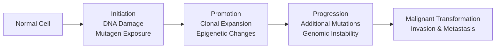
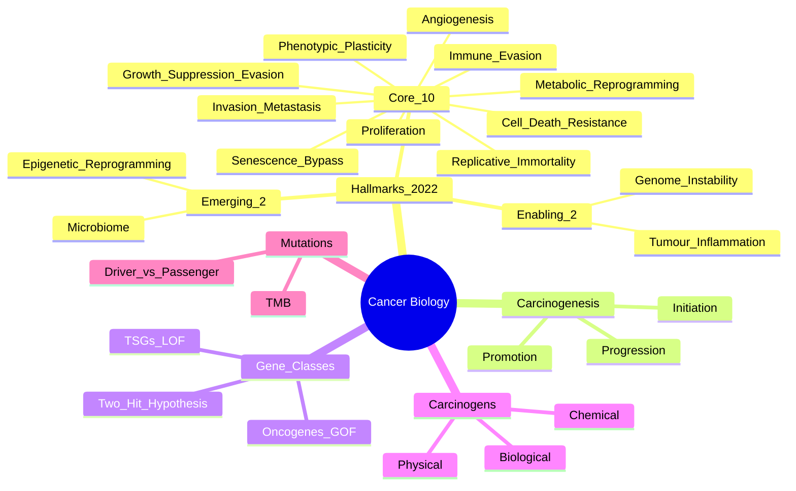

> [!tip] **FCPS/MRCP Priority: CRITICAL**
> Cancer biology underpins all oncology. **Hanahan & Weinberg's Hallmarks (2000, 2011, 2022)** are examinable core knowledge. Must know: **10 Hallmarks + 2 Enabling Characteristics + 2 Emerging Hallmarks**.

---

## 1. 1. Learning Objectives
By the end of this note you should be able to:
- [ ] List and explain all **14 Hallmarks of Cancer** (10 core + 2 enabling + 2 emerging)
- [ ] Describe **multistep carcinogenesis** (initiation, promotion, progression)
- [ ] Explain **oncogene vs tumour suppressor gene** mechanisms
- [ ] Describe **carcinogen classes** (chemical, physical, biological)
- [ ] Apply **Knudson's two-hit hypothesis** to tumour suppressor genes
- [ ] Distinguish **driver vs passenger mutations**

---

## 2. 2. Definition & Epidemiology

| Feature | Detail |
|---------|--------|
| **Definition** | Cancer = **dysregulated cell growth** due to accumulated genetic/epigenetic alterations → **autonomous proliferation, invasion, metastasis** |
| **Global Burden** | **~20M new cases/year** (2022), **~10M deaths** (leading cause of death <70y) |
| **Commonest Cancers** | **Males**: Lung, Prostate, Colorectal, Stomach, Liver
**Females**: Breast, Colorectal, Lung, Cervical, Thyroid |
| **Aetiology** | **~90-95% sporadic** (environment/lifestyle), **5-10% hereditary** |

---

## 3. 3. Hanahan & Weinberg's Hallmarks of Cancer (2022 Update)

```mermaid
flowchart TD
    A[Hallmarks of Cancer 2022] --> B[Core Hallmarks 1-10]
    A --> C[Enabling Characteristics 11-12]
    A --> D[Emerging Hallmarks 13-14]
    B --> B1[1. Sustaining Proliferative Signalling]
    B --> B2[2. Evading Growth Suppressors]
    B --> B3[3. Resisting Cell Death]
    B --> B4[4. Enabling Replicative Immortality]
    B --> B5[5. Inducing Angiogenesis]
    B --> B6[6. Activating Invasion & Metastasis]
    B --> B7[7. Reprogramming Cellular Metabolism]
    B --> B8[8. Evading Immune Destruction]
    B --> B9[9. Unlocking Phenotypic Plasticity]
    B --> B10[10. Senescence Bypass]
    C --> C1[11. Genome Instability & Mutation]
    C --> C2[12. Tumour-Promoting Inflammation]
    D --> D1[13. Polymorphic Microbiomes]
    D --> D2[14. Non-mutational Epigenetic Reprogramming]
```

---

## 4. 4. Core Hallmarks (1-10) — **Examinable Details**

| # | Hallmark | Mechanism | Key Molecules | Therapeutic Targets |
|---|----------|-----------|---------------|---------------------|
| **1** | **Sustaining Proliferative Signalling** | Autonomous growth signals | **Growth factors (EGF, PDGF), RTKs (EGFR, HER2, VEGFR), RAS/RAF/MEK/ERK, PI3K/AKT/mTOR** | EGFRi, HER2i, MEKi, PI3Ki, mTORi |
| **2** | **Evading Growth Suppressors** | Bypass RB & TP53 checkpoints | **RB1, TP53, p16INK4a, p21, PTEN** | CDK4/6i, MDM2i, PTEN restoration |
| **3** | **Resisting Cell Death** | Apoptosis evasion | **BCL2 family (BCL2, BCL-XL, MCL1), p53, Caspases, Death Receptors** | BCL2i (Venetoclax), BH3 mimetics, p53 reactivators |
| **4** | **Enabling Replicative Immortality** | Telomere maintenance | **TERT promoter mutations, ALT pathway, Shelterin complex** | Telomerase inhibitors, ALT inhibitors |
| **5** | **Inducing Angiogenesis** | New blood vessel formation | **VEGF/VEGFR, FGF, PDGF, Angiopoietins, HIF-1α** | Bevacizumab, VEGFR TKIs, HIF inhibitors |
| **6** | **Activating Invasion & Metastasis** | EMT, invasion, colonisation | **E-cadherin loss, N-cadherin gain, MMPs, Integrins, FAK, SNAIL, SLUG, TWIST, ZEB1** | MMP inhibitors, FAK inhibitors, EMT reversal |
| **7** | **Reprogramming Cellular Metabolism** | Warburg Effect, metabolic rewiring | **HK2, PKM2, LDHA, GLUT1, MYC, HIF-1α, AMPK, mTOR** | HK2 inhibitors, LDHA inhibitors, OXPHOS inhibitors |
| **8** | **Evading Immune Destruction** | Immune escape | **PD-L1/PD-1, CTLA-4, LAG-3, TIM-3, MHC-I loss, β2M loss, TGF-β, IDO** | ICIs (PD-1/PD-L1, CTLA-4), CAR-T, TIL therapy |
| **9** | **Unlocking Phenotypic Plasticity** | Cell state transitions | **EMT, Stemness, Differentiation therapy resistance** | EMT inhibitors, Differentiation agents |
| **10** | **Senescence Bypass** | Escape from OIS | **p16INK4a/RB, p53/p21, Telomeres, SASP** | Senolytics, SASP modulators |

---

## 5. 5. Enabling Characteristics (11-12)

| # | Characteristic | Mechanism | Significance |
|---|----------------|-----------|--------------|
| **11** | **Genome Instability & Mutation** | **DNA repair defects (MMR, HR, NER, BER), Chromosomal instability (CIN), Mutator phenotype** | Generates diversity for selection; **MSI, HRD, TMB** as biomarkers |
| **12** | **Tumour-Promoting Inflammation** | **TAMs, MDSCs, CAFs, Cytokines (IL-6, TNF-α, IL-1β), NF-κB, STAT3** | **Chronic inflammation → cancer**; Aspirin/NSAID chemoprevention |

---

## 6. 6. Emerging Hallmarks (2022) — **High-Yield for MRCP**

| # | Hallmark | Mechanism | Clinical Relevance |
|---|----------|-----------|-------------------|
| **13** | **Polymorphic Microbiomes** | **Gut microbiome modulates immunity, metabolism, therapy response** | FMT, antibiotics affect ICI efficacy; **Microbiome as biomarker** |
| **14** | **Non-mutational Epigenetic Reprogramming** | **Epigenetic plasticity without DNA mutation; Chromatin remodelling, Histone mods, DNA methylation** | **Epigenetic therapy (HMA, EZH2i); Adaptive resistance; Cellular plasticity** |

---

## 7. 7. Multistep Carcinogenesis

| Stage | Features | Key Events |
|-------|----------|------------|
| **Initiation** | Irreversible DNA damage | **Mutagen exposure, DNA adducts, Driver mutation** |
| **Promotion** | Clonal expansion, reversible | **Promoters (TPA, hormones), Epigenetic changes, Clonal expansion** |
| **Progression** | Irreversible, malignant | **Genomic instability, Additional mutations, Selection, Invasion, Metastasis** |

---

## 8. 8. Oncogenes vs Tumour Suppressor Genes

| Feature | **Oncogenes** | **Tumour Suppressor Genes (TSGs)** |
|---------|---------------|-----------------------------------|
| **Function** | Promote growth/proliferation | Restrain growth, induce apoptosis, repair DNA |
| **Mutation Type** | **Gain-of-function (GOF)** | **Loss-of-function (LOF)** |
| **Inheritance** | **Dominant** (one allele sufficient) | **Recessive** (Knudson's two-hit) |
| **Examples** | **RAS, MYC, HER2, EGFR, BCR-ABL, BCL2, CCND1, PIK3CA** | **TP53, RB1, PTEN, APC, BRCA1/2, VHL, NF1, WT1** |
| **Activation** | Mutation, Amplification, Translocation | Mutation, Deletion, Epigenetic silencing (LOH) |

> [!critical] **Knudson's Two-Hit Hypothesis**
> - **First hit**: Germline or somatic mutation
> - **Second hit**: Loss of heterozygosity (LOH), second mutation, epigenetic silencing
> - **Classic example**: **RB1** in retinoblastoma; **TP53** in Li-Fraumeni

---

## 9. 9. Carcinogen Classes

| Class | Mechanism | Examples | Associated Cancers |
|-------|-----------|----------|-------------------|
| **Chemical** | DNA adducts, adduct formation | **Tobacco (PAHs, Nitrosamines), Aflatoxin, Aromatic amines, Alkylating agents** | Lung, Liver, Bladder, Nasopharyngeal |
| **Physical** | **Ionising radiation** (X-ray, γ, UV), **Non-ionising (UV)** | X-rays, Radon, UV-B | Leukaemia, Thyroid, Skin (BCC, SCC, Melanoma) |
| **Biological** | **Viruses** (HPV, HBV, HCV, EBV, HIV, HHV-8, HTLV-1), **Bacteria (H. pylori)**, **Parasites (Schistosoma, Opisthorchis)** | Cervical (HPV), Liver (HBV/HCV), Gastric (H. pylori), Lymphoma (EBV), Kaposi (HHV-8), Bladder (Schistosoma) |

> [!critical] **IARC Carcinogen Classification**
> - **Group 1**: Carcinogenic to humans (Tobacco, Asbestos, HPV, HBV, Alcohol)
> - **Group 2A**: Probably carcinogenic (Red meat, Shiftwork)
> - **Group 2B**: Possibly carcinogenic (Mobile phones, Coffee - historical)

---

## 10. 10. Driver vs Passenger Mutations

| Feature | **Driver Mutations** | **Passenger Mutations** |
|---------|----------------------|------------------------|
| **Definition** | Confer selective growth advantage | No selective advantage; "hitchhikers" |
| **Frequency** | Recurrent across tumours | Random, low frequency |
| **Functional Impact** | Alters protein function, pathway activation | Neutral, no functional impact |
| **Examples** | **EGFR, KRAS, BRAF, TP53, PIK3CA, TP53** | Silent mutations, intronic, non-coding |
| **Clinical Relevance** | **Therapeutic targets, Biomarkers** | Background noise in sequencing |

> [!critical] **Mutational Burden**
> - **High TMB** (>10 mut/Mb): Melanoma, NSCLC, MSI-H → **ICI responsive**
> - **Low TMB**: Paediatric, Haematological → Less ICI responsive

---

## 11. 11. FCPS/MRCP High-Yield Summary

| Topic | Key Points |
|-------|------------|
| **14 Hallmarks** | **1-10 Core**, **11-12 Enabling**, **13-14 Emerging** |
| **Core 10** | Proliferation, Growth suppression, Cell death, Immortality, Angiogenesis, Invasion/Metastasis, Metabolism, Immune evasion, Plasticity, Senescence bypass |
| **Enabling** | Genome instability, Tumour-promoting inflammation |
| **Emerging** | Microbiome, Epigenetic reprogramming |
| **Carcinogenesis** | Initiation → Promotion → Progression |
| **Oncogenes** | GOF, Dominant (RAS, MYC, HER2, EGFR) |
| **TSGs** | LOF, Recessive, Two-hit (TP53, RB1, PTEN, APC) |
| **Carcinogens** | Chemical (Tobacco, Aflatoxin), Physical (Radiation, UV), Biological (HPV, HBV, HCV, EBV, H. pylori) |
| **Driver vs Passenger** | Driver = selective advantage (therapeutic target); Passenger = bystander |

---

## 12. 12. Viva Questions (MRCP PACES / FCPS)

| Question | Expected Answer |
|----------|----------------|
| "List the 10 core hallmarks of cancer (Hanahan & Weinberg 2011)" | 1. Sustaining proliferative signalling 2. Evading growth suppressors 3. Resisting cell death 4. Enabling replicative immortality 5. Inducing angiogenesis 6. Activating invasion & metastasis 7. Reprogramming energy metabolism 8. Evading immune destruction 9. Unlocking phenotypic plasticity 10. Senescence bypass |
| "What are the two enabling characteristics?" | **Genome instability & mutation** + **Tumour-promoting inflammation** |
| "What are the two emerging hallmarks (2022)?" | **Polymorphic microbiomes** + **Non-mutational epigenetic reprogramming** |
| "Explain Knudson's two-hit hypothesis" | TSGs require **two inactivating hits**: 1st hit (germline/somatic mutation), 2nd hit (LOH, second mutation, epigenetic silencing). Classic: **RB1** in retinoblastoma. |
| "Difference between oncogene and tumour suppressor gene?" | **Oncogene**: GOF, dominant, activation by mutation/amplification/translocation. **TSG**: LOF, recessive, two-hit (TP53, RB1, PTEN). |
| "What is the Warburg effect?" | **Aerobic glycolysis** — cancer cells prefer glycolysis over OXPHOS despite oxygen; **HK2, PKM2, LDHA, lactate production**; supports biosynthesis. |
| "Name 3 oncogenic viruses and associated cancers" | **HPV** → Cervical, Oropharyngeal; **HBV/HCV** → HCC; **EBV** → Burkitt's, NPC, HL; **HIV** → Kaposi, Lymphoma; **HTLV-1** → ATLL; **HHV-8** → Kaposi sarcoma. |
| "What is the difference between driver and passenger mutations?" | **Driver**: Confers selective advantage, recurrent, functional impact, therapeutic target. **Passenger**: No selective advantage, random, no functional impact. |

---

## 13. 13. Confusions & Mnemonics

| Confusion | Clarification |
|-----------|---------------|
| **Hallmarks vs Enabling vs Emerging** | **10 Core** = fundamental capabilities; **2 Enabling** = facilitate acquisition; **2 Emerging** = newly recognised (2022) |
| **Oncogene vs TSG** | Oncogene = **GOF, dominant**; TSG = **LOF, recessive (two-hit)** |
| **Initiation vs Promotion** | Initiation = **irreversible DNA damage**; Promotion = **reversible clonal expansion** |
| **Driver vs Passenger** | Driver = **selective advantage, therapeutic target**; Passenger = **bystander, no functional impact** |
| **CIN vs MSI** | CIN = **chromosomal instability** (aneuploidy); MSI = **microsatellite instability** (MMR deficiency) |

**Mnemonic: 10 Core Hallmarks = "SPERMIDAS"**
- **S**ustaining proliferation
- **P**rolifera... wait, let's use better:
- **S**ustaining proliferation
- **E**vading growth suppressors
- **R**esisting cell death
- **E**nabling replicative immortality
- **M**etabolism reprogramming
- **I**nducing angiogenesis
- **D**estruction evasion (immune)
- **A**ctivating invasion/metastasis
- **S**enescence bypass
- **P**lasticity unlocking

**Mnemonic: Enabling = "GI"**
- **G**enome instability
- **I**nflammation (tumour-promoting)

**Mnemonic: Emerging = "ME"**
- **M**icrobiome (polymorphic)
- **E**pigenetic reprogramming

**Mnemonic: Oncogene vs TSG = "GOF vs LOF"**
- **Oncogene** = **G**ain **O**f **F**unction (Dominant)
- **TSG** = **L**oss **O**f **F**unction (Recessive, Two-hit)

---

## 14. 14. Mind Map

---

## 15. 15. One-Page Revision Card

| Domain | Key Points |
|--------|------------|
| **14 Hallmarks** | **10 Core**: Proliferation, Growth supp evasion, Death resistance, Immortality, Angiogenesis, Invasion, Metabolism, Immune evasion, Plasticity, Senescence bypass |
| **Enabling** | **Genome instability**, Tumour-promoting inflammation |
| **Emerging** | Microbiome, Epigenetic reprogramming |
| **Carcinogenesis** | Initiation → Promotion → Progression |
| **Oncogenes** | GOF, Dominant: **RAS, MYC, HER2, EGFR, BCR-ABL** |
| **TSGs** | LOF, Recessive, **Two-hit**: **TP53, RB1, PTEN, APC** |
| **Carcinogens** | Chemical (Tobacco, Aflatoxin), Physical (Radiation, UV), Biological (HPV, HBV, HCV, EBV, H.pylori) |
| **Driver vs Passenger** | Driver = selective advantage, targetable; Passenger = bystander |

---

## 16. 16. Spaced Repetition Trackers

| Review Interval | Date Completed | Confidence (1-5) | Notes |
|-----------------|----------------|------------------|-------|
| 24 hours | | | |
| 7 days | | | |
| 15 days | | | |
| 30 days | | | |
| 90 days | | | |

---

## 17. 17. Self-Test Scorecard

| Section | Score /5 | Last Attempt |
|---------|----------|--------------|
| 14 Hallmarks Recall | | |
| Enabling vs Emerging | | |
| Knudson's Two-Hit | | |
| Oncogene vs TSG | | |
| Carcinogen Classes | | |
| Driver vs Passenger | | |
| Viva Questions | | |

---

## 18. 18. Local Navigation
- **Parent Heading**: [[../Principles of Cancer Management|Principles of Cancer Management]]
- **Parent Topic Group**: [[Cancer Biology]]
- **Chapter Map**: [[../Davidson Chapter 7 - Oncology Hierarchy|Oncology Hierarchy]]
- **Chapter MOC**: [[../Oncology MOC|Oncology MOC]]
- **Drug Reference**: [[../../Clinical Therapeutics and Good Prescribing|Drugs]]
- **Related**: [[Tumour Microenvironment]] · [[Cancer Genetics & Genomics]] · [[Tumour Immunology]]

---

# FCPS/MRCP Exam Extras

## 19. 19. MCQs (10)

**1.** Regarding Cancer Biology & Hallmarks of Cancer (14 Hallmarks), which statement is correct?
   A. **1-10 Core**, **11-12 Enabling**, **13-14 Emerging**
   B. **1-10 - alternative approach
   C. Empirical management only
   D. Watch and wait
   - **Answer: A** — **1-10 Core**, **11-12 Enabling**, **13-14 Emerging**

**2.** Regarding Cancer Biology & Hallmarks of Cancer (Core 10), which statement is correct?
   A. Proliferation, Growth suppression, Cell death, Immortality, Angiogenesis, Invasion/Metastasis, Metab
   B. Proliferation, - alternative approach
   C. Empirical management only
   D. Watch and wait
   - **Answer: A** — Proliferation, Growth suppression, Cell death, Immortality, Angiogenesis, Invasion/Metastasis, Metabolism, Immune evasio...

**3.** Regarding Cancer Biology & Hallmarks of Cancer (Enabling), which statement is correct?
   A. Genome instability, Tumour-promoting inflammation
   B. Genome - alternative approach
   C. Empirical management only
   D. Watch and wait
   - **Answer: A** — Genome instability, Tumour-promoting inflammation

**4.** Regarding Cancer Biology & Hallmarks of Cancer (Emerging), which statement is correct?
   A. Microbiome, Epigenetic reprogramming
   B. Microbiome, - alternative approach
   C. Empirical management only
   D. Watch and wait
   - **Answer: A** — Microbiome, Epigenetic reprogramming

**5.** Regarding Cancer Biology & Hallmarks of Cancer (Carcinogenesis), which statement is correct?
   A. Initiation → Promotion → Progression
   B. Initiation - alternative approach
   C. Empirical management only
   D. Watch and wait
   - **Answer: A** — Initiation → Promotion → Progression

**6.** Regarding Cancer Biology & Hallmarks of Cancer (Oncogenes), which statement is correct?
   A. GOF, Dominant (RAS, MYC, HER2, EGFR)
   B. GOF, - alternative approach
   C. Empirical management only
   D. Watch and wait
   - **Answer: A** — GOF, Dominant (RAS, MYC, HER2, EGFR)

**7.** Regarding Cancer Biology & Hallmarks of Cancer (TSGs), which statement is correct?
   A. LOF, Recessive, Two-hit (TP53, RB1, PTEN, APC)
   B. LOF, - alternative approach
   C. Empirical management only
   D. Watch and wait
   - **Answer: A** — LOF, Recessive, Two-hit (TP53, RB1, PTEN, APC)

**8.** Regarding Cancer Biology & Hallmarks of Cancer (Carcinogens), which statement is correct?
   A. Chemical (Tobacco, Aflatoxin), Physical (Radiation, UV), Biological (HPV, HBV, HCV, EBV, H. pylori)
   B. Chemical - alternative approach
   C. Empirical management only
   D. Watch and wait
   - **Answer: A** — Chemical (Tobacco, Aflatoxin), Physical (Radiation, UV), Biological (HPV, HBV, HCV, EBV, H. pylori)

**9.** Regarding Cancer Biology & Hallmarks of Cancer (Driver vs Passenger), which statement is correct?
   A. Driver = selective advantage (therapeutic target)
   B. Driver - alternative approach
   C. Empirical management only
   D. Watch and wait
   - **Answer: A** — Driver = selective advantage (therapeutic target); Passenger = bystander

**10.** Regarding Cancer Biology & Hallmarks of Cancer (Key Point), which statement is correct?
   - A. [FCPS, MRCP Part 1, MRCP Part 2, PACES]
   - B. Empirical approach without specific indication
   - C. Used only in research protocols
   - D. Not relevant in current practice
   - **Answer: A** — [FCPS, MRCP Part 1, MRCP Part 2, PACES]

## 20. 20. SBA Questions (10)

**1.** A 55-year-old presents with classic features. MDT discussion recommends:
   - A. **1-10 Core**, **11-12 Enabling**, **13-14 Emerging**
   - B. **1-10 (less specific)
   - C. Empirical broad approach
   - D. No intervention required
   - **Answer: A** — first-line: **1-10 Core**, **11-12 Enabling**, **13-14 Emerging**

**2.** On staging workup, the patient is found to be [Stage X]. Best management is:
   - A. Proliferation, Growth suppression, Cell death, Immortality, Angiogenesis, Invasion/Metastasis, Metab
   - B. Proliferation, (less specific)
   - C. Empirical broad approach
   - D. No intervention required
   - **Answer: A** — stage-specific: Proliferation, Growth suppression, Cell death, Immortality, Angiogenesis, Invasion/Metastasis, Metabolism, Immune evasio...

**3.** Following first-line treatment, the patient develops [complication]. Best next step:
   - A. Genome instability, Tumour-promoting inflammation
   - B. Genome (less specific)
   - C. Empirical broad approach
   - D. No intervention required
   - **Answer: A** — complication: Genome instability, Tumour-promoting inflammation

**4.** The patient asks about prognosis. Most appropriate response based on:
   - A. Microbiome, Epigenetic reprogramming
   - B. Microbiome, (less specific)
   - C. Empirical broad approach
   - D. No intervention required
   - **Answer: A** — prognosis: Microbiome, Epigenetic reprogramming

**5.** A 65-year-old with relevant risk factors should be screened with:
   - A. Initiation → Promotion → Progression
   - B. Initiation (less specific)
   - C. Empirical broad approach
   - D. No intervention required
   - **Answer: A** — screening: Initiation → Promotion → Progression

**6.** The most clinically important biomarker/molecular test is:
   - A. GOF, Dominant (RAS, MYC, HER2, EGFR)
   - B. GOF, (less specific)
   - C. Empirical broad approach
   - D. No intervention required
   - **Answer: A** — biomarker: GOF, Dominant (RAS, MYC, HER2, EGFR)

**7.** The standard chemotherapy/regimen of choice is:
   - A. LOF, Recessive, Two-hit (TP53, RB1, PTEN, APC)
   - B. LOF, (less specific)
   - C. Empirical broad approach
   - D. No intervention required
   - **Answer: A** — chemo: LOF, Recessive, Two-hit (TP53, RB1, PTEN, APC)

**8.** The role of surgery in this case is:
   - A. Chemical (Tobacco, Aflatoxin), Physical (Radiation, UV), Biological (HPV, HBV, HCV, EBV, H. pylori)
   - B. Chemical (less specific)
   - C. Empirical broad approach
   - D. No intervention required
   - **Answer: A** — surgery: Chemical (Tobacco, Aflatoxin), Physical (Radiation, UV), Biological (HPV, HBV, HCV, EBV, H. pylori)

**9.** The recommended surveillance/follow-up protocol is:
   - A. Driver = selective advantage (therapeutic target)
   - B. Driver (less specific)
   - C. Empirical broad approach
   - D. No intervention required
   - **Answer: A** — follow-up: Driver = selective advantage (therapeutic target); Passenger = bystander

**10.** A clinician encounters this presentation. Best approach:
   - A. [FCPS, MRCP Part 1, MRCP Part 2, PACES]
   - B. Watch and wait approach
   - C. Empirical broad treatment
   - D. No intervention required
   - **Answer: A** — [FCPS, MRCP Part 1, MRCP Part 2, PACES]

## 21. 21. Flashcards

**Q1:** 14 Hallmarks?
**A1:** 1-10 Core, 11-12 Enabling, 13-14 Emerging

**Q2:** Core 10?
**A2:** Proliferation, Growth suppression, Cell death, Immortality, Angiogenesis, Invasion/Metastasis, Metabolism, Immune evasion, Plasticity, Senescence bypass

**Q3:** Enabling?
**A3:** Genome instability, Tumour-promoting inflammation

**Q4:** Emerging?
**A4:** Microbiome, Epigenetic reprogramming

**Q5:** Carcinogenesis?
**A5:** Initiation → Promotion → Progression

**Q6:** Oncogenes?
**A6:** GOF, Dominant (RAS, MYC, HER2, EGFR)

**Q7:** TSGs?
**A7:** LOF, Recessive, Two-hit (TP53, RB1, PTEN, APC)

**Q8:** Carcinogens?
**A8:** Chemical (Tobacco, Aflatoxin), Physical (Radiation, UV), Biological (HPV, HBV, HCV, EBV, H. pylori)

## 22. 22. Answer Key with Explanations

| # | MCQ | Topic | Explanation |
|---|-----|-------|-------------|
| 1 | A | 14 Hallmarks | 1-10 Core, 11-12 Enabling, 13-14 Emerging |
| 2 | A | Core 10 | Proliferation, Growth suppression, Cell death, Immortality, Angiogenesis, Invasion/Metastasis, Metabolism, Immune evasio |
| 3 | A | Enabling | Genome instability, Tumour-promoting inflammation |
| 4 | A | Emerging | Microbiome, Epigenetic reprogramming |
| 5 | A | Carcinogenesis | Initiation → Promotion → Progression |
| 6 | A | Oncogenes | GOF, Dominant (RAS, MYC, HER2, EGFR) |
| 7 | A | TSGs | LOF, Recessive, Two-hit (TP53, RB1, PTEN, APC) |
| 8 | A | Carcinogens | Chemical (Tobacco, Aflatoxin), Physical (Radiation, UV), Biological (HPV, HBV, HCV, EBV, H. pylori) |
| 9 | A | Driver vs Passenger | Driver = selective advantage (therapeutic target); Passenger = bystander |
| 10 | A | [FCPS, MRCP Part 1, MRCP Part 2, PACES] | [FCPS, MRCP Part 1, MRCP Part 2, PACES] |

| # | SBA | Topic | Explanation |
|---|-----|-------|-------------|
| 1 | A | 14 Hallmarks | 1-10 Core, 11-12 Enabling, 13-14 Emerging |
| 2 | A | Core 10 | Proliferation, Growth suppression, Cell death, Immortality, Angiogenesis, Invasion/Metastasis, Metabolism, Immune evasio |
| 3 | A | Enabling | Genome instability, Tumour-promoting inflammation |
| 4 | A | Emerging | Microbiome, Epigenetic reprogramming |
| 5 | A | Carcinogenesis | Initiation → Promotion → Progression |
| 6 | A | Oncogenes | GOF, Dominant (RAS, MYC, HER2, EGFR) |
| 7 | A | TSGs | LOF, Recessive, Two-hit (TP53, RB1, PTEN, APC) |
| 8 | A | Carcinogens | Chemical (Tobacco, Aflatoxin), Physical (Radiation, UV), Biological (HPV, HBV, HCV, EBV, H. pylori) |
| 9 | A | Driver vs Passenger | Driver = selective advantage (therapeutic target); Passenger = bystander |

| 11 | A | [FCPS, MRCP Part 1, MRCP Part 2, PACES] | [FCPS, MRCP Part 1, MRCP Part 2, PACES] |
## 23. 23. Local Navigation

- **Parent Heading Hub**: [[../../Principles of Cancer Management|Principles of Cancer Management]]
- **Chapter Map**: [[../../Davidson Chapter 7 - Oncology Hierarchy|Oncology Hierarchy]]
- **Chapter MOC**: [[../../Oncology MOC|Oncology MOC]]
- **Drug Reference**: [[../../../Clinical Therapeutics and Good Prescribing|Drugs]]

