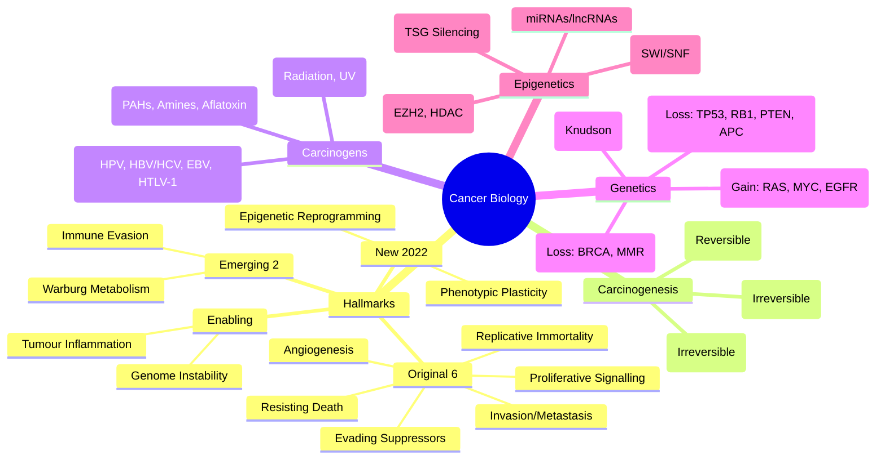

> [!tip] **FCPS/MRCP Priority: HIGH**
> **Hallmarks of Cancer (Hanahan & Weinberg 2000/2011/2022): 10 Core Hallmarks + 2 Enabling Characteristics**; **Original 6 (2000): Sustaining Proliferative Signalling, Evading Growth Suppressors, Resisting Cell Death, Enabling Replicative Immortality, Inducing Angiogenesis, Activating Invasion & Metastasis**; **Emerging 2 (2011): Reprogramming Energy Metabolism, Evading Immune Destruction**; **Enabling Characteristics: Genome Instability & Mutation, Tumour-Promoting Inflammation**; **New (2022): Unlocking Phenotypic Plasticity, Non-mutational Epigenetic Reprogramming, Polymorphic Microbiomes, Senescent Cells**; **Carcinogenesis: Initiation (Irreversible DNA Damage), Promotion (Clonal Expansion), Progression (Malignant Conversion)**.

---

## 1. 1. Learning Objectives
By the end of this note you should be able to:
- [ ] List the **10 Hallmarks of Cancer** (Hanahan & Weinberg) and the **2 Enabling Characteristics**
- [ ] Describe **Carcinogenesis** stages: Initiation, Promotion, Progression
- [ ] Distinguish **Chemical, Physical, Viral Carcinogens** with examples
- [ ] Explain the role of **Oncogenes, Tumour Suppressor Genes, DNA Repair Genes** in carcinogenesis
- [ ] Apply **Knudson's Two-Hit Hypothesis** for tumour suppressors
- [ ] Describe **Epigenetic Mechanisms** (DNA methylation, Histone modification) in cancer

---

## 2. 2. Hallmarks of Cancer (Hanahan & Weinberg)

### 1. Core Hallmarks (2000/2011)

| Hallmark | Description | Key Molecular Players |
|----------|-------------|----------------------|
| **1. Sustaining Proliferative Signalling** | Cancer cells produce their own growth signals / become independent of external mitogens | **Growth Factors (EGF, PDGF, TGF-α)**, **Receptors (EGFR, HER2, FGFR, VEGFR)**, **Downstream: RAS/RAF/MEK/ERK, PI3K/AKT/mTOR**, **Cyclin D/CDK4/6** |
| **2. Evading Growth Suppressors** | Bypass tumour suppressor checkpoints (RB, TP53) | **RB Pathway** (CDK4/6 → Cyclin D → RB phosphorylation → E2F release), **TP53 Pathway** (p21, GADD45, G1/S & G2/M arrest), **CDKN2A/p16** |
| **3. Resisting Cell Death** | Apoptosis evasion (Intrinsic/Extrinsic pathways) | **Intrinsic**: **BCL-2 family** (BCL-2, BCL-xL anti-apoptotic; BAX, BAK pro-apoptotic), **Cytochrome c, Apaf-1, Caspase-9**; **Extrinsic**: **Death Receptors (FAS, TRAIL-R)**, **Caspase-8**; **p53-mediated apoptosis** |
| **4. Enabling Replicative Immortality** | Telomere maintenance (Telomerase or ALT) | **Telomerase (hTERT)** reactivation (85-90% cancers), **ALT (Alternative Lengthening of Telomeres)** pathway (10-15%), **ATRX/DAXX mutations** |
| **5. Inducing Angiogenesis** | Switch to pro-angiogenic state (VEGF, FGF) | **VEGF/VEGFR**, **FGF/FGFR**, **PDGF/PDGFR**, **Angiopoietins (Ang1/Ang2, Tie2)**, **HIF-1α** (hypoxia response) |
| **6. Activating Invasion & Metastasis** | EMT, Invasion, Intravasation, Survival in circulation, Extravasation, Colonisation | **EMT Transcription Factors** (SNAIL, SLUG, TWIST, ZEB1), **MMPs** (Matrix Metalloproteinases), **Integrins**, **CXCR4/CXCL12**, **E-cadherin loss** |
| **7. Reprogramming Energy Metabolism** | Warburg Effect (Aerobic Glycolysis) | **GLUT1**, **HK2**, **PKM2**, **LDHA**, **PDK1**, **c-MYC**, **HIF-1α**, **p53 loss**, **PKM2** dimer/tetramer switch |
| **8. Evading Immune Destruction** | Immunoediting (Elimination, Equilibrium, Escape) | **PD-L1/PD-1**, **CTLA-4**, **MHC-I loss**, **TGF-β**, **IDO**, **Tregs**, **MDSCs**, **NK cell evasion**, **Antigen presentation defects** |

### 2. Enabling Characteristics

| Characteristic | Description |
|----------------|-------------|
| **Genome Instability & Mutation** | **DNA Repair Defects** (MMR, HR, NER, BER), **Chromosomal Instability (CIN)**, **Microsatellite Instability (MSI)**, **Mutator Phenotype** |
| **Tumour-Promoting Inflammation** | **Immune Cells** (TAMs, TANs, Tregs, MDSCs), **Cytokines** (TNF-α, IL-6, IL-1β, IL-8, TGF-β), **NF-κB**, **STAT3**, **COX2/PGE2** |

### 3. Emerging Hallmarks (2022 Update)

| Hallmark | Description |
|----------|-------------|
| **Unlocking Phenotypic Plasticity** | **Cell state transitions** (EMT, Stemness, Transdifferentiation), **Epigenetic reprogramming**, **Lineage switching** (e.g., SCLC from NSCLC post-EGFR TKI) |
| **Non-mutational Epigenetic Reprogramming** | **Chromatin remodelling**, **Histone modifications**, **DNA methylation changes** without DNA mutation |
| **Polymorphic Microbiomes** | **Intratumoural microbiota** modulating immunity, metabolism, therapy response |
| **Senescent Cells** | **Senescence-associated secretory phenotype (SASP)** promoting tumour progression |

---

## 3. 3. Carcinogenesis: Multi-Stage Process

```mermaid
flowchart LR
    A[Normal Cell] --> B[**INITIATION**]
    B --> C[**PROMOTION**]
    C --> D[**PROGRESSION**]
    D --> E[Malignant Cancer]
    
    B1[Chemical/Physical/Viral Carcinogen] --> B
    B --> B2[**Irreversible DNA Damage** (Mutation in Oncogene/TSG/DNA Repair)]
    B2 --> B3[**Initiated Cell** (Latent, Not Yet Tumour)]
    
    C1[Promoter (Non-genotoxic)] --> C
    C --> C2[**Clonal Expansion** of Initiated Cell]
    C2 --> C3[**Epigenetic Changes**, Reversible (If Promoter Removed)]
    
    D1[Additional Mutations] --> D
    D --> D2[**Genomic Instability**]
    D2 --> D3[**Malignant Conversion**]
    D3 --> D4[**Invasion, Metastasis, Heterogeneity**]
```

### 1. Stages of Carcinogenesis

| Stage | Characteristics | Reversibility | Key Features |
|-------|----------------|---------------|--------------|
| **Initiation** | **Irreversible DNA damage** (Mutation in oncogene, TSG, DNA repair gene) | **Irreversible** | Single cell, Latent, "Hit-and-run", Requires carcinogen exposure |
| **Promotion** | **Clonal expansion** of initiated cell; **Epigenetic changes**; Promoter non-genotoxic | **Reversible** (If promoter removed early) | Requires repeated/continuous exposure; No new mutations; Selective advantage |
| **Progression** | **Additional mutations**, Genomic instability, Malignant conversion | **Irreversible** | Invasion, Metastasis, Heterogeneity, Karyotypic evolution, Treatment resistance |

---

## 4. 4. Classes of Carcinogens

| Type | Examples | Mechanism |
|------|----------|-----------|
| **Chemical** | **PAHs** (Tobacco, Grilled meat), **Aromatic Amines** (Dyes, Rubber), **Nitrosamines** (Processed meat), **Aflatoxin B1** (Aspergillus, Liver), **Alkylating Agents** (Chemo), **Vinyl Chloride** (Angiosarcoma), **Benzene** (Leukaemia), **Asbestos** (Mesothelioma) | **DNA Adducts**, **Oxidative Stress**, **Cross-linking**, **Strand Breaks** |
| **Physical** | **Ionising Radiation** (X-ray, γ-ray, Radon → Leukaemia, Thyroid, Breast), **UV Radiation** (Skin: BCC, SCC, Melanoma), **Chronic Irritation** (Marjolin's Ulcer) | **Direct DNA Damage**, **Free Radicals**, **Chromosomal Breaks** |
| **Viral (Oncoviruses)** | **HPV 16/18** (Cervical, Oropharyngeal, Anal → E6/E7), **HBV/HCV** (HCC → Chronic inflammation, Integration), **EBV** (Burkitt, NPC, HL → LMP1), **HTLV-1** (ATLL → Tax), **KSHV/HHV-8** (Kaposi, PEL), **MCPyV** (Merkel Cell) | **Oncoproteins** (E6/E7, Tax, LMP1), **Insertional Mutagenesis**, **Immune Evasion**, **Chronic Inflammation** |

---

## 5. 5. Genetic Basis of Cancer

### 1. Gene Classes in Cancer

| Class | Normal Function | Mutation Effect | Examples |
|-------|----------------|-----------------|----------|
| **Proto-oncogenes** | **Promote Growth/Differentiation** (Growth factors, Receptors, Signal transducers, Transcription factors) | **Gain-of-Function** (Activating mutation, Amplification, Translocation) → **Oncogenes** | **RAS** (KRAS, NRAS, HRAS), **MYC**, **EGFR/HER2**, **BCR-ABL**, **ALK**, **BRAF**, **PIK3CA**, **CCND1** |
| **Tumour Suppressor Genes (TSGs)** | **Inhibit Growth/Promote Death/Repair DNA** (Cell cycle brakes, Apoptosis, DNA repair, Checkpoints) | **Loss-of-Function** (Inactivating mutation, Deletion, Epigenetic silencing) | **TP53**, **RB1**, **PTEN**, **APC**, **CDKN2A/p16**, **VHL**, **NF1**, **WT1**, **BRCA1/2**, **SMAD4** |
| **DNA Repair Genes** | **Maintain Genomic Integrity** (MMR, BER, NER, HR, NHEJ) | **Loss-of-Function** → **Genomic Instability**, **Mutator Phenotype** | **MLH1, MSH2, MSH6, PMS2** (MMR/Lynch), **BRCA1/2** (HR), **XPA-XPG** (NER/XP), **ATM** (DSB) |

### 2. Knudson's Two-Hit Hypothesis (TSGs)

| Concept | Description |
|---------|-------------|
| **First Hit** | **Germline** (Inherited) OR **Somatic** (Acquired) mutation in one allele |
| **Second Hit** | **Somatic** event (Mutation, Deletion, LOH, Epigenetic silencing) in the other allele |
| **Result** | **Complete Loss of Function** → Tumour development |
| **Examples** | **RB1** (Retinoblastoma: Hereditary = 1 hit germline + 1 somatic; Sporadic = 2 somatic hits), **TP53** (Li-Fraumeni), **APC** (FAP), **VHL** (VHL syndrome), **NF1**, **WT1** |

### 3. Oncogene Activation Mechanisms

| Mechanism | Description | Example |
|-----------|-------------|---------|
| **Point Mutation** | Activating mutation in coding sequence | **KRAS G12D/V**, **BRAF V600E**, **EGFR L858R**, **IDH1 R132H** |
| **Gene Amplification** | Increased copy number → Overexpression | **HER2/ERBB2** (Breast), **MYC** (Many), **EGFR** (Glioblastoma), **CCND1** (Cyclin D1) |
| **Chromosomal Translocation** | Fusion gene with constitutive activity | **BCR-ABL** (CML), **EWSR1-FLI1** (Ewing), **TMPRSS2-ERG** (Prostate), **IGH-MYC** (Burkitt) |
| **Promoter Insertion** | Viral integration near proto-oncogene | **ALV** (Myc), **MMTV** (Int/Wnt) |
| **Overexpression** | Loss of regulatory control | **Cyclin D1** (MCL), **BCL-2** (Follicular Lymphoma t(14;18)) |

---

## 6. 6. Epigenetic Alterations in Cancer

| Mechanism | Description | Cancer Relevance |
|-----------|-------------|------------------|
| **DNA Methylation** | **CpG Island Hypermethylation** → TSG Silencing (Promoter); **Global Hypomethylation** → Genomic Instability, Oncogene Activation | **MLH1** (Lynch-like), **CDKN2A/p16**, **BRCA1**, **MGMT**, **RASSF1A**; **5-azacytidine/Decitabine** (Hypomethylating agents) |
| **Histone Modifications** | Acetylation (Activation), Methylation (Activation/Repression), Phosphorylation, Ubiquitination | **EZH2** (H3K27me3, Repression), **HDACs** (Deacetylation); **HDAC Inhibitors** (Vorinostat, Romidepsin) |
| **Chromatin Remodelling** | **SWI/SNF Complex** (ARID1A, SMARCA4, SMARCB1/INI1) | **ARID1A** (Ovarian Clear Cell, Gastric), **SMARCB1** (Rhabdoid, Synovial Sarcoma) |
| **Non-coding RNAs** | **miRNAs** (OncomiRs: miR-21, miR-155; Tumour Suppressor miRs: let-7, miR-34), **lncRNAs** (HOTAIR, MALAT1) | **miR-21** (PTEN suppression), **let-7** (RAS suppression) |

---

## 7. 7. FCPS/MRCP High-Yield Summary

| Topic | Key Points |
|-------|------------|
| **Hallmarks (Original 6)** | Proliferative Signalling, Evading Suppressors, Resisting Death, Replicative Immortality, Angiogenesis, Invasion/Metastasis |
| **Emerging Hallmarks (2011)** | Reprogramming Metabolism (Warburg), Evading Immune Destruction |
| **Enabling Characteristics** | Genome Instability, Tumour-Promoting Inflammation |
| **New Hallmarks (2022)** | Phenotypic Plasticity, Non-mutational Epigenetic Reprogramming, Polymorphic Microbiomes, Senescent Cells |
| **Carcinogenesis Stages** | **Initiation** (Irreversible DNA Damage) → **Promotion** (Clonal Expansion, Reversible) → **Progression** (Malignant Conversion, Irreversible) |
| **Chemical Carcinogens** | PAHs, Aromatic Amines, Nitrosamines, Aflatoxin, Alkylating Agents, Asbestos |
| **Physical Carcinogens** | Ionising Radiation (Leukaemia, Thyroid, Breast), UV (Skin Cancers) |
| **Viral Carcinogens** | HPV (E6/E7), HBV/HCV (HCC), EBV (Burkitt, NPC), HTLV-1 (ATLL), KSHV (Kaposi), MCPyV (Merkel) |
| **Oncogenes** | Gain-of-Function: RAS, MYC, EGFR, BCR-ABL, ALK, BRAF, PIK3CA |
| **TSGs** | Loss-of-Function: TP53, RB1, PTEN, APC, CDKN2A, VHL, BRCA1/2 |
| **Two-Hit Hypothesis** | First Hit (Germline/Somatic) + Second Hit (Somatic/LOH/Epigenetic) = TSG Loss |
| **Epigenetics** | CpG Hypermethylation (TSG Silencing), Global Hypomethylation (Instability), Histone Mods, miRNAs |

---

## 8. 8. Viva Questions (MRCP PACES / FCPS)

| Question | Expected Answer |
|----------|-----------------|
| **List the 6 original Hallmarks of Cancer (Hanahan & Weinberg 2000).** | 1) Sustaining Proliferative Signalling, 2) Evading Growth Suppressors, 3) Resisting Cell Death, 4) Enabling Replicative Immortality, 5) Inducing Angiogenesis, 6) Activating Invasion & Metastasis. |
| **What are the 2 Emerging Hallmarks added in 2011?** | **Reprogramming Energy Metabolism** (Warburg Effect) and **Evading Immune Destruction**. |
| **What are the 2 Enabling Characteristics?** | **Genome Instability & Mutation** and **Tumour-Promoting Inflammation**. |
| **Describe the 3 stages of Carcinogenesis.** | **Initiation**: Irreversible DNA damage (mutation); **Promotion**: Clonal expansion of initiated cell (reversible, epigenetic); **Progression**: Additional mutations, genomic instability, malignant conversion (irreversible). |
| **Knudson's Two-Hit Hypothesis — Explain with RB1 example.** | **Hereditary Retinoblastoma**: First hit = germline RB1 mutation; Second hit = somatic mutation/LOH in retinal cell. **Sporadic**: Both hits somatic. |
| **Difference between Proto-oncogene and Oncogene?** | **Proto-oncogene**: Normal gene promoting growth; **Oncogene**: Mutated/activated version (Gain-of-Function) driving cancer. |
| **Mechanisms of Oncogene Activation?** | Point Mutation (KRAS, BRAF), Gene Amplification (HER2, MYC), Translocation (BCR-ABL, IGH-MYC), Overexpression. |
| **Epigenetic Silencing of TSGs — Mechanism?** | **CpG Island Promoter Hypermethylation** → Transcriptional silencing of TSGs (MLH1, CDKN2A, BRCA1, MGMT). |
| **Warburg Effect — What, Why?** | **Aerobic Glycolysis** (Glucose → Lactate despite O2); **Why**: Biosynthetic precursors (nucleotides, lipids), Redox balance, Signalling; **Key**: PKM2, HIF-1α, c-MYC, GLUT1, HK2, LDHA. |
| **HPV Carcinogenesis — E6/E7 Mechanism?** | **E6** → p53 Degradation (Ubiquitination); **E7** → pRb Degradation → E2F Release → Cell Cycle Progression. |

---

## 9. 9. Confusions & Mnemonics

| Confusion | Clarification |
|-----------|---------------|
| **Hallmarks vs Enabling Characteristics** | **Hallmarks = Acquired Capabilities** of cancer cells; **Enabling Characteristics = Facilitate Acquisition** of hallmarks (Instability → Mutations; Inflammation → Microenvironment) |
| **Initiation vs Promotion** | **Initiation**: Irreversible, Genotoxic (DNA damage); **Promotion**: Reversible, Non-genotoxic (Clonal expansion, Epigenetic) |
| **Proto-oncogene vs TSG** | **Proto-oncogene**: Gas Pedal (Gain-of-Function = Oncogene); **TSG**: Brake Pedal (Loss-of-Function = Cancer) |
| **LOH vs Second Hit** | **LOH (Loss of Heterozygosity)** is a MECHANISM for the second hit (Deletion of wild-type allele); Second hit can also be Point Mutation or Epigenetic Silencing |
| **Driver vs Passenger Mutations** | **Driver**: Confers Selective Advantage (Oncogenes, TSGs, DNA Repair); **Passenger**: Neutral, No Advantage (Background Mutational Burden) |
| **Global Hypomethylation vs CpG Hypermethylation** | **Global Hypomethylation**: Genome-wide, Causes Instability; **CpG Hypermethylation**: Promoter-specific, Silences TSGs |

**Mnemonic: CANCER-HALLMARKS**
- **C**ell Proliferation (Sustained Signalling)
- **A**nti-Growth Suppression Evaded
- **N**ecrosis/Apoptosis Resisted
- **C**ellular Immortality (Telomerase)
- **E**ndothelial Recruitment (Angiogenesis)
- **R**ECursion (Invasion/Metastasis)
- **H**ypermetabolism (Warburg)
- **A**utoimmunity Evaded (Immune Escape)
- **L**oom Instability (Genomic)
- **L**ymphocyte Inflammation (Tumour-Promoting)
- **M**etabolic Reprogramming
- **A**daptability (Phenotypic Plasticity)
- **R**eprogramming (Epigenetic)
- **K**inases/Koch's Postulates (Drivers)
- **S**enescence (SASP)

**Mnemonic: CARCINOGENESIS-STAGES**
- **I**nitiation: **Irreversible DNA Damage** (Mutagen)
- **P**romotion: **Proliferation/Clonal Expansion** (Reversible, Promoter)
- **P**rogression: **Progression to Malignancy** (Additional Hits, Invasion, Mets)

---

## 10. 10. Mind Map



---

## 11. 11. One-Page Revision Card

| Domain | Key Points |
|--------|------------|
| **Hallmarks** | 6 Original (Proliferation, Anti-Suppression, Anti-Death, Immortality, Angiogenesis, Invasion) + 2 Emerging (Warburg, Immune Escape) + 2 Enabling (Instability, Inflammation) |
| **Carcinogenesis** | Initiation (DNA Damage) → Promotion (Clonal Expansion) → Progression (Malignant Conversion) |
| **Carcinogens** | Chemical (PAHs, Amines, Aflatoxin), Physical (Rad, UV), Viral (HPV E6/E7, HBV/HCV, EBV LMP1) |
| **Oncogenes** | Gain-of-Function: RAS, MYC, EGFR, BCR-ABL, BRAF, ALK, PIK3CA |
| **TSGs** | Loss-of-Function: TP53, RB1, PTEN, APC, CDKN2A, VHL, BRCA1/2 |
| **Two-Hit** | 1st Hit (Germline/Somatic) + 2nd Hit (Somatic/LOH/Epi) = TSG Loss |
| **Epigenetics** | CpG Hypermethylation (TSG Off), Global Hypomethylation (Instability), Histone Mods, miRNAs |
| **Warburg** | Aerobic Glycolysis → Biosynthesis, Redox, Signalling (PKM2, HIF-1α, MYC) |

---

## 12. 12. Spaced Repetition Trackers

| Review Interval | Date Completed | Confidence (1-5) | Notes |
|-----------------|----------------|------------------|-------|
| 24 hours | | | |
| 7 days | | | |
| 15 days | | | |
| 30 days | | | |
| 90 days | | | |

---

## 13. 13. Self-Test Scorecard

| Section | Score /5 | Last Attempt |
|---------|----------|--------------|
| 10 Hallmarks + Enabling | | |
| Carcinogenesis Stages | | |
| Carcinogen Classes | | |
| Oncogene vs TSG | | |
| Two-Hit Hypothesis | | |
| Oncogene Activation Mechanisms | | |
| Epigenetic Mechanisms | | |
| Warburg Effect | | |
| Viral Oncogenesis | | |

---

## 14. 14. Local Navigation
- **Parent Heading**: [[../Oncology|Oncology]]
- **Chapter Map**: [[../Davidson Chapter 7 - Oncology Hierarchy|Oncology Hierarchy]]
- **Chapter MOC**: [[../Oncology MOC|Oncology MOC]]
- **Drug Reference**: [[../../Clinical Therapeutics and Good Prescribing|Drugs]]
- **Related**: [[Oncogenes]], [[Tumour Suppressor Genes]], [[DNA Repair Genes]], [[Epigenetics]], [[Viral Oncogenesis]], [[Chemical Carcinogens]], [[Knudson Two-Hit]], [[Warburg Effect]]

---

# FCPS/MRCP Exam Extras

## 15. 15. MCQs (10)


**1.** Regarding Carcinogenesis & Hallmarks of Cancer (Hallmarks (Original 6)), which statement is correct?
   A. Proliferative Signalling, Evading Suppressors, Resisting Death, Replicative Immortality, Angiogenesi
   B. Proliferative - alternative approach
   C. Empirical management only
   D. Watch and wait
   - **Answer: A** — Proliferative Signalling, Evading Suppressors, Resisting Death, Replicative Immortality, Angiogenesis, Invasion/Metastas...


**2.** Regarding Carcinogenesis & Hallmarks of Cancer (Emerging Hallmarks (2011)), which statement is correct?
   A. Reprogramming Metabolism (Warburg), Evading Immune Destruction
   B. Reprogramming - alternative approach
   C. Empirical management only
   D. Watch and wait
   - **Answer: A** — Reprogramming Metabolism (Warburg), Evading Immune Destruction


**3.** Regarding Carcinogenesis & Hallmarks of Cancer (Enabling Characteristics), which statement is correct?
   A. Genome Instability, Tumour-Promoting Inflammation
   B. Genome - alternative approach
   C. Empirical management only
   D. Watch and wait
   - **Answer: A** — Genome Instability, Tumour-Promoting Inflammation


**4.** Regarding Carcinogenesis & Hallmarks of Cancer (New Hallmarks (2022)), which statement is correct?
   A. Phenotypic Plasticity, Non-mutational Epigenetic Reprogramming, Polymorphic Microbiomes, Senescent C
   B. Phenotypic - alternative approach
   C. Empirical management only
   D. Watch and wait
   - **Answer: A** — Phenotypic Plasticity, Non-mutational Epigenetic Reprogramming, Polymorphic Microbiomes, Senescent Cells


**5.** Regarding Carcinogenesis & Hallmarks of Cancer (Carcinogenesis Stages), which statement is correct?
   A. **Initiation** (Irreversible DNA Damage) → **Promotion** (Clonal Expansion, Reversible) → **Progress
   B. **Initiation** - alternative approach
   C. Empirical management only
   D. Watch and wait
   - **Answer: A** — **Initiation** (Irreversible DNA Damage) → **Promotion** (Clonal Expansion, Reversible) → **Progression** (Malignant Con...


**6.** Regarding Carcinogenesis & Hallmarks of Cancer (Chemical Carcinogens), which statement is correct?
   A. PAHs, Aromatic Amines, Nitrosamines, Aflatoxin, Alkylating Agents, Asbestos
   B. PAHs, - alternative approach
   C. Empirical management only
   D. Watch and wait
   - **Answer: A** — PAHs, Aromatic Amines, Nitrosamines, Aflatoxin, Alkylating Agents, Asbestos


**7.** Regarding Carcinogenesis & Hallmarks of Cancer (Physical Carcinogens), which statement is correct?
   A. Ionising Radiation (Leukaemia, Thyroid, Breast), UV (Skin Cancers)
   B. Ionising - alternative approach
   C. Empirical management only
   D. Watch and wait
   - **Answer: A** — Ionising Radiation (Leukaemia, Thyroid, Breast), UV (Skin Cancers)


**8.** Regarding Carcinogenesis & Hallmarks of Cancer (Viral Carcinogens), which statement is correct?
   A. HPV (E6/E7), HBV/HCV (HCC), EBV (Burkitt, NPC), HTLV-1 (ATLL), KSHV (Kaposi), MCPyV (Merkel)
   B. HPV - alternative approach
   C. Empirical management only
   D. Watch and wait
   - **Answer: A** — HPV (E6/E7), HBV/HCV (HCC), EBV (Burkitt, NPC), HTLV-1 (ATLL), KSHV (Kaposi), MCPyV (Merkel)


**9.** Regarding Carcinogenesis & Hallmarks of Cancer (Oncogenes), which statement is correct?
   A. Gain-of-Function: RAS, MYC, EGFR, BCR-ABL, ALK, BRAF, PIK3CA
   B. Gain-of-Function: - alternative approach
   C. Empirical management only
   D. Watch and wait
   - **Answer: A** — Gain-of-Function: RAS, MYC, EGFR, BCR-ABL, ALK, BRAF, PIK3CA


**10.** Regarding Carcinogenesis & Hallmarks of Cancer (TSGs), which statement is correct?
   A. Loss-of-Function: TP53, RB1, PTEN, APC, CDKN2A, VHL, BRCA1/2
   B. Loss-of-Function: - alternative approach
   C. Empirical management only
   D. Watch and wait
   - **Answer: A** — Loss-of-Function: TP53, RB1, PTEN, APC, CDKN2A, VHL, BRCA1/2


## 16. 16. SBA Questions (10)


**1.** A 55-year-old presents with classic features. MDT discussion recommends:
   - A. Proliferative Signalling, Evading Suppressors, Resisting Death, Replicative Immortality, Angiogenesi
   - B. Proliferative (less specific)
   - C. Empirical broad approach
   - D. No intervention required
   - **Answer: A** — first-line: Proliferative Signalling, Evading Suppressors, Resisting Death, Replicative Immortality, Angiogenesis, Invasion/Metastas...


**2.** On staging workup, the patient is found to be [Stage X]. Best management is:
   - A. Reprogramming Metabolism (Warburg), Evading Immune Destruction
   - B. Reprogramming (less specific)
   - C. Empirical broad approach
   - D. No intervention required
   - **Answer: A** — stage-specific: Reprogramming Metabolism (Warburg), Evading Immune Destruction


**3.** Following first-line treatment, the patient develops [complication]. Best next step:
   - A. Genome Instability, Tumour-Promoting Inflammation
   - B. Genome (less specific)
   - C. Empirical broad approach
   - D. No intervention required
   - **Answer: A** — complication: Genome Instability, Tumour-Promoting Inflammation


**4.** The patient asks about prognosis. Most appropriate response based on:
   - A. Phenotypic Plasticity, Non-mutational Epigenetic Reprogramming, Polymorphic Microbiomes, Senescent C
   - B. Phenotypic (less specific)
   - C. Empirical broad approach
   - D. No intervention required
   - **Answer: A** — prognosis: Phenotypic Plasticity, Non-mutational Epigenetic Reprogramming, Polymorphic Microbiomes, Senescent Cells


**5.** A 65-year-old with relevant risk factors should be screened with:
   - A. **Initiation** (Irreversible DNA Damage) → **Promotion** (Clonal Expansion, Reversible) → **Progress
   - B. **Initiation** (less specific)
   - C. Empirical broad approach
   - D. No intervention required
   - **Answer: A** — screening: **Initiation** (Irreversible DNA Damage) → **Promotion** (Clonal Expansion, Reversible) → **Progression** (Malignant Con...


**6.** The most clinically important biomarker/molecular test is:
   - A. PAHs, Aromatic Amines, Nitrosamines, Aflatoxin, Alkylating Agents, Asbestos
   - B. PAHs, (less specific)
   - C. Empirical broad approach
   - D. No intervention required
   - **Answer: A** — biomarker: PAHs, Aromatic Amines, Nitrosamines, Aflatoxin, Alkylating Agents, Asbestos


**7.** The standard chemotherapy/regimen of choice is:
   - A. Ionising Radiation (Leukaemia, Thyroid, Breast), UV (Skin Cancers)
   - B. Ionising (less specific)
   - C. Empirical broad approach
   - D. No intervention required
   - **Answer: A** — chemo: Ionising Radiation (Leukaemia, Thyroid, Breast), UV (Skin Cancers)


**8.** The role of surgery in this case is:
   - A. HPV (E6/E7), HBV/HCV (HCC), EBV (Burkitt, NPC), HTLV-1 (ATLL), KSHV (Kaposi), MCPyV (Merkel)
   - B. HPV (less specific)
   - C. Empirical broad approach
   - D. No intervention required
   - **Answer: A** — surgery: HPV (E6/E7), HBV/HCV (HCC), EBV (Burkitt, NPC), HTLV-1 (ATLL), KSHV (Kaposi), MCPyV (Merkel)


**9.** The recommended surveillance/follow-up protocol is:
   - A. Gain-of-Function: RAS, MYC, EGFR, BCR-ABL, ALK, BRAF, PIK3CA
   - B. Gain-of-Function: (less specific)
   - C. Empirical broad approach
   - D. No intervention required
   - **Answer: A** — follow-up: Gain-of-Function: RAS, MYC, EGFR, BCR-ABL, ALK, BRAF, PIK3CA


**10.** Palliative care referral is most appropriate when:
   - A. Loss-of-Function: TP53, RB1, PTEN, APC, CDKN2A, VHL, BRCA1/2
   - B. Loss-of-Function: (less specific)
   - C. Empirical broad approach
   - D. No intervention required
   - **Answer: A** — palliative: Loss-of-Function: TP53, RB1, PTEN, APC, CDKN2A, VHL, BRCA1/2


## 17. 17. Flashcards

**Q1:** Hallmarks (Original 6)?
**A1:** Proliferative Signalling, Evading Suppressors, Resisting Death, Replicative Immortality, Angiogenesis, Invasion/Metastasis

**Q2:** Emerging Hallmarks (2011)?
**A2:** Reprogramming Metabolism (Warburg), Evading Immune Destruction

**Q3:** Enabling Characteristics?
**A3:** Genome Instability, Tumour-Promoting Inflammation

**Q4:** New Hallmarks (2022)?
**A4:** Phenotypic Plasticity, Non-mutational Epigenetic Reprogramming, Polymorphic Microbiomes, Senescent Cells

**Q5:** Carcinogenesis Stages?
**A5:** Initiation (Irreversible DNA Damage) → Promotion (Clonal Expansion, Reversible) → Progression (Malignant Conversion, Irreversible)

**Q6:** Chemical Carcinogens?
**A6:** PAHs, Aromatic Amines, Nitrosamines, Aflatoxin, Alkylating Agents, Asbestos

**Q7:** Physical Carcinogens?
**A7:** Ionising Radiation (Leukaemia, Thyroid, Breast), UV (Skin Cancers)

**Q8:** Viral Carcinogens?
**A8:** HPV (E6/E7), HBV/HCV (HCC), EBV (Burkitt, NPC), HTLV-1 (ATLL), KSHV (Kaposi), MCPyV (Merkel)

## 18. 18. Answer Key with Explanations

| # | MCQ | Topic | Explanation |
|---|-----|-------|-------------|
| 1 | A | Hallmarks (Original 6) | Proliferative Signalling, Evading Suppressors, Resisting Death, Replicative Immortality, Angiogenesis, Invasion/Metastas |
| 2 | A | Emerging Hallmarks (2011) | Reprogramming Metabolism (Warburg), Evading Immune Destruction |
| 3 | A | Enabling Characteristics | Genome Instability, Tumour-Promoting Inflammation |
| 4 | A | New Hallmarks (2022) | Phenotypic Plasticity, Non-mutational Epigenetic Reprogramming, Polymorphic Microbiomes, Senescent Cells |
| 5 | A | Carcinogenesis Stages | Initiation (Irreversible DNA Damage) → Promotion (Clonal Expansion, Reversible) → Progression (Malignant Conversion, Irr |
| 6 | A | Chemical Carcinogens | PAHs, Aromatic Amines, Nitrosamines, Aflatoxin, Alkylating Agents, Asbestos |
| 7 | A | Physical Carcinogens | Ionising Radiation (Leukaemia, Thyroid, Breast), UV (Skin Cancers) |
| 8 | A | Viral Carcinogens | HPV (E6/E7), HBV/HCV (HCC), EBV (Burkitt, NPC), HTLV-1 (ATLL), KSHV (Kaposi), MCPyV (Merkel) |
| 9 | A | Oncogenes | Gain-of-Function: RAS, MYC, EGFR, BCR-ABL, ALK, BRAF, PIK3CA |
| 10 | A | TSGs | Loss-of-Function: TP53, RB1, PTEN, APC, CDKN2A, VHL, BRCA1/2 |

| # | SBA | Topic | Explanation |
|---|-----|-------|-------------|
| 1 | A | Hallmarks (Original 6) | Proliferative Signalling, Evading Suppressors, Resisting Death, Replicative Immortality, Angiogenesis, Invasion/Metastas |
| 2 | A | Emerging Hallmarks (2011) | Reprogramming Metabolism (Warburg), Evading Immune Destruction |
| 3 | A | Enabling Characteristics | Genome Instability, Tumour-Promoting Inflammation |
| 4 | A | New Hallmarks (2022) | Phenotypic Plasticity, Non-mutational Epigenetic Reprogramming, Polymorphic Microbiomes, Senescent Cells |
| 5 | A | Carcinogenesis Stages | Initiation (Irreversible DNA Damage) → Promotion (Clonal Expansion, Reversible) → Progression (Malignant Conversion, Irr |
| 6 | A | Chemical Carcinogens | PAHs, Aromatic Amines, Nitrosamines, Aflatoxin, Alkylating Agents, Asbestos |
| 7 | A | Physical Carcinogens | Ionising Radiation (Leukaemia, Thyroid, Breast), UV (Skin Cancers) |
| 8 | A | Viral Carcinogens | HPV (E6/E7), HBV/HCV (HCC), EBV (Burkitt, NPC), HTLV-1 (ATLL), KSHV (Kaposi), MCPyV (Merkel) |
| 9 | A | Oncogenes | Gain-of-Function: RAS, MYC, EGFR, BCR-ABL, ALK, BRAF, PIK3CA |
| 10 | A | TSGs | Loss-of-Function: TP53, RB1, PTEN, APC, CDKN2A, VHL, BRCA1/2 |

## 19. 19. Local Navigation


- **Parent Heading Hub**: [[../../Principles of Cancer Management|Principles of Cancer Management]]
- **Chapter Map**: [[../../Davidson Chapter 7 - Oncology Hierarchy|Oncology Hierarchy]]
- **Chapter MOC**: [[../../Oncology MOC|Oncology MOC]]
- **Drug Reference**: [[../../../Clinical Therapeutics and Good Prescribing|Drugs]]
---

> Auto-generated study sections for "Principles of Cancer Management" — Ch 8: Oncology.

## Flashcards (20 generated)

- Q: What is the definition of Principles of Cancer Management?
  A: Hallmarks of Cancer (Hanahan & Weinberg 2000/2011/2022): 10 Core Hallmarks + 2 Enabling Characteristics; Original 6 (2000): Sustaining Proliferative Signalling, Evading Growth Suppressors, Resisting Cell Death, Enabling Replicative Immortality, Inducing Angiogenesis, Activating Invasion & Metastasis; Emerging 2 (2011): Reprogramming Energy Metabolism, Evading Immune Destruction; Enabling Character
- Q: What is First Hit of Principles of Cancer Management?
  A: Germline (Inherited) OR Somatic (Acquired) mutation in one allele
- Q: What is Second Hit of Principles of Cancer Management?
  A: Somatic event (Mutation, Deletion, LOH, Epigenetic silencing) in the other allele
- Q: What is Result of Principles of Cancer Management?
  A: Complete Loss of Function → Tumour development
- Q: What is Examples of Principles of Cancer Management?
  A: RB1 (Retinoblastoma: Hereditary = 1 hit germline + 1 somatic; Sporadic = 2 somatic hits), TP53 (Li-Fraumeni), APC (FAP), VHL (VHL syndrome), NF1, WT1
- Q: What is First Hit of Principles of Cancer Management?
  A: Germline (Inherited) OR Somatic (Acquired) mutation in one allele
- Q: What is Second Hit of Principles of Cancer Management?
  A: Somatic event (Mutation, Deletion, LOH, Epigenetic silencing) in the other allele
- Q: What is Result of Principles of Cancer Management?
  A: Complete Loss of Function → Tumour development
- Q: What is Hallmarks (Original 6) of Principles of Cancer Management?
  A: Proliferative Signalling, Evading Suppressors, Resisting Death, Replicative Immortality, Angiogenesis, Invasion/Metastasis
- Q: What is Emerging Hallmarks (2011) of Principles of Cancer Management?
  A: Reprogramming Metabolism (Warburg), Evading Immune Destruction
- Q: What is Enabling Characteristics of Principles of Cancer Management?
  A: Genome Instability, Tumour-Promoting Inflammation
- Q: What is New Hallmarks (2022) of Principles of Cancer Management?
  A: Phenotypic Plasticity, Non-mutational Epigenetic Reprogramming, Polymorphic Microbiomes, Senescent Cells
- Q: How is Principles of Cancer Management classified?
  A: Initiation (Irreversible DNA Damage) → Promotion (Clonal Expansion, Reversible) → Progression (Malignant Conversion, Irreversible)
- Q: What is Chemical Carcinogens of Principles of Cancer Management?
  A: PAHs, Aromatic Amines, Nitrosamines, Aflatoxin, Alkylating Agents, Asbestos
- Q: What is Physical Carcinogens of Principles of Cancer Management?
  A: Ionising Radiation (Leukaemia, Thyroid, Breast), UV (Skin Cancers)
- Q: What is Viral Carcinogens of Principles of Cancer Management?
  A: HPV (E6/E7), HBV/HCV (HCC), EBV (Burkitt, NPC), HTLV-1 (ATLL), KSHV (Kaposi), MCPyV (Merkel)
- Q: What is Oncogenes of Principles of Cancer Management?
  A: Gain-of-Function: RAS, MYC, EGFR, BCR-ABL, ALK, BRAF, PIK3CA
- Q: What is TSGs of Principles of Cancer Management?
  A: Loss-of-Function: TP53, RB1, PTEN, APC, CDKN2A, VHL, BRCA1/2
- Q: What is Two-Hit Hypothesis of Principles of Cancer Management?
  A: First Hit (Germline/Somatic) + Second Hit (Somatic/LOH/Epigenetic) = TSG Loss
- Q: What is Epigenetics of Principles of Cancer Management?
  A: CpG Hypermethylation (TSG Silencing), Global Hypomethylation (Instability), Histone Mods, miRNAs

## MCQs (1 generated)

1. **Which of the following best describes Principles of Cancer Management?**
   A. **Hallmarks of Cancer (Hanahan & Weinberg 2000/2011/2022): 10 Core Hallmarks + 2 Enabling Characteristics; Original 6 (2000): Sustaining Proliferative Signalling, Evading Growth Suppressors, Resisting C**
   B. An unrelated condition not matching the clinical picture of Principles of Cancer Management
   C. A complication seen late in the disease course of Principles of Cancer Management
   D. A condition that mimics Principles of Cancer Management but has a different underlying cause

## PasTest Scenario SBAs (Clinical Vignettes)

> **Auto-generated PasTest/Mediscope-style scenario SBAs** grounded in the authored source. Each scenario tests a real clinical fact (triad, specific sign, contraindication, trial, first-line Rx) extracted from the topic. *Source: Ch 8: Oncology — Carcinogenesis & Hallmarks of Cancer*

**Q1.** Which of the following features is most specific or characteristic of Carcinogenesis & Hallmarks of Cancer?

  - **A.** Hallmarks vs Enabling Characteristics
  - **B.** A feature common to many acute inflammatory conditions
  - **C.** A non-specific sign that does not localise the diagnosis
  - **D.** An investigation finding rather than a clinical feature

  > **Answer: A** — Hallmarks vs Enabling Characteristics
  >
  > *Source:* Confusion | Clarification |
|-----------|---------------|
| **Hallmarks vs Enabling Characteristics** | **Hallmarks = Acquired Capabilities** of cancer cells; **Enabling Characteristics = Facilitate A

