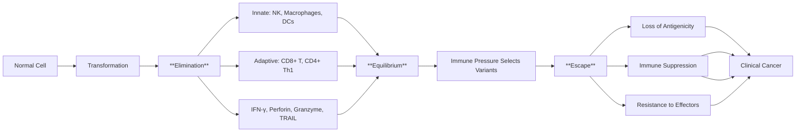
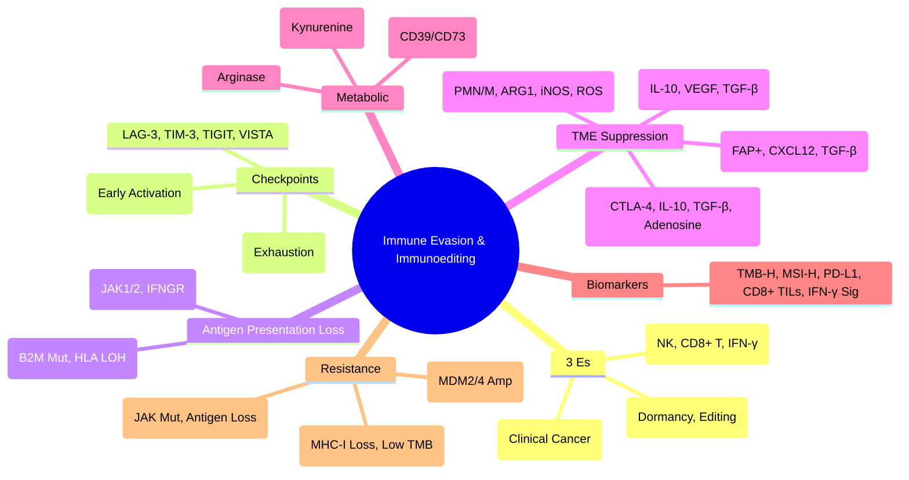

> [!tip] **FCPS/MRCP Priority: HIGH**
> **Cancer Immunoediting = 3 Es**: **Elimination** (Immune Surveillance), **Equilibrium** (Dormancy), **Escape** (Clinical Cancer); **Key Escape Mechanisms**: **Checkpoint Upregulation** (PD-L1, CTLA-4, LAG-3, TIM-3, TIGIT, VISTA), **Antigen Presentation Loss** (MHC-I ↓, B2M Mut), **IFN-γ Pathway Defects** (JAK1/2 Mut, IFNGR Mut), **TME Immunosuppression** (Tregs, MDSCs, M2 TAMs, CAFs), **Metabolic Suppression** (IDO, Adenosine, Arginase); **Immunotherapy Predictors**: **TMB-H, MSI-H, PD-L1, TILs, IFN-γ Signature**.

---

## 1. 1. Learning Objectives
By the end of this note you should be able to:
- [ ] Describe the **3 Es of Cancer Immunoediting** (Elimination, Equilibrium, Escape)
- [ ] Explain **immune checkpoint pathways** and their therapeutic targeting
- [ ] Identify **antigen presentation defects** (MHC-I, B2M, IFN-γ pathway)
- [ ] Describe **TME immunosuppressive cells** (Tregs, MDSCs, M2 TAMs, CAFs)
- [ ] Apply **biomarkers for immunotherapy response** (TMB, MSI, PD-L1, TILs, IFN-γ signature)

---

## 2. 2. Cancer Immunoediting: The 3 Es

### 1. Phase Details

| Phase | Mechanism | Outcome |
|-------|-----------|---------|
| **Elimination** | Innate (NK, DC, Macrophage) + Adaptive (CD8+ T, Th1) recognize tumour antigens → IFN-γ, Perforin, Granzyme, TRAIL → Tumour cell death | **Tumour Eradication** |
| **Equilibrium** | Immune pressure selects tumour variants; **Immunoediting** sculpts tumour genome | **Dormancy**, **Tumour Editing** |
| **Escape** | Tumour variants evade immunity via multiple mechanisms | **Clinical Cancer** |

---

## 3. 3. Immune Checkpoint Pathways

| Checkpoint | Ligand/Receptor | Expression | Mechanism | Clinical Target |
|------------|----------------|------------|-----------|-----------------|
| **PD-1 / PD-L1** | PD-1 (T cells) ↔ PD-L1/PD-L2 (Tumour, APCs, Macrophages) | T cell exhaustion | Inhibits TCR/CD28 → SHP-2 → PI3K/AKT, RAS/ERK | **Pembrolizumab, Nivolumab, Atezolizumab, Durvalumab, Cemiplimab** |
| **CTLA-4** | CTLA-4 (Tregs, Activated T) ↔ CD80/CD86 (APCs) | Early activation | Outcompetes CD28 (Higher Affinity), Trans-endocytosis of CD80/86 | **Ipilimumab, Tremelimumab** |
| **LAG-3** | LAG-3 (Exhausted T) ↔ MHC-II (APCs) | Exhaustion | Inhibits TCR Signalling, Treg Function | **Relatlimab (Fixed-Dose with Nivolumab)** |
| **TIM-3** | TIM-3 (Exhausted T, Tregs, DCs) ↔ Galectin-9, CEACAM1, HMGB1 | Exhaustion | Inhibits TCR Signalling, DC Dysfunction | **Sabatalimab, TSR-022** |
| **TIGIT** | TIGIT (T, NK) ↔ CD155/PVR (Tumour, APCs) | Exhaustion | Competes with CD226 (DNAM-1), Inhibits NK/T Cytotoxicity | **Tiragolumab, Domvanalimab** |
| **VISTA** | VISTA (Myeloid, T) ↔ VSIG3, PSGL-1 | Myeloid/T cell suppression | pH-Dependent, Maintains Peripheral Tolerance | **CA-170, HMBD-002** |

---

## 4. 4. Antigen Presentation Defects

| Defect | Mechanism | Consequence | Clinical Relevance |
|--------|-----------|-------------|-------------------|
| **MHC-I Downregulation** | **Loss of HLA-A/B/C** (Epigenetic, Mutational) | **CD8+ T Cells Cannot Recognise** Tumour | **Escape from CD8+ T Cells** |
| **B2M Mutation** | **B2M Loss-of-Function** → No Surface MHC-I | **Complete MHC-I Loss** | **Resistance to ICI**, Poor Prognosis |
| **HLA LOH** | **Loss of Heterozygosity** at 6p21 (HLA Locus) | **Reduced Antigen Presenting Capacity** | **ICI Resistance** |
| **TAP/β2M/ERAAP Defects** | Antigen Processing Machinery Defects | Impaired Peptide Loading | ICI Resistance |
| **IFN-γ Pathway Defects** | **JAK1/2 Mut, IFNGR1/2 Mut, STAT1 Mut** | **No Response to IFN-γ** → No MHC-I Upregulation | **Primary Resistance to ICI** |

---

## 5. 5. TME Immunosuppressive Cells

| Cell Type | Key Markers | Suppressive Mechanisms |
|-----------|-------------|----------------------|
| **Tregs (Regulatory T Cells)** | **CD4+ CD25hi FoxP3+** | **CTLA-4** (Trans-endocytosis of CD80/86), **IL-10, TGF-β, IL-35**, **cAMP**, **CD39/CD73 → Adenosine**, **IL-2 Consumption** |
| **MDSCs (Myeloid-Derived Suppressor Cells)** | **PMN-MDSC: CD11b+ CD14- CD15+**
**M-MDSC: CD11b+ CD14+ HLA-DRlow** | **ARG1, iNOS, ROS, PGE2, IL-10, TGF-β** |
| **TAMs (M2 Macrophages)** | **CD163+, CD206+, Arg1, IL-10, VEGF** | **IL-10, TGF-β, VEGF, PD-L1**, Angiogenesis, Matrix Remodelling |
| **CAFs (Cancer-Associated Fibroblasts)** | **FAP+, α-SMA+, PDGFRα/β** | **CXCL12 (T-cell Exclusion)**, **TGF-β, IL-6, SDF-1**, ECM Remodelling |
| **TAMs (M1 vs M2)** | **M1: CD80, CD86, iNOS, IL-12** (Anti-tumour)
**M2: CD163, CD206, Arg1, IL-10** (Pro-tumour) | **M1: Anti-tumour**; **M2: Pro-tumour** |

---

## 6. 6. Metabolic & Enzymatic Immune Suppression

| Mechanism | Key Enzyme/Pathway | Effect |
|-----------|-------------------|--------|
| **IDO (Indoleamine 2,3-Dioxygenase)** | **Tryptophan → Kynurenine** | **T-cell Apoptosis**, **Treg Induction**, **AHR Activation** |
| **Adenosine** | **CD39/CD73 → ATP → Adenosine** → **A2A/A2B Receptor** | **T-cell Inhibition**, **Treg Expansion**, **MDSC Recruitment** |
| **Arginase (ARG1/2)** | **L-Arginine Depletion** | **T-cell Proliferation Arrest**, **CD3ζ Downregulation** |
| **PD-L1/PD-L2** | **PD-1 Binding** | **TCR Inhibition (SHP-2)** |
| **TGF-β** | **SMAD Signalling** | **EMT, Treg Induction, Fibrosis** |

---

## 7. 7. Immunotherapy Response Predictors

| Biomarker | Assay | Predictive Value |
|-----------|-------|------------------|
| **TMB-H** | **NGS Panel** (≥10 mut/Mb) | **ICI Benefit** (Pembrolizumab Approved) |
| **MSI-H/dMMR** | **IHC (MMR Proteins) / PCR (MSI)** | **Pembrolizumab** (Tumour-Agnostic) |
| **PD-L1 (TPS/CPS/IC)** | **IHC (22C3, SP263, SP142)** | **ICI Response** (Varies by Cancer) |
| **TILs (CD8+ Density)** | **IHC / Digital Pathology** | **High CD8+ = Better ICI Response** |
| **IFN-γ Signature** | **Gene Expression (6-18 Genes)** | **Inflamed TME = ICI Responsive** |
| **Neoantigen Load** | **WES + HLA Typing** | **High Neoantigen = Better ICI Response** |
| **APM Score** | **MHC-I, TAP, LMP2/7, TAP1/2** | **Low APM = ICI Resistance** |

---

## 8. 8. Resistance to Immunotherapy

| Mechanism | Type | Clinical Implication |
|-----------|------|---------------------|
| **Primary Resistance** | **No Response from Start** | **MHC-I Loss, JAK1/2 Mut, β2M Mut, Low TMB, No TILs** |
| **Acquired Resistance** | **Response Then Relapse** | **Antigen Loss, JAK1/2 Mut, IFN-γ Pathway, MDSC Expansion** |
| **Pseudo-Progression** | **Apparent Progression Then Response** | **Immune Infiltration** (iRECIST Criteria) |
| **Hyperprogression** | **Rapid Acceleration on ICI** | **MDM2/4 Amp, EGFR Amp, STK11/LKB1 Mut** |

---

## 9. 9. FCPS/MRCP High-Yield Summary

| Topic | Key Points |
|-------|------------|
| **3 Es** | **Elimination** (Immune Surveillance), **Equilibrium** (Dormancy, Editing), **Escape** (Clinical Cancer) |
| **Escape Mechanisms** | **Checkpoints (PD-L1, CTLA-4, LAG-3, TIM-3, TIGIT, VISTA)**, **Antigen Loss (MHC-I, B2M)**, **IFN-γ Pathway (JAK1/2, IFNGR)**, **TME Suppression (Tregs, MDSCs, M2 TAMs, CAFs)** |
| **Checkpoints** | **PD-1/PD-L1** (Exhaustion), **CTLA-4** (Early Activation), **LAG-3/TIM-3/TIGIT** (Exhaustion) |
| **Antigen Presentation Loss** | **MHC-I ↓, B2M Mut, HLA LOH, TAP Defects** → **CD8+ Blindness** |
| **IFN-γ Pathway** | **JAK1/2 Mut, IFNGR Mut** → **No MHC-I Upregulation, ICI Resistance** |
| **TME Suppression** | **Tregs (CTLA-4, IL-10, Adenosine)**, **MDSCs (ARG1, iNOS)**, **M2 TAMs (IL-10, VEGF)**, **CAFs (CXCL12, TGF-β)** |
| **Metabolic** | **IDO (Kynurenine), Adenosine (CD39/CD73), Arginase, TGF-β** |
| **Biomarkers** | **TMB-H (≥10 mut/Mb), MSI-H, PD-L1, CD8+ TILs, IFN-γ Signature, Neoantigen Load** |
| **Resistance** | **Primary (MHC-I Loss, Low TMB), Acquired (JAK1/2 Mut, Antigen Loss), Hyperprogression (MDM2/4 Amp, EGFR Amp)** |

---

## 10. 10. Viva Questions (MRCP PACES / FCPS)

| Question | Expected Answer |
|----------|-----------------|
| **3 Es of Cancer Immunoediting?** | **Elimination** (Immune Surveillance), **Equilibrium** (Dormancy, Editing), **Escape** (Clinical Cancer). |
| **PD-1 vs CTLA-4 — Mechanism Difference?** | **PD-1**: Exhaustion Phase, Inhibits TCR/CD28 (SHP-2); **CTLA-4**: Early Activation, Outcompetes CD28 for CD80/86, Trans-endocytosis. |
| **MHC-I Loss — Mechanism, Consequence?** | **B2M Mut, HLA LOH, TAP Defects, Epigenetic Silencing** → **CD8+ T Cells Cannot Recognise Tumour** → **ICI Resistance**. |
| **IFN-γ Pathway Defects — JAK1/2 Mut?** | **JAK1/2 Mut → No IFN-γ Signalling → No MHC-I Upregulation** → **Primary ICI Resistance**. |
| **Treg Suppressive Mechanisms?** | **CTLA-4 (CD80/86 Trans-endocytosis), IL-10, TGF-β, IL-35, cAMP, Adenosine (CD39/CD73), IL-2 Consumption**. |
| **MDSC Subsets — Human Markers?** | **PMN-MDSC: CD11b+ CD14- CD15+ LOX-1+**; **M-MDSC: CD11b+ CD14+ HLA-DRlow/-**. |
| **TIM-3 vs LAG-3 vs TIGIT — Differences?** | **TIM-3: Galectin-9/CEACAM1, DC Dysfunction**; **LAG-3: MHC-II, Treg Function**; **TIGIT: CD155/PVR, Competes with CD226**. |
| **Primary vs Acquired Resistance to ICI?** | **Primary**: No Response (MHC-I Loss, Low TMB); **Acquired**: Relapse After Response (JAK1/2 Mut, Antigen Loss, MDSC Expansion). |
| **Hyperprogression — Definition, Biomarkers?** | **Rapid Progression on ICI**; **MDM2/4 Amp, EGFR Amp, STK11/LKB1 Mut**. |
| **ICI Biomarkers — TMB, MSI, PD-L1, TILs?** | **TMB-H (≥10 mut/Mb), MSI-H, PD-L1 (TPS/CPS), CD8+ TILs, IFN-γ Signature, Neoantigen Load**. |

---

## 11. 11. Confusions & Mnemonics

| Confusion | Clarification |
|-----------|---------------|
| **Elimination vs Equilibrium** | **Elimination**: Tumour Eradicated; **Equilibrium**: Immune Pressure Selects Variants (Dormancy) |
| **PD-1 vs CTLA-4 Timing** | **CTLA-4**: Early (Priming in Lymph Node); **PD-1**: Late (Exhaustion in Tumour) |
| **MHC-I Loss vs PD-L1 Upregulation** | **MHC-I Loss = Antigen Presentation Defect**; **PD-L1 = Checkpoint Upregulation** — **Both = Escape** |
| **Primary vs Acquired ICI Resistance** | **Primary**: Never Responded; **Acquired**: Responded Then Relapsed |
| **MDSC vs Neutrophil** | **MDSC: Immature, Immunosuppressive (ARG1, iNOS, ROS)**; **Neutrophil: Mature, Anti-Microbial** |
| **TIM-3 vs LAG-3 vs TIGIT** | **TIM-3: Galectin-9/CEACAM1, DC Dysfunction**; **LAG-3: MHC-II, Treg**; **TIGIT: CD155/PVR, Competes with CD226** |
| **Hyperprogression vs Pseudoprogression** | **Hyperprogression**: Accelerated Growth on ICI (MDM2/4 Amp, EGFR Amp); **Pseudoprogression**: Apparent Progression Then Response (Immune Infiltration) |

**Mnemonic: IMMUNE-ESCAPE**
- **I**mmunoediting: **3 Es (Elimination, Equilibrium, Escape)**
- **M**HC-I Loss: **B2M Mut, HLA LOH, TAP Defect** → CD8+ Blind
- **M**etabolic: **IDO (Kynurenine), Adenosine (CD39/CD73), Arginase, TGF-β**
- **U**pstream Checkpoints: **CTLA-4 (Early), PD-1 (Late), LAG-3, TIM-3, TIGIT, VISTA**
- **N**K Cell Evasion: **MHC-I Loss, HLA-E, MICA/B Shedding**
- **E**ffector T Cells: **Exhaustion (PD-1, TIM-3, LAG-3, TIGIT, TOX)**
- **E**scape Mechanisms: **Antigen Loss, Immune Suppression, Effector Resistance**
- **S**uppressive Cells: **Tregs (FoxP3+), MDSCs (PMN/M), TAMs (M2), CAFs (FAP+)**
- **C**ytokines: **IL-10, TGF-β, IL-35, IL-6, VEGF**
- **A**ntigen Presentation: **MHC-I, B2M, TAP, β2M, TAP** (Defects = Escape)
- **P**D-1/PD-L1: **SHP-2 → PI3K/AKT, RAS/ERK Inhibition**
- **E**quilibrium: **Dormancy, Immunoediting, Latent Cancer**

---

## 12. 12. Mind Map

---

## 13. 13. One-Page Revision Card

| Domain | Key Points |
|--------|------------|
| **3 Es** | Elimination (Immune Surveillance) → Equilibrium (Dormancy) → Escape (Cancer) |
| **Checkpoints** | PD-1/PD-L1 (Exhaustion), CTLA-4 (Early), LAG-3/TIM-3/TIGIT/VISTA |
| **Antigen Loss** | MHC-I ↓ (B2M Mut, HLA LOH), IFN-γ Path (JAK1/2 Mut) |
| **TME Suppression** | Tregs (CTLA-4, IL-10, Adenosine), MDSCs (ARG1, iNOS), M2 TAMs (IL-10, VEGF), CAFs (CXCL12) |
| **Metabolic** | IDO (Kynurenine), Adenosine (CD39/CD73), Arginase, TGF-β |
| **Biomarkers** | TMB-H, MSI-H, PD-L1, CD8+ TILs, IFN-γ Signature |
| **Resistance** | Primary (MHC-I Loss, Low TMB), Acquired (JAK Mut, Antigen Loss) |
| **Hyperprogression** | MDM2/4 Amp, EGFR Amp, STK11 Mut |

---

## 14. 14. Spaced Repetition Trackers

| Review Interval | Date Completed | Confidence (1-5) | Notes |
|-----------------|----------------|------------------|-------|
| 24 hours | | | |
| 7 days | | | |
| 15 days | | | |
| 30 days | | | |
| 90 days | | | |

---

## 15. 15. Self-Test Scorecard

| Section | Score /5 | Last Attempt |
|---------|----------|--------------|
| 3 Es of Immunoediting | | |
| Checkpoint Pathways | | |
| Antigen Presentation Defects | | |
| TME Suppressive Cells | | |
| Metabolic Suppression | | |
| Biomarkers for ICI | | |
| Resistance Mechanisms | | |
| Hyperprogression | | |

---

## 16. 16. Local Navigation
- **Parent Heading**: [[../Oncology|Oncology]]
- **Chapter Map": [[../Davidson Chapter 7 - Oncology Hierarchy|Oncology Hierarchy]]
- **Chapter MOC": [[../Oncology MOC|Oncology MOC]]
- **Drug Reference": [[../../Clinical Therapeutics and Good Prescribing|Drugs]]
- **Related": [[Cancer Immunotherapy]], [[PD-1/PD-L1]], [[CTLA-4]], [[Tumour Microenvironment]], [[MSI-H]], [[TMB]], [[Immunotherapy Biomarkers]], [[ICI Toxicity]]

---

# FCPS/MRCP Exam Extras

## 17. 17. MCQs (10)

**1.** Regarding Immune Evasion & Cancer Immunoediting (3 Es), which statement is correct?
   A. **Elimination** (Immune Surveillance), **Equilibrium** (Dormancy, Editing), **Escape** (Clinical Can
   B. **Elimination** - alternative approach
   C. Empirical management only
   D. Watch and wait
   - **Answer: A** — **Elimination** (Immune Surveillance), **Equilibrium** (Dormancy, Editing), **Escape** (Clinical Cancer)

**2.** Regarding Immune Evasion & Cancer Immunoediting (Escape Mechanisms), which statement is correct?
   A. **Checkpoints (PD-L1, CTLA-4, LAG-3, TIM-3, TIGIT, VISTA)**, **Antigen Loss (MHC-I, B2M)**, **IFN-γ 
   B. **Checkpoints - alternative approach
   C. Empirical management only
   D. Watch and wait
   - **Answer: A** — **Checkpoints (PD-L1, CTLA-4, LAG-3, TIM-3, TIGIT, VISTA)**, **Antigen Loss (MHC-I, B2M)**, **IFN-γ Pathway (JAK1/2, IFN...

**3.** Regarding Immune Evasion & Cancer Immunoediting (Checkpoints), which statement is correct?
   A. **PD-1/PD-L1** (Exhaustion), **CTLA-4** (Early Activation), **LAG-3/TIM-3/TIGIT** (Exhaustion)
   B. **PD-1/PD-L1** - alternative approach
   C. Empirical management only
   D. Watch and wait
   - **Answer: A** — **PD-1/PD-L1** (Exhaustion), **CTLA-4** (Early Activation), **LAG-3/TIM-3/TIGIT** (Exhaustion)

**4.** Regarding Immune Evasion & Cancer Immunoediting (Antigen Presentation Loss), which statement is correct?
   A. **MHC-I ↓, B2M Mut, HLA LOH, TAP Defects** → **CD8+ Blindness**
   B. **MHC-I - alternative approach
   C. Empirical management only
   D. Watch and wait
   - **Answer: A** — **MHC-I ↓, B2M Mut, HLA LOH, TAP Defects** → **CD8+ Blindness**

**5.** Regarding Immune Evasion & Cancer Immunoediting (IFN-γ Pathway), which statement is correct?
   A. **JAK1/2 Mut, IFNGR Mut** → **No MHC-I Upregulation, ICI Resistance**
   B. **JAK1/2 - alternative approach
   C. Empirical management only
   D. Watch and wait
   - **Answer: A** — **JAK1/2 Mut, IFNGR Mut** → **No MHC-I Upregulation, ICI Resistance**

**6.** Regarding Immune Evasion & Cancer Immunoediting (TME Suppression), which statement is correct?
   A. **Tregs (CTLA-4, IL-10, Adenosine)**, **MDSCs (ARG1, iNOS)**, **M2 TAMs (IL-10, VEGF)**, **CAFs (CXC
   B. **Tregs - alternative approach
   C. Empirical management only
   D. Watch and wait
   - **Answer: A** — **Tregs (CTLA-4, IL-10, Adenosine)**, **MDSCs (ARG1, iNOS)**, **M2 TAMs (IL-10, VEGF)**, **CAFs (CXCL12, TGF-β)**

**7.** Regarding Immune Evasion & Cancer Immunoediting (Metabolic), which statement is correct?
   A. **IDO (Kynurenine), Adenosine (CD39/CD73), Arginase, TGF-β**
   B. **IDO - alternative approach
   C. Empirical management only
   D. Watch and wait
   - **Answer: A** — **IDO (Kynurenine), Adenosine (CD39/CD73), Arginase, TGF-β**

**8.** Regarding Immune Evasion & Cancer Immunoediting (Biomarkers), which statement is correct?
   A. **TMB-H (≥10 mut/Mb), MSI-H, PD-L1, CD8+ TILs, IFN-γ Signature, Neoantigen Load**
   B. **TMB-H - alternative approach
   C. Empirical management only
   D. Watch and wait
   - **Answer: A** — **TMB-H (≥10 mut/Mb), MSI-H, PD-L1, CD8+ TILs, IFN-γ Signature, Neoantigen Load**

**9.** Regarding Immune Evasion & Cancer Immunoediting (Resistance), which statement is correct?
   A. **Primary (MHC-I Loss, Low TMB), Acquired (JAK1/2 Mut, Antigen Loss), Hyperprogression (MDM2/4 Amp, 
   B. **Primary - alternative approach
   C. Empirical management only
   D. Watch and wait
   - **Answer: A** — **Primary (MHC-I Loss, Low TMB), Acquired (JAK1/2 Mut, Antigen Loss), Hyperprogression (MDM2/4 Amp, EGFR Amp)**

**10.** Regarding Immune Evasion & Cancer Immunoediting (FCPS/MRCP High Yield - Immune Evasion), which statement is correct?
   - A. FCPS/MRCP High Yield - Immune Evasion: 3 Es (Elimination, Equilibrium, Escape)
   - B. Empirical approach without specific indication
   - C. Used only in research protocols
   - D. Not relevant in current practice
   - **Answer: A** — FCPS/MRCP High Yield - Immune Evasion: 3 Es (Elimination, Equilibrium, Escape)

## 18. 18. SBA Questions (10)

**1.** A 55-year-old presents with classic features. MDT discussion recommends:
   - A. **Elimination** (Immune Surveillance), **Equilibrium** (Dormancy, Editing), **Escape** (Clinical Can
   - B. **Elimination** (less specific)
   - C. Empirical broad approach
   - D. No intervention required
   - **Answer: A** — first-line: **Elimination** (Immune Surveillance), **Equilibrium** (Dormancy, Editing), **Escape** (Clinical Cancer)

**2.** On staging workup, the patient is found to be [Stage X]. Best management is:
   - A. **Checkpoints (PD-L1, CTLA-4, LAG-3, TIM-3, TIGIT, VISTA)**, **Antigen Loss (MHC-I, B2M)**, **IFN-γ 
   - B. **Checkpoints (less specific)
   - C. Empirical broad approach
   - D. No intervention required
   - **Answer: A** — stage-specific: **Checkpoints (PD-L1, CTLA-4, LAG-3, TIM-3, TIGIT, VISTA)**, **Antigen Loss (MHC-I, B2M)**, **IFN-γ Pathway (JAK1/2, IFN...

**3.** Following first-line treatment, the patient develops [complication]. Best next step:
   - A. **PD-1/PD-L1** (Exhaustion), **CTLA-4** (Early Activation), **LAG-3/TIM-3/TIGIT** (Exhaustion)
   - B. **PD-1/PD-L1** (less specific)
   - C. Empirical broad approach
   - D. No intervention required
   - **Answer: A** — complication: **PD-1/PD-L1** (Exhaustion), **CTLA-4** (Early Activation), **LAG-3/TIM-3/TIGIT** (Exhaustion)

**4.** The patient asks about prognosis. Most appropriate response based on:
   - A. **MHC-I ↓, B2M Mut, HLA LOH, TAP Defects** → **CD8+ Blindness**
   - B. **MHC-I (less specific)
   - C. Empirical broad approach
   - D. No intervention required
   - **Answer: A** — prognosis: **MHC-I ↓, B2M Mut, HLA LOH, TAP Defects** → **CD8+ Blindness**

**5.** A 65-year-old with relevant risk factors should be screened with:
   - A. **JAK1/2 Mut, IFNGR Mut** → **No MHC-I Upregulation, ICI Resistance**
   - B. **JAK1/2 (less specific)
   - C. Empirical broad approach
   - D. No intervention required
   - **Answer: A** — screening: **JAK1/2 Mut, IFNGR Mut** → **No MHC-I Upregulation, ICI Resistance**

**6.** The most clinically important biomarker/molecular test is:
   - A. **Tregs (CTLA-4, IL-10, Adenosine)**, **MDSCs (ARG1, iNOS)**, **M2 TAMs (IL-10, VEGF)**, **CAFs (CXC
   - B. **Tregs (less specific)
   - C. Empirical broad approach
   - D. No intervention required
   - **Answer: A** — biomarker: **Tregs (CTLA-4, IL-10, Adenosine)**, **MDSCs (ARG1, iNOS)**, **M2 TAMs (IL-10, VEGF)**, **CAFs (CXCL12, TGF-β)**

**7.** The standard chemotherapy/regimen of choice is:
   - A. **IDO (Kynurenine), Adenosine (CD39/CD73), Arginase, TGF-β**
   - B. **IDO (less specific)
   - C. Empirical broad approach
   - D. No intervention required
   - **Answer: A** — chemo: **IDO (Kynurenine), Adenosine (CD39/CD73), Arginase, TGF-β**

**8.** The role of surgery in this case is:
   - A. **TMB-H (≥10 mut/Mb), MSI-H, PD-L1, CD8+ TILs, IFN-γ Signature, Neoantigen Load**
   - B. **TMB-H (less specific)
   - C. Empirical broad approach
   - D. No intervention required
   - **Answer: A** — surgery: **TMB-H (≥10 mut/Mb), MSI-H, PD-L1, CD8+ TILs, IFN-γ Signature, Neoantigen Load**

**9.** The recommended surveillance/follow-up protocol is:
   - A. **Primary (MHC-I Loss, Low TMB), Acquired (JAK1/2 Mut, Antigen Loss), Hyperprogression (MDM2/4 Amp, 
   - B. **Primary (less specific)
   - C. Empirical broad approach
   - D. No intervention required
   - **Answer: A** — follow-up: **Primary (MHC-I Loss, Low TMB), Acquired (JAK1/2 Mut, Antigen Loss), Hyperprogression (MDM2/4 Amp, EGFR Amp)**

**10.** A clinician encounters this presentation. Best approach:
   - A. FCPS/MRCP High Yield - Immune Evasion: 3 Es (Elimination, Equilibrium, Escape)
   - B. Watch and wait approach
   - C. Empirical broad treatment
   - D. No intervention required
   - **Answer: A** — FCPS/MRCP High Yield - Immune Evasion: 3 Es (Elimination, Equilibrium, Escape)

## 19. 19. Flashcards

**Q1:** 3 Es?
**A1:** Elimination (Immune Surveillance), Equilibrium (Dormancy, Editing), Escape (Clinical Cancer)

**Q2:** Escape Mechanisms?
**A2:** Checkpoints (PD-L1, CTLA-4, LAG-3, TIM-3, TIGIT, VISTA), Antigen Loss (MHC-I, B2M), IFN-γ Pathway (JAK1/2, IFNGR), TME Suppression (Tregs, MDSCs, M2 TAMs, CAFs)

**Q3:** Checkpoints?
**A3:** PD-1/PD-L1 (Exhaustion), CTLA-4 (Early Activation), LAG-3/TIM-3/TIGIT (Exhaustion)

**Q4:** Antigen Presentation Loss?
**A4:** MHC-I ↓, B2M Mut, HLA LOH, TAP Defects → CD8+ Blindness

**Q5:** IFN-γ Pathway?
**A5:** JAK1/2 Mut, IFNGR Mut → No MHC-I Upregulation, ICI Resistance

**Q6:** TME Suppression?
**A6:** Tregs (CTLA-4, IL-10, Adenosine), MDSCs (ARG1, iNOS), M2 TAMs (IL-10, VEGF), CAFs (CXCL12, TGF-β)

**Q7:** Metabolic?
**A7:** IDO (Kynurenine), Adenosine (CD39/CD73), Arginase, TGF-β

**Q8:** Biomarkers?
**A8:** TMB-H (≥10 mut/Mb), MSI-H, PD-L1, CD8+ TILs, IFN-γ Signature, Neoantigen Load

## 20. 20. Answer Key with Explanations

| # | MCQ | Topic | Explanation |
|---|-----|-------|-------------|
| 1 | A | 3 Es | Elimination (Immune Surveillance), Equilibrium (Dormancy, Editing), Escape (Clinical Cancer) |
| 2 | A | Escape Mechanisms | Checkpoints (PD-L1, CTLA-4, LAG-3, TIM-3, TIGIT, VISTA), Antigen Loss (MHC-I, B2M), IFN-γ Pathway (JAK1/2, IFNGR), TME S |
| 3 | A | Checkpoints | PD-1/PD-L1 (Exhaustion), CTLA-4 (Early Activation), LAG-3/TIM-3/TIGIT (Exhaustion) |
| 4 | A | Antigen Presentation Loss | MHC-I ↓, B2M Mut, HLA LOH, TAP Defects → CD8+ Blindness |
| 5 | A | IFN-γ Pathway | JAK1/2 Mut, IFNGR Mut → No MHC-I Upregulation, ICI Resistance |
| 6 | A | TME Suppression | Tregs (CTLA-4, IL-10, Adenosine), MDSCs (ARG1, iNOS), M2 TAMs (IL-10, VEGF), CAFs (CXCL12, TGF-β) |
| 7 | A | Metabolic | IDO (Kynurenine), Adenosine (CD39/CD73), Arginase, TGF-β |
| 8 | A | Biomarkers | TMB-H (≥10 mut/Mb), MSI-H, PD-L1, CD8+ TILs, IFN-γ Signature, Neoantigen Load |
| 9 | A | Resistance | Primary (MHC-I Loss, Low TMB), Acquired (JAK1/2 Mut, Antigen Loss), Hyperprogression (MDM2/4 Amp, EGFR Amp) |
| 10 | A | FCPS/MRCP High Yield - Immune Evasion | FCPS/MRCP High Yield - Immune Evasion: 3 Es (Elimination, Equilibrium, Escape) |

| # | SBA | Topic | Explanation |
|---|-----|-------|-------------|
| 1 | A | 3 Es | Elimination (Immune Surveillance), Equilibrium (Dormancy, Editing), Escape (Clinical Cancer) |
| 2 | A | Escape Mechanisms | Checkpoints (PD-L1, CTLA-4, LAG-3, TIM-3, TIGIT, VISTA), Antigen Loss (MHC-I, B2M), IFN-γ Pathway (JAK1/2, IFNGR), TME S |
| 3 | A | Checkpoints | PD-1/PD-L1 (Exhaustion), CTLA-4 (Early Activation), LAG-3/TIM-3/TIGIT (Exhaustion) |
| 4 | A | Antigen Presentation Loss | MHC-I ↓, B2M Mut, HLA LOH, TAP Defects → CD8+ Blindness |
| 5 | A | IFN-γ Pathway | JAK1/2 Mut, IFNGR Mut → No MHC-I Upregulation, ICI Resistance |
| 6 | A | TME Suppression | Tregs (CTLA-4, IL-10, Adenosine), MDSCs (ARG1, iNOS), M2 TAMs (IL-10, VEGF), CAFs (CXCL12, TGF-β) |
| 7 | A | Metabolic | IDO (Kynurenine), Adenosine (CD39/CD73), Arginase, TGF-β |
| 8 | A | Biomarkers | TMB-H (≥10 mut/Mb), MSI-H, PD-L1, CD8+ TILs, IFN-γ Signature, Neoantigen Load |
| 9 | A | Resistance | Primary (MHC-I Loss, Low TMB), Acquired (JAK1/2 Mut, Antigen Loss), Hyperprogression (MDM2/4 Amp, EGFR Amp) |

| 11 | A | FCPS/MRCP High Yield - Immune Evasion | FCPS/MRCP High Yield - Immune Evasion: 3 Es (Elimination, Equilibrium, Escape) |
## 21. 21. Local Navigation

- **Parent Heading Hub**: [[../../Principles of Cancer Management|Principles of Cancer Management]]
- **Chapter Map**: [[../../Davidson Chapter 7 - Oncology Hierarchy|Oncology Hierarchy]]
- **Chapter MOC**: [[../../Oncology MOC|Oncology MOC]]
- **Drug Reference**: [[../../../Clinical Therapeutics and Good Prescribing|Drugs]]
---

> Auto-generated study sections for "Principles of Cancer Management" — Ch 8: Oncology.

## Flashcards (10 generated)

- Q: What is the definition of Principles of Cancer Management?
  A: Cancer Immunoediting = 3 Es: Elimination (Immune Surveillance), Equilibrium (Dormancy), Escape (Clinical Cancer); Key Escape Mechanisms: Checkpoint Upregulation (PD-L1, CTLA-4, LAG-3, TIM-3, TIGIT, VISTA), Antigen Presentation Loss (MHC-I ↓, B2M Mut), IFN-γ Pathway Defects (JAK1/2 Mut, IFNGR Mut), TME Immunosuppression (Tregs, MDSCs, M2 TAMs, CAFs), Metabolic Suppression (IDO, Adenosine, Arginase)
- Q: What is 3 Es of Principles of Cancer Management?
  A: Elimination (Immune Surveillance), Equilibrium (Dormancy, Editing), Escape (Clinical Cancer)
- Q: What is the mechanism of Principles of Cancer Management?
  A: Checkpoints (PD-L1, CTLA-4, LAG-3, TIM-3, TIGIT, VISTA), Antigen Loss (MHC-I, B2M), IFN-γ Pathway (JAK1/2, IFNGR), TME Suppression (Tregs, MDSCs, M2 TAMs, CAFs)
- Q: What is Checkpoints of Principles of Cancer Management?
  A: PD-1/PD-L1 (Exhaustion), CTLA-4 (Early Activation), LAG-3/TIM-3/TIGIT (Exhaustion)
- Q: What are the clinical features of Principles of Cancer Management?
  A: MHC-I ↓, B2M Mut, HLA LOH, TAP Defects → CD8+ Blindness
- Q: What is IFN-γ Pathway of Principles of Cancer Management?
  A: JAK1/2 Mut, IFNGR Mut → No MHC-I Upregulation, ICI Resistance
- Q: What is TME Suppression of Principles of Cancer Management?
  A: Tregs (CTLA-4, IL-10, Adenosine), MDSCs (ARG1, iNOS), M2 TAMs (IL-10, VEGF), CAFs (CXCL12, TGF-β)
- Q: What is Metabolic of Principles of Cancer Management?
  A: IDO (Kynurenine), Adenosine (CD39/CD73), Arginase, TGF-β
- Q: What is Biomarkers of Principles of Cancer Management?
  A: TMB-H (≥10 mut/Mb), MSI-H, PD-L1, CD8+ TILs, IFN-γ Signature, Neoantigen Load
- Q: What is Resistance of Principles of Cancer Management?
  A: Primary (MHC-I Loss, Low TMB), Acquired (JAK1/2 Mut, Antigen Loss), Hyperprogression (MDM2/4 Amp, EGFR Amp)

## MCQs (1 generated)

1. **Which of the following best describes Principles of Cancer Management?**
   A. **Cancer Immunoediting = 3 Es: Elimination (Immune Surveillance), Equilibrium (Dormancy), Escape (Clinical Cancer); Key Escape Mechanisms: Checkpoint Upregulation (PD-L1, CTLA-4, LAG-3, TIM-3, TIGIT, VI**
   B. An unrelated condition not matching the clinical picture of Principles of Cancer Management
   C. A complication seen late in the disease course of Principles of Cancer Management
   D. A condition that mimics Principles of Cancer Management but has a different underlying cause

## SBA Questions (1 generated)

1. A patient with suspected Principles of Cancer Management presents with: MHC-I Downregulation — Loss of HLA-A/B/C (Epigenetic, Mutational); B2M Mutation — B2M Loss-of-Function → No Surface MHC-I; HLA LOH — Loss of Heterozygosity at 6p21 (HLA Locus). What is the most likely diagnosis?
   A. **Principles of Cancer Management**
   B. A condition that mimics Principles of Cancer Management but is not the same entity
   C. A complication of Principles of Cancer Management rather than the primary diagnosis
   D. An unrelated condition in the same clinical category as Principles of Cancer Management

