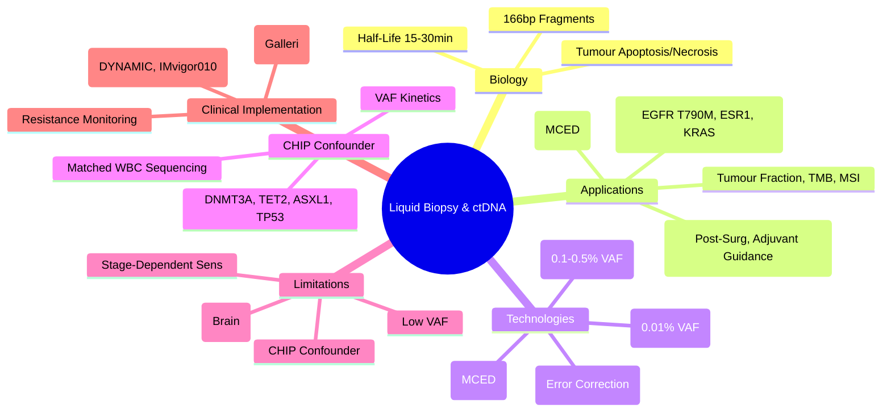

> [!tip] **FCPS/MRCP Priority: HIGH**
> **Liquid Biopsy = Non-Invasive Tumour Profiling via Blood**; **ctDNA = Tumour-Derived DNA Fragments in Plasma**; **Applications**: **MRD** (Post-Surgery/Adjuvant), **Resistance Monitoring** (EGFR T790M, ESR1, KRAS), **Tumour Fraction**, **Early Detection** (Screening); **Limitations**: Sensitivity (Stage-Dependent), **CHIP** (Clonal Haematopoiesis), False Positives; **NGS vs ddPCR**; **MRD-Guided Adjuvant Therapy** (GALAXY, IMvigor010, DYNAMIC).

---

## 1. 1. Learning Objectives
By the end of this note you should be able to:
- [ ] Describe **ctDNA biology** and **liquid biopsy principles**
- [ ] Apply **MRD detection** for adjuvant therapy decisions
- [ ] Monitor **acquired resistance** via ctDNA
- [ ] Interpret **ctDNA results** with awareness of **CHIP** confounder
- [ ] Understand **limitations**: sensitivity, specificity, CHIP, clonal haematopoiesis

---

## 2. 2. ctDNA Biology

| Feature | Detail |
|---------|--------|
| **Origin** | Tumour cell apoptosis/necrosis → DNA fragments released into bloodstream |
| **Fragment Size** | **~166bp** (mononucleosomal), **Peak at ~166bp**, **Sub-nucleosomal <100bp** |
| **Half-Life** | **~15-30 minutes** (Rapid clearance by liver/spleen) |
| **Concentration** | **0.01-10%** of total cfDNA (VAF 0.01-10%) |
| **Fragmentomics** | **Size profiles**, **End motifs**, **Nucleosome positioning** → Tissue of origin |

---

## 3. 3. Clinical Applications

### 1. Minimal Residual Disease (MRD)
| Setting | Clinical Utility | Key Trials |
|---------|------------------|------------|
| **Post-Surgery (CRC, Lung, Breast, Bladder)** | **MRD+ → High Recurrence Risk** (HR 10-50x); **Guides Adjuvant Therapy** | **GALAXY (CRC), IMvigor010 (Bladder), DYNAMIC (CRC)** |
| **During Adjuvant Therapy** | **Early MRD Clearance → Better Outcome**; **Persistent MRD+ → Escalation** | **CIRCULATE, DYNAMIC** |
| **Surveillance** | **Earlier Detection** (Months before imaging) | **TRACERx, TRACERx-Lung** |

### 2. Resistance Monitoring
| Cancer | Resistance Mechanism | ctDNA Utility |
|--------|---------------------|---------------|
| **NSCLC (EGFRm)** | **EGFR T790M**, C797S, METamp, HER2amp | **Guardant360, cobas** → Switch to Osimertinib |
| **Breast (HR+)** | **ESR1 Mutation** (Y537S, D538G) | **Switch to SERD (Elacestrant/Fulvestrant)** |
| **CRC (RAS WT)** | **KRAS/NRAS Mutations** (Acquired) | **Stop Anti-EGFR** |
| **Melanoma (BRAF)** | **BRAF V600E**, NRAS, MEK | **Switch/Combine** |
| **Lung (ALK)** | **ALK Resistance Mutations** (L1196M, G1202R) | **Switch to Lorlatinib** |

### 3. Tumour Fraction & TMB
| Metric | Calculation | Clinical Use |
|--------|-------------|--------------|
| **Tumour Fraction (TF)** | **% ctDNA in total cfDNA** | **Prognostic**, **Response Monitoring** |
| **TMB from ctDNA** | **bTMB** (blood TMB) | **ICI Response Prediction** |
| **MSI from ctDNA** | **MSI Status from ctDNA** | **ICI Eligibility** |

---

## 4. 4. Detection Technologies

| Platform | Method | Sensitivity | Turnaround | Best For |
|----------|--------|-------------|------------|----------|
| **ddPCR** | Droplet Digital PCR | **0.01% VAF** | **1-2 days** | **Known Mutations** (MRD, Resistance) |
| **Safe-SeqS / Safe-Seq** | Unique Molecular Identifiers (UMIs) | **0.001% VAF** | **1-2 weeks** | **Ultra-Deep MRD** |
| **NGS Panels** (Guardant360, FoundationOne Liquid, Signatera) | Hybrid Capture / Amplicon | **0.1-0.5% VAF** | **1-2 weeks** | **Broad Profiling** (TMB, MSI, Fusions, Resistance) |
| **Methylation-Based** (Grail/Galleri) | Methylation Patterns | **Low VAF** | **2 weeks** | **Multi-Cancer Early Detection (MCED)** |

---

## 5. 5. Clonal Haematopoiesis (CHIP) - Major Confounder

| Feature | Detail |
|-------|--------|
| **Definition** | **Age-Related** Somatic Mutations in Haematopoietic Stem Cells |
| **Key Genes** | **DNMT3A, TET2, ASXL1, TP53, JAK2, PPM1D, SF3B1, SRSF2** |
| **Prevalence** | **>10% >70yr**, **>20% >80yr** |
| **VAF Range** | **0.5-10%** (Can mimic tumour VAF) |
| **Risk** | **↑ Haematologic Malignancy**, **↑ CVD** |
| **Distinction** | **CHIP Mutations** = **Haematopoietic** (VAF stable, no tumour correlation); **Tumour ctDNA** = **VAF tracks tumour burden** |

| Strategy to Distinguish | Method |
|------------------------|--------|
| **White Blood Cell Sequencing** | **Matched WBC Sequencing** → Subtract CHIP Variants |
| **VAF Kinetics** | **CHIP Stable**; **Tumour ctDNA Tracks Tumour Burden** |
| **Mutation Profile** | **CHIP Genes** (DNMT3A, TET2, ASXL1) vs **Tumour Genes** (EGFR, KRAS, BRAF) |

---

## 6. 6. Sensitivity & Limitations

| Limitation | Detail | Mitigation |
|------------|--------|------------|
| **Sensitivity** | **Stage-Dependent**: Stage I ~30-50%, Stage IV >90% | **Not for Early Stage Screening Alone** |
| **Shedding** | **Variable**: Brain mets low shed, Liver mets high shed | **Combine with Imaging** |
| **CHIP** | **False Positives** | **Matched WBC Sequencing** |
| **Low VAF** | **<0.1% VAF Challenging** | **UMI-Enhanced NGS, ddPCR** |
| **Tumour Heterogeneity** | **Spatial/Temporal** | **Multi-Region, Longitudinal** |
| **False Positives** | **Sequencing Errors** | **UMIs, Duplex Sequencing, Orthogonal Validation** |

---

## 7. 7. Clinical Implementation

### 1. MRD-Guided Adjuvant Therapy
| Trial | Cancer | Strategy | Outcome |
|-------|--------|----------|---------|
| **DYNAMIC** (CRC) | Stage II CRC | **ctDNA-Guided** vs Standard | **Reduced Chemo Use** (15% vs 28%), Non-Inferior RFS |
| **GALAXY** (CRC) | Stage II/III CRC | **ctDNA-Guided Adjuvant** | Ongoing |
| **IMvigor010** (Bladder) | MIBC Post-Cystectomy | **Atezolizumab if MRD+** | DFS Benefit |
| **CIRCULATE** (Breast) | Early Breast Cancer | **ctDNA-Guided Escalation** | Ongoing |

### 2. Resistance Monitoring Workflow
| Step | Action |
|------|--------|
| **1. Baseline** | **Tissue NGS + Baseline ctDNA** |
| **2. On-Treatment** | **Serial ctDNA q4-8wk** (Resistance Early Detection) |
| **3. At Progression** | **ctDNA NGS** (Resistance Mechanisms) |
| **4. Treatment Selection** | **Match Targeted Therapy** (EGFR T790M → Osimertinib, ESR1 → Elacestrant) |

---

## 8. 8. Multi-Cancer Early Detection (MCED)

| Test | Technology | Status |
|------|------------|--------|
| **Galleri (Grail)** | **Methylation-Based NGS** | **NHS-Galleri Trial** (UK, 140k), **PATHFINDER** |
| **CancerSEEK** | **Protein + ctDNA** | **DETECT-A** |
| **PanSeer** | **Methylation + Mutation** | **Validation Phase** |
| **OverC** | **Multi-Omic** | **Development** |

| Metric (Galleri) | Value |
|------------------|-------|
| **Sensitivity (All Cancers)** | **~50%** (Stage I ~16%, Stage IV ~90%) |
| **Specificity** | **>99%** |
| **Cancer Signal Origin (CSO) Accuracy** | **~85%** |

---

## 9. 9. FCPS/MRCP High-Yield Summary

| Topic | Key Points |
|-------|------------|
| **ctDNA Origin** | Tumour Apoptosis/Necrosis → 166bp Fragments, Half-Life 15-30min |
| **MRD** | Post-Surgery ctDNA+ = High Recurrence Risk; **Guides Adjuvant** (DYNAMIC, IMvigor010) |
| **Resistance Monitoring** | EGFR T790M → Osimertinib; ESR1 → Elacestrant/Fulvestrant; KRAS → Stop Anti-EGFR |
| **Tumour Fraction** | % ctDNA in cfDNA; Prognostic, Response Monitoring |
| **CHIP** | DNMT3A, TET2, ASXL1, TP53, JAK2; **Screen WBC to Subtract** |
| **Limitations** | Stage-Dependent Sensitivity, CHIP, Low Shedding (Brain), Low VAF |
| **MCED** | Galleri (Methylation), CancerSEEK; Sensitivity Stage I ~16%, Stage IV ~90% |
| **MRD-Guided Adjuvant** | DYNAMIC (CRC): Reduced Chemo; IMvigor010 (Bladder): Atezo if MRD+ |

---

## 10. 10. Viva Questions (MRCP PACES / FCPS)

| Question | Expected Answer |
|----------|-----------------|
| **ctDNA Half-Life, Fragment Size?** | **Half-Life 15-30min**, **Peak ~166bp** (Mononucleosomal). |
| **MRD Definition, Clinical Utility?** | **ctDNA Detection Post-Curative Surgery** → High Recurrence Risk; **Guides Adjuvant Therapy** (DYNAMIC, IMvigor010). |
| **EGFR T790M Resistance — ctDNA Role?** | **Detect T790M in ctDNA** → Switch to **Osimertinib** (AURA3, FLAURA). |
| **ESR1 Mutation — ctDNA Detection?** | **ESR1 Y537S/D538G in ctDNA** → **Switch to Fulvestrant/Elacestrant** (EMERALD). |
| **CHIP — Definition, Key Genes, How to Exclude?** | **Age-Related Clonal Haematopoiesis**; **DNMT3A, TET2, ASXL1, TP53, JAK2**; **Exclude: Matched WBC Sequencing, VAF Kinetics**. |
| **ctDNA Sensitivity by Stage?** | **Stage I: 30-50%, Stage II: 50-70%, Stage III: 70-85%, Stage IV: >90%**. |
| **MRD-Guided Adjuvant — DYNAMIC Trial?** | **Stage II CRC**: ctDNA-Guided → **Reduced Chemo (15% vs 28%)**, Non-Inferior RFS. |
| **Tumour Fraction — Definition, Prognostic?** | **% ctDNA in cfDNA**; **Higher TF = Worse Prognosis, Higher Recurrence Risk**. |
| **CHIP — Key Genes, Distinction from Tumour ctDNA?** | **DNMT3A, TET2, ASXL1, TP53, JAK2**; **Exclude: Matched WBC Seq, VAF Kinetics**. |
| **MCED — Galleri Sensitivity?** | **Overall ~50%**; **Stage I ~16%, Stage IV ~90%**; **Specificity >99%**. |

---

## 11. 11. Confusions & Mnemonics

| Confusion | Clarification |
|-----------|---------------|
| **ctDNA vs cfDNA** | **cfDNA = All Cell-Free DNA**; **ctDNA = Tumour-Derived Subset** |
| **MRD vs Recurrence** | **MRD = Molecular Residual Disease (ctDNA+)**; **Recurrence = Clinical/Radiological Relapse** |
| **CHIP vs Tumour ctDNA** | **CHIP: Haematopoietic, Stable VAF, DNMT3A/TET2/ASXL1**; **Tumour ctDNA: VAF Tracks Tumour Burden, Tumour Genes** |
| **MRD-Guided Therapy** | **Only Stage II/III CRC (DYNAMIC), Bladder (IMvigor010) Have Level 1 Evidence** |
| **ctDNA vs Tissue Biopsy** | **ctDNA: Non-Invasive, Heterogeneity Capture, Serial**; **Tissue: Gold Standard, Architecture, IHC, RNA** |
| **ctDNA in Brain Mets** | **Low Shedding** (Blood-Brain Barrier) → **Low Sensitivity**; **CSF ctDNA Better** |
| **ddPCR vs NGS** | **ddPCR: Single Mutation, Ultra-Sensitive (0.01%)**; **NGS: Broad, TMB, MSI, Fusions, 0.1-0.5% VAF** |

**Mnemonic: LIQUID-BIOPSY**
- **L**iquid Biopsy: **ctDNA from Blood**, Non-Invasive
- **I**nterval: **Serial Monitoring q4-8wk** (Resistance, MRD)
- **Q**uantification: **Tumour Fraction (% cfDNA)**, **VAF**
- **U**tility: **MRD, Resistance, Early Detection, TMB, MSI**
- **I**nterpretation: **CHIP Confounder** (DNMT3A, TET2, ASXL1)
- **D**etection: **ddPCR (0.01%), NGS (0.1-0.5%), Methylation (MCED)**
- **B**ioinformatics: **UMIs, Duplex Seq, Error Correction**
- **I**nterpretation: **MRD+, Resistance Mutations, TF Kinetics**
- **O**rgan of Origin: **Methylation Patterns (Grail/Galleri)**
- **P**rognostic: **TF High = Worse**, **MRD+ = Recurrence**
- **S**creening: **MCED (Galleri, CancerSEEK)** - Stage I Low Sens
- **Y**ield: **Stage Dependent (I: 30-50%, IV: >90%)**

---

## 12. 12. Mind Map

---

## 13. 13. One-Page Revision Card

| Domain | Key Points |
|--------|------------|
| **ctDNA** | 166bp fragments, Half-Life 15-30min, Tumour-Derived |
| **MRD** | Post-Surgery ctDNA+ = High Recurrence Risk; **DYNAMIC/IMvigor010** Guide Adjuvant |
| **Resistance** | EGFR T790M→Osimertinib; ESR1→Elacestrant; KRAS→Stop Anti-EGFR |
| **Tumour Fraction** | % ctDNA in cfDNA; Prognostic, Response Monitoring |
| **CHIP** | DNMT3A/TET2/ASXL1/TP53/JAK2; Exclude: Matched WBC Seq |
| **Limitations** | Stage-Dependent Sens (I: 30-50%, IV >90%), CHIP, Low Shed (Brain) |
| **MCED** | Galleri (Methylation): Sens Stage I 16%, Stage IV 90% |
| **MRD-Guided** | DYNAMIC (CRC): ↓Chemo; IMvigor010 (Bladder): Atezo if MRD+ |

---

## 14. 14. Spaced Repetition Trackers

| Review Interval | Date Completed | Confidence (1-5) | Notes |
|-----------------|----------------|------------------|-------|
| 24 hours | | | |
| 7 days | | | |
| 15 days | | | |
| 30 days | | | |
| 90 days | | | |

---

## 15. 15. Self-Test Scorecard

| Section | Score /5 | Last Attempt |
|---------|----------|--------------|
| ctDNA Biology | | |
| MRD Clinical Utility | | |
| Resistance Monitoring | | |
| CHIP Differentiation | | |
| Sensitivity/Limitations | | |
| MCED (Galleri) | | |
| MRD-Guided Trials | | |
| Technology Comparison | | |

---

## 16. 16. Local Navigation
- **Parent Heading**: [[../Oncology|Oncology]]
- **Chapter Map": [[../Davidson Chapter 7 - Oncology Hierarchy|Oncology Hierarchy]]
- **Chapter MOC": [[../Oncology MOC|Oncology MOC]]
- **Drug Reference": [[../../Clinical Therapeutics and Good Prescribing|Drugs]]
- **Related": [[Somatic Mutations]], [[MRD]], [[MRD Guided Therapy]], [[CHIP]], [[EGFR T790M]], [[ESR1 Mutation]], [[KRAS Resistance]], [[NGS Panels]], [[Precision Oncology]]

---

# FCPS/MRCP Exam Extras

## 17. 17. MCQs (10)

**1.** Regarding Liquid Biopsy & Circulating Tumour DNA (ctDNA) (ctDNA Origin), which statement is correct?
   A. Tumour Apoptosis/Necrosis → 166bp Fragments, Half-Life 15-30min
   B. Tumour - alternative approach
   C. Empirical management only
   D. Watch and wait
   - **Answer: A** — Tumour Apoptosis/Necrosis → 166bp Fragments, Half-Life 15-30min

**2.** Regarding Liquid Biopsy & Circulating Tumour DNA (ctDNA) (MRD), which statement is correct?
   A. Post-Surgery ctDNA+ = High Recurrence Risk
   B. Post-Surgery - alternative approach
   C. Empirical management only
   D. Watch and wait
   - **Answer: A** — Post-Surgery ctDNA+ = High Recurrence Risk; **Guides Adjuvant** (DYNAMIC, IMvigor010)

**3.** Regarding Liquid Biopsy & Circulating Tumour DNA (ctDNA) (Resistance Monitoring), which statement is correct?
   A. EGFR T790M → Osimertinib
   B. EGFR - alternative approach
   C. Empirical management only
   D. Watch and wait
   - **Answer: A** — EGFR T790M → Osimertinib; ESR1 → Elacestrant/Fulvestrant; KRAS → Stop Anti-EGFR

**4.** Regarding Liquid Biopsy & Circulating Tumour DNA (ctDNA) (Tumour Fraction), which statement is correct?
   A. % ctDNA in cfDNA
   B. % - alternative approach
   C. Empirical management only
   D. Watch and wait
   - **Answer: A** — % ctDNA in cfDNA; Prognostic, Response Monitoring

**5.** Regarding Liquid Biopsy & Circulating Tumour DNA (ctDNA) (CHIP), which statement is correct?
   A. DNMT3A, TET2, ASXL1, TP53, JAK2
   B. DNMT3A, - alternative approach
   C. Empirical management only
   D. Watch and wait
   - **Answer: A** — DNMT3A, TET2, ASXL1, TP53, JAK2; **Screen WBC to Subtract**

**6.** Regarding Liquid Biopsy & Circulating Tumour DNA (ctDNA) (Limitations), which statement is correct?
   A. Stage-Dependent Sensitivity, CHIP, Low Shedding (Brain), Low VAF
   B. Stage-Dependent - alternative approach
   C. Empirical management only
   D. Watch and wait
   - **Answer: A** — Stage-Dependent Sensitivity, CHIP, Low Shedding (Brain), Low VAF

**7.** Regarding Liquid Biopsy & Circulating Tumour DNA (ctDNA) (MCED), which statement is correct?
   A. Galleri (Methylation), CancerSEEK
   B. Galleri - alternative approach
   C. Empirical management only
   D. Watch and wait
   - **Answer: A** — Galleri (Methylation), CancerSEEK; Sensitivity Stage I ~16%, Stage IV ~90%

**8.** Regarding Liquid Biopsy & Circulating Tumour DNA (ctDNA) (MRD-Guided Adjuvant), which statement is correct?
   A. DYNAMIC (CRC): Reduced Chemo
   B. DYNAMIC - alternative approach
   C. Empirical management only
   D. Watch and wait
   - **Answer: A** — DYNAMIC (CRC): Reduced Chemo; IMvigor010 (Bladder): Atezo if MRD+

**9.** Regarding Liquid Biopsy & Circulating Tumour DNA (ctDNA) (FCPS/MRCP High Yield - Liquid Biopsy), which statement is correct?
   - A. FCPS/MRCP High Yield - Liquid Biopsy: ctDNA for MRD, Resistance Monitoring, Tumour Fraction, Early Detection
   - B. Empirical approach without specific indication
   - C. Used only in research protocols
   - D. Not relevant in current practice
   - **Answer: A** — FCPS/MRCP High Yield - Liquid Biopsy: ctDNA for MRD, Resistance Monitoring, Tumour Fraction, Early Detection

**10.** Regarding Liquid Biopsy & Circulating Tumour DNA (ctDNA) (Key Point), which statement is correct?
   - A. Sensitivity Limitations
   - B. Empirical approach without specific indication
   - C. Used only in research protocols
   - D. Not relevant in current practice
   - **Answer: A** — Sensitivity Limitations

## 18. 18. SBA Questions (10)

**1.** A 55-year-old presents with classic features. MDT discussion recommends:
   - A. Tumour Apoptosis/Necrosis → 166bp Fragments, Half-Life 15-30min
   - B. Tumour (less specific)
   - C. Empirical broad approach
   - D. No intervention required
   - **Answer: A** — first-line: Tumour Apoptosis/Necrosis → 166bp Fragments, Half-Life 15-30min

**2.** On staging workup, the patient is found to be [Stage X]. Best management is:
   - A. Post-Surgery ctDNA+ = High Recurrence Risk
   - B. Post-Surgery (less specific)
   - C. Empirical broad approach
   - D. No intervention required
   - **Answer: A** — stage-specific: Post-Surgery ctDNA+ = High Recurrence Risk; **Guides Adjuvant** (DYNAMIC, IMvigor010)

**3.** Following first-line treatment, the patient develops [complication]. Best next step:
   - A. EGFR T790M → Osimertinib
   - B. EGFR (less specific)
   - C. Empirical broad approach
   - D. No intervention required
   - **Answer: A** — complication: EGFR T790M → Osimertinib; ESR1 → Elacestrant/Fulvestrant; KRAS → Stop Anti-EGFR

**4.** The patient asks about prognosis. Most appropriate response based on:
   - A. % ctDNA in cfDNA
   - B. % (less specific)
   - C. Empirical broad approach
   - D. No intervention required
   - **Answer: A** — prognosis: % ctDNA in cfDNA; Prognostic, Response Monitoring

**5.** A 65-year-old with relevant risk factors should be screened with:
   - A. DNMT3A, TET2, ASXL1, TP53, JAK2
   - B. DNMT3A, (less specific)
   - C. Empirical broad approach
   - D. No intervention required
   - **Answer: A** — screening: DNMT3A, TET2, ASXL1, TP53, JAK2; **Screen WBC to Subtract**

**6.** The most clinically important biomarker/molecular test is:
   - A. Stage-Dependent Sensitivity, CHIP, Low Shedding (Brain), Low VAF
   - B. Stage-Dependent (less specific)
   - C. Empirical broad approach
   - D. No intervention required
   - **Answer: A** — biomarker: Stage-Dependent Sensitivity, CHIP, Low Shedding (Brain), Low VAF

**7.** The standard chemotherapy/regimen of choice is:
   - A. Galleri (Methylation), CancerSEEK
   - B. Galleri (less specific)
   - C. Empirical broad approach
   - D. No intervention required
   - **Answer: A** — chemo: Galleri (Methylation), CancerSEEK; Sensitivity Stage I ~16%, Stage IV ~90%

**8.** The role of surgery in this case is:
   - A. DYNAMIC (CRC): Reduced Chemo
   - B. DYNAMIC (less specific)
   - C. Empirical broad approach
   - D. No intervention required
   - **Answer: A** — surgery: DYNAMIC (CRC): Reduced Chemo; IMvigor010 (Bladder): Atezo if MRD+

**9.** A clinician encounters this presentation. Best approach:
   - A. FCPS/MRCP High Yield - Liquid Biopsy: ctDNA for MRD, Resistance Monitoring, Tumour Fraction, Early Detection
   - B. Watch and wait approach
   - C. Empirical broad treatment
   - D. No intervention required
   - **Answer: A** — FCPS/MRCP High Yield - Liquid Biopsy: ctDNA for MRD, Resistance Monitoring, Tumour Fraction, Early Detection

**10.** On evaluation, the finding is confirmed. Most appropriate next step:
   - A. Sensitivity Limitations
   - B. Watch and wait approach
   - C. Empirical broad treatment
   - D. No intervention required
   - **Answer: A** — Sensitivity Limitations

## 19. 19. Flashcards

**Q1:** ctDNA Origin?
**A1:** Tumour Apoptosis/Necrosis → 166bp Fragments, Half-Life 15-30min

**Q2:** MRD?
**A2:** Post-Surgery ctDNA+ = High Recurrence Risk; Guides Adjuvant (DYNAMIC, IMvigor010)

**Q3:** Resistance Monitoring?
**A3:** EGFR T790M → Osimertinib; ESR1 → Elacestrant/Fulvestrant; KRAS → Stop Anti-EGFR

**Q4:** Tumour Fraction?
**A4:** % ctDNA in cfDNA; Prognostic, Response Monitoring

**Q5:** CHIP?
**A5:** DNMT3A, TET2, ASXL1, TP53, JAK2; Screen WBC to Subtract

**Q6:** Limitations?
**A6:** Stage-Dependent Sensitivity, CHIP, Low Shedding (Brain), Low VAF

**Q7:** MCED?
**A7:** Galleri (Methylation), CancerSEEK; Sensitivity Stage I ~16%, Stage IV ~90%

**Q8:** MRD-Guided Adjuvant?
**A8:** DYNAMIC (CRC): Reduced Chemo; IMvigor010 (Bladder): Atezo if MRD+

## 20. 20. Answer Key with Explanations

| # | MCQ | Topic | Explanation |
|---|-----|-------|-------------|
| 1 | A | ctDNA Origin | Tumour Apoptosis/Necrosis → 166bp Fragments, Half-Life 15-30min |
| 2 | A | MRD | Post-Surgery ctDNA+ = High Recurrence Risk; Guides Adjuvant (DYNAMIC, IMvigor010) |
| 3 | A | Resistance Monitoring | EGFR T790M → Osimertinib; ESR1 → Elacestrant/Fulvestrant; KRAS → Stop Anti-EGFR |
| 4 | A | Tumour Fraction | % ctDNA in cfDNA; Prognostic, Response Monitoring |
| 5 | A | CHIP | DNMT3A, TET2, ASXL1, TP53, JAK2; Screen WBC to Subtract |
| 6 | A | Limitations | Stage-Dependent Sensitivity, CHIP, Low Shedding (Brain), Low VAF |
| 7 | A | MCED | Galleri (Methylation), CancerSEEK; Sensitivity Stage I ~16%, Stage IV ~90% |
| 8 | A | MRD-Guided Adjuvant | DYNAMIC (CRC): Reduced Chemo; IMvigor010 (Bladder): Atezo if MRD+ |
| 9 | A | FCPS/MRCP High Yield - Liquid Biopsy | FCPS/MRCP High Yield - Liquid Biopsy: ctDNA for MRD, Resistance Monitoring, Tumour Fraction, Early Detection |
| 10 | A | Sensitivity Limitations | Sensitivity Limitations |

| # | SBA | Topic | Explanation |
|---|-----|-------|-------------|
| 1 | A | ctDNA Origin | Tumour Apoptosis/Necrosis → 166bp Fragments, Half-Life 15-30min |
| 2 | A | MRD | Post-Surgery ctDNA+ = High Recurrence Risk; Guides Adjuvant (DYNAMIC, IMvigor010) |
| 3 | A | Resistance Monitoring | EGFR T790M → Osimertinib; ESR1 → Elacestrant/Fulvestrant; KRAS → Stop Anti-EGFR |
| 4 | A | Tumour Fraction | % ctDNA in cfDNA; Prognostic, Response Monitoring |
| 5 | A | CHIP | DNMT3A, TET2, ASXL1, TP53, JAK2; Screen WBC to Subtract |
| 6 | A | Limitations | Stage-Dependent Sensitivity, CHIP, Low Shedding (Brain), Low VAF |
| 7 | A | MCED | Galleri (Methylation), CancerSEEK; Sensitivity Stage I ~16%, Stage IV ~90% |
| 8 | A | MRD-Guided Adjuvant | DYNAMIC (CRC): Reduced Chemo; IMvigor010 (Bladder): Atezo if MRD+ |

| 11 | A | FCPS/MRCP High Yield - Liquid Biopsy | FCPS/MRCP High Yield - Liquid Biopsy: ctDNA for MRD, Resistance Monitoring, Tumour Fraction, Early Detection |
| 12 | A | Sensitivity Limitations | Sensitivity Limitations |
## 21. 21. Local Navigation

- **Parent Heading Hub**: [[../../Principles of Cancer Management|Principles of Cancer Management]]
- **Chapter Map**: [[../../Davidson Chapter 7 - Oncology Hierarchy|Oncology Hierarchy]]
- **Chapter MOC**: [[../../Oncology MOC|Oncology MOC]]
- **Drug Reference**: [[../../../Clinical Therapeutics and Good Prescribing|Drugs]]

