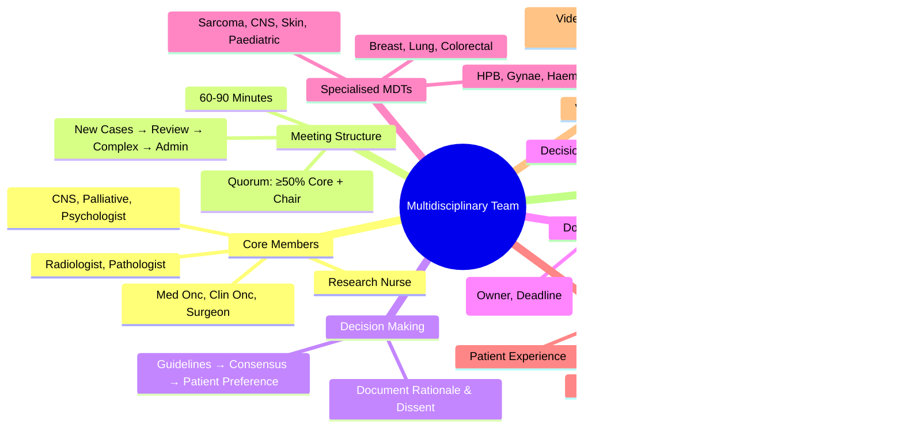

> [!tip] **FCPS/MRCP Priority: HIGH**
> **MDT = Standard of Care for Cancer Management**; **Core Members**: Medical Oncologist, Clinical Oncologist, Surgeon, Radiologist, Pathologist, CNS, Palliative Care, Psychologist, Research Nurse; **Meeting Structure**: Case Presentation, Imaging Review, Pathology Review, Treatment Discussion, Decision; **Decision Making**: Consensus, Guidelines (NICE/ESMO/NCCN), Patient Preference; **Specialised MDTs**: Breast, Lung, Colorectal, HPB, Gynae, Haem, Sarcoma, CNS, Skin, Paediatric; **Quality**: NICE Standards, Peer Review, Documentation, Patient Consent.

---

## 1. 1. Learning Objectives
By the end of this note you should be able to:
- [ ] Describe **MDT composition** and **core members**
- [ ] Conduct **structured MDT meetings** with standardised format
- [ ] Apply **decision-making frameworks** (Guidelines, Consensus, Patient Preference)
- [ ] Identify **site-specific MDTs** and their unique requirements
- [ ] Implement **quality assurance** (Peer Review, Documentation, Audit)
- [ ] Understand **virtual/hybrid MDT** best practices

---

## 2. 2. MDT Composition

### 1. Core Members (Mandatory)

| Role | Responsibility |
|------|----------------|
| **Medical Oncologist** | Systemic Therapy Decisions, Clinical Trials |
| **Clinical Oncologist** | Radiotherapy Decisions, Combined Modality |
| **Surgical Oncologist** | Resectability Assessment, Surgical Approach |
| **Radiologist** | Staging, Response Assessment, Image Guidance |
| **Pathologist** | Diagnosis, Biomarkers, Molecular Profiling |
| **Clinical Nurse Specialist (CNS)** | Patient Support, Coordination, Holistic Needs |
| **Palliative Care Physician** | Symptom Control, Advance Care Planning |
| **Psychologist/Psycho-oncologist** | Distress Screening, Psychological Support |
| **Research Nurse** | Clinical Trial Screening, Recruitment |

### 2. Extended Members (As Needed)

| Role | When Required |
|------|---------------|
| **Haematologist** | Haematological Malignancies, Cytopenias |
| **Interventional Radiologist** | Biopsy, Ablation, Embolisation, Stenting |
| **Nuclear Medicine Physician** | PET-CT, Radionuclide Therapy |
| **Genetic Counsellor** | Hereditary Syndromes, Germline Testing |
| **Dietitian** | Nutritional Support, Cachexia |
| **Physiotherapist/Occupational Therapist** | Rehabilitation, Lymphoedema, Prehab |
| **Speech & Language Therapist** | H&N Cancers, Swallowing/Voice |
| **Fertility Specialist** | Oncofertility (Young Patients) |
| **Pharmacist** | Drug Interactions, Dosing, Clinical Trials |
| **Clinical Trial Coordinator** | Trial Recruitment, Data Management |
| **Administrator/Coordinator** | Scheduling, Minutes, ACTION Log |

---

## 3. 3. MDT Meeting Structure

### 1. Standard Agenda (60-90 Minutes)

| Time | Item | Lead |
|------|------|------|
| **1. Administration** (5 min) | Apologies, Minutes Approval, ACTION Log Review | Chair |
| **2. New Referrals** (30-40 min) | Case Presentation → Imaging → Pathology → Discussion → Decision | Presenting Clinician → Radiologist → Pathologist → All |
| **3. Review Cases** (15 min) | Treatment Updates, Toxicity, Restaging, Trial Eligibility | Relevant Specialist |
| **4. Complex/Controversial** (15 min) | Multidisciplinary Debate, Second Opinions, Ethics | Chair + All |
| **5. Administrative** (5 min) | Trial Updates, Audit, Training, ACTION Log Update | Coordinator |
| **6. Close** | Next Meeting Date, ACTION Log Circulation | Chair |

### 2. Case Presentation Format (Standardised)

| Component | Content |
|-----------|---------|
| **Patient Demographics** | Age, Sex, PS, Comorbidities, Medications |
| **Diagnosis** | Histology, Grade, Stage (cTNM, pTNM), Molecular Markers |
| **Clinical History** | Symptoms, Prior Treatments, Prior RT/Chemo/Surgery |
| **Imaging Summary** | Primary, Nodes, Mets (RECIST), Key Findings |
| **Pathology Summary** | Histology, Grade, Biomarkers (ER/PR/HER2, RAS, MSI, PD-L1, etc.) |
| **Staging** | cTNM / pTNM / yTNM, Stage Group |
| **Proposed Plan** | Surgery / RT / Systemic / Palliative / Trial |
| **Discussion Points** | Controversies, Alternatives, Trial Eligibility |
| **Decision** | **Consensus Recommendation** (Documented) |
| **Patient Preference** | **Documented** (If Known) |

---

## 4. 4. Decision-Making Framework

### 1. Decision Matrix

| Factor | Weight |
|--------|--------|
| **Guideline Concordance** (NICE, ESMO, NCCN) | **High** |
| **Evidence Level** (RCT > Phase II > Expert Opinion) | **High** |
| **Patient Fitness** (PS, Comorbidities, Frailty) | **High** |
| **Patient Preference** | **High** (Autonomy) |
| **Multidisciplinary Consensus** | **Required** |
| **Resource Availability** | **Pragmatic** |
| **Clinical Trial Availability** | **Preferred** (If Eligible) |

### 2. Decision Types

| Decision Type | Process |
|-------------|---------|
| **Standard of Care** | **Consensus** (Guideline-Adherent) |
| **Equipoise** (Multiple Valid Options) | **Discuss Pros/Cons** → **Patient Preference** |
| **Deviation from Guideline** | **Documented Rationale**, **Second Opinion if Needed** |
| **Complex/Uncommon** | **Second Opinion**, **Tertiary Referral**, **Trial Referral** |
| **Patient Declines Recommended** | **Document Discussion**, **Alternative Offered**, **Respect Autonomy** |

---

## 5. 5. Specialised MDTs

| MDT Type | Core Members | Key Focus |
|----------|--------------|-----------|
| **Breast** | Surgeon, Med/Rad Onc, Radiologist, Pathologist, CNS, Plastics | BCS vs Mastectomy, SLNB, Reconstruction, Neoadjuvant |
| **Lung** | Thoracic Surgeon, Med/Rad Onc, Radiologist, Pathologist, Respiratory Physician, CNS | Staging, Resectability, Neoadjuvant, RT Technique |
| **Colorectal** | Colorectal Surgeon, Med/Rad Onc, Radiologist, Pathologist, Stoma Nurse, CNS | TME/TNT, Stoma, Liver Mets MDT Link |
| **Hepatopancreatobiliary (HPB)** | HPB Surgeon, Med/Rad Onc, Radiologist, Pathologist, Interventional Rad, Gastro, CNS | Resectability, Transplant, Locoregional Therapy |
| **Gynaecological** | Gynae Onc Surgeon, Med/Rad Onc, Radiologist, Pathologist, CNS | Fertility, Radical Hysterectomy, RT Brachytherapy |
| **Haematological** | Haematologist, Clinical Haematologist, Transplant, Pathologist, BMT Coordinator, CNS | Transplant Eligibility, Trial Eligibility, Supportive Care |
| **Sarcoma** | Orthopaedic/Soft Tissue Surgeon, Med/Rad Onc, Radiologist, Pathologist, Plastics, CNS | Limb Salvage, Neoadjuvant, Reconstruction |
| **CNS** | Neurosurgeon, Clinical Oncologist, Neuro-Radiologist, Neuropathologist, CNS | Resection vs Biopsy, RT Technique, Molecular |
| **Skin** | Dermatologist, Surgeon, Clinical Oncologist, Radiologist, Pathologist, CNS | SLNB, Adjuvant, Metastatic Pathways |
| **Paediatric** | Paediatric Oncologist, Surgeon, Radiologist, Pathologist, BMT, Psychologist, Play Specialist, CNS | Protocol-Based, Late Effects, Fertility, Transition |

---

## 6. 6. Quality Standards & Governance

### 1. NICE MDT Standards (NGC)
| Standard | Requirement |
|----------|-------------|
| **Membership** | **Core Members Present** (≥80% Attendance) |
| **Quorum** | **≥50% Core Members** + Chair |
| **Case Discussion** | **All New Diagnoses** + **Treatment Changes** |
| **Documentation** | **Minutes, Decisions, ACTION Log** |
| **Patient Consent** | **MDT Discussion Consent** (Implied/Explicit) |
| **Timeliness** | **Within 2 Weeks** of Referral (Cancer Waiting Times) |

### 2. Peer Review & Quality Assurance
| Activity | Frequency |
|----------|-----------|
| **Peer Review** | **Quarterly** (Case Review, Outcome Audit) |
| **Outcome Audit** | **Annual** (Survival, Toxicity, QOL) |
| **Guideline Adherence** | **Quarterly** (NICE/ESMO/NCCN Compliance) |
| **Patient Experience** | **Annual Survey** (PREMs) |
| **MDT Self-Assessment** | **Annual** (NICE MDT Self-Assessment Tool) |

### 3. Documentation Standards
| Element | Requirement |
|---------|-------------|
| **Minutes** | **Circulated <48h**, **Signed by Chair** |
| **ACTION Log** | **Owner, Deadline, Status** |
| **Decision Record** | **Rationale, Dissenting Views, Patient Preference** |
| **Confidentiality** | **GDPR Compliant**, **Secure Storage** |
| **Data Collection** | **NCRAS/CRUK Dataset** (Mandatory Fields) |

---

## 7. 7. Virtual/Hybrid MDTs

### 1. Best Practices (Post-COVID)
| Aspect | Best Practice |
|--------|---------------|
| **Platform** | **Secure NHS Video** (MS Teams, AccuRx, Attend Anywhere) |
| **Pre-Meeting** | **Pre-Circulate Imaging/Pathology/Clinic Letters** (24h Prior) |
| **Roles** | **Chair, Timekeeper, Minute-Taker, IT Support** |
| **Engagement** | **Video On**, **Mute When Not Speaking**, **Chat for Questions** |
| **Decision Recording** | **Real-Time in Shared Document** |
| **Patient Involvement** | **Virtual Attendance** (If Appropriate) |

---

## 8. 8. FCPS/MRCP High-Yield Summary

| Topic | Key Points |
|-------|------------|
| **Core MDT Members** | Med Onc, Clin Onc, Surgeon, Radiologist, Pathologist, CNS, Palliative, Psychologist, Research Nurse |
| **Meeting Structure** | New Cases → Review → Complex → Admin; 60-90 min; Quorum ≥50% Core |
| **Decision Making** | Guidelines (NICE/ESMO/NCCN) → Consensus → Patient Preference |
| **Documentation** | Minutes <48h, ACTION Log, Decision Rationale, Patient Preference |
| **Specialised MDTs** | Breast, Lung, Colorectal, HPB, Gynae, Haem, Sarcoma, CNS, Skin, Paediatric |
| **Quality Standards** | NICE Standards: Core Members, Quorum, Timeliness, Documentation, Peer Review |
| **Virtual MDTs** | Secure Platform, Pre-Circulation, Video On, Real-Time Minutes |
| **Patient Consent** | Implied/Explicit for MDT Discussion; Documented |
| **Peer Review** | Quarterly Case Review, Annual Outcome Audit, Guideline Adherence |

---

## 9. 9. Viva Questions (MRCP PACES / FCPS)

| Question | Expected Answer |
|----------|-----------------|
| **MDT Core Members — Minimum Required?** | **Medical Oncologist, Clinical Oncologist, Surgeon, Radiologist, Pathologist, CNS, Palliative Care, Psychologist, Research Nurse** (NICE Quorum: ≥50% Core Members). |
| **MDT Meeting Structure — Standard Agenda?** | **1) Admin/Minutes, 2) New Referrals (Presentation→Imaging→Pathology→Decision), 3) Review Cases, 4) Complex Cases, 5) Admin/ACTION Log**. |
| **MDT Decision Making — How Are Decisions Made?** | **Guideline-Based (NICE/ESMO/NCCN) → Multidisciplinary Consensus → Patient Preference**; **Document Rationale, Dissent, Patient Preference**. |
| **MDT Quorum — NICE Standard?** | **≥50% Core Members Present + Chair**. |
| **MDT Documentation — Key Requirements?** | **Minutes <48h**, **ACTION Log (Owner/Deadline)**, **Decision Rationale**, **Patient Preference Documented**, **Dissenting Views Recorded**. |
| **Patient Consent for MDT Discussion?** | **Implied Consent** (Standard NHS) **or Explicit** (If Sensitive); **Documented in Notes**. |
| **Virtual MDT — Key Requirements?** | **Secure NHS Platform**, **Pre-Circulation (24h)**, **Video On**, **Real-Time Minutes**, **IT Support**. |
| **Breast MDT — Specific Members?** | **Breast Surgeon, Med/Rad Onc, Radiologist, Pathologist, CNS, Plastic Surgeon, Research Nurse**. |
| **Lung MDT — Key Decision Points?** | **Resectability, Mediastinal Staging (EBUS), Neoadjuvant vs Adjuvant, RT Technique**. |
| **MDT Peer Review — Frequency, Focus?** | **Quarterly**: Case Review, Outcome Audit; **Annual**: Guideline Adherence, Outcome Audit, Patient Experience Survey. |

---

## 10. 10. Confusions & Mnemonics

| Confusion | Clarification |
|-----------|---------------|
| **Core vs Extended Members** | **Core = Mandatory Attendees (Quorum)**; **Extended = As Needed (Genetics, Dietetics, SALT, etc.)** |
| **MDT vs Tumour Board** | **Synonymous** — MDT = Modern Term, Emphasises Multidisciplinary; **Tumour Board** = Older Term |
| **Chair vs Clinical Lead** | **Chair**: Runs Meeting, Ensures Process; **Clinical Lead**: Service Leadership, Governance |
| **MDT Decision vs Individual Clinician** | **MDT Decision = Gold Standard**; **Individual Override = Documented Exception** |
| **Patient Attendance** | **Not Routine** (Confidentiality, Distress); **Virtual Option Emerging**; **Represented by CNS** |
| **MDT vs Tumour Board** | **Same** — MDT = Modern Term |
| **ACTION Log vs Minutes** | **Minutes = Narrative Record**; **ACTION Log = Tasks/Owners/Deadlines/Status** |
| **Quorum Failure** | **Reschedule** (Do Not Make Decisions Without Quorum) |

**Mnemonic: MDT-QUALITY**
- **M**ultidisciplinary: **Core 9 Members** (Med Onc, Clin Onc, Surgeon, Rad, Path, CNS, Pall, Psych, Res Nurse)
- **D**ecision: **Guidelines → Consensus → Patient Preference**
- **T**ime: **60-90min, Quorum ≥50% Core**
- **Q**uorum: **≥50% Core + Chair**
- **U**nified Recording: **Minutes <48h, ACTION Log, Rationale, Dissent**
- **A**genda: **New Cases (40min), Review (15min), Complex (15min), Admin (5min)**
- **L**ogic: **Guidelines → Consensus → Patient Preference**
- **I**nformation: **Pre-Circulation (Imaging, Pathology, Letters)**
- **T**eam Specialised: **Breast, Lung, Colorectal, HPB, Gynae, Haem, Sarcoma, CNS, Skin, Paed**
- **Y**early Audit: **Peer Review Quarterly, Outcome Audit Annual**

---

## 11. 11. Mind Map

---

## 12. 12. One-Page Revision Card

| Domain | Key Points |
|--------|------------|
| **Core Members** | Med Onc, Clin Onc, Surgeon, Radiologist, Pathologist, CNS, Palliative, Psychologist, Research Nurse |
| **Meeting** | 60-90min, Quorum ≥50% Core + Chair |
| **Agenda** | New Cases → Review → Complex → Admin |
| **Decision** | Guidelines → Consensus → Patient Preference |
| **Documentation** | Minutes <48h, ACTION Log, Rationale, Dissent, Patient Preference |
| **Specialised MDTs** | Breast, Lung, Colorectal, HPB, Gynae, Haem, Sarcoma, CNS, Skin, Paediatric |
| **Quality** | NICE Standards, Peer Review Quarterly, Outcome Audit Annual |
| **Virtual MDT** | Secure Platform, Pre-Circulation, Video On, Real-Time Minutes |

---

## 13. 13. Spaced Repetition Trackers

| Review Interval | Date Completed | Confidence (1-5) | Notes |
|-----------------|----------------|------------------|-------|
| 24 hours | | | |
| 7 days | | | |
| 15 days | | | |
| 30 days | | | |
| 90 days | | | |

---

## 14. 14. Self-Test Scorecard

| Section | Score /5 | Last Attempt |
|---------|----------|--------------|
| Core MDT Members | | |
| Meeting Structure | | |
| Decision Making Process | | |
| Documentation Standards | | |
| Specialised MDTs | | |
| Quality Standards | | |
| Virtual MDT Best Practices | | |
| Patient Consent | | |

---

## 15. 15. Local Navigation
- **Parent Heading**: [[../Oncology|Oncology]]
- **Chapter Map": [[../Davidson Chapter 7 - Oncology Hierarchy|Oncology Hierarchy]]
- **Chapter MOC": [[../Oncology MOC|Oncology MOC]]
- **Drug Reference": [[../../Clinical Therapeutics and Good Prescribing|Drugs]]
- **Related": [[MDT Meeting]], [[Treatment Decision Making]], [[Oncology Governance]], [[NICE Guidelines]], [[Peer Review]], [[Patient Consent]], [[Clinical Trials]]

---

# FCPS/MRCP Exam Extras

## 16. 16. MCQs (10)

**1.** Regarding Multidisciplinary Team (MDT) Approach (Core MDT Members), which statement is correct?
   A. Med Onc, Clin Onc, Surgeon, Radiologist, Pathologist, CNS, Palliative, Psychologist, Research Nurse
   B. Med - alternative approach
   C. Empirical management only
   D. Watch and wait
   - **Answer: A** — Med Onc, Clin Onc, Surgeon, Radiologist, Pathologist, CNS, Palliative, Psychologist, Research Nurse

**2.** Regarding Multidisciplinary Team (MDT) Approach (Meeting Structure), which statement is correct?
   A. New Cases → Review → Complex → Admin
   B. New - alternative approach
   C. Empirical management only
   D. Watch and wait
   - **Answer: A** — New Cases → Review → Complex → Admin; 60-90 min; Quorum ≥50% Core

**3.** Regarding Multidisciplinary Team (MDT) Approach (Decision Making), which statement is correct?
   A. Guidelines (NICE/ESMO/NCCN) → Consensus → Patient Preference
   B. Guidelines - alternative approach
   C. Empirical management only
   D. Watch and wait
   - **Answer: A** — Guidelines (NICE/ESMO/NCCN) → Consensus → Patient Preference

**4.** Regarding Multidisciplinary Team (MDT) Approach (Documentation), which statement is correct?
   A. Minutes <48h, ACTION Log, Decision Rationale, Patient Preference
   B. Minutes - alternative approach
   C. Empirical management only
   D. Watch and wait
   - **Answer: A** — Minutes <48h, ACTION Log, Decision Rationale, Patient Preference

**5.** Regarding Multidisciplinary Team (MDT) Approach (Specialised MDTs), which statement is correct?
   A. Breast, Lung, Colorectal, HPB, Gynae, Haem, Sarcoma, CNS, Skin, Paediatric
   B. Breast, - alternative approach
   C. Empirical management only
   D. Watch and wait
   - **Answer: A** — Breast, Lung, Colorectal, HPB, Gynae, Haem, Sarcoma, CNS, Skin, Paediatric

**6.** Regarding Multidisciplinary Team (MDT) Approach (Quality Standards), which statement is correct?
   A. NICE Standards: Core Members, Quorum, Timeliness, Documentation, Peer Review
   B. NICE - alternative approach
   C. Empirical management only
   D. Watch and wait
   - **Answer: A** — NICE Standards: Core Members, Quorum, Timeliness, Documentation, Peer Review

**7.** Regarding Multidisciplinary Team (MDT) Approach (Virtual MDTs), which statement is correct?
   A. Secure Platform, Pre-Circulation, Video On, Real-Time Minutes
   B. Secure - alternative approach
   C. Empirical management only
   D. Watch and wait
   - **Answer: A** — Secure Platform, Pre-Circulation, Video On, Real-Time Minutes

**8.** Regarding Multidisciplinary Team (MDT) Approach (Patient Consent), which statement is correct?
   A. Implied/Explicit for MDT Discussion
   B. Implied/Explicit - alternative approach
   C. Empirical management only
   D. Watch and wait
   - **Answer: A** — Implied/Explicit for MDT Discussion; Documented

**9.** Regarding Multidisciplinary Team (MDT) Approach (Peer Review), which statement is correct?
   A. Quarterly Case Review, Annual Outcome Audit, Guideline Adherence
   B. Quarterly - alternative approach
   C. Empirical management only
   D. Watch and wait
   - **Answer: A** — Quarterly Case Review, Annual Outcome Audit, Guideline Adherence

**10.** Regarding Multidisciplinary Team (MDT) Approach (FCPS/MRCP High Yield - MDT), which statement is correct?
   - A. FCPS/MRCP High Yield - MDT: Core Members (Oncologist, Surgeon, Radiologist, Pathologist, Nurse Specialist, Palliative Ca
   - B. Empirical approach without specific indication
   - C. Used only in research protocols
   - D. Not relevant in current practice
   - **Answer: A** — FCPS/MRCP High Yield - MDT: Core Members (Oncologist, Surgeon, Radiologist, Pathologist, Nurse Specialist, Palliative Care, Psycho...

## 17. 17. SBA Questions (10)

**1.** A 55-year-old presents with classic features. MDT discussion recommends:
   - A. Med Onc, Clin Onc, Surgeon, Radiologist, Pathologist, CNS, Palliative, Psychologist, Research Nurse
   - B. Med (less specific)
   - C. Empirical broad approach
   - D. No intervention required
   - **Answer: A** — first-line: Med Onc, Clin Onc, Surgeon, Radiologist, Pathologist, CNS, Palliative, Psychologist, Research Nurse

**2.** On staging workup, the patient is found to be [Stage X]. Best management is:
   - A. New Cases → Review → Complex → Admin
   - B. New (less specific)
   - C. Empirical broad approach
   - D. No intervention required
   - **Answer: A** — stage-specific: New Cases → Review → Complex → Admin; 60-90 min; Quorum ≥50% Core

**3.** Following first-line treatment, the patient develops [complication]. Best next step:
   - A. Guidelines (NICE/ESMO/NCCN) → Consensus → Patient Preference
   - B. Guidelines (less specific)
   - C. Empirical broad approach
   - D. No intervention required
   - **Answer: A** — complication: Guidelines (NICE/ESMO/NCCN) → Consensus → Patient Preference

**4.** The patient asks about prognosis. Most appropriate response based on:
   - A. Minutes <48h, ACTION Log, Decision Rationale, Patient Preference
   - B. Minutes (less specific)
   - C. Empirical broad approach
   - D. No intervention required
   - **Answer: A** — prognosis: Minutes <48h, ACTION Log, Decision Rationale, Patient Preference

**5.** A 65-year-old with relevant risk factors should be screened with:
   - A. Breast, Lung, Colorectal, HPB, Gynae, Haem, Sarcoma, CNS, Skin, Paediatric
   - B. Breast, (less specific)
   - C. Empirical broad approach
   - D. No intervention required
   - **Answer: A** — screening: Breast, Lung, Colorectal, HPB, Gynae, Haem, Sarcoma, CNS, Skin, Paediatric

**6.** The most clinically important biomarker/molecular test is:
   - A. NICE Standards: Core Members, Quorum, Timeliness, Documentation, Peer Review
   - B. NICE (less specific)
   - C. Empirical broad approach
   - D. No intervention required
   - **Answer: A** — biomarker: NICE Standards: Core Members, Quorum, Timeliness, Documentation, Peer Review

**7.** The standard chemotherapy/regimen of choice is:
   - A. Secure Platform, Pre-Circulation, Video On, Real-Time Minutes
   - B. Secure (less specific)
   - C. Empirical broad approach
   - D. No intervention required
   - **Answer: A** — chemo: Secure Platform, Pre-Circulation, Video On, Real-Time Minutes

**8.** The role of surgery in this case is:
   - A. Implied/Explicit for MDT Discussion
   - B. Implied/Explicit (less specific)
   - C. Empirical broad approach
   - D. No intervention required
   - **Answer: A** — surgery: Implied/Explicit for MDT Discussion; Documented

**9.** The recommended surveillance/follow-up protocol is:
   - A. Quarterly Case Review, Annual Outcome Audit, Guideline Adherence
   - B. Quarterly (less specific)
   - C. Empirical broad approach
   - D. No intervention required
   - **Answer: A** — follow-up: Quarterly Case Review, Annual Outcome Audit, Guideline Adherence

**10.** A clinician encounters this presentation. Best approach:
   - A. FCPS/MRCP High Yield - MDT: Core Members (Oncologist, Surgeon, Radiologist, Pathologist, Nurse Specialist, Palliative Ca
   - B. Watch and wait approach
   - C. Empirical broad treatment
   - D. No intervention required
   - **Answer: A** — FCPS/MRCP High Yield - MDT: Core Members (Oncologist, Surgeon, Radiologist, Pathologist, Nurse Specialist, Palliative Care, Psycho...

## 18. 18. Flashcards

**Q1:** Core MDT Members?
**A1:** Med Onc, Clin Onc, Surgeon, Radiologist, Pathologist, CNS, Palliative, Psychologist, Research Nurse

**Q2:** Meeting Structure?
**A2:** New Cases → Review → Complex → Admin; 60-90 min; Quorum ≥50% Core

**Q3:** Decision Making?
**A3:** Guidelines (NICE/ESMO/NCCN) → Consensus → Patient Preference

**Q4:** Documentation?
**A4:** Minutes <48h, ACTION Log, Decision Rationale, Patient Preference

**Q5:** Specialised MDTs?
**A5:** Breast, Lung, Colorectal, HPB, Gynae, Haem, Sarcoma, CNS, Skin, Paediatric

**Q6:** Quality Standards?
**A6:** NICE Standards: Core Members, Quorum, Timeliness, Documentation, Peer Review

**Q7:** Virtual MDTs?
**A7:** Secure Platform, Pre-Circulation, Video On, Real-Time Minutes

**Q8:** Patient Consent?
**A8:** Implied/Explicit for MDT Discussion; Documented

## 19. 19. Answer Key with Explanations

| # | MCQ | Topic | Explanation |
|---|-----|-------|-------------|
| 1 | A | Core MDT Members | Med Onc, Clin Onc, Surgeon, Radiologist, Pathologist, CNS, Palliative, Psychologist, Research Nurse |
| 2 | A | Meeting Structure | New Cases → Review → Complex → Admin; 60-90 min; Quorum ≥50% Core |
| 3 | A | Decision Making | Guidelines (NICE/ESMO/NCCN) → Consensus → Patient Preference |
| 4 | A | Documentation | Minutes <48h, ACTION Log, Decision Rationale, Patient Preference |
| 5 | A | Specialised MDTs | Breast, Lung, Colorectal, HPB, Gynae, Haem, Sarcoma, CNS, Skin, Paediatric |
| 6 | A | Quality Standards | NICE Standards: Core Members, Quorum, Timeliness, Documentation, Peer Review |
| 7 | A | Virtual MDTs | Secure Platform, Pre-Circulation, Video On, Real-Time Minutes |
| 8 | A | Patient Consent | Implied/Explicit for MDT Discussion; Documented |
| 9 | A | Peer Review | Quarterly Case Review, Annual Outcome Audit, Guideline Adherence |
| 10 | A | FCPS/MRCP High Yield - MDT | FCPS/MRCP High Yield - MDT: Core Members (Oncologist, Surgeon, Radiologist, Pathologist, Nurse Specialist, Palliative Ca |

| # | SBA | Topic | Explanation |
|---|-----|-------|-------------|
| 1 | A | Core MDT Members | Med Onc, Clin Onc, Surgeon, Radiologist, Pathologist, CNS, Palliative, Psychologist, Research Nurse |
| 2 | A | Meeting Structure | New Cases → Review → Complex → Admin; 60-90 min; Quorum ≥50% Core |
| 3 | A | Decision Making | Guidelines (NICE/ESMO/NCCN) → Consensus → Patient Preference |
| 4 | A | Documentation | Minutes <48h, ACTION Log, Decision Rationale, Patient Preference |
| 5 | A | Specialised MDTs | Breast, Lung, Colorectal, HPB, Gynae, Haem, Sarcoma, CNS, Skin, Paediatric |
| 6 | A | Quality Standards | NICE Standards: Core Members, Quorum, Timeliness, Documentation, Peer Review |
| 7 | A | Virtual MDTs | Secure Platform, Pre-Circulation, Video On, Real-Time Minutes |
| 8 | A | Patient Consent | Implied/Explicit for MDT Discussion; Documented |
| 9 | A | Peer Review | Quarterly Case Review, Annual Outcome Audit, Guideline Adherence |

| 11 | A | FCPS/MRCP High Yield - MDT | FCPS/MRCP High Yield - MDT: Core Members (Oncologist, Surgeon, Radiologist, Pathologist, Nurse Specialist, Palliative Ca |
## 20. 20. Local Navigation

- **Parent Heading Hub**: [[../../Principles of Cancer Management|Principles of Cancer Management]]
- **Chapter Map**: [[../../Davidson Chapter 7 - Oncology Hierarchy|Oncology Hierarchy]]
- **Chapter MOC**: [[../../Oncology MOC|Oncology MOC]]
- **Drug Reference**: [[../../../Clinical Therapeutics and Good Prescribing|Drugs]]
---

> Auto-generated study sections for "Principles of Cancer Management" — Ch 8: Oncology.

## Flashcards (22 generated)

- Q: What is the definition of Principles of Cancer Management?
  A: MDT = Standard of Care for Cancer Management; Core Members: Medical Oncologist, Clinical Oncologist, Surgeon, Radiologist, Pathologist, CNS, Palliative Care, Psychologist, Research Nurse; Meeting Structure: Case Presentation, Imaging Review, Pathology Review, Treatment Discussion, Decision; Decision Making: Consensus, Guidelines (NICE/ESMO/NCCN), Patient Preference; Specialised MDTs: Breast, Lung,
- Q: What is Platform of Principles of Cancer Management?
  A: Secure NHS Video (MS Teams, AccuRx, Attend Anywhere)
- Q: What is Pre-Meeting of Principles of Cancer Management?
  A: Pre-Circulate Imaging/Pathology/Clinic Letters (24h Prior)
- Q: What is Roles of Principles of Cancer Management?
  A: Chair, Timekeeper, Minute-Taker, IT Support
- Q: What is Engagement of Principles of Cancer Management?
  A: Video On, Mute When Not Speaking, Chat for Questions
- Q: What is Decision Recording of Principles of Cancer Management?
  A: Real-Time in Shared Document
- Q: What is Patient Involvement of Principles of Cancer Management?
  A: Virtual Attendance (If Appropriate)
- Q: What is Platform of Principles of Cancer Management?
  A: Secure NHS Video (MS Teams, AccuRx, Attend Anywhere)
- Q: What is Pre-Meeting of Principles of Cancer Management?
  A: Pre-Circulate Imaging/Pathology/Clinic Letters (24h Prior)
- Q: What is Roles of Principles of Cancer Management?
  A: Chair, Timekeeper, Minute-Taker, IT Support
- Q: What is Engagement of Principles of Cancer Management?
  A: Video On, Mute When Not Speaking, Chat for Questions
- Q: What is Decision Recording of Principles of Cancer Management?
  A: Real-Time in Shared Document
- Q: What is Patient Involvement of Principles of Cancer Management?
  A: Virtual Attendance (If Appropriate)
- Q: What is Core MDT Members of Principles of Cancer Management?
  A: Med Onc, Clin Onc, Surgeon, Radiologist, Pathologist, CNS, Palliative, Psychologist, Research Nurse
- Q: What is Meeting Structure of Principles of Cancer Management?
  A: New Cases → Review → Complex → Admin; 60-90 min; Quorum ≥50% Core
- Q: What is Decision Making of Principles of Cancer Management?
  A: Guidelines (NICE/ESMO/NCCN) → Consensus → Patient Preference
- Q: What is Documentation of Principles of Cancer Management?
  A: Minutes <48h, ACTION Log, Decision Rationale, Patient Preference
- Q: What is Specialised MDTs of Principles of Cancer Management?
  A: Breast, Lung, Colorectal, HPB, Gynae, Haem, Sarcoma, CNS, Skin, Paediatric
- Q: What is Quality Standards of Principles of Cancer Management?
  A: NICE Standards: Core Members, Quorum, Timeliness, Documentation, Peer Review
- Q: What is Virtual MDTs of Principles of Cancer Management?
  A: Secure Platform, Pre-Circulation, Video On, Real-Time Minutes
- Q: What is Patient Consent of Principles of Cancer Management?
  A: Implied/Explicit for MDT Discussion; Documented
- Q: What is Peer Review of Principles of Cancer Management?
  A: Quarterly Case Review, Annual Outcome Audit, Guideline Adherence

## MCQs (1 generated)

1. **Which of the following best describes Principles of Cancer Management?**
   A. **MDT = Standard of Care for Cancer Management; Core Members: Medical Oncologist, Clinical Oncologist, Surgeon, Radiologist, Pathologist, CNS, Palliative Care, Psychologist, Research Nurse; Meeting Stru**
   B. An unrelated condition not matching the clinical picture of Principles of Cancer Management
   C. A complication seen late in the disease course of Principles of Cancer Management
   D. A condition that mimics Principles of Cancer Management but has a different underlying cause

## SBA Questions (1 generated)

1. A patient with suspected Principles of Cancer Management presents with: Patient Demographics — Age, Sex, PS, Comorbidities, Medications; Diagnosis — Histology, Grade, Stage (cTNM, pTNM), Molecular Markers; Clinical History — Symptoms, Prior Treatments, Prior RT/Chemo/Surgery. What is the most likely diagnosis?
   A. **Principles of Cancer Management**
   B. A condition that mimics Principles of Cancer Management but is not the same entity
   C. A complication of Principles of Cancer Management rather than the primary diagnosis
   D. An unrelated condition in the same clinical category as Principles of Cancer Management

