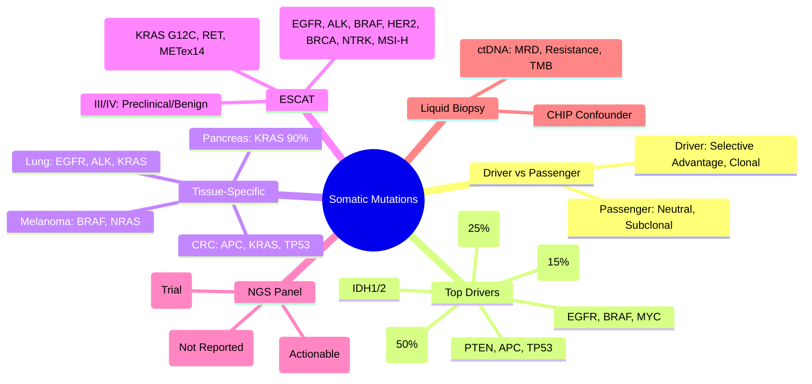

> [!tip] **FCPS/MRCP Priority: HIGH**
> **Somatic Mutations = Acquired, Not Inherited**; **Driver Mutations** confer selective advantage; **Passenger Mutations** = neutral; **Key Drivers**: TP53 (50% cancers), KRAS (25%), PIK3CA (15%), EGFR, BRAF, MYC, PTEN, APC, CTNNB1; **Tissue-Specific**: KRAS (Pancreas 90%, CRC 40%, Lung 30%), EGFR (Lung 15%), BRAF (Melanoma 50%, CRC 10%), IDH1/2 (Glioma, AML), TERT (Melanoma, Glioma); **Actionability**: ESCAT I-IV classification; **NGS Panels** standard.

---

## 1. 1. Learning Objectives
By the end of this note you should be able to:
- [ ] Distinguish **driver vs passenger mutations**
- [ ] Identify **top 10 driver genes** across cancers
- [ ] Apply **tissue-specific mutation patterns** for clinical decision-making
- [ ] Interpret **ESCAT classification** for actionability
- [ ] Apply **NGS panel** interpretation in clinical practice

---

## 2. 2. Driver vs Passenger Mutations

| Feature | Driver Mutation | Passenger Mutation |
|---------|-----------------|-------------------|
| **Definition** | Confers selective growth advantage | Neutral, no selective advantage |
| **Frequency** | Recurrent in cancers | Random, low frequency |
| **Functional Impact** | Alters protein function/pathway | No functional consequence |
| **Clonality** | Often clonal/truncal | Often subclonal |
| **Therapeutic Relevance** | **Actionable targets** | Not targetable |
| **Examples** | TP53, KRAS, EGFR, BRAF, PIK3CA | Synonymous, deep intronic, non-functional indels |

> **Rule**: **Driver mutations** = 2-8 per tumour; **Passenger mutations** = thousands (TMB dependent)

---

## 3. 3. Top 10 Pan-Cancer Driver Genes

| Gene | Alteration Type | Frequency (Pan-Cancer) | Key Cancers |
|------|-----------------|------------------------|-------------|
| **TP53** | **LOF (Missense, Nonsense, Splice)** | **~50%** | **Universal** (Ovarian 96%, Serous Ovarian, HNSCC, Lung, Breast, CRC) |
| **KRAS** | **Gain-of-Function (G12, G13, Q61)** | **~25%** | Pancreas (90%), CRC (40%), Lung Adeno (30%), Biliary |
| **PIK3CA** | **Gain-of-Function (E542K, E545K, H1047R)** | **~15%** | Breast (40%), Endometrial, CRC, HNSCC |
| **PTEN** | **LOF (Deletion, Mutation)** | **~10%** | Endometrial, Prostate, Glioblastoma, Breast |
| **APC** | **LOF (Truncating)** | **~10%** | CRC (80%), Desmoid |
| **EGFR** | **Amplification, Mutation (Exon 19, 21)** | **~8%** | Lung Adeno (15%), Glioblastoma |
| **BRAF** | **Gain-of-Function (V600E)** | **~7%** | Melanoma (50%), CRC (10%), Thyroid, Hairy Cell Leuk |
| **MYC** | **Amplification, Translocation** | **~7%** | Burkitt (t(8;14)), SCLC, Neuroblastoma, Breast |
| **CTNNB1 (β-catenin)** | **Gain-of-Function (Exon 3)** | **~5%** | HCC, Endometrial, CRC (APC WT), Desmoid |
| **IDH1/2** | **Gain-of-Function (R132, R172)** | **~3%** | Glioma (80%), AML (20%), Chondrosarcoma |

---

## 4. 4. Tissue-Specific Driver Patterns

| Cancer | Top Drivers | Clinical Relevance |
|--------|-------------|-------------------|
| **Pancreatic Ductal Adenocarcinoma** | **KRAS (90%)**, TP53 (75%), CDKN2A (90%), SMAD4 (55%) | KRAS → No targeted therapy yet |
| **Colorectal** | **APC (80%)**, KRAS (40%), TP53 (60%), PIK3CA (15%), BRAF (10%) | KRAS/NRAS → Anti-EGFR decision |
| **Lung Adenocarcinoma** | **EGFR (15% West, 50% Asia)**, KRAS (30%), ALK (5%), ROS1 (2%), MET (3%) | EGFR/ALK/ROS1 → TKIs |
| **Melanoma** | **BRAF V600E (50%)**, NRAS (25%), NF1 (15%), TERT Promoter (80%) | BRAF/MEK inhibitors, ICIs |
| **Breast (ER+)** | PIK3CA (40%), TP53 (30%), GATA3, CDH1 | PIK3CA → Alpelisib |
| **Glioblastoma** | TERT (80%), EGFRamp (40%), PTEN (40%), TP53 (30%), IDH1 (10%) | IDH → Prognosis |
| **Hepatocellular** | CTNNB1 (30%), TP53 (30%), TERT Promoter (60%) | Surveillance |
| **Ovarian (HGSC)** | TP53 (96%), BRCA1/2 (20%), CCNE1 amp | HRD → PARPi |
| **Endometrial** | PTEN (80%), PIK3CA (50%), ARID1A, CTNNB1, MMRd | MMRd → ICI |
| **AML** | NPM1 (30%), FLT3-ITD (25%), DNMT3A, IDH1/2, CEBPA | FLT3 → Midostaurin/Gilteritinib |

---

## 5. 5. Oncogenes vs Tumour Suppressor Genes

| Feature | **Oncogenes (Gain-of-Function)** | **Tumour Suppressor Genes (Loss-of-Function)** |
|---------|----------------------------------|-----------------------------------------------|
| **Normal Role** | Promote growth/survival | Inhibit growth, Promote death, Repair DNA |
| **Mutation Effect** | **Activating** (Gain-of-Function) | **Inactivating** (Loss-of-Function) |
| **Alleles** | **One allele sufficient** (Dominant) | **Two hits needed** (Knudson) |
| **Examples** | **RAS, MYC, EGFR, BRAF, PIK3CA, HER2, BCR-ABL** | **TP53, RB1, PTEN, APC, VHL, NF1, WT1, BRCA1/2** |
| **Therapeutic Approach** | **Inhibit** (TKIs, Antibodies) | **Restore** (Harder), Synthetic Lethality |

---

## 6. 6. Actionability Classification (ESCAT / ESMO)

| Tier | Definition | Examples |
|------|------------|----------|
| **I** | **Ready for Routine Use** (Approved drug, improves outcome) | EGFRm → EGFR TKI, ALK+ → ALK TKI, BRAF V600E → BRAF/MEKi, HER2+ → Anti-HER2, BRCA → PARPi, NTRK → TRKi, MSI-H → ICI |
| **II** | **Clinical Trial Recommended** (Strong evidence, investigational) | KRAS G12C → Sotorasib/Adagrasib, RET → Selpercatinib, METex14 → Capmatinib, FGFR → Erdafitinib |
| **III** | **Preclinical/Weak Evidence** | TP53 mut, MYC amp, CCND1 amp, CCNE1 amp |
| **IV** | **No Evidence / Benign** | Passenger mutations, VUS |

---

## 7. 7. NGS Panel Interpretation (Clinical)

| Step | Action |
|------|--------|
| **1. Variant Calling** | SNVs, Indels, CNV, Fusions, TMB, MSI |
| **2. Filter** | VAF ≥5% (somatic), Depth ≥500x, Remove germline (matched normal) |
| **3. Annotation** | COSMIC, ClinVar, OncoKB, CIViC, ESCAT |
| **4. Classification** | **Tier I: ESCAT I/II** → Report actionable; **Tier II: ESCAT III** → Clinical trial; **Tier III: ESCAT IV/VUS** → Not reported/Research |
| **5. Reporting** | **Actionable (Tier I/II)**, **Prognostic**, **Germline suspicion** |

---

## 8. 8. Tumour Mutational Burden (TMB) & MSI

| Biomarker | Definition | Clinical Use |
|-----------|------------|--------------|
| **TMB** | **Mutations/Mb** (coding) | **High TMB (≥10 mut/Mb)** → ICI response (TMB-H) |
| **MSI-H/dMMR** | **Mismatch Repair Deficiency** | **Pembrolizumab** (Tumour-agnostic), Lynch screening |
| **TMB-H + MSI-H** | **Overlap** | **Strongest ICI Predictor** |
| **POLE/POLD1 mut** | **Ultra-hypermutated** | **TMB-H, MSI-H, Excellent ICI Response** |

---

## 9. 9. Liquid Biopsy (ctDNA)

| Application | Detail |
|-------------|--------|
| **Detection** | Mutations in plasma ctDNA (0.1-1% VAF) |
| **Uses** | **MRD** (Post-surgery), **Resistance Monitoring** (EGFR T790M, ESR1, KRAS), **Tumour Fraction**, **TMB**, **Early Detection** (Screening) |
| **Limitations** | **Sensitivity** (Stage-dependent), **Clonal Haematopoiesis (CHIP)**, **False Positives** |

---

## 10. 10. FCPS/MRCP High-Yield Summary

| Topic | Key Points |
|-------|------------|
| **Driver vs Passenger** | Driver = Selective advantage, Clonal, Actionable; Passenger = Neutral, Subclonal |
| **Top Drivers** | TP53 (50%), KRAS (25%), PIK3CA (15%), PTEN, APC, EGFR, BRAF, MYC, IDH1/2 |
| **Tissue-Specific** | Pancreas: KRAS 90%; CRC: APC/KRAS/TP53; Lung: EGFR/KRAS/ALK; Melanoma: BRAF/NRAS |
| **ESCAT I** | EGFR, ALK, ROS1, BRAF, HER2, BRCA, NTRK, MSI-H → **Standard of Care** |
| **ESCAT II** | KRAS G12C, RET, METex14, FGFR, NTRK → **Clinical Trial** |
| **TMB-H** | ≥10 mut/Mb → ICI Benefit (Pembrolizumab) |
| **MSI-H** | dMMR → Pembrolizumab (Tumour-agnostic) |
| **ESCAT Classification** | I (Routine), II (Trial), III (Preclinical), IV (Benign) |
| **Liquid Biopsy** | ctDNA for MRD, Resistance (EGFR T790M, ESR1), Tumour Fraction |

---

## 11. 11. Viva Questions (MRCP PACES / FCPS)

| Question | Expected Answer |
|----------|-----------------|
| **Driver vs Passenger Mutation — Difference?** | **Driver**: Selective advantage, clonal, functional impact; **Passenger**: Neutral, no selective advantage. |
| **Top 5 Driver Genes in Cancer?** | **TP53, KRAS, PIK3CA, PTEN, APC** (also EGFR, BRAF, MYC, IDH1/2). |
| **KRAS Mutations — Cancers, Codons?** | **Pancreas (90%), CRC (40%), Lung (30%)**; **Codons: G12 (80%), G13, Q61**. |
| **ESCAT Tier I — Examples?** | **EGFRm → EGFR TKI, ALK+ → ALK TKI, BRAF V600E → BRAF/MEKi, HER2+ → Anti-HER2, BRCA → PARPi, MSI-H → Pembrolizumab**. |
| **TMB-H Definition?** | **≥10 mutations/Mb** (coding) → Pembrolizumab approved (KEYNOTE-158). |
| **Liquid Biopsy — Uses, Limitations?** | **MRD, Resistance (EGFR T790M, ESR1), Tumour Fraction**; **Limitations: Sensitivity (Stage), CHIP, False +ve**. |
| **Oncogene vs TSG — Knudson?** | **Oncogene: 1 hit (Gain-of-Function)**; **TSG: 2 hits (Loss-of-Function)** — Knudson Two-Hit. |
| **ESCAT Tier II — Examples?** | **KRAS G12C → Sotorasib, RET → Selpercatinib, METex14 → Capmatinib, FGFR → Erdafitinib**. |
| **TMB-H + MSI-H Overlap?** | **Strongest ICI Predictor**; **POLE/POLD1 mut → Ultra-hypermutated, TMB-H, MSI-H**. |
| **NGS Panel — Reporting Tiers?** | **Tier I (ESCAT I/II): Actionable**; **Tier II (ESCAT III): Trial**; **Tier III (ESCAT IV/VUS): Not Routine**. |

---

## 12. 12. Confusions & Mnemonics

| Confusion | Clarification |
|-----------|---------------|
| **Driver vs Passenger** | Driver = Selective advantage, clonal, functional; Passenger = neutral, subclonal |
| **ESCAT I vs II** | I = Approved/Routine; II = Strong evidence, Trial recommended |
| **TMB vs MSI** | TMB = Total mutational load; MSI = MMR deficiency subset; Overlap but distinct |
| **CHIP vs Tumour ctDNA** | CHIP = Age-related haematopoietic mutations (DNMT3A, TET2, ASXL1) — Not tumour |
| **KRAS G12C vs Other KRAS** | G12C = Specific inhibitor (Sotorasib, Adagrasib); Other KRAS = No approved targeted therapy |
| **ESCAT III vs IV** | III = Preclinical rationale; IV = No evidence / Benign / VUS |

**Mnemonic: SOMATIC-DRIVERS**
- **S**omatic: **Acquired, Not Inherited**
- **O**ncogenes: **Gain-of-Function** (RAS, MYC, EGFR, BRAF)
- **M**ajor Drivers: **TP53 (50%), KRAS (25%), PIK3CA (15%), PTEN, APC**
- **A**ctionability: **ESCAT I (Routine), II (Trial), III (Preclinical), IV (Benign)**
- **T**issue-Specific: **Pancreas KRAS 90%, CRC APC/KRAS, Lung EGFR/ALK, Melanoma BRAF**
- **I**C50/ESCAT: **Tier I = Routine, Tier II = Trial, Tier III = Research**
- **C**lonality: **Driver = Clonal/Truncal; Passenger = Subclonal**
- **D**river vs Passenger: **Driver = Functional + Clonal; Passenger = Neutral**
- **R**esistance: **On-treatment NGS → EGFR T790M, ESR1, KRAS**
- **I**HH/ESCAT: **ESCAT I-IV Classification for Actionability**
- **V**AF: **≥5% Somatic, Depth ≥500x, Matched Normal**
- **E**SCAT: **I=Routine, II=Trial, III=Preclinical, IV=Benign**
- **S**ignature: **HRD, TMB, MSI, POLE** → Biomarkers

---

## 13. 13. Mind Map

---

## 14. 14. One-Page Revision Card

| Domain | Key Points |
|--------|------------|
| **Driver vs Passenger** | Driver: Selective advantage, clonal, functional; Passenger: Neutral, subclonal |
| **Top 10 Drivers** | TP53 (50%), KRAS (25%), PIK3CA (15%), PTEN, APC, EGFR, BRAF, MYC, IDH1/2 |
| **Tissue Patterns** | Pancreas KRAS 90%; CRC APC/KRAS; Lung EGFR/ALK/KRAS; Melanoma BRAF/NRAS |
| **ESCAT** | I: Routine (EGFR, ALK, BRAF, HER2, BRCA, NTRK, MSI-H); II: Trial (KRAS G12C, RET) |
| **TMB-H** | ≥10 mut/Mb → Pembrolizumab; MSI-H → Pembrolizumab |
| **Liquid Biopsy** | ctDNA: MRD, Resistance (EGFR T790M, ESR1), Tumour Fraction |
| **NGS Reporting** | Tier I (ESCAT I/II), Tier II (ESCAT III), Tier III (IV/VUS) |

---

## 15. 15. Spaced Repetition Trackers

| Review Interval | Date Completed | Confidence (1-5) | Notes |
|-----------------|----------------|------------------|-------|
| 24 hours | | | |
| 7 days | | | |
| 15 days | | | |
| 30 days | | | |
| 90 days | | | |

---

## 16. 16. Self-Test Scorecard

| Section | Score /5 | Last Attempt |
|---------|----------|--------------|
| Driver vs Passenger | | |
| Top 10 Drivers | | |
| Tissue-Specific Patterns | | |
| ESCAT Classification | | |
| NGS Panel Interpretation | | |
| Liquid Biopsy Uses | | |
| TMB/MSI | | |
| Oncogene vs TSG | | |

---

## 17. 17. Local Navigation
- **Parent Heading**: [[../Oncology|Oncology]]
- **Chapter Map": [[../Davidson Chapter 7 - Oncology Hierarchy|Oncology Hierarchy]]
- **Chapter MOC": [[../Oncology MOC|Oncology MOC]]
- **Drug Reference": [[../../Clinical Therapeutics and Good Prescribing|Drugs]]
- **Related": [[Oncogenes]], [[Tumour Suppressor Genes]], [[DNA Repair Genes]], [[Epigenetics]], [[Viral Oncogenesis]], [[Chemical Carcinogens]], [[Knudson Two-Hit]], [[Warburg Effect]]

---

# FCPS/MRCP Exam Extras

## 18. 18. MCQs (10)

**1.** Regarding Somatic Mutations & Driver Genes (Driver vs Passenger), which statement is correct?
   A. Driver = Selective advantage, Clonal, Actionable
   B. Driver - alternative approach
   C. Empirical management only
   D. Watch and wait
   - **Answer: A** — Driver = Selective advantage, Clonal, Actionable; Passenger = Neutral, Subclonal

**2.** Regarding Somatic Mutations & Driver Genes (Top Drivers), which statement is correct?
   A. TP53 (50%), KRAS (25%), PIK3CA (15%), PTEN, APC, EGFR, BRAF, MYC, IDH1/2
   B. TP53 - alternative approach
   C. Empirical management only
   D. Watch and wait
   - **Answer: A** — TP53 (50%), KRAS (25%), PIK3CA (15%), PTEN, APC, EGFR, BRAF, MYC, IDH1/2

**3.** Regarding Somatic Mutations & Driver Genes (Tissue-Specific), which statement is correct?
   A. Pancreas: KRAS 90%
   B. Pancreas: - alternative approach
   C. Empirical management only
   D. Watch and wait
   - **Answer: A** — Pancreas: KRAS 90%; CRC: APC/KRAS/TP53; Lung: EGFR/KRAS/ALK; Melanoma: BRAF/NRAS

**4.** Regarding Somatic Mutations & Driver Genes (ESCAT I), which statement is correct?
   A. EGFR, ALK, ROS1, BRAF, HER2, BRCA, NTRK, MSI-H → **Standard of Care**
   B. EGFR, - alternative approach
   C. Empirical management only
   D. Watch and wait
   - **Answer: A** — EGFR, ALK, ROS1, BRAF, HER2, BRCA, NTRK, MSI-H → **Standard of Care**

**5.** Regarding Somatic Mutations & Driver Genes (ESCAT II), which statement is correct?
   A. KRAS G12C, RET, METex14, FGFR, NTRK → **Clinical Trial**
   B. KRAS - alternative approach
   C. Empirical management only
   D. Watch and wait
   - **Answer: A** — KRAS G12C, RET, METex14, FGFR, NTRK → **Clinical Trial**

**6.** Regarding Somatic Mutations & Driver Genes (TMB-H), which statement is correct?
   A. ≥10 mut/Mb → ICI Benefit (Pembrolizumab)
   B. ≥10 - alternative approach
   C. Empirical management only
   D. Watch and wait
   - **Answer: A** — ≥10 mut/Mb → ICI Benefit (Pembrolizumab)

**7.** Regarding Somatic Mutations & Driver Genes (MSI-H), which statement is correct?
   A. dMMR → Pembrolizumab (Tumour-agnostic)
   B. dMMR - alternative approach
   C. Empirical management only
   D. Watch and wait
   - **Answer: A** — dMMR → Pembrolizumab (Tumour-agnostic)

**8.** Regarding Somatic Mutations & Driver Genes (ESCAT Classification), which statement is correct?
   A. I (Routine), II (Trial), III (Preclinical), IV (Benign)
   B. I - alternative approach
   C. Empirical management only
   D. Watch and wait
   - **Answer: A** — I (Routine), II (Trial), III (Preclinical), IV (Benign)

**9.** Regarding Somatic Mutations & Driver Genes (Liquid Biopsy), which statement is correct?
   A. ctDNA for MRD, Resistance (EGFR T790M, ESR1), Tumour Fraction
   B. ctDNA - alternative approach
   C. Empirical management only
   D. Watch and wait
   - **Answer: A** — ctDNA for MRD, Resistance (EGFR T790M, ESR1), Tumour Fraction

**10.** Regarding Somatic Mutations & Driver Genes (FCPS/MRCP High Yield - Somatic Mutations), which statement is correct?
   - A. FCPS/MRCP High Yield - Somatic Mutations: Driver vs Passenger
   - B. Empirical approach without specific indication
   - C. Used only in research protocols
   - D. Not relevant in current practice
   - **Answer: A** — FCPS/MRCP High Yield - Somatic Mutations: Driver vs Passenger

## 19. 19. SBA Questions (10)

**1.** A 55-year-old presents with classic features. MDT discussion recommends:
   - A. Driver = Selective advantage, Clonal, Actionable
   - B. Driver (less specific)
   - C. Empirical broad approach
   - D. No intervention required
   - **Answer: A** — first-line: Driver = Selective advantage, Clonal, Actionable; Passenger = Neutral, Subclonal

**2.** On staging workup, the patient is found to be [Stage X]. Best management is:
   - A. TP53 (50%), KRAS (25%), PIK3CA (15%), PTEN, APC, EGFR, BRAF, MYC, IDH1/2
   - B. TP53 (less specific)
   - C. Empirical broad approach
   - D. No intervention required
   - **Answer: A** — stage-specific: TP53 (50%), KRAS (25%), PIK3CA (15%), PTEN, APC, EGFR, BRAF, MYC, IDH1/2

**3.** Following first-line treatment, the patient develops [complication]. Best next step:
   - A. Pancreas: KRAS 90%
   - B. Pancreas: (less specific)
   - C. Empirical broad approach
   - D. No intervention required
   - **Answer: A** — complication: Pancreas: KRAS 90%; CRC: APC/KRAS/TP53; Lung: EGFR/KRAS/ALK; Melanoma: BRAF/NRAS

**4.** The patient asks about prognosis. Most appropriate response based on:
   - A. EGFR, ALK, ROS1, BRAF, HER2, BRCA, NTRK, MSI-H → **Standard of Care**
   - B. EGFR, (less specific)
   - C. Empirical broad approach
   - D. No intervention required
   - **Answer: A** — prognosis: EGFR, ALK, ROS1, BRAF, HER2, BRCA, NTRK, MSI-H → **Standard of Care**

**5.** A 65-year-old with relevant risk factors should be screened with:
   - A. KRAS G12C, RET, METex14, FGFR, NTRK → **Clinical Trial**
   - B. KRAS (less specific)
   - C. Empirical broad approach
   - D. No intervention required
   - **Answer: A** — screening: KRAS G12C, RET, METex14, FGFR, NTRK → **Clinical Trial**

**6.** The most clinically important biomarker/molecular test is:
   - A. ≥10 mut/Mb → ICI Benefit (Pembrolizumab)
   - B. ≥10 (less specific)
   - C. Empirical broad approach
   - D. No intervention required
   - **Answer: A** — biomarker: ≥10 mut/Mb → ICI Benefit (Pembrolizumab)

**7.** The standard chemotherapy/regimen of choice is:
   - A. dMMR → Pembrolizumab (Tumour-agnostic)
   - B. dMMR (less specific)
   - C. Empirical broad approach
   - D. No intervention required
   - **Answer: A** — chemo: dMMR → Pembrolizumab (Tumour-agnostic)

**8.** The role of surgery in this case is:
   - A. I (Routine), II (Trial), III (Preclinical), IV (Benign)
   - B. I (less specific)
   - C. Empirical broad approach
   - D. No intervention required
   - **Answer: A** — surgery: I (Routine), II (Trial), III (Preclinical), IV (Benign)

**9.** The recommended surveillance/follow-up protocol is:
   - A. ctDNA for MRD, Resistance (EGFR T790M, ESR1), Tumour Fraction
   - B. ctDNA (less specific)
   - C. Empirical broad approach
   - D. No intervention required
   - **Answer: A** — follow-up: ctDNA for MRD, Resistance (EGFR T790M, ESR1), Tumour Fraction

**10.** A clinician encounters this presentation. Best approach:
   - A. FCPS/MRCP High Yield - Somatic Mutations: Driver vs Passenger
   - B. Watch and wait approach
   - C. Empirical broad treatment
   - D. No intervention required
   - **Answer: A** — FCPS/MRCP High Yield - Somatic Mutations: Driver vs Passenger

## 20. 20. Flashcards

**Q1:** Driver vs Passenger?
**A1:** Driver = Selective advantage, Clonal, Actionable; Passenger = Neutral, Subclonal

**Q2:** Top Drivers?
**A2:** TP53 (50%), KRAS (25%), PIK3CA (15%), PTEN, APC, EGFR, BRAF, MYC, IDH1/2

**Q3:** Tissue-Specific?
**A3:** Pancreas: KRAS 90%; CRC: APC/KRAS/TP53; Lung: EGFR/KRAS/ALK; Melanoma: BRAF/NRAS

**Q4:** ESCAT I?
**A4:** EGFR, ALK, ROS1, BRAF, HER2, BRCA, NTRK, MSI-H → Standard of Care

**Q5:** ESCAT II?
**A5:** KRAS G12C, RET, METex14, FGFR, NTRK → Clinical Trial

**Q6:** TMB-H?
**A6:** ≥10 mut/Mb → ICI Benefit (Pembrolizumab)

**Q7:** MSI-H?
**A7:** dMMR → Pembrolizumab (Tumour-agnostic)

**Q8:** ESCAT Classification?
**A8:** I (Routine), II (Trial), III (Preclinical), IV (Benign)

## 21. 21. Answer Key with Explanations

| # | MCQ | Topic | Explanation |
|---|-----|-------|-------------|
| 1 | A | Driver vs Passenger | Driver = Selective advantage, Clonal, Actionable; Passenger = Neutral, Subclonal |
| 2 | A | Top Drivers | TP53 (50%), KRAS (25%), PIK3CA (15%), PTEN, APC, EGFR, BRAF, MYC, IDH1/2 |
| 3 | A | Tissue-Specific | Pancreas: KRAS 90%; CRC: APC/KRAS/TP53; Lung: EGFR/KRAS/ALK; Melanoma: BRAF/NRAS |
| 4 | A | ESCAT I | EGFR, ALK, ROS1, BRAF, HER2, BRCA, NTRK, MSI-H → Standard of Care |
| 5 | A | ESCAT II | KRAS G12C, RET, METex14, FGFR, NTRK → Clinical Trial |
| 6 | A | TMB-H | ≥10 mut/Mb → ICI Benefit (Pembrolizumab) |
| 7 | A | MSI-H | dMMR → Pembrolizumab (Tumour-agnostic) |
| 8 | A | ESCAT Classification | I (Routine), II (Trial), III (Preclinical), IV (Benign) |
| 9 | A | Liquid Biopsy | ctDNA for MRD, Resistance (EGFR T790M, ESR1), Tumour Fraction |
| 10 | A | FCPS/MRCP High Yield - Somatic Mutations | FCPS/MRCP High Yield - Somatic Mutations: Driver vs Passenger |

| # | SBA | Topic | Explanation |
|---|-----|-------|-------------|
| 1 | A | Driver vs Passenger | Driver = Selective advantage, Clonal, Actionable; Passenger = Neutral, Subclonal |
| 2 | A | Top Drivers | TP53 (50%), KRAS (25%), PIK3CA (15%), PTEN, APC, EGFR, BRAF, MYC, IDH1/2 |
| 3 | A | Tissue-Specific | Pancreas: KRAS 90%; CRC: APC/KRAS/TP53; Lung: EGFR/KRAS/ALK; Melanoma: BRAF/NRAS |
| 4 | A | ESCAT I | EGFR, ALK, ROS1, BRAF, HER2, BRCA, NTRK, MSI-H → Standard of Care |
| 5 | A | ESCAT II | KRAS G12C, RET, METex14, FGFR, NTRK → Clinical Trial |
| 6 | A | TMB-H | ≥10 mut/Mb → ICI Benefit (Pembrolizumab) |
| 7 | A | MSI-H | dMMR → Pembrolizumab (Tumour-agnostic) |
| 8 | A | ESCAT Classification | I (Routine), II (Trial), III (Preclinical), IV (Benign) |
| 9 | A | Liquid Biopsy | ctDNA for MRD, Resistance (EGFR T790M, ESR1), Tumour Fraction |

| 11 | A | FCPS/MRCP High Yield - Somatic Mutations | FCPS/MRCP High Yield - Somatic Mutations: Driver vs Passenger |
## 22. 22. Local Navigation

- **Parent Heading Hub**: [[../../Principles of Cancer Management|Principles of Cancer Management]]
- **Chapter Map**: [[../../Davidson Chapter 7 - Oncology Hierarchy|Oncology Hierarchy]]
- **Chapter MOC**: [[../../Oncology MOC|Oncology MOC]]
- **Drug Reference**: [[../../../Clinical Therapeutics and Good Prescribing|Drugs]]
---

> Auto-generated study sections for "Principles of Cancer Management" — Ch 8: Oncology.

## Flashcards (1 generated)

- Q: What is the definition of Principles of Cancer Management?
  A: Somatic Mutations = Acquired, Not Inherited; Driver Mutations confer selective advantage; Passenger Mutations = neutral; Key Drivers: TP53 (50% cancers), KRAS (25%), PIK3CA (15%), EGFR, BRAF, MYC, PTEN, APC, CTNNB1; Tissue-Specific: KRAS (Pancreas 90%, CRC 40%, Lung 30%), EGFR (Lung 15%), BRAF (Melanoma 50%, CRC 10%), IDH1/2 (Glioma, AML), TERT (Melanoma, Glioma); Actionability: ESCAT I-IV classif

## MCQs (1 generated)

1. **Which of the following best describes Principles of Cancer Management?**
   A. **Somatic Mutations = Acquired, Not Inherited; Driver Mutations confer selective advantage; Passenger Mutations = neutral; Key Drivers: TP53 (50% cancers), KRAS (25%), PIK3CA (15%), EGFR, BRAF, MYC, PTE**
   B. An unrelated condition not matching the clinical picture of Principles of Cancer Management
   C. A complication seen late in the disease course of Principles of Cancer Management
   D. A condition that mimics Principles of Cancer Management but has a different underlying cause

## SBA Questions (1 generated)

1. A patient with suspected Principles of Cancer Management presents with: I — Ready for Routine Use (Approved drug, improves outcome); II — Clinical Trial Recommended (Strong evidence, investigational); III — Preclinical/Weak Evidence. What is the most likely diagnosis?
   A. **Principles of Cancer Management**
   B. A condition that mimics Principles of Cancer Management but is not the same entity
   C. A complication of Principles of Cancer Management rather than the primary diagnosis
   D. An unrelated condition in the same clinical category as Principles of Cancer Management

## PasTest Scenario SBAs (Clinical Vignettes)

> **Auto-generated PasTest/Mediscope-style scenario SBAs** grounded in the authored source. Each scenario tests a real clinical fact (triad, specific sign, contraindication, trial, first-line Rx) extracted from the topic. *Source: Ch 8: Oncology — Somatic Mutations & Driver Genes*

**Q1.** Which of the following features is most specific or characteristic of Somatic Mutations & Driver Genes?

  - **A.** KRAS G12C vs Other KRAS
  - **B.** A feature common to many acute inflammatory conditions
  - **C.** A non-specific sign that does not localise the diagnosis
  - **D.** An investigation finding rather than a clinical feature

  > **Answer: A** — KRAS G12C vs Other KRAS
  >
  > *Source:* Tumour ctDNA** | CHIP = Age-related haematopoietic mutations (DNMT3A, TET2, ASXL1) — Not tumour |
| **KRAS G12C vs Other KRAS** | G12C = Specific inhibitor (Sotorasib, Adagrasib); Other KRAS = No appr

