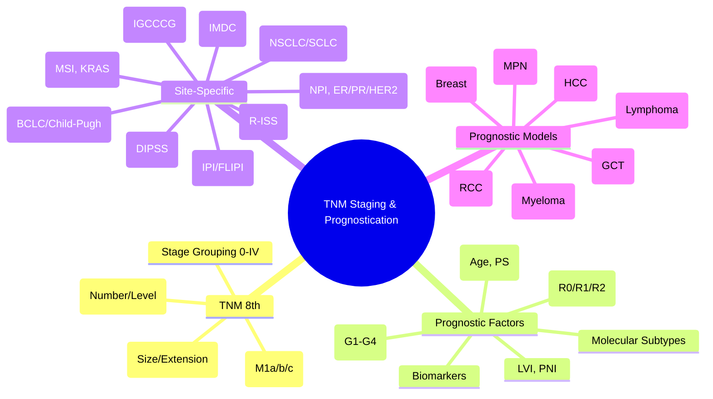

> [!tip] **FCPS/MRCP Priority: HIGH**
> **TNM 8th Edition (AJCC/UICC)**: **T** = Primary Tumour (Size, Extension), **N** = Regional Lymph Nodes, **M** = Distant Metastasis; **Stage Grouping**: 0, I, II, III, IV (A/B/C Substages); **Prognostic Factors**: Grade (Differentiation), LVI, PNI, Margins, Biomarkers, Molecular Subtypes; **Site-Specific Staging** for Breast, Lung, Colorectal, Gastric, Gynae, H&N, GU, Sarcoma, CNS; **Prognostic Models**: NPI (Breast), IPI (Lymphoma), DIPSS (MPN), IMDC (RCC), IGCCCG (GCT), ISS/R-ISS (Myeloma), Child-Pugh (HCC).

---

## 1. 1. Learning Objectives
By the end of this note you should be able to:
- [ ] Apply **TNM 8th Edition** classification (T, N, M categories)
- [ ] Perform **Stage Grouping** (0-IV) for major cancers
- [ ] Identify **key prognostic factors** beyond TNM (Grade, LVI, PNI, Margins, Biomarkers)
- [ ] Apply **site-specific staging** for major cancer types
- [ ] Use **prognostic models** (NPI, IPI, DIPSS, IMDC, IGCCCG, R-ISS) in clinical practice

---

## 2. 2. TNM 8th Edition Classification

### 1. T Category (Primary Tumour)

| T Category | General Definition |
|------------|-------------------|
| **Tx** | Primary tumour cannot be assessed |
| **T0** | No evidence of primary tumour |
| **Tis** | Carcinoma in situ (Pre-invasive) |
| **T1, T2, T3, T4** | Increasing size/extension (Site-specific) |

**Modifiers:**
- **(m)** Multiple tumours
- **(s)** Sentinel node mets detected by SLNB only
- **(sn)** Sentinel node mets detected by SLNB

### 2. N Category (Regional Lymph Nodes)

| N Category | Definition |
|------------|------------|
| **Nx** | Regional nodes cannot be assessed |
| **N0** | No regional lymph node metastasis |
| **N1, N2, N3** | Increasing nodal involvement (Site-specific: Number, Size, Laterality, Level) |

**Modifiers:**
- **(sn)** Sentinel node biopsy
- **(f)** Fine needle aspiration/Core biopsy

### 3. M Category (Distant Metastasis)

| M Category | Definition |
|------------|------------|
| **M0** | No distant metastasis |
| **M1** | Distant metastasis present |
| **M1a, M1b, M1c** | Site-specific subcategories (e.g., M1a = Non-regional nodes/Contralateral lung; M1b = Single organ; M1c = Multiple organs) |

---

## 3. 3. Stage Grouping (General)

| Stage | T | N | M | Description |
|-------|---|---|---|-------------|
| **0** | Tis | N0 | M0 | Carcinoma in situ |
| **I** | T1 | N0 | M0 | Early, Localised |
| **II** | T2-T3 | N0 | M0 | Locally Advanced (No nodes) |
| **III** | T1-T3 | N1-N3 | M0 | Regional Spread |
| | T4 | N0-N2 | M0 | |
| **IV** | Any T | Any N | M1 | Distant Metastasis |

**Substages:** A, B, C used for finer granularity (e.g., IIIA, IIIB, IIIC)

---

## 4. 4. Key Prognostic Factors Beyond TNM

| Factor | Description | Impact |
|--------|-------------|--------|
| **Grade (Differentiation)** | **G1 (Well)**, **G2 (Moderate)**, **G3 (Poor)**, **G4 (Undifferentiated)** | **G3/G4 = Worse Prognosis** |
| **Lymphovascular Invasion (LVI)** | Tumour cells in lymphatics/blood vessels | **Strong Adverse Factor** (Upstages in many systems) |
| **Perineural Invasion (PNI)** | Tumour cells tracking along nerves | **Adverse** (Local Recurrence, Pain) |
| **Surgical Margins** | **R0 (Negative)**, **R1 (Microscopic +)**, **R2 (Macroscopic +)** | **R1/R2 = Higher Recurrence** |
| **Biomarkers** | **ER/PR/HER2** (Breast), **MSI/MMR** (CRC), **KRAS/NRAS/BRAF** (CRC/Lung), **EGFR/ALK** (Lung), **PSA** (Prostate), **AFP** (HCC) | **Guide Therapy & Prognosis** |
| **Molecular Subtypes** | **Luminal A/B, HER2+, TNBC** (Breast); **CMS1-4** (CRC); **TCGA** (Gastric, Endometrial) | **Independent Prognostic Value** |
| **Host Factors** | **Age**, **Performance Status (ECOG/KPS)**, **Comorbidities (Charlson, CCI)**, **Nutritional Status** | **Independent Prognostic Value** |

---

## 5. 5. Site-Specific Staging Highlights

### 1. Breast Cancer (AJCC 8th)

| Stage | T | N | M | Key Prognostic Factors |
|-------|---|---|---|------------------------|
| **IA** | T1 | N0 | M0 | ER/PR/HER2, Grade, Ki-67, Oncotype DX |
| **IB** | T0/T1 | N1mi | M0 | |
| **IIA** | T0/T1 | N1 | M0 | |
| | T2 | N0 | M0 | |
| **IIB** | T2 | N1 | M0 | |
| | T3 | N0 | M0 | |
| **IIIA** | T0-T3 | N2 | M0 | |
| | T3 | N1 | M0 | |
| **IIIB** | T4 | N0-N2 | M0 | |
| **IIIC** | Any T | N3 | M0 | |
| **IV** | Any T | Any N | M1 | |

**Prognostic Model:** **Nottingham Prognostic Index (NPI)** = Size (cm) + Grade (1-3) + Nodes (1-3)

### 2. Lung Cancer (AJCC 8th)

| NSCLC Stage | T | N | M |
|-------------|---|---|---|
| **IA1** | T1a(≤1cm) | N0 | M0 |
| **IA2** | T1b(1-2cm) | N0 | M0 |
| **IA3** | T1c(2-3cm) | N0 | M0 |
| **IB** | T2a(3-4cm) | N0 | M0 |
| **IIA** | T2b(4-5cm) | N0 | M0 |
| **IIB** | T1-2a | N1 | M0 / T3(5-7cm) N0 M0 |
| **IIIA** | T1-2 | N2 M0 / T3 N1 M0 / T4 N0-1 M0 |
| **IIIB** | T3-4 N2 M0 / T1-2 N3 M0 |
| **IIIC** | T3-4 N3 M0 |
| **IVA** | Any T Any N M1a/M1b |
| **IVB** | Any T Any N M1c |

**SCLC:** **Limited Stage** (One hemithorax) vs **Extensive Stage** (Beyond)

### 3. Colorectal Cancer (AJCC 8th)

| Stage | T | N | M |
|-------|---|---|---|
| **I** | T1-T2 | N0 | M0 |
| **IIA** | T3 | N0 | M0 |
| **IIB** | T4a | N0 | M0 |
| **IIC** | T4b | N0 | M0 |
| **IIIA** | T1-T2 | N1/N1c | M0 |
| **IIIB** | T3-T4a | N1/N2 | M0 |
| **IIIC** | T4b | N1-N2 | M0 / Any T N2 M0 |
| **IV** | Any T Any N M1 | M1a (1 site), M1b (2+ sites) |

**Key Prognostic:** **MSI-H/dMMR** (Stage II: Good Prognosis, No Adjuvant 5-FU Benefit), **KRAS/NRAS/BRAF**

---

## 6. 6. Major Prognostic Models

### 1. Breast: Nottingham Prognostic Index (NPI)

| Component | Score |
|-----------|-------|
| **Tumour Size (cm)** | <2 (1), 2-5 (2), >5 (3) |
| **Grade** | 1 (1), 2 (2), 3 (3) |
| **Lymph Nodes** | None (1), 1-3 (2), >3 (3) |

**NPI = Size + Grade + Nodes**
- **Excellent (<3.4)**: 5-yr OS >90%
- **Good (3.4-4.4)**: 5-yr OS 80-90%
- **Moderate (4.4-5.4)**: 5-yr OS 60-80%
- **Poor (>5.4)**: 5-yr OS <50%

### 2. Lymphoma: International Prognostic Index (IPI) — Aggressive NHL

| Factor | Adverse if |
|--------|------------|
| **Age** | >60 years |
| **Stage** | III/IV |
| **LDH** | >ULN |
| **Performance Status** | ECOG ≥2 |
| **Extranodal Sites** | >1 |

| Risk Group | Score | 5-yr OS |
|------------|-------|---------|
| **Low** | 0-1 | >80% |
| **Low-Intermediate** | 2 | ~70% |
| **High-Intermediate** | 3 | ~50% |
| **High** | 4-5 | <40% |

### 3. Myeloma: Revised ISS (R-ISS)

| Factor | Definition |
|--------|------------|
| **ISS Stage** | β2-Microglobulin, Albumin |
| **Cytogenetics** | **High-Risk**: del(17p), t(4;14), t(14;16) |
| **LDH** | >ULN |

| R-ISS Stage | Criteria |
|-------------|----------|
| **I** | ISS I, No High-Risk Cytogenetics, Normal LDH |
| **II** | Not I or III |
| **III** | ISS III, High-Risk Cytogenetics OR High LDH |

### 4. MPN: DIPSS / DIPSS-plus (PMF)

| DIPSS Factor | Points |
|--------------|--------|
| Age >65 | 1 |
| Hb <10 g/dL | 1 |
| WBC >25 ×10⁹/L | 1 |
| Circulating Blasts ≥1% | 1 |
| Constitutional Symptoms | 1 |

**DIPSS-plus adds:** Platelets <100, Transfusion Dependence, Unfavourable Karyotype

### 5. RCC: IMDC Risk Model (Metastatic)

| Factor | Adverse if |
|--------|------------|
| KPS <80% | Yes |
| Time Dx → Tx <1 year | Yes |
| Hb <LLN | Yes |
| Ca >ULN | Yes |
| NLR >3 (or Neutrophils >ULN) | Yes |
| Platelets >ULN | Yes |

| Group | Factors | Median OS |
|-------|---------|-----------|
| **Favourable** | 0 | ~40 months |
| **Intermediate** | 1-2 | ~20 months |
| **Poor** | ≥3 | ~8 months |

### 6. Germ Cell Tumours: IGCCCG (Metastatic)

| Group | Seminoma | Non-Seminoma |
|-------|----------|--------------|
| **Good** | Any primary, No non-pulm visceral mets | Testicular/Retrop primary, No non-pulm visceral, S1 markers |
| **Intermediate** | Non-pulmonary visceral mets | Testicular/Retrop primary, No non-pulm visceral, S2 markers |
| **Poor** | **Does not exist** | Mediastinal primary OR Non-pulm visceral OR S3 markers |

---

## 7. 7. Site-Specific Prognostic Factors Summary

| Cancer | Key Prognostic Factors |
|--------|------------------------|
| **Breast** | ER/PR/HER2, Grade, Ki-67, Size, Nodes, LVI, Oncotype DX, MammaPrint |
| **Lung (NSCLC)** | Stage, PS, Histology, EGFR/ALK/ROS1, PD-L1, Weight Loss |
| **Lung (SCLC)** | Stage (LS vs ES), PS, LDH |
| **Colorectal** | Stage, MSI/MMR, KRAS/NRAS/BRAF, LVI, PNI, CEA, Obstruction/Perforation |
| **Gastric** | Stage, Lauren (Intestinal vs Diffuse), HER2, EBV, MSI, LVI |
| **HCC** | Child-Pugh, BCLC Stage, AFP, AFP-L3%, DCP, Vascular Invasion |
| **Prostate** | PSA, Gleason/Grade Group, Stage, PSADT, Decipher |
| **Ovarian** | Stage, Residual Disease, BRCA/HRD, Histotype, Grade |
| **Endometrial** | Stage, Molecular (POLE/MMRd/p53abn/NSMP), Grade, LVSI |
| **Cervical** | Stage, Tumour Size, LVSI, Nodes, SCC Ag |
| **Prostate** | PSA, Gleason/Grade Group, Stage, PSADT, Decipher |
| **Testicular (GCT)** | IGCCCG Risk, AFP/hCG/LDH, Histology, Sites |
| **RCC** | Stage, Grade, Necrosis, Sarcomatoid, IMDC |
| **Bladder** | Stage, Grade, LVI, Variant Histology, CIS |
| **Melanoma** | Breslow, Ulceration, Mitoses, SLN Status, LDH, BRAF |
| **H&N** | Stage, HPV/p16 (Oropharynx), Smoking, ENE, Margins |
| **Sarcoma** | FNCLCC Grade, Size, Depth, Site, Histology, Margins |
| **CNS** | WHO Grade, Molecular (IDH, 1p/19q, H3K27M, MGMT), Extent of Resection |

---

## 8. 8. FCPS/MRCP High-Yield Summary

| Topic | Key Points |
|-------|------------|
| **TNM 8th** | T (Tumour), N (Nodes), M (Mets); Stage 0-IV; Substages A/B/C |
| **Prognostic Factors** | Grade, LVI, PNI, Margins (R0/R1/R2), Biomarkers, Molecular Subtypes, PS |
| **Breast NPI** | Size + Grade + Nodes → 4 Risk Groups |
| **Lymphoma IPI** | Age>60, Stage III/IV, LDH↑, PS≥2, Extranodal>1 → 4 Groups |
| **Myeloma R-ISS** | ISS + Cytogenetics (del17p, t4;14, t14;16) + LDH |
| **PMF DIPSS** | Age>65, Hb<10, WBC>25, Blasts≥1%, Symptoms → DIPSS-plus adds Plt, Transfusion, Karyotype |
| **RCC IMDC** | KPS<80, <1yr Dx-Tx, Hb↓, Ca↑, NLR>3, Plt↑ → Fav/Int/Poor |
| **GCT IGCCCG** | Seminoma: Good/Int only; NSGCT: Good/Int/Poor (Mediastinal = Poor) |
| **Breast** | ER/PR/HER2, Grade, Nodes, Size, LVI, Oncotype |
| **CRC** | MSI/MMR, KRAS/NRAS/BRAF, LVI, PNI, CEA |
| **HCC** | BCLC, Child-Pugh, AFP, Vascular Invasion |

---

## 9. 9. Viva Questions (MRCP PACES / FCPS)

| Question | Expected Answer |
|----------|-----------------|
| **TNM 8th — What do T, N, M stand for?** | **T**: Primary Tumour size/extension; **N**: Regional Lymph Nodes; **M**: Distant Metastasis. |
| **Stage IIIC vs IV — Difference?** | **IIIC**: Any T, N3, M0 (Regional nodes advanced); **IV**: Any T, Any N, M1 (Distant mets). |
| **NPI Components, Score for 3cm Grade 2, 2 Nodes+?** | **Size 3cm (2) + Grade 2 (2) + Nodes 1-3 (2) = NPI 6 (Poor/Moderate Borderline)**. |
| **IPI — 5 Factors, High Risk Score?** | **Age>60, Stage III/IV, LDH>ULN, PS≥2, Extranodal>1** → **Score 4-5 = High Risk**. |
| **R-ISS Stage III — Criteria?** | **ISS Stage III (β2M>5.5, Alb<35) + High-Risk Cytogenetics (del17p, t4;14, t14;16) OR LDH>ULN**. |
| **IMDC Risk — 6 Factors?** | **KPS<80%, <1yr Dx-Tx, Hb<LLN, Ca>ULN, NLR>3/Plt>ULN** → Fav(0), Int(1-2), Poor(≥3). |
| **IGCCCG Poor Risk NSGCT — Criteria?** | **Mediastinal Primary OR Non-pulmonary Visceral Mets OR S3 Markers (AFP>10000, hCG>50000, LDH>10xULN)**. |
| **Breast Cancer — Oncotype DX Recurrence Score?** | **<26 (RS<26): Low Risk, No Chemo Benefit (ER+, Node-)**; **26-100: Intermediate**; **>100: High Risk, Chemo Benefit**. |
| **CRC MSI-H Stage II — Adjuvant Chemo?** | **No 5-FU Benefit (QUASAR)**, **Observe or CAPOX if High Clinical Risk**; **MSI-H = Good Prognosis**. |
| **HCC BCLC Stage B — Treatment?** | **Intermediate: TACE (Transarterial Chemoembolisation)**. |

---

## 10. 10. Confusions & Mnemonics

| Confusion | Clarification |
|-----------|---------------|
| **TNM 7th vs 8th** | **8th**: Stage IA1/IA2/IA3 (Lung), N1mi (Breast), M1 Subcategories, ENE in H&N, p16+ Oropharynx Staging |
| **Clinical vs Pathological Stage** | **cTNM**: Pre-treatment (Imaging, Exam); **pTNM**: Post-surgery (Pathology); **yTNM**: Post-neoadjuvant |
| **NPI vs PREDICT** | **NPI**: Size, Grade, Nodes (Simple); **PREDICT**: Online Tool (Age, Grade, Size, Nodes, ER, HER2, Ki-67, Generations) |
| **IPI vs FLIPI (Follicular)** | **IPI**: Aggressive NHL; **FLIPI**: Follicular Lymphoma (Age>60, Stage III/IV, Hb<12, LDH↑, Nodes>4) |
| **ISS vs R-ISS** | **ISS**: β2M + Albumin; **R-ISS**: Adds Cytogenetics (del17p, t4;14, t14;16) + LDH |
| **DIPSS vs DIPSS-plus** | **DIPSS**: Clinical Only; **DIPSS-plus**: Adds Platelets<100, Transfusion, Unfav Karyotype |
| **IMDC vs MSKCC** | **IMDC Replaced MSKCC**: LDH removed, NLR & Platelets added |
| **IGCCCG Seminoma Poor Risk** | **Does Not Exist** — Seminoma = Good or Intermediate Only |

**Mnemonic: TNM-STAGING-PROGNOSTIC**
- **T**NM: **T**umour, **N**odes, **M**ets
- **N**PI: **Size + Grade + Nodes**
- **M** Stage: **0 (In situ), I (Early), II (Local Adv), III (Regional), IV (Distant)**
- **S**tage Subdivisions: **A, B, C**
- **S**taging: **cTNM (Clinical), pTNM (Pathological), yTNM (Post-Neo)**
- **T** Prognostic Factors: **Grade, LVI, PNI, Margins, Biomarkers**
- **A**ge/PS/Comorbidity: **Host Factors**
- **G**rade: **G1 (Well) → G4 (Undifferentiated)**
- **I**PI: **Age, Stage, LDH, PS, Extranodal**
- **N**PI for Breast
- **G**rading: **FNCLCC (Sarcoma), WHO (CNS), ISUP (Prostate)**
- **N**ottingham Prognostic Index
- **P**rognostic Models: **IPI, FLIPI, R-ISS, DIPSS, IMDC, IGCCCG**
- **N**ashville/WHO Classification (Lymphoma)
- **O**ncotype DX (Breast)
- **S**tage Migration (Will Rogers)
- **T**NM 8th Edition Updates
- **I**nternational Staging System (Myeloma)
- **C**hild-Pugh (HCC) / BCLC
- **M**ajor Staging Systems

---

## 11. 11. Mind Map

---

## 12. 12. One-Page Revision Card

| Domain | Key Points |
|--------|------------|
| **TNM** | T (Tumour), N (Nodes), M (Mets); Stage 0-IV |
| **Prognostic Factors** | Grade, LVI, PNI, Margins, Biomarkers, Molecular, Host |
| **NPI (Breast)** | Size + Grade + Nodes → <3.4 (Excellent) to >5.4 (Poor) |
| **IPI (Lymphoma)** | Age>60, Stage III/IV, LDH↑, PS≥2, Extranodal>1 |
| **R-ISS (Myeloma)** | ISS + High-Risk Cytogenetics (del17p, t4;14, t14;16) + LDH |
| **DIPSS (PMF)** | Age>65, Hb<10, WBC>25, Blasts≥1%, Symptoms |
| **IMDC (RCC)** | KPS<80, <1yr Dx-Tx, Hb↓, Ca↑, NLR>3/Plt↑ |
| **IGCCCG (GCT)** | Seminoma: Good/Int; NSGCT: Good/Int/Poor (Mediastinal=Poor) |
| **BCLC (HCC)** | A (Curative), B (TACE), C (Sorafenib), D (BSC) |

---

## 13. 13. Spaced Repetition Trackers

| Review Interval | Date Completed | Confidence (1-5) | Notes |
|-----------------|----------------|------------------|-------|
| 24 hours | | | |
| 7 days | | | |
| 15 days | | | |
| 30 days | | | |
| 90 days | | | |

---

## 14. 14. Self-Test Scorecard

| Section | Score /5 | Last Attempt |
|---------|----------|--------------|
| TNM 8th Definitions | | |
| Stage Grouping | | |
| Prognostic Factors | | |
| NPI Calculation | | |
| IPI / FLIPI | | |
| R-ISS / DIPSS / IMDC | | |
| IGCCCG | | |
| Site-Specific Factors | | |
| Biomarkers | | |

---

## 15. 15. Local Navigation
- **Parent Heading**: [[../Oncology|Oncology]]
- **Chapter Map": [[../Davidson Chapter 7 - Oncology Hierarchy|Oncology Hierarchy]]
- **Chapter MOC": [[../Oncology MOC|Oncology MOC]]
- **Drug Reference": [[../../Clinical Therapeutics and Good Prescribing|Drugs]]
- **Related": [[Breast Cancer]], [[Lung Cancer]], [[Colorectal Cancer]], [[Lymphoma]], [[Myeloma]], [[MPN]], [[RCC]], [[GCT]], [[HCC]], [[Biomarkers]], [[Grade]], [[LVI]], [[PNI]], [[Surgical Margins]]

---

# FCPS/MRCP Exam Extras

## 16. 16. MCQs (10)

**1.** Regarding TNM Staging & Prognostication (TNM 8th), which statement is correct?
   A. T (Tumour), N (Nodes), M (Mets)
   B. T - alternative approach
   C. Empirical management only
   D. Watch and wait
   - **Answer: A** — T (Tumour), N (Nodes), M (Mets); Stage 0-IV; Substages A/B/C

**2.** Regarding TNM Staging & Prognostication (Prognostic Factors), which statement is correct?
   A. Grade, LVI, PNI, Margins (R0/R1/R2), Biomarkers, Molecular Subtypes, PS
   B. Grade, - alternative approach
   C. Empirical management only
   D. Watch and wait
   - **Answer: A** — Grade, LVI, PNI, Margins (R0/R1/R2), Biomarkers, Molecular Subtypes, PS

**3.** Regarding TNM Staging & Prognostication (Breast NPI), which statement is correct?
   A. Size + Grade + Nodes → 4 Risk Groups
   B. Size - alternative approach
   C. Empirical management only
   D. Watch and wait
   - **Answer: A** — Size + Grade + Nodes → 4 Risk Groups

**4.** Regarding TNM Staging & Prognostication (Lymphoma IPI), which statement is correct?
   A. Age>60, Stage III/IV, LDH↑, PS≥2, Extranodal>1 → 4 Groups
   B. Age>60, - alternative approach
   C. Empirical management only
   D. Watch and wait
   - **Answer: A** — Age>60, Stage III/IV, LDH↑, PS≥2, Extranodal>1 → 4 Groups

**5.** Regarding TNM Staging & Prognostication (Myeloma R-ISS), which statement is correct?
   A. ISS + Cytogenetics (del17p, t4
   B. ISS - alternative approach
   C. Empirical management only
   D. Watch and wait
   - **Answer: A** — ISS + Cytogenetics (del17p, t4;14, t14;16) + LDH

**6.** Regarding TNM Staging & Prognostication (PMF DIPSS), which statement is correct?
   A. Age>65, Hb<10, WBC>25, Blasts≥1%, Symptoms → DIPSS-plus adds Plt, Transfusion, Karyotype
   B. Age>65, - alternative approach
   C. Empirical management only
   D. Watch and wait
   - **Answer: A** — Age>65, Hb<10, WBC>25, Blasts≥1%, Symptoms → DIPSS-plus adds Plt, Transfusion, Karyotype

**7.** Regarding TNM Staging & Prognostication (RCC IMDC), which statement is correct?
   A. KPS<80, <1yr Dx-Tx, Hb↓, Ca↑, NLR>3, Plt↑ → Fav/Int/Poor
   B. KPS<80, - alternative approach
   C. Empirical management only
   D. Watch and wait
   - **Answer: A** — KPS<80, <1yr Dx-Tx, Hb↓, Ca↑, NLR>3, Plt↑ → Fav/Int/Poor

**8.** Regarding TNM Staging & Prognostication (GCT IGCCCG), which statement is correct?
   A. Seminoma: Good/Int only
   B. Seminoma: - alternative approach
   C. Empirical management only
   D. Watch and wait
   - **Answer: A** — Seminoma: Good/Int only; NSGCT: Good/Int/Poor (Mediastinal = Poor)

**9.** Regarding TNM Staging & Prognostication (Breast), which statement is correct?
   A. ER/PR/HER2, Grade, Nodes, Size, LVI, Oncotype
   B. ER/PR/HER2, - alternative approach
   C. Empirical management only
   D. Watch and wait
   - **Answer: A** — ER/PR/HER2, Grade, Nodes, Size, LVI, Oncotype

**10.** Regarding TNM Staging & Prognostication (CRC), which statement is correct?
   A. MSI/MMR, KRAS/NRAS/BRAF, LVI, PNI, CEA
   B. MSI/MMR, - alternative approach
   C. Empirical management only
   D. Watch and wait
   - **Answer: A** — MSI/MMR, KRAS/NRAS/BRAF, LVI, PNI, CEA

## 17. 17. SBA Questions (10)

**1.** A 55-year-old presents with classic features. MDT discussion recommends:
   - A. T (Tumour), N (Nodes), M (Mets)
   - B. T (less specific)
   - C. Empirical broad approach
   - D. No intervention required
   - **Answer: A** — first-line: T (Tumour), N (Nodes), M (Mets); Stage 0-IV; Substages A/B/C

**2.** On staging workup, the patient is found to be [Stage X]. Best management is:
   - A. Grade, LVI, PNI, Margins (R0/R1/R2), Biomarkers, Molecular Subtypes, PS
   - B. Grade, (less specific)
   - C. Empirical broad approach
   - D. No intervention required
   - **Answer: A** — stage-specific: Grade, LVI, PNI, Margins (R0/R1/R2), Biomarkers, Molecular Subtypes, PS

**3.** Following first-line treatment, the patient develops [complication]. Best next step:
   - A. Size + Grade + Nodes → 4 Risk Groups
   - B. Size (less specific)
   - C. Empirical broad approach
   - D. No intervention required
   - **Answer: A** — complication: Size + Grade + Nodes → 4 Risk Groups

**4.** The patient asks about prognosis. Most appropriate response based on:
   - A. Age>60, Stage III/IV, LDH↑, PS≥2, Extranodal>1 → 4 Groups
   - B. Age>60, (less specific)
   - C. Empirical broad approach
   - D. No intervention required
   - **Answer: A** — prognosis: Age>60, Stage III/IV, LDH↑, PS≥2, Extranodal>1 → 4 Groups

**5.** A 65-year-old with relevant risk factors should be screened with:
   - A. ISS + Cytogenetics (del17p, t4
   - B. ISS (less specific)
   - C. Empirical broad approach
   - D. No intervention required
   - **Answer: A** — screening: ISS + Cytogenetics (del17p, t4;14, t14;16) + LDH

**6.** The most clinically important biomarker/molecular test is:
   - A. Age>65, Hb<10, WBC>25, Blasts≥1%, Symptoms → DIPSS-plus adds Plt, Transfusion, Karyotype
   - B. Age>65, (less specific)
   - C. Empirical broad approach
   - D. No intervention required
   - **Answer: A** — biomarker: Age>65, Hb<10, WBC>25, Blasts≥1%, Symptoms → DIPSS-plus adds Plt, Transfusion, Karyotype

**7.** The standard chemotherapy/regimen of choice is:
   - A. KPS<80, <1yr Dx-Tx, Hb↓, Ca↑, NLR>3, Plt↑ → Fav/Int/Poor
   - B. KPS<80, (less specific)
   - C. Empirical broad approach
   - D. No intervention required
   - **Answer: A** — chemo: KPS<80, <1yr Dx-Tx, Hb↓, Ca↑, NLR>3, Plt↑ → Fav/Int/Poor

**8.** The role of surgery in this case is:
   - A. Seminoma: Good/Int only
   - B. Seminoma: (less specific)
   - C. Empirical broad approach
   - D. No intervention required
   - **Answer: A** — surgery: Seminoma: Good/Int only; NSGCT: Good/Int/Poor (Mediastinal = Poor)

**9.** The recommended surveillance/follow-up protocol is:
   - A. ER/PR/HER2, Grade, Nodes, Size, LVI, Oncotype
   - B. ER/PR/HER2, (less specific)
   - C. Empirical broad approach
   - D. No intervention required
   - **Answer: A** — follow-up: ER/PR/HER2, Grade, Nodes, Size, LVI, Oncotype

**10.** Palliative care referral is most appropriate when:
   - A. MSI/MMR, KRAS/NRAS/BRAF, LVI, PNI, CEA
   - B. MSI/MMR, (less specific)
   - C. Empirical broad approach
   - D. No intervention required
   - **Answer: A** — palliative: MSI/MMR, KRAS/NRAS/BRAF, LVI, PNI, CEA

## 18. 18. Flashcards

**Q1:** TNM 8th?
**A1:** T (Tumour), N (Nodes), M (Mets); Stage 0-IV; Substages A/B/C

**Q2:** Prognostic Factors?
**A2:** Grade, LVI, PNI, Margins (R0/R1/R2), Biomarkers, Molecular Subtypes, PS

**Q3:** Breast NPI?
**A3:** Size + Grade + Nodes → 4 Risk Groups

**Q4:** Lymphoma IPI?
**A4:** Age>60, Stage III/IV, LDH↑, PS≥2, Extranodal>1 → 4 Groups

**Q5:** Myeloma R-ISS?
**A5:** ISS + Cytogenetics (del17p, t4;14, t14;16) + LDH

**Q6:** PMF DIPSS?
**A6:** Age>65, Hb<10, WBC>25, Blasts≥1%, Symptoms → DIPSS-plus adds Plt, Transfusion, Karyotype

**Q7:** RCC IMDC?
**A7:** KPS<80, <1yr Dx-Tx, Hb↓, Ca↑, NLR>3, Plt↑ → Fav/Int/Poor

**Q8:** GCT IGCCCG?
**A8:** Seminoma: Good/Int only; NSGCT: Good/Int/Poor (Mediastinal = Poor)

## 19. 19. Answer Key with Explanations

| # | MCQ | Topic | Explanation |
|---|-----|-------|-------------|
| 1 | A | TNM 8th | T (Tumour), N (Nodes), M (Mets); Stage 0-IV; Substages A/B/C |
| 2 | A | Prognostic Factors | Grade, LVI, PNI, Margins (R0/R1/R2), Biomarkers, Molecular Subtypes, PS |
| 3 | A | Breast NPI | Size + Grade + Nodes → 4 Risk Groups |
| 4 | A | Lymphoma IPI | Age>60, Stage III/IV, LDH↑, PS≥2, Extranodal>1 → 4 Groups |
| 5 | A | Myeloma R-ISS | ISS + Cytogenetics (del17p, t4;14, t14;16) + LDH |
| 6 | A | PMF DIPSS | Age>65, Hb<10, WBC>25, Blasts≥1%, Symptoms → DIPSS-plus adds Plt, Transfusion, Karyotype |
| 7 | A | RCC IMDC | KPS<80, <1yr Dx-Tx, Hb↓, Ca↑, NLR>3, Plt↑ → Fav/Int/Poor |
| 8 | A | GCT IGCCCG | Seminoma: Good/Int only; NSGCT: Good/Int/Poor (Mediastinal = Poor) |
| 9 | A | Breast | ER/PR/HER2, Grade, Nodes, Size, LVI, Oncotype |
| 10 | A | CRC | MSI/MMR, KRAS/NRAS/BRAF, LVI, PNI, CEA |

| # | SBA | Topic | Explanation |
|---|-----|-------|-------------|
| 1 | A | TNM 8th | T (Tumour), N (Nodes), M (Mets); Stage 0-IV; Substages A/B/C |
| 2 | A | Prognostic Factors | Grade, LVI, PNI, Margins (R0/R1/R2), Biomarkers, Molecular Subtypes, PS |
| 3 | A | Breast NPI | Size + Grade + Nodes → 4 Risk Groups |
| 4 | A | Lymphoma IPI | Age>60, Stage III/IV, LDH↑, PS≥2, Extranodal>1 → 4 Groups |
| 5 | A | Myeloma R-ISS | ISS + Cytogenetics (del17p, t4;14, t14;16) + LDH |
| 6 | A | PMF DIPSS | Age>65, Hb<10, WBC>25, Blasts≥1%, Symptoms → DIPSS-plus adds Plt, Transfusion, Karyotype |
| 7 | A | RCC IMDC | KPS<80, <1yr Dx-Tx, Hb↓, Ca↑, NLR>3, Plt↑ → Fav/Int/Poor |
| 8 | A | GCT IGCCCG | Seminoma: Good/Int only; NSGCT: Good/Int/Poor (Mediastinal = Poor) |
| 9 | A | Breast | ER/PR/HER2, Grade, Nodes, Size, LVI, Oncotype |
| 10 | A | CRC | MSI/MMR, KRAS/NRAS/BRAF, LVI, PNI, CEA |

## 20. 20. Local Navigation

- **Parent Heading Hub**: [[../../Principles of Cancer Management|Principles of Cancer Management]]
- **Chapter Map**: [[../../Davidson Chapter 7 - Oncology Hierarchy|Oncology Hierarchy]]
- **Chapter MOC**: [[../../Oncology MOC|Oncology MOC]]
- **Drug Reference**: [[../../../Clinical Therapeutics and Good Prescribing|Drugs]]

