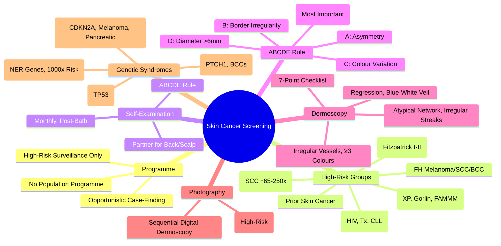

> [!tip] **FCPS/MRCP Priority: MEDIUM**
> **No Population Screening Programme for Skin Cancer in UK**; **High-Risk Surveillance Only**: Transplant Recipients (SCC Risk ↑65-250x), FH Melanoma, Fair Skin, Genetic Syndromes (XP, Gorlin, FAMMM), Prior Skin Cancer, Immunosuppression; **Mole Screening**: ABCDE Rule, Dermoscopy, Total Body Photography; **High-Risk Groups**: Transplant (SCC ↑65-250x), FH Melanoma, Fair Skin, Genetic Syndromes (XP, Gorlin, FAMMM), Prior Skin Cancer, Immunosuppression.

---

## 1. 1. Learning Objectives
By the end of this note you should be able to:
- [ ] Explain why **no population screening** exists for skin cancer in UK
- [ ] Identify **high-risk groups** warranting surveillance
- [ ] Apply **ABCDE rule** and **dermoscopy** for melanoma detection
- [ ] Know **total body photography** and **sequential digital dermoscopy** indications
- [ ] Recognise **high-risk groups** requiring surveillance

---

## 2. 2. No Population Screening Programme

| Aspect | Detail |
|--------|--------|
| **UK Position** | **No population screening programme** for skin cancer (melanoma or NMSC) |
| **Rationale** | **No evidence of mortality reduction** from population screening; **Low specificity** of visual examination; **Overdiagnosis** risk; **Resource implications** |
| **Current Approach** | **Opportunistic case-finding** + **High-risk targeted surveillance** |
| **NICE Guidance** | **Opportunistic awareness**, **High-risk surveillance**, **Public awareness campaigns** (SunSmart) |

---

## 3. 3. High-Risk Groups Warranting Surveillance

| Risk Factor | Population | Surveillance Frequency |
|-------------|------------|------------------------|
| **Organ Transplant Recipients** | **All** (Heart, Lung, Liver, Kidney, Pancreas) | **6-12 Monthly Dermatology Review** (SCC Risk ↑65-250x) |
| **Strong Family History** (Melanoma, SCC, BCC) | **≥2 FDR with Melanoma** or **≥1 FDR with SCC/BCC** | **Annual Dermatology Review** |
| **Personal History** of Skin Cancer | **Melanoma, SCC, BCC, MCC** | **6-12 Monthly Dermatology Review** |
| **Fair Skin (Fitzpatrick I-II)** + **High UV Exposure** | **Outdoor Workers, Frequent Sunbed Users** | **Annual Dermatology Review** |
| **Genetic Syndromes** | **Xeroderma Pigmentosum (XP), Gorlin Syndrome (BCC), FAMMM (CDKN2A), Li-Fraumeni (TP53)** | **Specialised Surveillance Protocols** (Per Syndrome Guidelines) |
| **Immunosuppression** | **HIV, Transplant, CLL, Biologics** | **6-12 Monthly Dermatology Review** |
| **Multiple Atypical Nevi** | **>50 Nevi** or **>5 Atypical Nevi** | **Annual Dermoscopy + Photography** |
| **Previous Melanoma** | **Any Stage** | **Life-long Surveillance** (Intensive First 3-5 Years) |

---

## 4. 4. Mole Screening (ABCDE Rule)

| Letter | Feature | Concerning Sign |
|--------|---------|-----------------|
| **A** | **Asymmetry** | One half ≠ other half |
| **B** | **Border Irregularity** | Irregular, Notched, Blurred |
| **C** | **Colour Variation** | Multiple Shades (Brown, Black, Red, White, Blue) |
| **D** | **Diameter** | **>6mm** (But Melanomas Can Be Smaller) |
| **E** | **Evolution** | **Change in Size, Shape, Colour, Elevation, Symptoms** |

> **E = Evolution (Most Important)** — **Change Over Time = Red Flag**

---

## 5. 5. Dermoscopy

| Feature | Benign | Malignant (Melanoma) |
|---------|--------|----------------------|
| **Pattern** | **Regular, Symmetric** | **Asymmetric, Chaotic** |
| **Network** | **Regular, Uniform** | **Atypical Network, Irregular** |
| **Globules** | **Regular, Peripheral** | **Irregular, Central, Amorphous** |
| **Vessels** | **Comma, Hairpin (Benign)** | **Irregular, Dotted, Linear (Malignant)** |
| **Regression** | **Absent** | **White Scar-Like Areas, Peppering** |
| **Colours** | **1-2 Colours** | **≥3 Colours (Black, Brown, Red, White, Blue)** |

### 1. 7-Point Checklist (Weighted)

| Major Criteria (2 Points Each) | Minor Criteria (1 Point Each) |
|--------------------------------|-------------------------------|
| **Atypical Network** | **Irregular Streaks** |
| **Irregular Streaks** | **Irregular Pigmentation** |
| **Regression Structures** | **Blue-White Veil** |
| | **Atypical Vascular Pattern** |

**Score ≥3 = Suspicious → Refer for Excision/Biopsy**

---

## 6. 6. Total Body Photography & Digital Dermoscopy

| Technique | Indication |
|-----------|------------|
| **Total Body Photography** | **High-Risk Patients** (>50 Nevi, Atypical Nevi, FH Melanoma, Personal History) |
| **Sequential Digital Dermoscopy** | **Monitoring Individual Lesions** (Change Detection) |
| **AI-Assisted Dermoscopy** | **Emerging** (Decision Support, Not Replacement) |

---

## 7. 7. Self-Examination Teaching

| Step | Instruction |
|------|-------------|
| **1. Timing** | **Monthly**, After Bath/Shower (Skin Hydrated) |
| **2. Lighting** | **Good Light**, Full-Length Mirror + Hand Mirror |
| **3. Systematic** | **Head to Toe** (Scalp, Face, Neck, Trunk, Arms, Legs, Feet, Genitals, Palms, Soles, Nail Beds) |
| **4. Partners** | **Partner-Assisted** for Back, Scalp, Hard-to-See Areas |
| **5. Documentation** | **Photograph Suspicious Lesions**, **Date Stamp**, **Compare Monthly** |
| **6. Red Flags** | **New Mole**, **Changing Mole**, **Bleeding/Itching Mole**, **Non-Healing Ulcer**, **Nail Changes** |

---

## 8. 8. High-Risk Genetic Syndromes

| Syndrome | Gene | Skin Cancer Risks | Surveillance |
|--------|------|-------------------|--------------|
| **Xeroderma Pigmentosum (XP)** | **Nucleotide Excision Repair Genes** | **Extreme UV Sensitivity**, **1000x Skin Cancer Risk** | **Strict UV Avoidance, 3-6 Monthly Dermatology** |
| **Gorlin Syndrome** | **PTCH1** | **Multiple BCCs**, Jaw Cysts, Calcified Falx | **3-6 Monthly Dermatology, Annual MRI Brain** |
| **FAMMM** (Familial Atypical Multiple Mole Melanoma) | **CDKN2A (p16)** | **Melanoma (High Penetrance), Pancreatic** | **6-12 Monthly Dermoscopy, Annual Pancreatic Imaging** |
| **Li-Fraumeni** | **TP53** | **Sarcoma, Breast, Brain, Adrenocortical** | **Annual WBMRI, Breast MRI, Brain MRI** |
| **Cowden Syndrome** | **PTEN** | **Breast, Thyroid, Endometrial, SCC** | **Breast MRI, Thyroid US, Colonoscopy** |

---

## 9. 9. FCPS/MRCP High-Yield Summary

| Topic | Key Points |
|-------|------------|
| **No Population Programme** | **No UK Skin Cancer Screening** — **High-Risk Surveillance Only** |
| **High-Risk Groups** | **Transplant (SCC ↑65-250x), FH, Fair Skin, Prior CA, Genetic Syndromes, Immunosuppression** |
| **ABCDE** | **Asymmetry, Border, Colour, Diameter>6mm, Evolution (Most Important)** |
| **Dermoscopy** | **Atypical Network, Irregular Streaks, Regression, Blue-White Veil, Irregular Vessels** |
| **7-Point Checklist** | **Major (2pts): Network, Streaks, Regression**; **Minor (1pt): Pigment, Blue-White, Vascular** |
| **Total Body Photography** | **>50 Nevi, Atypical Nevi, FH Melanoma, Personal History** |
| **Self-Exam** | **Monthly, Post-Bath, ABCDE, Partner for Back/Scalp** |
| **High-Risk Groups** | **Transplant (SCC ↑65-250x), FH, Fair Skin, Prior CA, Genetic, Immunosuppression** |

---

## 10. 10. Viva Questions (MRCP PACES / FCPS)

| Question | Expected Answer |
|----------|-----------------|
| **UK Skin Cancer Screening Programme?** | **No Population Programme** — **High-Risk Surveillance Only** (Transplant, FH, Fair Skin, Prior CA, Genetic Syndromes, Immunosuppression). |
| **ABCDE Rule — What Does E Stand For?** | **Evolution (Most Important)** — **Change in Size, Shape, Colour, Elevation, Symptoms**. |
| **7-Point Checklist — Major vs Minor Criteria?** | **Major (2pts): Atypical Network, Irregular Streaks, Regression**; **Minor (1pt): Irregular Pigmentation, Blue-White Veil, Atypical Vascular Pattern**. |
| **Dermoscopy — Melanoma Features?** | **Atypical Network, Irregular Streaks, Regression, Blue-White Veil, Irregular Vessels, ≥3 Colours**. |
| **Total Body Photography — Indications?** | **>50 Nevi, Atypical Nevi, FH Melanoma, Personal History**. |
| **High-Risk Groups for Skin Cancer Surveillance?** | **Transplant (SCC ↑65-250x), FH Melanoma, Fair Skin, Prior Skin CA, Genetic Syndromes (XP, Gorlin, FAMMM), Immunosuppression**. |
| **Self-Exam — Technique, Frequency?** | **Monthly, Post-Bath, ABCDE, Partner for Back/Scalp, Document Changes**. |
| **High-Risk Genetic Syndromes — XP, Gorlin, FAMMM?** | **XP: NER Genes, 1000x Risk**; **Gorlin: PTCH1, BCCs**; **FAMMM: CDKN2A, Melanoma/Pancreatic**. |
| **Immunosuppression — SCC Risk?** | **Transplant: ↑65-250x**, **SCC:BCC Ratio Reverses**, **Aggressive, Multiple, Early Mets**. |
| **Dermoscopy vs ABCDE** | **ABCDE: Clinical/Naked Eye**; **Dermoscopy: Magnified, Pattern Analysis, 7-Point Checklist**. |

---

## 11. 11. Confusions & Mnemonics

| Confusion | Clarification |
|-----------|---------------|
| **Skin Cancer Screening — Programme or Surveillance?** | **No Population Programme** — **High-Risk Surveillance Only** |
| **ABCDE — E = Evolution** | **Most Important Criterion** — **Change Over Time = Red Flag** |
| **Dermoscopy — Benign vs Malignant** | **Benign: Regular Network, Uniform Globules**; **Malignant: Atypical Network, Irregular Streaks, Regression, Blue-White Veil** |
| **7-Point Checklist** | **Major (2pts): Atypical Network, Irregular Streaks, Regression**; **Minor (1pt): Irregular Pigmentation, Blue-White Veil, Vascular Pattern** |
| **Melanoma vs NMSC — Screening** | **Melanoma: High-Risk Surveillance**; **NMSC: High-Risk Surveillance (Transplant, Prior CA)** — **No Population Programme for Either** |
| **Total Body Photography vs Sequential Dermoscopy** | **TB Photography: Baseline for High-Risk**; **Sequential Dermoscopy: Monitoring Specific Lesions** |
| **Melanoma vs BCC/SCC Screening** | **No Population Programme for Any Skin Cancer** — **All High-Risk Surveillance Only** |

**Mnemonic: SKIN-SCREEN**
- **S**kin Cancer: **No Population Programme**, **High-Risk Surveillance Only**
- **K**ey High-Risk: **Transplant (SCC ↑65-250x), FH, Fair Skin, Prior CA, Genetic, Immunosuppression**
- **I**nterval: **Monthly Self-Exam**, **Annual Dermatology (High-Risk)**
- **N**ot Population Programme: **Opportunistic + High-Risk Surveillance**
- **S**elf-Exam: **Monthly, Post-Bath, ABCDE, ABCDE = Evolution Most Important**
- **C**ancer Types: **Melanoma (Most Lethal), BCC (Most Common), SCC (Metastatic Potential), MCC (Aggressive)**
- **R**isk Groups: **Transplant (>65x SCC), FH, Fair Skin, Prior CA, Genetic, Immunosuppression**
- **E**arly Detection: **ABCDE, Dermoscopy, Total Body Photography**
- **E**arly Referral: **Change = Red Flag, Urgent 2ww Dermatology**
- **E**arly: **ABCDE + Dermoscopy = Best Detection**
- **N**ot Population: **No Mass Screening, Targeted Surveillance Only**

---

## 12. 12. Mind Map

---

## 13. 13. One-Page Revision Card

| Domain | Key Points |
|--------|------------|
| **Screening** | **No Population Programme** — **High-Risk Surveillance Only** |
| **High-Risk** | Transplant (SCC ↑65-250x), FH, Fair Skin, Prior CA, Genetic, Immunosuppression |
| **ABCDE** | **Evolution = Most Important** (Change = Red Flag) |
| **Dermoscopy** | Atypical Network, Irregular Streaks, Regression, Blue-White Veil |
| **7-Point Checklist** | Major (2pts): Network, Streaks, Regression; Minor (1pt): Pigment, Blue-White, Vascular |
| **Self-Exam** | Monthly, Post-Bath, ABCDE, Partner for Back/Scalp |
| **Total Body Photography** | >50 Nevi, Atypical Nevi, FH Melanoma, Personal History |
| **High-Risk Groups** | Transplant, FH, Fair Skin, Prior CA, Genetic, Immunosuppression |
| **Genetic Syndromes** | XP (NER), Gorlin (PTCH1), FAMMM (CDKN2A), Li-Fraumeni (TP53) |

---

## 14. 14. Spaced Repetition Trackers

| Review Interval | Date Completed | Confidence (1-5) | Notes |
|-----------------|----------------|------------------|-------|
| 24 hours | | | |
| 7 days | | | |
| 15 days | | | |
| 30 days | | | |
| 90 days | | | |

---

## 15. 15. Self-Test Scorecard

| Section | Score /5 | Last Attempt |
|---------|----------|--------------|
| No Population Programme Rationale | | |
| High-Risk Groups | | |
| ABCDE Rule | | |
| Dermoscopy Features | | |
| 7-Point Checklist | | |
| Self-Exam Technique | | |
| High-Risk Genetic Syndromes | | |
| Total Body Photography Indications | | |

---

## 16. 16. Local Navigation
- **Parent Heading**: [[../Oncology|Oncology]]
- **Chapter Map": [[../Davidson Chapter 7 - Oncology Hierarchy|Oncology Hierarchy]]
- **Chapter MOC": [[../Oncology MOC|Oncology MOC]]
- **Drug Reference": [[../../Clinical Therapeutics and Good Prescribing|Drugs]]
- **Related": [[Melanoma]], [[Non-Melanoma Skin Cancer]], [[Rare Skin Cancers]], [[ABCDE Rule]], [[Dermoscopy]], [[Total Body Photography]], [[Self-Examination]], [[Immunosuppression]]

---

# FCPS/MRCP Exam Extras

## 17. 17. MCQs (10)

**1.** Regarding Skin Cancer Screening (No Population Programme), which statement is correct?
   A. **No UK Skin Cancer Screening**
   B. **No - alternative approach
   C. Empirical management only
   D. Watch and wait
   - **Answer: A** — **No UK Skin Cancer Screening** — **High-Risk Surveillance Only**

**2.** Regarding Skin Cancer Screening (High-Risk Groups), which statement is correct?
   A. **Transplant (SCC ↑65-250x), FH, Fair Skin, Prior CA, Genetic Syndromes, Immunosuppression**
   B. **Transplant - alternative approach
   C. Empirical management only
   D. Watch and wait
   - **Answer: A** — **Transplant (SCC ↑65-250x), FH, Fair Skin, Prior CA, Genetic Syndromes, Immunosuppression**

**3.** Regarding Skin Cancer Screening (ABCDE), which statement is correct?
   A. **Asymmetry, Border, Colour, Diameter>6mm, Evolution (Most Important)**
   B. **Asymmetry, - alternative approach
   C. Empirical management only
   D. Watch and wait
   - **Answer: A** — **Asymmetry, Border, Colour, Diameter>6mm, Evolution (Most Important)**

**4.** Regarding Skin Cancer Screening (Dermoscopy), which statement is correct?
   A. **Atypical Network, Irregular Streaks, Regression, Blue-White Veil, Irregular Vessels**
   B. **Atypical - alternative approach
   C. Empirical management only
   D. Watch and wait
   - **Answer: A** — **Atypical Network, Irregular Streaks, Regression, Blue-White Veil, Irregular Vessels**

**5.** Regarding Skin Cancer Screening (7-Point Checklist), which statement is correct?
   A. **Major (2pts): Network, Streaks, Regression**
   B. **Major - alternative approach
   C. Empirical management only
   D. Watch and wait
   - **Answer: A** — **Major (2pts): Network, Streaks, Regression**; **Minor (1pt): Pigment, Blue-White, Vascular**

**6.** Regarding Skin Cancer Screening (Total Body Photography), which statement is correct?
   A. **>50 Nevi, Atypical Nevi, FH Melanoma, Personal History**
   B. **>50 - alternative approach
   C. Empirical management only
   D. Watch and wait
   - **Answer: A** — **>50 Nevi, Atypical Nevi, FH Melanoma, Personal History**

**7.** Regarding Skin Cancer Screening (Self-Exam), which statement is correct?
   A. **Monthly, Post-Bath, ABCDE, Partner for Back/Scalp**
   B. **Monthly, - alternative approach
   C. Empirical management only
   D. Watch and wait
   - **Answer: A** — **Monthly, Post-Bath, ABCDE, Partner for Back/Scalp**

**8.** Regarding Skin Cancer Screening (High-Risk Groups), which statement is correct?
   A. **Transplant (SCC ↑65-250x), FH, Fair Skin, Prior CA, Genetic, Immunosuppression**
   B. **Transplant - alternative approach
   C. Empirical management only
   D. Watch and wait
   - **Answer: A** — **Transplant (SCC ↑65-250x), FH, Fair Skin, Prior CA, Genetic, Immunosuppression**

**9.** Regarding Skin Cancer Screening (FCPS/MRCP Priority), which statement is correct?
   - A. FCPS/MRCP Priority: MEDIUM - No Population Screening Programme for Skin Cancer in UK
   - B. Empirical approach without specific indication
   - C. Used only in research protocols
   - D. Not relevant in current practice
   - **Answer: A** — FCPS/MRCP Priority: MEDIUM - No Population Screening Programme for Skin Cancer in UK

**10.** Regarding Skin Cancer Screening (Key Point), which statement is correct?
   - A. High-Risk Surveillance (Transplant, FH, Fair Skin, Prior Skin Cancer)
   - B. Empirical approach without specific indication
   - C. Used only in research protocols
   - D. Not relevant in current practice
   - **Answer: A** — High-Risk Surveillance (Transplant, FH, Fair Skin, Prior Skin Cancer)

## 18. 18. SBA Questions (10)

**1.** A 55-year-old presents with classic features. MDT discussion recommends:
   - A. **No UK Skin Cancer Screening**
   - B. **No (less specific)
   - C. Empirical broad approach
   - D. No intervention required
   - **Answer: A** — first-line: **No UK Skin Cancer Screening** — **High-Risk Surveillance Only**

**2.** On staging workup, the patient is found to be [Stage X]. Best management is:
   - A. **Transplant (SCC ↑65-250x), FH, Fair Skin, Prior CA, Genetic Syndromes, Immunosuppression**
   - B. **Transplant (less specific)
   - C. Empirical broad approach
   - D. No intervention required
   - **Answer: A** — stage-specific: **Transplant (SCC ↑65-250x), FH, Fair Skin, Prior CA, Genetic Syndromes, Immunosuppression**

**3.** Following first-line treatment, the patient develops [complication]. Best next step:
   - A. **Asymmetry, Border, Colour, Diameter>6mm, Evolution (Most Important)**
   - B. **Asymmetry, (less specific)
   - C. Empirical broad approach
   - D. No intervention required
   - **Answer: A** — complication: **Asymmetry, Border, Colour, Diameter>6mm, Evolution (Most Important)**

**4.** The patient asks about prognosis. Most appropriate response based on:
   - A. **Atypical Network, Irregular Streaks, Regression, Blue-White Veil, Irregular Vessels**
   - B. **Atypical (less specific)
   - C. Empirical broad approach
   - D. No intervention required
   - **Answer: A** — prognosis: **Atypical Network, Irregular Streaks, Regression, Blue-White Veil, Irregular Vessels**

**5.** A 65-year-old with relevant risk factors should be screened with:
   - A. **Major (2pts): Network, Streaks, Regression**
   - B. **Major (less specific)
   - C. Empirical broad approach
   - D. No intervention required
   - **Answer: A** — screening: **Major (2pts): Network, Streaks, Regression**; **Minor (1pt): Pigment, Blue-White, Vascular**

**6.** The most clinically important biomarker/molecular test is:
   - A. **>50 Nevi, Atypical Nevi, FH Melanoma, Personal History**
   - B. **>50 (less specific)
   - C. Empirical broad approach
   - D. No intervention required
   - **Answer: A** — biomarker: **>50 Nevi, Atypical Nevi, FH Melanoma, Personal History**

**7.** The standard chemotherapy/regimen of choice is:
   - A. **Monthly, Post-Bath, ABCDE, Partner for Back/Scalp**
   - B. **Monthly, (less specific)
   - C. Empirical broad approach
   - D. No intervention required
   - **Answer: A** — chemo: **Monthly, Post-Bath, ABCDE, Partner for Back/Scalp**

**8.** The role of surgery in this case is:
   - A. **Transplant (SCC ↑65-250x), FH, Fair Skin, Prior CA, Genetic, Immunosuppression**
   - B. **Transplant (less specific)
   - C. Empirical broad approach
   - D. No intervention required
   - **Answer: A** — surgery: **Transplant (SCC ↑65-250x), FH, Fair Skin, Prior CA, Genetic, Immunosuppression**

**9.** A clinician encounters this presentation. Best approach:
   - A. FCPS/MRCP Priority: MEDIUM - No Population Screening Programme for Skin Cancer in UK
   - B. Watch and wait approach
   - C. Empirical broad treatment
   - D. No intervention required
   - **Answer: A** — FCPS/MRCP Priority: MEDIUM - No Population Screening Programme for Skin Cancer in UK

**10.** On evaluation, the finding is confirmed. Most appropriate next step:
   - A. High-Risk Surveillance (Transplant, FH, Fair Skin, Prior Skin Cancer)
   - B. Watch and wait approach
   - C. Empirical broad treatment
   - D. No intervention required
   - **Answer: A** — High-Risk Surveillance (Transplant, FH, Fair Skin, Prior Skin Cancer)

## 19. 19. Flashcards

**Q1:** No Population Programme?
**A1:** No UK Skin Cancer Screening — High-Risk Surveillance Only

**Q2:** High-Risk Groups?
**A2:** Transplant (SCC ↑65-250x), FH, Fair Skin, Prior CA, Genetic Syndromes, Immunosuppression

**Q3:** ABCDE?
**A3:** Asymmetry, Border, Colour, Diameter>6mm, Evolution (Most Important)

**Q4:** Dermoscopy?
**A4:** Atypical Network, Irregular Streaks, Regression, Blue-White Veil, Irregular Vessels

**Q5:** 7-Point Checklist?
**A5:** Major (2pts): Network, Streaks, Regression; Minor (1pt): Pigment, Blue-White, Vascular

**Q6:** Total Body Photography?
**A6:** >50 Nevi, Atypical Nevi, FH Melanoma, Personal History

**Q7:** Self-Exam?
**A7:** Monthly, Post-Bath, ABCDE, Partner for Back/Scalp

**Q8:** High-Risk Groups?
**A8:** Transplant (SCC ↑65-250x), FH, Fair Skin, Prior CA, Genetic, Immunosuppression

## 20. 20. Answer Key with Explanations

| # | MCQ | Topic | Explanation |
|---|-----|-------|-------------|
| 1 | A | No Population Programme | No UK Skin Cancer Screening — High-Risk Surveillance Only |
| 2 | A | High-Risk Groups | Transplant (SCC ↑65-250x), FH, Fair Skin, Prior CA, Genetic Syndromes, Immunosuppression |
| 3 | A | ABCDE | Asymmetry, Border, Colour, Diameter>6mm, Evolution (Most Important) |
| 4 | A | Dermoscopy | Atypical Network, Irregular Streaks, Regression, Blue-White Veil, Irregular Vessels |
| 5 | A | 7-Point Checklist | Major (2pts): Network, Streaks, Regression; Minor (1pt): Pigment, Blue-White, Vascular |
| 6 | A | Total Body Photography | >50 Nevi, Atypical Nevi, FH Melanoma, Personal History |
| 7 | A | Self-Exam | Monthly, Post-Bath, ABCDE, Partner for Back/Scalp |
| 8 | A | High-Risk Groups | Transplant (SCC ↑65-250x), FH, Fair Skin, Prior CA, Genetic, Immunosuppression |
| 9 | A | FCPS/MRCP Priority | FCPS/MRCP Priority: MEDIUM - No Population Screening Programme for Skin Cancer in UK |
| 10 | A | High-Risk Surveillance (Transplant, FH, Fair Skin, | High-Risk Surveillance (Transplant, FH, Fair Skin, Prior Skin Cancer) |

| # | SBA | Topic | Explanation |
|---|-----|-------|-------------|
| 1 | A | No Population Programme | No UK Skin Cancer Screening — High-Risk Surveillance Only |
| 2 | A | High-Risk Groups | Transplant (SCC ↑65-250x), FH, Fair Skin, Prior CA, Genetic Syndromes, Immunosuppression |
| 3 | A | ABCDE | Asymmetry, Border, Colour, Diameter>6mm, Evolution (Most Important) |
| 4 | A | Dermoscopy | Atypical Network, Irregular Streaks, Regression, Blue-White Veil, Irregular Vessels |
| 5 | A | 7-Point Checklist | Major (2pts): Network, Streaks, Regression; Minor (1pt): Pigment, Blue-White, Vascular |
| 6 | A | Total Body Photography | >50 Nevi, Atypical Nevi, FH Melanoma, Personal History |
| 7 | A | Self-Exam | Monthly, Post-Bath, ABCDE, Partner for Back/Scalp |
| 8 | A | High-Risk Groups | Transplant (SCC ↑65-250x), FH, Fair Skin, Prior CA, Genetic, Immunosuppression |

| 11 | A | FCPS/MRCP Priority | FCPS/MRCP Priority: MEDIUM - No Population Screening Programme for Skin Cancer in UK |
| 12 | A | High-Risk Surveillance (Transplant, FH, Fair Skin, | High-Risk Surveillance (Transplant, FH, Fair Skin, Prior Skin Cancer) |
## 21. 21. Local Navigation

- **Parent Heading Hub**: [[../../Skin Cancer|Skin Cancer]]
- **Chapter Map**: [[../../Davidson Chapter 7 - Oncology Hierarchy|Oncology Hierarchy]]
- **Chapter MOC**: [[../../Oncology MOC|Oncology MOC]]
- **Drug Reference**: [[../../../Clinical Therapeutics and Good Prescribing|Drugs]]
---

> Auto-generated study sections for "Skin Cancer" — Ch 8: Oncology.

## Flashcards (12 generated)

- Q: What is the definition of Skin Cancer?
  A: No Population Screening Programme for Skin Cancer in UK; High-Risk Surveillance Only: Transplant Recipients (SCC Risk ↑65-250x), FH Melanoma, Fair Skin, Genetic Syndromes (XP, Gorlin, FAMMM), Prior Skin Cancer, Immunosuppression; Mole Screening: ABCDE Rule, Dermoscopy, Total Body Photography; High-Risk Groups: Transplant (SCC ↑65-250x), FH Melanoma, Fair Skin, Genetic Syndromes (XP, Gorlin, FAMMM)
- Q: What is UK Position of Skin Cancer?
  A: No population screening programme for skin cancer (melanoma or NMSC)
- Q: What is Rationale of Skin Cancer?
  A: No evidence of mortality reduction from population screening; Low specificity of visual examination; Overdiagnosis risk; Resource implications
- Q: What is Current Approach of Skin Cancer?
  A: Opportunistic case-finding + High-risk targeted surveillance
- Q: What is NICE Guidance of Skin Cancer?
  A: Opportunistic awareness, High-risk surveillance, Public awareness campaigns (SunSmart)
- Q: What is No Population Programme of Skin Cancer?
  A: No UK Skin Cancer Screening — High-Risk Surveillance Only
- Q: What is High-Risk Groups of Skin Cancer?
  A: Transplant (SCC ↑65-250x), FH, Fair Skin, Prior CA, Genetic Syndromes, Immunosuppression
- Q: What is ABCDE of Skin Cancer?
  A: Asymmetry, Border, Colour, Diameter>6mm, Evolution (Most Important)
- Q: What is Dermoscopy of Skin Cancer?
  A: Atypical Network, Irregular Streaks, Regression, Blue-White Veil, Irregular Vessels
- Q: What is 7-Point Checklist of Skin Cancer?
  A: Major (2pts): Network, Streaks, Regression; Minor (1pt): Pigment, Blue-White, Vascular
- Q: What is Total Body Photography of Skin Cancer?
  A: >50 Nevi, Atypical Nevi, FH Melanoma, Personal History
- Q: What is Self-Exam of Skin Cancer?
  A: Monthly, Post-Bath, ABCDE, Partner for Back/Scalp

## MCQs (1 generated)

1. **Which of the following best describes Skin Cancer?**
   A. **No Population Screening Programme for Skin Cancer in UK; High-Risk Surveillance Only: Transplant Recipients (SCC Risk ↑65-250x), FH Melanoma, Fair Skin, Genetic Syndromes (XP, Gorlin, FAMMM), Prior Sk**
   B. An unrelated condition not matching the clinical picture of Skin Cancer
   C. A complication seen late in the disease course of Skin Cancer
   D. A condition that mimics Skin Cancer but has a different underlying cause

## PasTest Scenario SBAs (Clinical Vignettes)

> **Auto-generated PasTest/Mediscope-style scenario SBAs** grounded in the authored source. Each scenario tests a real clinical fact (triad, specific sign, contraindication, trial, first-line Rx) extracted from the topic. *Source: Ch 8: Oncology — Skin Cancer Screening*

**Q1.** Which of the following features is most specific or characteristic of Skin Cancer Screening?

  - **A.** Dermoscopy — Benign vs Malignant
  - **B.** A feature common to many acute inflammatory conditions
  - **C.** A non-specific sign that does not localise the diagnosis
  - **D.** An investigation finding rather than a clinical feature

  > **Answer: A** — Dermoscopy — Benign vs Malignant
  >
  > *Source:* |
| **ABCDE — E = Evolution** | **Most Important Criterion** — **Change Over Time = Red Flag** |
| **Dermoscopy — Benign vs Malignant** | **Benign: Regular Network, Uniform Globules**; **Malignant: At

