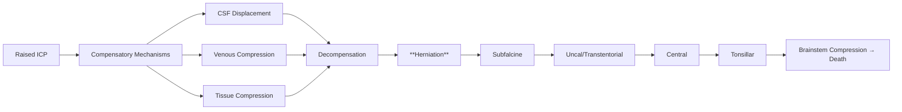
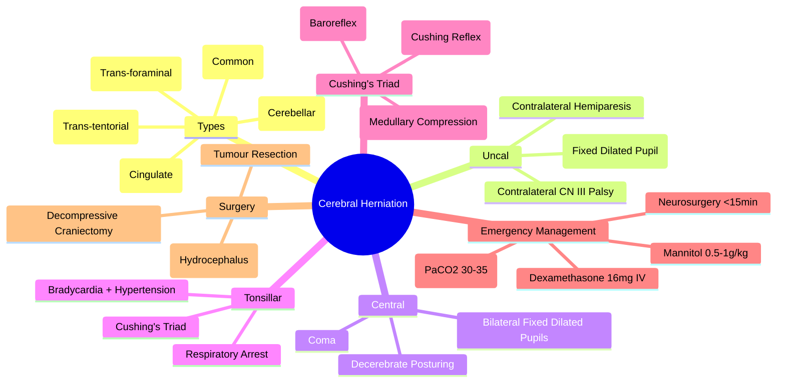

# Cerebral Herniation

> [!tip] **FCPS/MRCP Priority: HIGH**
> **Cerebral Herniation = Life-Threatening Complication of Raised ICP**; **Types**: **Subfalcine (Cingulate)**, **Uncal/Transtentorial**, **Central (Trans-tentorial)**, **Tonsillar (Cerebellar)**, **Upward (Trans-foraminal)**; **Cushing's Triad** (Hypertension, Bradycardia, Irregular Breathing) = **Impending Herniation**; **Management**: **Hyperventilation**, **Mannitol/Hypertonic Saline**, **Dexamethasone**, **Emergent Neurosurgery** (Decompressive Craniectomy, EVD); **Time-Critical**: Minutes Matter.

---

## 1. Learning Objectives
By the end of this note you should be able to:
- [ ] Identify **types of cerebral herniation** and their clinical features
- [ ] Recognise **impending herniation** signs (Cushing's Triad)
- [ ] Initiate **immediate life-saving management** (Hyperventilation, Osmotic Therapy, Steroids)
- [ ] Understand **urgent neurosurgical interventions** (Decompressive Craniectomy, EVD)
- [ ] Recognise **time-critical nature** of herniation management

---

## 2. Types of Cerebral Herniation

| Type | Mechanism | Key Clinical Features |
|-------|-----------|----------------------|
| **Subfalcine (Cingulate)** | **Cingulate Gyrus** displaced under falx cerebri | Contralateral leg weakness (ACA territory), Ipsilateral CN III palsy (rare), Contralateral leg weakness |
| **Uncal / Transtentorial** | **Uncus/Parahippocampal Gyrus** herniates over tentorial edge | **Ipsilateral CN III Palsy** (Dilated Pupil, Ptosis, Eye Down & Out), Contralateral Hemiparesis (Crus Cerebri), Cheyne-Stokes |
| **Central (Trans-tentorial)** | **Both Unci** descend through tentorial notch | **Bilateral CN III Palsy**, **Coma**, Decerebrate Posturing, Respiratory Arrest |
| **Tonsillar (Cerebellar)** | **Cerebellar Tonsils** herniate through foramen magnum | **Respiratory Arrest** (Medullary Compression), **Bradycardia**, **Hypertension**, **Apnoea** |
| **Upward (Trans-foraminal)** | **Midbrain/Diencephalon** forced upward through tentorial incisura | **Upward Gaze Palsy**, **Doll's Eyes Absent**, **Pinpoint Pupils** |

---

## 3. Pathophysiology & Progression



### Progression Pattern
| Stage | ICP | Clinical Correlate |
|-------|-----|-------------------|
| **Compensated** | <20 mmHg | Asymptomatic / Headache |
| **Decompensating** | 20-40 mmHg | **Papilloedema**, CN VI Palsy, Vomiting, Altered Consciousness |
| **Impending Herniation** | >40 mmHg | **Cushing's Triad**, Uncal Herniation Signs |
| **Brainstem Compression** | >50 mmHg | **Tonsillar Herniation**, Respiratory Arrest, Death |

---

## 4. Clinical Features by Herniation Type

### Uncal (Transtentorial) Herniation — Most Common
| Sign | Pathophysiology |
|------|----------------|
| **Ipsilateral Fixed Dilated Pupil** | **CN III Compression** (Parasympathetic Fibres Peripheral) |
| **Contralateral Hemiparesis** | **Crus Cerebri Compression** (Corticospinal Tract) |
| **Contralateral Hemianopia** | **PCA Compression** (Posterior Cerebral Artery) |
| **Cheyne-Stokes Respiration** | **Diencephalic Compression** |

### Central (Trans-tentorial) Herniation
| Sign | Pathophysiology |
|------|----------------|
| **Bilateral Fixed Dilated Pupils** | **Bilateral CN III Compression** |
| **Coma (GCS <8)** | **Bilateral Cerebral Hemisphere Compression** |
| **Decerebrate Posturing** | **Midbrain/Upper Pons Compression** |

### Tonsillar (Cerebellar) Herniation
| Sign | Pathophysiology |
|------|----------------|
| **Apnoea / Respiratory Arrest** | **Medullary Compression** (Respiratory Centres) |
| **Bradycardia + Hypertension** | **Cushing's Reflex** (Medullary Compression) |
| **Flaccid Quadriparesis** | **Corticospinal Tract Compression at Medulla** |

---

## 5. Cushing's Triad — The Herald of Herniation

| Component | Pathophysiology | Clinical Threshold |
|-----------|----------------|-------------------|
| **Hypertension** | **Cushing Reflex**: Medullary Ischaemia → Sympathetic Surge | **SBP >160** (or ↑↑ from baseline) |
| **Bradycardia** | **Baroreceptor Reflex**: Response to Hypertension | **HR <60 bpm** (Relative) |
| **Irregular Breathing** | **Medullary Compression** → Respiratory Centre Dysfunction | **Cheyne-Stokes, Ataxic, Apnoea** |

> **Cushing's Triad = Impending Tonsillar Herniation** → **Immediate Neurosurgical Emergency**

---

## 6. Emergency Management Algorithm

```mermaid
flowchart TD
    A[Suspected Herniation] --> B[**IMMEDIATE**: <5 MIN]
    B --> B1[**Hyperventilation**: PaCO2 30-35 mmHg (Intubate if Needed)]
    B --> B2[**Mannitol 20% 0.5-1g/kg IV** over 15-30min]
    B --> B3[**Dexamethasone 16mg IV Stat**]
    B --> B4[**Head Elevation 30°**]
    B --> B5[**Urgent Neurosurgery Consult**]
    B1 --> C[**Neurosurgical Intervention**]
    B2 --> C
    B3 --> C
    C --> C1[**EVD** (Hydrocephalus)]
    C --> C2[**Decompressive Craniectomy** (Malignant Oedema)]
    C --> C3[**Tumour Resection / Debulking**]
    C --> C4[**EVD + ICP Monitoring**]
    C --> C5[**ICP-Guided Therapy** (CPP >60-70)]
```

---

## 7. Immediate Management (First 5 Minutes)

| Step | Action | Timing |
|------|--------|--------|
| **1. Secure Airway** | **Intubate** (RSI) if GCS <8, Seizures, Airway Compromise | **Immediate** |
| **2. Hyperventilation** | **PaCO2 30-35 mmHg** (Mechanical) | **Within 2 Minutes** |
| **4. Osmotic Therapy** | **Mannitol 20% 0.5-1g/kg IV** over 15-30min | **Within 5 Minutes** |
| **5. Dexamethasone** | **16mg IV Stat** (Then 4mg q6h) | **Within 5 Minutes** |
| **6. Head Elevation** | **30°** (Maintain CPP) | **Immediate** |
| **7. Neurosurgery** | **Emergent Consult** (EVD, Decompressive Craniectomy, Resection) | **Within 15 Minutes** |

---

## 8. Definitive Neurosurgical Interventions

| Procedure | Indication | Timing |
|-----------|------------|--------|
| **EVD (External Ventricular Drain)** | **Hydrocephalus**, Refractory ICP, ICP Monitoring | **Emergent** (<1h) |
| **Decompressive Craniectomy** | **Malignant Cerebral Oedema**, Refractory ICP >25mmHg | **Within 1-2 Hours** |
| **Tumour Resection / Debulking** | **Primary Tumour / Solitary Met** causing Herniation | **After Stabilisation** |
| **CSF Diversion (VP Shunt)** | **Chronic Hydrocephalus** (Post-Crisis) | **Delayed** |

---

## 9. Monitoring in Herniation

| Parameter | Target | Frequency |
|-----------|--------|-----------|
| **ICP** | **<20 mmHg** (Normal <15) | Continuous |
| **CPP (MAP - ICP)** | **>60-70 mmHg** | Continuous |
| **PaCO2** | **30-35 mmHg** (During Hyperventilation) | Continuous (ETCO2) |
| **Serum Osmolality** | **<320 mOsm/kg** (Mannitol) | q4-6h |
| **Sodium** | **145-155 mmol/L** (Hypotonic Saline) | q4-6h |
| **Neurological Exam** | **GCS, Pupils, Motor, Reflexes** | q15min (Acute), q1h (Stable) |
| **CPP** | **>60-70 mmHg** (MAP - ICP) | Continuous |

---

## 10. FCPS/MRCP High-Yield Summary

| Topic | Key Points |
|-------|------------|
| **Types** | **Subfalcine, Uncal (Most Common), Central, Tonsillar, Upward** |
| **Uncal Herniation** | **Ipsilateral Fixed Dilated Pupil**, **Contralateral Hemiparesis**, **Contralateral CN III Palsy** |
| **Central Herniation** | **Bilateral Fixed Dilated Pupils**, **Coma**, **Decerebrate Posturing** |
| **Tonsillar Herniation** | **Respiratory Arrest**, **Bradycardia**, **Hypertension**, **Cushing's Triad** |
| **Cushing's Triad** | **Hypertension + Bradycardia + Irregular Breathing** = **Impending Herniation** |
| **Emergency Management** | **Hyperventilation (PaCO2 30-35)** → **Mannitol 0.5-1g/kg** → **Dexamethasone 16mg IV** → **Neurosurgery** |
| **Time-Critical** | **Minutes Matter** — Herniation → Death in Minutes if Untreated |
| **Neurosurgical Options** | **EVD** (Hydrocephalus), **Decompressive Craniectomy** (Malignant Oedema), **Resection** (Tumour) |

---

## 11. Viva Questions (MRCP PACES / FCPS)

| Question | Expected Answer |
|----------|-----------------|
| **Uncal Herniation — Key Clinical Signs?** | **Ipsilateral Fixed Dilated Pupil (CN III), Contralateral Hemiparesis (Crus Cerebri), Contralateral CN III Palsy**. |
| **Central Herniation — Key Signs?** | **Bilateral Fixed Dilated Pupils**, **Coma**, **Decerebrate Posturing**. |
| **Tonsillar Herniation — Key Features?** | **Respiratory Arrest**, **Bradycardia**, **Hypertension** (Cushing's Triad). |
| **Cushing's Triad — Components, Significance?** | **Hypertension, Bradycardia, Irregular Breathing** = **Impending Tonsillar Herniation**, **Neurosurgical Emergency**. |
| **Herniation — Immediate Management (First 5 Min)?** | **1. Intubate/Hyperventilate (PaCO2 30-35), 2. Mannitol 0.5-1g/kg IV, 3. Dexamethasone 16mg IV, 4. Head 30°, 5. Neurosurgery Call**. |
| **Uncal vs Central — Pupil Difference?** | **Uncal**: Ipsilateral Fixed Dilated Pupil; **Central**: Bilateral Fixed Dilated Pupils. |
| **Hyperventilation — Target, Duration?** | **PaCO2 30-35 mmHg**, **Duration <24h** (Temporary Bridge, Risk of Ischaemia). |
| **Mannitol vs Hypertonic Saline — When Which?** | **Mannitol**: Standard, Monitor Osmolality (<320); **HTS**: Preferred if Hypovolaemia, No Osmolality Limit. |
| **Decompressive Craniectomy — Indication?** | **Malignant Cerebral Oedema**, Refractory ICP >25mmHg Despite Medical Therapy. |
| **EVD Indications in Herniation?** | **Hydrocephalus**, **Refractory ICP**, **ICP Monitoring**, **CSF Diversion**. |

---

## 12. Confusions & Mnemonics

| Confusion | Clarification |
|-----------|---------------|
| **Uncal vs Central Herniation** | **Uncal**: Ipsilateral CN III Palsy + Contralateral Hemiparesis; **Central**: Bilateral CN III Palsy + Coma + Decerebrate |
| **Tonsillar vs Uncal** | **Tonsillar**: Respiratory Arrest, Cushing's Triad; **Uncal**: Pupil + Hemiparesis, Cheyne-Stokes |
| **Cushing's Triad vs Cushing's Syndrome** | **Triad**: Acute Herniation (HTN, Bradycardia, Irregular Breathing); **Syndrome**: Chronic Cortisol Excess |
| **Subfalcine vs Uncal** | **Subfalcine**: Asymptomatic or Contralateral Leg Weakness (ACA); **Uncal**: Pupil + Hemiparesis |
| **Hyperventilation Duration** | **<24h Only** (Bridge to Definitive Rx, Avoid Cerebral Ischaemia) |
| **Mannitol vs Hypertonic Saline** | **Mannitol**: Standard, Osmolality Limit (<320); **HTS**: Better Volume, No Osmolality Limit, HTS Preferred if Hypovolaemia |

**Mnemonic: HERNIATION-EMERGENCY**
- **H**erniation Types: **Subfalcine, Uncal, Central, Tonsillar, Upward**
- **E**mergency: **Minutes Matter** — **Neurosurgery Within 15 Min**
- **R**aised ICP: **Headache, Vomiting, Papilloedema, CN VI Palsy**
- **N**eurological Signs: **Uncal = Ipsilateral Fixed Dilated Pupil + Contralateral Hemiparesis**
- **I**Cushing's Triad: **HTN + Bradycardia + Irregular Breathing = Tonsillar Herniation Imminent**
- **A**irway/Breathing: **Intubate, Hyperventilate (PaCO2 30-35)**
- **T**herapy Immediate: **Mannitol/Hypertonic Saline + Dexamethasone 16mg IV**
- **I**ntubation: **GCS <8 / Seizures / Airway Compromise**
- **O**perative: **EVD, Decompressive Craniectomy, Tumour Resection**
- **N**eurosurgery: **Urgent (<15 Min), EVD, Decompressive Craniectomy, Resection**

---

## 13. Mind Map



---

## 14. One-Page Revision Card

| Herniation Type | Key Signs |
|-----------------|-----------|
| **Subfalcine** | Contralateral Leg Weakness (ACA) |
| **Uncal** | **Ipsilateral Fixed Dilated Pupil**, Contralateral Hemiparesis |
| **Central** | Bilateral Fixed Dilated Pupils, Coma, Decerebrate |
| **Tonsillar** | **Respiratory Arrest**, **Cushing's Triad** (HTN, Brady, Irregular Breathing) |
| **Upward** | Upward Gaze Palsy, Pinpoint Pupils |

| Emergency Rx (First 5 Min) | |
|---------------------------|---|
| **Hyperventilation** | PaCO2 30-35 mmHg |
| **Mannitol** | 0.5-1g/kg IV |
| **Dexamethasone** | 16mg IV Stat |
| **Head Elevation** | 30° |
| **Neurosurgery** | Call Immediately |

**Cushing's Triad** = Hypertension + Bradycardia + Irregular Breathing = **Tonsillar Herniation Imminent**

---

## 15. Spaced Repetition Trackers

| Review Interval | Date Completed | Confidence (1-5) | Notes |
|-----------------|----------------|------------------|-------|
| 24 hours | | | |
| 7 days | | | |
| 15 days | | | |
| 30 days | | | |
| 90 days | | | |

---

## 16. Self-Test Scorecard

| Section | Score /5 | Last Attempt |
|---------|----------|--------------|
| Herniation Types | | |
| Uncal vs Central | | |
| Cushing's Triad | | |
| Emergency Management | | |
| Neurosurgical Interventions | | |
| Hyperventilation/ Mannitol | | |
| Time-Critical Nature | | |
| Tonsillar vs Uncal Signs | | |

---

## 17. Local Navigation
- **Parent Heading**: [[../Oncology|Oncology]]
- **Chapter Map": [[../Davidson Chapter 7 - Oncology Hierarchy|Oncology Hierarchy]]
- **Chapter MOC": [[../Oncology MOC|Oncology MOC]]
- **Drug Reference": [[../../Clinical Therapeutics and Good Prescribing|Drugs]]
- **Related": [[Raised ICP]], [[Brain Metastases]], [[Cushing's Triad]], [[Mannitol]], [[Dexamethasone]], [[EVD]], [[Neurosurgery]], [[Raised ICP]]

---

# FCPS/MRCP Exam Extras

## 18. MCQs (10)


**1.** Regarding Cerebral Herniation (Types), which statement is correct?
   A. **Subfalcine, Uncal (Most Common), Central, Tonsillar, Upward**
   B. **Subfalcine, - alternative approach
   C. Empirical management only
   D. Watch and wait
   - **Answer: A** — **Subfalcine, Uncal (Most Common), Central, Tonsillar, Upward**


**2.** Regarding Cerebral Herniation (Uncal Herniation), which statement is correct?
   A. **Ipsilateral Fixed Dilated Pupil**, **Contralateral Hemiparesis**, **Contralateral CN III Palsy**
   B. **Ipsilateral - alternative approach
   C. Empirical management only
   D. Watch and wait
   - **Answer: A** — **Ipsilateral Fixed Dilated Pupil**, **Contralateral Hemiparesis**, **Contralateral CN III Palsy**


**3.** Regarding Cerebral Herniation (Central Herniation), which statement is correct?
   A. **Bilateral Fixed Dilated Pupils**, **Coma**, **Decerebrate Posturing**
   B. **Bilateral - alternative approach
   C. Empirical management only
   D. Watch and wait
   - **Answer: A** — **Bilateral Fixed Dilated Pupils**, **Coma**, **Decerebrate Posturing**


**4.** Regarding Cerebral Herniation (Tonsillar Herniation), which statement is correct?
   A. **Respiratory Arrest**, **Bradycardia**, **Hypertension**, **Cushing's Triad**
   B. **Respiratory - alternative approach
   C. Empirical management only
   D. Watch and wait
   - **Answer: A** — **Respiratory Arrest**, **Bradycardia**, **Hypertension**, **Cushing's Triad**


**5.** Regarding Cerebral Herniation (Cushing's Triad), which statement is correct?
   A. **Hypertension + Bradycardia + Irregular Breathing** = **Impending Herniation**
   B. **Hypertension - alternative approach
   C. Empirical management only
   D. Watch and wait
   - **Answer: A** — **Hypertension + Bradycardia + Irregular Breathing** = **Impending Herniation**


**6.** Regarding Cerebral Herniation (Emergency Management), which statement is correct?
   A. **Hyperventilation (PaCO2 30-35)** → **Mannitol 0.5-1g/kg** → **Dexamethasone 16mg IV** → **Neurosur
   B. **Hyperventilation - alternative approach
   C. Empirical management only
   D. Watch and wait
   - **Answer: A** — **Hyperventilation (PaCO2 30-35)** → **Mannitol 0.5-1g/kg** → **Dexamethasone 16mg IV** → **Neurosurgery**


**7.** Regarding Cerebral Herniation (Time-Critical), which statement is correct?
   A. **Minutes Matter**
   B. **Minutes - alternative approach
   C. Empirical management only
   D. Watch and wait
   - **Answer: A** — **Minutes Matter** — Herniation → Death in Minutes if Untreated


**8.** Regarding Cerebral Herniation (Neurosurgical Options), which statement is correct?
   A. **EVD** (Hydrocephalus), **Decompressive Craniectomy** (Malignant Oedema), **Resection** (Tumour)
   B. **EVD** - alternative approach
   C. Empirical management only
   D. Watch and wait
   - **Answer: A** — **EVD** (Hydrocephalus), **Decompressive Craniectomy** (Malignant Oedema), **Resection** (Tumour)


**9.** Regarding Cerebral Herniation (FCPS/MRCP High Yield - Cerebral Herniati), which statement is correct?
   - A. FCPS/MRCP High Yield - Cerebral Herniation: Types (Subfalcine, Uncal/Transtentorial, Central, Tonsillar, Upward)
   - B. Empirical approach without specific indication
   - C. Used only in research protocols
   - D. Not relevant in current practice
   - **Answer: A** — FCPS/MRCP High Yield - Cerebral Herniation: Types (Subfalcine, Uncal/Transtentorial, Central, Tonsillar, Upward)

**10.** Regarding Cerebral Herniation (Management), which statement is correct?
   - A. Management: Hyperventilation, Mannitol/Hypertonic Saline, Dexamethasone, Emergent Neurosurgery (Decompressive Craniectom
   - B. Empirical approach without specific indication
   - C. Used only in research protocols
   - D. Not relevant in current practice
   - **Answer: A** — Management: Hyperventilation, Mannitol/Hypertonic Saline, Dexamethasone, Emergent Neurosurgery (Decompressive Craniectomy, EVD)

## 19. SBA Questions (10)


**1.** A 55-year-old presents with classic features. MDT discussion recommends:
   - A. **Subfalcine, Uncal (Most Common), Central, Tonsillar, Upward**
   - B. **Subfalcine, (less specific)
   - C. Empirical broad approach
   - D. No intervention required
   - **Answer: A** — first-line: **Subfalcine, Uncal (Most Common), Central, Tonsillar, Upward**


**2.** On staging workup, the patient is found to be [Stage X]. Best management is:
   - A. **Ipsilateral Fixed Dilated Pupil**, **Contralateral Hemiparesis**, **Contralateral CN III Palsy**
   - B. **Ipsilateral (less specific)
   - C. Empirical broad approach
   - D. No intervention required
   - **Answer: A** — stage-specific: **Ipsilateral Fixed Dilated Pupil**, **Contralateral Hemiparesis**, **Contralateral CN III Palsy**


**3.** Following first-line treatment, the patient develops [complication]. Best next step:
   - A. **Bilateral Fixed Dilated Pupils**, **Coma**, **Decerebrate Posturing**
   - B. **Bilateral (less specific)
   - C. Empirical broad approach
   - D. No intervention required
   - **Answer: A** — complication: **Bilateral Fixed Dilated Pupils**, **Coma**, **Decerebrate Posturing**


**4.** The patient asks about prognosis. Most appropriate response based on:
   - A. **Respiratory Arrest**, **Bradycardia**, **Hypertension**, **Cushing's Triad**
   - B. **Respiratory (less specific)
   - C. Empirical broad approach
   - D. No intervention required
   - **Answer: A** — prognosis: **Respiratory Arrest**, **Bradycardia**, **Hypertension**, **Cushing's Triad**


**5.** A 65-year-old with relevant risk factors should be screened with:
   - A. **Hypertension + Bradycardia + Irregular Breathing** = **Impending Herniation**
   - B. **Hypertension (less specific)
   - C. Empirical broad approach
   - D. No intervention required
   - **Answer: A** — screening: **Hypertension + Bradycardia + Irregular Breathing** = **Impending Herniation**


**6.** The most clinically important biomarker/molecular test is:
   - A. **Hyperventilation (PaCO2 30-35)** → **Mannitol 0.5-1g/kg** → **Dexamethasone 16mg IV** → **Neurosur
   - B. **Hyperventilation (less specific)
   - C. Empirical broad approach
   - D. No intervention required
   - **Answer: A** — biomarker: **Hyperventilation (PaCO2 30-35)** → **Mannitol 0.5-1g/kg** → **Dexamethasone 16mg IV** → **Neurosurgery**


**7.** The standard chemotherapy/regimen of choice is:
   - A. **Minutes Matter**
   - B. **Minutes (less specific)
   - C. Empirical broad approach
   - D. No intervention required
   - **Answer: A** — chemo: **Minutes Matter** — Herniation → Death in Minutes if Untreated


**8.** The role of surgery in this case is:
   - A. **EVD** (Hydrocephalus), **Decompressive Craniectomy** (Malignant Oedema), **Resection** (Tumour)
   - B. **EVD** (less specific)
   - C. Empirical broad approach
   - D. No intervention required
   - **Answer: A** — surgery: **EVD** (Hydrocephalus), **Decompressive Craniectomy** (Malignant Oedema), **Resection** (Tumour)


**9.** A clinician encounters this presentation. Best approach:
   - A. FCPS/MRCP High Yield - Cerebral Herniation: Types (Subfalcine, Uncal/Transtentorial, Central, Tonsillar, Upward)
   - B. Watch and wait approach
   - C. Empirical broad treatment
   - D. No intervention required
   - **Answer: A** — FCPS/MRCP High Yield - Cerebral Herniation: Types (Subfalcine, Uncal/Transtentorial, Central, Tonsillar, Upward)

**10.** On evaluation, the finding is confirmed. Most appropriate next step:
   - A. Management: Hyperventilation, Mannitol/Hypertonic Saline, Dexamethasone, Emergent Neurosurgery (Decompressive Craniectom
   - B. Watch and wait approach
   - C. Empirical broad treatment
   - D. No intervention required
   - **Answer: A** — Management: Hyperventilation, Mannitol/Hypertonic Saline, Dexamethasone, Emergent Neurosurgery (Decompressive Craniectomy, EVD)

## 20. Flashcards

**Q1:** Types?
**A1:** Subfalcine, Uncal (Most Common), Central, Tonsillar, Upward

**Q2:** Uncal Herniation?
**A2:** Ipsilateral Fixed Dilated Pupil, Contralateral Hemiparesis, Contralateral CN III Palsy

**Q3:** Central Herniation?
**A3:** Bilateral Fixed Dilated Pupils, Coma, Decerebrate Posturing

**Q4:** Tonsillar Herniation?
**A4:** Respiratory Arrest, Bradycardia, Hypertension, Cushing's Triad

**Q5:** Cushing's Triad?
**A5:** Hypertension + Bradycardia + Irregular Breathing = Impending Herniation

**Q6:** Emergency Management?
**A6:** Hyperventilation (PaCO2 30-35) → Mannitol 0.5-1g/kg → Dexamethasone 16mg IV → Neurosurgery

**Q7:** Time-Critical?
**A7:** Minutes Matter — Herniation → Death in Minutes if Untreated

**Q8:** Neurosurgical Options?
**A8:** EVD (Hydrocephalus), Decompressive Craniectomy (Malignant Oedema), Resection (Tumour)

## 21. Answer Key with Explanations

| # | MCQ | Topic | Explanation |
|---|-----|-------|-------------|
| 1 | A | Types | Subfalcine, Uncal (Most Common), Central, Tonsillar, Upward |
| 2 | A | Uncal Herniation | Ipsilateral Fixed Dilated Pupil, Contralateral Hemiparesis, Contralateral CN III Palsy |
| 3 | A | Central Herniation | Bilateral Fixed Dilated Pupils, Coma, Decerebrate Posturing |
| 4 | A | Tonsillar Herniation | Respiratory Arrest, Bradycardia, Hypertension, Cushing's Triad |
| 5 | A | Cushing's Triad | Hypertension + Bradycardia + Irregular Breathing = Impending Herniation |
| 6 | A | Emergency Management | Hyperventilation (PaCO2 30-35) → Mannitol 0.5-1g/kg → Dexamethasone 16mg IV → Neurosurgery |
| 7 | A | Time-Critical | Minutes Matter — Herniation → Death in Minutes if Untreated |
| 8 | A | Neurosurgical Options | EVD (Hydrocephalus), Decompressive Craniectomy (Malignant Oedema), Resection (Tumour) |
| 9 | A | FCPS/MRCP High Yield - Cerebral Herniation | FCPS/MRCP High Yield - Cerebral Herniation: Types (Subfalcine, Uncal/Transtentorial, Central, Tonsillar, Upward) |
| 10 | A | Management | Management: Hyperventilation, Mannitol/Hypertonic Saline, Dexamethasone, Emergent Neurosurgery (Decompressive Craniectom |

| # | SBA | Topic | Explanation |
|---|-----|-------|-------------|
| 1 | A | Types | Subfalcine, Uncal (Most Common), Central, Tonsillar, Upward |
| 2 | A | Uncal Herniation | Ipsilateral Fixed Dilated Pupil, Contralateral Hemiparesis, Contralateral CN III Palsy |
| 3 | A | Central Herniation | Bilateral Fixed Dilated Pupils, Coma, Decerebrate Posturing |
| 4 | A | Tonsillar Herniation | Respiratory Arrest, Bradycardia, Hypertension, Cushing's Triad |
| 5 | A | Cushing's Triad | Hypertension + Bradycardia + Irregular Breathing = Impending Herniation |
| 6 | A | Emergency Management | Hyperventilation (PaCO2 30-35) → Mannitol 0.5-1g/kg → Dexamethasone 16mg IV → Neurosurgery |
| 7 | A | Time-Critical | Minutes Matter — Herniation → Death in Minutes if Untreated |
| 8 | A | Neurosurgical Options | EVD (Hydrocephalus), Decompressive Craniectomy (Malignant Oedema), Resection (Tumour) |

| 11 | A | FCPS/MRCP High Yield - Cerebral Herniation | FCPS/MRCP High Yield - Cerebral Herniation: Types (Subfalcine, Uncal/Transtentorial, Central, Tonsillar, Upward) |
| 12 | A | Management | Management: Hyperventilation, Mannitol/Hypertonic Saline, Dexamethasone, Emergent Neurosurgery (Decompressive Craniectom |
## 22. Local Navigation


- **Parent Heading Hub**: [[../../Oncologic Emergencies|Oncologic Emergencies]]
- **Chapter Map**: [[../../Davidson Chapter 7 - Oncology Hierarchy|Oncology Hierarchy]]
- **Chapter MOC**: [[../../Oncology MOC|Oncology MOC]]
- **Drug Reference**: [[../../../Clinical Therapeutics and Good Prescribing|Drugs]]

