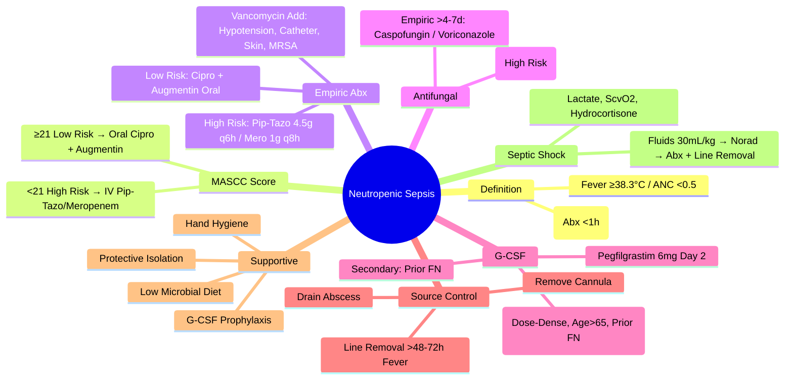

# Neutropenic Sepsis

> [!tip] **FCPS/MRCP Priority: HIGH**
> **Neutropenic Sepsis = Oncologic Emergency**; **Definition**: Fever ≥38.3°C (Single) or ≥38.0°C Sustained >1h **AND** ANC <0.5×10⁹/L (or <1.0 Predicted to Fall); **MASCC Score ≥21 = Low Risk (Oral Outpatient)**, **<21 = High Risk (IV Inpatient)**; **Empiric IV: Piperacillin-Tazobactam 4.5g q6h OR Meropenem 1g q8h**; **Add Vancomycin if Hypotension/Catheter/Skin/MRSA**; **G-CSF Prophylaxis if Risk >20%**; **Antifungal (Caspofungin/Amphotericin) if Fever >4-7d**.

---

## 1. Learning Objectives
By the end of this note you should be able to:
- [ ] Apply **diagnostic criteria** for neutropenic sepsis
- [ ] Calculate **MASCC Score** for risk stratification (Outpatient vs Inpatient)
- [ ] Prescribe **empiric IV antibiotics** (Piperacillin-Tazobactam / Meropenem)
- [ ] Indicate **vancomycin** and **antifungal** escalation
- [ ] Apply **G-CSF prophylaxis** criteria
- [ ] Implement **infection control** (Isolation, Hand Hygiene)
- [ ] Recognise **source control** principles (Line Removal, Drainage)
- [ ] Manage **fever of unknown origin** in neutropenic patients

---

## 2. Definition & Diagnostic Criteria

| Criterion | Threshold |
|-----------|-----------|
| **Fever** | **≥38.3°C (Single Reading)** OR **≥38.0°C Sustained >1 Hour** |
| **Neutropenia** | **ANC <0.5 ×10⁹/L** OR **<1.0 ×10⁹/L Predicted to Fall to <0.5** |
| **ANC Calculation** | **WBC × (% Neutrophils + % Bands) / 100** |

> **Time is Critical**: **Antibiotics Within 1 Hour** of Presentation (Sepsis-6 / NICE)

---

## 3. MASCC Risk Index (Multinational Association for Supportive Care in Cancer)

| Factor | Score |
|--------|-------|
| **Burden of Illness** | **No/Little (5)**, **Moderate (3)**, **Severe (0)** |
| **No Hypotension (SBP >90)** | **5** |
| **No COPD** | **4** |
| **Solid Tumour / No Prior Fungal Infection** | **4** |
| **No Dehydration (Oral Fluids Tolerated)** | **3** |
| **Outpatient Status (At Onset)** | **3** |
| **Age <60 Years** | **2** |

| Total Score | Risk Category | Management |
|-------------|---------------|------------|
| **≥21** | **Low Risk** | **Oral Antibiotics (Ciprofloxacin + Amoxicillin/Clavulanate) ×5-7 Days, Outpatient** |
| **<21** | **High Risk** | **IV Antibiotics (Piperacillin-Tazobactam / Meropenem), Inpatient** |

> **Validation**: NPV 91-98% for Low Risk; **Clinical Judgement Always Supersedes Score**

---

## 4. Empiric Antibiotic Therapy

### High Risk (MASCC <21) — IV Inpatient

| Regimen | Dose | Coverage |
|---------|------|----------|
| **Piperacillin-Tazobactam** | **4.5g IV q6h** (Extended Infusion 4h Preferred) | **Pseudomonas, ESBL, Anaerobes, Gram-Negative, Gram-Positive** — **Preferred Monotherapy** |
| **Meropenem** | **1g IV q8h** (Extended Infusion 3h) | **Carbapenem Alternative** (Beta-Lactam Allergy, ESBL High Prevalence) |
| **Cefepime** | **2g IV q8-12h** | **Alternative** (If Pip-Tazo/Mero Contraindicated) |

### Add-On Vancomycin (15-20mg/kg IV q12h) — If ANY:
- **Haemodynamic Instability** (Hypotension, Septic Shock)
- **Suspected Catheter-Related Infection** (Line Present)
- **Skin/Soft Tissue Infection** (Cellulitis, Abscess)
- **Known MRSA Colonisation/History**
- **Severe Mucositis** (Grade 3-4)
- **Penicillin/Beta-Lactam Allergy** (If Using Non-Beta-Lactam Regimen)

### Low Risk (MASCC ≥21) — Oral Outpatient

| Regimen | Dose |
|---------|------|
| **Ciprofloxacin 500mg BD + Amoxicillin/Clavulanate 625mg TDS** | **5-7 Days** |
| **Alternative: Levofloxacin 500mg OD** | If Quinolone Allergy/Contraindicated |

---

## 5. Antifungal Therapy

### Prophylaxis (Primary)

| Agent | Indication | Dose |
|-------|------------|------|
| **Fluconazole** | **Standard** (Candida) | **400mg OD PO/IV** |
| **Posaconazole** | **High-Risk** (AML Induction, Allo-HSCT, GVHD) | **300mg OD PO/IV** (Delayed-Release Tablet) |
| **Micafungin/Anidulafungin** | **Alternative** (If Azole Contraindicated) | **50mg/100mg OD IV** |

### Empiric Therapy (Persistent Fever >4-7 Days)

| Agent | Dose | Indication |
|-------|------|------------|
| **Caspofungin** | **70mg IV Load → 50mg OD IV** | **First-Line Echinocandin** |
| **Micafungin** | **100mg OD IV** | **Alternative Echinocandin** |
| **Liposomal Amphotericin B** | **3-5mg/kg OD IV** | **Refractory / Moulds / CNS** |
| **Voriconazole** | **6mg/kg q12h IV Load → 4mg/kg q12h** | **Aspergillus / Moulds** (Therapeutic Drug Monitoring) |

### Targeted Therapy (Documented Infection)

| Pathogen | Preferred Agent |
|----------|-----------------|
| **Candida (Non-Albicans / Fluconazole-Resistant)** | **Echinocandin (Caspofungin/Micafungin)** |
| **Candida albicans** | **Fluconazole** (If Susceptible) |
| **Aspergillus** | **Voriconazole** (1st Line) / **Isavuconazole** / **Liposomal AmB** |
| **Mucormycosis** | **Liposomal AmB 5-10mg/kg** → **Posaconazole Maintenance** |
| **Pneumocystis (PCP)** | **Co-trimoxazole** (TMP/SMX) / **IV Pentamidine** |

---

## 6. G-CSF Prophylaxis (Granulocyte Colony-Stimulating Factor)

| Indication | Agent |
|------------|-------|
| **Primary Prophylaxis** | **FN Risk >20%** (e.g., Dose-Dense Chemo, Age >65, Comorbidities, Prior FN, Extensive Disease) |
| **Secondary Prophylaxis** | **Prior Episode of FN** (Any Cycle) |
| **Agent** | **Filgrastim 5mcg/kg SC Daily** (Until ANC >10 ×10⁹/L Post-Nadir) **OR Pegfilgrastim 6mg SC Single Dose (Day 2 Post-Chemo)** |
| **Contraindication** | **Concurrent Chemo/Radiotherapy** (Theoretical Tumour Stimulation) — **Start 24-72h Post-Chemo** |

---

## 7. Supportive Care & Monitoring

### Isolation & Infection Control

| Measure | Detail |
|---------|--------|
| **Protective Isolation** | **Single Room, Positive Pressure** (If Available) |
| **Hand Hygiene** | **5 Moments**, **Alcohol Gel / Chlorhexidine** |
| **PPE** | **Gloves, Apron, Mask (If Aerosol-Generating)** |
| **Visitor Restriction** | **Minimise**, **Screen for Symptoms** |
| **Diet** | **Low Microbial** (No Raw Meat/Fish, Unpasteurised Dairy, Unwashed Salad) |

### Daily Monitoring (Inpatient)

| Parameter | Frequency |
|-----------|-----------|
| **Temperature** | **q4-6h** (Continuous if Septic) |
| **Haemodynamics** | **BP, HR q1-2h** (Unstable: Continuous) |
| **Bloods** | **CBC (Daily), CRP, U&E, LFTs, Coagulation, Lactate (q6-12h if Unstable)** |
| **Microbiology** | **Blood Cultures ×2 Sets (Peripheral + Line) PRE-Antibiotics**, **Urine, Sputum, Wound Swabs, Stool** |
| **Chest X-ray** | **Daily if Pneumonia Suspected** |
| **Line Sites** | **Daily Inspection** (Phlebitis, Purulence) |

---

## 8. Source Control & Line Management

| Situation | Action |
|-----------|--------|
| **Tunnelled Line (Hickman, Port)** | **If Fever Persists >48-72h on Antibiotics** → **Remove & Culture Tip** |
| **Peripheral Cannula** | **Remove if Phlebitis/Suspected Source** |
| **Abscess/Collection** | **Percutaneous Drainage + Culture** |
| **Skin/Soft Tissue** | **Debridement if Necrotic** |
| **Catheter Tip Culture** | **≥15 CFU = Catheter-Related Bacteraemia** |

---

## 9. Complications & Escalation

### Septic Shock

| Step | Action |
|------|--------|
| **1. Fluid Resuscitation** | **30mL/kg Crystalloid Bolus** (Crystalloid, Balanced) |
| **2. Vasopressors** | **Norepinephrine 1st Line** (Target MAP ≥65) → **Vasopressin 0.03U/min 2nd Line** |
| **3. Antibiotics** | **Broad Spectrum (Pip-Tazo/Mero + Vancomycin)** within 1 Hour |
| **4. Source Control** | **Line Removal, Drainage** |
| **5. Corticosteroids** | **Hydrocortisone 200mg/day** (If Vasopressor-Refractory) |
| **6. Monitoring** | **Lactate q2-4h**, **ScvO2**, **Urine Output**, **Echo (If Available)** |

### ICU Referral Criteria

- **Vasopressor Requirement**
- **Mechanical Ventilation**
- **GCS <13 / Confusion**
- **Lactate >4 mmol/L Despite Resuscitation**
- **Multiorgan Failure**

---

## 10. FCPS/MRCP High-Yield Summary

| Topic | Key Points |
|-------|------------|
| **Definition** | **Fever ≥38.3°C (Single) / ≥38.0°C >1h + ANC <0.5** (or <1.0 Predicted) |
| **MASCC Score** | **≥21 = Low Risk (Oral Outpatient)**; **<21 = High Risk (IV Inpatient)** |
| **Empiric IV** | **Piperacillin-Tazobactam 4.5g q6h** OR **Meropenem 1g q8h** (Monotherapy) |
| **Vancomycin Add** | **Hypotension, Catheter, Skin/Soft Tissue, MRSA, Severe Mucositis** |
| **G-CSF Prophylaxis** | **Risk >20%** (Dose-Dense, Age>65, Prior FN) → **Pegfilgrastim 6mg Day 2** |
| **Antifungal** | **>4-7d Fever** → **Caspofungin 70/50mg**; **Moulds → Voriconazole/Liposomal AmB** |
| **Line Removal** | **Persistent Fever >48-72h** → **Remove & Culture Tip** |
| **Isolation** | **Protective (Positive Pressure), Hand Hygiene, Low Microbial Diet** |
| **Septic Shock** | **Fluids 30mL/kg → Norepinephrine → Broad Abx + Line Removal within 1h** |

---

## 11. Viva Questions (MRCP PACES / FCPS)

| Question | Expected Answer |
|----------|-----------------|
| **Neutropenic Sepsis Definition?** | **Fever ≥38.3°C (Single) OR ≥38.0°C >1h + ANC <0.5 ×10⁹/L (or <1.0 Predicted)**. |
| **MASCC Score — Components, Cutoff?** | **Burden of Illness (5/3/0), No Hypotension (5), No COPD (4), Solid Tumour/No Prior Fungal (4), No Dehydration (3), Outpatient (3), Age<60 (2)** → **≥21 Low Risk (Oral), <21 High Risk (IV)**. |
| **Empiric IV Antibiotics for High-Risk?** | **Piperacillin-Tazobactam 4.5g q6h** OR **Meropenem 1g q8h** (Monotherapy Preferred). |
| **When to Add Vancomycin?** | **Hypotension, Catheter, Skin/Soft Tissue, MRSA, Severe Mucositis, Penicillin Allergy (If Non-Beta-Lactam)**. |
| **G-CSF Prophylaxis — Indications?** | **Primary: FN Risk >20%** (Dose-Dense, Age>65, Prior FN, Comorbidities); **Secondary: Prior FN Episode**. |
| **Antifungal — When to Start?** | **Persistent Fever >4-7 Days on IV Antibiotics** → **Caspofungin 70/50mg q24h** (Echinocandin); **Moulds: Voriconazole/Liposomal AmB**. |
| **Line Removal — When?** | **Persistent Fever >48-72h on Appropriate Antibiotics** → **Remove, Culture Tip (≥15 CFU = CRBSI)**. |
| **Septic Shock in Neutropenic Patient — 1st Hour?** | **Fluids 30mL/kg Crystalloid → Norepinephrine (MAP≥65) → Broad Abx (Pip-Tazo + Vanco) + Line Removal + Lactate q2h**. |
| **Antifungal Prophylaxis — High-Risk?** | **Posaconazole 300mg OD** (AML Induction, Allo-HSCT, GVHD); **Fluconazole 400mg Standard**. |
| **Empiric Oral Antibiotics for Low-Risk (MASCC ≥21)?** | **Ciprofloxacin 500mg BD + Amoxicillin/Clavulanate 625mg TDS ×5-7 Days**. |

---

## 12. Confusions & Mnemonics

| Confusion | Clarification |
|-----------|---------------|
| **ANC Calculation** | **WBC × (%Neutrophils + %Bands) / 100** — **Not Just Neutrophil % × WBC** |
| **MASCC Score Components** | **Burden (5/3/0), Hypotension (5), COPD (4), Solid Tumour (4), Dehydration (3), Outpatient (3), Age<60 (2)** |
| **Ciprofloxacin + Amoxicillin/Clavulanate** | **Covers Gram-Neg (Cipro) + Gram-Pos/Anaerobes (Augmentin)** — **Low-Risk Oral Regimen** |
| **Pip-Tazo vs Meropenem** | **Pip-Tazo Preferred (Monotherapy, Anti-Pseudomonal, Anti-Anaerobic)**; **Meropenem: Beta-Lactam Allergy, High ESBL Prevalence** |
| **Vancomycin Indications** | **Only Add If: Hypotension, Catheter, Skin/Soft Tissue, MRSA, Severe Mucositis** — **Not Routine** |
| **Fever Duration for Antifungal** | **>4-7 Days on IV Abx** → **Empiric Echinocandin (Caspofungin)** |
| **Line Removal Timing** | **>48-72h Persistent Fever** on Appropriate Abx → **Remove & Culture** |
| **G-CSF Timing** | **Start 24-72h Post-Chemo** (Avoid Concurrent — Theoretical Tumour Stimulation) |
| **ANC <0.5 vs <1.0** | **<0.5 = Severe Neutropenia (High Risk)**; **<1.0 Predicted to Fall = Prophylaxis Indication** |

**Mnemonic: NEUTROPENIC-SEPSIS**
- **N**eutropenia: **ANC <0.5** (or <1.0 Predicted)
- **E**mergency: **Fever ≥38.3°C / 38.0°C >1h**
- **U**rgent Abx: **Within 1 Hour** (Sepsis-6)
- **T**riage: **MASCC ≥21 Oral, <21 IV**
- **R**isk: **MASCC Components (Burden, Hypotension, COPD, Solid, Dehydration, Outpatient, Age)**
- **O**ptional Vancomycin: **Hypotension, Catheter, Skin, MRSA, Mucositis**
- **P**ip-Tazo / Meropenem: **IV Monotherapy High-Risk**
- **E**nteral Oral: **Cipro + Augmentin (Low-Risk MASCC≥21)**
- **N**eutropenic **S**eptic Shock: **Fluids 30mL/kg → Norad → Abx + Line Removal**
- **E**chinocandin: **Caspofungin 70/50mg (Antifungal >4-7d Fever)**
- **P**osaconazole: **Prophylaxis High-Risk (AML, HSCT, GVHD)**
- **I**solated Line Removal: **>48-72h Persistent Fever**
- **C**orticosteroids: **Not Routine (Hydrocortisone 200mg if Vasopressor-Refractory)**
- **I**solate: **Protective Isolation, Low Microbial Diet**
- **S**ource Control: **Line Removal, Drainage, Debridement**

---

## 13. Mind Map

---

## 14. One-Page Revision Card

| Domain | Key Points |
|--------|------------|
| **Definition** | Fever ≥38.3°C + ANC <0.5 (or <1.0 Predicted) |
| **MASCC** | ≥21 = Low (Oral Cipro+Aug); <21 = High (IV Pip-Tazo/Mero) |
| **High-Risk IV** | Pip-Tazo 4.5g q6h / Mero 1g q8h |
| **Vancomycin** | Hypotension, Catheter, Skin, MRSA, Mucositis |
| **Antifungal** | >4-7d Fever → Caspofungin; Moulds → Vori/AmB |
| **G-CSF** | Risk>20% (Dose-Dense, Age>65, Prior FN) → Pegfilgrastim 6mg |
| **Line Removal** | >48-72h Persistent Fever |
| **Septic Shock** | Fluids 30mL/kg → Norad → Broad Abx + Line Removal |
| **Isolation** | Protective, Low Microbial Diet, Hand Hygiene |

---

## 15. Spaced Repetition Trackers

| Review Interval | Date Completed | Confidence (1-5) | Notes |
|-----------------|----------------|------------------|-------|
| 24 hours | | | |
| 7 days | | | |
| 15 days | | | |
| 30 days | | | |
| 90 days | | | |

---

## 16. Self-Test Scorecard

| Section | Score /5 | Last Attempt |
|---------|----------|--------------|
| Definition & MASCC | | |
| Empiric Antibiotic Selection | | |
| Vancomycin Indications | | |
| Antifungal Escalation | | |
| G-CSF Prophylaxis Criteria | | |
| Line Management | | |
| Septic Shock Management | | |
| Isolation Precautions | | |

---

## 17. Local Navigation
- **Parent Heading**: [[../Oncology|Oncology]]
- **Chapter Map": [[../Davidson Chapter 7 - Oncology Hierarchy|Oncology Hierarchy]]
- **Chapter MOC": [[../Oncology MOC|Oncology MOC]]
- **Drug Reference": [[../../Clinical Therapeutics and Good Prescribing|Drugs]]
- **Related": [[MASCC Score]], [[Febrile Neutropenia]], [[Piperacillin-Tazobactam]], [[Meropenem]], [[G-CSF]], [[Antifungal Prophylaxis]], [[Sepsis]], [[Vancomycin]], [[Caspofungin]], [[Posaconazole]], [[Oncologic Emergencies]]

---

# FCPS/MRCP Exam Extras

## 18. MCQs (10)

**1.** Regarding Neutropenic Sepsis (Definition), which statement is correct?
   A. **Fever ≥38.3°C (Single) / ≥38.0°C >1h + ANC <0.5** (or <1.0 Predicted)
   B. **Fever - alternative approach
   C. Empirical management only
   D. Watch and wait
   - **Answer: A** — **Fever ≥38.3°C (Single) / ≥38.0°C >1h + ANC <0.5** (or <1.0 Predicted)

**2.** Regarding Neutropenic Sepsis (MASCC Score), which statement is correct?
   A. **≥21 = Low Risk (Oral Outpatient)**
   B. **≥21 - alternative approach
   C. Empirical management only
   D. Watch and wait
   - **Answer: A** — **≥21 = Low Risk (Oral Outpatient)**; **<21 = High Risk (IV Inpatient)**

**3.** Regarding Neutropenic Sepsis (Empiric IV), which statement is correct?
   A. **Piperacillin-Tazobactam 4.5g q6h** OR **Meropenem 1g q8h** (Monotherapy)
   B. **Piperacillin-Tazobactam - alternative approach
   C. Empirical management only
   D. Watch and wait
   - **Answer: A** — **Piperacillin-Tazobactam 4.5g q6h** OR **Meropenem 1g q8h** (Monotherapy)

**4.** Regarding Neutropenic Sepsis (Vancomycin Add), which statement is correct?
   A. **Hypotension, Catheter, Skin/Soft Tissue, MRSA, Severe Mucositis**
   B. **Hypotension, - alternative approach
   C. Empirical management only
   D. Watch and wait
   - **Answer: A** — **Hypotension, Catheter, Skin/Soft Tissue, MRSA, Severe Mucositis**

**5.** Regarding Neutropenic Sepsis (G-CSF Prophylaxis), which statement is correct?
   A. **Risk >20%** (Dose-Dense, Age>65, Prior FN) → **Pegfilgrastim 6mg Day 2**
   B. **Risk - alternative approach
   C. Empirical management only
   D. Watch and wait
   - **Answer: A** — **Risk >20%** (Dose-Dense, Age>65, Prior FN) → **Pegfilgrastim 6mg Day 2**

**6.** Regarding Neutropenic Sepsis (Antifungal), which statement is correct?
   A. **>4-7d Fever** → **Caspofungin 70/50mg**
   B. **>4-7d - alternative approach
   C. Empirical management only
   D. Watch and wait
   - **Answer: A** — **>4-7d Fever** → **Caspofungin 70/50mg**; **Moulds → Voriconazole/Liposomal AmB**

**7.** Regarding Neutropenic Sepsis (Line Removal), which statement is correct?
   A. **Persistent Fever >48-72h** → **Remove & Culture Tip**
   B. **Persistent - alternative approach
   C. Empirical management only
   D. Watch and wait
   - **Answer: A** — **Persistent Fever >48-72h** → **Remove & Culture Tip**

**8.** Regarding Neutropenic Sepsis (Isolation), which statement is correct?
   A. **Protective (Positive Pressure), Hand Hygiene, Low Microbial Diet**
   B. **Protective - alternative approach
   C. Empirical management only
   D. Watch and wait
   - **Answer: A** — **Protective (Positive Pressure), Hand Hygiene, Low Microbial Diet**

**9.** Regarding Neutropenic Sepsis (Septic Shock), which statement is correct?
   A. **Fluids 30mL/kg → Norepinephrine → Broad Abx + Line Removal within 1h**
   B. **Fluids - alternative approach
   C. Empirical management only
   D. Watch and wait
   - **Answer: A** — **Fluids 30mL/kg → Norepinephrine → Broad Abx + Line Removal within 1h**

**10.** Regarding Neutropenic Sepsis (FCPS/MRCP High Yield - Neutropenic Sepsi), which statement is correct?
   - A. FCPS/MRCP High Yield - Neutropenic Sepsis: Fever ≥38
   - B. Empirical approach without specific indication
   - C. Used only in research protocols
   - D. Not relevant in current practice
   - **Answer: A** — FCPS/MRCP High Yield - Neutropenic Sepsis: Fever ≥38

## 19. SBA Questions (10)

**1.** A 55-year-old presents with classic features. MDT discussion recommends:
   - A. **Fever ≥38.3°C (Single) / ≥38.0°C >1h + ANC <0.5** (or <1.0 Predicted)
   - B. **Fever (less specific)
   - C. Empirical broad approach
   - D. No intervention required
   - **Answer: A** — first-line: **Fever ≥38.3°C (Single) / ≥38.0°C >1h + ANC <0.5** (or <1.0 Predicted)

**2.** On staging workup, the patient is found to be [Stage X]. Best management is:
   - A. **≥21 = Low Risk (Oral Outpatient)**
   - B. **≥21 (less specific)
   - C. Empirical broad approach
   - D. No intervention required
   - **Answer: A** — stage-specific: **≥21 = Low Risk (Oral Outpatient)**; **<21 = High Risk (IV Inpatient)**

**3.** Following first-line treatment, the patient develops [complication]. Best next step:
   - A. **Piperacillin-Tazobactam 4.5g q6h** OR **Meropenem 1g q8h** (Monotherapy)
   - B. **Piperacillin-Tazobactam (less specific)
   - C. Empirical broad approach
   - D. No intervention required
   - **Answer: A** — complication: **Piperacillin-Tazobactam 4.5g q6h** OR **Meropenem 1g q8h** (Monotherapy)

**4.** The patient asks about prognosis. Most appropriate response based on:
   - A. **Hypotension, Catheter, Skin/Soft Tissue, MRSA, Severe Mucositis**
   - B. **Hypotension, (less specific)
   - C. Empirical broad approach
   - D. No intervention required
   - **Answer: A** — prognosis: **Hypotension, Catheter, Skin/Soft Tissue, MRSA, Severe Mucositis**

**5.** A 65-year-old with relevant risk factors should be screened with:
   - A. **Risk >20%** (Dose-Dense, Age>65, Prior FN) → **Pegfilgrastim 6mg Day 2**
   - B. **Risk (less specific)
   - C. Empirical broad approach
   - D. No intervention required
   - **Answer: A** — screening: **Risk >20%** (Dose-Dense, Age>65, Prior FN) → **Pegfilgrastim 6mg Day 2**

**6.** The most clinically important biomarker/molecular test is:
   - A. **>4-7d Fever** → **Caspofungin 70/50mg**
   - B. **>4-7d (less specific)
   - C. Empirical broad approach
   - D. No intervention required
   - **Answer: A** — biomarker: **>4-7d Fever** → **Caspofungin 70/50mg**; **Moulds → Voriconazole/Liposomal AmB**

**7.** The standard chemotherapy/regimen of choice is:
   - A. **Persistent Fever >48-72h** → **Remove & Culture Tip**
   - B. **Persistent (less specific)
   - C. Empirical broad approach
   - D. No intervention required
   - **Answer: A** — chemo: **Persistent Fever >48-72h** → **Remove & Culture Tip**

**8.** The role of surgery in this case is:
   - A. **Protective (Positive Pressure), Hand Hygiene, Low Microbial Diet**
   - B. **Protective (less specific)
   - C. Empirical broad approach
   - D. No intervention required
   - **Answer: A** — surgery: **Protective (Positive Pressure), Hand Hygiene, Low Microbial Diet**

**9.** The recommended surveillance/follow-up protocol is:
   - A. **Fluids 30mL/kg → Norepinephrine → Broad Abx + Line Removal within 1h**
   - B. **Fluids (less specific)
   - C. Empirical broad approach
   - D. No intervention required
   - **Answer: A** — follow-up: **Fluids 30mL/kg → Norepinephrine → Broad Abx + Line Removal within 1h**

**10.** A clinician encounters this presentation. Best approach:
   - A. FCPS/MRCP High Yield - Neutropenic Sepsis: Fever ≥38
   - B. Watch and wait approach
   - C. Empirical broad treatment
   - D. No intervention required
   - **Answer: A** — FCPS/MRCP High Yield - Neutropenic Sepsis: Fever ≥38

## 20. Flashcards

**Q1:** Definition?
**A1:** Fever ≥38.3°C (Single) / ≥38.0°C >1h + ANC <0.5 (or <1.0 Predicted)

**Q2:** MASCC Score?
**A2:** ≥21 = Low Risk (Oral Outpatient); <21 = High Risk (IV Inpatient)

**Q3:** Empiric IV?
**A3:** Piperacillin-Tazobactam 4.5g q6h OR Meropenem 1g q8h (Monotherapy)

**Q4:** Vancomycin Add?
**A4:** Hypotension, Catheter, Skin/Soft Tissue, MRSA, Severe Mucositis

**Q5:** G-CSF Prophylaxis?
**A5:** Risk >20% (Dose-Dense, Age>65, Prior FN) → Pegfilgrastim 6mg Day 2

**Q6:** Antifungal?
**A6:** >4-7d Fever → Caspofungin 70/50mg; Moulds → Voriconazole/Liposomal AmB

**Q7:** Line Removal?
**A7:** Persistent Fever >48-72h → Remove & Culture Tip

**Q8:** Isolation?
**A8:** Protective (Positive Pressure), Hand Hygiene, Low Microbial Diet

## 21. Answer Key with Explanations

| # | MCQ | Topic | Explanation |
|---|-----|-------|-------------|
| 1 | A | Definition | Fever ≥38.3°C (Single) / ≥38.0°C >1h + ANC <0.5 (or <1.0 Predicted) |
| 2 | A | MASCC Score | ≥21 = Low Risk (Oral Outpatient); <21 = High Risk (IV Inpatient) |
| 3 | A | Empiric IV | Piperacillin-Tazobactam 4.5g q6h OR Meropenem 1g q8h (Monotherapy) |
| 4 | A | Vancomycin Add | Hypotension, Catheter, Skin/Soft Tissue, MRSA, Severe Mucositis |
| 5 | A | G-CSF Prophylaxis | Risk >20% (Dose-Dense, Age>65, Prior FN) → Pegfilgrastim 6mg Day 2 |
| 6 | A | Antifungal | >4-7d Fever → Caspofungin 70/50mg; Moulds → Voriconazole/Liposomal AmB |
| 7 | A | Line Removal | Persistent Fever >48-72h → Remove & Culture Tip |
| 8 | A | Isolation | Protective (Positive Pressure), Hand Hygiene, Low Microbial Diet |
| 9 | A | Septic Shock | Fluids 30mL/kg → Norepinephrine → Broad Abx + Line Removal within 1h |
| 10 | A | FCPS/MRCP High Yield - Neutropenic Sepsis | FCPS/MRCP High Yield - Neutropenic Sepsis: Fever ≥38 |

| # | SBA | Topic | Explanation |
|---|-----|-------|-------------|
| 1 | A | Definition | Fever ≥38.3°C (Single) / ≥38.0°C >1h + ANC <0.5 (or <1.0 Predicted) |
| 2 | A | MASCC Score | ≥21 = Low Risk (Oral Outpatient); <21 = High Risk (IV Inpatient) |
| 3 | A | Empiric IV | Piperacillin-Tazobactam 4.5g q6h OR Meropenem 1g q8h (Monotherapy) |
| 4 | A | Vancomycin Add | Hypotension, Catheter, Skin/Soft Tissue, MRSA, Severe Mucositis |
| 5 | A | G-CSF Prophylaxis | Risk >20% (Dose-Dense, Age>65, Prior FN) → Pegfilgrastim 6mg Day 2 |
| 6 | A | Antifungal | >4-7d Fever → Caspofungin 70/50mg; Moulds → Voriconazole/Liposomal AmB |
| 7 | A | Line Removal | Persistent Fever >48-72h → Remove & Culture Tip |
| 8 | A | Isolation | Protective (Positive Pressure), Hand Hygiene, Low Microbial Diet |
| 9 | A | Septic Shock | Fluids 30mL/kg → Norepinephrine → Broad Abx + Line Removal within 1h |

| 11 | A | FCPS/MRCP High Yield - Neutropenic Sepsis | FCPS/MRCP High Yield - Neutropenic Sepsis: Fever ≥38 |
## 22. Local Navigation

- **Parent Heading Hub**: [[../../Oncologic Emergencies|Oncologic Emergencies]]
- **Chapter Map**: [[../../Davidson Chapter 7 - Oncology Hierarchy|Oncology Hierarchy]]
- **Chapter MOC**: [[../../Oncology MOC|Oncology MOC]]
- **Drug Reference**: [[../../../Clinical Therapeutics and Good Prescribing|Drugs]]

