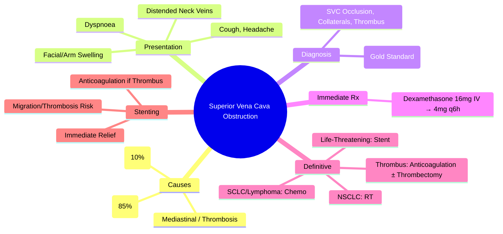

# Superior Vena Cava Obstruction (SVCO)

> [!tip] **FCPS/MRCP Priority: HIGH**
> **SVCO = Oncologic Emergency from SVC Compression/Invasion/Thrombosis**; **Lung Cancer 85%** (NSCLC, SCLC), **Lymphoma 10%** (HL, NHL), **Mediastinal Tumours** (Thymoma, Germ Cell); **Dexamethasone 16mg IV Stat → 4mg q6h**; **RT (NSCLC)**, **Chemo (SCLC/Lymphoma)**, **Stenting** (Immediate Relief, Life-Threatening, Thrombus); **Anticoagulation if Thrombus**.

---

## 1. Learning Objectives
By the end of this note you should be able to:
- [ ] Recognise **clinical features** of SVCO
- [ ] Identify **common aetiologies** (Lung, Lymphoma, Mediastinal)
- [ ] Perform **urgent diagnostic workup** (CT Chest with Contrast)
- [ ] Initiate **immediate dexamethasone** therapy
- [ ] Select **definitive treatment**: RT, Chemo, Stenting, or Surgery
- [ ] Manage **thrombosis** with anticoagulation
- [ ] Determine **when stenting is indicated** vs RT vs Chemo

---

## 2. Aetiology & Epidemiology

| Cause | Frequency |
|-------|-----------|
| **Lung Cancer (NSCLC, SCLC)** | **85%** |
| **Lymphoma (HL, NHL)** | **10%** |
| **Mediastinal Tumours** (Thymoma, Germ Cell, Teratoma) | **5%** |
| **Benign** (Fibrosing Mediastinitis, Catheter/PICC Thrombosis, Aortic Aneurysm) | **Rare** |

---

## 3. Pathophysiology

| Mechanism | Description |
|-----------|-------------|
| **External Compression** | Tumour/Mass Compresses SVC Externally |
| **Invasion** | Tumour Invades SVC Wall |
| **Thrombosis** | Tumour-Induced Hypercoagulability + Stasis → Intraluminal Thrombus |
| **Combination** | Often Multiple Mechanisms Coexist |

---

## 4. Clinical Features

| Symptom/Sign | Frequency | Significance |
|--------------|-----------|--------------|
| **Dyspnoea** | 60-80% | Most Common |
| **Facial/Neck/Arm Swelling** | 50-70% | Classic (Collateral Formation) |
| **Cough** | 40-50% | |
| **Distended Neck/Chest Veins** | 40-60% | Non-Pulsatile, Prominent |
| **Headache/Confusion** | Cerebral Oedema (Late) | Poor Prognostic Sign |
| **Orthopnoea** | | |
| **Stridor** | | Airway Compromise (Late) |

---

## 5. Diagnosis & Investigations

| Investigation | Role | Key Findings |
|---------------|------|--------------|
| **CT Chest with IV Contrast** | **Gold Standard** | **SVC Narrowing/Occlusion**, Tumour Mass, Collateral Veins (Azygos, Internal Mammary), Thrombus |
| **MR Venography** | Alternative if CT Contraindicated | No Radiation, Good Soft Tissue |
| **Venography** | Invasive, Pre-Stent Assessment | Gold Standard for Thrombus |
| **Chest X-ray** | Initial Screening | Widened Mediastinum, Pleural Effusion |
| **Echocardiography** | Assess RA/RV, Pericardial Effusion | |
| **Biopsy** | Tissue Diagnosis (If Unknown) | CT-Guided / EBUS / Mediastinoscopy |

---

## 6. Management Algorithm

```mermaid
flowchart TD
    A[Suspected SVCO] --> B[**Dexamethasone 16mg IV Stat, Then 4mg q6h** (Reduce Oedema, Symptom Relief)]
    B --> C[**Imaging: CT Chest (Contrast) / Venography** — **Confirm Diagnosis, Assess Thrombus**]
    C --> D[**Oncology Referral: Tissue Diagnosis (If Not Known)**]
    D --> E{Treatment Approach}
    E -->|**SCLC / Lymphoma / Chemosensitive**| F[**Chemotherapy (Urgent)** — **Rapid Response**]
    E -->|**NSCLC / Radiosensitive / Symptomatic**| G[**RT: 30Gy/10fx or 20Gy/5fx (Rapid Palliation)**]
    E -->|**Severe / Life-Threatening / Thrombus**| H[**Stenting (Endovascular) — Immediate Relief**]
    E -->|**Thrombus Confirmed**| I[**Anticoagulation (LMWH) ± Thrombolysis/Thrombectomy**]
    F --> J[**Monitor: Symptoms, Venous Flow, Tumour Response**]
    G --> J
    H --> J
    I --> J
```

---

## 7. Treatment Modalities

### Dexamethasone
- **Dose**: **16mg IV Stat → 4mg q6h**
- **Role**: Reduces Peritumoural Oedema, Symptom Relief Within Hours
- **Duration**: Until Definitive Treatment Effective, Then Taper

### Radiotherapy
| Indication | Dose/Fractionation |
|------------|-------------------|
| **NSCLC (Radiosensitive, Not Life-Threatening)** | **30Gy/10fx** OR **20Gy/5fx** (Rapid) |
| **SCLC** | **Chemo Preferred** (RT if Residual Post-Chemo) |
| **Lymphoma** | **Chemo Preferred** (RT if Residual/Bulky) |

### Stenting (Endovascular)
| Indication | Details |
|------------|---------|
| **Life-Threatening** (Stridor, Cerebral Oedema, Severe Dyspnoea) | **Immediate Relief (Hours)** |
| **Thrombus** | **Stent ± Thrombolysis/Thrombectomy** |
| **Failed RT/Chemo** | **Salvage** |
| **Contraindication to RT/Chemo** | **Alternative** |
| **Technique** | **Self-Expanding Metallic Stent (Wallstent, Sinus)** |
| **Complications** | **Migration (5-10%), Thrombosis (5-15%), Infection, Erosion** |

### Chemotherapy
| Tumour | Regimen | Response Time |
|--------|---------|---------------|
| **SCLC** | **Cisplatin + Etoposide** (or Carboplatin) | **Days** (Rapid) |
| **Lymphoma (HL/NHL)** | **ABVD / R-CHOP / DA-EPOCH** | **Days-Weeks** |
| **NSCLC** | **Platinum Doublet** (If Chemosensitive Subtype) | **Weeks** |

### Anticoagulation (If Thrombus Confirmed)
- **LMWH (Enoxaparin 1mg/kg q12h)** → **DOAC/Warfarin** (Long-Term)
- **Thrombolysis/Thrombectomy** if Acute, Life-Threatening

---

## 8. RT vs Stenting Decision

| Factor | **RT** | **Stenting** |
|--------|--------|--------------|
| **Speed of Relief** | **Days** (2-3 Fractions) | **Immediate (Hours)** |
| **Durability** | **Longer** (If Response) | **Months** (Stent Patency ~6-12mo) |
| **Indication** | **Radiosensitive, Not Immediately Life-Threatening** | **Life-Threatening, Thrombus, Failed RT, Radioresistant** |
| **Complications** | **Oesophagitis, Pneumonitis, Myelosuppression** | **Migration, Thrombosis, Infection, Erosion** |
| **Cost** | **Lower** | **Higher** |

---

## 9. FCPS/MRCP High-Yield Summary

| Topic | Key Points |
|-------|------------|
| **SVCO Causes** | **Lung 85% (NSCLC/SCLC)**, **Lymphoma 10%**, Mediastinal, Thrombosis |
| **Presentation** | **Dyspnoea, Facial/Arm Swelling, Distended Veins, Cough, Headache/Confusion** |
| **Diagnosis** | **CT Chest with Contrast** (Gold Standard) — SVC Occlusion, Collaterals, Thrombus |
| **Immediate Rx** | **Dexamethasone 16mg IV → 4mg q6h** (Reduce Oedema) |
| **Definitive Rx** | **SCLC/Lymphoma: Chemo**; **NSCLC: RT**; **Life-Threatening: Stent** |
| **Stenting** | **Immediate Relief**; **Thrombus: Stent + Anticoagulation ± Thrombolysis** |
| **Anticoagulation** | **LMWH** if Thrombus; **DOAC/Warfarin Long-Term** |
| **RT Fractionation** | **30Gy/10fx or 20Gy/5fx** (Rapid Palliation) |

---

## 10. Viva Questions (MRCP PACES / FCPS)

| Question | Expected Answer |
|----------|-----------------|
| **SVCO — Most Common Cause?** | **Lung Cancer (85%)** — NSCLC > SCLC; **Lymphoma 10%**; **Mediastinal Tumours**. |
| **Immediate Management of Suspected SVCO?** | **Dexamethasone 16mg IV Stat → 4mg q6h** → **CT Chest with Contrast** → **Oncology Referral**. |
| **SVCO — When to Stent vs RT?** | **Stent: Life-Threatening (Stridor, Cerebral Oedema), Thrombus, Failed RT, Radioresistant**; **RT: Radiosensitive, Not Immediately Life-Threatening**. |
| **Stenting — Complications?** | **Migration (5-10%), Thrombosis (5-15%), Infection, Erosion, Fracture**. |
| **Anticoagulation in SVCO — When?** | **Confirmed Intraluminal Thrombus** → **LMWH → Warfarin/DOAC**; **Consider Thrombolysis/Thrombectomy if Acute/Severe**. |
| **Dexamethasone Dose in SVCO?** | **16mg IV Stat → 4mg q6h** (Reduce Peritumoural Oedema). |
| **SVCO vs MSCC — Key Clinical Difference?** | **SVCO**: Facial/Arm Swelling, Distended Neck Veins, No Motor Deficit; **MSCC**: Back Pain, Motor Weakness, Sensory Loss, Sphincter Dysfunction. |
| **RT Fractionation for SVCO?** | **30Gy/10fx** (Standard) OR **20Gy/5fx** (Rapid). |
| **SCLC SVCO — Best Treatment?** | **Chemotherapy (Cisplatin + Etoposide)** — Rapid Response (Days). |
| **Catheter-Related SVCO — Management?** | **Remove Catheter**, **Anticoagulation (LMWH)**, **Consider Thrombolysis/Thrombectomy** if Thrombus. |

---

## 11. Confusions & Mnemonics

| Confusion | Clarification |
|-----------|---------------|
| **SVCO vs MSCC** | **SVCO**: SVC Obstruction → Facial/Arm Swelling, Distended Veins; **MSCC**: Spinal Cord Compression → Back Pain, Motor/Sensory Deficit, Sphincter Dysfunction |
| **Stent vs RT — Speed** | **Stent**: Immediate (Hours); **RT**: Days (2-3 Fractions) |
| **SCLC vs NSCLC SVCO Treatment** | **SCLC**: Chemo (Rapid); **NSCLC**: RT (Radiosensitive) OR Stent (Radioresistant) |
| **Dexamethasone Dose** | **16mg IV Stat → 4mg q6h** (High Dose for Oedema Reduction) |
| **Stent Patency** | **6-12 Months Median**; **Anticoagulation May Prolong** |
| **Thrombus in SVCO** | **Anticoagulate (LMWH)**; **Consider Stent + Thrombolysis/Thrombectomy** |

**Mnemonic: SVCO-EMERGENCY**
- **S**VC Obstruction: **Lung 85%, Lymphoma 10%**
- **V**ena Cava: **Superior** (Inferior Rare)
- **C**ompression: **External, Invasion, Thrombosis**
- **O**nset: **Dyspnoea, Facial Swelling, Distended Veins**
- **E**mergency: **Dexamethasone 16mg IV Stat**
- **M**anage: **CT Chest Contrast → Tissue Dx**
- **E**arly **R**elief: **Stent (Life-Threatening) / RT (NSCLC) / Chemo (SCLC/Lymphoma)**
- **G**old Standard Imaging: **CT Chest Contrast**
- **E**ndovascular Stent: **Immediate Relief, Thrombus**
- **N**eo-adjuvant: **Chemo (SCLC/Lymphoma)**
- **C**omplications: **Migration, Thrombosis, Migration**
- **Y**ear Survival: **Poor (Median 3-6mo)** — **Treat Underlying Cancer**

---

## 12. Mind Map



---

## 13. One-Page Revision Card

| Domain | Key Points |
|--------|------------|
| **Causes** | Lung 85% (NSCLC/SCLC), Lymphoma 10%, Mediastinal, Thrombosis |
| **Symptoms** | Dyspnoea, Facial/Arm Swelling, Distended Veins, Cough |
| **Immediate** | Dexamethasone 16mg IV Stat → 4mg q6h |
| **Diagnosis** | CT Chest Contrast (SVC Occlusion, Collaterals) |
| **SCLC/Lymphoma** | Chemo (Rapid) |
| **NSCLC** | RT (30Gy/10fx or 20Gy/5fx) |
| **Life-Threatening** | Stent (Immediate) |
| **Thrombus** | LMWH ± Thrombolysis/Thrombectomy |
| **RT Fractionation** | 30Gy/10fx or 20Gy/5fx |
| **Dexamethasone** | 16mg IV Stat → 4mg q6h |

---

## 14. Spaced Repetition Trackers

| Review Interval | Date Completed | Confidence (1-5) | Notes |
|-----------------|----------------|------------------|-------|
| 24 hours | | | |
| 7 days | | | |
| 15 days | | | |
| 30 days | | | |
| 90 days | | | |

---

## 15. Self-Test Scorecard

| Section | Score /5 | Last Attempt |
|---------|----------|--------------|
| Aetiology & Presentation | | |
| Diagnostic Imaging | | |
| Immediate Management | | |
| Treatment Selection (Chemo/RT/Stent) | | |
| Stenting Indications | | |
| Thrombus Management | | |
| Dexamethasone Dosing | | |
| SVCO vs MSCC | | |

---

## 16. Local Navigation
- **Parent Heading**: [[../Oncology|Oncology]]
- **Chapter Map": [[../Davidson Chapter 7 - Oncology Hierarchy|Oncology Hierarchy]]
- **Chapter MOC": [[../Oncology MOC|Oncology MOC]]
- **Drug Reference": [[../../Clinical Therapeutics and Good Prescribing|Drugs]]
- **Related": [[MSCC]], [[Neutropenic Sepsis]], [[Hypercalcaemia]], [[TLS]], [[SIADH]], [[Airway Obstruction]], [[Oncologic Emergencies]], [[Stenting]], [[Dexamethasone]]

---

# FCPS/MRCP Exam Extras

## 17. MCQs (10)


**1.** Regarding Superior Vena Cava Obstruction (SVCO) (SVCO Causes), which statement is correct?
   A. **Lung 85% (NSCLC/SCLC)**, **Lymphoma 10%**, Mediastinal, Thrombosis
   B. **Lung - alternative approach
   C. Empirical management only
   D. Watch and wait
   - **Answer: A** — **Lung 85% (NSCLC/SCLC)**, **Lymphoma 10%**, Mediastinal, Thrombosis


**2.** Regarding Superior Vena Cava Obstruction (SVCO) (Presentation), which statement is correct?
   A. **Dyspnoea, Facial/Arm Swelling, Distended Veins, Cough, Headache/Confusion**
   B. **Dyspnoea, - alternative approach
   C. Empirical management only
   D. Watch and wait
   - **Answer: A** — **Dyspnoea, Facial/Arm Swelling, Distended Veins, Cough, Headache/Confusion**


**3.** Regarding Superior Vena Cava Obstruction (SVCO) (Diagnosis), which statement is correct?
   A. **CT Chest with Contrast** (Gold Standard)
   B. **CT - alternative approach
   C. Empirical management only
   D. Watch and wait
   - **Answer: A** — **CT Chest with Contrast** (Gold Standard) — SVC Occlusion, Collaterals, Thrombus


**4.** Regarding Superior Vena Cava Obstruction (SVCO) (Immediate Rx), which statement is correct?
   A. **Dexamethasone 16mg IV → 4mg q6h** (Reduce Oedema)
   B. **Dexamethasone - alternative approach
   C. Empirical management only
   D. Watch and wait
   - **Answer: A** — **Dexamethasone 16mg IV → 4mg q6h** (Reduce Oedema)


**5.** Regarding Superior Vena Cava Obstruction (SVCO) (Definitive Rx), which statement is correct?
   A. **SCLC/Lymphoma: Chemo**
   B. **SCLC/Lymphoma: - alternative approach
   C. Empirical management only
   D. Watch and wait
   - **Answer: A** — **SCLC/Lymphoma: Chemo**; **NSCLC: RT**; **Life-Threatening: Stent**


**6.** Regarding Superior Vena Cava Obstruction (SVCO) (Stenting), which statement is correct?
   A. **Immediate Relief**
   B. **Immediate - alternative approach
   C. Empirical management only
   D. Watch and wait
   - **Answer: A** — **Immediate Relief**; **Thrombus: Stent + Anticoagulation ± Thrombolysis**


**7.** Regarding Superior Vena Cava Obstruction (SVCO) (Anticoagulation), which statement is correct?
   A. **LMWH** if Thrombus
   B. **LMWH** - alternative approach
   C. Empirical management only
   D. Watch and wait
   - **Answer: A** — **LMWH** if Thrombus; **DOAC/Warfarin Long-Term**


**8.** Regarding Superior Vena Cava Obstruction (SVCO) (RT Fractionation), which statement is correct?
   A. **30Gy/10fx or 20Gy/5fx** (Rapid Palliation)
   B. **30Gy/10fx - alternative approach
   C. Empirical management only
   D. Watch and wait
   - **Answer: A** — **30Gy/10fx or 20Gy/5fx** (Rapid Palliation)


**9.** Regarding Superior Vena Cava Obstruction (SVCO) (FCPS/MRCP High Yield - SVCO), which statement is correct?
   - A. FCPS/MRCP High Yield - SVCO: Lung (85%), Lymphoma (10%), Mediastinal
   - B. Empirical approach without specific indication
   - C. Used only in research protocols
   - D. Not relevant in current practice
   - **Answer: A** — FCPS/MRCP High Yield - SVCO: Lung (85%), Lymphoma (10%), Mediastinal

**10.** Regarding Superior Vena Cava Obstruction (SVCO) (Key Point), which statement is correct?
   - A. Dexamethasone 16mg IV, RT (NSCLC), Stenting (Immediate/Thrombus), Chemo (SCLC/Lymphoma)
   - B. Empirical approach without specific indication
   - C. Used only in research protocols
   - D. Not relevant in current practice
   - **Answer: A** — Dexamethasone 16mg IV, RT (NSCLC), Stenting (Immediate/Thrombus), Chemo (SCLC/Lymphoma)

## 18. SBA Questions (10)


**1.** A 55-year-old presents with classic features. MDT discussion recommends:
   - A. **Lung 85% (NSCLC/SCLC)**, **Lymphoma 10%**, Mediastinal, Thrombosis
   - B. **Lung (less specific)
   - C. Empirical broad approach
   - D. No intervention required
   - **Answer: A** — first-line: **Lung 85% (NSCLC/SCLC)**, **Lymphoma 10%**, Mediastinal, Thrombosis


**2.** On staging workup, the patient is found to be [Stage X]. Best management is:
   - A. **Dyspnoea, Facial/Arm Swelling, Distended Veins, Cough, Headache/Confusion**
   - B. **Dyspnoea, (less specific)
   - C. Empirical broad approach
   - D. No intervention required
   - **Answer: A** — stage-specific: **Dyspnoea, Facial/Arm Swelling, Distended Veins, Cough, Headache/Confusion**


**3.** Following first-line treatment, the patient develops [complication]. Best next step:
   - A. **CT Chest with Contrast** (Gold Standard)
   - B. **CT (less specific)
   - C. Empirical broad approach
   - D. No intervention required
   - **Answer: A** — complication: **CT Chest with Contrast** (Gold Standard) — SVC Occlusion, Collaterals, Thrombus


**4.** The patient asks about prognosis. Most appropriate response based on:
   - A. **Dexamethasone 16mg IV → 4mg q6h** (Reduce Oedema)
   - B. **Dexamethasone (less specific)
   - C. Empirical broad approach
   - D. No intervention required
   - **Answer: A** — prognosis: **Dexamethasone 16mg IV → 4mg q6h** (Reduce Oedema)


**5.** A 65-year-old with relevant risk factors should be screened with:
   - A. **SCLC/Lymphoma: Chemo**
   - B. **SCLC/Lymphoma: (less specific)
   - C. Empirical broad approach
   - D. No intervention required
   - **Answer: A** — screening: **SCLC/Lymphoma: Chemo**; **NSCLC: RT**; **Life-Threatening: Stent**


**6.** The most clinically important biomarker/molecular test is:
   - A. **Immediate Relief**
   - B. **Immediate (less specific)
   - C. Empirical broad approach
   - D. No intervention required
   - **Answer: A** — biomarker: **Immediate Relief**; **Thrombus: Stent + Anticoagulation ± Thrombolysis**


**7.** The standard chemotherapy/regimen of choice is:
   - A. **LMWH** if Thrombus
   - B. **LMWH** (less specific)
   - C. Empirical broad approach
   - D. No intervention required
   - **Answer: A** — chemo: **LMWH** if Thrombus; **DOAC/Warfarin Long-Term**


**8.** The role of surgery in this case is:
   - A. **30Gy/10fx or 20Gy/5fx** (Rapid Palliation)
   - B. **30Gy/10fx (less specific)
   - C. Empirical broad approach
   - D. No intervention required
   - **Answer: A** — surgery: **30Gy/10fx or 20Gy/5fx** (Rapid Palliation)


**9.** A clinician encounters this presentation. Best approach:
   - A. FCPS/MRCP High Yield - SVCO: Lung (85%), Lymphoma (10%), Mediastinal
   - B. Watch and wait approach
   - C. Empirical broad treatment
   - D. No intervention required
   - **Answer: A** — FCPS/MRCP High Yield - SVCO: Lung (85%), Lymphoma (10%), Mediastinal

**10.** On evaluation, the finding is confirmed. Most appropriate next step:
   - A. Dexamethasone 16mg IV, RT (NSCLC), Stenting (Immediate/Thrombus), Chemo (SCLC/Lymphoma)
   - B. Watch and wait approach
   - C. Empirical broad treatment
   - D. No intervention required
   - **Answer: A** — Dexamethasone 16mg IV, RT (NSCLC), Stenting (Immediate/Thrombus), Chemo (SCLC/Lymphoma)

## 19. Flashcards

**Q1:** SVCO Causes?
**A1:** Lung 85% (NSCLC/SCLC), Lymphoma 10%, Mediastinal, Thrombosis

**Q2:** Presentation?
**A2:** Dyspnoea, Facial/Arm Swelling, Distended Veins, Cough, Headache/Confusion

**Q3:** Diagnosis?
**A3:** CT Chest with Contrast (Gold Standard) — SVC Occlusion, Collaterals, Thrombus

**Q4:** Immediate Rx?
**A4:** Dexamethasone 16mg IV → 4mg q6h (Reduce Oedema)

**Q5:** Definitive Rx?
**A5:** SCLC/Lymphoma: Chemo; NSCLC: RT; Life-Threatening: Stent

**Q6:** Stenting?
**A6:** Immediate Relief; Thrombus: Stent + Anticoagulation ± Thrombolysis

**Q7:** Anticoagulation?
**A7:** LMWH if Thrombus; DOAC/Warfarin Long-Term

**Q8:** RT Fractionation?
**A8:** 30Gy/10fx or 20Gy/5fx (Rapid Palliation)

## 20. Answer Key with Explanations

| # | MCQ | Topic | Explanation |
|---|-----|-------|-------------|
| 1 | A | SVCO Causes | Lung 85% (NSCLC/SCLC), Lymphoma 10%, Mediastinal, Thrombosis |
| 2 | A | Presentation | Dyspnoea, Facial/Arm Swelling, Distended Veins, Cough, Headache/Confusion |
| 3 | A | Diagnosis | CT Chest with Contrast (Gold Standard) — SVC Occlusion, Collaterals, Thrombus |
| 4 | A | Immediate Rx | Dexamethasone 16mg IV → 4mg q6h (Reduce Oedema) |
| 5 | A | Definitive Rx | SCLC/Lymphoma: Chemo; NSCLC: RT; Life-Threatening: Stent |
| 6 | A | Stenting | Immediate Relief; Thrombus: Stent + Anticoagulation ± Thrombolysis |
| 7 | A | Anticoagulation | LMWH if Thrombus; DOAC/Warfarin Long-Term |
| 8 | A | RT Fractionation | 30Gy/10fx or 20Gy/5fx (Rapid Palliation) |
| 9 | A | FCPS/MRCP High Yield - SVCO | FCPS/MRCP High Yield - SVCO: Lung (85%), Lymphoma (10%), Mediastinal |
| 10 | A | Dexamethasone 16mg IV, RT (NSCLC), Stenting (Immed | Dexamethasone 16mg IV, RT (NSCLC), Stenting (Immediate/Thrombus), Chemo (SCLC/Lymphoma) |

| # | SBA | Topic | Explanation |
|---|-----|-------|-------------|
| 1 | A | SVCO Causes | Lung 85% (NSCLC/SCLC), Lymphoma 10%, Mediastinal, Thrombosis |
| 2 | A | Presentation | Dyspnoea, Facial/Arm Swelling, Distended Veins, Cough, Headache/Confusion |
| 3 | A | Diagnosis | CT Chest with Contrast (Gold Standard) — SVC Occlusion, Collaterals, Thrombus |
| 4 | A | Immediate Rx | Dexamethasone 16mg IV → 4mg q6h (Reduce Oedema) |
| 5 | A | Definitive Rx | SCLC/Lymphoma: Chemo; NSCLC: RT; Life-Threatening: Stent |
| 6 | A | Stenting | Immediate Relief; Thrombus: Stent + Anticoagulation ± Thrombolysis |
| 7 | A | Anticoagulation | LMWH if Thrombus; DOAC/Warfarin Long-Term |
| 8 | A | RT Fractionation | 30Gy/10fx or 20Gy/5fx (Rapid Palliation) |

| 11 | A | FCPS/MRCP High Yield - SVCO | FCPS/MRCP High Yield - SVCO: Lung (85%), Lymphoma (10%), Mediastinal |
| 12 | A | Dexamethasone 16mg IV, RT (NSCLC), Stenting (Immed | Dexamethasone 16mg IV, RT (NSCLC), Stenting (Immediate/Thrombus), Chemo (SCLC/Lymphoma) |
## 21. Local Navigation


- **Parent Heading Hub**: [[../../Oncologic Emergencies|Oncologic Emergencies]]
- **Chapter Map**: [[../../Davidson Chapter 7 - Oncology Hierarchy|Oncology Hierarchy]]
- **Chapter MOC**: [[../../Oncology MOC|Oncology MOC]]
- **Drug Reference**: [[../../../Clinical Therapeutics and Good Prescribing|Drugs]]

