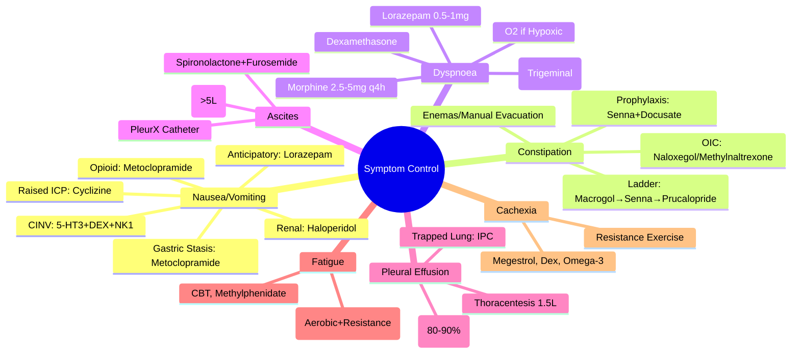

# Symptom Control in Palliative Care

> [!tip] **FCPS/MRCP Priority: HIGH**
> **Symptom Control = Core of Palliative Care**; **Nausea/Vomiting**: 5-HT3 (Ondansetron), NK1 (Aprepitant), Dopamine (Metoclopramide/Domperidone), Corticosteroids (Dexamethasone), Cannabinoid (Nabilone); **Constipation**: Osmotic (Macrogol), Stimulant (Senna), Prokinetic (Prucalopride), Enemas; **Dyspnoea**: Opioids (Morphine), Benzodiazepines (Lorazepam), Oxygen, Fan; **Malignant Ascites**: Paracentesis, Diuretics (Spironolactone), Shunt; **Pleural Effusion**: Thoracentesis, Pleurodesis (Talc, Doxycycline); **Fatigue/Cachexia**: Exercise, Psychostimulants, Corticosteroids, Nutritional Support.

---

## 1. Learning Objectives
By the end of this note you should be able to:
- [ ] Manage **Nausea & Vomiting** using mechanism-based antiemetics
- [ ] Treat **Constipation** with stepped laxative therapy
- [ ] Relieve **Dyspnoea** with opioids, benzodiazepines, oxygen, and non-pharmacological measures
- [ ] Manage **Malignant Ascites** with paracentesis, diuretics, and shunts
- [ ] Treat **Malignant Pleural Effusion** with thoracentesis and pleurodesis
- [ ] Address **Fatigue and Cachexia** with exercise, psychostimulants, corticosteroids, and nutrition

---

## 2. Nausea & Vomiting

### Pathophysiology & Receptor Targets

| Pathway | Receptors | Antiemetics |
|---------|-----------|-------------|
| **Chemoreceptor Trigger Zone (CTZ)** | **D2 (Dopamine)**, **5-HT3**, **NK1**, **H1**, **Muscarinic** | **Metoclopramide, Domperidone, Haloperidol, Levomepromazine**; **Ondansetron, Granisetron**; **Aprepitant, Fosaprepitant**; **Cyclizine, Cinnarizine**; **Hyoscine** |
| **Vestibular Apparatus** | **H1, Muscarinic** | **Cyclizine, Cinnarizine, Hyoscine** |
| **Cortex (Anticipatory)** | **5-HT3, NK1** | **Ondansetron, Aprepitant** |
| **GI Tract (Vagal Afferents)** | **5-HT3** | **Ondansetron, Granisetron** |

### Mechanism-Based Antiemetic Selection

| Cause of Nausea | First-Line | Second-Line / Add-On |
|-----------------|------------|---------------------|
| **Chemotherapy-Induced (CINV)** | **5-HT3 Antagonist (Ondansetron 8mg) + Dexamethasone 8-12mg ± NK1 Antagonist (Aprepitant 125mg Day 1, 80mg Days 2-3)** for Highly Emetogenic; **5-HT3 + Dex** for Moderately Emetogenic | **Levomepromazine 6.25mg SC/PO q4-6h**, **Olanzapine 2.5-5mg OD**, **Nabilone 1-2mg BD** |
| **Opioid-Induced** | **Metoclopramide 10mg q4-6h / Domperidone 10mg q4-6h** (Prokinetic) | **Haloperidol 0.5-1mg q4-6h**, **Cyclizine 50mg q8h** |
| **Raised ICP / Meningeal** | **Cyclizine 50mg q8h / Hyoscine 0.4mg SC q6-8h** | **Dexamethasone 8-16mg OD** |
| **Vestibular / Motion** | **Cyclizine / Cinnarizine / Hyoscine** | **Prochlorperazine** |
| **Gastric Stasis / Obstruction** | **Metoclopramide 10mg q4-6h / Domperidone 10mg q4-6h** | **Octreotide** (If Obstruction) |
| **Renal / Hepatic / Metabolic** | **Haloperidol 0.5-1mg q4-6h** (Renal Safe) | **Levomepromazine** |
| **Anticipatory** | **Lorazepam 0.5-1mg SL/PO** + **5-HT3/NK1** | **CBT, Hypnotherapy** |

### Antiemetic Prescribing Guide

| Drug | Route | Dose | Key Points |
|------|-------|------|------------|
| **Ondansetron** | PO/IV/SC | **8mg q8-12h** (Max 24mg/24h) | **QT Prolongation Risk**, Constipation, Headache |
| **Granisetron** | PO/IV/SC | **1-2mg OD** | **Transdermal Patch (3.1mg/24h ×7d)** |
| **Aprepitant** | PO | **125mg Day 1, 80mg Days 2-3** | **CYP3A4 Substrate**, **Dexamethasone Dose Reduce** |
| **Fosaprepitant** | IV | **150mg Day 1** | **IV Alternative** |
| **Dexamethasone** | PO/IV/SC | **8-12mg Day 1, 8mg Days 2-4** | **Potentiates 5-HT3/NK1**, **HIC** |
| **Metoclopramide** | PO/IV/SC | **10mg q4-6h** (Max 30mg/24h) | **Extrapyramidal SE**, **Avoid >5d** |
| **Domperidone** | PO/SC | **10mg q4-6h** | **No CNS SE**, **QT Risk** |
| **Haloperidol** | PO/IV/SC | **0.5-1mg q4-6h** | **Renal Safe**, **Extrapyramidal** |
| **Levomepromazine** | PO/SC | **6.25-25mg q4-6h** | **Broad Spectrum**, **Sedation**, **Hypotension** |
| **Cyclizine** | PO/IV/SC | **50mg q8h** | **Sedation**, **Anticholinergic** |
| **Hyoscine Butylbromide** | SC/IV | **20mg q4-6h** | **Anticholinergic**, **Dry Mouth** |
| **Nabilone** | PO | **1-2mg BD** | **Cannabinoid**, **Psychoactive** |
| **Olanzapine** | PO | **2.5-5mg OD** | **Broad Antiemetic**, **Sedation**, **Metabolic** |

---

## 3. Constipation

### Stepped Approach

| Step | Intervention | Dose |
|------|--------------|------|
| **1. Lifestyle** | **Fluids 2-3L/d, Fibre, Mobilisation, Toilet Routine** | — |
| **2. Osmotic Laxative** | **Macrogol (Movicol) 1-2 sachets BD** | **First-Line** |
| **3. Stimulant Laxative** | **Senna 15mg ON** (or BD) | **Add if Osmotic Inadequate** |
| **4. Prokinetic** | **Prucalopride 1-2mg OD** (If Stimulant Fails) | **2nd-Line** |
| **4. Enemas/Suppositories** | **Micro-enema (Phosphate), Glycerol Suppository, Arachis Oil Enema** | **Rectal Loading / Impaction** |
| **5. Manual Evacuation** | **If Faecal Impaction** | **Last Resort** |

### Opioid-Induced Constipation (OIC) — Specific Management

| Step | Intervention |
|------|--------------|
| **1. Prophylaxis** | **Senna 15mg ON + Docusate 100mg BD** (Start with Opioid) |
| **2. If Constipated** | **Add Macrogol 1-2 sachets BD** |
| **3. If Refractory** | **Prucalopride 1-2mg OD** / **Naloxegol 25mg OD** (Peripheral Opioid Antagonist) / **Methylnaltrexone 0.15mg/kg SC** (SC Injection) |
| **4. Avoid** | **Bulk-Forming (Ispaghula) if Obstruction Risk** |

---

## 4. Dyspnoea

### Multimodal Management

| Modality | Intervention | Dose/Details |
|----------|--------------|--------------|
| **Opioids** | **Morphine 2.5-5mg PO q4h** (IR) or **2.5mg SC q4h** | **Low Dose**, **Titrate to Effect**, **Reduces Respiratory Drive Sensitivity** |
| **Benzodiazepines** | **Lorazepam 0.5-1mg SL/PO q4-6h** | **Anxiety Component**, **Adjunct to Opioids** |
| **Oxygen** | **If Hypoxic (SpO2 <90%)** | **Not Routine if Normoxic** (No Benefit in Non-Hypoxic) |
| **Fan Therapy** | **Handheld Fan to Face** | **Stimulates Trigeminal Nerve (V) → Reduces Dyspnoea Perception** |
| **Positioning** | **Upright / Forward Lean** | **Improves Mechanics** |
| **Breathing Techniques** | **Pursed-Lip, Diaphragmatic, Paced** | **Physiotherapy** |
| **Corticosteroids** | **Dexamethasone 4-8mg OD** | **If Lymphangitic, COPD, Lymphoma, Obstruction** |
| **Bronchodilators** | **Salbutamol 100mcg q4-6h** | **If Reversible Airway Component** |
| **Diuretics** | **Furosemide 40mg OD** | **If Pulmonary Oedema / Effusion** |
| **Thoracentesis / Paracentesis** | **If Effusion / Ascites Causing Dyspnoea** | **Drainage for Symptom Relief** |

---

## 5. Malignant Ascites

### Diagnosis & Assessment

| Feature | Detail |
|---------|--------|
| **Causes** | **Transudative (Portal HTN, Hypoalbuminaemia)**, **Exudative (Peritoneal Mets, Portal Vein Thrombosis, Lymphatic Obstruction)** |
| **SAAG** | **≥11 g/L = Portal Hypertension**; **<11 g/L = Exudative/Malignant** |
| **Cell Count** | **WBC >500/µL → SBP Risk** |

### Management

| Severity | Management |
|----------|------------|
| **Mild (Asymptomatic)** | **Observation, Diuretics (Spironolactone 100mg + Furosemide 40mg)** |
| **Moderate (Symptomatic)** | **Therapeutic Paracentesis (5-8L)**; **Albumin 8g/L Removed** (if >5L) |
| **Refractory / Recurrent** | **Repeated Paracentesis**, **Tunnelled Peritoneal Catheter (PleurX)**, **Peritoneovenous Shunt (Denver/LeVeen)**, **Catheperitoneal Shunt** |
| **Diuretic-Resistant** | **Large Volume Paracentesis + Albumin** |

### Paracentesis Protocol

| Step | Detail |
|------|--------|
| **Pre-Procedure** | **US-Guided**, **Empty Bladder**, **Consent**, **Group & Save** |
| **Volume** | **5-8L** (Large Volume), **Stop if Symptomatic (Dizziness, Hypotension)** |
| **Albumin Replacement** | **8g/L Ascites Removed** (If >5L Removed) — **Prevents Circulatory Dysfunction** |
| **Post-Procedure** | **Monitor BP, HR, Renal Function**, **Compression Bandage** |

---

## 6. Malignant Pleural Effusion

### Assessment

| Parameter | Significance |
|-----------|--------------|
| **Exudate** | **Light's Criteria**: Pleural Protein/Serum Protein >0.5, Pleural LDH/Serum LDH >0.6, Pleural LDH >2/3 ULN |
| **pH <7.30** | **Complicated Parapneumonic / Malignant** → **Drains Required** |
| **Cytology** | **Positive = Malignant** (Sensitivity ~60%, Repeat ×2-3 ↑ Yield) |
| **Trapped Lung** | **Inability of Lung to Expand** → **Pleurodesis Contraindicated** |

### Management

| Scenario | Management |
|----------|------------|
| **Asymptomatic** | **Observation** |
| **Symptomatic, First Episode** | **Therapeutic Thoracentesis (1-1.5L Max per Session)** |
| **Recurrent, Expandable Lung** | **Pleurodesis** (See Below) |
| **Trapped Lung / Failed Pleurodesis** | **Indwelling Pleural Catheter (IPC, PleurX)** — **Outpatient Drainage** |
| **Symptomatic, Poor PS** | **IPC** (Palliative, Avoids Hospitalisation) |

### Pleurodesis Agents & Technique

| Agent | Dose | Method | Success Rate |
|-------|------|--------|--------------|
| **Talc (Graded)** | **4g in 50mL Saline** | **Slurry via Chest Drain** (Preferred) / **Poudrage (Thoracoscopic)** | **80-90%** |
| **Doxycycline** | **500mg in 50mL** | **Chest Drain** | **70-80%** |
| **Bleomycin** | **60mg in 50mL** | **Chest Drain** | **60-70%** (Less Used) |

### Pleurodesis Protocol

| Step | Detail |
|------|--------|
| **1. Pre-Drain** | **Chest Drain Inserted (US-Guided)**, **Drain to Dryness** |
| **2. Lung Re-Expansion** | **Confirm on CXR/US**, **No Air Leak** |
| **3. Instill Agent** | **Clamp 1-2h**, **Rotate Patient** |
| **4. Post-Procedure** | **Unclamp**, **Observe for Pain/Fever**, **CXR 24h** |

---

## 7. Fatigue & Cachexia

### Cancer-Related Fatigue (CRF)

| Assessment | Tool |
|-----------|------|
| **Brief Fatigue Inventory (BFI)** | **9 Items (Severity, Interference)** |
| **FACIT-F (Functional Assessment of Chronic Illness Therapy-Fatigue)** | **13 Items, PROM** |
| **EORTC QLQ-FA12** | **12 Items, Fatigue Module** |
| **Piper Fatigue Scale** | **22 Items, Multidimensional** |

### Management

| Modality | Intervention |
|----------|--------------|
| **Non-Pharmacological** | **Graded Exercise (Aerobic + Resistance)**, **CBT**, **Energy Conservation**, **Sleep Hygiene**, **Activity Pacing** |
| **Pharmacological** | **Methylphenidate 5-20mg BD** (Psychostimulant) — **Short-Term**, **Corticosteroids (Dexamethasone 4-8mg OD)** — **Short-Term**, **Modafinil 100-200mg OD** |
| **Anaemia Correction** | **Transfusion (Hb <80)**, **Erythropoietin (If Chemo-Induced, Hb <100)** |

### Cancer Cachexia

| Definition | **Weight Loss >5% (or >2% if BMI<20/Sarcopenia) + Anorexia/Inflammation** |
|-----------|--------------------------------------------------------------------------|
| **Pathophysiology** | **Pro-inflammatory Cytokines (TNF-α, IL-6, IFN-γ), Proteolysis-Inducing Factor (PIF), Muscle Proteolysis, Lipolysis** |

| Management | Intervention |
|------------|--------------|
| **Nutritional Support** | **High Calorie/Protein Oral Supplements (2kcal/mL)**, **NG/NJ/PEG Tube if Oral Inadequate**, **TPN (Rare, Bowel Failure)** |
| **Appetite Stimulants** | **Megestrol Acetate 160-800mg OD**, **Dexamethasone 4-8mg OD**, **Mirtazapine 30mg ON** |
| **Anti-Catabolic** | **Omega-3 Fatty Acids (EPA 2g/d)**, **Thalidomide 50-200mg OD**, **NSAIDs (Indomethacin/Celecoxib)** |
| **Anabolic** | **Testosterone (If Hypogonadal)**, **Growth Hormone (Experimental)** |
| **Exercise** | **Resistance Training** (Preserves Muscle Mass) |

---

## 8. FCPS/MRCP High-Yield Summary

| Symptom | Key Management |
|---------|--------------|
| **Nausea/Vomiting** | **Mechanism-Based**: CINV (5-HT3 + Dex ± NK1), Opioid (Metoclopramide), Raised ICP (Cyclizine), Gastric Stasis (Metoclopramide), Renal/Hepatic (Haloperidol) |
| **Constipation** | **Senna + Docusate Prophylaxis with Opioids**; **Macrogol → Senna → Prucalopride → Enemas** |
| **Dyspnoea** | **Morphine 2.5-5mg q4h**, **Lorazepam 0.5-1mg**, **Fan**, **O2 if Hypoxic**, **Dexamethasone if Lymphangitic** |
| **Ascites** | **Paracentesis 5-8L + Albumin 8g/L (>5L)**; **Spironolactone/Furosemide**; **PleuroX Catheter if Refractory** |
| **Pleural Effusion** | **Thoracentesis 1-1.5L**, **Pleurodesis (Talc 4g Slurry 80-90%)**; **IPC for Trapped Lung/Failed Pleurodesis** |
| **Fatigue** | **Exercise (Aerobic+Resistance) = Best**, **CBT**, **Methylphenidate/Dexamethasone** |
| **Cachexia** | **Megestrol 160-800mg**, **Dexamethasone**, **Omega-3 (EPA 2g)**, **Resistance Exercise** |

---

## 9. Viva Questions (MRCP PACES / FCPS)

| Question | Expected Answer |
|----------|-----------------|
| **CINV — Highly Emetogenic Chemo Regimen?** | **5-HT3 Antagonist (Ondansetron 8mg) + Dexamethasone 12mg + NK1 Antagonist (Aprepitant 125mg D1, 80mg D2-3)**. |
| **Opioid-Induced Nausea — First-Line?** | **Metoclopramide 10mg q4-6h** OR **Domperidone 10mg q4-6h** (Prokinetic). |
| **Renal Failure Nausea — Safe Antiemetic?** | **Haloperidol 0.5-1mg q4-6h** (Renal Safe, No Active Metabolites). |
| **Constipation Prophylaxis with Opioids?** | **Senna 15mg ON + Docusate 100mg BD** (Start Day 1 of Opioid). |
| **Refractory OIC — Peripheral Opioid Antagonists?** | **Naloxegol 25mg OD** OR **Methylnaltrexone 0.15mg/kg SC** (Peripherally Restricted). |
| **Dyspnoea — Morphine Dose?** | **Morphine 2.5-5mg PO q4h (IR) / 2.5mg SC q4h** — **Low Dose, Titrate**. |
| **Fan Therapy — Mechanism?** | **Stimulates Trigeminal Nerve (V) → Reduces Dyspnoea Perception**. |
| **Ascites — Paracentesis Albumin Replacement?** | **Albumin 8g/L Ascites Removed** (If >5L Removed) — **Prevents Post-Paracentesis Circulatory Dysfunction**. |
| **Pleural Effusion — Pleurodesis Agent of Choice?** | **Talc 4g in 50mL Saline (Slurry via Chest Drain)** — **80-90% Success**. |
| **Trapped Lung — Pleurodesis?** | **Contraindicated** (Lung Cannot Expand) → **IPC (Indwelling Pleural Catheter)**. |
| **Cachexia — Megestrol Dose?** | **160-800mg OD** (Appetite Stimulant, Weight Gain mostly Fat). |
| **Fatigue — Non-Pharm First-Line?** | **Exercise (Aerobic + Resistance) 150min/week** — **Strongest Evidence**. |
| **Breakthrough Pain — Rapid-Onset Fentanyl?** | **OTFC/SL/Nasal 10-20% OME** — **Onset 5-15min, Duration 30-60min**. |

---

## 10. Confusions & Mnemonics

| Confusion | Clarification |
|-----------|---------------|
| **5-HT3 vs NK1 in CINV** | **5-HT3**: Acute Phase (0-24h); **NK1**: Delayed Phase (24-120h); **Both + Dex for Highly Emetogenic** |
| **Metoclopramide vs Domperidone** | **Metoclopramide**: CNS Penetration (Extrapyramidal SE); **Domperidone**: No CNS Penetration, QT Risk |
| **Prucalopride vs Naloxegol** | **Prucalopride**: 5-HT4 Agonist (Prokinetic, All Constipation); **Naloxegol**: Peripheral μ-Antagonist (OIC Only) |
| **Oxygen in Dyspnoea** | **Only if Hypoxic (SpO2<90%)**; **No Benefit if Normoxic** (RCT Evidence) |
| **Pleurodesis vs IPC** | **Pleurodesis**: Requires Expandable Lung, Inpatient; **IPC**: Trapped Lung, Outpatient, Symptom Control |
| **Megestrol vs Dexamethasone** | **Megestrol**: Appetite/Weight Gain (Fat), Thrombosis Risk; **Dexamethasone**: Short-Term, Euphoria, Myopathy Risk |
| **Cachexia vs Starvation** | **Cachexia**: Inflammation-Driven (Muscle+Fat Loss); **Starvation**: Fat Loss Only, Muscle Preserved |
| **CRF vs Normal Fatigue** | **CRF**: **Disproportionate to Activity**, **Not Relieved by Rest**, **Persistent (>6mo)** |
| **Insomnia vs Sleep Deprivation** | **Insomnia**: **Opportunity to Sleep but Can't**; **Deprivation: No Opportunity** |
| **Financial Toxicity vs Cost** | **Toxicity**: **Patient Harm (Non-Adherence, Bankruptcy, Distress)**; **Cost: Dollar Amount** |
| **RTW Phased vs Gradual** | **Phased**: Structured Plan (Hours/Duties); **Gradual: Informal** |

**Mnemonic: SYMPTOM-CONTROL**
- **S**ymptom Control: **Core of Palliative Care**
- **Y** nausea: **Mechanism-Based** (CINV=5HT3+DEX+NK1, Opioid=Metoclopramide)
- **M**anage Constipation: **Senna+Docusate Prophylaxis**, **Macrogol→Senna→Prucalopride**
- **P**ain/Dyspnoea: **Morphine 2.5-5mg q4h**, **Fan**, **Lorazepam**, **O2 if Hypoxic**
- **T**horacentesis: **1-1.5L**, **Pleurodesis Talc 4g (80-90%)**
- **O**bstruction/Ascites: **Paracentesis 5-8L + Albumin 8g/L**
- **M**alignant Effusions: **Exudate, pH<7.30**, **Trapped Lung → IPC**
- **C**achexia: **>5% Wt Loss + Anorexia**, **Megestrol 160-800mg, Dex, Omega-3**
- **A**ppetite: **Megestrol 160-800mg, Dex 4-8mg, Mirtazapine**
- **T**ired/Fatigue: **Exercise+CBT**, **Methylphenidate 5-10mg BD**
- **R**efractory: **Naloxegol/Methylnaltrexone (OIC)**
- **O**piod Nausea: **Metoclopramide/Domperidone**
- **L**axative Ladder: **Macrogol → Senna → Prucalopride → Enema**
- **S**ob/Dyspnoea: **Morphine, Lorazepam, Fan, O2 (Hypoxic Only)**
- **T**reatment Underlying: **Treat Cancer = Best Symptom Control**

---

## 11. Mind Map

---

## 12. One-Page Revision Card

| Symptom | First-Line | Second-Line / Add-On |
|---------|------------|---------------------|
| **CINV (High)** | Ondansetron 8mg + Dex 12mg + Aprepitant 125mg | Levomepromazine, Olanzapine, Nabilone |
| **Opioid Nausea** | Metoclopramide 10mg q4-6h / Domperidone | Haloperidol, Cyclizine |
| **Constipation** | Macrogol 1-2 sachets BD | Senna 15mg ON, Prucalopride, Naloxegol (OIC) |
| **Dyspnoea** | Morphine 2.5-5mg q4h | Lorazepam 0.5-1mg, Fan, O2 (Hypoxic) |
| **Ascites** | Paracentesis 5-8L + Albumin 8g/L (>5L) | Spironolactone+Furosemide, PleurX |
| **Pleural Effusion** | Thoracentesis 1.5L | Talc Pleurodesis 4g (80-90%), IPC if Trapped Lung |
| **Fatigue** | Exercise + CBT | Methylphenidate 5-10mg BD, Dex |
| **Cachexia** | Megestrol 160-800mg, Omega-3, Resistance Exercise | |

---

## 13. Spaced Repetition Trackers

| Review Interval | Date Completed | Confidence (1-5) | Notes |
|-----------------|----------------|------------------|-------|
| 24 hours | | | |
| 7 days | | | |
| 15 days | | | |
| 30 days | | | |
| 90 days | | | |

---

## 14. Self-Test Scorecard

| Section | Score /5 | Last Attempt |
|---------|----------|--------------|
| CINV Regimens | | |
| Mechanism-Based Antiemetics | | |
| Constipation Ladder | | |
| OIC Management | | |
| Dyspnoea Management | | |
| Ascites/Paracentesis | | |
| Pleural Effusion/Pleurodesis | | |
| Fatigue/Cachexia | | |
| Megestrol/Dexamethasone | | |
| Methylphenidate | | |

---

## 15. Local Navigation
- **Parent Heading**: [[../Oncology|Oncology]]
- **Chapter Map": [[../Davidson Chapter 7 - Oncology Hierarchy|Oncology Hierarchy]]
- **Chapter MOC": [[../Oncology MOC|Oncology MOC]]
- **Drug Reference": [[../../Clinical Therapeutics and Good Prescribing|Drugs]]
- **Related": [[Cancer Pain Management]], [[Nausea Vomiting]], [[Constipation]], [[Dyspnoea]], [[Malignant Ascites]], [[Pleural Effusion]], [[Fatigue]], [[Cachexia]], [[End of Life Care]]

---

# FCPS/MRCP Exam Extras

## 16. MCQs (10)

**1.** Regarding Symptom Control in Palliative Care (Nausea/Vomiting), which statement is correct?
   A. **Mechanism-Based**: CINV (5-HT3 + Dex ± NK1), Opioid (Metoclopramide), Raised ICP (Cyclizine), Gast
   B. **Mechanism-Based**: - alternative approach
   C. Empirical management only
   D. Watch and wait
   - **Answer: A** — **Mechanism-Based**: CINV (5-HT3 + Dex ± NK1), Opioid (Metoclopramide), Raised ICP (Cyclizine), Gastric Stasis (Metoclop...

**2.** Regarding Symptom Control in Palliative Care (Constipation), which statement is correct?
   A. **Senna + Docusate Prophylaxis with Opioids**
   B. **Senna - alternative approach
   C. Empirical management only
   D. Watch and wait
   - **Answer: A** — **Senna + Docusate Prophylaxis with Opioids**; **Macrogol → Senna → Prucalopride → Enemas**

**3.** Regarding Symptom Control in Palliative Care (Dyspnoea), which statement is correct?
   A. **Morphine 2.5-5mg q4h**, **Lorazepam 0.5-1mg**, **Fan**, **O2 if Hypoxic**, **Dexamethasone if Lymp
   B. **Morphine - alternative approach
   C. Empirical management only
   D. Watch and wait
   - **Answer: A** — **Morphine 2.5-5mg q4h**, **Lorazepam 0.5-1mg**, **Fan**, **O2 if Hypoxic**, **Dexamethasone if Lymphangitic**

**4.** Regarding Symptom Control in Palliative Care (Ascites), which statement is correct?
   A. **Paracentesis 5-8L + Albumin 8g/L (>5L)**
   B. **Paracentesis - alternative approach
   C. Empirical management only
   D. Watch and wait
   - **Answer: A** — **Paracentesis 5-8L + Albumin 8g/L (>5L)**; **Spironolactone/Furosemide**; **PleuroX Catheter if Refractory**

**5.** Regarding Symptom Control in Palliative Care (Pleural Effusion), which statement is correct?
   A. **Thoracentesis 1-1.5L**, **Pleurodesis (Talc 4g Slurry 80-90%)**
   B. **Thoracentesis - alternative approach
   C. Empirical management only
   D. Watch and wait
   - **Answer: A** — **Thoracentesis 1-1.5L**, **Pleurodesis (Talc 4g Slurry 80-90%)**; **IPC for Trapped Lung/Failed Pleurodesis**

**6.** Regarding Symptom Control in Palliative Care (Fatigue), which statement is correct?
   A. **Exercise (Aerobic+Resistance) = Best**, **CBT**, **Methylphenidate/Dexamethasone**
   B. **Exercise - alternative approach
   C. Empirical management only
   D. Watch and wait
   - **Answer: A** — **Exercise (Aerobic+Resistance) = Best**, **CBT**, **Methylphenidate/Dexamethasone**

**7.** Regarding Symptom Control in Palliative Care (Cachexia), which statement is correct?
   A. **Megestrol 160-800mg**, **Dexamethasone**, **Omega-3 (EPA 2g)**, **Resistance Exercise**
   B. **Megestrol - alternative approach
   C. Empirical management only
   D. Watch and wait
   - **Answer: A** — **Megestrol 160-800mg**, **Dexamethasone**, **Omega-3 (EPA 2g)**, **Resistance Exercise**

**8.** Regarding Symptom Control in Palliative Care (FCPS/MRCP High Yield - Symptom), which statement is correct?
   - A. FCPS/MRCP High Yield - Symptom Control: Nausea/Vomiting (5-HT3, NK1, Dopamine, Corticosteroid, Canna
   - B. None of the above
   - C. Not applicable in clinical practice
   - D. Used only in research settings
   - **Answer: A** — FCPS/MRCP High Yield - Symptom Control: Nausea/Vomiting (5-HT3, NK1, Dopamine, Corticosteroid, Cannabinoid)

**9.** Regarding Symptom Control in Palliative Care (Constipation (Laxatives, Proki), which statement is correct?
   - A. Constipation (Laxatives, Prokinetics)
   - B. None of the above
   - C. Not applicable in clinical practice
   - D. Used only in research settings
   - **Answer: A** — Constipation (Laxatives, Prokinetics)

**10.** Regarding Symptom Control in Palliative Care (Dyspnoea (Opioids, Benzodiazep), which statement is correct?
   - A. Dyspnoea (Opioids, Benzodiazepines, Oxygen, Fan)
   - B. None of the above
   - C. Not applicable in clinical practice
   - D. Used only in research settings
   - **Answer: A** — Dyspnoea (Opioids, Benzodiazepines, Oxygen, Fan)

## 17. SBA Questions (10)

**1.** A 55-year-old presents with classic features. MDT discussion recommends:
   - A. **Mechanism-Based**: CINV (5-HT3 + Dex ± NK1), Opioid (Metoclopramide), Raised ICP (Cyclizine), Gast
   - B. **Mechanism-Based**: (less specific)
   - C. Empirical broad approach
   - D. No intervention required
   - **Answer: A** — first-line: **Mechanism-Based**: CINV (5-HT3 + Dex ± NK1), Opioid (Metoclopramide), Raised ICP (Cyclizine), Gastric Stasis (Metoclop...

**2.** On staging workup, the patient is found to be [Stage X]. Best management is:
   - A. **Senna + Docusate Prophylaxis with Opioids**
   - B. **Senna (less specific)
   - C. Empirical broad approach
   - D. No intervention required
   - **Answer: A** — stage-specific: **Senna + Docusate Prophylaxis with Opioids**; **Macrogol → Senna → Prucalopride → Enemas**

**3.** Following first-line treatment, the patient develops [complication]. Best next step:
   - A. **Morphine 2.5-5mg q4h**, **Lorazepam 0.5-1mg**, **Fan**, **O2 if Hypoxic**, **Dexamethasone if Lymp
   - B. **Morphine (less specific)
   - C. Empirical broad approach
   - D. No intervention required
   - **Answer: A** — complication: **Morphine 2.5-5mg q4h**, **Lorazepam 0.5-1mg**, **Fan**, **O2 if Hypoxic**, **Dexamethasone if Lymphangitic**

**4.** The patient asks about prognosis. Most appropriate response based on:
   - A. **Paracentesis 5-8L + Albumin 8g/L (>5L)**
   - B. **Paracentesis (less specific)
   - C. Empirical broad approach
   - D. No intervention required
   - **Answer: A** — prognosis: **Paracentesis 5-8L + Albumin 8g/L (>5L)**; **Spironolactone/Furosemide**; **PleuroX Catheter if Refractory**

**5.** A 65-year-old with relevant risk factors should be screened with:
   - A. **Thoracentesis 1-1.5L**, **Pleurodesis (Talc 4g Slurry 80-90%)**
   - B. **Thoracentesis (less specific)
   - C. Empirical broad approach
   - D. No intervention required
   - **Answer: A** — screening: **Thoracentesis 1-1.5L**, **Pleurodesis (Talc 4g Slurry 80-90%)**; **IPC for Trapped Lung/Failed Pleurodesis**

**6.** The most clinically important biomarker/molecular test is:
   - A. **Exercise (Aerobic+Resistance) = Best**, **CBT**, **Methylphenidate/Dexamethasone**
   - B. **Exercise (less specific)
   - C. Empirical broad approach
   - D. No intervention required
   - **Answer: A** — biomarker: **Exercise (Aerobic+Resistance) = Best**, **CBT**, **Methylphenidate/Dexamethasone**

**7.** The standard chemotherapy/regimen of choice is:
   - A. **Megestrol 160-800mg**, **Dexamethasone**, **Omega-3 (EPA 2g)**, **Resistance Exercise**
   - B. **Megestrol (less specific)
   - C. Empirical broad approach
   - D. No intervention required
   - **Answer: A** — chemo: **Megestrol 160-800mg**, **Dexamethasone**, **Omega-3 (EPA 2g)**, **Resistance Exercise**

**8.** A clinician encounters a patient with this presentation. Best approach:
   - A. FCPS/MRCP High Yield - Symptom Control: Nausea/Vomiting (5-HT3, NK1, Dopamine, Corticosteroid, Canna
   - B. Watch and wait approach
   - C. Empirical broad treatment
   - D. No intervention
   - **Answer: A** — FCPS/MRCP High Yield - Symptom Control: Nausea/Vomiting (5-HT3, NK1, Dopamine, Corticosteroid, Cannabinoid)

**9.** On further evaluation, the finding is confirmed. Most appropriate next step:
   - A. Constipation (Laxatives, Prokinetics)
   - B. Watch and wait approach
   - C. Empirical broad treatment
   - D. No intervention
   - **Answer: A** — Constipation (Laxatives, Prokinetics)

**10.** The patient asks about management options. Best evidence-based response:
   - A. Dyspnoea (Opioids, Benzodiazepines, Oxygen, Fan)
   - B. Watch and wait approach
   - C. Empirical broad treatment
   - D. No intervention
   - **Answer: A** — Dyspnoea (Opioids, Benzodiazepines, Oxygen, Fan)

## 18. Flashcards

**Q1:** Nausea/Vomiting?
**A1:** Mechanism-Based: CINV (5-HT3 + Dex ± NK1), Opioid (Metoclopramide), Raised ICP (Cyclizine), Gastric Stasis (Metoclopramide), Renal/Hepatic (Haloperidol)

**Q2:** Constipation?
**A2:** Senna + Docusate Prophylaxis with Opioids; Macrogol → Senna → Prucalopride → Enemas

**Q3:** Dyspnoea?
**A3:** Morphine 2.5-5mg q4h, Lorazepam 0.5-1mg, Fan, O2 if Hypoxic, Dexamethasone if Lymphangitic

**Q4:** Ascites?
**A4:** Paracentesis 5-8L + Albumin 8g/L (>5L); Spironolactone/Furosemide; PleuroX Catheter if Refractory

**Q5:** Pleural Effusion?
**A5:** Thoracentesis 1-1.5L, Pleurodesis (Talc 4g Slurry 80-90%); IPC for Trapped Lung/Failed Pleurodesis

**Q6:** Fatigue?
**A6:** Exercise (Aerobic+Resistance) = Best, CBT, Methylphenidate/Dexamethasone

**Q7:** Cachexia?
**A7:** Megestrol 160-800mg, Dexamethasone, Omega-3 (EPA 2g), Resistance Exercise

| # | MCQ | Topic | Explanation |
|---|-----|-------|-------------|
| 8 | A | FCPS/MRCP High Yield - Symptom Control | FCPS/MRCP High Yield - Symptom Control: Nausea/Vomiting (5-HT3, NK1, Dopamine, Corticosteroid, Cannabinoid) |
| 9 | A | Constipation (Laxatives, Prokinetics) | Constipation (Laxatives, Prokinetics) |
| 10 | A | Dyspnoea (Opioids, Benzodiazepines, Oxygen, Fan) | Dyspnoea (Opioids, Benzodiazepines, Oxygen, Fan) |
| 11 | A | Malignant Ascites (Paracentesis, Diuretics, Shunt) | Malignant Ascites (Paracentesis, Diuretics, Shunt) |
| 12 | A | Pleural Effusion (Thoracentesis, Pleurodesis) | Pleural Effusion (Thoracentesis, Pleurodesis) |
| 13 | A | Fatigue (Exercise, Psychostimulants, Corticosteroi | Fatigue (Exercise, Psychostimulants, Corticosteroids) |
| 14 | A | Cachexia (Nutritional Support, Prokinetics, Cortic | Cachexia (Nutritional Support, Prokinetics, Corticosteroids, Thalidomide) |
| 15 | A | Chemoreceptor Trigger Zone (CTZ) | Chemoreceptor Trigger Zone (CTZ): D2 (Dopamine), 5-HT3, NK1, H1, Muscarinic |
| 16 | A | Vestibular Apparatus | Vestibular Apparatus: H1, Muscarinic |
| 17 | A | Cortex (Anticipatory) | Cortex (Anticipatory): 5-HT3, NK1 |
| 18 | A | GI Tract (Vagal Afferents) | GI Tract (Vagal Afferents): 5-HT3 |
| 19 | A | Chemotherapy-Induced (CINV) | Chemotherapy-Induced (CINV): 5-HT3 Antagonist (Ondansetron 8mg) + Dexamethasone 8-12mg ± NK1 Antagonist (Aprepitant 125m |
| 20 | A | Opioid-Induced | Opioid-Induced: Metoclopramide 10mg q4-6h / Domperidone 10mg q4-6h (Prokinetic) |
| 21 | A | Raised ICP / Meningeal | Raised ICP / Meningeal: Cyclizine 50mg q8h / Hyoscine 0.4mg SC q6-8h |
| 22 | A | Vestibular / Motion | Vestibular / Motion: Cyclizine / Cinnarizine / Hyoscine |

| # | SBA | Topic | Explanation |
|---|-----|-------|-------------|
| 8 | A | FCPS/MRCP High Yield - Symptom Control | FCPS/MRCP High Yield - Symptom Control: Nausea/Vomiting (5-HT3, NK1, Dopamine, Corticosteroid, Cannabinoid) |
| 9 | A | Constipation (Laxatives, Prokinetics) | Constipation (Laxatives, Prokinetics) |
| 10 | A | Dyspnoea (Opioids, Benzodiazepines, Oxygen, Fan) | Dyspnoea (Opioids, Benzodiazepines, Oxygen, Fan) |
| 11 | A | Malignant Ascites (Paracentesis, Diuretics, Shunt) | Malignant Ascites (Paracentesis, Diuretics, Shunt) |
| 12 | A | Pleural Effusion (Thoracentesis, Pleurodesis) | Pleural Effusion (Thoracentesis, Pleurodesis) |
| 13 | A | Fatigue (Exercise, Psychostimulants, Corticosteroi | Fatigue (Exercise, Psychostimulants, Corticosteroids) |
| 14 | A | Cachexia (Nutritional Support, Prokinetics, Cortic | Cachexia (Nutritional Support, Prokinetics, Corticosteroids, Thalidomide) |
| 15 | A | Chemoreceptor Trigger Zone (CTZ) | Chemoreceptor Trigger Zone (CTZ): D2 (Dopamine), 5-HT3, NK1, H1, Muscarinic |
| 16 | A | Vestibular Apparatus | Vestibular Apparatus: H1, Muscarinic |
| 17 | A | Cortex (Anticipatory) | Cortex (Anticipatory): 5-HT3, NK1 |
| 18 | A | GI Tract (Vagal Afferents) | GI Tract (Vagal Afferents): 5-HT3 |
| 19 | A | Chemotherapy-Induced (CINV) | Chemotherapy-Induced (CINV): 5-HT3 Antagonist (Ondansetron 8mg) + Dexamethasone 8-12mg ± NK1 Antagonist (Aprepitant 125m |
| 20 | A | Opioid-Induced | Opioid-Induced: Metoclopramide 10mg q4-6h / Domperidone 10mg q4-6h (Prokinetic) |
| 21 | A | Raised ICP / Meningeal | Raised ICP / Meningeal: Cyclizine 50mg q8h / Hyoscine 0.4mg SC q6-8h |
| 22 | A | Vestibular / Motion | Vestibular / Motion: Cyclizine / Cinnarizine / Hyoscine |## Answer Key with Explanations

| # | MCQ | Topic | Explanation |
|---|-----|-------|-------------|
| 1 | A | Nausea/Vomiting | Mechanism-Based: CINV (5-HT3 + Dex ± NK1), Opioid (Metoclopramide), Raised ICP (Cyclizine), Gastric Stasis (Metocloprami |
| 2 | A | Constipation | Senna + Docusate Prophylaxis with Opioids; Macrogol → Senna → Prucalopride → Enemas |
| 3 | A | Dyspnoea | Morphine 2.5-5mg q4h, Lorazepam 0.5-1mg, Fan, O2 if Hypoxic, Dexamethasone if Lymphangitic |
| 4 | A | Ascites | Paracentesis 5-8L + Albumin 8g/L (>5L); Spironolactone/Furosemide; PleuroX Catheter if Refractory |
| 5 | A | Pleural Effusion | Thoracentesis 1-1.5L, Pleurodesis (Talc 4g Slurry 80-90%); IPC for Trapped Lung/Failed Pleurodesis |
| 6 | A | Fatigue | Exercise (Aerobic+Resistance) = Best, CBT, Methylphenidate/Dexamethasone |
| 7 | A | Cachexia | Megestrol 160-800mg, Dexamethasone, Omega-3 (EPA 2g), Resistance Exercise |

| # | SBA | Topic | Explanation |
|---|-----|-------|-------------|
| 1 | A | Nausea/Vomiting | Mechanism-Based: CINV (5-HT3 + Dex ± NK1), Opioid (Metoclopramide), Raised ICP (Cyclizine), Gastric Stasis (Metocloprami |
| 2 | A | Constipation | Senna + Docusate Prophylaxis with Opioids; Macrogol → Senna → Prucalopride → Enemas |
| 3 | A | Dyspnoea | Morphine 2.5-5mg q4h, Lorazepam 0.5-1mg, Fan, O2 if Hypoxic, Dexamethasone if Lymphangitic |
| 4 | A | Ascites | Paracentesis 5-8L + Albumin 8g/L (>5L); Spironolactone/Furosemide; PleuroX Catheter if Refractory |
| 5 | A | Pleural Effusion | Thoracentesis 1-1.5L, Pleurodesis (Talc 4g Slurry 80-90%); IPC for Trapped Lung/Failed Pleurodesis |
| 6 | A | Fatigue | Exercise (Aerobic+Resistance) = Best, CBT, Methylphenidate/Dexamethasone |
| 7 | A | Cachexia | Megestrol 160-800mg, Dexamethasone, Omega-3 (EPA 2g), Resistance Exercise |

**Q8:** FCPS/MRCP High Yield - Symptom Control?
**A8:** FCPS/MRCP High Yield - Symptom Control: Nausea/Vomiting (5-HT3, NK1, Dopamine, Corticosteroid, Cannabinoid)
## 19. Local Navigation

- **Parent Heading Hub**: [[../../Palliative Care|Palliative Care]]
- **Chapter Map**: [[../../Davidson Chapter 7 - Oncology Hierarchy|Oncology Hierarchy]]
- **Chapter MOC**: [[../../Oncology MOC|Oncology MOC]]
- **Drug Reference**: [[../../../Clinical Therapeutics and Good Prescribing|Drugs]]

