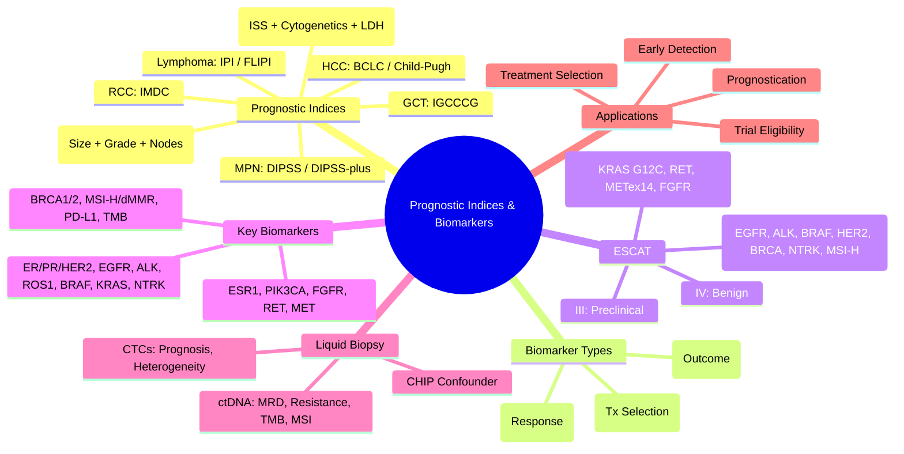

# Prognostic Indices & Biomarkers

> [!tip] **FCPS/MRCP Priority: HIGH**
> **Prognostic Indices**: Standardised tools combining clinical, pathological, and molecular features; **Key Indices**: **NPI** (Breast), **IPI/FLIPI** (Lymphoma), **DIPSS/DIPSS-plus** (MPN), **IMDC** (RCC), **IGCCCG** (GCT), **ISS/R-ISS** (Myeloma), **Child-Pugh/BCLC** (HCC); **Biomarkers**: Predictive (Treatment Selection), Prognostic (Outcome), Monitoring (Response); **Clinical Utility**: Treatment Selection, Trial Eligibility, Surveillance.

---

## 1. Learning Objectives
By the end of this note you should be able to:
- [ ] Apply **major prognostic indices** (NPI, IPI, DIPSS, IMDC, IGCCCG, R-ISS, Child-Pugh/BCLC)
- [ ] Interpret **biomarker types**: Predictive vs Prognostic vs Monitoring
- [ ] Apply **molecular biomarkers** for treatment selection (ER/PR/HER2, KRAS, EGFR, ALK, BRAF, MSI, TMB, PD-L1)
- [ ] Understand **clinical utility** in treatment selection, prognostication, and trial eligibility

---

## 2. Major Prognostic Indices

### Breast: Nottingham Prognostic Index (NPI)
| Component | Score |
|-----------|-------|
| **Tumour Size (cm)** | <2 (1), 2-5 (2), >5 (3) |
| **Grade** | 1 (1), 2 (2), 3 (3) |
| **Lymph Nodes** | None (1), 1-3 (2), >3 (3) |

**NPI = Size + Grade + Nodes**
- **Excellent (<3.4)**: 5-yr OS >90%
- **Good (3.4-4.4)**: 5-yr OS 80-90%
- **Moderate (4.4-5.4)**: 5-yr OS 60-80%
- **Poor (>5.4)**: 5-yr OS <50%

---

### Lymphoma: International Prognostic Index (IPI) / FLIPI

#### IPI (Aggressive NHL)
| Factor | Adverse if |
|--------|------------|
| **Age** | >60 years |
| **Stage** | III/IV |
| **LDH** | >ULN |
| **Performance Status** | ECOG ≥2 |
| **Extranodal Sites** | >1 |

| Risk Group | Score | 5-yr OS |
|------------|-------|---------|
| **Low** | 0-1 | >80% |
| **Low-Intermediate** | 2 | ~70% |
| **High-Intermediate** | 3 | ~50% |
| **High** | 4-5 | <40% |

#### FLIPI (Follicular Lymphoma)
| Factor | Adverse if |
|--------|------------|
| **Age** | >60 years |
| **Stage** | III/IV |
| **Hb** | <12 g/dL |
| **LDH** | >ULN |
| **Nodal Sites** | >4 |

---

## 3. Myeloproliferative Neoplasms

### DIPSS / DIPSS-plus (Primary Myelofibrosis)

| DIPSS Factor | Points |
|--------------|--------|
| Age >65 | 1 |
| Hb <10 g/dL | 1 |
| WBC >25 ×10⁹/L | 1 |
| Circulating Blasts ≥1% | 1 |
| Constitutional Symptoms | 1 |

**DIPSS-plus adds:** Platelets <100, Transfusion Dependence, Unfavourable Karyotype

| Risk Group | DIPSS Score | Median OS |
|------------|-------------|-----------|
| **Low** | 0 | Not reached |
| **Int-1** | 1 | ~7-8 yr |
| **Int-2** | 2 | ~3-4 yr |
| **High** | ≥3 | ~1.5-2 yr |

**DIPSS-plus adds:** Platelets <100, Transfusion Dependence, Unfavourable Karyotype

---

## 4. Renal Cell Carcinoma

### IMDC Risk Model (Metastatic)

| Factor | Adverse if |
|--------|------------|
| KPS <80% | Yes |
| Time Dx → Tx <1 year | Yes |
| Hb <LLN | Yes |
| Ca >ULN | Yes |
| NLR >3 (or Neutrophils >ULN) | Yes |
| Platelets >ULN | Yes |

| Group | Factors | Median OS |
|-------|---------|-----------|
| **Favourable** | 0 | ~40 months |
| **Intermediate** | 1-2 | ~20 months |
| **Poor** | ≥3 | ~8 months |

---

## 5. Germ Cell Tumours

### IGCCCG Risk Groups (Metastatic)

| Group | Seminoma | Non-Seminoma |
|-------|----------|--------------|
| **Good** | Any primary, No non-pulm visceral mets | Testicular/Retrop primary, No non-pulm visceral, S1 markers |
| **Intermediate** | Non-pulmonary visceral mets | Testicular/Retrop primary, No non-pulm visceral, S2 markers |
| **Poor** | **Does not exist** | Mediastinal primary OR Non-pulm visceral OR S3 markers |

---

## 6. Multiple Myeloma

### Revised ISS (R-ISS)

| Factor | Definition |
|--------|------------|
| **ISS Stage** | β2-Microglobulin, Albumin |
| **Cytogenetics** | **High-Risk**: del(17p), t(4;14), t(14;16) |
| **LDH** | >ULN |

| R-ISS Stage | Criteria |
|-------------|----------|
| **I** | ISS I, No High-Risk Cytogenetics, Normal LDH |
| **II** | Not I or III |
| **III** | ISS III, High-Risk Cytogenetics OR High LDH |

---

## 7. Hepatocellular Carcinoma

### BCLC / Child-Pugh

| Stage | Child-Pugh | Treatment |
|-------|------------|-----------|
| **0** | A | Ablation/Resection |
| **A** | A | Resection/Ablation/Transplant |
| **B** | A/B | TACE |
| **C** | A/B | Sorafenib/Lenvatinib |
| **D** | C/D | Best Supportive Care |

---

## 8. Biomarkers

### Classification

| Type | Definition | Clinical Use |
|------|------------|--------------|
| **Predictive** | Predicts response to **specific therapy** | Treatment Selection |
| **Prognostic** | Predicts **natural history/outcome** independent of therapy | Prognostication |
| **Monitoring** | Tracks **disease burden/response** | Response Assessment |

### Key Biomarkers by Cancer

| Cancer | Predictive | Prognostic | Monitoring |
|--------|------------|------------|------------|
| **Breast** | **ER/PR/HER2**, **PIK3CA**, **BRCA1/2** | **Grade, Ki-67, Oncotype DX, MammaPrint** | **CA15-3, CEA, ctDNA** |
| **Lung (NSCLC)** | **EGFR, ALK, ROS1, BRAF, MET, RET, NTRK, KRAS** | **Stage, PS, Histology, PD-L1, TMB** | **CEA, CYFRA, ctDNA** |
| **Colorectal** | **KRAS/NRAS/BRAF, MSI/MMR, HER2** | **Stage, LVI, PNI, CEA, CMS** | **CEA, ctDNA, MSI** |
| **Lung (SCLC)** | — | **Stage, PS, LDH** | **LDH, NSE** |
| **Melanoma** | **BRAF V600E, NRAS, KIT** | **Breslow, Ulceration, SLN, LDH, TMB** | **LDH, S100, ctDNA** |
| **Ovarian** | **BRCA1/2, HRD, MMR** | **Stage, Residual Disease, Grade** | **CA125, HE4, ctDNA** |
| **Prostate** | **BRCA1/2, MSI, HRD** | **PSA, Gleason, Stage, PSADT, Decipher** | **PSA, ctDNA** |
| **Haematological** | **BCR-ABL1 (CML), FLT3 (AML), MYD88 (WM)** | **Cytogenetics, MRD** | **MRD (Flow/PCR), ctDNA** |

---

## 9. Key Molecular Biomarkers

### ESCAT Classification (Actionability)

| Tier | Definition | Examples |
|------|------------|----------|
| **I** | **Ready for Routine Use** (Approved drug, improves outcome) | EGFRm → EGFR TKI, ALK+ → ALK TKI, BRAF V600E → BRAF/MEKi, HER2+ → Anti-HER2, BRCA → PARPi, NTRK → TRKi, MSI-H → ICI |
| **II** | **Clinical Trial Recommended** (Strong evidence, investigational) | KRAS G12C → Sotorasib/Adagrasib, RET → Selpercatinib, METex14 → Capmatinib, FGFR → Erdafitinib |
| **III** | **Preclinical/Weak Evidence** | TP53 mut, MYC amp, CCND1 amp, CCNE1 amp |
| **IV** | **No Evidence / Benign** | Passenger mutations, VUS |

### Key Biomarker Details

| Biomarker | Cancer | Actionability | Test Method |
|-----------|--------|---------------|-------------|
| **ER/PR** | Breast | Endocrine Therapy | IHC |
| **HER2** | Breast, Gastric | Trastuzumab, T-DM1, T-DXd | IHC/FISH |
| **EGFR** | Lung (NSCLC) | EGFR TKIs (Osimertinib, etc.) | PCR/NGS |
| **ALK** | Lung (NSCLC) | ALK TKIs (Alectinib, Lorlatinib) | IHC/FISH/NGS |
| **ROS1** | Lung (NSCLC) | ROS1 TKIs (Entrectinib, Lorlatinib) | FISH/NGS |
| **BRAF V600E** | Melanoma, CRC, NSCLC | BRAF/MEK Inhibitors | IHC/PCR/NGS |
| **KRAS** | CRC, Lung, Pancreas | **KRAS G12C → Sotorasib/Adagrasib** (ESCAT II) | PCR/NGS |
| **BRAF (non-V600E)** | CRC | No approved targeted therapy | NGS |
| **MSI-H/dMMR** | All Solid Tumours | **Pembrolizumab** (Tumour-agnostic) | IHC (MMR) / PCR (MSI) |
| **TMB-H** | All Solid Tumours | **Pembrolizumab** (≥10 mut/Mb) | NGS Panel |
| **NTRK Fusion** | All Solid Tumours | **Larotrectinib/Entrectinib** | RNA-seq/NGS |
| **RET Fusion** | Lung, Thyroid | **Selpercatinib, Pralsetinib** | NGS/FISH |
| **METex14** | Lung | **Capmatinib, Tepotinib** | NGS/RNA-seq |
| **FGFR** | Bladder, Cholangiocarcinoma | **Erdafitinib, Futibatinib** | NGS/FISH |
| **BRCA1/2** | Breast, Ovarian, Prostate, Pancreatic | **PARP Inhibitors** (Olaparib, Talazoparib) | NGS |
| **HRD** | Ovarian, Breast | **PARP Inhibitors** | Genomic Scarring Score |
| **PD-L1** | Lung, Urothelial, TNBC, HNSCC | **ICI (Pembro, Nivo, Atezo)** | IHC (22C3, SP263, SP142) |
| **TMB** | All Solid Tumours | **Pembrolizumab** (≥10 mut/Mb) | NGS Panel |
| **ESR1** | Breast (HR+) | **Elacestrant, Fulvestrant+CDK4/6i** | ctDNA/NGS |
| **PIK3CA** | Breast (HR+) | **Alpelisib + Fulvestrant** | NGS |
| **BRCA1/2** | Breast, Ovarian, Prostate, Pancreatic | **PARP Inhibitors** (Olaparib, Talazoparib) | NGS |
| **HRD** | Ovarian, Breast | **PARP Inhibitors** | Genomic Scarring Score |
| **PD-L1** | Lung, Urothelial, TNBC, HNSCC | **ICI (Pembro, Nivo, Atezo)** | IHC (22C3, SP263, SP142) |
| **TMB** | All Solid Tumours | **Pembrolizumab** (≥10 mut/Mb) | NGS Panel |
| **ESR1** | Breast (HR+) | **Elacestrant**, Fulvestrant+CDK4/6i | ctDNA/NGS |
| **PIK3CA** | Breast (HR+) | **Alpelisib + Fulvestrant** | NGS |
| **BRCA1/2** | Breast, Ovarian, Prostate, Pancreatic | **PARP Inhibitors** | NGS |
| **HRD** | Ovarian, Breast | **PARP Inhibitors** | Genomic Scarring Score |

---

## 10. Clinical Utility

| Application | Biomarkers Used |
|-------------|-----------------|
| **Treatment Selection** | ER/PR/HER2, EGFR, ALK, ROS1, BRAF, KRAS, BRCA, MSI, PD-L1, TMB |
| **Prognostication** | Stage, Grade, NPI, IPI, R-ISS, IMDC, Cytogenetics, Gene Signatures (Oncotype DX, MammaPrint) |
| **Monitoring** | CEA, CA125, AFP, PSA, CA19-9, CA15-3, LDH, ctDNA, MRD |
| **Trial Eligibility** | Molecular Alterations (ESCAT I/II), TMB-H, MSI-H, Specific Mutations |
| **Early Detection/Screening** | PSA, CA125, AFP, LDCT, FIT, Methylation, MCED (Galleri, CancerSEEK) |

---

## 11. FCPS/MRCP High-Yield Summary

| Topic | Key Points |
|-------|------------|
| **Prognostic Indices** | **NPI (Breast)**, **IPI/FLIPI (Lymphoma)**, **DIPSS (MPN)**, **IMDC (RCC)**, **IGCCCG (GCT)**, **R-ISS (Myeloma)**, **Child-Pugh/BCLC (HCC)** |
| **Biomarker Types** | **Predictive** (Treatment Selection), **Prognostic** (Outcome), **Monitoring** (Response) |
| **ESCAT I** | EGFR, ALK, ROS1, BRAF, HER2, BRCA, NTRK, MSI-H → **Standard of Care** |
| **ESCAT II** | KRAS G12C, RET, METex14, FGFR → **Clinical Trial** |
| **TMB-H** | ≥10 mut/Mb → **Pembrolizumab** (ICI) |
| **MSI-H/dMMR** | **Pembrolizumab** (Tumour-agnostic) |
| **Key Predictive Biomarkers** | ER/PR/HER2, EGFR, ALK, ROS1, BRAF, KRAS, NTRK, BRCA, MSI, PD-L1, TMB |
| **Key Prognostic** | Stage, Grade, NPI, IPI, R-ISS, IMDC, Cytogenetics, MRD |
| **Liquid Biopsy** | MRD, Resistance (EGFR T790M, ESR1), TMB, MSI |
| **Key Trial Biomarkers** | Oncotype DX, MammaPrint, Oncotype DX (Breast), Decipher (Prostate), Decipher (Bladder) |

---

## 12. Viva Questions (MRCP PACES / FCPS)

| Question | Expected Answer |
|----------|-----------------|
| **NPI Components & Score Interpretation?** | **Size + Grade + Nodes**; **<3.4 Excellent, 3.4-4.4 Good, 4.4-5.4 Moderate, >5.4 Poor** |
| **IPI — 5 Factors, High Risk Score?** | **Age>60, Stage III/IV, LDH>ULN, PS≥2, Extranodal>1** → **Score 4-5 = High Risk** |
| **R-ISS Stage III — Criteria?** | **ISS Stage III (β2M>5.5, Alb<35) + High-Risk Cytogenetics (del17p, t4;14, t14;16) OR LDH>ULN** |
| **IMDC Risk — 6 Factors?** | **KPS<80%, <1yr Dx-Tx, Hb<LLN, Ca>ULN, NLR>3/Plt>ULN** → Fav(0), Int(1-2), Poor(≥3) |
| **IGCCCG Poor Risk NSGCT — Criteria?** | **Mediastinal Primary OR Non-pulmonary Visceral Mets OR S3 Markers (AFP>10000, hCG>50000, LDH>10xULN)** |
| **ESCAT Tier I — Examples?** | **EGFR, ALK, ROS1, BRAF V600E, HER2, BRCA, NTRK, MSI-H** |
| **ESCAT Tier II — Examples?** | **KRAS G12C, RET, METex14, FGFR** |
| **TMB-H Definition?** | **≥10 mutations/Mb (coding)** → **Pembrolizumab Approved** |
| **MSI-H vs TMB-H** | **MSI-H: dMMR → Pembrolizumab**; **TMB-H: ≥10 mut/Mb → Pembrolizumab** (Overlap but distinct) |
| **PIK3CA Mutation — Targeted Therapy?** | **Alpelisib + Fulvestrant** (SOLAR-1) for HR+/HER2- Breast Cancer. |
| **ESR1 Mutation — Clinical Significance?** | **AI Resistance** → **Elacestrant (SERD) or Fulvestrant + CDK4/6i** (EMERALD). |
| **BRCA1/2 — PARP Inhibitor Indication?** | **Olaparib/Talazoparib** for Breast, Ovarian, Prostate, Pancreatic (BRCA1/2 mut). |
| **PD-L1 Testing — Assays, Cutoffs?** | **22C3 (Dako): Pembro**; **SP263 (Ventana): Atezo/Durva**; **SP142 (Ventana): Atezo IC**; **CPS vs TPS**. |
| **TMB-H vs MSI-H Overlap** | **MSI-H usually TMB-H**; **TMB-H can be MSS**; **Both → ICI Benefit** but mechanisms differ. |

---

## 13. Confusions & Mnemonics

| Confusion | Clarification |
|-----------|---------------|
| **Predictive vs Prognostic** | **Predictive**: Predicts **response to specific therapy**; **Prognostic**: Predicts **natural history/outcome** independent of therapy |
| **ESCAT I vs II** | **I**: Approved/Routine; **II**: Strong evidence, Trial recommended |
| **TMB vs MSI** | **TMB**: Total mutational load; **MSI**: MMR deficiency subset; **Overlap but distinct** |
| **CHIP vs Tumour ctDNA** | **CHIP**: Age-related haematopoietic mutations (DNMT3A, TET2, ASXL1) — **Not tumour** |
| **ESCAT I vs II for KRAS** | **KRAS G12C = Tier II (Sotorasib/Adagrasib)**; **Other KRAS = Not actionable** |
| **TMB vs TNB** | **TMB**: Tumour Mutational Burden; **TNB**: Not standard term |
| **MSI-H vs dMMR** | **Synonymous**; **MSI-H = High Microsatellite Instability = dMMR** |
| **R-ISS vs ISS** | **R-ISS = ISS + Cytogenetics (del17p, t4;14, t14;16) + LDH** |

**Mnemonic: PROGNOSTIC-BIOMARKERS**
- **P**rognostic Models: **NPI (Breast), IPI (Lymphoma), DIPSS (MPM), IMDC (RCC), IGCCCG (GCT)**
- **R**evised ISS: **ISS + Cytogenetics + LDH** (R-ISS)
- **O**ncotype DX: **Breast 21-gene, Chemo Benefit**
- **G**rading: **FNCLCC (Sarcoma), WHO (CNS), ISUP (Prostate)**
- **N**OTTINGHAM PI: **Size + Grade + Nodes**
- **O**nco-type DX: **Breast 21-gene, Chemo Benefit**
- **S**TL/PI: **Size, Grade, Nodes**
- **T**CGAsubtypes: **Intrinsic Subtypes (Luminal A/B, HER2+, TNBC)**
- **I**PI: **Age, Stage, LDH, PS, Extranodal**
- **C**linical Utility: **Predictive > Prognostic > Monitoring**
- **B**iomarker Types: **Predictive (Tx Selection), Prognostic (Outcome), Monitoring (Response)**
- **I**mmunotherapy Biomarkers: **TMB-H (≥10), MSI-H, PD-L1, TILs**
- **M**olecular Testing: **NGS Panel (ESCAT I/II), IHC (PD-L1, HER2), FISH (ALK, ROS1)**
- **A**ctionability: **ESCAT I (Routine), II (Trial), III (Preclinical), IV (Benign)**
- **R**esistance: **EGFR T790M, ESR1, KRAS, AR-V7**
- **K**ey Predictive: **ER/PR/HER2, EGFR/ALK/ROS1, BRAF, KRAS, BRCA, MSI, PD-L1, TMB**
- **E**SCAT: **I Routine, II Trial, III Preclinical, IV Benign**
- **R**IPI/FLIPI: **Lymphoma Prognostic**
- **S**creening: **PSA, CA125, AFP, LDCT, FIT**

---

## 14. Mind Map

---

## 15. One-Page Revision Card

| Domain | Key Points |
|--------|------------|
| **Prognostic Indices** | NPI (Breast), IPI/FLIPI (Lymphoma), R-ISS (Myeloma), DIPSS (MPN), IMDC (RCC), IGCCCG (GCT), BCLC (HCC) |
| **Biomarker Types** | Predictive (Tx Selection), Prognostic (Outcome), Monitoring (Response) |
| **ESCAT I** | EGFR, ALK, ROS1, BRAF, HER2, BRCA, NTRK, MSI-H — Standard of Care |
| **ESCAT II** | KRAS G12C, RET, METex14, FGFR — Trial Recommended |
| **TMB-H** | ≥10 mut/Mb → Pembrolizumab |
| **MSI-H** | dMMR → Pembrolizumab (Tumour-agnostic) |
| **Key Predictive** | ER/PR/HER2, EGFR, ALK, ROS1, BRAF, KRAS, NTRK, BRCA, MSI, PD-L1, TMB |
| **Key Prognostic** | Stage, Grade, NPI, IPI, R-ISS, IMDC, Cytogenetics, MRD |
| **Liquid Biopsy** | ctDNA: MRD, Resistance, TMB, MSI; CTCs: Prognosis; CHIP Confounder |
| **Resistance** | EGFR T790M, ESR1, KRAS, ALK, MET, BRAF |
| **CHIP** | DNMT3A, TET2, ASXL1, JAK2, TP53 → False Positive ctDNA |

---

## 16. Spaced Repetition Trackers

| Review Interval | Date Completed | Confidence (1-5) | Notes |
|-----------------|----------------|------------------|-------|
| 24 hours | | | |
| 7 days | | | |
| 15 days | | | |
| 30 days | | | |
| 90 days | | | |

---

## 17. Self-Test Scorecard

| Section | Score /5 | Last Attempt |
|---------|----------|--------------|
| Prognostic Indices (NPI, IPI, R-ISS, DIPSS, IMDC, IGCCCG) | | |
| Biomarker Classification | | |
| ESCAT Classification | | |
| Key Molecular Biomarkers | | |
| Liquid Biopsy/ctDNA | | |
| Clinical Utility | | |
| Resistance Mechanisms | | |
| CHIP Confounder | | |

---

## 18. Local Navigation
- **Parent Heading**: [[../Oncology|Oncology]]
- **Chapter Map": [[../Davidson Chapter 7 - Oncology Hierarchy|Oncology Hierarchy]]
- **Chapter MOC": [[../Oncology MOC|Oncology MOC]]
- **Drug Reference": [[../../Clinical Therapeutics and Good Prescribing|Drugs]]
- **Related": [[TNM Staging & Prognostication]], [[Biomarkers]], [[Oncotype DX]], [[MammaPrint]], [[ESCAT]], [[TMB]], [[MSI]], [[Liquid Biopsy]], [[ctDNA]], [[MRD Monitoring]], [[CHIP]], [[ESCAT]]

---

# FCPS/MRCP Exam Extras

## 19. MCQs (10)

**1.** Regarding Prognostic Indices & Biomarkers (Prognostic Indices), which statement is correct?
   A. **NPI (Breast)**, **IPI/FLIPI (Lymphoma)**, **DIPSS (MPN)**, **IMDC (RCC)**, **IGCCCG (GCT)**, **R-I
   B. **NPI - alternative approach
   C. Empirical management only
   D. Watch and wait
   - **Answer: A** — **NPI (Breast)**, **IPI/FLIPI (Lymphoma)**, **DIPSS (MPN)**, **IMDC (RCC)**, **IGCCCG (GCT)**, **R-ISS (Myeloma)**, **Ch...

**2.** Regarding Prognostic Indices & Biomarkers (Biomarker Types), which statement is correct?
   A. **Predictive** (Treatment Selection), **Prognostic** (Outcome), **Monitoring** (Response)
   B. **Predictive** - alternative approach
   C. Empirical management only
   D. Watch and wait
   - **Answer: A** — **Predictive** (Treatment Selection), **Prognostic** (Outcome), **Monitoring** (Response)

**3.** Regarding Prognostic Indices & Biomarkers (ESCAT I), which statement is correct?
   A. EGFR, ALK, ROS1, BRAF, HER2, BRCA, NTRK, MSI-H → **Standard of Care**
   B. EGFR, - alternative approach
   C. Empirical management only
   D. Watch and wait
   - **Answer: A** — EGFR, ALK, ROS1, BRAF, HER2, BRCA, NTRK, MSI-H → **Standard of Care**

**4.** Regarding Prognostic Indices & Biomarkers (ESCAT II), which statement is correct?
   A. KRAS G12C, RET, METex14, FGFR → **Clinical Trial**
   B. KRAS - alternative approach
   C. Empirical management only
   D. Watch and wait
   - **Answer: A** — KRAS G12C, RET, METex14, FGFR → **Clinical Trial**

**5.** Regarding Prognostic Indices & Biomarkers (TMB-H), which statement is correct?
   A. ≥10 mut/Mb → **Pembrolizumab** (ICI)
   B. ≥10 - alternative approach
   C. Empirical management only
   D. Watch and wait
   - **Answer: A** — ≥10 mut/Mb → **Pembrolizumab** (ICI)

**6.** Regarding Prognostic Indices & Biomarkers (MSI-H/dMMR), which statement is correct?
   A. **Pembrolizumab** (Tumour-agnostic)
   B. **Pembrolizumab** - alternative approach
   C. Empirical management only
   D. Watch and wait
   - **Answer: A** — **Pembrolizumab** (Tumour-agnostic)

**7.** Regarding Prognostic Indices & Biomarkers (Key Predictive Biomarkers), which statement is correct?
   A. ER/PR/HER2, EGFR, ALK, ROS1, BRAF, KRAS, NTRK, BRCA, MSI, PD-L1, TMB
   B. ER/PR/HER2, - alternative approach
   C. Empirical management only
   D. Watch and wait
   - **Answer: A** — ER/PR/HER2, EGFR, ALK, ROS1, BRAF, KRAS, NTRK, BRCA, MSI, PD-L1, TMB

**8.** Regarding Prognostic Indices & Biomarkers (Key Prognostic), which statement is correct?
   A. Stage, Grade, NPI, IPI, R-ISS, IMDC, Cytogenetics, MRD
   B. Stage, - alternative approach
   C. Empirical management only
   D. Watch and wait
   - **Answer: A** — Stage, Grade, NPI, IPI, R-ISS, IMDC, Cytogenetics, MRD

**9.** Regarding Prognostic Indices & Biomarkers (Liquid Biopsy), which statement is correct?
   A. MRD, Resistance (EGFR T790M, ESR1), TMB, MSI
   B. MRD, - alternative approach
   C. Empirical management only
   D. Watch and wait
   - **Answer: A** — MRD, Resistance (EGFR T790M, ESR1), TMB, MSI

**10.** Regarding Prognostic Indices & Biomarkers (Key Trial Biomarkers), which statement is correct?
   A. Oncotype DX, MammaPrint, Oncotype DX (Breast), Decipher (Prostate), Decipher (Bladder)
   B. Oncotype - alternative approach
   C. Empirical management only
   D. Watch and wait
   - **Answer: A** — Oncotype DX, MammaPrint, Oncotype DX (Breast), Decipher (Prostate), Decipher (Bladder)

## 20. SBA Questions (10)

**1.** A 55-year-old presents with classic features. MDT discussion recommends:
   - A. **NPI (Breast)**, **IPI/FLIPI (Lymphoma)**, **DIPSS (MPN)**, **IMDC (RCC)**, **IGCCCG (GCT)**, **R-I
   - B. **NPI (less specific)
   - C. Empirical broad approach
   - D. No intervention required
   - **Answer: A** — first-line: **NPI (Breast)**, **IPI/FLIPI (Lymphoma)**, **DIPSS (MPN)**, **IMDC (RCC)**, **IGCCCG (GCT)**, **R-ISS (Myeloma)**, **Ch...

**2.** On staging workup, the patient is found to be [Stage X]. Best management is:
   - A. **Predictive** (Treatment Selection), **Prognostic** (Outcome), **Monitoring** (Response)
   - B. **Predictive** (less specific)
   - C. Empirical broad approach
   - D. No intervention required
   - **Answer: A** — stage-specific: **Predictive** (Treatment Selection), **Prognostic** (Outcome), **Monitoring** (Response)

**3.** Following first-line treatment, the patient develops [complication]. Best next step:
   - A. EGFR, ALK, ROS1, BRAF, HER2, BRCA, NTRK, MSI-H → **Standard of Care**
   - B. EGFR, (less specific)
   - C. Empirical broad approach
   - D. No intervention required
   - **Answer: A** — complication: EGFR, ALK, ROS1, BRAF, HER2, BRCA, NTRK, MSI-H → **Standard of Care**

**4.** The patient asks about prognosis. Most appropriate response based on:
   - A. KRAS G12C, RET, METex14, FGFR → **Clinical Trial**
   - B. KRAS (less specific)
   - C. Empirical broad approach
   - D. No intervention required
   - **Answer: A** — prognosis: KRAS G12C, RET, METex14, FGFR → **Clinical Trial**

**5.** A 65-year-old with relevant risk factors should be screened with:
   - A. ≥10 mut/Mb → **Pembrolizumab** (ICI)
   - B. ≥10 (less specific)
   - C. Empirical broad approach
   - D. No intervention required
   - **Answer: A** — screening: ≥10 mut/Mb → **Pembrolizumab** (ICI)

**6.** The most clinically important biomarker/molecular test is:
   - A. **Pembrolizumab** (Tumour-agnostic)
   - B. **Pembrolizumab** (less specific)
   - C. Empirical broad approach
   - D. No intervention required
   - **Answer: A** — biomarker: **Pembrolizumab** (Tumour-agnostic)

**7.** The standard chemotherapy/regimen of choice is:
   - A. ER/PR/HER2, EGFR, ALK, ROS1, BRAF, KRAS, NTRK, BRCA, MSI, PD-L1, TMB
   - B. ER/PR/HER2, (less specific)
   - C. Empirical broad approach
   - D. No intervention required
   - **Answer: A** — chemo: ER/PR/HER2, EGFR, ALK, ROS1, BRAF, KRAS, NTRK, BRCA, MSI, PD-L1, TMB

**8.** The role of surgery in this case is:
   - A. Stage, Grade, NPI, IPI, R-ISS, IMDC, Cytogenetics, MRD
   - B. Stage, (less specific)
   - C. Empirical broad approach
   - D. No intervention required
   - **Answer: A** — surgery: Stage, Grade, NPI, IPI, R-ISS, IMDC, Cytogenetics, MRD

**9.** The recommended surveillance/follow-up protocol is:
   - A. MRD, Resistance (EGFR T790M, ESR1), TMB, MSI
   - B. MRD, (less specific)
   - C. Empirical broad approach
   - D. No intervention required
   - **Answer: A** — follow-up: MRD, Resistance (EGFR T790M, ESR1), TMB, MSI

**10.** Palliative care referral is most appropriate when:
   - A. Oncotype DX, MammaPrint, Oncotype DX (Breast), Decipher (Prostate), Decipher (Bladder)
   - B. Oncotype (less specific)
   - C. Empirical broad approach
   - D. No intervention required
   - **Answer: A** — palliative: Oncotype DX, MammaPrint, Oncotype DX (Breast), Decipher (Prostate), Decipher (Bladder)

## 21. Flashcards

**Q1:** Prognostic Indices?
**A1:** NPI (Breast), IPI/FLIPI (Lymphoma), DIPSS (MPN), IMDC (RCC), IGCCCG (GCT), R-ISS (Myeloma), Child-Pugh/BCLC (HCC)

**Q2:** Biomarker Types?
**A2:** Predictive (Treatment Selection), Prognostic (Outcome), Monitoring (Response)

**Q3:** ESCAT I?
**A3:** EGFR, ALK, ROS1, BRAF, HER2, BRCA, NTRK, MSI-H → Standard of Care

**Q4:** ESCAT II?
**A4:** KRAS G12C, RET, METex14, FGFR → Clinical Trial

**Q5:** TMB-H?
**A5:** ≥10 mut/Mb → Pembrolizumab (ICI)

**Q6:** MSI-H/dMMR?
**A6:** Pembrolizumab (Tumour-agnostic)

**Q7:** Key Predictive Biomarkers?
**A7:** ER/PR/HER2, EGFR, ALK, ROS1, BRAF, KRAS, NTRK, BRCA, MSI, PD-L1, TMB

**Q8:** Key Prognostic?
**A8:** Stage, Grade, NPI, IPI, R-ISS, IMDC, Cytogenetics, MRD

## 22. Answer Key with Explanations

| # | MCQ | Topic | Explanation |
|---|-----|-------|-------------|
| 1 | A | Prognostic Indices | NPI (Breast), IPI/FLIPI (Lymphoma), DIPSS (MPN), IMDC (RCC), IGCCCG (GCT), R-ISS (Myeloma), Child-Pugh/BCLC (HCC) |
| 2 | A | Biomarker Types | Predictive (Treatment Selection), Prognostic (Outcome), Monitoring (Response) |
| 3 | A | ESCAT I | EGFR, ALK, ROS1, BRAF, HER2, BRCA, NTRK, MSI-H → Standard of Care |
| 4 | A | ESCAT II | KRAS G12C, RET, METex14, FGFR → Clinical Trial |
| 5 | A | TMB-H | ≥10 mut/Mb → Pembrolizumab (ICI) |
| 6 | A | MSI-H/dMMR | Pembrolizumab (Tumour-agnostic) |
| 7 | A | Key Predictive Biomarkers | ER/PR/HER2, EGFR, ALK, ROS1, BRAF, KRAS, NTRK, BRCA, MSI, PD-L1, TMB |
| 8 | A | Key Prognostic | Stage, Grade, NPI, IPI, R-ISS, IMDC, Cytogenetics, MRD |
| 9 | A | Liquid Biopsy | MRD, Resistance (EGFR T790M, ESR1), TMB, MSI |
| 10 | A | Key Trial Biomarkers | Oncotype DX, MammaPrint, Oncotype DX (Breast), Decipher (Prostate), Decipher (Bladder) |

| # | SBA | Topic | Explanation |
|---|-----|-------|-------------|
| 1 | A | Prognostic Indices | NPI (Breast), IPI/FLIPI (Lymphoma), DIPSS (MPN), IMDC (RCC), IGCCCG (GCT), R-ISS (Myeloma), Child-Pugh/BCLC (HCC) |
| 2 | A | Biomarker Types | Predictive (Treatment Selection), Prognostic (Outcome), Monitoring (Response) |
| 3 | A | ESCAT I | EGFR, ALK, ROS1, BRAF, HER2, BRCA, NTRK, MSI-H → Standard of Care |
| 4 | A | ESCAT II | KRAS G12C, RET, METex14, FGFR → Clinical Trial |
| 5 | A | TMB-H | ≥10 mut/Mb → Pembrolizumab (ICI) |
| 6 | A | MSI-H/dMMR | Pembrolizumab (Tumour-agnostic) |
| 7 | A | Key Predictive Biomarkers | ER/PR/HER2, EGFR, ALK, ROS1, BRAF, KRAS, NTRK, BRCA, MSI, PD-L1, TMB |
| 8 | A | Key Prognostic | Stage, Grade, NPI, IPI, R-ISS, IMDC, Cytogenetics, MRD |
| 9 | A | Liquid Biopsy | MRD, Resistance (EGFR T790M, ESR1), TMB, MSI |
| 10 | A | Key Trial Biomarkers | Oncotype DX, MammaPrint, Oncotype DX (Breast), Decipher (Prostate), Decipher (Bladder) |

## 23. Local Navigation

- **Parent Heading Hub**: [[../../Principles of Cancer Management|Principles of Cancer Management]]
- **Chapter Map**: [[../../Davidson Chapter 7 - Oncology Hierarchy|Oncology Hierarchy]]
- **Chapter MOC**: [[../../Oncology MOC|Oncology MOC]]
- **Drug Reference**: [[../../../Clinical Therapeutics and Good Prescribing|Drugs]]

