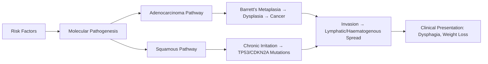
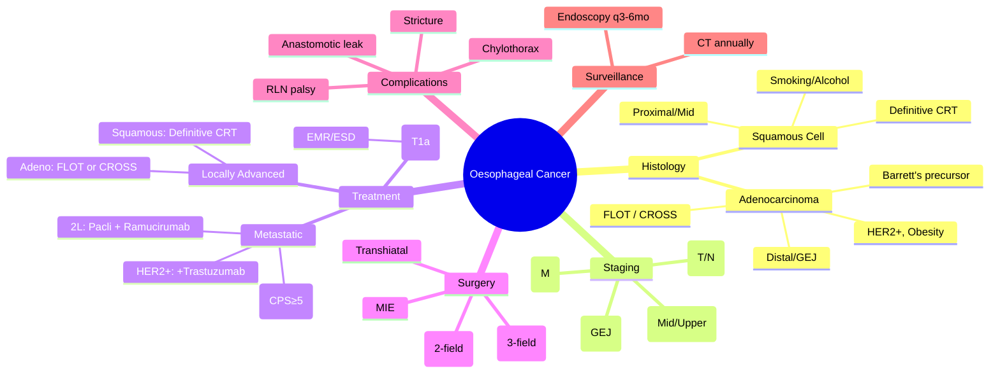

# Oesophageal Cancer

> [!tip] **FCPS/MRCP Priority: HIGH**
> **Oesophageal cancer = 2 distinct diseases** (Adenocarcinoma vs Squamous) with different epidemiology, risk factors, staging, and treatment. **CROSS trial** (neoCRT) for adenocarcinoma, **FLOT** (perioperative chemo) for gastric/GEJ adenocarcinoma. **Definitive CRT** for squamous cell. **Dysphagia** = red flag symptom requiring urgent endoscopy.

---

## 1. Learning Objectives
By the end of this note you should be able to:
- [ ] Distinguish adenocarcinoma vs squamous cell carcinoma: epidemiology, risk factors, location, management
- [ ] Describe staging (TNM 8th ed) and its impact on treatment algorithm
- [ ] Compare neoadjuvant strategies: CROSS (neoCRT) vs FLOT (perioperative chemo) vs MAGIC/ECF
- [ ] Know definitive chemoradiation for squamous cell carcinoma
- [ ] Recognise and manage complications: anastomotic leak, chylothorax, recurrent laryngeal nerve palsy
- [ ] Identify SVCO and MSCC as oncologic emergencies in oesophageal cancer

---

## 2. Definition & Epidemiology

| Feature | Detail |
|---------|--------|
| **Definition** | Malignant tumour of oesophageal mucosa; two main histological types: **adenocarcinoma** (distal oesophagus/GEJ) and **squamous cell carcinoma** (proximal/mid oesophagus) |
| **Incidence** | UK: ~9,300 new cases/year; M:F = 3:2; Adenocarcinoma now > Squamous in Western countries |
| **Prevalence** | 6th most common cause of cancer death globally; 5-year OS ~15-25% overall |
| **Peak Age** | 60-80 years (median 70); rare <40 |
| **Sex Ratio** | Male predominance (3:1 for adenocarcinoma, 2:1 for squamous) |
| **Risk Factors** | **Adenocarcinoma**: Barrett's oesophagus (↑40-125x), GERD, obesity, smoking, male sex<br>**Squamous**: Smoking, alcohol (synergistic), achalasia, tylosis, caustic injury, hot beverages, HPV (some regions), nutritional deficiencies |

---

## 3. Aetiology & Pathophysiology



### Key Pathogenic Features

| Feature | Adenocarcinoma | Squamous Cell Carcinoma |
|---------|----------------|-------------------------|
| **Precursor Lesion** | Barrett's oesophagus (intestinal metaplasia) | Dysplasia (no defined metaplasia) |
| **Key Mutations** | TP53 (90%), CDKN2A, ARID1A, PIK3CA, SMAD4 | TP53 (95%), CDKN2A, NOTCH1, PIK3CA, FBXW7 |
| **Chromosomal Instability** | High (aneuploidy) | High |
| **Molecular Subtypes** | TCGA: Chromosomal, MSI, EMT-like | TCGA: Basal, Classical, Mesenchymal |
| **HER2 Amplification** | 15-30% (distal/GEJ) | Rare (<5%) |
| **PD-L1 Expression** | Variable (CPS used for ICI) | Variable |

---

## 4. Clinical Features

| Feature | Description |
|---------|-------------|
| **Presenting Symptom** | **Progressive dysphagia** (solids → liquids) = hallmark; Odynophagia |
| **Weight Loss** | >10% body weight = poor prognostic sign |
| **Reflux/Heartburn** | Pre-existing GERD (adenocarcinoma) |
| **Hoarseness** | Recurrent laryngeal nerve palsy (mediastinal invasion) → **unresectable** |
| **Cough/Regurgitation** | Tracheo-oesophageal fistula, aspiration |
| **SVCO** | Mediastinal nodal compression of SVC (emergency) |
| **Metastatic Symptoms** | Liver (RUQ pain), Lung (dyspnoea), Bone (pain), Brain (neuro) |
| **Paraneoplastic** | Hypercalcaemia (PTHrP), Dermatomyositis, Acanthosis nigricans (Tripe palms) |

---

## 5. Staging & Classification

| System | Detail |
|--------|--------|
| **TNM 8th Edition** | Separate staging for **Adenocarcinoma** vs **Squamous** vs **GEJ** (Siewert I/II/III) |
| **T Stage** | T1a: Lamina propria/Submucosa → T1b: Muscularis propria → T2: Adventitia → T3: Adjacent structures → T4: Unresectable |
| **N Stage** | N0-N3 by number of regional nodes (N1: 1-2, N2: 3-6, N3: ≥7) |
| **M Stage** | M0 vs M1 (distant mets); M1a vs M1b for cervical/celiac nodes (histology-dependent) |
| **Stage Grouping** | **Adenocarcinoma**: IA (T1N0), IB (T2N0/T1N1), IIA (T3N0), IIB (T1-2N1/T3N1), III (T4aN0-1/T1-3N2), IV (T4b/Any N/M1)<br>**Squamous**: Similar but N-stage cutoff differs; Location (upper/mid/lower) matters for stage grouping |

### Siewert Classification (GEJ Tumours)

| Type | Epicentre | Approach |
|------|-----------|----------|
| **Siewert I** | 1-5 cm **above** GEJ | Oesophagectomy (thoraco-abdominal) |
| **Siewert II** | 1 cm above to 2 cm **below** GEJ | Transhiatal or transthoracic |
| **Siewert III** | 2-5 cm **below** GEJ | Gastrectomy (transabdominal) |

---

## 6. Diagnosis & Investigations

| Investigation | Role | Key Findings |
|---------------|------|--------------|
| **Upper GI Endoscopy + Biopsy** | **Gold standard** diagnosis | Histology (adeno vs squamous), HER2, PD-L1 (CPS), MSI/MMR |
| **Endoscopic Ultrasound (EUS)** | Local T/N staging + nodal sampling | Most accurate for T-stage; FNA of suspicious nodes |
| **CT Chest/Abdomen/Pelvis** | Distant mets, resectability | Liver mets, lung nodules, celiac nodes, ascites |
| **PET-CT** | Staging (metabolic activity), occult mets | Superior to CT for distant mets; not for T-stage |
| **Diagnostic Laparoscopy** | Occult peritoneal mets (especially Siewert II/III) | Upstages 10-20% |
| **Bronchoscopy** | Mid/upper tumours (tracheal invasion) | Mandatory if tumour >25 cm from incisors |
| **Biomarkers** | HER2 IHC/FISH (adeno), PD-L1 CPS, MSI/MMR, EBV (rare) | Guide targeted/immunotherapy |
| **Nutritional Assessment** | Pre-op optimisation | Albumin, weight loss, MUST score |

---

## 7. Differential Diagnosis

| Condition | Distinguishing Features |
|-----------|-------------------------|
| **Benign Stricture** | Gradual onset, long history GERD, smooth on endoscopy, biopsies negative |
| **Achalasia** | Dysphagia to solids & liquids, regurgitation, bird's beak on barium, aperistalsis on manometry |
| **Oesophageal Web/Ring** | Intermittent dysphagia, proximal, thin membrane |
| **Eosinophilic Oesophagitis** | Young, atopy, food impaction, rings/furrows, eosinophils on biopsy |
| **Extrinsic Compression** | Vascular (double aortic arch), mediastinal mass, thyroid |
| **Infectious Oesophagitis** | Immunocompromised, odynophagia > dysphagia, CMV/HSV/Candida on biopsy |

---

## 8. Management

```mermaid
flowchart TD
    A[Diagnosis & Staging] --> B{Resectable?}
    B -->|T1a N0| C[Endoscopic Resection: EMR/ESD]
    B -->|Locally Advanced<br/>T1b-T4a N0-2 M0| D{Histology}
    D -->|Adenocarcinoma / GEJ| E[Perioperative Chemo<br/>FLOT x4 cycles pre + post<br/>OR<br/>Neoadjuvant CRT<br/>CROSS: Carboplatin/Paclitaxel + 41.4 Gy]
    D -->|Squamous Cell| F[Definitive Chemoradiation<br/>50-50.4 Gy + Concurrent Chemo<br/>Cisplatin/5-FU or Carboplatin/Paclitaxel<br/>Surgery only if residual]
    B -->|Metastatic / Unresectable| G[Palliative Systemic Therapy]
    G --> H1[1st Line: FOLFOX/CAPOX + Nivolumab<br/>(CheckMate 648/649) if PD-L1 CPS ≥5]
    G --> H2[HER2+: Add Trastuzumab<br/>(ToGA trial)]
    G --> H3[2nd Line: Paclitaxel ± Ramucirumab<br/>(RAINBOW); Docetaxel; Irinotecan]
    E --> I[Surgery: Ivor Lewis / McKeown / Transhiatal]
    F --> J[Response Assessment: PET-CT + Endoscopy at 3-6 mo]
    I --> K[Adjuvant: Nivolumab if residual<br/>(CheckMate 577)]
    K --> L[Surveillance]
    J --> L
    L --> M[Endoscopy q3-6mo x2yr, then annually<br/>CT Chest/Abd/Pelvis annually x5yr]
```

### Treatment by Stage

| Stage | Adenocarcinoma / GEJ | Squamous Cell Carcinoma |
|-------|---------------------|-------------------------|
| **T1a N0** | Endoscopic resection (EMR/ESD) if well-diff, no LVI, <2cm | Endoscopic resection (rare) |
| **T1b N0** | Surgery ± perioperative chemo (FLOT) | Surgery OR Definitive CRT |
| **T2-3 / N+ (Resectable)** | **FLOT x4 pre + post** (FLOT4-AIO) **OR**<br/>**CROSS: NeoCRT (Carbo/Taxol + 41.4Gy) → Surgery** | **Definitive CRT** (50.4 Gy + Cisplatin/5-FU)<br/>Surgery only for residual disease |
| **T4a / N2-3 (Borderline)** | Neoadjuvant CRT (CROSS) preferred | Definitive CRT |
| **Cervical Nodes (Squamous)** | M1a → Palliative | Definitive CRT (include neck) |
| **Celiac Nodes (Adeno)** | M1a → Palliative | N/A |
| **Metastatic (M1)** | **1L: FOLFOX/CAPOX + Nivolumab** (CPS ≥5, CheckMate 649)<br/>HER2+: + Trastuzumab (ToGA)<br/>**2L: Paclitaxel ± Ramucirumab** (RAINBOW)<br/>**3L: Docetaxel / Irinotecan / Trifluridine-tipiracil** | **1L: Cisplatin/5-FU + Nivolumab** (CheckMate 648)<br/>**2L: Paclitaxel / Docetaxel / Irinotecan** |

### Surgical Approaches

| Approach | Indication | Key Points |
|----------|------------|------------|
| **Ivor Lewis** (Laparotomy + Right Thoracotomy) | Mid/distal, Siewert I/II | 2-field lymphadenectomy; lower anastomotic leak rate |
| **McKeown** (3-field: Neck + Chest + Abdomen) | Proximal/mid, Squamous | 3-field lymphadenectomy; higher RLN palsy risk |
| **Transhiatal** | Distal, Siewert III, Frail | No thoracotomy; limited lymphadenectomy; higher leak rate |
| **Minimally Invasive (MIE)** | Increasingly standard | Equivalent oncologic outcomes; less pulmonary morbidity |

---

## 9. FCPS/MRCP High-Yield Summary

| Topic | Key Points |
|-------|------------|
| **Two Diseases** | Adeno (distal, Barrett's, obesity) vs Squamous (proximal/mid, smoking/alcohol) |
| **Red Flag** | **Progressive dysphagia + weight loss in >55yr = urgent endoscopy (2-week wait)** |
| **Staging** | EUS for T/N, PET-CT for M, Laparoscopy for occult mets (GEJ) |
| **HER2 Testing** | Mandatory in metastatic adenocarcinoma (ToGA: trastuzumab + chemo ↑OS) |
| **CROSS Trial** | NeoCRT (Carbo/Taxol + 41.4Gy) → Surgery improved OS vs Surgery alone (HR 0.65) — **Adeno benefit > Squamous** |
| **FLOT Trial** | Perioperative FLOT (docetaxel/oxaliplatin/5-FU/leucovorin) ↑OS vs ECF/ECX — **Standard for resectable adeno/GEJ** |
| **CheckMate 577** | Adjuvant **Nivolumab** post neoCRT+Surgery with **residual disease** → ↑DFS (HR 0.69) |
| **CheckMate 648/649** | 1L Metastatic: **Nivolumab + Chemo** (CPS ≥5) → ↑OS |
| **Definitive CRT** | Standard for **Squamous** (organ preservation); 50.4 Gy + Cisplatin/5-FU |
| **SVCO/MSCC** | Oncologic emergencies — dexamethasone + urgent RT ± stenting/surgery |
| **Nutrition** | Pre-op nutritional optimisation critical; jejunostomy at surgery |

---

## 10. Viva Questions (MRCP PACES / FCPS)

| Question | Expected Answer |
|----------|-----------------|
| **A 65M with progressive dysphagia, weight loss. Endoscopy shows ulcerated mid-oesophageal mass. Biopsy: squamous cell. CT: T3N1M0. Management?** | **Definitive chemoradiation** (50.4 Gy + concurrent cisplatin/5-FU). Surgery reserved for residual disease at 3-6 months (PET-CT + endoscopy). |
| **Same patient but distal adenocarcinoma, T3N1M0?** | **Perioperative FLOT** (4 cycles pre + 4 post) **OR** Neoadjuvant CRT (CROSS regimen) → Surgery. FLOT preferred if fit. |
| **What is the CROSS regimen?** | Carboplatin AUC2 + Paclitaxel 50mg/m² weekly ×5 weeks + **41.4 Gy in 23 fractions** concurrent radiation. |
| **What is FLOT regimen?** | Docetaxel 50 + Oxaliplatin 85 + Leucovorin 200 + 5-FU 2600 mg/m² (24h infusion) q2weeks ×4 cycles pre-op + 4 post-op. |
| **HER2+ metastatic oesophageal adenocarcinoma — 1st line?** | **FOLFOX/CAPOX + Trastuzumab** (ToGA trial). Add Nivolumab if PD-L1 CPS ≥5 (CheckMate 649). |
| **CheckMate 577 — who gets adjuvant nivolumab?** | Patients with **residual disease** (ypT+ or ypN+) after **neoadjuvant CRT + surgery** (adeno or squamous). |
| **Siewert type II tumour — surgical approach?** | Transhiatal or transthoracic (Ivor Lewis) — both acceptable. 2-field lymphadenectomy. |
| **Oesophageal cancer with hoarseness — significance?** | **Recurrent laryngeal nerve palsy = T4/unresectable**. Mediastinal invasion. |
| **Surveillance post-curative treatment?** | Endoscopy q3-6mo ×2yr, then annually. CT CAP annually ×5yr. Monitor for second primaries (H&N, lung). |
| **Paraneoplastic: dermatomyositis + oesophageal cancer — association?** | **Acanthosis nigricans / Tripe palms** strongly associated with gastric/oesophageal adenocarcinoma. |

---

## 11. Confusions & Mnemonics

| Confusion | Clarification |
|-----------|---------------|
| **CROSS vs FLOT** | CROSS = **Neoadjuvant CRT** (radiation + chemo); FLOT = **Perioperative Chemo only** (no radiation). CROSS for adeno/squamous; FLOT mainly adeno/GEJ. |
| **Definitive CRT vs NeoCRT** | Definitive = **No planned surgery** (organ preservation); NeoCRT = **Planned surgery** after RT. Squamous → Definitive; Adeno → NeoCRT (CROSS) or Perioperative Chemo (FLOT). |
| **GEJ staging** | Siewert I/II = Oesophageal staging; Siewert III = Gastric staging. Celiac nodes = M1a for Adeno (not for Squamous). |
| **HER2 testing** | Only in **adenocarcinoma** (not squamous). IHC 3+ = positive; IHC 2+ → FISH. |
| **Adjuvant Nivo** | Only after **neoCRT + surgery** with **residual disease** (ypT+/ypN+). NOT after upfront surgery or FLOT alone. |

**Mnemonic: OESOPHAGEAL**
- **O**rgan preservation (Squamous → Definitive CRT)
- **E**ndoscopy first (Dysphagia = 2-week wait)
- **S**iewert classification (GEJ types I/II/III)
- **O**besity/Barrett's → Adenocarcinoma
- **P**erioperative FLOT (Adeno standard)
- **H**ER2 testing (Metastatic adeno)
- **A**dv Nivo post-CROSS (Residual disease)
- **G**EO: Celiac nodes = M1a (Adeno only)
- **E**mergencies: SVCO, MSCC, Fistula
- **A**lcohol/Smoking → Squamous
- **L**ymphadenectomy: 2-field (Ivor Lewis) vs 3-field (McKeown)

---

## 12. Mind Map



---

## 13. One-Page Revision Card

| Domain | Key Points |
|--------|------------|
| **Definition** | Adeno (distal, Barrett's) vs Squamous (proximal, smoking/EtOH) |
| **Red Flag** | Progressive dysphagia + weight loss >55yr = 2-week wait endoscopy |
| **Staging** | EUS (local), PET-CT (distal), Laparoscopy (occult peritoneal), Bronchoscopy (tracheal invasion) |
| **Biomarkers** | HER2 (adeno only), PD-L1 CPS, MSI/MMR |
| **T1a N0** | EMR/ESD |
| **Resectable Adeno** | FLOT (perioperative) **or** CROSS (neoCRT) → Surgery |
| **Resectable Squamous** | Definitive CRT (50.4Gy + Cis/5-FU) — surgery only if residual |
| **Metastatic** | 1L: FOLFOX/CAPOX + Nivo (CPS≥5); HER2+ → +Trastuzumab; 2L: Pacli ± Ramu |
| **Adjuvant Nivo** | Post neoCRT+Surgery if **ypT+ or ypN+** (CheckMate 577) |
| **Surgery** | Ivor Lewis (distal), McKeown (proximal), Transhiatal (frail) |
| **Emergencies** | SVCO, MSCC, Tracheo-oesophageal fistula |
| **Surveillance** | Endoscopy q3-6mo×2yr→annual; CT CAP annual×5yr |

---

## 14. Spaced Repetition Trackers

| Review Interval | Date Completed | Confidence (1-5) | Notes |
|-----------------|----------------|------------------|-------|
| 24 hours | | | |
| 7 days | | | |
| 15 days | | | |
| 30 days | | | |
| 90 days | | | |

---

## 15. Self-Test Scorecard

| Section | Score /5 | Last Attempt |
|---------|----------|--------------|
| Histology differences | | |
| Staging investigations | | |
| CROSS vs FLOT | | |
| Definitive CRT indications | | |
| Metastatic 1L/2L regimens | | |
| HER2/PD-L1 testing | | |
| Adjuvant Nivo criteria | | |
| Surgical approaches | | |
| Complications | | |
| Surveillance | | |

---

## 16. Local Navigation
- **Parent Heading**: [[../Oncology|Oncology]]
- **Chapter Map**: [[../Davidson Chapter 7 - Oncology Hierarchy|Oncology Hierarchy]]
- **Chapter MOC**: [[../Oncology MOC|Oncology MOC]]
- **Drug Reference**: [[../../Clinical Therapeutics and Good Prescribing|Drugs]]
- **Related**: [[Gastric Cancer]], [[Neoadjuvant Therapy Principles]], [[SVCO]], [[MSCC]]

---

# FCPS/MRCP Exam Extras

## 17. MCQs (10)


**1.** Regarding Oesophageal Cancer (Two Diseases), which statement is correct?
   A. Adeno (distal, Barrett's, obesity) vs Squamous (proximal/mid, smoking/alcohol)
   B. Adeno - alternative approach
   C. Empirical management only
   D. Watch and wait
   - **Answer: A** — Adeno (distal, Barrett's, obesity) vs Squamous (proximal/mid, smoking/alcohol)


**2.** Regarding Oesophageal Cancer (Red Flag), which statement is correct?
   A. **Progressive dysphagia + weight loss in >55yr = urgent endoscopy (2-week wait)**
   B. **Progressive - alternative approach
   C. Empirical management only
   D. Watch and wait
   - **Answer: A** — **Progressive dysphagia + weight loss in >55yr = urgent endoscopy (2-week wait)**


**3.** Regarding Oesophageal Cancer (Staging), which statement is correct?
   A. EUS for T/N, PET-CT for M, Laparoscopy for occult mets (GEJ)
   B. EUS - alternative approach
   C. Empirical management only
   D. Watch and wait
   - **Answer: A** — EUS for T/N, PET-CT for M, Laparoscopy for occult mets (GEJ)


**4.** Regarding Oesophageal Cancer (HER2 Testing), which statement is correct?
   A. Mandatory in metastatic adenocarcinoma (ToGA: trastuzumab + chemo ↑OS)
   B. Mandatory - alternative approach
   C. Empirical management only
   D. Watch and wait
   - **Answer: A** — Mandatory in metastatic adenocarcinoma (ToGA: trastuzumab + chemo ↑OS)


**5.** Regarding Oesophageal Cancer (CROSS Trial), which statement is correct?
   A. NeoCRT (Carbo/Taxol + 41.4Gy) → Surgery improved OS vs Surgery alone (HR 0.65)
   B. NeoCRT - alternative approach
   C. Empirical management only
   D. Watch and wait
   - **Answer: A** — NeoCRT (Carbo/Taxol + 41.4Gy) → Surgery improved OS vs Surgery alone (HR 0.65) — **Adeno benefit > Squamous**


**6.** Regarding Oesophageal Cancer (FLOT Trial), which statement is correct?
   A. Perioperative FLOT (docetaxel/oxaliplatin/5-FU/leucovorin) ↑OS vs ECF/ECX
   B. Perioperative - alternative approach
   C. Empirical management only
   D. Watch and wait
   - **Answer: A** — Perioperative FLOT (docetaxel/oxaliplatin/5-FU/leucovorin) ↑OS vs ECF/ECX — **Standard for resectable adeno/GEJ**


**7.** Regarding Oesophageal Cancer (CheckMate 577), which statement is correct?
   A. Adjuvant **Nivolumab** post neoCRT+Surgery with **residual disease** → ↑DFS (HR 0.69)
   B. Adjuvant - alternative approach
   C. Empirical management only
   D. Watch and wait
   - **Answer: A** — Adjuvant **Nivolumab** post neoCRT+Surgery with **residual disease** → ↑DFS (HR 0.69)


**8.** Regarding Oesophageal Cancer (CheckMate 648/649), which statement is correct?
   A. 1L Metastatic: **Nivolumab + Chemo** (CPS ≥5) → ↑OS
   B. 1L - alternative approach
   C. Empirical management only
   D. Watch and wait
   - **Answer: A** — 1L Metastatic: **Nivolumab + Chemo** (CPS ≥5) → ↑OS


**9.** Regarding Oesophageal Cancer (Definitive CRT), which statement is correct?
   A. Standard for **Squamous** (organ preservation)
   B. Standard - alternative approach
   C. Empirical management only
   D. Watch and wait
   - **Answer: A** — Standard for **Squamous** (organ preservation); 50.4 Gy + Cisplatin/5-FU


**10.** Regarding Oesophageal Cancer (SVCO/MSCC), which statement is correct?
   A. Oncologic emergencies
   B. Oncologic - alternative approach
   C. Empirical management only
   D. Watch and wait
   - **Answer: A** — Oncologic emergencies — dexamethasone + urgent RT ± stenting/surgery


## 18. SBA Questions (10)


**1.** A 55-year-old presents with classic features. MDT discussion recommends:
   - A. Adeno (distal, Barrett's, obesity) vs Squamous (proximal/mid, smoking/alcohol)
   - B. Adeno (less specific)
   - C. Empirical broad approach
   - D. No intervention required
   - **Answer: A** — first-line: Adeno (distal, Barrett's, obesity) vs Squamous (proximal/mid, smoking/alcohol)


**2.** On staging workup, the patient is found to be [Stage X]. Best management is:
   - A. **Progressive dysphagia + weight loss in >55yr = urgent endoscopy (2-week wait)**
   - B. **Progressive (less specific)
   - C. Empirical broad approach
   - D. No intervention required
   - **Answer: A** — stage-specific: **Progressive dysphagia + weight loss in >55yr = urgent endoscopy (2-week wait)**


**3.** Following first-line treatment, the patient develops [complication]. Best next step:
   - A. EUS for T/N, PET-CT for M, Laparoscopy for occult mets (GEJ)
   - B. EUS (less specific)
   - C. Empirical broad approach
   - D. No intervention required
   - **Answer: A** — complication: EUS for T/N, PET-CT for M, Laparoscopy for occult mets (GEJ)


**4.** The patient asks about prognosis. Most appropriate response based on:
   - A. Mandatory in metastatic adenocarcinoma (ToGA: trastuzumab + chemo ↑OS)
   - B. Mandatory (less specific)
   - C. Empirical broad approach
   - D. No intervention required
   - **Answer: A** — prognosis: Mandatory in metastatic adenocarcinoma (ToGA: trastuzumab + chemo ↑OS)


**5.** A 65-year-old with relevant risk factors should be screened with:
   - A. NeoCRT (Carbo/Taxol + 41.4Gy) → Surgery improved OS vs Surgery alone (HR 0.65)
   - B. NeoCRT (less specific)
   - C. Empirical broad approach
   - D. No intervention required
   - **Answer: A** — screening: NeoCRT (Carbo/Taxol + 41.4Gy) → Surgery improved OS vs Surgery alone (HR 0.65) — **Adeno benefit > Squamous**


**6.** The most clinically important biomarker/molecular test is:
   - A. Perioperative FLOT (docetaxel/oxaliplatin/5-FU/leucovorin) ↑OS vs ECF/ECX
   - B. Perioperative (less specific)
   - C. Empirical broad approach
   - D. No intervention required
   - **Answer: A** — biomarker: Perioperative FLOT (docetaxel/oxaliplatin/5-FU/leucovorin) ↑OS vs ECF/ECX — **Standard for resectable adeno/GEJ**


**7.** The standard chemotherapy/regimen of choice is:
   - A. Adjuvant **Nivolumab** post neoCRT+Surgery with **residual disease** → ↑DFS (HR 0.69)
   - B. Adjuvant (less specific)
   - C. Empirical broad approach
   - D. No intervention required
   - **Answer: A** — chemo: Adjuvant **Nivolumab** post neoCRT+Surgery with **residual disease** → ↑DFS (HR 0.69)


**8.** The role of surgery in this case is:
   - A. 1L Metastatic: **Nivolumab + Chemo** (CPS ≥5) → ↑OS
   - B. 1L (less specific)
   - C. Empirical broad approach
   - D. No intervention required
   - **Answer: A** — surgery: 1L Metastatic: **Nivolumab + Chemo** (CPS ≥5) → ↑OS


**9.** The recommended surveillance/follow-up protocol is:
   - A. Standard for **Squamous** (organ preservation)
   - B. Standard (less specific)
   - C. Empirical broad approach
   - D. No intervention required
   - **Answer: A** — follow-up: Standard for **Squamous** (organ preservation); 50.4 Gy + Cisplatin/5-FU


**10.** Palliative care referral is most appropriate when:
   - A. Oncologic emergencies
   - B. Oncologic (less specific)
   - C. Empirical broad approach
   - D. No intervention required
   - **Answer: A** — palliative: Oncologic emergencies — dexamethasone + urgent RT ± stenting/surgery


## 19. Flashcards

**Q1:** Two Diseases?
**A1:** Adeno (distal, Barrett's, obesity) vs Squamous (proximal/mid, smoking/alcohol)

**Q2:** Red Flag?
**A2:** Progressive dysphagia + weight loss in >55yr = urgent endoscopy (2-week wait)

**Q3:** Staging?
**A3:** EUS for T/N, PET-CT for M, Laparoscopy for occult mets (GEJ)

**Q4:** HER2 Testing?
**A4:** Mandatory in metastatic adenocarcinoma (ToGA: trastuzumab + chemo ↑OS)

**Q5:** CROSS Trial?
**A5:** NeoCRT (Carbo/Taxol + 41.4Gy) → Surgery improved OS vs Surgery alone (HR 0.65) — Adeno benefit > Squamous

**Q6:** FLOT Trial?
**A6:** Perioperative FLOT (docetaxel/oxaliplatin/5-FU/leucovorin) ↑OS vs ECF/ECX — Standard for resectable adeno/GEJ

**Q7:** CheckMate 577?
**A7:** Adjuvant Nivolumab post neoCRT+Surgery with residual disease → ↑DFS (HR 0.69)

**Q8:** CheckMate 648/649?
**A8:** 1L Metastatic: Nivolumab + Chemo (CPS ≥5) → ↑OS

## 20. Answer Key with Explanations

| # | MCQ | Topic | Explanation |
|---|-----|-------|-------------|
| 1 | A | Two Diseases | Adeno (distal, Barrett's, obesity) vs Squamous (proximal/mid, smoking/alcohol) |
| 2 | A | Red Flag | Progressive dysphagia + weight loss in >55yr = urgent endoscopy (2-week wait) |
| 3 | A | Staging | EUS for T/N, PET-CT for M, Laparoscopy for occult mets (GEJ) |
| 4 | A | HER2 Testing | Mandatory in metastatic adenocarcinoma (ToGA: trastuzumab + chemo ↑OS) |
| 5 | A | CROSS Trial | NeoCRT (Carbo/Taxol + 41.4Gy) → Surgery improved OS vs Surgery alone (HR 0.65) — Adeno benefit > Squamous |
| 6 | A | FLOT Trial | Perioperative FLOT (docetaxel/oxaliplatin/5-FU/leucovorin) ↑OS vs ECF/ECX — Standard for resectable adeno/GEJ |
| 7 | A | CheckMate 577 | Adjuvant Nivolumab post neoCRT+Surgery with residual disease → ↑DFS (HR 0.69) |
| 8 | A | CheckMate 648/649 | 1L Metastatic: Nivolumab + Chemo (CPS ≥5) → ↑OS |
| 9 | A | Definitive CRT | Standard for Squamous (organ preservation); 50.4 Gy + Cisplatin/5-FU |
| 10 | A | SVCO/MSCC | Oncologic emergencies — dexamethasone + urgent RT ± stenting/surgery |

| # | SBA | Topic | Explanation |
|---|-----|-------|-------------|
| 1 | A | Two Diseases | Adeno (distal, Barrett's, obesity) vs Squamous (proximal/mid, smoking/alcohol) |
| 2 | A | Red Flag | Progressive dysphagia + weight loss in >55yr = urgent endoscopy (2-week wait) |
| 3 | A | Staging | EUS for T/N, PET-CT for M, Laparoscopy for occult mets (GEJ) |
| 4 | A | HER2 Testing | Mandatory in metastatic adenocarcinoma (ToGA: trastuzumab + chemo ↑OS) |
| 5 | A | CROSS Trial | NeoCRT (Carbo/Taxol + 41.4Gy) → Surgery improved OS vs Surgery alone (HR 0.65) — Adeno benefit > Squamous |
| 6 | A | FLOT Trial | Perioperative FLOT (docetaxel/oxaliplatin/5-FU/leucovorin) ↑OS vs ECF/ECX — Standard for resectable adeno/GEJ |
| 7 | A | CheckMate 577 | Adjuvant Nivolumab post neoCRT+Surgery with residual disease → ↑DFS (HR 0.69) |
| 8 | A | CheckMate 648/649 | 1L Metastatic: Nivolumab + Chemo (CPS ≥5) → ↑OS |
| 9 | A | Definitive CRT | Standard for Squamous (organ preservation); 50.4 Gy + Cisplatin/5-FU |
| 10 | A | SVCO/MSCC | Oncologic emergencies — dexamethasone + urgent RT ± stenting/surgery |

## 21. Local Navigation


- **Parent Heading Hub**: [[../../Upper GI Cancers|Upper GI Cancers]]
- **Chapter Map**: [[../../Davidson Chapter 7 - Oncology Hierarchy|Oncology Hierarchy]]
- **Chapter MOC**: [[../../Oncology MOC|Oncology MOC]]
- **Drug Reference**: [[../../../Clinical Therapeutics and Good Prescribing|Drugs]]

