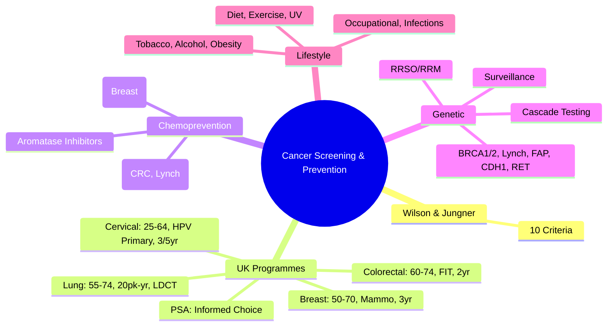

# Cancer Screening & Prevention

> [!tip] **FCPS/MRCP Priority: HIGH**
> **Screening Principles**: **Wilson & Jungner Criteria** (Important Health Problem, Accepted Treatment, Facilities, Latent/Early Stage, Suitable Test, Acceptable, Natural History, Policy, Cost-Effective); **UK Programmes**: Breast (50-71, 3yrly Mammogram), Cervical (25-64, 3-5yrly HPV Primary), Colorectal (60-74, 2yrly FIT), Lung (Pilot: 55-74, Smoking History, LDCT); **Chemoprevention**: Tamoxifen/Raloxifene (Breast), Aspirin (CRC), Aromatase Inhibitors (Breast High-Risk); **Genetic**: BRCA1/2, Lynch, FAP, MUTYH → Cascade Testing, RRSO/RRM; **Lifestyle**: Smoking, Alcohol, Diet, Exercise, Obesity, UV.

---

## 1. Learning Objectives
By the end of this note you should be able to:
- [ ] Apply **Wilson & Jungner Criteria** for evaluating screening programmes
- [ ] Describe **UK Population Screening Programmes** (Breast, Cervical, Colorectal, Lung)
- [ ] Interpret **Biomarker-Based Screening** (PSA, CA125) and limitations
- [ ] Prescribe **Chemoprevention** agents (Tamoxifen, Raloxifene, Aspirin, Aromatase Inhibitors)
- [ ] Conduct **Genetic Counselling** for hereditary cancer syndromes (BRCA1/2, Lynch, FAP)
- [ ] Recommend **Risk-Reducing Surgery** (RRSO, RRM) and surveillance
- [ ] Counsel on **Lifestyle Modification** for cancer prevention

---

## 2. Principles of Screening (Wilson & Jungner Criteria, 1968)

| Criterion | Description |
|-----------|-------------|
| **1. Important Health Problem** | High incidence/mortality, significant morbidity |
| **2. Accepted Treatment** | Effective treatment available for early-stage disease |
| **3. Facilities for Diagnosis/Treatment** | Adequate infrastructure for follow-up |
| **4. Recognisable Latent/Early Stage** | Detectable preclinical phase |
| **5. Suitable Test** | Sensitive, Specific, Acceptable, Safe, Cost-Effective |
| **6. Test Acceptable to Population** | High uptake, minimal harm |
| **7. Natural History Understood** | Progression from latent to clinical disease known |
| **8. Agreed Policy on Whom to Treat** | Clear referral/treatment pathways |
| **9. Cost-Effective** | Balanced against overall healthcare expenditure |
| **10. Continuous Process** | Ongoing, not once-off |

### Test Performance Metrics

| Metric | Formula | Interpretation |
|--------|---------|----------------|
| **Sensitivity** | TP / (TP + FN) | **Rule Out** (SnNout) |
| **Specificity** | TN / (TN + FP) | **Rule In** (SpPin) |
| **PPV** | TP / (TP + FP) | Probability disease if test +ve |
| **NPV** | TN / (TN + FN) | Probability no disease if test -ve |
| **Lead Time Bias** | Earlier diagnosis → Apparent survival ↑ without true benefit | |
| **Length Time Bias** | Slow-growing tumours more likely detected → Better prognosis | |
| **Overdiagnosis** | Detection of indolent cancers that would never cause harm | Major harm of screening |

---

## 3. UK Population Screening Programmes

### Breast Cancer Screening (NHS BSP)

| Parameter | Detail |
|-----------|--------|
| **Age Range** | **50-70 years** (Extension to 47-73 in progress) |
| **Interval** | **Every 3 years** |
| **Test** | **Digital Mammography** (2-view: CC + MLO) |
| **Recall Rate** | ~4-5% |
| **Cancer Detection Rate** | ~8-9 per 1000 screened |
| **PPV** | ~15-20% (Recalled) |
| **Mortality Reduction** | **~20-25%** (RCTs, Observational) |
| **Overdiagnosis** | **~10-20%** of screen-detected cancers |
| **Age Extension** | **47-49** (Trial), **71-73** (Self-referral) |

### Cervical Cancer Screening (NHS CSP)

| Parameter | Detail |
|-----------|--------|
| **Age Range** | **25-64 years** |
| **Interval** | **25-49: 3 years**, **50-64: 5 years** |
| **Primary Test** | **HPV Primary Screening** (HR-HPV PCR) |
| **Triage** | **HPV+ → Cytology (LBC)**; **Cytology+ → Colposcopy**; **HPV- → Routine Recall** |
| **HPV Vaccination Impact** | **9-valent (6,11,16,18,31,33,45,52,58)** → **~90% prevention** of CIN3+ |
| **Self-Sampling** | **Pilot** (Increase uptake in non-attenders) |
| **Mortality Reduction** | **~70%** since programme inception |

### Colorectal Cancer Screening (NHS BCSP)

| Parameter | Detail |
|-----------|--------|
| **Age Range** | **60-74 years** (Extension to 50-59 in progress) |
| **Interval** | **Every 2 years** |
| **Test** | **FIT (Faecal Immunochemical Test)** — **Quantitative, Single Sample** |
| **Threshold** | **≥120 µg Hb/g faeces** (Adjustable) |
| **Colonoscopy** | **FIT+ve → Colonoscopy** (Diagnostic + Therapeutic) |
| **Bowel Scope (FSIG)** | **One-off at 55** (Discontinued in England, continues Scotland) |
| **Mortality Reduction** | **~15-25%** (FIT), **~50%** (FSIG for distal CRC) |

### Lung Cancer Screening (UK Pilot / NELSON / NLST)

| Parameter | Detail |
|-----------|--------|
| **Target Population** | **55-74 years**, **≥20 pack-year smoking history** (Current/Former <15yr quit) |
| **Test** | **Low-Dose CT (LDCT)** |
| **Interval** | **Annual** (Evidence: NLST 20% mortality reduction, NELSON 24-26% in men) |
| **Nodule Management** | **Lung-RADS** (Category 1-4) → Follow-up / PET / Biopsy |
| **False Positives** | **High (~20-25%)** → Anxiety, Invasive Procedures |
| **Overdiagnosis** | **~10-20%** (Indolent Adenocarcinomas) |

### PSA Screening (Prostate) — Not UK Population Programme

| Aspect | Detail |
|--------|--------|
| **Status** | **Informed Choice Programme** (Men >50 can request PSA) |
| **Test** | **Serum PSA** (Age-specific cutoffs) |
| **Limitations** | **Low Specificity** (BPH, Prostatitis), **Overdiagnosis** (Gleason 6), **Lead Time Bias** |
| **ERSPC Trial** | **20% Mortality Reduction** (13yr FU), **NNS 570, NNT 18** |
| **PLCO Trial** | **No Mortality Benefit** (Contamination) |
| **MRI Pathway** | **mpMRI before Biopsy** (PI-RADS) → Reduces Unnecessary Biopsies |

---

## 4. Chemoprevention

| Agent | Indication | Evidence | Dose/Duration |
|-------|------------|----------|---------------|
| **Tamoxifen** | **Breast Cancer Primary Prevention** (High-risk women) | **IBIS-I, NSABP P-1**: **30-40% RR Reduction** (ER+); **IBIS-II**: Benefit persists 20yr | **20mg OD ×5 years** |
| **Raloxifene** | **Breast Cancer Prevention** (Postmenopausal, Osteoporosis) | **STAR**: **Non-inferior to Tamoxifen**, Fewer Endometrial/Thromboembolic Events | **60mg OD ×5 years** |
| **Aromatase Inhibitors** (Anastrozole, Exemestane) | **Breast Cancer Prevention** (Postmenopausal High-Risk) | **IBIS-II (Anastrozole)**: **53% RR Reduction**; **MAP.3 (Exemestane)**: **65% RR Reduction** | **1mg/25mg OD ×5 years** |
| **Aspirin** | **Colorectal Cancer Prevention**; **Lynch Syndrome** | **CAPP2 (Lynch)**: **600mg OD ×2yr → 63% CRC Reduction** (10yr FU); **General Pop**: Modest Benefit | **75-300mg OD** (Dose debated); **≥5 years** for Benefit |
| **Oral Contraceptives** | **Ovarian/Endometrial Cancer Reduction** | **~50% Ovarian CA Reduction** (Ever Use); **Duration-Dependent** | - |
| **Metformin** | **Breast/Colorectal/Pancreatic?** | **Observational**: Potential Benefit; **RCTs Ongoing** | - |

---

## 5. Genetic Counselling & Testing

### Indications for Genetic Testing

| Syndrome | Genes | Testing Criteria |
|----------|-------|------------------|
| **Hereditary Breast/Ovarian** | **BRCA1, BRCA2, PALB2, CHEK2, ATM, RAD51C/D, BARD1, TP53** (Li-Fraumeni) | **Personal**: Breast <45, Triple Negative <60, Ovarian, Male Breast, Bilateral, Ashkenazi Jewish; **Family**: 2+ Relatives, Early Onset |
| **Lynch Syndrome** | **MLH1, MSH2, MSH6, PMS2, EPCAM** | **Amsterdam II / Revised Bethesda**: CRC <50, Synchronous/Metachronous LS Cancers, Family History |
| **FAP / MAP** | **APC (FAP), MUTYH (MAP)** | **>10 Colorectal Adenomas**, Young CRC, Family History, Duodenal Adenomas |
| **Hereditary Diffuse Gastric** | **CDH1** | **Diffuse Gastric <40**, Lobular Breast, Family History |
| **VHL** | **VHL** | **RCC <40**, Multiple/Bilateral, Haemangioblastomas, Pheochromocytoma |
| **MEN1/2** | **MEN1, RET** | **MEN1**: Pituitary, Parathyroid, Pancreas; **MEN2**: MTC, Pheo, Parathyroid |

### Cascade Testing

| Step | Action |
|------|--------|
| **1. Index Case** | **Diagnostic Testing** (Affected individual) |
| **2. Identify Mutation** | **Pathogenic/Likely Pathogenic Variant** |
| **3. Predictive Testing** | **At-Risk Relatives** (50% inheritance) |
| **4. Pre/Post-Test Counselling** | **Psychological, Insurance, Reproductive** |
| **5. Surveillance/Risk-Reduction** | **Tailored to Gene/Syndrome** |

### Risk-Reducing Surgery

| Procedure | Indication | Risk Reduction |
|-----------|------------|----------------|
| **Bilateral RRSO** | **BRCA1/2** (Age 35-40 BRCA1, 40-45 BRCA2) | **Ovarian CA: 80-96%**, **Breast CA: 50% (if premenopausal)** |
| **Bilateral RRM** | **BRCA1/2, TP53, PALB2, CHEK2** | **Breast CA: 90-95%** |
| **Total Colectomy** | **FAP, Lynch (Post-CRC)** | **CRC: ~100% (FAP)** |
| **Gastrectomy** | **CDH1 (HDGC)** | **Gastric CA: ~100%** |
| **Thyroidectomy** | **RET (MEN2)** | **MTC: ~100% (Timing by Mutation)** |

### Surveillance Post-Genetic Diagnosis

| Syndrome | Surveillance |
|----------|--------------|
| **BRCA1/2** | **Breast: MRI + Mammo 25-30yrly**; **Ovarian: CA125 + TVUS 6-12monthly (Pre-RRSO)** |
| **Lynch** | **Colonoscopy 1-2yrly (20-25yr start)**; **Upper GI Endoscopy 2-3yrly**; **Urine Cytology, Gynae Surveillance** |
| **FAP** | **Sigmoidoscopy/Colonoscopy 1-2yrly (Teens)**; **Upper GI Endoscopy; Desmoid Surveillance** |
| **CDH1** | **Breast MRI/Mammo**; **Gastroscopy (Random + Targeted) 6-12monthly** |

---

## 6. Lifestyle Modification for Cancer Prevention

| Risk Factor | Cancer Sites | Recommendation |
|-------------|--------------|----------------|
| **Tobacco** | **Lung, H&N, Oesophagus, Bladder, Pancreas, Kidney, Cervix, AML, Stomach, Liver** | **Complete Cessation**; **NRT, Varenicline, Bupropion, Behavioural Support** |
| **Alcohol** | **Oesophagus, Liver, Breast, Colorectal, H&N, Stomach** | **<14 Units/Week**, **Abstinence Best** |
| **Obesity** | **Endometrial, Oesophageal (Adeno), Breast (Postmeno), Colorectal, Kidney, Pancreas, Liver, Gallbladder, Thyroid, Myeloma** | **BMI 18.5-24.9**, **Waist <94cm (M) / <80cm (F)** |
| **Physical Inactivity** | **Colorectal, Breast, Endometrial** | **≥150min Moderate / 75min Vigorous/Week** |
| **Diet** | **Colorectal (Red/Processed Meat), Stomach (Salt), Oesophagus (Hot Drinks)** | **WHO: <500g Red/Week, <5g Salt/Day, 5+ Fruit/Veg, Wholegrains, Limit Processed** |
| **UV Radiation** | **Melanoma, BCC, SCC** | **Sun Protection (SPF30+, Clothing, Shade), Avoid Tanning Beds** |
| **Occupational** | **Mesothelioma (Asbestos), Bladder (Aromatic Amines), Lung (Silica, Diesel), Nasal (Wood Dust), Leukaemia (Benzene)** | **PPE, Substitution, Exposure Limits, Health Surveillance** |
| **Infections** | **Cervical (HPV), Liver (HBV/HCV), Stomach (H. pylori), Burkitt (EBV), Kaposi (KSHV), MCC (MCPyV)** | **Vaccination (HPV, HBV)**, **H. pylori Eradication**, **Safe Practices** |

---

## 7. FCPS/MRCP High-Yield Summary

| Topic | Key Points |
|-------|------------|
| **Wilson & Jungner** | 10 Criteria: Health Problem, Treatment, Facilities, Latent Stage, Suitable Test, Acceptable, Natural History, Policy, Cost-Effective, Continuous |
| **Breast Screening** | 50-70, 3yrly Mammogram, 20-25% Mortality Reduction, 10-20% Overdiagnosis |
| **Cervical Screening** | 25-64, HPV Primary, 3yr (25-49) / 5yr (50-64), HPV Vaccination 9-valent |
| **Colorectal Screening** | 60-74, 2yrly FIT, ≥120µg/g → Colonoscopy, 15-25% Mortality Reduction |
| **Lung Screening** | 55-74, 20+ Pack-Years, Annual LDCT, NLST 20% Mortality Reduction |
| **PSA** | Not Population Programme; Informed Choice; ERSPC 20% Mortality Reduction, Overdiagnosis |
| **Chemoprevention** | Tamoxifen/Raloxifene (Breast), Aromatase Inhibitors (Postmeno), Aspirin (CRC/Lynch) |
| **Genetic Testing** | BRCA1/2, Lynch (MLH1/2/6/PMS2), FAP (APC), CDH1, RET → Cascade Testing |
| **RRSO/RRM** | BRCA1/2: RRSO 35-45yr (80-96% Ovarian Reduction), RRM 90-95% Breast Reduction |
| **Lifestyle** | Tobacco #1, Alcohol, Obesity, Inactivity, Diet, UV, Occupational, Infections |

---

## 8. Viva Questions (MRCP PACES / FCPS)

| Question | Expected Answer |
|----------|-----------------|
| **Wilson & Jungner Criteria — Name 5.** | 1) Important Health Problem, 2) Accepted Treatment, 3) Suitable Test, 4) Acceptable to Population, 5) Cost-Effective; (Also: Latent Stage, Natural History, Facilities, Policy, Continuous) |
| **UK Breast Screening — Age, Interval, Mortality Reduction?** | **50-70 years, Every 3 years, ~20-25% Mortality Reduction**. |
| **Cervical Screening — Primary Test, Triage?** | **Primary: HPV PCR**; **Triage: Cytology (LBC) if HPV+**; **Interval: 3yr (25-49), 5yr (50-64)**. |
| **Colorectal Screening — Test, Threshold, Interval?** | **FIT, ≥120µg Hb/g, Every 2 years (60-74)**. |
| **Lung Screening — Eligibility, Evidence?** | **55-74, ≥20 Pack-Years, Current/Former <15yr**; **NLST 20% Mortality Reduction, NELSON 24-26%**. |
| **PSA Screening — Why Not Population Programme?** | **Low Specificity (BPH/Prostatitis), Overdiagnosis (Gleason 6), Lead Time Bias, No Mortality Benefit in PLCO**. |
| **Tamoxifen Prevention — Dose, Duration, Benefit?** | **20mg OD ×5yrs**, **30-40% ER+ Breast CA Reduction**, **Fewer Thrombotic/Endometrial Events with Raloxifene**. |
| **BRCA1/2 Testing — Criteria?** | **Personal: Breast <45, TNBC <60, Ovarian, Male Breast, Bilateral, Ashkenazi**; **Family: 2+ Close Relatives, Early Onset**. |
| **Lynch Syndrome — Genes, Surveillance?** | **MLH1, MSH2, MSH6, PMS2, EPCAM**; **Colonoscopy 1-2yrly from 20-25yr, OGD 2-3yrly, Gynae Surveillance**. |
| **RRSO — Timing, Risk Reduction?** | **BRCA1: 35-40yr, BRCA2: 40-45yr**; **Ovarian CA 80-96% Reduction, Breast CA 50% (if Premeno)**. |

---

## 9. Confusions & Mnemonics

| Confusion | Clarification |
|-----------|---------------|
| **Sensitivity vs Specificity** | **Sensitivity**: Rule Out (SnNout); **Specificity**: Rule In (SpPin) |
| **FIT vs FOBT** | **FIT**: Quantitative, Antibody-Based, Specific for Human Hb, Single Sample; **FOBT**: Guaiac, Qualitative, Non-Specific, 3 Samples |
| **Overdiagnosis vs False Positive** | **Overdiagnosis**: True Cancer, But Indolent (Would Never Harm); **False Positive**: No Cancer, Test Wrongly +ve |
| **Lead Time vs Length Time Bias** | **Lead Time**: Earlier Dx → Survival Time Artificially ↑; **Length Time**: Slow-Growing Tumours More Likely Screen-Detected |
| **FIT Threshold** | **Lower Threshold** = More Sensitivity, More Colonoscopies; **Higher** = More Specificity, Missed Cancers |
| **Cervical HPV Primary vs Cytology** | **HPV Primary**: More Sensitive, Detects Glandular Lesions; **Cytology Triage** of HPV+ Reduces Colposcopies |
| **Aspirin Dose for Prevention** | **No Consensus**: **75-100mg (CV)**, **300mg (CAPP2 Lynch)**, **600mg (Some CRC Trials)**; **≥5yr Duration** |
| **BRCA1 vs BRCA2 RRSO Timing** | **BRCA1: 35-40yr (Earlier Ovarian Onset)**; **BRCA2: 40-45yr** |
| **Cascade Testing vs Population Screening** | **Cascade**: Targeted to Relatives of Known Mutation Carrier; **Population**: Universal Offer |

**Mnemonic: SCREENING-PREVENTION**
- **S**creening: **Wilson & Jungner** (10 Criteria)
- **C**ervical: **HPV Primary**, 25-64, 3/5yr
- **R**ectal/Colorectal: **FIT**, 60-74, 2yr
- **E**arly Detection: **Lead Time, Length Time, Overdiagnosis**
- **E**vidence: **NLST, NELSON, ERSPC, CAPP2, IBIS**
- **N**HS Programmes: **Breast, Cervical, Colorectal, Lung (Pilot)**
- **I**nformed Choice: **PSA** (Not Population Screening)
- **N**ovel Biomarkers: **ctDNA, Liquid Biopsy** (Future)
- **G**enetic: **BRCA1/2, Lynch, FAP, CDH1, RET**
- **P**revention: **Tamoxifen, Raloxifene, AI, Aspirin**
- **R**isk-Reducing: **RRSO, RRM, Colectomy, Gastrectomy**
- **E**pidemiology: **Lead Time, Length Time, Overdiagnosis**
- **V**accination: **HPV (9-valent), HBV**
- **E**xposure: **Tobacco, Alcohol, UV, Occupational**
- **N**utrition: **WHO Diet (Salt, Meat, Fibre, Fruit/Veg)**
- **T**obacco: **#1 Preventable Cause**
- **I**nactivity/Obese: **Colorectal, Breast, Endometrial**
- **O**ccupational: **Asbestos, Benzene, Silica, Diesel**
- **N**HS Future: **ctDNA, Liquid Biopsy, Risk-Stratified**

---

## 10. Mind Map

---

## 11. One-Page Revision Card

| Domain | Key Points |
|--------|------------|
| **Wilson & Jungner** | 10 Criteria (Health Problem, Treatment, Test, Acceptable, Cost-Effective...) |
| **Breast** | 50-70, Mammo 3yr, 20-25% Mortality ↓, 10-20% Overdiagnosis |
| **Cervical** | 25-64, HPV Primary, 3yr (25-49)/5yr (50-64) |
| **Colorectal** | 60-74, FIT ≥120µg/g, 2yr |
| **Lung** | 55-74, 20pk-yr, LDCT Annual, NLST 20% ↓ |
| **PSA** | Informed Choice, Overdiagnosis, ERSPC 20% ↓ |
| **Chemoprevention** | Tamoxifen/Raloxifene 5yr (Breast), Aspirin (CRC/Lynch), AI (Postmeno) |
| **Genetic** | BRCA1/2, Lynch, FAP, CDH1, RET → Cascade → RRSO/RRM |
| **Lifestyle** | Tobacco #1, Alcohol <14u, BMI 18.5-25, Exercise 150min, Diet (WHO) |

---

## 12. Spaced Repetition Trackers

| Review Interval | Date Completed | Confidence (1-5) | Notes |
|-----------------|----------------|------------------|-------|
| 24 hours | | | |
| 7 days | | | |
| 15 days | | | |
| 30 days | | | |
| 90 days | | | |

---

## 13. Self-Test Scorecard

| Section | Score /5 | Last Attempt |
|---------|----------|--------------|
| Wilson & Jungner Criteria | | |
| UK Screening Programmes | | |
| Test Performance Metrics | | |
| Chemoprevention Agents | | |
| Genetic Testing Indications | | |
| RRSO/RRM Timing | | |
| Lifestyle Recommendations | | |
| Biomarker Limitations | | |

---

## 14. Local Navigation
- **Parent Heading**: [[../Oncology|Oncology]]
- **Chapter Map": [[../Davidson Chapter 7 - Oncology Hierarchy|Oncology Hierarchy]]
- **Chapter MOC": [[../Oncology MOC|Oncology MOC]]
- **Drug Reference": [[../../Clinical Therapeutics and Good Prescribing|Drugs]]
- **Related": [[Wilson & Jungner Criteria]], [[Breast Screening]], [[Cervical Screening]], [[Colorectal Screening]], [[Lung Screening]], [[PSA Testing]], [[Genetic Counselling]], [[BRCA1/2]], [[Lynch Syndrome]], [[Tamoxifen]], [[Aspirin]], [[Lifestyle Modification]]

---

# FCPS/MRCP Exam Extras

## 15. MCQs (10)

**1.** Regarding Cancer Screening & Prevention (Wilson & Jungner), which statement is correct?
   A. 10 Criteria: Health Problem, Treatment, Facilities, Latent Stage, Suitable Test, Acceptable, Natural
   B. 10 - alternative approach
   C. Empirical management only
   D. Watch and wait
   - **Answer: A** — 10 Criteria: Health Problem, Treatment, Facilities, Latent Stage, Suitable Test, Acceptable, Natural History, Policy, Co...

**2.** Regarding Cancer Screening & Prevention (Breast Screening), which statement is correct?
   A. 50-70, 3yrly Mammogram, 20-25% Mortality Reduction, 10-20% Overdiagnosis
   B. 50-70, - alternative approach
   C. Empirical management only
   D. Watch and wait
   - **Answer: A** — 50-70, 3yrly Mammogram, 20-25% Mortality Reduction, 10-20% Overdiagnosis

**3.** Regarding Cancer Screening & Prevention (Cervical Screening), which statement is correct?
   A. 25-64, HPV Primary, 3yr (25-49) / 5yr (50-64), HPV Vaccination 9-valent
   B. 25-64, - alternative approach
   C. Empirical management only
   D. Watch and wait
   - **Answer: A** — 25-64, HPV Primary, 3yr (25-49) / 5yr (50-64), HPV Vaccination 9-valent

**4.** Regarding Cancer Screening & Prevention (Colorectal Screening), which statement is correct?
   A. 60-74, 2yrly FIT, ≥120µg/g → Colonoscopy, 15-25% Mortality Reduction
   B. 60-74, - alternative approach
   C. Empirical management only
   D. Watch and wait
   - **Answer: A** — 60-74, 2yrly FIT, ≥120µg/g → Colonoscopy, 15-25% Mortality Reduction

**5.** Regarding Cancer Screening & Prevention (Lung Screening), which statement is correct?
   A. 55-74, 20+ Pack-Years, Annual LDCT, NLST 20% Mortality Reduction
   B. 55-74, - alternative approach
   C. Empirical management only
   D. Watch and wait
   - **Answer: A** — 55-74, 20+ Pack-Years, Annual LDCT, NLST 20% Mortality Reduction

**6.** Regarding Cancer Screening & Prevention (PSA), which statement is correct?
   A. Not Population Programme
   B. Not - alternative approach
   C. Empirical management only
   D. Watch and wait
   - **Answer: A** — Not Population Programme; Informed Choice; ERSPC 20% Mortality Reduction, Overdiagnosis

**7.** Regarding Cancer Screening & Prevention (Chemoprevention), which statement is correct?
   A. Tamoxifen/Raloxifene (Breast), Aromatase Inhibitors (Postmeno), Aspirin (CRC/Lynch)
   B. Tamoxifen/Raloxifene - alternative approach
   C. Empirical management only
   D. Watch and wait
   - **Answer: A** — Tamoxifen/Raloxifene (Breast), Aromatase Inhibitors (Postmeno), Aspirin (CRC/Lynch)

**8.** Regarding Cancer Screening & Prevention (Genetic Testing), which statement is correct?
   A. BRCA1/2, Lynch (MLH1/2/6/PMS2), FAP (APC), CDH1, RET → Cascade Testing
   B. BRCA1/2, - alternative approach
   C. Empirical management only
   D. Watch and wait
   - **Answer: A** — BRCA1/2, Lynch (MLH1/2/6/PMS2), FAP (APC), CDH1, RET → Cascade Testing

**9.** Regarding Cancer Screening & Prevention (RRSO/RRM), which statement is correct?
   A. BRCA1/2: RRSO 35-45yr (80-96% Ovarian Reduction), RRM 90-95% Breast Reduction
   B. BRCA1/2: - alternative approach
   C. Empirical management only
   D. Watch and wait
   - **Answer: A** — BRCA1/2: RRSO 35-45yr (80-96% Ovarian Reduction), RRM 90-95% Breast Reduction

**10.** Regarding Cancer Screening & Prevention (Lifestyle), which statement is correct?
   A. Tobacco #1, Alcohol, Obesity, Inactivity, Diet, UV, Occupational, Infections
   B. Tobacco - alternative approach
   C. Empirical management only
   D. Watch and wait
   - **Answer: A** — Tobacco #1, Alcohol, Obesity, Inactivity, Diet, UV, Occupational, Infections

## 16. SBA Questions (10)

**1.** A 55-year-old presents with classic features. MDT discussion recommends:
   - A. 10 Criteria: Health Problem, Treatment, Facilities, Latent Stage, Suitable Test, Acceptable, Natural
   - B. 10 (less specific)
   - C. Empirical broad approach
   - D. No intervention required
   - **Answer: A** — first-line: 10 Criteria: Health Problem, Treatment, Facilities, Latent Stage, Suitable Test, Acceptable, Natural History, Policy, Co...

**2.** On staging workup, the patient is found to be [Stage X]. Best management is:
   - A. 50-70, 3yrly Mammogram, 20-25% Mortality Reduction, 10-20% Overdiagnosis
   - B. 50-70, (less specific)
   - C. Empirical broad approach
   - D. No intervention required
   - **Answer: A** — stage-specific: 50-70, 3yrly Mammogram, 20-25% Mortality Reduction, 10-20% Overdiagnosis

**3.** Following first-line treatment, the patient develops [complication]. Best next step:
   - A. 25-64, HPV Primary, 3yr (25-49) / 5yr (50-64), HPV Vaccination 9-valent
   - B. 25-64, (less specific)
   - C. Empirical broad approach
   - D. No intervention required
   - **Answer: A** — complication: 25-64, HPV Primary, 3yr (25-49) / 5yr (50-64), HPV Vaccination 9-valent

**4.** The patient asks about prognosis. Most appropriate response based on:
   - A. 60-74, 2yrly FIT, ≥120µg/g → Colonoscopy, 15-25% Mortality Reduction
   - B. 60-74, (less specific)
   - C. Empirical broad approach
   - D. No intervention required
   - **Answer: A** — prognosis: 60-74, 2yrly FIT, ≥120µg/g → Colonoscopy, 15-25% Mortality Reduction

**5.** A 65-year-old with relevant risk factors should be screened with:
   - A. 55-74, 20+ Pack-Years, Annual LDCT, NLST 20% Mortality Reduction
   - B. 55-74, (less specific)
   - C. Empirical broad approach
   - D. No intervention required
   - **Answer: A** — screening: 55-74, 20+ Pack-Years, Annual LDCT, NLST 20% Mortality Reduction

**6.** The most clinically important biomarker/molecular test is:
   - A. Not Population Programme
   - B. Not (less specific)
   - C. Empirical broad approach
   - D. No intervention required
   - **Answer: A** — biomarker: Not Population Programme; Informed Choice; ERSPC 20% Mortality Reduction, Overdiagnosis

**7.** The standard chemotherapy/regimen of choice is:
   - A. Tamoxifen/Raloxifene (Breast), Aromatase Inhibitors (Postmeno), Aspirin (CRC/Lynch)
   - B. Tamoxifen/Raloxifene (less specific)
   - C. Empirical broad approach
   - D. No intervention required
   - **Answer: A** — chemo: Tamoxifen/Raloxifene (Breast), Aromatase Inhibitors (Postmeno), Aspirin (CRC/Lynch)

**8.** The role of surgery in this case is:
   - A. BRCA1/2, Lynch (MLH1/2/6/PMS2), FAP (APC), CDH1, RET → Cascade Testing
   - B. BRCA1/2, (less specific)
   - C. Empirical broad approach
   - D. No intervention required
   - **Answer: A** — surgery: BRCA1/2, Lynch (MLH1/2/6/PMS2), FAP (APC), CDH1, RET → Cascade Testing

**9.** The recommended surveillance/follow-up protocol is:
   - A. BRCA1/2: RRSO 35-45yr (80-96% Ovarian Reduction), RRM 90-95% Breast Reduction
   - B. BRCA1/2: (less specific)
   - C. Empirical broad approach
   - D. No intervention required
   - **Answer: A** — follow-up: BRCA1/2: RRSO 35-45yr (80-96% Ovarian Reduction), RRM 90-95% Breast Reduction

**10.** Palliative care referral is most appropriate when:
   - A. Tobacco #1, Alcohol, Obesity, Inactivity, Diet, UV, Occupational, Infections
   - B. Tobacco (less specific)
   - C. Empirical broad approach
   - D. No intervention required
   - **Answer: A** — palliative: Tobacco #1, Alcohol, Obesity, Inactivity, Diet, UV, Occupational, Infections

## 17. Flashcards

**Q1:** Wilson & Jungner?
**A1:** 10 Criteria: Health Problem, Treatment, Facilities, Latent Stage, Suitable Test, Acceptable, Natural History, Policy, Cost-Effective, Continuous

**Q2:** Breast Screening?
**A2:** 50-70, 3yrly Mammogram, 20-25% Mortality Reduction, 10-20% Overdiagnosis

**Q3:** Cervical Screening?
**A3:** 25-64, HPV Primary, 3yr (25-49) / 5yr (50-64), HPV Vaccination 9-valent

**Q4:** Colorectal Screening?
**A4:** 60-74, 2yrly FIT, ≥120µg/g → Colonoscopy, 15-25% Mortality Reduction

**Q5:** Lung Screening?
**A5:** 55-74, 20+ Pack-Years, Annual LDCT, NLST 20% Mortality Reduction

**Q6:** PSA?
**A6:** Not Population Programme; Informed Choice; ERSPC 20% Mortality Reduction, Overdiagnosis

**Q7:** Chemoprevention?
**A7:** Tamoxifen/Raloxifene (Breast), Aromatase Inhibitors (Postmeno), Aspirin (CRC/Lynch)

**Q8:** Genetic Testing?
**A8:** BRCA1/2, Lynch (MLH1/2/6/PMS2), FAP (APC), CDH1, RET → Cascade Testing

## 18. Answer Key with Explanations

| # | MCQ | Topic | Explanation |
|---|-----|-------|-------------|
| 1 | A | Wilson & Jungner | 10 Criteria: Health Problem, Treatment, Facilities, Latent Stage, Suitable Test, Acceptable, Natural History, Policy, Co |
| 2 | A | Breast Screening | 50-70, 3yrly Mammogram, 20-25% Mortality Reduction, 10-20% Overdiagnosis |
| 3 | A | Cervical Screening | 25-64, HPV Primary, 3yr (25-49) / 5yr (50-64), HPV Vaccination 9-valent |
| 4 | A | Colorectal Screening | 60-74, 2yrly FIT, ≥120µg/g → Colonoscopy, 15-25% Mortality Reduction |
| 5 | A | Lung Screening | 55-74, 20+ Pack-Years, Annual LDCT, NLST 20% Mortality Reduction |
| 6 | A | PSA | Not Population Programme; Informed Choice; ERSPC 20% Mortality Reduction, Overdiagnosis |
| 7 | A | Chemoprevention | Tamoxifen/Raloxifene (Breast), Aromatase Inhibitors (Postmeno), Aspirin (CRC/Lynch) |
| 8 | A | Genetic Testing | BRCA1/2, Lynch (MLH1/2/6/PMS2), FAP (APC), CDH1, RET → Cascade Testing |
| 9 | A | RRSO/RRM | BRCA1/2: RRSO 35-45yr (80-96% Ovarian Reduction), RRM 90-95% Breast Reduction |
| 10 | A | Lifestyle | Tobacco #1, Alcohol, Obesity, Inactivity, Diet, UV, Occupational, Infections |

| # | SBA | Topic | Explanation |
|---|-----|-------|-------------|
| 1 | A | Wilson & Jungner | 10 Criteria: Health Problem, Treatment, Facilities, Latent Stage, Suitable Test, Acceptable, Natural History, Policy, Co |
| 2 | A | Breast Screening | 50-70, 3yrly Mammogram, 20-25% Mortality Reduction, 10-20% Overdiagnosis |
| 3 | A | Cervical Screening | 25-64, HPV Primary, 3yr (25-49) / 5yr (50-64), HPV Vaccination 9-valent |
| 4 | A | Colorectal Screening | 60-74, 2yrly FIT, ≥120µg/g → Colonoscopy, 15-25% Mortality Reduction |
| 5 | A | Lung Screening | 55-74, 20+ Pack-Years, Annual LDCT, NLST 20% Mortality Reduction |
| 6 | A | PSA | Not Population Programme; Informed Choice; ERSPC 20% Mortality Reduction, Overdiagnosis |
| 7 | A | Chemoprevention | Tamoxifen/Raloxifene (Breast), Aromatase Inhibitors (Postmeno), Aspirin (CRC/Lynch) |
| 8 | A | Genetic Testing | BRCA1/2, Lynch (MLH1/2/6/PMS2), FAP (APC), CDH1, RET → Cascade Testing |
| 9 | A | RRSO/RRM | BRCA1/2: RRSO 35-45yr (80-96% Ovarian Reduction), RRM 90-95% Breast Reduction |
| 10 | A | Lifestyle | Tobacco #1, Alcohol, Obesity, Inactivity, Diet, UV, Occupational, Infections |

## 19. Local Navigation

- **Parent Heading Hub**: [[../../Cancer Screening & Prevention|Cancer Screening & Prevention]]
- **Chapter Map**: [[../../Davidson Chapter 7 - Oncology Hierarchy|Oncology Hierarchy]]
- **Chapter MOC**: [[../../Oncology MOC|Oncology MOC]]
- **Drug Reference**: [[../../../Clinical Therapeutics and Good Prescribing|Drugs]]

