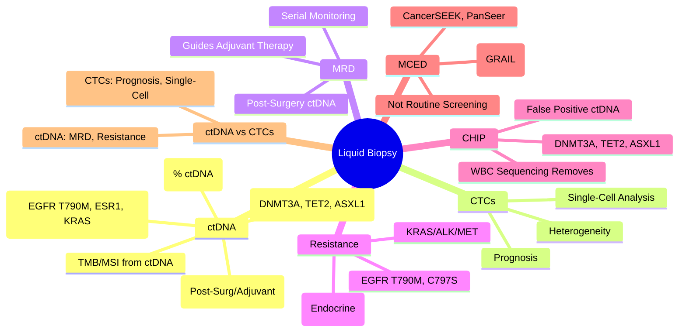

# Liquid Biopsy (ctDNA & Circulating Tumour Cells)

> [!tip] **FCPS/MRCP Priority: HIGH**
> **Liquid Biopsy = Non-Invasive Tumour Analysis via Blood**; **ctDNA (Circulating Tumour DNA)** for **MRD, Resistance Monitoring, Early Detection**; **CTCs (Circulating Tumour Cells)** for Prognosis; **Clinical Utility**: **MRD (Post-Surgery/Adjuvant)**, **Resistance Tracking** (EGFR T790M, ESR1, KRAS), **Tumour Fraction**, **TMB, MSI**; **CHIP Confounder**; **Multi-Cancer Early Detection (MCED)** emerging.

---

## 1. Learning Objectives
By the end of this note you should be able to:
- [ ] Distinguish **ctDNA vs CTCs** and their clinical roles
- [ ] Apply **ctDNA for MRD detection** post-surgery/adjuvant therapy
- [ ] Track **resistance mutations** (EGFR T790M, ESR1, KRAS, ALK)
- [ ] Interpret **tumour fraction** and **TMB/MSI** from liquid biopsy
- [ ] Recognise **CHIP confounder** in liquid biopsy interpretation
- [ ] Understand **emerging MCED** (Multi-Cancer Early Detection)

---

## 2. ctDNA vs CTCs

| Feature | **ctDNA** (Circulating Tumour DNA) | **CTCs** (Circulating Tumour Cells) |
|---------|-----------------------------------|-------------------------------------|
| **Nature** | **DNA fragments** (160-180bp) shed by tumour | **Intact tumour cells** in circulation |
| **Abundance** | **0.1-1% of cfDNA** (Can be <0.01%) | **Extremely rare** (1-10 cells/mL) |
| **Half-Life** | **~15-30 minutes** (Rapid clearance) | **Hours** (Longer persistence) |
| **Detection** | **NGS/dPCR** (Mutation, CNV, Methylation) | **Immunomagnetic (EpCAM/CD45)** |
| **Clinical Utility** | **MRD, Resistance, TMB, MSI, Early Detection** | **Prognosis, CTC Count, Heterogeneity** |
| **Sensitivity** | **High (VAF 0.01-0.1%)** | **Low (Needs >1 cell/7.5mL)** |

---

## 3. ctDNA Clinical Applications

### Minimal Residual Disease (MRD)
| Setting | ctDNA Utility |
|---------|---------------|
| **Post-Surgery (Adjuvant)** | **MRD+ → High Relapse Risk** → **Intensify/Adjuvant Therapy** |
| **Post-Adjuvant Therapy** | **MRD+ → High Relapse Risk** → **Consider Intensification** |
| **Surveillance** | **Early Relapse Detection** (Months before imaging) |
| **Sensitivity** | **10⁻⁴ - 10⁻⁶** (VAF) |

| Cancer Type | MRD Application | Evidence |
|-------------|-----------------|----------|
| **Colorectal** | **Post-Op/Adjuvant MRD → Guides Adjuvant Chemo** | **CIRCULATE, DYNAMIC** |
| **Breast** | **Post-Neoadj/Adjuvant MRD → Predicts Recurrence** | **cTRAK, AURORA** |
| **Lung (NSCLC)** | **Post-Surgery MRD → Predicts Relapse** | **TRACERx, LUNG-1** |
| **Melanoma** | **Post-Surgery MRD → Predicts Relapse** | **CIRCULATE-M** |

---

## 4. Resistance Mutation Monitoring

| Cancer | Resistance Mutation | Liquid Biopsy Utility |
|--------|---------------------|----------------------|
| **NSCLC (EGFRm)** | **T790M, C797S, METamp, HER2amp** | **Early Detection** → Switch to Osimertinib/T-DXd |
| **Breast (HR+)** | **ESR1 Mutation (Y537S, D538G)** | **AI Resistance** → Switch to Fulvestrant/Elacestrant |
| **CRC** | **KRAS/NRAS/BRAF Emergence** | **Anti-EGFR Resistance** → Switch to Chemo/IO |
| **Melanoma** | **BRAF V600E Resistance (MEK Mut, NRAS)** | **BRAF/MEKi Resistance** → Switch to ICI |
| **AML** | **FLT3-ITD, NPM1, IDH/2** | **MRD, Relapse Prediction** |

---

## 5. Tumour Fraction & Clinical Utility

| Metric | Definition | Clinical Utility |
|--------|------------|------------------|
| **Tumour Fraction (TF)** | **% ctDNA in cfDNA** | **Prognostic**, **Response Assessment**, **MRD** |
| **TMB (Tumour Mutational Burden)** | **Mutations/Mb (ctDNA-based)** | **ICI Response Prediction** (TMB-H ≥10 mut/Mb) |
| **MSI Status** | **MSI-H/dMMR from ctDNA** | **ICI Eligibility (Pembrolizumab)** |
| **Copy Number Alterations** | **CNV Profile** | **Tumour Fraction Estimation**, **Driver Amplifications** |

| TF Range | Clinical Interpretation |
|----------|-------------------------|
| **TF <0.1%** | **MRD-Negative / Low Burden** |
| **0.1-1%** | **Low Burden / MRD-Positive** |
| **1-10%** | **Moderate Burden** |
| **>10%** | **High Burden / Advanced Disease** |

---

## 6. CHIP Confounder

| Aspect | Detail |
|--------|--------|
| **CHIP (Clonal Haematopoiesis of Indeterminate Potential)** | **Age-related somatic mutations in blood cells** (DNMT3A, TET2, ASXL1, TET2, JAK2, TP53) |
| **Frequency** | **~10% at 70yr**, **~20% at 80yr** |
| **Confounding Effect** | **CHIP mutations appear in cfDNA** → **False Positive Tumour Mutations** |
| **Key Genes** | **DNMT3A, TET2, ASXL1, JAK2, TP53, PPM1D, SF3B1, SRSF2** |
| **Mitigation** | **White Blood Cell Sequencing** (Paired WBC-cfDNA), **CHIP Panel Filtering** |
| **Clinical Impact** | **False Positive "Tumour" Mutations** → **Incorrect Treatment Decisions** |

---

## 7. Multi-Cancer Early Detection (MCED)

| Feature | Detail |
|---------|--------|
| **Concept** | **Single Blood Test → Multiple Cancer Types** |
| **Key Technologies** | **Methylation-Based (GRAIL Galleri), Fragmentomics, Combined ctDNA/Protein** |
| **Galleri (GRAIL)** | **>50 Cancer Types**, **Sensitivity 50-70% (Stage I-III)**, **Specificity 99.5%** |
| **Other Platforms** | **CancerSEEK, PanSeer, Delfi, Singlera** |
| **Current Status** | **Not Yet Routine Screening** (NHS-Galleri Trial Ongoing) |
| **Challenges** | **Low Sensitivity Stage I**, **False Positives, Cost, Equity, Overtreatment** |

---

## 8. FCPS/MRCP High-Yield Summary

| Topic | Key Points |
|-------|------------|
| **ctDNA vs CTCs** | **ctDNA**: DNA Fragments, High Sensitivity, MRD/Resistance; **CTCs**: Intact Cells, Prognosis |
| **MRD (ctDNA)** | **Post-Surgery/Adjuvant**: MRD+ → High Relapse Risk, Guides Adjuvant/Intensification |
| **Resistance Tracking** | **EGFR T790M, ESR1, KRAS, ALK** via ctDNA → Early Switch Therapy |
| **Tumour Fraction** | **% ctDNA in cfDNA** → Prognostic, MRD, Response Assessment |
| **CHIP** | **Clonal Haematopoiesis** (DNMT3A, TET2, ASXL1) → **False Positive ctDNA Mutations** |
| **MCED** | **Galleri (GRAIL), CancerSEEK, PanSeer** — **Not Yet Routine Screening** |
| **ctDNA vs CTCs** | **ctDNA: Sensitivity, MRD, Resistance**; **CTCs: Prognosis, Heterogeneity** |

---

## 9. Viva Questions (MRCP PACES / FCPS)

| Question | Expected Answer |
|----------|-----------------|
| **ctDNA vs CTCs — Key Differences?** | **ctDNA**: DNA Fragments, High Sensitivity, MRD/Resistance/TMB; **CTCs**: Intact Cells, Prognosis, Heterogeneity. |
| **MRD Detection by ctDNA — Clinical Utility?** | **Post-Surgery/Adjuvant: MRD+ → High Relapse Risk**, Guides Adjuvant Therapy/Intensification. |
| **Resistance Mutations Tracked by ctDNA?** | **EGFR T790M/C797S, ESR1, KRAS, ALK, MET, BRAF** → Early Switch Therapy. |
| **Tumour Fraction — Definition, Utility?** | **% ctDNA in cfDNA** → Prognostic, MRD, Response, Early Detection. |
| **CHIP — What, Confounding?** | **Clonal Haematopoiesis (DNMT3A, TET2, ASXL1)** → **False Positive Tumour Mutations in ctDNA**. |
| **MCED — Current Status?** | **Galleri (GRAIL), CancerSEEK, PanSeer** — **Not Yet Routine Screening** (NHS-Galleri Trial Ongoing). |
| **ctDNA vs CTCs — When to Use Each?** | **ctDNA**: MRD, Resistance, TMB/MSI; **CTCs**: Prognosis, Heterogeneity, Single-Cell Analysis. |
| **CHIP Genes** | **DNMT3A, TET2, ASXL1, JAK2, TP53, PPM1D, SF3B1, SRSF2** — Confound ctDNA. |
| **MRD in Colorectal Cancer** | **Post-Surgery ctDNA → Guides Adjuvant Chemo** (CIRCULATE, DYNAMIC Trials). |
| **Liquid Biopsy vs Tissue Biopsy** | **Liquid: Non-Invasive, Serial, Heterogeneity Capture**; **Tissue: Gold Standard, Spatial, Archival**. |

---

## 10. Confusions & Mnemonics

| Confusion | Clarification |
|-----------|---------------|
| **ctDNA vs CTCs** | **ctDNA**: DNA Fragments, High Sensitivity, MRD/Resistance; **CTCs**: Intact Cells, Prognosis |
| **CHIP vs Tumour Mutation** | **CHIP**: Blood-Derived (DNMT3A, TET2, ASXL1); **Tumour**: Tissue-Derived; **WBC Sequencing Resolves** |
| **MRD vs Recurrence** | **MRD**: Molecular Residual Disease (ctDNA+), **Precedes Radiological Recurrence by Months** |
| **Tumour Fraction vs VAF** | **TF**: % of Total cfDNA from Tumour; **VAF**: Variant Allele Frequency in ctDNA |
| **ctDNA Sensitivity by Stage** | **Stage I: 40-50%**, **Stage II: 60-70%**, **Stage III: 70-80%**, **Stage IV: >90%** |
| **MCED vs Standard Screening** | **MCED: Multi-Cancer, Single Blood Test**; **Standard: Organ-Specific, Proven Mortality Benefit** |

**Mnemonic: LIQUID-BIOPSY**
- **L**iquid Biopsy: **ctDNA + CTCs** (Blood-Based)
- **I**ntent: **MRD, Resistance, Early Detection, TMB/MSI**
- **Q**uick: **ctDNA Half-Life ~30min**, Rapid Turnover
- **U**tility: **MRD, Resistance Tracking, TMB/MSI, Early Detection**
- **I**ndications: **MRD Post-Surgery, Resistance Tracking, Tumour Fraction**
- **T**umour Fraction: **% ctDNA in cfDNA** (Prognostic, MRD)
- **D**etection: **NGS/dPCR, VAF 0.01% Sensitivity**
- **B**io-markers: **TMB, MSI, MSI-H, Mutational Signatures**
- **I**nterpretation: **CHIP Confounder** (DNMT3A, TET2, ASXL1)
- **O**nco-MCED: **Galleri (GRAIL), CancerSEEK, PanSeer** (Not Routine)
- **P**ost-Surgery: **ctDNA MRD → Guides Adjuvant Therapy**
- **S**ensitivity: **Stage I 40-50%, Stage IV >90%**
- **Y**ield: **Serial Sampling > Single Timepoint**

---

## 11. Mind Map

---

## 12. One-Page Revision Card

| Domain | Key Points |
|--------|------------|
| **ctDNA** | DNA Fragments, 160-180bp, Half-Life ~30min |
| **MRD** | Post-Surg/Adjuvant ctDNA → Guides Adjuvant Therapy |
| **Resistance** | EGFR T790M, ESR1, KRAS, ALK, MET, BRAF |
| **Tumour Fraction** | % ctDNA in cfDNA → Prognostic, MRD, Response |
| **CHIP** | DNMT3A, TET2, ASXL1, JAK2 → False Positive |
| **TCrCs vs CTCs** | ctDNA: MRD/Resistance; CTCs: Prognosis |
| **MCED** | Galleri, CancerSEEK — Not Routine |
| **CHIP Genes** | DNMT3A, TET2, ASXL1, JAK2, TP53 |

---

## 13. Spaced Repetition Trackers

| Review Interval | Date Completed | Confidence (1-5) | Notes |
|-----------------|----------------|------------------|-------|
| 24 hours | | | |
| 7 days | | | |
| 15 days | | | |
| 30 days | | | |
| 90 days | | | |

---

## 14. Self-Test Scorecard

| Section | Score /5 | Last Attempt |
|---------|----------|--------------|
| ctDNA vs CTCs | | |
| MRD Clinical Utility | | |
| Resistance Tracking | | |
| Tumour Fraction | | |
| CHIP Confounder | | |
| MCED Status | | |
| Resistance Mutations | | |
| Sensitivity by Stage | | |

---

## 15. Local Navigation
- **Parent Heading**: [[../Oncology|Oncology]]
- **Chapter Map": [[../Davidson Chapter 7 - Oncology Hierarchy|Oncology Hierarchy]]
- **Chapter MOC": [[../Oncology MOC|Oncology MOC]]
- **Drug Reference": [[../../Clinical Therapeutics and Good Prescribing|Drugs]]
- **Related": [[ctDNA]], [[MRD Monitoring]], [[CHIP]], [[TMB]], [[MSI]], [[Multi-Cancer Early Detection]], [[MRD Monitoring]], [[Resistance Mutations]], [[EGFR T790M]], [[ESR1 Mutation]]

---

# FCPS/MRCP Exam Extras

## 16. MCQs (10)

**1.** Regarding Liquid Biopsy (ctDNA & Circulating Tumour Cells) (ctDNA vs CTCs), which statement is correct?
   A. **ctDNA**: DNA Fragments, High Sensitivity, MRD/Resistance
   B. **ctDNA**: - alternative approach
   C. Empirical management only
   D. Watch and wait
   - **Answer: A** — **ctDNA**: DNA Fragments, High Sensitivity, MRD/Resistance; **CTCs**: Intact Cells, Prognosis

**2.** Regarding Liquid Biopsy (ctDNA & Circulating Tumour Cells) (MRD (ctDNA)), which statement is correct?
   A. **Post-Surgery/Adjuvant**: MRD+ → High Relapse Risk, Guides Adjuvant/Intensification
   B. **Post-Surgery/Adjuvant**: - alternative approach
   C. Empirical management only
   D. Watch and wait
   - **Answer: A** — **Post-Surgery/Adjuvant**: MRD+ → High Relapse Risk, Guides Adjuvant/Intensification

**3.** Regarding Liquid Biopsy (ctDNA & Circulating Tumour Cells) (Resistance Tracking), which statement is correct?
   A. **EGFR T790M, ESR1, KRAS, ALK** via ctDNA → Early Switch Therapy
   B. **EGFR - alternative approach
   C. Empirical management only
   D. Watch and wait
   - **Answer: A** — **EGFR T790M, ESR1, KRAS, ALK** via ctDNA → Early Switch Therapy

**4.** Regarding Liquid Biopsy (ctDNA & Circulating Tumour Cells) (Tumour Fraction), which statement is correct?
   A. **% ctDNA in cfDNA** → Prognostic, MRD, Response Assessment
   B. **% - alternative approach
   C. Empirical management only
   D. Watch and wait
   - **Answer: A** — **% ctDNA in cfDNA** → Prognostic, MRD, Response Assessment

**5.** Regarding Liquid Biopsy (ctDNA & Circulating Tumour Cells) (CHIP), which statement is correct?
   A. **Clonal Haematopoiesis** (DNMT3A, TET2, ASXL1) → **False Positive ctDNA Mutations**
   B. **Clonal - alternative approach
   C. Empirical management only
   D. Watch and wait
   - **Answer: A** — **Clonal Haematopoiesis** (DNMT3A, TET2, ASXL1) → **False Positive ctDNA Mutations**

**6.** Regarding Liquid Biopsy (ctDNA & Circulating Tumour Cells) (MCED), which statement is correct?
   A. **Galleri (GRAIL), CancerSEEK, PanSeer**
   B. **Galleri - alternative approach
   C. Empirical management only
   D. Watch and wait
   - **Answer: A** — **Galleri (GRAIL), CancerSEEK, PanSeer** — **Not Yet Routine Screening**

**7.** Regarding Liquid Biopsy (ctDNA & Circulating Tumour Cells) (ctDNA vs CTCs), which statement is correct?
   A. **ctDNA: Sensitivity, MRD, Resistance**
   B. **ctDNA: - alternative approach
   C. Empirical management only
   D. Watch and wait
   - **Answer: A** — **ctDNA: Sensitivity, MRD, Resistance**; **CTCs: Prognosis, Heterogeneity**

**8.** Regarding Liquid Biopsy (ctDNA & Circulating Tumour Cells) (FCPS/MRCP High Yield - Liquid ), which statement is correct?
   - A. FCPS/MRCP High Yield - Liquid Biopsy: ctDNA for MRD, Resistance Monitoring (EGFR T790M, ESR1), Tumou
   - B. None of the above
   - C. Not applicable in clinical practice
   - D. Used only in research settings
   - **Answer: A** — FCPS/MRCP High Yield - Liquid Biopsy: ctDNA for MRD, Resistance Monitoring (EGFR T790M, ESR1), Tumour Fraction

**9.** Regarding Liquid Biopsy (ctDNA & Circulating Tumour Cells) (Early Detection (Screening)), which statement is correct?
   - A. Early Detection (Screening)
   - B. None of the above
   - C. Not applicable in clinical practice
   - D. Used only in research settings
   - **Answer: A** — Early Detection (Screening)

**10.** Regarding Liquid Biopsy (ctDNA & Circulating Tumour Cells) (Tissue vs Liquid Biopsy), which statement is correct?
   - A. Tissue vs Liquid Biopsy
   - B. None of the above
   - C. Not applicable in clinical practice
   - D. Used only in research settings
   - **Answer: A** — Tissue vs Liquid Biopsy

## 17. SBA Questions (10)

**1.** A 55-year-old presents with classic features. MDT discussion recommends:
   - A. **ctDNA**: DNA Fragments, High Sensitivity, MRD/Resistance
   - B. **ctDNA**: (less specific)
   - C. Empirical broad approach
   - D. No intervention required
   - **Answer: A** — first-line: **ctDNA**: DNA Fragments, High Sensitivity, MRD/Resistance; **CTCs**: Intact Cells, Prognosis

**2.** On staging workup, the patient is found to be [Stage X]. Best management is:
   - A. **Post-Surgery/Adjuvant**: MRD+ → High Relapse Risk, Guides Adjuvant/Intensification
   - B. **Post-Surgery/Adjuvant**: (less specific)
   - C. Empirical broad approach
   - D. No intervention required
   - **Answer: A** — stage-specific: **Post-Surgery/Adjuvant**: MRD+ → High Relapse Risk, Guides Adjuvant/Intensification

**3.** Following first-line treatment, the patient develops [complication]. Best next step:
   - A. **EGFR T790M, ESR1, KRAS, ALK** via ctDNA → Early Switch Therapy
   - B. **EGFR (less specific)
   - C. Empirical broad approach
   - D. No intervention required
   - **Answer: A** — complication: **EGFR T790M, ESR1, KRAS, ALK** via ctDNA → Early Switch Therapy

**4.** The patient asks about prognosis. Most appropriate response based on:
   - A. **% ctDNA in cfDNA** → Prognostic, MRD, Response Assessment
   - B. **% (less specific)
   - C. Empirical broad approach
   - D. No intervention required
   - **Answer: A** — prognosis: **% ctDNA in cfDNA** → Prognostic, MRD, Response Assessment

**5.** A 65-year-old with relevant risk factors should be screened with:
   - A. **Clonal Haematopoiesis** (DNMT3A, TET2, ASXL1) → **False Positive ctDNA Mutations**
   - B. **Clonal (less specific)
   - C. Empirical broad approach
   - D. No intervention required
   - **Answer: A** — screening: **Clonal Haematopoiesis** (DNMT3A, TET2, ASXL1) → **False Positive ctDNA Mutations**

**6.** The most clinically important biomarker/molecular test is:
   - A. **Galleri (GRAIL), CancerSEEK, PanSeer**
   - B. **Galleri (less specific)
   - C. Empirical broad approach
   - D. No intervention required
   - **Answer: A** — biomarker: **Galleri (GRAIL), CancerSEEK, PanSeer** — **Not Yet Routine Screening**

**7.** The standard chemotherapy/regimen of choice is:
   - A. **ctDNA: Sensitivity, MRD, Resistance**
   - B. **ctDNA: (less specific)
   - C. Empirical broad approach
   - D. No intervention required
   - **Answer: A** — chemo: **ctDNA: Sensitivity, MRD, Resistance**; **CTCs: Prognosis, Heterogeneity**

**8.** A clinician encounters a patient with this presentation. Best approach:
   - A. FCPS/MRCP High Yield - Liquid Biopsy: ctDNA for MRD, Resistance Monitoring (EGFR T790M, ESR1), Tumou
   - B. Watch and wait approach
   - C. Empirical broad treatment
   - D. No intervention
   - **Answer: A** — FCPS/MRCP High Yield - Liquid Biopsy: ctDNA for MRD, Resistance Monitoring (EGFR T790M, ESR1), Tumour Fraction

**9.** On further evaluation, the finding is confirmed. Most appropriate next step:
   - A. Early Detection (Screening)
   - B. Watch and wait approach
   - C. Empirical broad treatment
   - D. No intervention
   - **Answer: A** — Early Detection (Screening)

**10.** The patient asks about management options. Best evidence-based response:
   - A. Tissue vs Liquid Biopsy
   - B. Watch and wait approach
   - C. Empirical broad treatment
   - D. No intervention
   - **Answer: A** — Tissue vs Liquid Biopsy

## 18. Flashcards

**Q1:** ctDNA vs CTCs?
**A1:** ctDNA: DNA Fragments, High Sensitivity, MRD/Resistance; CTCs: Intact Cells, Prognosis

**Q2:** MRD (ctDNA)?
**A2:** Post-Surgery/Adjuvant: MRD+ → High Relapse Risk, Guides Adjuvant/Intensification

**Q3:** Resistance Tracking?
**A3:** EGFR T790M, ESR1, KRAS, ALK via ctDNA → Early Switch Therapy

**Q4:** Tumour Fraction?
**A4:** % ctDNA in cfDNA → Prognostic, MRD, Response Assessment

**Q5:** CHIP?
**A5:** Clonal Haematopoiesis (DNMT3A, TET2, ASXL1) → False Positive ctDNA Mutations

**Q6:** MCED?
**A6:** Galleri (GRAIL), CancerSEEK, PanSeer — Not Yet Routine Screening

**Q7:** ctDNA vs CTCs?
**A7:** ctDNA: Sensitivity, MRD, Resistance; CTCs: Prognosis, Heterogeneity

| # | MCQ | Topic | Explanation |
|---|-----|-------|-------------|
| 8 | A | FCPS/MRCP High Yield - Liquid Biopsy | FCPS/MRCP High Yield - Liquid Biopsy: ctDNA for MRD, Resistance Monitoring (EGFR T790M, ESR1), Tumour Fraction |
| 9 | A | Early Detection (Screening) | Early Detection (Screening) |
| 10 | A | Tissue vs Liquid Biopsy | Tissue vs Liquid Biopsy |
| 11 | A | Sensitivity/Specificity | Sensitivity/Specificity |
| 12 | A | Clinical Utility (NCCN/ESMO) | Clinical Utility (NCCN/ESMO) |
| 13 | A | Nature | Nature: DNA fragments (160-180bp) shed by tumour |
| 14 | A | Abundance | Abundance: 0.1-1% of cfDNA (Can be <0.01%) |
| 15 | A | Half-Life | Half-Life: ~15-30 minutes (Rapid clearance) |
| 16 | A | Detection | Detection: NGS/dPCR (Mutation, CNV, Methylation) |
| 17 | A | Clinical Utility | Clinical Utility: MRD, Resistance, TMB, MSI, Early Detection |
| 18 | A | Sensitivity | Sensitivity: High (VAF 0.01-0.1%) |
| 19 | A | Post-Surgery (Adjuvant) | Post-Surgery (Adjuvant): MRD+ → High Relapse Risk → Intensify/Adjuvant Therapy |
| 20 | A | Post-Adjuvant Therapy | Post-Adjuvant Therapy: MRD+ → High Relapse Risk → Consider Intensification |
| 21 | A | Surveillance | Surveillance: Early Relapse Detection (Months before imaging) |
| 22 | A | Sensitivity | Sensitivity: 10⁻⁴ - 10⁻⁶ (VAF) |

| # | SBA | Topic | Explanation |
|---|-----|-------|-------------|
| 8 | A | FCPS/MRCP High Yield - Liquid Biopsy | FCPS/MRCP High Yield - Liquid Biopsy: ctDNA for MRD, Resistance Monitoring (EGFR T790M, ESR1), Tumour Fraction |
| 9 | A | Early Detection (Screening) | Early Detection (Screening) |
| 10 | A | Tissue vs Liquid Biopsy | Tissue vs Liquid Biopsy |
| 11 | A | Sensitivity/Specificity | Sensitivity/Specificity |
| 12 | A | Clinical Utility (NCCN/ESMO) | Clinical Utility (NCCN/ESMO) |
| 13 | A | Nature | Nature: DNA fragments (160-180bp) shed by tumour |
| 14 | A | Abundance | Abundance: 0.1-1% of cfDNA (Can be <0.01%) |
| 15 | A | Half-Life | Half-Life: ~15-30 minutes (Rapid clearance) |
| 16 | A | Detection | Detection: NGS/dPCR (Mutation, CNV, Methylation) |
| 17 | A | Clinical Utility | Clinical Utility: MRD, Resistance, TMB, MSI, Early Detection |
| 18 | A | Sensitivity | Sensitivity: High (VAF 0.01-0.1%) |
| 19 | A | Post-Surgery (Adjuvant) | Post-Surgery (Adjuvant): MRD+ → High Relapse Risk → Intensify/Adjuvant Therapy |
| 20 | A | Post-Adjuvant Therapy | Post-Adjuvant Therapy: MRD+ → High Relapse Risk → Consider Intensification |
| 21 | A | Surveillance | Surveillance: Early Relapse Detection (Months before imaging) |
| 22 | A | Sensitivity | Sensitivity: 10⁻⁴ - 10⁻⁶ (VAF) |## Answer Key with Explanations

| # | MCQ | Topic | Explanation |
|---|-----|-------|-------------|
| 1 | A | ctDNA vs CTCs | ctDNA: DNA Fragments, High Sensitivity, MRD/Resistance; CTCs: Intact Cells, Prognosis |
| 2 | A | MRD (ctDNA) | Post-Surgery/Adjuvant: MRD+ → High Relapse Risk, Guides Adjuvant/Intensification |
| 3 | A | Resistance Tracking | EGFR T790M, ESR1, KRAS, ALK via ctDNA → Early Switch Therapy |
| 4 | A | Tumour Fraction | % ctDNA in cfDNA → Prognostic, MRD, Response Assessment |
| 5 | A | CHIP | Clonal Haematopoiesis (DNMT3A, TET2, ASXL1) → False Positive ctDNA Mutations |
| 6 | A | MCED | Galleri (GRAIL), CancerSEEK, PanSeer — Not Yet Routine Screening |
| 7 | A | ctDNA vs CTCs | ctDNA: Sensitivity, MRD, Resistance; CTCs: Prognosis, Heterogeneity |

| # | SBA | Topic | Explanation |
|---|-----|-------|-------------|
| 1 | A | ctDNA vs CTCs | ctDNA: DNA Fragments, High Sensitivity, MRD/Resistance; CTCs: Intact Cells, Prognosis |
| 2 | A | MRD (ctDNA) | Post-Surgery/Adjuvant: MRD+ → High Relapse Risk, Guides Adjuvant/Intensification |
| 3 | A | Resistance Tracking | EGFR T790M, ESR1, KRAS, ALK via ctDNA → Early Switch Therapy |
| 4 | A | Tumour Fraction | % ctDNA in cfDNA → Prognostic, MRD, Response Assessment |
| 5 | A | CHIP | Clonal Haematopoiesis (DNMT3A, TET2, ASXL1) → False Positive ctDNA Mutations |
| 6 | A | MCED | Galleri (GRAIL), CancerSEEK, PanSeer — Not Yet Routine Screening |
| 7 | A | ctDNA vs CTCs | ctDNA: Sensitivity, MRD, Resistance; CTCs: Prognosis, Heterogeneity |

**Q8:** FCPS/MRCP High Yield - Liquid Biopsy?
**A8:** FCPS/MRCP High Yield - Liquid Biopsy: ctDNA for MRD, Resistance Monitoring (EGFR T790M, ESR1), Tumour Fraction
## 19. Local Navigation

- **Parent Heading Hub**: [[../../Cancer Screening & Prevention|Cancer Screening & Prevention]]
- **Chapter Map**: [[../../Davidson Chapter 7 - Oncology Hierarchy|Oncology Hierarchy]]
- **Chapter MOC**: [[../../Oncology MOC|Oncology MOC]]
- **Drug Reference**: [[../../../Clinical Therapeutics and Good Prescribing|Drugs]]

