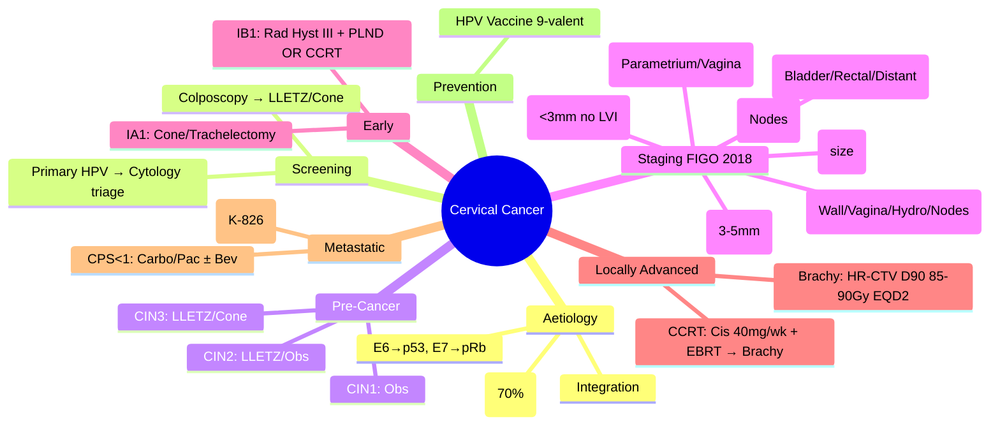

# Cervical Cancer

> [!tip] **FCPS/MRCP Priority: HIGH**
> **Cervical Cancer = 4th most common female cancer globally**; **HPV-driven (HPV16/18 70%, HPV45/31/33/52/58)**; **FIGO 2018 Staging**; **Screening: Primary HPV testing + Cytology triage**; **Pre-cancer (CIN1-3): CIN1 obs, CIN2/3 LLETZ/Cone**; **Early Stage**: IA1 (no LVI) → Cone/Trachelectomy; IA2/IB1 → Radical Hysterectomy + PLND **OR** CCRT (Cisplatin); **Locally Advanced (IB3-IVA)**: **CCRT (Weekly Cisplatin 40mg/m²) + Brachytherapy** — **Standard**; **Metastatic/Recurrent**: **Carbo/Pac ± Bev → Pembrolizumab** (KEYNOTE-826) **if PD-L1 CPS≥1**; **HPV Vaccination (9-valent) prevents 90%**.

---

## 1. Learning Objectives
By the end of this note you should be able to:
- [ ] Describe **HPV carcinogenesis** (E6/E7 → p53/pRb degradation)
- [ ] Apply **FIGO 2018 Staging** (imaging-based: MRI, PET-CT)
- [ ] Manage **CIN**: CIN1 observation, CIN2/3 LLETZ/Cone
- [ ] Select **fertility-sparing surgery** for IA1 (no LVI) / IA2 / IB1
- [ ] Prescribe **CCRT**: Weekly Cisplatin 40mg/m² + EBRT 45-50.4Gy → Brachytherapy
- [ ] Sequence **metastatic therapy**: Carbo/Pac ± Bev → Pembrolizumab (CPS≥1)
- [ ] Know **HPV Vaccination** schedule

---

## 2. Definition & Epidemiology

| Feature | Detail |
|---------|--------|
| **Definition** | Malignant tumour of cervical epithelium; **SCC 70-80%, Adenocarcinoma 20-25%**; **HPV-driven (>99%)** |
| **Incidence** | UK: ~3,200/year; **Global: 4th most common female cancer** (600k new, 340k deaths) |
| **Prevalence** | 5-year OS: Stage I ~90%, Stage II ~60%, Stage III ~40%, Stage IV ~15% |
| **Peak Age** | **Bimodal**: 35-45 (HPV-related), 60-70 (screening failures) |
| **Risk Factors** | **HPV 16/18 (70%)**, **Multiple partners**, **Early coitarche**, **Smoking** (↑2-3x), **Immunosuppression (HIV)**, **Long-term OCP**, **High parity**, **DES exposure** |
| **Protective** | **HPV Vaccination**, **Condoms**, **Circumcision (male partner)**, **Screening** |

---

## 3. Aetiology & Pathophysiology

```mermaid
flowchart LR
    A[HPV Infection (16/18)] --> B[E6/E7 Oncoproteins]
    B --> C1[E6 → p53 Degradation (Ubiquitination)]
    B --> C2[E7 → pRb Degradation → E2F Release]
    C1 --> D[Genomic Instability]
    C2 --> D
    D --> E[Cell Cycle Dysregulation]
    E --> F[Integration into Host Genome]
    F --> G[CIN → Invasive Cancer]
    G --> H1[SCC (Usual, Keratinising, Verrucous)]
    G --> H2[Adenocarcinoma (Usual, Mucinous, Villoglandular)]
    G --> H3[Adenosquamous, Neuroendocrine, Glassy cell]
```

### Histological Types

| Type | Frequency | HPV Association | Features |
|------|-----------|-----------------|----------|
| **Squamous Cell Carcinoma** | **70-80%** | **HPV16/18/45** | Keratinising, Non-keratinising, Basaloid, Verrucous |
| **Adenocarcinoma** | **20-25%** | **HPV16/18/45** | Usual, Mucinous, Villoglandular, Clear cell |
| **Adenosquamous** | 3-5% | HPV+ | Mixed glandular + squamous |
| **Neuroendocrine** | <1% | Variable (HPV+) | Small cell, Large cell — Aggressive |
| **Glassy Cell** | Rare | HPV+ | Poor prognosis |

---

## 4. Clinical Features

| Feature | Description |
|---------|-------------|
| **Abnormal Vaginal Bleeding** | **Post-coital (classic)**, Intermenstrual, Post-menopausal |
| **Vaginal Discharge** | Watery, foul-smelling (advanced) |
| **Pelvic Pain** | Late (parametrial invasion, ureteric obstruction) |
| **Leg Oedema** | Lymphatic/venous obstruction |
| **Ureteric Obstruction** | Silent renal failure (advanced) |
| **Asymptomatic** | Screen-detected (increasing) |

---

## 5. Staging (FIGO 2018 — Imaging-Based)

| Stage | Description |
|-------|-------------|
| **I** | Confined to cervix |
| IA1 | Stromal invasion **<3mm**, **<7mm width**, No LVI |
| IA2 | Stromal invasion **3-<5mm**, **<7mm width** |
| IB1 | **≥5mm**, **<2cm** |
| IB2 | **≥2cm**, **<4cm** |
| IB3 | **≥4cm** |
| **II** | Beyond uterus, not to pelvic wall/lower vagina |
| IIA1 | **<4cm** upper vagina |
| IIA2 | **≥4cm** upper vagina |
| IIB | **Parametrial invasion** |
| **III** | Pelvic wall / Lower 1/3 vagina / Hydronephrosis / Non-functioning kidney |
| IIIA | Lower 1/3 vagina |
| IIIB | Pelvic wall / Hydronephrosis |
| IIIC1 | **Pelvic LN+** (imaging/pathology) — **r/i** suffix |
| IIIC2 | **Para-aortic LN+** — **r/i** suffix |
| **IV** | Beyond true pelvis / Bladder/Rectal mucosa |
| IVA | Bladder/Rectal mucosa invasion |
| IVB | Distant mets |

---

## 6. Diagnosis & Investigations

| Investigation | Role | Key Details |
|---------------|------|-------------|
| **Cervical Screening (HPV Primary)** | Population screening | **HPV HR types → Cytology triage** → Colposcopy if +ve |
| **Colposcopy + Biopsy** | **Diagnosis** | **CIN1/2/3**, **Invasive Cancer** |
| **LLETZ / Cone Biopsy** | **Pre-cancer treatment + Microinvasion assessment** | **Margins, LVI, Depth** |
| **MRI Pelvis** | **Gold Standard Local Staging** | Tumour size, Stromal invasion, Parametrium, Nodes, Vagina |
| **PET-CT** | **Nodal/Distant Staging** (Stage IB2+) | Superior to CT for nodes; **FIGO 2018 allows imaging** |
| **CT Chest/Abd/Pelvis** | Alternative if PET unavailable | |
| **Examination Under Anaesthesia (EUA)** | Clinical staging (cystoscopy, proctoscopy) | Mandatory for FIGO clinical staging |
| **Biomarkers** | SCC Ag (SCC), CEA (Adeno) | Monitoring |

---

## 7. Differential Diagnosis

| Condition | Distinguishing Features |
|-----------|-------------------------|
| **CIN (1/2/3)** | **No stromal invasion**; High-grade dysplasia only |
| **Endocervical Polyp** | Benign, polypoid, no invasion |
| **Cervical Ectropion** | Physiological, red zone, no atypia |
| **Cervicitis** | Inflammatory, infectious (Chlamydia, Gonorrhoea) |
| **Endometrial Cancer** | Uterine origin, PMB, different staging |
| **Vaginal Cancer** | Vaginal origin, different epidemiology |
| **Cervical Pregnancy** | β-hCG+, gestational sac in cervix |

---

## 8. Management

### Pre-Cancer (CIN)

```mermaid
flowchart TD
    A[CIN Diagnosis] --> B{Grade}
    B -->|**CIN1 (LSIL)**| C[**Observation** (60-70% regress)<br/>**HPV test at 12mo**<br/>If persistent → Treat]
    B -->|**CIN2 (HSIL)**| D[**LLETZ (Large Loop Excision)**<br/>**OR Observation** (if <25yo, 50% regress)<br/>**Fertility-sparing**]
    B -->|**CIN3 (HSIL)**| E[**LLETZ / Cold Knife Cone**<br/>**Margins must be clear**<br/>**If margins +ve → Repeat excision / Hysterectomy**]
    D --> F[**Follow-up: HPV + Cytology at 6mo, then 12mo, then 3yr**]
    E --> F
```

### Early Stage (IA1-IB1)

```mermaid
flowchart TD
    A[Early Stage Cervical Cancer] --> B{Stage}
    B -->|**IA1 (No LVI)**| C[**Fertility-Sparing: Cone Biopsy / Trachelectomy**<br/>**If margins clear, no LVI → No further Rx**<br/>**If childbearing complete → Simple Hysterectomy**]
    B -->|**IA2 (LVI-)**| D[**Radical Trachelectomy + PLND** (Fertility)<br/>**OR Radical Hysterectomy + PLND**]
    B -->|**IB1 (<2cm)**| E[**Radical Hysterectomy + PLND**<br/>**Type III (Wertheim-Meigs) preferred**<br/>**OR CCRT (Weekly Cisplatin + EBRT + Brachy) — Equivalent OS**]
    C --> F[**PLND: Sentinel Node Mapping (ICG) preferred**<br/>**If SLN+ → Complete PLND / RT to pelvis**]
    D --> F
    E --> F
```

### Locally Advanced (IB2-IVA)

```mermaid
flowchart TD
    A[Locally Advanced (IB2-IVA)] --> B[**Concurrent Chemoradiation (CCRT)**]
    B --> B1[**EBRT: 45-50.4Gy/25-28fx** (Pelvis ± Para-aortic if nodes+)]
    B --> B2[**Weekly Cisplatin 40mg/m²** ×5-6 cycles (during RT)]
    B --> B3[**Brachytherapy: HDR/PDR**<br/>**Image-guided (MRI/CT)**<br/>**Point A Dose: ~85Gy EQD2**<br/>**Total EQD2 (EBRT+BT): ~85-90Gy**]
    B1 --> C[**Response Assessment (MRI/PET at 3mo)**]
    B2 --> C
    B3 --> C
    C -->|**Residual Disease**| D[**Salvage Surgery (Exenteration) / RT Boost / Chemo**]
    C -->|**CR**| E[**Surveillance**]
```

### Metastatic / Recurrent

```mermaid
flowchart TD
    A[Metastatic/Recurrent Cervical Cancer] --> B{PD-L1 CPS}
    B -->|**CPS ≥1**| C[**Carboplatin AUC5 + Paclitaxel 175mg/m² q3w ×6**<br/>**+ Bevacizumab 15mg/kg** (GOG-240) — **If eligible**<br/>**+ Pembrolizumab 200mg q3w** (KEYNOTE-826) — **OS HR 0.64, PFS HR 0.62**<br/>**→ Maintenance: Pembro + Bev**]
    B -->|**CPS <1**| D[**Carbo/Pac ± Bevacizumab** (GOG-240)<br/>**No Pembrolizumab** (OS not sig benefit)<br/>**2L: PLD, Topotecan, Gemcitabine, Bev ± Chemo**]
    D --> E[**Clinical Trial / Re-challenge**]
```

### KEYNOTE-826 Regimen

| Component | Dose/Schedule |
|-----------|---------------|
| **Pembrolizumab** | 200mg IV q3w |
| **Carboplatin** | AUC5 IV d1 q3w |
| **Paclitaxel** | 175mg/m² IV d1 q3w |
| **Bevacizumab** | 15mg/kg IV d1 q3w (optional, if eligible) |
| **Cycles** | 6 cycles chemo → **Maintenance Pembrolizumab + Bev** |

---

## 9. FCPS/MRCP High-Yield Summary

| Topic | Key Points |
|-------|------------|
| **HPV** | **HPV16/18 (70%)**, E6→p53 deg, E7→pRb deg; **Screening prevents 70%** |
| **FIGO 2018** | **Imaging-based** (MRI, PET-CT); **LN+ = IIIC1 (pelvic), IIIC2 (para-aortic)**; **IA1 <3mm no LVI** |
| **Screening** | **Primary HPV → Cytology triage** → Colposcopy |
| **CIN** | **CIN1: Obs**; **CIN2: LLETZ/Obs (<25yo)**; **CIN3: LLETZ/Cone** |
| **IA1 (No LVI)** | **Cone/Trachelectomy** (fertility) **OR Simple Hysterectomy** |
| **IB1 (<2cm)** | **Radical Hysterectomy Type III + PLND** **OR CCRT** (equivalent OS) |
| **Locally Advanced** | **CCRT: Weekly Cisplatin 40mg/m² + EBRT 45-50.4Gy → Brachy** |
| **Brachytherapy** | **Image-guided (MRI/CT)**, **Point A ~85Gy EQD2**, **Total ~85-90Gy EQD2** |
| **Metastatic** | **Carbo/Pac + Bev + Pembro** (KEYNOTE-826) **if CPS≥1** → **OS HR 0.64** |
| **HPV Vaccine** | **9-valent (6,11,16,18,31,33,45,52,58)** — **2-dose <15yr, 3-dose ≥15yr** |

---

## 10. Viva Questions (MRCP PACES / FCPS)

| Question | Expected Answer |
|----------|-----------------|
| **35F, screen-detected, biopsy: SCC IA2 (4mm invasion, no LVI). Fertility desired. Management?** | **Radical Trachelectomy + PLND** (fertility-sparing) **OR** **Radical Hysterectomy + PLND** (if childbearing complete). |
| **45F, 3cm cervical mass, parametrial invasion, PET: pelvic nodes+. FIGO Stage?** | **IIIC1r** (Imaging-detected pelvic nodes) — **Stage IIIB parametrial + IIIC1 nodes = IIIC1** |
| **Locally advanced CCRT — Cisplatin dose/schedule?** | **Weekly Cisplatin 40mg/m²** ×5-6 cycles **concurrent with EBRT** (45-50.4Gy/25-28fx). |
| **Brachytherapy — target dose?** | **Point A EQD2 ~85Gy** (combined EBRT+BT); **HDR: 7Gy ×4 fractions** or **PDR: 0.5-1Gy/hr**; **Image-guided (MRI/CT)**. |
| **KEYNOTE-826 — population, regimen, outcome?** | **Metastatic/Recurrent, PD-L1 CPS≥1**, **Carbo/Pac + Bev + Pembro vs Placebo** → **OS HR 0.64, PFS HR 0.62**. |
| **CPS <1 — pembrolizumab benefit?** | **No significant OS benefit in CPS<1** — **Not indicated**. |
| **Fertility-sparing for IB1 — criteria?** | **<2cm, No LVI, No nodal mets, Childbearing desire** → **Radical Trachelectomy + PLND** (conization margins clear). |
| **CIN2 in 22F — management?** | **LLETZ preferred** (or observation if compliant, 50% regression); **Follow-up HPV+Cytology 6mo**. |
| **HPV vaccination — schedule?** | **9-valent: 2-dose (0, 6-12mo) if <15yr; 3-dose (0, 1-2, 6mo) if ≥15yr**. |
| **Radical Hysterectomy Type III — what is removed?** | **Uterus, Cervix, Upper 1-2cm Vagina, Parametrium (medial 1/2), Pelvic LN** — **Ovaries preserved if premenopausal**. |

---

## 11. Confusions & Mnemonics

| Confusion | Clarification |
|-----------|---------------|
| **FIGO 2009 vs 2018** | **2018: Imaging-based (MRI/PET)**; **LN+ upstages to IIIC**; **IA1 <3mm, IA2 3-5mm, IB1-3 by size**; **Old clinical staging obsolete** |
| **CCRT vs Surgery for IB1** | **Equivalent OS**; **Surgery: Surgical morbidity, pathology staging**; **CCRT: Organ preservation, better sexual function, avoids surgery if unfit** |
| **CPS ≥1 vs <1 in KEYNOTE-826** | **CPS≥1: Pembro + Chemo/Bev → OS HR 0.64**; **CPS<1: No OS benefit** — **CPS is predictive** |
| **Brachytherapy — Point A vs Dose to HR-CTV** | **Modern: HR-CTV (High-Risk Clinical Target Volume) D90 ≥85-90Gy EQD2**; **Point A historical surrogate** |
| **GOG-240 vs KEYNOTE-826** | **GOG-240**: Carbo/Pac ± Bev (Bev added PFS/OS); **KEYNOTE-826**: Adds Pembro → **Further OS benefit in CPS≥1** |
| **Trachelectomy vs Cone for IA1** | **Cone: IA1 no LVI (excisional)**; **Trachelectomy: IA2/IB1 (radical, removes parametrium + uterosacral ligaments)** |

**Mnemonic: CERVICAL**
- **C**ervical: **HPV 16/18 (70%)**, E6/p53, E7/pRb
- **E**arly: **IA1 Cone/Trachelectomy**; **IB1 Radical Hyst III OR CCRT**
- **R**adical Hysterectomy Type III (Wertheim-Meigs)
- **V**accination: **9-valent, 2-dose<15yr, 3-dose≥15yr**
- **I**maging-based: **FIGO 2018** (MRI/PET, LN+ = IIIC)
- **C**CRT: **Weekly Cisplatin 40mg/m² + EBRT → Brachy** (Point A 85Gy EQD2)
- **A**dvanced: **KEYNOTE-826** — Carbo/Pac/Bev + **Pembro (CPS≥1)** — OS HR 0.64
- **A**bnormal bleeding: **Post-coital** classic
- **L**LETZ: **CIN2/3**; **CIN1 Obs**

---

## 12. Mind Map



---

## 13. One-Page Revision Card

| Domain | Key Points |
|--------|------------|
| **HPV** | 16/18 (70%), E6/p53, E7/pRb |
| **FIGO 2018** | IA1<3mm, IA2 3-5mm, IB1<2cm, IB2 2-4cm, IB3≥4cm, LN+=IIIC |
| **Screening** | Primary HPV → Cytology triage |
| **CIN** | CIN1 Obs, CIN2 LLETZ, CIN3 LLETZ/Cone |
| **IA1** | Cone/Trachelectomy (no LVI) |
| **IB1** | Rad Hyst III + PLND OR CCRT |
| **Loc Adv** | CCRT: Cis 40mg/wk + EBRT 45-50.4Gy → Brachy (85Gy EQD2) |
| **Metastatic** | CPS≥1: Carbo/Pac/Bev + Pembro (K-826); CPS<1: Carbo/Pac ± Bev |
| **Vaccine** | 9-valent, 2-dose<15yr, 3-dose≥15yr |

---

## 14. Spaced Repetition Trackers

| Review Interval | Date Completed | Confidence (1-5) | Notes |
|-----------------|----------------|------------------|-------|
| 24 hours | | | |
| 7 days | | | |
| 15 days | | | |
| 30 days | | | |
| 90 days | | | |

---

## 15. Self-Test Scorecard

| Section | Score /5 | Last Attempt |
|---------|----------|--------------|
| FIGO 2018 Staging | | |
| CCRT Regimen | | |
| Brachytherapy Dosing | | |
| KEYNOTE-826 / GOG-240 | | |
| Fertility-Sparing Criteria | | |
| CIN Management | | |
| HPV Vaccination | | |
| CPS in KEYNOTE-826 | | |

---

## 16. Local Navigation
- **Parent Heading**: [[../Oncology|Oncology]]
- **Chapter Map**: [[../Davidson Chapter 7 - Oncology Hierarchy|Oncology Hierarchy]]
- **Chapter MOC**: [[../Oncology MOC|Oncology MOC]]
- **Drug Reference": [[../../Clinical Therapeutics and Good Prescribing|Drugs]]
- **Related": [[Ovarian Cancer]], [[Endometrial Cancer]], [[HPV Vaccination]], [[CIN/LLETZ]], [[FIGO 2018]], [[KEYNOTE-826]], [[PD-L1 CPS]]

---

# FCPS/MRCP Exam Extras

## 17. MCQs (10)


**1.** Regarding Cervical Cancer (HPV), which statement is correct?
   A. **HPV16/18 (70%)**, E6→p53 deg, E7→pRb deg
   B. **HPV16/18 - alternative approach
   C. Empirical management only
   D. Watch and wait
   - **Answer: A** — **HPV16/18 (70%)**, E6→p53 deg, E7→pRb deg; **Screening prevents 70%**


**2.** Regarding Cervical Cancer (FIGO 2018), which statement is correct?
   A. **Imaging-based** (MRI, PET-CT)
   B. **Imaging-based** - alternative approach
   C. Empirical management only
   D. Watch and wait
   - **Answer: A** — **Imaging-based** (MRI, PET-CT); **LN+ = IIIC1 (pelvic), IIIC2 (para-aortic)**; **IA1 <3mm no LVI**


**3.** Regarding Cervical Cancer (Screening), which statement is correct?
   A. **Primary HPV → Cytology triage** → Colposcopy
   B. **Primary - alternative approach
   C. Empirical management only
   D. Watch and wait
   - **Answer: A** — **Primary HPV → Cytology triage** → Colposcopy


**4.** Regarding Cervical Cancer (CIN), which statement is correct?
   A. **CIN1: Obs**
   B. **CIN1: - alternative approach
   C. Empirical management only
   D. Watch and wait
   - **Answer: A** — **CIN1: Obs**; **CIN2: LLETZ/Obs (<25yo)**; **CIN3: LLETZ/Cone**


**5.** Regarding Cervical Cancer (IA1 (No LVI)), which statement is correct?
   A. **Cone/Trachelectomy** (fertility) **OR Simple Hysterectomy**
   B. **Cone/Trachelectomy** - alternative approach
   C. Empirical management only
   D. Watch and wait
   - **Answer: A** — **Cone/Trachelectomy** (fertility) **OR Simple Hysterectomy**


**6.** Regarding Cervical Cancer (IB1 (<2cm)), which statement is correct?
   A. **Radical Hysterectomy Type III + PLND** **OR CCRT** (equivalent OS)
   B. **Radical - alternative approach
   C. Empirical management only
   D. Watch and wait
   - **Answer: A** — **Radical Hysterectomy Type III + PLND** **OR CCRT** (equivalent OS)


**7.** Regarding Cervical Cancer (Locally Advanced), which statement is correct?
   A. **CCRT: Weekly Cisplatin 40mg/m² + EBRT 45-50.4Gy → Brachy**
   B. **CCRT: - alternative approach
   C. Empirical management only
   D. Watch and wait
   - **Answer: A** — **CCRT: Weekly Cisplatin 40mg/m² + EBRT 45-50.4Gy → Brachy**


**8.** Regarding Cervical Cancer (Brachytherapy), which statement is correct?
   A. **Image-guided (MRI/CT)**, **Point A ~85Gy EQD2**, **Total ~85-90Gy EQD2**
   B. **Image-guided - alternative approach
   C. Empirical management only
   D. Watch and wait
   - **Answer: A** — **Image-guided (MRI/CT)**, **Point A ~85Gy EQD2**, **Total ~85-90Gy EQD2**


**9.** Regarding Cervical Cancer (Metastatic), which statement is correct?
   A. **Carbo/Pac + Bev + Pembro** (KEYNOTE-826) **if CPS≥1** → **OS HR 0.64**
   B. **Carbo/Pac - alternative approach
   C. Empirical management only
   D. Watch and wait
   - **Answer: A** — **Carbo/Pac + Bev + Pembro** (KEYNOTE-826) **if CPS≥1** → **OS HR 0.64**


**10.** Regarding Cervical Cancer (HPV Vaccine), which statement is correct?
   A. **9-valent (6,11,16,18,31,33,45,52,58)**
   B. **9-valent - alternative approach
   C. Empirical management only
   D. Watch and wait
   - **Answer: A** — **9-valent (6,11,16,18,31,33,45,52,58)** — **2-dose <15yr, 3-dose ≥15yr**


## 18. SBA Questions (10)


**1.** A 55-year-old presents with classic features. MDT discussion recommends:
   - A. **HPV16/18 (70%)**, E6→p53 deg, E7→pRb deg
   - B. **HPV16/18 (less specific)
   - C. Empirical broad approach
   - D. No intervention required
   - **Answer: A** — first-line: **HPV16/18 (70%)**, E6→p53 deg, E7→pRb deg; **Screening prevents 70%**


**2.** On staging workup, the patient is found to be [Stage X]. Best management is:
   - A. **Imaging-based** (MRI, PET-CT)
   - B. **Imaging-based** (less specific)
   - C. Empirical broad approach
   - D. No intervention required
   - **Answer: A** — stage-specific: **Imaging-based** (MRI, PET-CT); **LN+ = IIIC1 (pelvic), IIIC2 (para-aortic)**; **IA1 <3mm no LVI**


**3.** Following first-line treatment, the patient develops [complication]. Best next step:
   - A. **Primary HPV → Cytology triage** → Colposcopy
   - B. **Primary (less specific)
   - C. Empirical broad approach
   - D. No intervention required
   - **Answer: A** — complication: **Primary HPV → Cytology triage** → Colposcopy


**4.** The patient asks about prognosis. Most appropriate response based on:
   - A. **CIN1: Obs**
   - B. **CIN1: (less specific)
   - C. Empirical broad approach
   - D. No intervention required
   - **Answer: A** — prognosis: **CIN1: Obs**; **CIN2: LLETZ/Obs (<25yo)**; **CIN3: LLETZ/Cone**


**5.** A 65-year-old with relevant risk factors should be screened with:
   - A. **Cone/Trachelectomy** (fertility) **OR Simple Hysterectomy**
   - B. **Cone/Trachelectomy** (less specific)
   - C. Empirical broad approach
   - D. No intervention required
   - **Answer: A** — screening: **Cone/Trachelectomy** (fertility) **OR Simple Hysterectomy**


**6.** The most clinically important biomarker/molecular test is:
   - A. **Radical Hysterectomy Type III + PLND** **OR CCRT** (equivalent OS)
   - B. **Radical (less specific)
   - C. Empirical broad approach
   - D. No intervention required
   - **Answer: A** — biomarker: **Radical Hysterectomy Type III + PLND** **OR CCRT** (equivalent OS)


**7.** The standard chemotherapy/regimen of choice is:
   - A. **CCRT: Weekly Cisplatin 40mg/m² + EBRT 45-50.4Gy → Brachy**
   - B. **CCRT: (less specific)
   - C. Empirical broad approach
   - D. No intervention required
   - **Answer: A** — chemo: **CCRT: Weekly Cisplatin 40mg/m² + EBRT 45-50.4Gy → Brachy**


**8.** The role of surgery in this case is:
   - A. **Image-guided (MRI/CT)**, **Point A ~85Gy EQD2**, **Total ~85-90Gy EQD2**
   - B. **Image-guided (less specific)
   - C. Empirical broad approach
   - D. No intervention required
   - **Answer: A** — surgery: **Image-guided (MRI/CT)**, **Point A ~85Gy EQD2**, **Total ~85-90Gy EQD2**


**9.** The recommended surveillance/follow-up protocol is:
   - A. **Carbo/Pac + Bev + Pembro** (KEYNOTE-826) **if CPS≥1** → **OS HR 0.64**
   - B. **Carbo/Pac (less specific)
   - C. Empirical broad approach
   - D. No intervention required
   - **Answer: A** — follow-up: **Carbo/Pac + Bev + Pembro** (KEYNOTE-826) **if CPS≥1** → **OS HR 0.64**


**10.** Palliative care referral is most appropriate when:
   - A. **9-valent (6,11,16,18,31,33,45,52,58)**
   - B. **9-valent (less specific)
   - C. Empirical broad approach
   - D. No intervention required
   - **Answer: A** — palliative: **9-valent (6,11,16,18,31,33,45,52,58)** — **2-dose <15yr, 3-dose ≥15yr**


## 19. Flashcards

**Q1:** HPV?
**A1:** HPV16/18 (70%), E6→p53 deg, E7→pRb deg; Screening prevents 70%

**Q2:** FIGO 2018?
**A2:** Imaging-based (MRI, PET-CT); LN+ = IIIC1 (pelvic), IIIC2 (para-aortic); IA1 <3mm no LVI

**Q3:** Screening?
**A3:** Primary HPV → Cytology triage → Colposcopy

**Q4:** CIN?
**A4:** CIN1: Obs; CIN2: LLETZ/Obs (<25yo); CIN3: LLETZ/Cone

**Q5:** IA1 (No LVI)?
**A5:** Cone/Trachelectomy (fertility) OR Simple Hysterectomy

**Q6:** IB1 (<2cm)?
**A6:** Radical Hysterectomy Type III + PLND OR CCRT (equivalent OS)

**Q7:** Locally Advanced?
**A7:** CCRT: Weekly Cisplatin 40mg/m² + EBRT 45-50.4Gy → Brachy

**Q8:** Brachytherapy?
**A8:** Image-guided (MRI/CT), Point A ~85Gy EQD2, Total ~85-90Gy EQD2

## 20. Answer Key with Explanations

| # | MCQ | Topic | Explanation |
|---|-----|-------|-------------|
| 1 | A | HPV | HPV16/18 (70%), E6→p53 deg, E7→pRb deg; Screening prevents 70% |
| 2 | A | FIGO 2018 | Imaging-based (MRI, PET-CT); LN+ = IIIC1 (pelvic), IIIC2 (para-aortic); IA1 <3mm no LVI |
| 3 | A | Screening | Primary HPV → Cytology triage → Colposcopy |
| 4 | A | CIN | CIN1: Obs; CIN2: LLETZ/Obs (<25yo); CIN3: LLETZ/Cone |
| 5 | A | IA1 (No LVI) | Cone/Trachelectomy (fertility) OR Simple Hysterectomy |
| 6 | A | IB1 (<2cm) | Radical Hysterectomy Type III + PLND OR CCRT (equivalent OS) |
| 7 | A | Locally Advanced | CCRT: Weekly Cisplatin 40mg/m² + EBRT 45-50.4Gy → Brachy |
| 8 | A | Brachytherapy | Image-guided (MRI/CT), Point A ~85Gy EQD2, Total ~85-90Gy EQD2 |
| 9 | A | Metastatic | Carbo/Pac + Bev + Pembro (KEYNOTE-826) if CPS≥1 → OS HR 0.64 |
| 10 | A | HPV Vaccine | 9-valent (6,11,16,18,31,33,45,52,58) — 2-dose <15yr, 3-dose ≥15yr |

| # | SBA | Topic | Explanation |
|---|-----|-------|-------------|
| 1 | A | HPV | HPV16/18 (70%), E6→p53 deg, E7→pRb deg; Screening prevents 70% |
| 2 | A | FIGO 2018 | Imaging-based (MRI, PET-CT); LN+ = IIIC1 (pelvic), IIIC2 (para-aortic); IA1 <3mm no LVI |
| 3 | A | Screening | Primary HPV → Cytology triage → Colposcopy |
| 4 | A | CIN | CIN1: Obs; CIN2: LLETZ/Obs (<25yo); CIN3: LLETZ/Cone |
| 5 | A | IA1 (No LVI) | Cone/Trachelectomy (fertility) OR Simple Hysterectomy |
| 6 | A | IB1 (<2cm) | Radical Hysterectomy Type III + PLND OR CCRT (equivalent OS) |
| 7 | A | Locally Advanced | CCRT: Weekly Cisplatin 40mg/m² + EBRT 45-50.4Gy → Brachy |
| 8 | A | Brachytherapy | Image-guided (MRI/CT), Point A ~85Gy EQD2, Total ~85-90Gy EQD2 |
| 9 | A | Metastatic | Carbo/Pac + Bev + Pembro (KEYNOTE-826) if CPS≥1 → OS HR 0.64 |
| 10 | A | HPV Vaccine | 9-valent (6,11,16,18,31,33,45,52,58) — 2-dose <15yr, 3-dose ≥15yr |

## 21. Local Navigation


- **Parent Heading Hub**: [[../../Gynaecological Cancers|Gynaecological Cancers]]
- **Chapter Map**: [[../../Davidson Chapter 7 - Oncology Hierarchy|Oncology Hierarchy]]
- **Chapter MOC**: [[../../Oncology MOC|Oncology MOC]]
- **Drug Reference**: [[../../../Clinical Therapeutics and Good Prescribing|Drugs]]

