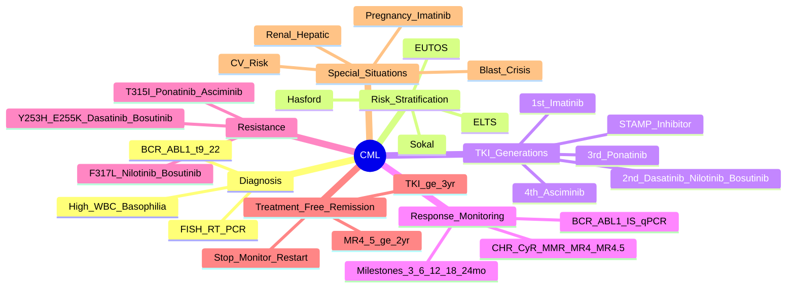

# Chronic Myeloid Leukaemia (CML)

> [!tip] **FCPS/MRCP Priority: CRITICAL**
> CML = **BCR::ABL1 (t(9;22))** driven myeloproliferative neoplasm. **TKI revolutionised treatment** — **Imatinib 1L standard, 2nd/3rd gen for resistance/intolerance**. **TFR (Treatment-Free Remission)** = new endpoint. **Blast crisis = AML-like**.

---

## 1. Learning Objectives
By the end of this note you should be able to:
- [ ] Diagnose CML using **BCR::ABL1 (t(9;22))** and apply **ELTS/Sokal/ELN risk scores**
- [ ] Apply **TKI sequencing** (Imatinib → 2nd/3rd/4th gen) based on response milestones & resistance
- [ ] Monitor **molecular response** (BCR-ABL1 IS qPCR) — **MR4.5 (MR4.5 = MR4.5) = TFR eligibility**
- [ ] Manage **TKI resistance** (T315I mutation → Ponatinib; compound mutations)
- [ ] Apply **Treatment-Free Remission (TFR)** criteria and monitoring
- [ ] Recognise and manage **Blast Crisis** and **TKI resistance mechanisms**

---

## 2. Definition & Epidemiology

| Feature | Detail |
|---------|--------|
| **Definition** | **Myeloproliferative neoplasm** driven by **BCR::ABL1 (t(9;22))** constitutively active tyrosine kinase |
| **Incidence** | **1-2/100,000/year** |
| **Median Age** | **55-65 years** |
| **Sex Ratio** | **M > F** (1.5:1) |
| **Natural History** | **Chronic Phase (CP) → Accelerated Phase (AP) → Blast Crisis (BC)** — untreated CP → AP → BC in 3-5 years |

---

## 3. Diagnosis & Risk Stratification

### Diagnostic Criteria
| Criterion | Requirement |
|-----------|-------------|
| **BCR::ABL1** | **t(9;22) (q34;q11)** — **FISH/RT-PCR positive** |
| **WBC** | **Typically >100×10⁹/L** (can be normal in "leukaemic" phase) |
| **Bone Marrow** | **Hypercellualr, left-shifted myelopoiesis**, **<10% blasts (CP)** |
| **Basophilia** | **>2%** (characteristic) |

### Risk Scores (Chronic Phase)
| Score | Variables | Risk Groups | Use |
|-------|-----------|-------------|-----|
| **Sokal** | Age, Spleen size, Plt %, Blast % | Low / Intermediate / High | Historical |
| **Hasford (ELTS)** | Age, Spleen, Plt, Blast, Eos, Baso | Low / Intermediate / High | **Preferred** |
| **ELTS** | Age, Spleen, Plt, Blast, Eos, Baso | Low / Intermediate / High | **Current Standard** |
| **EUTOS** | Spleen, Basophils% | Low / High | Simplified |

| Risk | Sokal Score | Hasford Score | ELTS Score |
|------|-------------|---------------|------------|
| **Low** | <0.8 | <780 | 0 |
| **Intermediate** | 0.8-1.2 | 780-1480 | 1-2 |
| **High** | >1.2 | >1480 | ≥3 |

---

## 4. TKI Therapy — **Treatment Revolution**

### TKI Generations & Indications
| Generation | TKI | Dose | Key Indications |
|------------|-----|------|-----------------|
| **1st Gen** | **Imatinib** | 400mg OD | **1L Standard** (IRIS trial) |
| **2nd Gen** | **Dasatinib** | 100mg OD | **1L (superior molecular response)**, Resistance/Intolerance to Imatinib |
| | **Nilotinib** | 300mg BD | **1L**, Faster deep molecular response |
| | **Bosutinib** | 400mg OD | **Resistance/Intolerance** |
| **3rd Gen** | **Ponatinib** | **45mg OD** | **T315I mutation**, **Resistance to 2nd/3rd gen**, **Last resort** |
| **4th Gen** | **Asciminib** | 40mg BD | **STAMP inhibitors** — **T315I, resistance to all TKIs** |

> [!critical] **TKI Choice for 1L**
> - **Imatinib 400mg OD** = **Standard 1L** (IRIS: 89% 8-yr OS)
> - **Dasatinib/Nilotinib** = **Faster/Deeper MMR**, higher CCyR/MMR rates — **Preferred if high risk (Sokal/Hasford High)**
> - **Nilotinib** — **QTc prolongation, hyperglycaemia, pancreatitis** — avoid if cardiac risk
> - **Dasatinib** — **Pleural effusion, pulmonary HTN** — avoid if lung disease
> - **Bosutinib** — **Diarrhoea, hepatotoxicity** — 2L/3L
> - **Ponatinib** — **ONLY for T315I or multi-TKI resistance** — **Arterial thrombosis, HTN, pancreatitis**
> - **Asciminib** — **STAMP inhibitor (myristoyl pocket)** — **T315I, post-Ponatinib** — No arterial toxicity

---

## 5. Molecular Response Monitoring — **BCR-ABL1 IS (International Scale)**

| Response Level | Definition (IS) | Clinical Significance |
|----------------|-----------------|----------------------|
| **CHR (Complete Haematological Response)** | **WBC <10, Plt <450, Basophils <5%, No extramedullary disease** | Baseline |
| **CyR (Cytogenetic Response)** | **CCyR: 0% Ph+ metaphases**; **PCyR: 1-35%** | Standard cytogenetics |
| **MMR (Major Molecular Response)** | **BCR-ABL1 ≤0.1% IS** (≤0.1%) | **Key milestone** (≤0.1% = MMR) |
| **MR4 (MR4)** | **BCR-ABL1 ≤0.01% IS** | **Deep Molecular Response** |
| **MR4.5 (MR4.5)** | **BCR-ABL1 ≤0.0032% IS** (≤0.0032%) | **TFR Eligibility** |
| **MR5 (MR5)** | **BCR-ABL1 ≤0.001% IS** (undetectable) | **Undetectable** |

> [!critical] **Monitoring Schedule (ELN/NCCN)**
> - **Every 3 months** until MMR
> - **Every 3-6 months** after MMR
> - **Every 6 months** after MR4.5

> [!critical] **Response Milestones (ELN 2020)**
> - **3 months**: **BCR-ABL1 ≤10%** (Early molecular response)
> - **6 months**: **BCR-ABL1 ≤1%** (MMR trajectory)
> - **12 months**: **MMR (≤0.1%)** — **Failure if >0.1%** → switch TKI
> - **18 months**: **MR4 (≤0.01%)**
> - **24 months**: **MR4.5** → TFR eligibility

---

## 6. Treatment Failure & Resistance Definitions (ELN 2020)

| Timepoint | Failure | Warning | Optimal |
|-----------|---------|---------|---------|
| **3 months** | BCR-ABL1 >10% | 1-10% | ≤1% |
| **6 months** | >1% | 0.1-1% | ≤0.1% (MMR) |
| **12 months** | >0.1% | 0.01-0.1% | ≤0.01% (MR4) |
| **18 months** | >0.01% | 0.001-0.01% | ≤0.001 (MR4.5) |
| **Any time** | Loss of CHR, Loss of CyR, Loss of MMR, New mutations | | |

> [!critical] **Failure at any timepoint = Switch TKI**

---

## 7. TKI Resistance & Mutation Management

### Resistance Mechanisms
| Mechanism | Examples |
|-----------|----------|
| **BCR-ABL1 Kinase Domain Mutations** | **T315I (gatekeeper)**, Y253H, E255K/V, F317L, T315A, F359V, Y253F |
| **BCR-ABL1 Amplification** | Gene amplification |
| **BCR-ABL1 Independent** | SRC kinase activation, Lyn, Hck, alternative pathways |

### TKI Selection by Mutation

| Mutation | Imatinib | Dasatinib | Nilotinib | Bosutinib | Ponatinib | Asciminib |
|----------|----------|-----------|-----------|----------|-----------|-----------|
| **T315I** | ✗ | ✗ | ✗ | ✗ | **✓** | **✓** |
| **Y253H / E255K/V** | ✗ | **✓** | ✗ | **✓** | **✓** | **✓** |
| **F317L** | ✗ | ✗ | **✓** | **✓** | **✓** | **✓** |
| **T315A** | ✗ | **✓** | ✗ | **✓** | **✓** | **✓** |
| **F359V** | ✗ | **✓** | **✓** | **✓** | **✓** | **✓** |
| **Y253F** | ✗ | **✓** | ✗ | **✓** | **✓** | **✓** |
| **No mutation (BCR-ABL1 indep.)** | ✗ | ± | ± | ± | **✓** | **✓** |

> [!critical] **T315I = Ponatinib or Asciminib ONLY**
> - **Ponatinib 45mg OD** → **Arterial thrombosis, HTN, pancreatitis**
> - **Asciminib 40mg BD** — **STAMP inhibitor (myristoyl pocket)**, **No arterial toxicity**

---

## 8. Treatment-Free Remission (TFR) — **New Endpoint**

| Criteria | Requirement |
|----------|-------------|
| **Deep Molecular Response** | **MR4.5 (BCR-ABL1 ≤0.0032% IS) sustained ≥2 years** |
| **TKI Duration** | **≥3 years** on TKI prior to stopping |
| **Age** | Any (but more data in adults) |
| **Prior HSC Transplant** | Allowed if in sustained MR4.5 |
| **Monitoring Post-Stop** | **q4-6 weeks ×1yr, q3mo ×2yr, q6mo thereafter** |
| **Relapse Definition** | **Loss of MMR (BCR-ABL1 >0.1%)** → **Restart same TKI** |

| TFR Success Rate | Data |
|------------------|------|
| **Imatinib (STOP 2G-TFR)** | **~40-50% TFR at 2y** |
| **Nilotinib (ENESTfreedom)** | **~50% TFR at 2y** |
| **Dasatinib (DASFREE)** | **~50% TFR at 2y** |
| **Predictors of TFR Success** | **Longer MR4.5 duration, Lower Sokal, Female, Younger age** |

---

## 9. Blast Crisis — **Transformation**

| Feature | Detail |
|---------|--------|
| **Definition** | **Blasts ≥20% in PB/BM** OR **Extramedullary blasts** |
| **Lineage** | **Myeloid (70%)** > **Lymphoid (20-30%)** > Mixed/Undifferentiated |
| **Prognosis** | **Poor** (Median OS 3-6 months) |
| **Treatment** | **Induction per lineage (AML-type or ALL-type) + TKI** → **Allo-HSCT if CR** |
| **TKI in Blast Crisis** | **3rd/4th gen (Ponatinib/Asciminib) + Induction Chemo** |

---

## 10. Special Situations

| Scenario | Management |
|----------|------------|
| **Pregnancy** | **Imatinib** (Category D but safest TKI) — **Stop other TKIs**; **Breastfeeding: Imatinib OK** (low milk transfer) |
| **Renal Impairment** | **Imatinib/Nilotinib/Bosutinib** dose adjust; **Dasatinib/Ponatinib/Asciminib** no adjustment |
| **Hepatic Impairment** | **Dose reduce**: Nilotinib, Bosutinib, Ponatinib, Asciminib |
| **Cardiovascular Disease** | **Avoid Nilotinib (QTc, vascular events), Ponatinib (arterial thrombosis)** — Prefer Dasatinib/Bosutinib/Imatinib/Asciminib |
| **Pleural Effusion** | **Dasatinib** — Hold, diurectic, steroids; Switch if recurrent |
| **QTc Prolongation** | **Nilotinib** — Avoid if QTc >450ms; Correct electrolytes |

---

## 11. FCPS/MRCP High-Yield Summary

| Topic | Key Points |
|-------|------------|
| **Diagnosis** | **BCR::ABL1 t(9;22)**; WBC high, basophilia, splenomegaly |
| **Risk Scores** | **ELTS preferred** (Age, Spleen, Plt, Blast, Eos, Baso) |
| **1L TKI Choice** | **Imatinib 400mg** (Standard); **Dasatinib/Nilotinib** if High Risk/Sokal; **Bosutinib** 2L |
| **Response Milestones** | **3mo: ≤10%; 6mo: ≤1% (MMR); 12mo: ≤0.1% (MR4); 24mo: ≤0.0032% (MR4.5)** |
| **Failure** | >10% at 3mo, >1% at 6mo, >0.1% at 12mo, >0.01% at 18mo |
| **Resistance Mutations** | **T315I = Ponatinib/Asciminib**; Y253H/E255K → Dasatinib/Bosutinib; F317L → Nilotinib/Bosutinib |
| **T315I** | **Ponatinib 45mg or Asciminib 40mg BD** — Asciminib preferred (no arterial toxicity) |
| **MR4.5 + 2yr TKI** | **TFR Eligibility** — Stop TKI, monitor q4-6wk → ×2yr |
| **Blast Crisis** | **Blasts ≥20%** — Induction per lineage + 3rd/4th gen TKI → Allo-HSCT |
| **Pregnancy** | **Imatinib only** (Category D but safest); Stop others |
| **Cardiac Toxicity** | **Nilotinib (QTc, ischaemia), Ponatinib (arterial thrombosis)** — Avoid |

---

## 12. Viva Questions (MRCP PACES / FCPS)

| Question | Expected Answer |
|----------|----------------|
| "What are the response milestones for CML on TKI therapy?" | **3mo: ≤10%; 6m: ≤1% (MMR); 12m: ≤0.1% (MR4); 18m: ≤0.01% (MR4.5); 24m: ≤0.0032% (MR4.5)** |
| "A CML patient on imatinib has BCR-ABL1 5% at 6 months. What do you do?" | **Treatment failure (BCR-ABL1 >1% at 6mo)** — **Switch to 2nd gen TKI** (Dasatinib/Nilotinib/Bosutinib) or consider mutation testing. |
| "What mutation confers resistance to all TKIs except Ponatinib and Asciminib?" | **T315I (gatekeeper mutation)** — resistance to Imatinib, Dasatinib, Nilotinib, Bosutinib. |
| "How do you monitor molecular response in CML?" | **BCR-ABL1 IS qPCR on peripheral blood** — **every 3 months until MMR, then 3-6 monthly** |
| "What are the criteria for Treatment-Free Remission (TFR)?" | **MR4.5 (BCR-ABL1 ≤0.0032% IS) sustained ≥2 years**, **TKI duration ≥3 years**, then stop TKI and monitor q4-6wk ×1yr, q3mo ×2yr. |
| "A patient on dasatinib develops pleural effusion. Management?" | **Hold dasatinib, diuretics, consider steroids**; if recurrent → **switch to alternative TKI (nilotinib, bosutinib, imatinib)** |
| "What is the difference between Nilotinib and Dasatinib toxicities?" | **Nilotinib**: QTc prolongation, hyperglycaemia, pancreatitis, peripheral neuropathy. **Dasatinib**: Pleural effusion, pulmonary HTN, diarrhoea, thrombocytopenia. |
| "What is the monitoring schedule for CML on TKI?" | **q3mo until MMR**, then **q3-6mo until MR4.5**, then **6-monthly** |
| "When is Allo-HSCT indicated in CML?" | **Blast crisis, TKI failure (2+ lines), T315I mutation**, advanced phase (AP/BC) |
| "What is warning response at 6 months?" | **BCR-ABL1 0.1-1% (not MMR but not failure)** — Continue TKI, monitor closely |

---

## 13. Confusions & Mnemonics

| Confusion | Clarification |
|-----------|---------------|
| **Imatinib vs 2nd Gen 1L** | **Imatinib = Standard 1L** (cost-effective); **2nd Gen (Dasatinib/Nilotinib)** = Faster/Deeper MMR, preferred if High Sokal/Hasford/ELTS risk |
| **Ponatinib vs Asciminib (T315I)** | **Ponatinib**: 45mg OD, **Arterial thrombosis, HTN, pancreatitis**. **Asciminib**: 40mg BD, **STAMP inhibitor (myristoyl pocket), NO arterial toxicity** — Preferred if CV risk |
| **TFR vs Stop Imatinib** | **TFR = Planned stop** after MR4.5 ≥2y + 3y TKI; **Restart if MMR lost**. Random stop = high relapse. |
| **MMR vs MR4 vs MR4.5** | **MMR ≤0.1%**, **MR4 ≤0.01%**, **MR4.5 ≤0.0032%** (IS) |
| **Loss of MMR after TFR** | **Restart SAME TKI immediately** — high chance of re-achieving MMR |

**Mnemonic: TKI Generations = "I-DASH-NIL-BOS-PON-ASC"**
- **I**matinib (1st)
- **DAS**atinib, **NIL**otinib, **BOS**utinib (2nd)
- **PON**atinib, **ASC**iminib (3rd/4th)

**Mnemonic: T315I = "PON-ASC ONLY"**
- **PON**atinib
- **ASC**iminib
- **ONLY** for T315I

**Mnemonic: Resistance Mutations = "YET-FLY"**
- **Y**253H
- **E**255K/V
- **T**315I
- **F**317L
- **L** (T315A, F359V, Y253F)

**Mnemonic: TKI Toxicity = "DAS-PLEURAL, NIL-QTC, PON-ARTERIAL, BOS-DIARRHEA"**
- **DAS**atinib → **PLEU**ral effusion, Pulm HTN
- **NIL**otinib → **QTC** prolongation, Hyperglycaemia
- **PON**atinib → **ARTERIAL** thrombosis, HTN, Pancreatitis
- **BOS**utinib → **DIARRHEA**, Hepato

**Mnemonic: TFR Criteria = "MR4.5 + 2YR + 3YR TKI"**
- **M**R4.5
- **2** years sustained
- **3** years TKI prior

**Mnemonic: Blast Crisis = "BC = BLASTS GE 20%"**
- **B**
- **C** = **Blasts ≥20%**

---

## 14. Mind Map

---

## 15. One-Page Revision Card

| Domain | Key Points |
|--------|------------|
| **Diagnosis** | **BCR::ABL1 t(9;22)**; High WBC, Basophilia, Splenomegaly |
| **Risk Scores** | **ELTS preferred** (Age, Spleen, Plt, Blast, Eos, Baso) |
| **1L TKI** | **Imatinib 400mg** (Standard); **Dasatinib/Nilotinib** if High Risk |
| **Response Milestones** | 3mo ≤10%, 6mo ≤1% (MMR), 12mo ≤0.1% (MR4), 18mo ≤0.01% (MR4.5) |
| **Failure** | >10% (3mo), >1% (6mo), >0.1% (12mo), >0.01% (18mo) |
| **Resistance** | **T315I → Ponatinib/Asciminib**; Y253H/E255K → Dasatinib/Bosutinib; F317L → Nilotinib/Bosutinib |
| **TFR** | MR4.5 ≥2yr + TKI ≥3yr → STOP, monitor q4-6wk |
| **Blast Crisis** | Blasts ≥20% → Induction per lineage + 3rd/4th gen TKI → Allo-HSCT |
| **Pregnancy** | **Imatinib only** (others contraindicated) |
| **Key Toxicities** | **Dasatinib**: Pleural effusion, Pulm HTN; **Nilotinib**: QTc, Hyperglycaemia; **Ponatinib**: Arterial thrombosis, HTN |

---

## 16. Spaced Repetition Trackers

| Review Interval | Date Completed | Confidence (1-5) | Notes |
|-----------------|----------------|------------------|-------|
| 24 hours | | | |
| 7 days | | | |
| 15 days | | | |
| 30 days | | | |
| 90 days | | | |

---

## 17. Self-Test Scorecard

| Section | Score /5 | Last Attempt |
|---------|----------|--------------|
| ELTS/Sokal Risk Stratification | | |
| TKI Selection & Sequencing | | |
| Molecular Response Milestones | | |
| Resistance Mutations & TKI Choice | | |
| TFR Eligibility & Monitoring | | |
| Blast Crisis Management | | |
| Special Situations (Pregnancy, CV) | | |
| Viva Questions | | |

---

## 18. Local Navigation
- **Parent Heading**: [[../Haematological Malignancies|Haematological Malignancies]]
- **Parent Topic Group**: [[Chronic Leukaemias]]
- **Chapter Map**: [[../Davidson Chapter 7 - Oncology Hierarchy|Oncology Hierarchy]]
- **Chapter MOC**: [[../Oncology MOC|Oncology MOC]]
- **Drug Reference**: [[../../Clinical Therapeutics and Good Prescribing|Drugs]]
- **Related**: [[Chronic Lymphocytic Leukaemia (CLL)]] · [[BCR-ABL1 Pathway]] · [[TKI Resistance Mechanisms]]

---

# FCPS/MRCP Exam Extras

## 19. MCQs (10)

**1.** Regarding Chronic Myeloid Leukaemia (CML) (Diagnosis), which statement is correct?
   A. **BCR::ABL1 t(9
   B. **BCR::ABL1 - alternative approach
   C. Empirical management only
   D. Watch and wait
   - **Answer: A** — **BCR::ABL1 t(9;22)**; WBC high, basophilia, splenomegaly

**2.** Regarding Chronic Myeloid Leukaemia (CML) (Risk Scores), which statement is correct?
   A. **ELTS preferred** (Age, Spleen, Plt, Blast, Eos, Baso)
   B. **ELTS - alternative approach
   C. Empirical management only
   D. Watch and wait
   - **Answer: A** — **ELTS preferred** (Age, Spleen, Plt, Blast, Eos, Baso)

**3.** Regarding Chronic Myeloid Leukaemia (CML) (1L TKI Choice), which statement is correct?
   A. **Imatinib 400mg** (Standard)
   B. **Imatinib - alternative approach
   C. Empirical management only
   D. Watch and wait
   - **Answer: A** — **Imatinib 400mg** (Standard); **Dasatinib/Nilotinib** if High Risk/Sokal; **Bosutinib** 2L

**4.** Regarding Chronic Myeloid Leukaemia (CML) (Response Milestones), which statement is correct?
   A. **3mo: ≤10%
   B. **3mo: - alternative approach
   C. Empirical management only
   D. Watch and wait
   - **Answer: A** — **3mo: ≤10%; 6mo: ≤1% (MMR); 12mo: ≤0.1% (MR4); 24mo: ≤0.0032% (MR4.5)**

**5.** Regarding Chronic Myeloid Leukaemia (CML) (Failure), which statement is correct?
   A. >10% at 3mo, >1% at 6mo, >0.1% at 12mo, >0.01% at 18mo
   B. >10% - alternative approach
   C. Empirical management only
   D. Watch and wait
   - **Answer: A** — >10% at 3mo, >1% at 6mo, >0.1% at 12mo, >0.01% at 18mo

**6.** Regarding Chronic Myeloid Leukaemia (CML) (Resistance Mutations), which statement is correct?
   A. **T315I = Ponatinib/Asciminib**
   B. **T315I - alternative approach
   C. Empirical management only
   D. Watch and wait
   - **Answer: A** — **T315I = Ponatinib/Asciminib**; Y253H/E255K → Dasatinib/Bosutinib; F317L → Nilotinib/Bosutinib

**7.** Regarding Chronic Myeloid Leukaemia (CML) (T315I), which statement is correct?
   A. **Ponatinib 45mg or Asciminib 40mg BD**
   B. **Ponatinib - alternative approach
   C. Empirical management only
   D. Watch and wait
   - **Answer: A** — **Ponatinib 45mg or Asciminib 40mg BD** — Asciminib preferred (no arterial toxicity)

**8.** Regarding Chronic Myeloid Leukaemia (CML) (MR4.5 + 2yr TKI), which statement is correct?
   A. **TFR Eligibility**
   B. **TFR - alternative approach
   C. Empirical management only
   D. Watch and wait
   - **Answer: A** — **TFR Eligibility** — Stop TKI, monitor q4-6wk → ×2yr

**9.** Regarding Chronic Myeloid Leukaemia (CML) (Blast Crisis), which statement is correct?
   A. **Blasts ≥20%**
   B. **Blasts - alternative approach
   C. Empirical management only
   D. Watch and wait
   - **Answer: A** — **Blasts ≥20%** — Induction per lineage + 3rd/4th gen TKI → Allo-HSCT

**10.** Regarding Chronic Myeloid Leukaemia (CML) (Pregnancy), which statement is correct?
   A. **Imatinib only** (Category D but safest)
   B. **Imatinib - alternative approach
   C. Empirical management only
   D. Watch and wait
   - **Answer: A** — **Imatinib only** (Category D but safest); Stop others

## 20. SBA Questions (10)

**1.** A 55-year-old presents with classic features. MDT discussion recommends:
   - A. **BCR::ABL1 t(9
   - B. **BCR::ABL1 (less specific)
   - C. Empirical broad approach
   - D. No intervention required
   - **Answer: A** — first-line: **BCR::ABL1 t(9;22)**; WBC high, basophilia, splenomegaly

**2.** On staging workup, the patient is found to be [Stage X]. Best management is:
   - A. **ELTS preferred** (Age, Spleen, Plt, Blast, Eos, Baso)
   - B. **ELTS (less specific)
   - C. Empirical broad approach
   - D. No intervention required
   - **Answer: A** — stage-specific: **ELTS preferred** (Age, Spleen, Plt, Blast, Eos, Baso)

**3.** Following first-line treatment, the patient develops [complication]. Best next step:
   - A. **Imatinib 400mg** (Standard)
   - B. **Imatinib (less specific)
   - C. Empirical broad approach
   - D. No intervention required
   - **Answer: A** — complication: **Imatinib 400mg** (Standard); **Dasatinib/Nilotinib** if High Risk/Sokal; **Bosutinib** 2L

**4.** The patient asks about prognosis. Most appropriate response based on:
   - A. **3mo: ≤10%
   - B. **3mo: (less specific)
   - C. Empirical broad approach
   - D. No intervention required
   - **Answer: A** — prognosis: **3mo: ≤10%; 6mo: ≤1% (MMR); 12mo: ≤0.1% (MR4); 24mo: ≤0.0032% (MR4.5)**

**5.** A 65-year-old with relevant risk factors should be screened with:
   - A. >10% at 3mo, >1% at 6mo, >0.1% at 12mo, >0.01% at 18mo
   - B. >10% (less specific)
   - C. Empirical broad approach
   - D. No intervention required
   - **Answer: A** — screening: >10% at 3mo, >1% at 6mo, >0.1% at 12mo, >0.01% at 18mo

**6.** The most clinically important biomarker/molecular test is:
   - A. **T315I = Ponatinib/Asciminib**
   - B. **T315I (less specific)
   - C. Empirical broad approach
   - D. No intervention required
   - **Answer: A** — biomarker: **T315I = Ponatinib/Asciminib**; Y253H/E255K → Dasatinib/Bosutinib; F317L → Nilotinib/Bosutinib

**7.** The standard chemotherapy/regimen of choice is:
   - A. **Ponatinib 45mg or Asciminib 40mg BD**
   - B. **Ponatinib (less specific)
   - C. Empirical broad approach
   - D. No intervention required
   - **Answer: A** — chemo: **Ponatinib 45mg or Asciminib 40mg BD** — Asciminib preferred (no arterial toxicity)

**8.** The role of surgery in this case is:
   - A. **TFR Eligibility**
   - B. **TFR (less specific)
   - C. Empirical broad approach
   - D. No intervention required
   - **Answer: A** — surgery: **TFR Eligibility** — Stop TKI, monitor q4-6wk → ×2yr

**9.** The recommended surveillance/follow-up protocol is:
   - A. **Blasts ≥20%**
   - B. **Blasts (less specific)
   - C. Empirical broad approach
   - D. No intervention required
   - **Answer: A** — follow-up: **Blasts ≥20%** — Induction per lineage + 3rd/4th gen TKI → Allo-HSCT

**10.** Palliative care referral is most appropriate when:
   - A. **Imatinib only** (Category D but safest)
   - B. **Imatinib (less specific)
   - C. Empirical broad approach
   - D. No intervention required
   - **Answer: A** — palliative: **Imatinib only** (Category D but safest); Stop others

## 21. Flashcards

**Q1:** Diagnosis?
**A1:** BCR::ABL1 t(9;22); WBC high, basophilia, splenomegaly

**Q2:** Risk Scores?
**A2:** ELTS preferred (Age, Spleen, Plt, Blast, Eos, Baso)

**Q3:** 1L TKI Choice?
**A3:** Imatinib 400mg (Standard); Dasatinib/Nilotinib if High Risk/Sokal; Bosutinib 2L

**Q4:** Response Milestones?
**A4:** 3mo: ≤10%; 6mo: ≤1% (MMR); 12mo: ≤0.1% (MR4); 24mo: ≤0.0032% (MR4.5)

**Q5:** Failure?
**A5:** >10% at 3mo, >1% at 6mo, >0.1% at 12mo, >0.01% at 18mo

**Q6:** Resistance Mutations?
**A6:** T315I = Ponatinib/Asciminib; Y253H/E255K → Dasatinib/Bosutinib; F317L → Nilotinib/Bosutinib

**Q7:** T315I?
**A7:** Ponatinib 45mg or Asciminib 40mg BD — Asciminib preferred (no arterial toxicity)

**Q8:** MR4.5 + 2yr TKI?
**A8:** TFR Eligibility — Stop TKI, monitor q4-6wk → ×2yr

## 22. Answer Key with Explanations

| # | MCQ | Topic | Explanation |
|---|-----|-------|-------------|
| 1 | A | Diagnosis | BCR::ABL1 t(9;22); WBC high, basophilia, splenomegaly |
| 2 | A | Risk Scores | ELTS preferred (Age, Spleen, Plt, Blast, Eos, Baso) |
| 3 | A | 1L TKI Choice | Imatinib 400mg (Standard); Dasatinib/Nilotinib if High Risk/Sokal; Bosutinib 2L |
| 4 | A | Response Milestones | 3mo: ≤10%; 6mo: ≤1% (MMR); 12mo: ≤0.1% (MR4); 24mo: ≤0.0032% (MR4.5) |
| 5 | A | Failure | >10% at 3mo, >1% at 6mo, >0.1% at 12mo, >0.01% at 18mo |
| 6 | A | Resistance Mutations | T315I = Ponatinib/Asciminib; Y253H/E255K → Dasatinib/Bosutinib; F317L → Nilotinib/Bosutinib |
| 7 | A | T315I | Ponatinib 45mg or Asciminib 40mg BD — Asciminib preferred (no arterial toxicity) |
| 8 | A | MR4.5 + 2yr TKI | TFR Eligibility — Stop TKI, monitor q4-6wk → ×2yr |
| 9 | A | Blast Crisis | Blasts ≥20% — Induction per lineage + 3rd/4th gen TKI → Allo-HSCT |
| 10 | A | Pregnancy | Imatinib only (Category D but safest); Stop others |

| # | SBA | Topic | Explanation |
|---|-----|-------|-------------|
| 1 | A | Diagnosis | BCR::ABL1 t(9;22); WBC high, basophilia, splenomegaly |
| 2 | A | Risk Scores | ELTS preferred (Age, Spleen, Plt, Blast, Eos, Baso) |
| 3 | A | 1L TKI Choice | Imatinib 400mg (Standard); Dasatinib/Nilotinib if High Risk/Sokal; Bosutinib 2L |
| 4 | A | Response Milestones | 3mo: ≤10%; 6mo: ≤1% (MMR); 12mo: ≤0.1% (MR4); 24mo: ≤0.0032% (MR4.5) |
| 5 | A | Failure | >10% at 3mo, >1% at 6mo, >0.1% at 12mo, >0.01% at 18mo |
| 6 | A | Resistance Mutations | T315I = Ponatinib/Asciminib; Y253H/E255K → Dasatinib/Bosutinib; F317L → Nilotinib/Bosutinib |
| 7 | A | T315I | Ponatinib 45mg or Asciminib 40mg BD — Asciminib preferred (no arterial toxicity) |
| 8 | A | MR4.5 + 2yr TKI | TFR Eligibility — Stop TKI, monitor q4-6wk → ×2yr |
| 9 | A | Blast Crisis | Blasts ≥20% — Induction per lineage + 3rd/4th gen TKI → Allo-HSCT |
| 10 | A | Pregnancy | Imatinib only (Category D but safest); Stop others |

## 23. Local Navigation

- **Parent Heading Hub**: [[../../Haematological Malignancies|Haematological Malignancies]]
- **Chapter Map**: [[../../Davidson Chapter 7 - Oncology Hierarchy|Oncology Hierarchy]]
- **Chapter MOC**: [[../../Oncology MOC|Oncology MOC]]
- **Drug Reference**: [[../../../Clinical Therapeutics and Good Prescribing|Drugs]]

