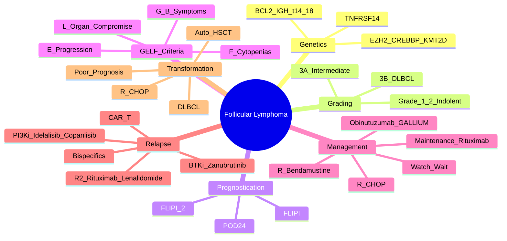

# Follicular Lymphoma (FL)

> [!tip] **FCPS/MRCP Priority: CRITICAL**
> FL = **most common indolent NHL** (20-30%). **t(14;18) BCL2::IGH** hallmark. **FLIPI/FLIPI-2** prognostication. **Watch & Wait** for asymptomatic early stage. **R-Bendamustine / R-CHOP + Rituximab Maintenance** standard. **Transformation to DLBCL = 15-30%**.

---

## 1. Learning Objectives
By the end of this note you should be able to:
- [ ] Apply **FLIPI / FLIPI-2 / POD24** for risk stratification
- [ ] Select management strategy: **Watch & Wait** vs **Rituximab +/- Chemo** based on GELF criteria
- [ ] Apply **POD24** as key prognostic marker for survival
- [ ] Manage **transformation to DLBCL** (biopsy confirmation, R-CHOP + ASCT)
- [ ] Apply **maintenance Rituximab** (2-year) / **Obinutuzumab maintenance** (GALLIUM)
- [ ] Recognise **transformation to DLBCL** and manage appropriately

---

## 2. Definition & Epidemiology

| Feature | Detail |
|---------|--------|
| **Definition** | **Indolent B-cell lymphoma** — **Follicular growth pattern**, **BCL2::IGH t(14;18)** translocation |
| **Incidence** | **~3-4/100,000/year** — **Most common indolent NHL (20-30%)** |
| **Peak Age** | **60-65 years** |
| **Sex Ratio** | **F > M** (slight) |
| **Aetiology** | **BCL2::IGH t(14;18)** (85-90%), **BCL6, EZH2, CREBBP, KMT2D, TNFRSF14 mutations** |

---

## 3. Histology & Grading (WHO)

| Grade | Centroblasts per HPF (×400) | Clinical Behaviour |
|-------|----------------------------|-------------------|
| **Grade 1** | **0-5** | **Indolent**, pure follicular pattern |
| **Grade 2** | **6-15** | **Indolent**, mixed follicular/diffuse |
| **Grade 3A** | **16-50** | **Intermediate**, may behave aggressively |
| **Grade 3B** | **>50** | **Aggressive** — **Treat as DLBCL** (R-CHOP) |

> [!critical] **Grade 3A = Indolent-like (Rituximab + Chemo)**; **Grade 3B = DLBCL (R-CHOP)**

---

## 4. Prognostication — **FLIPI / FLIPI-2 / POD24**

### FLIPI (Follicular Lymphoma International Prognostic Index)
| Factor | Points |
|--------|--------|
| **Age >60y** | 1 |
| **Stage III/IV** | 1 |
| **Hb <12 g/dL** | 1 |
| **LDH >ULN** | 1 |
| **>4 Nodal Sites** | 1 |

| FLIPI Score | Risk Group | 5-yr OS |
|-------------|------------|---------|
| **0-1** | Low | **~90%** |
| **2** | Intermediate | **~75%** |
| **3-5** | High | **~50%** |

### FLIPI-2 (Improved)
| Factor | Points |
|--------|--------|
| **Age >60y** | 1 |
| **Hb <12 g/dL** | 1 |
| **BM Involvement** | 1 |
| **Longest Diameter >6cm** | 1 |
| **Elevated β2-Microglobulin** | 1 |

### POD24 (Progression of Disease within 24 months) — **Strongest Prognostic Marker**
| Definition | **Progression within 24 months of 1L Rituximab-containing chemoimmunotherapy** |
|------------|---------------------------------------------------------------|
| **Incidence** | **~20%** |
| **5-yr OS** | **POD24: ~50%** vs **No POD24: ~90%** |
| **Management** | **POD24 = High-risk** → Consider clinical trial / Early Allo-HSCT in CR2 |

> [!critical] **POD24 = Most Powerful Prognostic Factor** — **Guides early therapeutic decisions**

---

## 5. Management — **Watch & Wait vs Treatment**

### Indications for Treatment (GELF / Groupe d'Etude des Lymphomes Folliculaires)
| Criteria | Description |
|----------|-------------|
| **G** | **B-symptoms** (Fever, Night sweats, Weight loss >10%) |
| **E** | **Evidence of progression** (Bulk >7cm, Rapid growth, B-symptoms) |
| **L** | **Lymphadenopathy** affecting organ function (Ureteric obstruction, Hydronephrosis, SVC syndrome) |
| **F** | **Cytopenias** (Hb <10, Plt <100, Neutrophils <1.0) OR **Splenomegaly** |

> [!critical] **Asymptomatic, Low Tumour Burden = Watch & Wait** (No OS difference vs Immediate Rx)

---

## 6. Treatment Algorithms

### First-Line Treatment
| Scenario | Preferred Regimen |
|----------|-------------------|
| **Asymptomatic, Low Burden** | **Watch & Wait** (Active surveillance q3-6mo) |
| **Symptomatic / GELF Criteria** | **R-Bendamustine (BR) ×6 cycles** (STiL, NHL13) — **Preferred** |
| **Bulky / High Bulk** | **R-CHOP ×6** or **R-CVP ×6** (if unfit for Benda) |
| **Young / Fit / High-Risk FLIPI** | **R-CHOP ×6** (consider if high bulk/rapid progression) |
| **Maintenance** | **Rituximab 375mg/m² q2mo ×2 years** (PRIMA, ECOG1496) — **PFS Benefit, No OS Benefit** |
| **Obinutuzumab Maintenance** | **GALLIUM: Obinutuzumab + Bendamustine → Obinutuzumab Maint** — **Superior PFS vs Rituximab** |

> [!critical] **Maintenance Rituximab 2 years = Standard** after R-Benda / R-CHOP / R-CVP — **PFS benefit, No OS benefit** (PRIMA, ECOG1496)

### Relapsed/Refractory FL
| Line | Regimen | Key Trials |
|------|---------|------------|
| **1st Relapse** | **Rituximab + Lenalidomide (R2)** (AUGMENT) | **AUGMENT** (R2 > R-Chemo) |
| | **Rituximab + Lenalidomide** | **RELEVANCE** (R2 vs R-Chemo) |
| | **PI3K Inhibitor** (Idelalisib, Copanlisib, Duvelisib) | **Idelalisib (Feel**3), **Copanlisib (CHRONOS-1)** |
| | **BTK Inhibitor** (Zanubrutinib, Ibrutinib) | **Zanubrutinib (ROSEWOOD)** |
| **2nd+ Relapse** | **CAR-T (CD19: Tisagenlecleucel, Axicabtagene)** | **ZUMA-5, ELARA** |
| | **Bispecifics (Epcoritamab, Mosunetuzumab)** | **EPCOR, GO29781** |
| | **EZH2 Inhibitor** (Tazemetostat) | **EZH2mut** (Tazemetostat) |

> [!critical] **POD24 = Consider Clinical Trial / Early Allo-HSCT in CR2**

---

## 7. Transformation to DLBCL — **Critical Complication**

| Feature | Detail |
|---------|--------|
| **Incidence** | **15-30%** over 10-15 years |
| **Clinical** | **Rapidly growing nodes, B-symptoms, LDH↑↑, Extranodal** |
| **Diagnosis** | **Excisional Biopsy** — **DLBCL morphology, Clonally related (IGH rearrangement)** |
| **Treatment** | **R-CHOP ×6** → **Auto-HSCT if Chemosensitive** |
| **Prognosis** | **Poor** (Median OS ~1-2 years) |

> [!critical] **Transformation to DLBCL = Poor Prognosis** — **R-CHOP ×6 → Auto-HSCT if Chemosensitive**

---

## 8. FCPS/MRCP High-Yield Summary

| Topic | Key Points |
|-------|------------|
| **Diagnosis** | **BCL2::IGH t(14;18)** (85-90%), **Grade 1-3A (Indolent), 3B (Aggressive = DLBCL)** |
| **FLIPI / FLIPI-2** | **Age >60, Stage III/IV, Hb<12, Nodal>6cm, β2M↑** → Risk stratification |
| **POD24** | **Progression <24mo post-1L R-chemo** → **20% incidence, 5-yr OS ~50%** |
| **GELF Criteria** | **G** (B-symptoms), **E** (Progression/Bulk), **L** (Organ compromise), **F** (Cytopenias/Splenomegaly) |
| **Watch & Wait** | **Asymptomatic, Low Bulk** — **No OS difference vs Early Rx** |
| **1L Treatment** | **R-Bendamustine ×6 (STiL)** — **Preferred**; **R-CHOP** if bulky/high-risk |
| **Maintenance** | **Rituximab q2mo x2yr** (PRIMA): **PFS benefit, No OS benefit** |
| **Obinutuzumab** | **GALLIUM: Obinutuzumab + Bendamustine → Obinutuzumab Maint > Rituximab** |
| **POD24** | **Progression <24mo post-1L** → **20% incidence, 5-yr OS ~50%** |
| **Transformation** | **15-30% → DLBCL** → **R-CHOP + Auto-HSCT if Chemosensitive** |
| **Relapsed** | **R2 (Rituximab + Lenalidomide)**, **PI3Ki (Idelalisib, Copanlisib)**, **BTKi (Zanubrutinib)**, **CAR-T, Bispecifics** |

---

## 9. Viva Questions (MRCP PACES / FCPS)

| Question | Expected Answer |
|----------|----------------|
| "What is the hallmark genetic abnormality in Follicular Lymphoma?" | **t(14;18) BCL2::IGH translocation** (85-90%) — anti-apoptotic BCL2 overexpression |
| "What is FLIPI and how is it calculated?" | **5 factors**: Age>60, Stage III/IV, Hb<12, LDH>ULN, >4 Nodal sites — **0-1 Low, 2 Intermediate, 3-5 High** |
| "What is FLIPI-2 and how does it differ?" | **Age>60, Hb<12, BM involvement, Diameter>6cm, β2M↑** — More accurate than FLIPI |
| "What are the GELF criteria for treatment initiation in FL?" | **G** = B-symptoms; **E** = Evidence of progression; **L** = Lymphadenopathy causing organ compromise; **F** = Cytopenias/Splenomegaly |
| "What is POD24 and why is it important?" | **Progression within 24 months of 1L R-chemo** — **20% incidence, 5-yr OS ~50%** (vs 90% if no POD24) — strongest prognostic factor |
| "How do you manage asymptomatic FL with low tumour burden?" | **Watch & Wait** — Active surveillance q3-6mo; **No OS difference vs Early Rx** |
| "What is the standard first-line treatment for symptomatic FL?" | **Rituximab + Bendamustine ×6 cycles** (STiL trial) — Preferred over R-CHOP |
| "What is the role of maintenance rituximab?" | **Rituximab 375mg/m2 q2mo ×2 years** → **PFS benefit (PRIMA, ECOG1496), No OS benefit** |
| "What is the management of transformed FL to DLBCL?" | **R-CHOP ×6** → **Auto-HSCT if chemosensitive** — Poor prognosis (Median OS ~1-2yr) |
| "What are the PI3K inhibitors used in relapsed FL?" | **Idelalisib, Copanlisib, Duvelisib** — Toxicity: Colitis, Hepatitis, Pneumonitis, Infections |

---

## 10. Confusions & Mnemonics

| Confusion | Clarification |
|-----------|---------------|
| **FL vs DLBCL** | **FL = Indolent, follicular pattern, BCL2::IGH+, Watch & Wait option**; **DLBCL = Aggressive, diffuse, R-CHOP standard** |
| **Grade 3A vs 3B** | **Grade 3A**: 16-50 centroblasts/HPF, **Indolent-like** (Rituximab + Chemo); **Grade 3B**: >50 centroblasts, **Aggressive, Treat as DLBCL (R-CHOP)** |
| **Watch & Wait vs Early Rx** | **Watch & Wait = No OS difference**, for asymptomatic low-burden; **Arterial Rx** only if GELF criteria met |
| **FLIPI vs FLIPI-2** | **FLIPI**: Age, Stage, Hb, LDH, Nodal sites; **FLIPI-2**: Age, Hb, BM involvement, Diameter>6cm, β2M — **More accurate** |
| **POD24 vs Early Relapse** | **POD24** = Relapse <24mo post-1L R-chemo; **Early Relapse** = <12mo — Both adverse but POD24 more validated |
| **Rituximab Maintenance** | **2 years q2mo** — **PFS benefit only, No OS benefit** (PRIMA, ECOG1496); **Obi Maint (GALLIUM) > Ritux Maint** |

**Mnemonic: FLIPI = "AGE STAGE HB LDH NODES"**
- **A**ge >60
- **S**tage III/IV
- **H**b <12
- **L**DH >ULN
- **N**odes >4

**Mnemonic: FLIPI-2 = "AGE HB BM SIZE B2M"**
- **A**ge >60
- **H**b <12
- **B**M involvement
- **S**ize >6cm
- **B**2M elevated

**Mnemonic: GELF = "G-E-L-F"**
- **G** = **B-symptoms**
- **E** = Progression/Bulk
- **L** = Lymphadenopathy (organ compromise)
- **F** = Cytopenias/Splenomegaly

**Mnemonic: POD24 = "PROGRESSION IN 24 MONTHS = BAD"**
- **P**rogression
- **O**f
- **D**isease in
- **2**4 months = **Poor prognosis**

**Mnemonic: FL Grade = "1-2 INDOLENT, 3A INTERMEDIATE, 3B = DLBCL"**
- **1-2** = Indolent
- **3A** = Intermediate (Rituximab + Chemo)
- **3B** = **DLBCL** (R-CHOP)

---

## 11. Mind Map

---

## 12. One-Page Revision Card

| Domain | Key Points |
|--------|------------|
| **Genetics** | **t(14;18) BCL2::IGH** (85-90%) — Anti-apoptotic |
| **Grading** | **1-2**: Indolent; **3A**: Intermediate; **3B** = **DLBCL** (R-CHOP) |
| **FLIPI** | **Age>60, Stage III/IV, Hb<12, LDH↑, Nodes>4** — 0-1 Low, 2 Int, 3-5 High |
| **FLIPI-2** | **Age>60, Hb<12, BM+, Size>6cm, β2M↑** |
| **POD24** | **Progression <24mo post-1L** — **20% incidence, 5-yr OS ~50%** |
| **GELF Criteria** | **G**: B-symptoms; **E**: Progression; **L**: Organ compromise; **F**: Cytopenias/Splenomegaly |
| **Watch & Wait** | **Asymptomatic, Low Burden** — No OS difference vs Early Rx |
| **1L Treatment** | **R-Bendamustine ×6 (STiL)** — Preferred; **R-CHOP** if bulky/high-risk |
| **Maintenance** | **Rituximab q2mo ×2yr** (PFS benefit, No OS benefit); **Obi-GALLIUM > Ritux** |
| **POD24** | **Progression <24mo** → **20% incidence, OS ~50%** |
| **Transformation** | **15-30% → DLBCL** → **R-CHOP + Auto-HSCT** |
| **Relapsed** | **R2 (R-Len), PI3Ki, BTKi, CAR-T, Bispecifics** |

---

## 13. Spaced Repetition Trackers

| Review Interval | Date Completed | Confidence (1-5) | Notes |
|-----------------|----------------|------------------|-------|
| 24 hours | | | |
| 7 days | | | |
| 15 days | | | |
| 30 days | | | |
| 90 days | | | |

---

## 14. Self-Test Scorecard

| Section | Score /5 | Last Attempt |
|---------|----------|--------------|
| FLIPI/FLIPI-2 Application | | |
| POD24 Recognition | | |
| GELF Criteria Application | | |
| Watch & Wait vs Treatment | | |
| Maintenance Strategy | | |
| Transformation Management | | |
| Relapsed FL Management | | |
| Viva Questions | | |

---

## 15. Local Navigation
- **Parent Heading**: [[../Haematological Malignancies|Haematological Malignancies]]
- **Parent Topic Group**: [[Lymphomas]]
- **Chapter Map**: [[../Davidson Chapter 7 - Oncology Hierarchy|Oncology Hierarchy]]
- **Chapter MOC**: [[../Oncology MOC|Oncology MOC]]
- **Drug Reference**: [[../../Clinical Therapeutics and Good Prescribing|Drugs]]
- **Related**: [[Diffuse Large B-Cell Lymphoma (DLBCL)]] · [[Hodgkin Lymphoma]] · [[PET-CT in Lymphoma]] · [[Oncologic Emergencies Overview]]

---

# FCPS/MRCP Exam Extras

## 16. MCQs (10)

**1.** Regarding Follicular Lymphoma (FL) (Diagnosis), which statement is correct?
   A. **BCL2::IGH t(14
   B. **BCL2::IGH - alternative approach
   C. Empirical management only
   D. Watch and wait
   - **Answer: A** — **BCL2::IGH t(14;18)** (85-90%), **Grade 1-3A (Indolent), 3B (Aggressive = DLBCL)**

**2.** Regarding Follicular Lymphoma (FL) (FLIPI / FLIPI-2), which statement is correct?
   A. **Age >60, Stage III/IV, Hb<12, Nodal>6cm, β2M↑** → Risk stratification
   B. **Age - alternative approach
   C. Empirical management only
   D. Watch and wait
   - **Answer: A** — **Age >60, Stage III/IV, Hb<12, Nodal>6cm, β2M↑** → Risk stratification

**3.** Regarding Follicular Lymphoma (FL) (POD24), which statement is correct?
   A. **Progression <24mo post-1L R-chemo** → **20% incidence, 5-yr OS ~50%**
   B. **Progression - alternative approach
   C. Empirical management only
   D. Watch and wait
   - **Answer: A** — **Progression <24mo post-1L R-chemo** → **20% incidence, 5-yr OS ~50%**

**4.** Regarding Follicular Lymphoma (FL) (GELF Criteria), which statement is correct?
   A. **G** (B-symptoms), **E** (Progression/Bulk), **L** (Organ compromise), **F** (Cytopenias/Splenomega
   B. **G** - alternative approach
   C. Empirical management only
   D. Watch and wait
   - **Answer: A** — **G** (B-symptoms), **E** (Progression/Bulk), **L** (Organ compromise), **F** (Cytopenias/Splenomegaly)

**5.** Regarding Follicular Lymphoma (FL) (Watch & Wait), which statement is correct?
   A. **Asymptomatic, Low Bulk**
   B. **Asymptomatic, - alternative approach
   C. Empirical management only
   D. Watch and wait
   - **Answer: A** — **Asymptomatic, Low Bulk** — **No OS difference vs Early Rx**

**6.** Regarding Follicular Lymphoma (FL) (1L Treatment), which statement is correct?
   A. **R-Bendamustine ×6 (STiL)**
   B. **R-Bendamustine - alternative approach
   C. Empirical management only
   D. Watch and wait
   - **Answer: A** — **R-Bendamustine ×6 (STiL)** — **Preferred**; **R-CHOP** if bulky/high-risk

**7.** Regarding Follicular Lymphoma (FL) (Maintenance), which statement is correct?
   A. **Rituximab q2mo x2yr** (PRIMA): **PFS benefit, No OS benefit**
   B. **Rituximab - alternative approach
   C. Empirical management only
   D. Watch and wait
   - **Answer: A** — **Rituximab q2mo x2yr** (PRIMA): **PFS benefit, No OS benefit**

**8.** Regarding Follicular Lymphoma (FL) (Obinutuzumab), which statement is correct?
   A. **GALLIUM: Obinutuzumab + Bendamustine → Obinutuzumab Maint > Rituximab**
   B. **GALLIUM: - alternative approach
   C. Empirical management only
   D. Watch and wait
   - **Answer: A** — **GALLIUM: Obinutuzumab + Bendamustine → Obinutuzumab Maint > Rituximab**

**9.** Regarding Follicular Lymphoma (FL) (POD24), which statement is correct?
   A. **Progression <24mo post-1L** → **20% incidence, 5-yr OS ~50%**
   B. **Progression - alternative approach
   C. Empirical management only
   D. Watch and wait
   - **Answer: A** — **Progression <24mo post-1L** → **20% incidence, 5-yr OS ~50%**

**10.** Regarding Follicular Lymphoma (FL) (Transformation), which statement is correct?
   A. **15-30% → DLBCL** → **R-CHOP + Auto-HSCT if Chemosensitive**
   B. **15-30% - alternative approach
   C. Empirical management only
   D. Watch and wait
   - **Answer: A** — **15-30% → DLBCL** → **R-CHOP + Auto-HSCT if Chemosensitive**

## 17. SBA Questions (10)

**1.** A 55-year-old presents with classic features. MDT discussion recommends:
   - A. **BCL2::IGH t(14
   - B. **BCL2::IGH (less specific)
   - C. Empirical broad approach
   - D. No intervention required
   - **Answer: A** — first-line: **BCL2::IGH t(14;18)** (85-90%), **Grade 1-3A (Indolent), 3B (Aggressive = DLBCL)**

**2.** On staging workup, the patient is found to be [Stage X]. Best management is:
   - A. **Age >60, Stage III/IV, Hb<12, Nodal>6cm, β2M↑** → Risk stratification
   - B. **Age (less specific)
   - C. Empirical broad approach
   - D. No intervention required
   - **Answer: A** — stage-specific: **Age >60, Stage III/IV, Hb<12, Nodal>6cm, β2M↑** → Risk stratification

**3.** Following first-line treatment, the patient develops [complication]. Best next step:
   - A. **Progression <24mo post-1L R-chemo** → **20% incidence, 5-yr OS ~50%**
   - B. **Progression (less specific)
   - C. Empirical broad approach
   - D. No intervention required
   - **Answer: A** — complication: **Progression <24mo post-1L R-chemo** → **20% incidence, 5-yr OS ~50%**

**4.** The patient asks about prognosis. Most appropriate response based on:
   - A. **G** (B-symptoms), **E** (Progression/Bulk), **L** (Organ compromise), **F** (Cytopenias/Splenomega
   - B. **G** (less specific)
   - C. Empirical broad approach
   - D. No intervention required
   - **Answer: A** — prognosis: **G** (B-symptoms), **E** (Progression/Bulk), **L** (Organ compromise), **F** (Cytopenias/Splenomegaly)

**5.** A 65-year-old with relevant risk factors should be screened with:
   - A. **Asymptomatic, Low Bulk**
   - B. **Asymptomatic, (less specific)
   - C. Empirical broad approach
   - D. No intervention required
   - **Answer: A** — screening: **Asymptomatic, Low Bulk** — **No OS difference vs Early Rx**

**6.** The most clinically important biomarker/molecular test is:
   - A. **R-Bendamustine ×6 (STiL)**
   - B. **R-Bendamustine (less specific)
   - C. Empirical broad approach
   - D. No intervention required
   - **Answer: A** — biomarker: **R-Bendamustine ×6 (STiL)** — **Preferred**; **R-CHOP** if bulky/high-risk

**7.** The standard chemotherapy/regimen of choice is:
   - A. **Rituximab q2mo x2yr** (PRIMA): **PFS benefit, No OS benefit**
   - B. **Rituximab (less specific)
   - C. Empirical broad approach
   - D. No intervention required
   - **Answer: A** — chemo: **Rituximab q2mo x2yr** (PRIMA): **PFS benefit, No OS benefit**

**8.** The role of surgery in this case is:
   - A. **GALLIUM: Obinutuzumab + Bendamustine → Obinutuzumab Maint > Rituximab**
   - B. **GALLIUM: (less specific)
   - C. Empirical broad approach
   - D. No intervention required
   - **Answer: A** — surgery: **GALLIUM: Obinutuzumab + Bendamustine → Obinutuzumab Maint > Rituximab**

**9.** The recommended surveillance/follow-up protocol is:
   - A. **Progression <24mo post-1L** → **20% incidence, 5-yr OS ~50%**
   - B. **Progression (less specific)
   - C. Empirical broad approach
   - D. No intervention required
   - **Answer: A** — follow-up: **Progression <24mo post-1L** → **20% incidence, 5-yr OS ~50%**

**10.** Palliative care referral is most appropriate when:
   - A. **15-30% → DLBCL** → **R-CHOP + Auto-HSCT if Chemosensitive**
   - B. **15-30% (less specific)
   - C. Empirical broad approach
   - D. No intervention required
   - **Answer: A** — palliative: **15-30% → DLBCL** → **R-CHOP + Auto-HSCT if Chemosensitive**

## 18. Flashcards

**Q1:** Diagnosis?
**A1:** BCL2::IGH t(14;18) (85-90%), Grade 1-3A (Indolent), 3B (Aggressive = DLBCL)

**Q2:** FLIPI / FLIPI-2?
**A2:** Age >60, Stage III/IV, Hb<12, Nodal>6cm, β2M↑ → Risk stratification

**Q3:** POD24?
**A3:** Progression <24mo post-1L R-chemo → 20% incidence, 5-yr OS ~50%

**Q4:** GELF Criteria?
**A4:** G (B-symptoms), E (Progression/Bulk), L (Organ compromise), F (Cytopenias/Splenomegaly)

**Q5:** Watch & Wait?
**A5:** Asymptomatic, Low Bulk — No OS difference vs Early Rx

**Q6:** 1L Treatment?
**A6:** R-Bendamustine ×6 (STiL) — Preferred; R-CHOP if bulky/high-risk

**Q7:** Maintenance?
**A7:** Rituximab q2mo x2yr (PRIMA): PFS benefit, No OS benefit

**Q8:** Obinutuzumab?
**A8:** GALLIUM: Obinutuzumab + Bendamustine → Obinutuzumab Maint > Rituximab

## 19. Answer Key with Explanations

| # | MCQ | Topic | Explanation |
|---|-----|-------|-------------|
| 1 | A | Diagnosis | BCL2::IGH t(14;18) (85-90%), Grade 1-3A (Indolent), 3B (Aggressive = DLBCL) |
| 2 | A | FLIPI / FLIPI-2 | Age >60, Stage III/IV, Hb<12, Nodal>6cm, β2M↑ → Risk stratification |
| 3 | A | POD24 | Progression <24mo post-1L R-chemo → 20% incidence, 5-yr OS ~50% |
| 4 | A | GELF Criteria | G (B-symptoms), E (Progression/Bulk), L (Organ compromise), F (Cytopenias/Splenomegaly) |
| 5 | A | Watch & Wait | Asymptomatic, Low Bulk — No OS difference vs Early Rx |
| 6 | A | 1L Treatment | R-Bendamustine ×6 (STiL) — Preferred; R-CHOP if bulky/high-risk |
| 7 | A | Maintenance | Rituximab q2mo x2yr (PRIMA): PFS benefit, No OS benefit |
| 8 | A | Obinutuzumab | GALLIUM: Obinutuzumab + Bendamustine → Obinutuzumab Maint > Rituximab |
| 9 | A | POD24 | Progression <24mo post-1L → 20% incidence, 5-yr OS ~50% |
| 10 | A | Transformation | 15-30% → DLBCL → R-CHOP + Auto-HSCT if Chemosensitive |

| # | SBA | Topic | Explanation |
|---|-----|-------|-------------|
| 1 | A | Diagnosis | BCL2::IGH t(14;18) (85-90%), Grade 1-3A (Indolent), 3B (Aggressive = DLBCL) |
| 2 | A | FLIPI / FLIPI-2 | Age >60, Stage III/IV, Hb<12, Nodal>6cm, β2M↑ → Risk stratification |
| 3 | A | POD24 | Progression <24mo post-1L R-chemo → 20% incidence, 5-yr OS ~50% |
| 4 | A | GELF Criteria | G (B-symptoms), E (Progression/Bulk), L (Organ compromise), F (Cytopenias/Splenomegaly) |
| 5 | A | Watch & Wait | Asymptomatic, Low Bulk — No OS difference vs Early Rx |
| 6 | A | 1L Treatment | R-Bendamustine ×6 (STiL) — Preferred; R-CHOP if bulky/high-risk |
| 7 | A | Maintenance | Rituximab q2mo x2yr (PRIMA): PFS benefit, No OS benefit |
| 8 | A | Obinutuzumab | GALLIUM: Obinutuzumab + Bendamustine → Obinutuzumab Maint > Rituximab |
| 9 | A | POD24 | Progression <24mo post-1L → 20% incidence, 5-yr OS ~50% |
| 10 | A | Transformation | 15-30% → DLBCL → R-CHOP + Auto-HSCT if Chemosensitive |

## 20. Local Navigation

- **Parent Heading Hub**: [[../../Haematological Malignancies|Haematological Malignancies]]
- **Chapter Map**: [[../../Davidson Chapter 7 - Oncology Hierarchy|Oncology Hierarchy]]
- **Chapter MOC**: [[../../Oncology MOC|Oncology MOC]]
- **Drug Reference**: [[../../../Clinical Therapeutics and Good Prescribing|Drugs]]

