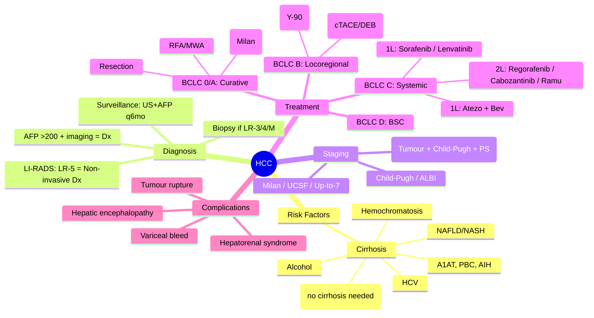

# Hepatocellular Carcinoma (HCC)

> [!tip] **FCPS/MRCP Priority: HIGH**
> **HCC = primary liver cancer in cirrhosis** (80-90%). **BCLC staging** guides treatment. **Surveillance** (US ± AFP q6mo) in cirrhosis = early detection. **Curative**: Resection, Ablation (RFA/MWA), Transplant (Milan criteria). **Locoregional**: TACE (standard), TARE, RFA. **Systemic**: 1L Atezolizumab + Bevacizumab (IMbrave150), Sorafenib/Lenvatinib; 2L Regorafenib/Cabozantinib/Ramucirumab. **AFP** = diagnostic/prognostic marker.

---

## 1. Learning Objectives
By the end of this note you should be able to:
- [ ] Identify risk factors: Cirrhosis (HBV, HCV, Alcohol, NAFLD/NASH, Hemochromatosis)
- [ ] Apply BCLC staging and treatment algorithm
- [ ] Define Milan / UCSF / Up-to-7 criteria for liver transplant
- [ ] Compare locoregional therapies: TACE vs TARE vs RFA/MWA
- [ ] Sequence systemic therapy: 1L Atezo/Bev, Sorafenib, Lenvatinib; 2L Rego, Cabozanti, Ramu
- [ ] Diagnose HCC non-invasively (LI-RADS) vs biopsy
- [ ] Manage complications: variceal bleed, hepatic encephalopathy, hepatorenal syndrome

---

## 2. Definition & Epidemiology

| Feature | Detail |
|---------|--------|
| **Definition** | Primary malignant tumour of hepatocytes; **>90% arise in cirrhosis** |
| **Incidence** | 6th most common cancer globally; 3rd leading cause of cancer death; UK: ~6,200/year; M:F = 2-3:1 |
| **Prevalence** | High in East Asia, Sub-Saharan Africa (HBV endemic); Rising in West (NASH/Alcohol) |
| **Peak Age** | 60-70 years; HBV: younger (30-50) |
| **Sex Ratio** | Male 2-3:1 (androgen effect, behavioural) |
| **Risk Factors** | **Cirrhosis** (any aetiology): **HBV** (integrates DNA, ↓ need cirrhosis), **HCV**, **Alcohol**, **NAFLD/NASH** (fastest rising), **Hemochromatosis**, **A1AT deficiency**, **PBC**, **Autoimmune hepatitis**, Aflatoxin (synergy with HBV), Diabetes, Obesity, Smoking |

---

## 3. Aetiology & Pathophysiology

```mermaid
flowchart LR
    A[Risk Factors] --> B[Chronic Liver Injury]
    B --> C[Inflammation → Fibrosis → Cirrhosis]
    C --> D[Hepatocyte Regeneration + Genomic Instability]
    D --> E[Driver Mutations]
    E --> F1[TP53 (30%)]
    E --> F2[CTNNB1 (β-catenin, 25%)]
    E --> F3[TERT Promoter (60%)]
    E --> F4[AXIN1, ARID1A, RPS6KA3]
    F1 --> G[HCC Development]
    F2 --> G
    F3 --> G
    F4 --> G
    G --> H[Angiogenesis (VEGF/FGF)] --> I[Invasion/Metastasis]
```

### Molecular Pathways

| Pathway | Frequency | Significance |
|---------|-----------|--------------|
| **TERT Promoter** | 60% | Telomerase reactivation — earliest event |
| **TP53** | 30% (↑ HBV, aflatoxin) | Genomic instability; R249S hotspot (aflatoxin) |
| **CTNNB1 (β-catenin)** | 25% | Wnt activation; immune-cold tumours; ↓ ICI response |
| **AXIN1** | 10% | Wnt pathway |
| **Chromosome 8q gain (MYC)** | 30% | Proliferation |
| **VEGF/FGFR** | High expression | Angiogenesis — target for TKIs |

---

## 4. Clinical Features

| Feature | Description |
|---------|-------------|
| **Surveillance-Detected** | Asymptomatic; US lesion <2cm; AFP elevated |
| **Symptomatic** | RUQ pain, weight loss, early satiety, palpable mass |
| **Decompensation** | Ascites, variceal bleed, encephalopathy, jaundice (tumour-induced) |
| **Paraneoplastic** | **Hypoglycaemia** (IGF-II), **Erythrocytosis** (EPO), **Hypercholesterolaemia**, **Hypercalcaemia** (PTHrP), **Porphyria cutanea tarda**, **Carcinoid syndrome** (rare) |
| **Rupture** | Acute abdomen, haemoperitoneum, shock — **emergency** (TACE/embolisation) |
| **Extrahepatic Spread** | Lung (most common), lymph nodes, bone, adrenal, brain |

---

## 5. Staging & Classification

| System | Detail |
|--------|--------|
| **BCLC (Barcelona Clinic Liver Cancer)** | **Gold standard** — integrates tumour burden, liver function (Child-Pugh), performance status (ECOG) → links to treatment |
| **Child-Pugh** | Liver synthetic function: A (5-6), B (7-9), C (10-15) |
| **ALBI Grade** | Albumin-Bilirubin grade (objective) |
| **TNM 8th / AJCC** | Anatomical staging (less used for treatment decisions) |

### BCLC Staging & Treatment Algorithm

| Stage | Tumour Burden | Liver Function | PS | Treatment | Median OS |
|-------|---------------|----------------|-----|-----------|-----------|
| **0 (Very Early)** | Single <2cm, no vascular invasion | Child-Pugh A | 0 | **Ablation (RFA/MWA)** or **Resection** | >5 years |
| **A (Early)** | Single or ≤3 nodules ≤3cm | Child-Pugh A-B | 0 | **Curative: Resection / Ablation / Transplant** (Milan) | >5 years |
| **B (Intermediate)** | Multinodular, no vascular invasion, no mets | Child-Pugh A-B | 0 | **TACE** (standard), TARE, RFA combination | ~2.5 years |
| **C (Advanced)** | Vascular invasion **OR** Extrahepatic mets | Child-Pugh A-B | 1-2 | **Systemic Therapy** (1L: Atezo/Bev) | ~1-1.5 years |
| **D (Terminal)** | Any tumour burden | Child-Pugh C | >2 | **Best Supportive Care** | <3 months |

### Liver Transplant Criteria

| Criteria | Definition | 5-yr Recurrence |
|----------|------------|-----------------|
| **Milan** | Single ≤5cm **OR** ≤3 nodules all ≤3cm, **no vascular invasion** | <10% |
| **UCSF** | Single ≤6.5cm **OR** ≤3 nodules ≤4.5cm, total ≤8cm | ~15% |
| **Up-to-7** | (Largest size in cm) + (Number of nodules) ≤7, no vascular invasion | ~15% |
| **Metroticket 2.0** | Continuous model based on AFP, size, number | Variable |

### LI-RADS (Liver Imaging Reporting and Data System)

| Category | Probability of HCC | Management |
|----------|-------------------|------------|
| **LR-1** | Definitely benign | Routine surveillance |
| **LR-2** | Probably benign | Short-interval follow-up |
| **LR-3** | Intermediate | Multiphasic MRI/CT or biopsy |
| **LR-4** | Probably HCC | Diagnostic (non-invasive if cirrhosis) |
| **LR-5** | Definitely HCC | **Diagnostic — no biopsy needed** |
| **LR-M** | Probably malignant, not HCC-specific (cholangiocarcinoma, mets) | Biopsy |
| **LR-TIV** | Tumour in vein | Advanced stage |

---

## 6. Diagnosis & Investigations

| Investigation | Role | Key Findings |
|---------------|------|--------------|
| **Surveillance US ± AFP q6mo** | **Early detection** in cirrhosis (Child A/B) | Sensitivity US 84%, US+AFP 92% |
| **Multiphasic CT / MRI (Liver Protocol)** | **Diagnosis (LI-RADS)** — Arterial hyperenhancement + Washout + Capsule | **LR-5 = Diagnostic** (no biopsy needed if cirrhosis) |
| **AFP** | Tumour marker; ↑ in 60-70% | >200 ng/mL = diagnostic with imaging; Prognostic; Monitor response |
| **Biopsy** | If non-invasive criteria not met (LR-3, LR-4, LR-M, non-cirrhotic) | Hepatocyte markers: **HepPar-1, Arginase-1, Glypican-3**; CD34+ sinusoidal |
| **Child-Pugh / ALBI** | Liver function for treatment allocation | Determines BCLC stage eligibility |
| **Viral Serology** | HBsAg, anti-HCV, HBV DNA, HCV RNA | Guide antiviral therapy |
| **Chest CT** | Staging for extrahepatic mets | Lung mets most common |

---

## 7. Differential Diagnosis

| Condition | Distinguishing Features |
|-----------|-------------------------|
| **Regenerative Nodule** | No arterial hyperenhancement; isointense on all phases; T2 hypointense |
| **Dysplastic Nodule** | Low-grade: no washout; High-grade: may show arterial hyperenhancement but no washout/capsule |
| **Haemangioma** | Peripheral nodular enhancement → centripetal fill-in; T2 very bright |
| **FNH** | Central scar, homogeneous arterial enhancement, isointense portal/delayed |
| **Hepatic Adenoma** | Young women, OCP use; T1/T2 hyperintense (fat/haemorrhage); HNF1A/β-catenin mut |
| **Cholangiocarcinoma (LR-M)** | Peripheral washout, delayed enhancement, capsule retraction; CA19-9↑ |
| **Metastases** | Multiple, rim enhancement, known primary; LR-M |

---

## 8. Management

```mermaid
flowchart TD
    A[Diagnosis + BCLC Stage] --> B{BCLC Stage}
    B -->|0 / A (Early)| C[Curative Intent]
    C --> C1[**Resection**<br/>Child-Pugh A, preserved portal flow,<br/>future liver remnant >40% (30% if healthy)]
    C --> C2[**Ablation: RFA/MWA**<br/>≤3cm, ≤3 nodules,<br/>peripheral, no major vessels]
    C --> C3[**Liver Transplant**<br/>Milan criteria, Child-Pugh B/C,<br/>not resectable]
    B -->|B (Intermediate)| D[**Locoregional**]
    D --> D1[**TACE (cTACE/DEB-TACE)**<br/>Child-Pugh A/B7, bilobar, preserved portal vein]
    D --> D2[**TARE (Y-90)**<br/>PVT (segmental), TACE-refractory,<br/>bridging to transplant]
    D --> D3[**RFA + TACE**<br/>>3cm or difficult location]
    B -->|C (Advanced)| E[**Systemic Therapy**]
    E --> E1[**1L: Atezolizumab + Bevacizumab**<br/>(IMbrave150) — **Standard**<br/>Child-Pugh A, no high-risk varices]
    E --> E2[**1L: Sorafenib** (SHARP) / **Lenvatinib** (REFLECT)<br/>If ICI contraindicated]
    E --> E3[**2L: Regorafenib** (RESORCE) — post-Sorafenib<br/>**Cabozantinib** (CELESTIAL)<br/>**Ramucirumab** (REACH-2) if AFP≥400]
    E --> E4[**3L+: Clinical Trial / Best Supportive**]
    B -->|D (Terminal)| F[**Best Supportive Care**<br/>Paracentesis, lactulose,<br/>analgesia, hospice]
    C1 --> G[Surveillance: US/AFP q3-6mo<br/>CT/MRI q6-12mo]
    C2 --> G
    C3 --> G
    D1 --> G
    D2 --> G
```

### Locoregional Therapy Details

| Therapy | Indication | Technique | Complications |
|---------|------------|-----------|---------------|
| **RFA / MWA** | BCLC 0/A, ≤3cm, ≤3 nodules | Percutaneous/Laparoscopic/Open | Bile duct injury, haemorrhage, liver abscess, seeding |
| **TACE (cTACE)** | BCLC B, preserved PV flow | Lipiodol + Chemo (Doxorubicin/Cisplatin) + Embolic (Gelfoam) | **Post-embolisation syndrome** (fever, pain, nausea, LFT rise); Liver failure if Child B/C |
| **DEB-TACE** | BCLC B | Drug-eluting beads (Doxorubicin) | Less systemic chemo exposure; Similar efficacy |
| **TARE (Y-90)** | PVT (segmental), TACE-refractory, Bridging | Yttrium-90 microspheres (glass/resin) | Radiation-induced liver disease (RILD); GI ulceration (shunting) |

### Systemic Therapy Sequencing

| Line | Regimen | Trial | Key Eligibility |
|------|---------|-------|-----------------|
| **1L** | **Atezolizumab + Bevacizumab** | **IMbrave150** (OS HR 0.58) | Child-Pugh A, ECOG 0-1, No untreated high-risk varices, No recent bleed |
| **1L (ICI contraindicated)** | Sorafenib / Lenvatinib | SHARP / REFLECT | Child-Pugh A |
| **2L (post-Sorafenib)** | Regorafenib | RESORCE | Child-Pugh A, **Tolerated Sorafenib ≥400mg/day ×20 days** |
| **2L (post-Sorafenib/Lenvatinib)** | Cabozantinib | CELESTIAL | Child-Pugh A |
| **2L (AFP ≥400)** | Ramucirumab | REACH-2 | Child-Pugh A, AFP ≥400 ng/mL |
| **ICI-naive post-TKI** | Nivolumab ± Ipilimumab / Pembrolizumab | CheckMate 040 / KEYNOTE-224 | Child-Pugh A/B |

---

## 9. FCPS/MRCP High-Yield Summary

| Topic | Key Points |
|-------|------------|
| **Risk Factors** | Cirrhosis (HBV, HCV, Alcohol, **NAFLD/NASH** rising); HBV → HCC without cirrhosis |
| **Surveillance** | **US ± AFP q6mo** in cirrhosis (Child A/B); Cost-effective |
| **Diagnosis** | **LI-RADS LR-5 = Non-invasive diagnosis** (arterial hyperenhancement + washout + capsule); Biopsy if LR-3/4/M |
| **BCLC** | **Treatment algorithm based on stage + liver function + PS** — only staging that links to treatment |
| **Milan Criteria** | Single ≤5cm **OR** ≤3 nodules ≤3cm, no vascular invasion → Transplant (5-yr recurrence <10%) |
| **Curative** | Resection (Child A, good remnant), RFA/MWA (≤3cm), Transplant (Milan, Child B/C) |
| **TACE** | Standard for **BCLC B** (multinodular); cTACE vs DEB-TACE; Contraindicated: Main PVT, Child C |
| **TARE (Y-90)** | Segmental **PVT**, TACE-refractory, Bridging to transplant |
| **1L Systemic** | **Atezolizumab + Bevacizumab** (IMbrave150) — **New Standard**; Requires variceal screening/banding |
| **2L Systemic** | Regorafenib (post-Sorafenib tolerant), Cabozantinib, Ramucirumab (AFP≥400) |
| **Child-Pugh** | A: All options; B: Selected (TACE, Sorafenib); C: BSC only |
| **Complications** | Variceal bleed (prophylactic banding), HE, HRS, Tumour rupture (emergency TACE) |

---

## 10. Viva Questions (MRCP PACES / FCPS)

| Question | Expected Answer |
|----------|-----------------|
| **55M with cirrhosis (Child-Pugh A), 2.5cm lesion on US, AFP 350. Next step?** | **Multiphasic CT/MRI** for LI-RADS categorisation. If **LR-5** → **Diagnose HCC**; BCLC Stage A → Curative options: Resection vs RFA vs Transplant (if Milan). |
| **What is BCLC staging? Why is it unique?** | Integrates **tumour burden + Child-Pugh liver function + ECOG PS** → **Directly links to treatment**. Unlike TNM which is anatomical only. |
| **Milan criteria for liver transplant?** | **Single ≤5cm OR ≤3 nodules all ≤3cm**, no vascular invasion, no extrahepatic spread. 5-yr recurrence <10%. |
| **Patient with BCLC B (multinodular, no PVT, Child-Pugh A). Treatment?** | **TACE** (cTACE or DEB-TACE) — standard of care. TARE alternative. |
| **Patient with HCC + main portal vein thrombosis (PVT). Treatment?** | **BCLC C** (vascular invasion) → **Systemic therapy** (1L Atezo/Bev). TARE (Y-90) if segmental PVT only. TACE contraindicated in main PVT. |
| **IMbrave150 regimen — drugs, key eligibility?** | **Atezolizumab 1200mg + Bevacizumab 15mg/kg q3weeks**. Eligibility: Child-Pugh A, ECOG 0-1, **No untreated high-risk varices** (screen + banding), No recent bleed. |
| **Sorafenib → progressed. 2L options?** | **Regorafenib** (if tolerated Sorafenib ≥400mg/day ×20 days), **Cabozantinib**, **Ramucirumab** (if AFP ≥400). |
| **HCC rupture — management?** | **Emergency**: Resuscitation → **TACE/TAE** (transarterial embolisation) for haemostasis. Surgery rarely. |
| **Non-invasive diagnosis of HCC — LI-RADS LR-5 criteria?** | **Arterial phase hyperenhancement (APHE) + Washout (portal/delayed) + Enhancing capsule** in cirrhosis. No biopsy needed. |
| **Surveillance interval for cirrhosis?** | **US ± AFP every 6 months**. Cost-effective; Detects early stage amenable to cure. |

---

## 11. Confusions & Mnemonics

| Confusion | Clarification |
|-----------|---------------|
| **BCLC vs TNM** | BCLC = **Treatment-guiding** (tumour + liver function + PS); TNM = **Anatomical** (prognostic only) |
| **TACE vs TARE** | TACE = **Chemoembolisation** (chemo + embolic); TARE = **Radioembolisation** (Y-90 microspheres). TACE for BCLC B; TARE for PVT/bridge. |
| **Main PVT vs Segmental PVT** | **Main PVT = BCLC C** → Systemic therapy; **Segmental PVT = BCLC B** → TARE or TACE (selected) |
| **Regorafenib eligibility** | **Must have tolerated Sorafenib ≥400mg/day for ≥20 days** before progression |
| **Atezo/Bev contraindications** | **High-risk varices** (untreated), **Recent variceal bleed** (<6 months), **Child-Pugh B/C**, **Autoimmune disease requiring immunosuppression** |
| **AFP cutoff for Ramucirumab** | **AFP ≥400 ng/mL** (REACH-2 trial) |

**Mnemonic: HCC-BCLC**
- **H**BV/HCV/Alcohol/NASH → Cirrhosis → HCC
- **C**hild-Pugh A/B/C determines treatment access
- **C**- **B**CLC: 0/A=Curative (Resection/RFA/Transplant), B=TACE, C=Systemic, D=BSC
- **L**I-RADS LR-5 = Non-invasive Dx (APHE + Washout + Capsule)
- **C**riteria for Transplant: **Milan** (Single ≤5cm or ≤3 ≤3cm)
- **B**evacizumab + Atezolizumab = **1L Systemic** (IMbrave150)
- **L**envatinib/Sorafenib = 1L if ICI contraindicated
- **C**abozantinib/Regorafenib/Ramucirumab = **2L**

---

## 12. Mind Map



---

## 13. One-Page Revision Card

| Domain | Key Points |
|--------|------------|
| **Definition** | Primary hepatocyte cancer; >90% in cirrhosis |
| **Risk Factors** | HBV, HCV, Alcohol, NAFLD/NASH, Hemochromatosis, Aflatoxin |
| **Surveillance** | US ± AFP q6mo in cirrhosis (Child A/B) |
| **Diagnosis** | **LI-RADS LR-5**: APHE + Washout + Capsule = **Non-invasive Dx**; AFP >200 supportive |
| **Staging** | **BCLC** (Tumour + Child-Pugh + PS) → Treatment algorithm |
| **BCLC 0/A** | Curative: Resection (Child A, good remnant), **RFA/MWA** (≤3cm), **Transplant** (Milan) |
| **Milan** | Single ≤5cm or ≤3 nodules ≤3cm, no vascular invasion |
| **BCLC B** | **TACE** (cTACE/DEB-TACE) standard; TARE alternative |
| **BCLC C** | **1L: Atezo + Bev** (IMbrave150); Sorafenib/Lenvatinib if ICI contraindicated |
| **BCLC C 2L** | Regorafenib (post-Sora tol), Cabozantinib, Ramucirumab (AFP≥400) |
| **Child-Pugh** | A: All options; B7: Selected; C: BSC only |
| **Complications** | Variceal bleed (screen/band pre-Atezo/Bev), HE, HRS, Rupture → Emergency TAE |

---

## 14. Spaced Repetition Trackers

| Review Interval | Date Completed | Confidence (1-5) | Notes |
|-----------------|----------------|------------------|-------|
| 24 hours | | | |
| 7 days | | | |
| 15 days | | | |
| 30 days | | | |
| 90 days | | | |

---

## 15. Self-Test Scorecard

| Section | Score /5 | Last Attempt |
|---------|----------|--------------|
| Risk factors & cirrhosis | | |
| LI-RADS / non-invasive Dx | | |
| BCLC staging algorithm | | |
| Milan / transplant criteria | | |
| Curative options (Resection/RFA/Transplant) | | |
| TACE vs TARE indications | | |
| Systemic 1L (Atezo/Bev) | | |
| Systemic 2L sequencing | | |
| Child-Pugh treatment access | | |
| Complications management | | |

---

## 16. Local Navigation
- **Parent Heading**: [[../Oncology|Oncology]]
- **Chapter Map**: [[../Davidson Chapter 7 - Oncology Hierarchy|Oncology Hierarchy]]
- **Chapter MOC**: [[../Oncology MOC|Oncology MOC]]
- **Drug Reference**: [[../../Clinical Therapeutics and Good Prescribing|Drugs]]
- **Related**: [[Cholangiocarcinoma]], [[Pancreatic Cancer]], [[Liver Transplant]], [[TACE/TARE/RFA]], [[Immunotherapy in HCC]]

---

# FCPS/MRCP Exam Extras

## 17. MCQs (10)


**1.** Regarding Hepatocellular Carcinoma (HCC) (Risk Factors), which statement is correct?
   A. Cirrhosis (HBV, HCV, Alcohol, **NAFLD/NASH** rising)
   B. Cirrhosis - alternative approach
   C. Empirical management only
   D. Watch and wait
   - **Answer: A** — Cirrhosis (HBV, HCV, Alcohol, **NAFLD/NASH** rising); HBV → HCC without cirrhosis


**2.** Regarding Hepatocellular Carcinoma (HCC) (Surveillance), which statement is correct?
   A. **US ± AFP q6mo** in cirrhosis (Child A/B)
   B. **US - alternative approach
   C. Empirical management only
   D. Watch and wait
   - **Answer: A** — **US ± AFP q6mo** in cirrhosis (Child A/B); Cost-effective


**3.** Regarding Hepatocellular Carcinoma (HCC) (Diagnosis), which statement is correct?
   A. **LI-RADS LR-5 = Non-invasive diagnosis** (arterial hyperenhancement + washout + capsule)
   B. **LI-RADS - alternative approach
   C. Empirical management only
   D. Watch and wait
   - **Answer: A** — **LI-RADS LR-5 = Non-invasive diagnosis** (arterial hyperenhancement + washout + capsule); Biopsy if LR-3/4/M


**4.** Regarding Hepatocellular Carcinoma (HCC) (BCLC), which statement is correct?
   A. **Treatment algorithm based on stage + liver function + PS**
   B. **Treatment - alternative approach
   C. Empirical management only
   D. Watch and wait
   - **Answer: A** — **Treatment algorithm based on stage + liver function + PS** — only staging that links to treatment


**5.** Regarding Hepatocellular Carcinoma (HCC) (Milan Criteria), which statement is correct?
   A. Single ≤5cm **OR** ≤3 nodules ≤3cm, no vascular invasion → Transplant (5-yr recurrence <10%)
   B. Single - alternative approach
   C. Empirical management only
   D. Watch and wait
   - **Answer: A** — Single ≤5cm **OR** ≤3 nodules ≤3cm, no vascular invasion → Transplant (5-yr recurrence <10%)


**6.** Regarding Hepatocellular Carcinoma (HCC) (Curative), which statement is correct?
   A. Resection (Child A, good remnant), RFA/MWA (≤3cm), Transplant (Milan, Child B/C)
   B. Resection - alternative approach
   C. Empirical management only
   D. Watch and wait
   - **Answer: A** — Resection (Child A, good remnant), RFA/MWA (≤3cm), Transplant (Milan, Child B/C)


**7.** Regarding Hepatocellular Carcinoma (HCC) (TACE), which statement is correct?
   A. Standard for **BCLC B** (multinodular)
   B. Standard - alternative approach
   C. Empirical management only
   D. Watch and wait
   - **Answer: A** — Standard for **BCLC B** (multinodular); cTACE vs DEB-TACE; Contraindicated: Main PVT, Child C


**8.** Regarding Hepatocellular Carcinoma (HCC) (TARE (Y-90)), which statement is correct?
   A. Segmental **PVT**, TACE-refractory, Bridging to transplant
   B. Segmental - alternative approach
   C. Empirical management only
   D. Watch and wait
   - **Answer: A** — Segmental **PVT**, TACE-refractory, Bridging to transplant


**9.** Regarding Hepatocellular Carcinoma (HCC) (1L Systemic), which statement is correct?
   A. **Atezolizumab + Bevacizumab** (IMbrave150)
   B. **Atezolizumab - alternative approach
   C. Empirical management only
   D. Watch and wait
   - **Answer: A** — **Atezolizumab + Bevacizumab** (IMbrave150) — **New Standard**; Requires variceal screening/banding


**10.** Regarding Hepatocellular Carcinoma (HCC) (2L Systemic), which statement is correct?
   A. Regorafenib (post-Sorafenib tolerant), Cabozantinib, Ramucirumab (AFP≥400)
   B. Regorafenib - alternative approach
   C. Empirical management only
   D. Watch and wait
   - **Answer: A** — Regorafenib (post-Sorafenib tolerant), Cabozantinib, Ramucirumab (AFP≥400)


## 18. SBA Questions (10)


**1.** A 55-year-old presents with classic features. MDT discussion recommends:
   - A. Cirrhosis (HBV, HCV, Alcohol, **NAFLD/NASH** rising)
   - B. Cirrhosis (less specific)
   - C. Empirical broad approach
   - D. No intervention required
   - **Answer: A** — first-line: Cirrhosis (HBV, HCV, Alcohol, **NAFLD/NASH** rising); HBV → HCC without cirrhosis


**2.** On staging workup, the patient is found to be [Stage X]. Best management is:
   - A. **US ± AFP q6mo** in cirrhosis (Child A/B)
   - B. **US (less specific)
   - C. Empirical broad approach
   - D. No intervention required
   - **Answer: A** — stage-specific: **US ± AFP q6mo** in cirrhosis (Child A/B); Cost-effective


**3.** Following first-line treatment, the patient develops [complication]. Best next step:
   - A. **LI-RADS LR-5 = Non-invasive diagnosis** (arterial hyperenhancement + washout + capsule)
   - B. **LI-RADS (less specific)
   - C. Empirical broad approach
   - D. No intervention required
   - **Answer: A** — complication: **LI-RADS LR-5 = Non-invasive diagnosis** (arterial hyperenhancement + washout + capsule); Biopsy if LR-3/4/M


**4.** The patient asks about prognosis. Most appropriate response based on:
   - A. **Treatment algorithm based on stage + liver function + PS**
   - B. **Treatment (less specific)
   - C. Empirical broad approach
   - D. No intervention required
   - **Answer: A** — prognosis: **Treatment algorithm based on stage + liver function + PS** — only staging that links to treatment


**5.** A 65-year-old with relevant risk factors should be screened with:
   - A. Single ≤5cm **OR** ≤3 nodules ≤3cm, no vascular invasion → Transplant (5-yr recurrence <10%)
   - B. Single (less specific)
   - C. Empirical broad approach
   - D. No intervention required
   - **Answer: A** — screening: Single ≤5cm **OR** ≤3 nodules ≤3cm, no vascular invasion → Transplant (5-yr recurrence <10%)


**6.** The most clinically important biomarker/molecular test is:
   - A. Resection (Child A, good remnant), RFA/MWA (≤3cm), Transplant (Milan, Child B/C)
   - B. Resection (less specific)
   - C. Empirical broad approach
   - D. No intervention required
   - **Answer: A** — biomarker: Resection (Child A, good remnant), RFA/MWA (≤3cm), Transplant (Milan, Child B/C)


**7.** The standard chemotherapy/regimen of choice is:
   - A. Standard for **BCLC B** (multinodular)
   - B. Standard (less specific)
   - C. Empirical broad approach
   - D. No intervention required
   - **Answer: A** — chemo: Standard for **BCLC B** (multinodular); cTACE vs DEB-TACE; Contraindicated: Main PVT, Child C


**8.** The role of surgery in this case is:
   - A. Segmental **PVT**, TACE-refractory, Bridging to transplant
   - B. Segmental (less specific)
   - C. Empirical broad approach
   - D. No intervention required
   - **Answer: A** — surgery: Segmental **PVT**, TACE-refractory, Bridging to transplant


**9.** The recommended surveillance/follow-up protocol is:
   - A. **Atezolizumab + Bevacizumab** (IMbrave150)
   - B. **Atezolizumab (less specific)
   - C. Empirical broad approach
   - D. No intervention required
   - **Answer: A** — follow-up: **Atezolizumab + Bevacizumab** (IMbrave150) — **New Standard**; Requires variceal screening/banding


**10.** Palliative care referral is most appropriate when:
   - A. Regorafenib (post-Sorafenib tolerant), Cabozantinib, Ramucirumab (AFP≥400)
   - B. Regorafenib (less specific)
   - C. Empirical broad approach
   - D. No intervention required
   - **Answer: A** — palliative: Regorafenib (post-Sorafenib tolerant), Cabozantinib, Ramucirumab (AFP≥400)


## 19. Flashcards

**Q1:** Risk Factors?
**A1:** Cirrhosis (HBV, HCV, Alcohol, NAFLD/NASH rising); HBV → HCC without cirrhosis

**Q2:** Surveillance?
**A2:** US ± AFP q6mo in cirrhosis (Child A/B); Cost-effective

**Q3:** Diagnosis?
**A3:** LI-RADS LR-5 = Non-invasive diagnosis (arterial hyperenhancement + washout + capsule); Biopsy if LR-3/4/M

**Q4:** BCLC?
**A4:** Treatment algorithm based on stage + liver function + PS — only staging that links to treatment

**Q5:** Milan Criteria?
**A5:** Single ≤5cm OR ≤3 nodules ≤3cm, no vascular invasion → Transplant (5-yr recurrence <10%)

**Q6:** Curative?
**A6:** Resection (Child A, good remnant), RFA/MWA (≤3cm), Transplant (Milan, Child B/C)

**Q7:** TACE?
**A7:** Standard for BCLC B (multinodular); cTACE vs DEB-TACE; Contraindicated: Main PVT, Child C

**Q8:** TARE (Y-90)?
**A8:** Segmental PVT, TACE-refractory, Bridging to transplant

## 20. Answer Key with Explanations

| # | MCQ | Topic | Explanation |
|---|-----|-------|-------------|
| 1 | A | Risk Factors | Cirrhosis (HBV, HCV, Alcohol, NAFLD/NASH rising); HBV → HCC without cirrhosis |
| 2 | A | Surveillance | US ± AFP q6mo in cirrhosis (Child A/B); Cost-effective |
| 3 | A | Diagnosis | LI-RADS LR-5 = Non-invasive diagnosis (arterial hyperenhancement + washout + capsule); Biopsy if LR-3/4/M |
| 4 | A | BCLC | Treatment algorithm based on stage + liver function + PS — only staging that links to treatment |
| 5 | A | Milan Criteria | Single ≤5cm OR ≤3 nodules ≤3cm, no vascular invasion → Transplant (5-yr recurrence <10%) |
| 6 | A | Curative | Resection (Child A, good remnant), RFA/MWA (≤3cm), Transplant (Milan, Child B/C) |
| 7 | A | TACE | Standard for BCLC B (multinodular); cTACE vs DEB-TACE; Contraindicated: Main PVT, Child C |
| 8 | A | TARE (Y-90) | Segmental PVT, TACE-refractory, Bridging to transplant |
| 9 | A | 1L Systemic | Atezolizumab + Bevacizumab (IMbrave150) — New Standard; Requires variceal screening/banding |
| 10 | A | 2L Systemic | Regorafenib (post-Sorafenib tolerant), Cabozantinib, Ramucirumab (AFP≥400) |

| # | SBA | Topic | Explanation |
|---|-----|-------|-------------|
| 1 | A | Risk Factors | Cirrhosis (HBV, HCV, Alcohol, NAFLD/NASH rising); HBV → HCC without cirrhosis |
| 2 | A | Surveillance | US ± AFP q6mo in cirrhosis (Child A/B); Cost-effective |
| 3 | A | Diagnosis | LI-RADS LR-5 = Non-invasive diagnosis (arterial hyperenhancement + washout + capsule); Biopsy if LR-3/4/M |
| 4 | A | BCLC | Treatment algorithm based on stage + liver function + PS — only staging that links to treatment |
| 5 | A | Milan Criteria | Single ≤5cm OR ≤3 nodules ≤3cm, no vascular invasion → Transplant (5-yr recurrence <10%) |
| 6 | A | Curative | Resection (Child A, good remnant), RFA/MWA (≤3cm), Transplant (Milan, Child B/C) |
| 7 | A | TACE | Standard for BCLC B (multinodular); cTACE vs DEB-TACE; Contraindicated: Main PVT, Child C |
| 8 | A | TARE (Y-90) | Segmental PVT, TACE-refractory, Bridging to transplant |
| 9 | A | 1L Systemic | Atezolizumab + Bevacizumab (IMbrave150) — New Standard; Requires variceal screening/banding |
| 10 | A | 2L Systemic | Regorafenib (post-Sorafenib tolerant), Cabozantinib, Ramucirumab (AFP≥400) |

## 21. Local Navigation


- **Parent Heading Hub**: [[../../Hepatobiliary & Pancreatic|Hepatobiliary & Pancreatic]]
- **Chapter Map**: [[../../Davidson Chapter 7 - Oncology Hierarchy|Oncology Hierarchy]]
- **Chapter MOC**: [[../../Oncology MOC|Oncology MOC]]
- **Drug Reference**: [[../../../Clinical Therapeutics and Good Prescribing|Drugs]]

